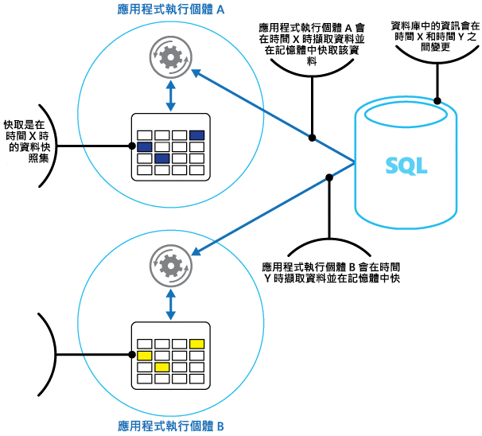
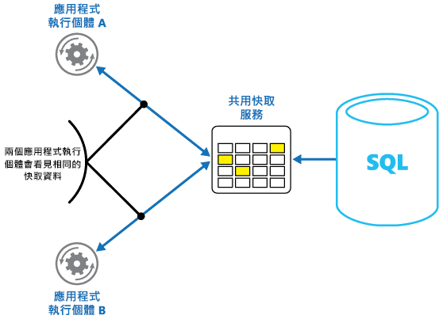

# <a name="caching"></a><span data-ttu-id="0ae12-103">快取</span><span class="sxs-lookup"><span data-stu-id="0ae12-103">Caching</span></span>

<span data-ttu-id="0ae12-104">快取是改善系統的效能和延展性的常用技術。</span><span class="sxs-lookup"><span data-stu-id="0ae12-104">Caching is a common technique that aims to improve the performance and scalability of a system.</span></span> <span data-ttu-id="0ae12-105">這樣做的方法是暫時將經常存取的資料複製到所在位置接近應用程式的快速儲存體中。</span><span class="sxs-lookup"><span data-stu-id="0ae12-105">It does this by temporarily copying frequently accessed data to fast storage that's located close to the application.</span></span> <span data-ttu-id="0ae12-106">如果這個快速資料儲存體比原始來源的位置更接近應用程式，則快取可以透過更快速地提供資料，大幅改善用戶端應用程式的回應時間。</span><span class="sxs-lookup"><span data-stu-id="0ae12-106">If this fast data storage is located closer to the application than the original source, then caching can significantly improve response times for client applications by serving data more quickly.</span></span>

<span data-ttu-id="0ae12-107">當應用程式執行個體重複讀取相同資料時，快取是最有效率的做法，特別是在原始資料存放區符合下列所有條件時：</span><span class="sxs-lookup"><span data-stu-id="0ae12-107">Caching is most effective when a client instance repeatedly reads the same data, especially if all the following conditions apply to the original data store:</span></span>

* <span data-ttu-id="0ae12-108">它會保持相對靜態。</span><span class="sxs-lookup"><span data-stu-id="0ae12-108">It remains relatively static.</span></span>
* <span data-ttu-id="0ae12-109">相較於快取速度，它的速度較慢。</span><span class="sxs-lookup"><span data-stu-id="0ae12-109">It's slow compared to the speed of the cache.</span></span>
* <span data-ttu-id="0ae12-110">受限於高階爭用。</span><span class="sxs-lookup"><span data-stu-id="0ae12-110">It's subject to a high level of contention.</span></span>
* <span data-ttu-id="0ae12-111">當網路延遲導致存取速度變慢時它位於很遠的地方。</span><span class="sxs-lookup"><span data-stu-id="0ae12-111">It's far away when network latency can cause access to be slow.</span></span>

## <a name="caching-in-distributed-applications"></a><span data-ttu-id="0ae12-112">分散式應用程式中的快取</span><span class="sxs-lookup"><span data-stu-id="0ae12-112">Caching in distributed applications</span></span>
<span data-ttu-id="0ae12-113">當快取資料有下列情況時，分散式應用程式通常會實作下列兩個策略或其中之一：</span><span class="sxs-lookup"><span data-stu-id="0ae12-113">Distributed applications typically implement either or both of the following strategies when caching data:</span></span>

* <span data-ttu-id="0ae12-114">使用私人快取，其中資料會保留於執行應用程式或服務執行個體的本機電腦上。</span><span class="sxs-lookup"><span data-stu-id="0ae12-114">Using a private cache, where data is held locally on the computer that's running an instance of an application or service.</span></span>
* <span data-ttu-id="0ae12-115">使用共用快取，作為可由多個處理程序和/或電腦存取的常見來源。</span><span class="sxs-lookup"><span data-stu-id="0ae12-115">Using a shared cache, serving as a common source which can be accessed by multiple processes and/or machines.</span></span>

<span data-ttu-id="0ae12-116">在這兩種情況下，快取可以在用戶端和/或伺服器端上執行。</span><span class="sxs-lookup"><span data-stu-id="0ae12-116">In both cases, caching can be performed client-side and/or server-side.</span></span> <span data-ttu-id="0ae12-117">用戶端快取是透過為系統提供使用者介面的處理程序來完成，例如網頁瀏覽器或傳統型應用程式。</span><span class="sxs-lookup"><span data-stu-id="0ae12-117">Client-side caching is done by the process that provides the user interface for a system, such as a web browser or desktop application.</span></span>
<span data-ttu-id="0ae12-118">伺服器端快取是透過提供從遠端執行的商務服務的處理程序來完成。</span><span class="sxs-lookup"><span data-stu-id="0ae12-118">Server-side caching is done by the process that provides the business services that are running remotely.</span></span>

### <a name="private-caching"></a><span data-ttu-id="0ae12-119">私人快取</span><span class="sxs-lookup"><span data-stu-id="0ae12-119">Private caching</span></span>
<span data-ttu-id="0ae12-120">最基本的快取類型是記憶體內部存放區。</span><span class="sxs-lookup"><span data-stu-id="0ae12-120">The most basic type of cache is an in-memory store.</span></span> <span data-ttu-id="0ae12-121">其會保留於單一處理程序的位址空間中，且可由該處理程序中執行的程式碼直接存取。</span><span class="sxs-lookup"><span data-stu-id="0ae12-121">It's held in the address space of a single process and accessed directly by the code that runs in that process.</span></span> <span data-ttu-id="0ae12-122">此快取類型可進行非常快速的存取。</span><span class="sxs-lookup"><span data-stu-id="0ae12-122">This type of cache is very quick to access.</span></span> <span data-ttu-id="0ae12-123">它也可以提供非常有效的方法來儲存適度的靜態資料量，因為快取大小通常受限於裝載處理程序之電腦上可用的記憶體使用量。</span><span class="sxs-lookup"><span data-stu-id="0ae12-123">It can also provide an extremely effective means for storing modest amounts of static data, since the size of a cache is typically constrained by the volume of memory that's available on the machine hosting the process.</span></span>

<span data-ttu-id="0ae12-124">如果您需要快取比記憶體中實際可用更多的資訊，您可以將快取資料寫入本機檔案系統。</span><span class="sxs-lookup"><span data-stu-id="0ae12-124">If you need to cache more information than is physically possible in memory, you can write cached data to the local file system.</span></span> <span data-ttu-id="0ae12-125">這會比存取保留在記憶體內部的資料更慢，但應該還是會比透過網路擷取資料更快且更可靠。</span><span class="sxs-lookup"><span data-stu-id="0ae12-125">This will be slower to access than data that's held in-memory, but should still be faster and more reliable than retrieving data across a network.</span></span>

<span data-ttu-id="0ae12-126">如果您同時執行多個使用此模型的應用程式執行個體，每個應用程式執行個體都會有自己獨立的快取，並保留它自己的資料複本。</span><span class="sxs-lookup"><span data-stu-id="0ae12-126">If you have multiple instances of an application that uses this model running concurrently, each application instance has its own independent cache holding its own copy of the data.</span></span>

<span data-ttu-id="0ae12-127">將快取視為過去某個時間點的原始資料快照。</span><span class="sxs-lookup"><span data-stu-id="0ae12-127">Think of a cache as a snapshot of the original data at some point in the past.</span></span> <span data-ttu-id="0ae12-128">如果此資料並非靜態，很可能不同的應用程式執行個體會在其快取中保留不同版本的資料。</span><span class="sxs-lookup"><span data-stu-id="0ae12-128">If this data is not static, it is likely that different application instances hold different versions of the data in their caches.</span></span> <span data-ttu-id="0ae12-129">因此，這些執行個體所執行的相同查詢就會傳回不同的結果，如圖 1 所示。</span><span class="sxs-lookup"><span data-stu-id="0ae12-129">Therefore, the same query performed by these instances can return different results, as shown in Figure 1.</span></span>



<span data-ttu-id="0ae12-131">*圖 1：在不同應用程式執行個體中使用記憶體中快取*</span><span class="sxs-lookup"><span data-stu-id="0ae12-131">*Figure 1: Using an in-memory cache in different instances of an application*</span></span>

### <a name="shared-caching"></a><span data-ttu-id="0ae12-132">共用快取</span><span class="sxs-lookup"><span data-stu-id="0ae12-132">Shared caching</span></span>
<span data-ttu-id="0ae12-133">使用共用快取有助於減少每個快取中可能有不同資料的疑慮，這種情況會在記憶體內部快取中發生。</span><span class="sxs-lookup"><span data-stu-id="0ae12-133">Using a shared cache can help alleviate concerns that data might differ in each cache, which can occur with in-memory caching.</span></span> <span data-ttu-id="0ae12-134">共用快取可確保不同的應用程式執行個體會看到相同的快取資料檢視。</span><span class="sxs-lookup"><span data-stu-id="0ae12-134">Shared caching ensures that different application instances see the same view of cached data.</span></span> <span data-ttu-id="0ae12-135">這樣做的方法是尋找個別位置中的快取，其通常會裝載為個別服務的一部分，如圖 2 所示。</span><span class="sxs-lookup"><span data-stu-id="0ae12-135">It does this by locating the cache in a separate location, typically hosted as part of a separate service, as shown in Figure 2.</span></span>



<span data-ttu-id="0ae12-137">*圖 2：使用共用快取*</span><span class="sxs-lookup"><span data-stu-id="0ae12-137">*Figure 2: Using a shared cache*</span></span>

<span data-ttu-id="0ae12-138">共用快取方式的重要優點是它提供的延展性。</span><span class="sxs-lookup"><span data-stu-id="0ae12-138">An important benefit of the shared caching approach is the scalability it provides.</span></span> <span data-ttu-id="0ae12-139">許多共用快取服務的實作方式，會使用伺服器叢集，並以透明的方式，利用將資料分散到叢集的軟體。</span><span class="sxs-lookup"><span data-stu-id="0ae12-139">Many shared cache services are implemented by using a cluster of servers, and utilize software that distributes the data across the cluster in a transparent manner.</span></span> <span data-ttu-id="0ae12-140">應用程式執行個體只會將要求傳送至快取服務。</span><span class="sxs-lookup"><span data-stu-id="0ae12-140">An application instance simply sends a request to the cache service.</span></span>
<span data-ttu-id="0ae12-141">基本的基礎結構會負責判斷叢集中快取資料的位置。</span><span class="sxs-lookup"><span data-stu-id="0ae12-141">The underlying infrastructure is responsible for determining the location of the cached data in the cluster.</span></span> <span data-ttu-id="0ae12-142">您可以輕鬆地透過新增更多伺服器來擴充快取。</span><span class="sxs-lookup"><span data-stu-id="0ae12-142">You can easily scale the cache by adding more servers.</span></span>

<span data-ttu-id="0ae12-143">共用快取方式有兩個主要缺點︰</span><span class="sxs-lookup"><span data-stu-id="0ae12-143">There are two main disadvantages of the shared caching approach:</span></span>

* <span data-ttu-id="0ae12-144">快取的存取速度變慢，因為它不再本機保留於每個應用程式執行個體中。</span><span class="sxs-lookup"><span data-stu-id="0ae12-144">The cache is slower to access because it is no longer held locally to each application instance.</span></span>
* <span data-ttu-id="0ae12-145">實作個別快取服務的需求可能會增加方案的複雜性。</span><span class="sxs-lookup"><span data-stu-id="0ae12-145">The requirement to implement a separate cache service might add complexity to the solution.</span></span>

## <a name="considerations-for-using-caching"></a><span data-ttu-id="0ae12-146">使用快取的考量</span><span class="sxs-lookup"><span data-stu-id="0ae12-146">Considerations for using caching</span></span>
<span data-ttu-id="0ae12-147">下列各節更詳細地說明設計和使用快取的考量。</span><span class="sxs-lookup"><span data-stu-id="0ae12-147">The following sections describe in more detail the considerations for designing and using a cache.</span></span>

### <a name="decide-when-to-cache-data"></a><span data-ttu-id="0ae12-148">決定快取資料的時機</span><span class="sxs-lookup"><span data-stu-id="0ae12-148">Decide when to cache data</span></span>
<span data-ttu-id="0ae12-149">快取可大幅改善效能、延展性和可用性。</span><span class="sxs-lookup"><span data-stu-id="0ae12-149">Caching can dramatically improve performance, scalability, and availability.</span></span> <span data-ttu-id="0ae12-150">您擁有的資料越多且需要存取此資料的使用者數量越大，快取的優點就會更顯著。</span><span class="sxs-lookup"><span data-stu-id="0ae12-150">The more data that you have and the larger the number of users that need to access this data, the greater the benefits of caching become.</span></span> <span data-ttu-id="0ae12-151">這是因為快取可減少與處理原始資料存放區中大量並行要求相關聯的延遲和爭用。</span><span class="sxs-lookup"><span data-stu-id="0ae12-151">That's because caching reduces the latency and contention that's associated with handling large volumes of concurrent requests in the original data store.</span></span>

<span data-ttu-id="0ae12-152">例如，資料庫可能支援有限的並行連接數目。</span><span class="sxs-lookup"><span data-stu-id="0ae12-152">For example, a database might support a limited number of concurrent connections.</span></span> <span data-ttu-id="0ae12-153">但是會從共用快取擷取資料而非基礎資料庫，即使目前可用的連接數目已用盡，還是能讓用戶端應用程式存取此資料。</span><span class="sxs-lookup"><span data-stu-id="0ae12-153">Retrieving data from a shared cache, however, rather than the underlying database, makes it possible for a client application to access this data even if the number of available connections is currently exhausted.</span></span> <span data-ttu-id="0ae12-154">此外，如果資料庫變成無法使用，用戶端應用程式或許能夠透過使用快取中保留的資料繼續執行。</span><span class="sxs-lookup"><span data-stu-id="0ae12-154">Additionally, if the database becomes unavailable, client applications might be able to continue by using the data that's held in the cache.</span></span>

<span data-ttu-id="0ae12-155">請考慮快取經常讀取但很少修改的資料 (例如，讀取作業比例高於寫入作業比例的資料)。</span><span class="sxs-lookup"><span data-stu-id="0ae12-155">Consider caching data that is read frequently but modified infrequently (for example, data that has a higher proportion of read operations than write operations).</span></span> <span data-ttu-id="0ae12-156">不過，不建議您將快取用作授權的重要資訊存放區，</span><span class="sxs-lookup"><span data-stu-id="0ae12-156">However, we don't recommend that you use the cache as the authoritative store of critical information.</span></span> <span data-ttu-id="0ae12-157">而是確定應用程式無法承受遺失的所有變更一律會儲存至永續性資料存放區</span><span class="sxs-lookup"><span data-stu-id="0ae12-157">Instead, ensure that all changes that your application cannot afford to lose are always saved to a persistent data store.</span></span> <span data-ttu-id="0ae12-158">這表示，如果快取無法使用，您的應用程式還是可以使用資料存放區繼續執行作業，而您將不會遺失重要資訊。</span><span class="sxs-lookup"><span data-stu-id="0ae12-158">This means that if the cache is unavailable, your application can still continue to operate by using the data store, and you won't lose important information.</span></span>

### <a name="determine-how-to-cache-data-effectively"></a><span data-ttu-id="0ae12-159">判斷如何有效率地快取資料</span><span class="sxs-lookup"><span data-stu-id="0ae12-159">Determine how to cache data effectively</span></span>
<span data-ttu-id="0ae12-160">有效地使用快取的關鍵在於決定最適合快取的資料，以及最適合快取的時間。</span><span class="sxs-lookup"><span data-stu-id="0ae12-160">The key to using a cache effectively lies in determining the most appropriate data to cache, and caching it at the appropriate time.</span></span> <span data-ttu-id="0ae12-161">資料會在應用程式第一次擷取時隨選新增至快取。</span><span class="sxs-lookup"><span data-stu-id="0ae12-161">The data can be added to the cache on demand the first time it is retrieved by an application.</span></span> <span data-ttu-id="0ae12-162">這表示應用程式僅需從資料存放區擷取一次資料，而後續存取可透過使用快取來滿足。</span><span class="sxs-lookup"><span data-stu-id="0ae12-162">This means that the application needs to fetch the data only once from the data store, and that subsequent access can be satisfied by using the cache.</span></span>

<span data-ttu-id="0ae12-163">或者，通常當應用程式啟動 (稱為植入) 時，快取會事先填入部分或完整資料。</span><span class="sxs-lookup"><span data-stu-id="0ae12-163">Alternatively, a cache can be partially or fully populated with data in advance, typically when the application starts (an approach known as seeding).</span></span> <span data-ttu-id="0ae12-164">不過，可能不建議實作植入大型快取，因為這種方法在應用程式開始執行時，會在原始資料存放區上造成突發性高負載。</span><span class="sxs-lookup"><span data-stu-id="0ae12-164">However, it might not be advisable to implement seeding for a large cache because this approach can impose a sudden, high load on the original data store when the application starts running.</span></span>

<span data-ttu-id="0ae12-165">通常分析使用模式可協助決定是否要預先填入完整或部分快取，以及選擇要快取的資料。</span><span class="sxs-lookup"><span data-stu-id="0ae12-165">Often an analysis of usage patterns can help you decide whether to fully or partially prepopulate a cache, and to choose the data to cache.</span></span> <span data-ttu-id="0ae12-166">例如，針對定期 (也許是每天) 使用應用程式的客戶，使用靜態使用者設定檔資料植入快取相當實用，但不適用於一週僅使用一次應用程式的客戶。</span><span class="sxs-lookup"><span data-stu-id="0ae12-166">For example, it can be useful to seed the cache with the static user profile data for customers who use the application regularly (perhaps every day), but not for customers who use the application only once a week.</span></span>

<span data-ttu-id="0ae12-167">快取通常適用於固定或很少變更的資料。</span><span class="sxs-lookup"><span data-stu-id="0ae12-167">Caching typically works well with data that is immutable or that changes infrequently.</span></span> <span data-ttu-id="0ae12-168">範例包含參考資訊，例如，電子商務應用程式中的產品和定價資訊，或高建構成本的共用靜態資源。</span><span class="sxs-lookup"><span data-stu-id="0ae12-168">Examples include reference information such as product and pricing information in an e-commerce application, or shared static resources that are costly to construct.</span></span> <span data-ttu-id="0ae12-169">此資料的部分或全部可在應用程式啟動時載入到快取，以便將資源需求降到最低並改善效能。</span><span class="sxs-lookup"><span data-stu-id="0ae12-169">Some or all of this data can be loaded into the cache at application startup to minimize demand on resources and to improve performance.</span></span> <span data-ttu-id="0ae12-170">此外，擁有定期更新快取中參考資料的背景處理程序可能也很恰當，以便確定其處於最新狀態，或在參考資料變更時重新整理快取。</span><span class="sxs-lookup"><span data-stu-id="0ae12-170">It might also be appropriate to have a background process that periodically updates reference data in the cache to ensure it is up to date, or that refreshes the cache when reference data changes.</span></span>

<span data-ttu-id="0ae12-171">儘管此考量有某些例外狀況 (請參閱本文後續的＜快取高動態資料＞一節，以取得詳細資訊)，快取還是較不適合動態資料。</span><span class="sxs-lookup"><span data-stu-id="0ae12-171">Caching is less useful for dynamic data, although there are some exceptions to this consideration (see the section Cache highly dynamic data later in this article for more information).</span></span> <span data-ttu-id="0ae12-172">當原始資料定期變更時，快取的資訊會變得很快過時，或為了讓快取與原始資料存放區同步而產生額外負荷，因而導致降低快取的效益。</span><span class="sxs-lookup"><span data-stu-id="0ae12-172">When the original data changes regularly, either the cached information becomes stale very quickly or the overhead of synchronizing the cache with the original data store reduces the effectiveness of caching.</span></span>

<span data-ttu-id="0ae12-173">請注意，快取並未包含實體的完整資料。</span><span class="sxs-lookup"><span data-stu-id="0ae12-173">Note that a cache does not have to include the complete data for an entity.</span></span> <span data-ttu-id="0ae12-174">舉例來說，如果資料項目代表多重值物件 (例如，具有名稱、地址和帳戶餘額的銀行客戶)，則其中某些項目可能會維持靜態 (例如名稱和地址)，而其他項目 (例如帳戶餘額) 可能更為動態。</span><span class="sxs-lookup"><span data-stu-id="0ae12-174">For example, if a data item represents a multivalued object such as a bank customer with a name, address, and account balance, some of these elements might remain static (such as the name and address), while others (such as the account balance) might be more dynamic.</span></span> <span data-ttu-id="0ae12-175">在這些情況下，快取資料的靜態部分，以及只有在需要時擷取 (或計算) 剩餘資訊就相當實用。</span><span class="sxs-lookup"><span data-stu-id="0ae12-175">In these situations, it can be useful to cache the static portions of the data and retrieve (or calculate) only the remaining information when it is required.</span></span>

<span data-ttu-id="0ae12-176">建議您執行效能測試和使用量分析，以判斷快取的預先填入或隨選載入 (或兩者組合) 是否適當。</span><span class="sxs-lookup"><span data-stu-id="0ae12-176">We recommend that you carry out performance testing and usage analysis to determine whether pre-population or on-demand loading of the cache, or a combination of both, is appropriate.</span></span> <span data-ttu-id="0ae12-177">此決定應取決於資料的變動性和使用模式。</span><span class="sxs-lookup"><span data-stu-id="0ae12-177">The decision should be based on the volatility and usage pattern of the data.</span></span> <span data-ttu-id="0ae12-178">快取使用情況和效能分析對於遭遇高度負載，且必須是高度可調整的應用程式中特別重要。</span><span class="sxs-lookup"><span data-stu-id="0ae12-178">Cache utilization and performance analysis is particularly important in applications that encounter heavy loads and must be highly scalable.</span></span> <span data-ttu-id="0ae12-179">例如，在高度可調整的案例中，適合用來植入快取，以在尖峰時間減少資料存放區的負載。</span><span class="sxs-lookup"><span data-stu-id="0ae12-179">For example, in highly scalable scenarios it might make sense to seed the cache to reduce the load on the data store at peak times.</span></span>

<span data-ttu-id="0ae12-180">快取也可以用來在應用程式執行時避免重複計算。</span><span class="sxs-lookup"><span data-stu-id="0ae12-180">Caching can also be used to avoid repeating computations while the application is running.</span></span> <span data-ttu-id="0ae12-181">如果作業轉換資料，或執行複雜的計算，則它可以在快取中儲存作業的結果。</span><span class="sxs-lookup"><span data-stu-id="0ae12-181">If an operation transforms data or performs a complicated calculation, it can save the results of the operation in the cache.</span></span> <span data-ttu-id="0ae12-182">如果後續需要相同的計算，應用程式就能直接從快取擷取結果。</span><span class="sxs-lookup"><span data-stu-id="0ae12-182">If the same calculation is required afterward, the application can simply retrieve the results from the cache.</span></span>

<span data-ttu-id="0ae12-183">應用程式可以修改保留在快取中的資料。</span><span class="sxs-lookup"><span data-stu-id="0ae12-183">An application can modify data that's held in a cache.</span></span> <span data-ttu-id="0ae12-184">不過，建議您將快取視為可能會隨時消失的暫時性資料存放區。</span><span class="sxs-lookup"><span data-stu-id="0ae12-184">However, we recommend thinking of the cache as a transient data store that could disappear at any time.</span></span> <span data-ttu-id="0ae12-185">不要將重要資料只儲存於快取中，而是確定您也會維護原始資料存放區內的資訊。</span><span class="sxs-lookup"><span data-stu-id="0ae12-185">Do not store valuable data in the cache only; make sure that you maintain the information in the original data store as well.</span></span> <span data-ttu-id="0ae12-186">這表示，如果快取變成無法使用，就會降低遺失資料的機會。</span><span class="sxs-lookup"><span data-stu-id="0ae12-186">This means that if the cache becomes unavailable, you minimize the chance of losing data.</span></span>

### <a name="cache-highly-dynamic-data"></a><span data-ttu-id="0ae12-187">快取高動態資料</span><span class="sxs-lookup"><span data-stu-id="0ae12-187">Cache highly dynamic data</span></span>
<span data-ttu-id="0ae12-188">當您在永續性資料存放區中儲存快速變更的資訊時，可能會造成系統過度負荷。</span><span class="sxs-lookup"><span data-stu-id="0ae12-188">When you store rapidly-changing information in a persistent data store, it can impose an overhead on the system.</span></span> <span data-ttu-id="0ae12-189">例如，假設有一個持續報告狀態或其他度量單位的裝置。</span><span class="sxs-lookup"><span data-stu-id="0ae12-189">For example, consider a device that continually reports status or some other measurement.</span></span> <span data-ttu-id="0ae12-190">在快取資訊幾乎一律會過期的情況下，如果應用程式選擇不要快取此資料，則從資料存放區中儲存和擷取此資訊時相同的考量也適用；</span><span class="sxs-lookup"><span data-stu-id="0ae12-190">If an application chooses not to cache this data on the basis that the cached information will nearly always be outdated, then the same consideration could be true when storing and retrieving this information from the data store.</span></span> <span data-ttu-id="0ae12-191">而且在儲存和擷取此資料時，它可能已經變更。</span><span class="sxs-lookup"><span data-stu-id="0ae12-191">In the time it takes to save and fetch this data, it might have changed.</span></span>

<span data-ttu-id="0ae12-192">在這類情況下，請考慮在快取 (而非永續性資料存放區) 中直接儲存動態資訊的優點。</span><span class="sxs-lookup"><span data-stu-id="0ae12-192">In a situation such as this, consider the benefits of storing the dynamic information directly in the cache instead of in the persistent data store.</span></span> <span data-ttu-id="0ae12-193">如果資料不重要且不需稽核，則遺失非經常性變更不會造成任何影響。</span><span class="sxs-lookup"><span data-stu-id="0ae12-193">If the data is non-critical and does not require auditing, then it doesn't matter if the occasional change is lost.</span></span>

### <a name="manage-data-expiration-in-a-cache"></a><span data-ttu-id="0ae12-194">管理快取中的資料到期</span><span class="sxs-lookup"><span data-stu-id="0ae12-194">Manage data expiration in a cache</span></span>
<span data-ttu-id="0ae12-195">在多數情況下，保留於快取中的資料即是保留在原始資料存放區中的資料複本。</span><span class="sxs-lookup"><span data-stu-id="0ae12-195">In most cases, data that's held in a cache is a copy of data that's held in the original data store.</span></span> <span data-ttu-id="0ae12-196">原始資料存放區中的資料可能會在快取後變更，並造成快取資料過時。</span><span class="sxs-lookup"><span data-stu-id="0ae12-196">The data in the original data store might change after it was cached, causing the cached data to become stale.</span></span> <span data-ttu-id="0ae12-197">許多快取系統可讓您設定快取過期資料，並減少資料可能過期的期間。</span><span class="sxs-lookup"><span data-stu-id="0ae12-197">Many caching systems enable you to configure the cache to expire data and reduce the period for which data may be out of date.</span></span>

<span data-ttu-id="0ae12-198">快取的資料到期時會從快取中移除，且應用程式必須從原始資料存放區中擷取資料 (它可以將新擷取的資訊放回快取中)。</span><span class="sxs-lookup"><span data-stu-id="0ae12-198">When cached data expires, it's removed from the cache, and the application must retrieve the data from the original data store (it can put the newly-fetched information back into cache).</span></span> <span data-ttu-id="0ae12-199">當您設定快取時，您可以設定預設到期原則。</span><span class="sxs-lookup"><span data-stu-id="0ae12-199">You can set a default expiration policy when you configure the cache.</span></span> <span data-ttu-id="0ae12-200">在許多快取服務中，當您以程式設計方式將物件儲存在快取時，您也可以規定個別物件的到期時間。</span><span class="sxs-lookup"><span data-stu-id="0ae12-200">In many cache services, you can also stipulate the expiration period for individual objects when you store them programmatically in the cache.</span></span>
<span data-ttu-id="0ae12-201">某些快取可讓您將到期時間指定為絕對值，或是如果未在指定時間內存取，則會從快取移除項目的變化值。</span><span class="sxs-lookup"><span data-stu-id="0ae12-201">Some caches enable you to specify the expiration period as an absolute value, or as a sliding value that causes the item to be removed from the cache if it is not accessed within the specified time.</span></span> <span data-ttu-id="0ae12-202">這項設定會覆寫任何快取範圍的到期原則，但僅會針對指定的物件。</span><span class="sxs-lookup"><span data-stu-id="0ae12-202">This setting overrides any cache-wide expiration policy, but only for the specified objects.</span></span>

> [!NOTE]
> <span data-ttu-id="0ae12-203">仔細思考快取的到期時間和其包含的物件。</span><span class="sxs-lookup"><span data-stu-id="0ae12-203">Consider the expiration period for the cache and the objects that it contains carefully.</span></span> <span data-ttu-id="0ae12-204">如果設定的時間太短，則物件會太快過期，而且會減少您使用快取的優點。</span><span class="sxs-lookup"><span data-stu-id="0ae12-204">If you make it too short, objects will expire too quickly and you will reduce the benefits of using the cache.</span></span> <span data-ttu-id="0ae12-205">如果設定的時間太長，則您需負擔資料過時的風險。</span><span class="sxs-lookup"><span data-stu-id="0ae12-205">If you make the period too long, you risk the data becoming stale.</span></span>
> 
> 

<span data-ttu-id="0ae12-206">如果允許資料長時間維持駐留狀態，則快取也可能會填滿。</span><span class="sxs-lookup"><span data-stu-id="0ae12-206">It's also possible that the cache might fill up if data is allowed to remain resident for a long time.</span></span> <span data-ttu-id="0ae12-207">在此情況下，將新項目新增至快取的任何要求可能導致某些項目遭到強制移除，這稱為收回程序。</span><span class="sxs-lookup"><span data-stu-id="0ae12-207">In this case, any requests to add new items to the cache might cause some items to be forcibly removed in a process known as eviction.</span></span> <span data-ttu-id="0ae12-208">快取服務通常會根據最近最少使用的 (LRU) 原則來收回資料，但您通常可以覆寫此原則，並防止項目遭到收回。</span><span class="sxs-lookup"><span data-stu-id="0ae12-208">Cache services typically evict data on a least-recently-used (LRU) basis, but you can usually override this policy and prevent items from being evicted.</span></span> <span data-ttu-id="0ae12-209">不過，如果您採用這種方法，則需承擔超過快取中可用記憶體的風險。</span><span class="sxs-lookup"><span data-stu-id="0ae12-209">However, if you adopt this approach, you risk exceeding the memory that's available in the cache.</span></span> <span data-ttu-id="0ae12-210">應用程式在嘗試將項目新增至快取時將會失敗並發生例外狀況。</span><span class="sxs-lookup"><span data-stu-id="0ae12-210">An application that attempts to add an item to the cache will fail with an exception.</span></span>

<span data-ttu-id="0ae12-211">某些快取實作可能會提供其他收回原則。</span><span class="sxs-lookup"><span data-stu-id="0ae12-211">Some caching implementations might provide additional eviction policies.</span></span> <span data-ttu-id="0ae12-212">有數個類型的收回原則。</span><span class="sxs-lookup"><span data-stu-id="0ae12-212">There are several types of eviction policies.</span></span> <span data-ttu-id="0ae12-213">其中包含：</span><span class="sxs-lookup"><span data-stu-id="0ae12-213">These include:</span></span>

* <span data-ttu-id="0ae12-214">最近使用的原則 (不再需要資料的預期狀況)。</span><span class="sxs-lookup"><span data-stu-id="0ae12-214">A most-recently-used policy (in the expectation that the data will not be required again).</span></span>
* <span data-ttu-id="0ae12-215">先進先出原則 (先收回最舊的資料)，</span><span class="sxs-lookup"><span data-stu-id="0ae12-215">A first-in-first-out policy (oldest data is evicted first).</span></span>
* <span data-ttu-id="0ae12-216">以觸發事件 (例如要修改的資料) 為基礎的明確移除原則。</span><span class="sxs-lookup"><span data-stu-id="0ae12-216">An explicit removal policy based on a triggered event (such as the data being modified).</span></span>

### <a name="invalidate-data-in-a-client-side-cache"></a><span data-ttu-id="0ae12-217">使用戶端快取中的資料失效</span><span class="sxs-lookup"><span data-stu-id="0ae12-217">Invalidate data in a client-side cache</span></span>
<span data-ttu-id="0ae12-218">保留在用戶端快取中的資料，通常會被視為不屬於提供資料給用戶端的服務支援。</span><span class="sxs-lookup"><span data-stu-id="0ae12-218">Data that's held in a client-side cache is generally considered to be outside the auspices of the service that provides the data to the client.</span></span> <span data-ttu-id="0ae12-219">服務不能直接強制用戶端新增或移除來自用戶端快取的資訊。</span><span class="sxs-lookup"><span data-stu-id="0ae12-219">A service cannot directly force a client to add or remove information from a client-side cache.</span></span>

<span data-ttu-id="0ae12-220">這表示使用設定不良之快取的用戶端，可能會繼續使用過時的資訊。</span><span class="sxs-lookup"><span data-stu-id="0ae12-220">This means that it's possible for a client that uses a poorly configured cache to continue using outdated information.</span></span> <span data-ttu-id="0ae12-221">例如，如果未正確實作快取的到期原則，當原始資料來源中的資訊已變更時，用戶端可能會使用本機快取的過時資訊。</span><span class="sxs-lookup"><span data-stu-id="0ae12-221">For example, if the expiration policies of the cache aren't properly implemented, a client might use outdated information that's cached locally when the information in the original data source has changed.</span></span>

<span data-ttu-id="0ae12-222">如果您正在建置透過 HTTP 連接提供資料的 Web 應用程式，您可以隱含地強制 Web 用戶端 (例如瀏覽器或 Web Proxy) 來擷取最新資訊。</span><span class="sxs-lookup"><span data-stu-id="0ae12-222">If you are building a web application that serves data over an HTTP connection, you can implicitly force a web client (such as a browser or web proxy) to fetch the most recent information.</span></span> <span data-ttu-id="0ae12-223">如果資源是透過變更該資源的 URI 來更新，您就可以執行此動作。</span><span class="sxs-lookup"><span data-stu-id="0ae12-223">You can do this if a resource is updated by a change in the URI of that resource.</span></span> <span data-ttu-id="0ae12-224">Web 用戶端通常會使用資源的 URI 做為用戶端快取中的索引鍵，因此，如果 URI 變更，就會導致 Web 用戶端忽略任何先前快取的資源版本，並改為擷取新的版本。</span><span class="sxs-lookup"><span data-stu-id="0ae12-224">Web clients typically use the URI of a resource as the key in the client-side cache, so if the URI changes, the web client ignores any previously cached versions of a resource and fetches the new version instead.</span></span>

## <a name="managing-concurrency-in-a-cache"></a><span data-ttu-id="0ae12-225">管理快取中的並行存取</span><span class="sxs-lookup"><span data-stu-id="0ae12-225">Managing concurrency in a cache</span></span>
<span data-ttu-id="0ae12-226">快取的設計目的通常是由應用程式的多個執行個體所共用。</span><span class="sxs-lookup"><span data-stu-id="0ae12-226">Caches are often designed to be shared by multiple instances of an application.</span></span> <span data-ttu-id="0ae12-227">每個應用程式執行個體可以讀取和修改快取中的資料。</span><span class="sxs-lookup"><span data-stu-id="0ae12-227">Each application instance can read and modify data in the cache.</span></span> <span data-ttu-id="0ae12-228">因此，對於任何共用資料存放區中所發生相同並行問題也適用於快取。</span><span class="sxs-lookup"><span data-stu-id="0ae12-228">Consequently, the same concurrency issues that arise with any shared data store also apply to a cache.</span></span> <span data-ttu-id="0ae12-229">在應用程式必須修改快取中所保留資料的情況下，您可能需要確保由應用程式的某個執行個體所進行的更新不會覆寫另一個執行個體所做的變更。</span><span class="sxs-lookup"><span data-stu-id="0ae12-229">In a situation where an application needs to modify data that's held in the cache, you might need to ensure that updates made by one instance of the application do not overwrite the changes made by another instance.</span></span>

<span data-ttu-id="0ae12-230">根據資料的本質和衝突的可能性，您可以採用兩種方式其中之一來進行並行存取：</span><span class="sxs-lookup"><span data-stu-id="0ae12-230">Depending on the nature of the data and the likelihood of collisions, you can adopt one of two approaches to concurrency:</span></span>

* <span data-ttu-id="0ae12-231">**開放式。**</span><span class="sxs-lookup"><span data-stu-id="0ae12-231">**Optimistic.**</span></span> <span data-ttu-id="0ae12-232">就在更新資料之前，應用程式會檢查快取中的資料自擷取之後是否已變更。</span><span class="sxs-lookup"><span data-stu-id="0ae12-232">Immediately prior to updating the data, the application checks to see whether the data in the cache has changed since it was retrieved.</span></span> <span data-ttu-id="0ae12-233">如果資料仍然相同，則可以進行變更。</span><span class="sxs-lookup"><span data-stu-id="0ae12-233">If the data is still the same, the change can be made.</span></span> <span data-ttu-id="0ae12-234">否則，應用程式必須決定是否要進行更新 </span><span class="sxs-lookup"><span data-stu-id="0ae12-234">Otherwise, the application has to decide whether to update it.</span></span> <span data-ttu-id="0ae12-235">(衍生此決策的商務邏輯是應用程式特定的)。這種方法適合不常更新，或其中不太可能發生衝突的情況。</span><span class="sxs-lookup"><span data-stu-id="0ae12-235">(The business logic that drives this decision will be application-specific.) This approach is suitable for situations where updates are infrequent, or where collisions are unlikely to occur.</span></span>
* <span data-ttu-id="0ae12-236">**封閉式。**</span><span class="sxs-lookup"><span data-stu-id="0ae12-236">**Pessimistic.**</span></span> <span data-ttu-id="0ae12-237">當應用程式擷取資料時會在快取中鎖定資料，以避免另一個執行個體變更資料。</span><span class="sxs-lookup"><span data-stu-id="0ae12-237">When it retrieves the data, the application locks it in the cache to prevent another instance from changing it.</span></span> <span data-ttu-id="0ae12-238">此處理程序可確保不會發生衝突，但它們也會封鎖其他需要處理相同資料的執行個體。</span><span class="sxs-lookup"><span data-stu-id="0ae12-238">This process ensures that collisions cannot occur, but they can also block other instances that need to process the same data.</span></span> <span data-ttu-id="0ae12-239">封閉式並行存取會影響解決方案的延展性，建議僅用於短期作業。</span><span class="sxs-lookup"><span data-stu-id="0ae12-239">Pessimistic concurrency can affect the scalability of a solution and is recommended only for short-lived operations.</span></span> <span data-ttu-id="0ae12-240">這種方法可能適用於很可能發生衝突的情況，特別是當應用程式更新快取中的多個項目，且必須確保這些變更會一致套用的情況。</span><span class="sxs-lookup"><span data-stu-id="0ae12-240">This approach might be appropriate for situations where collisions are more likely, especially if an application updates multiple items in the cache and must ensure that these changes are applied consistently.</span></span>

### <a name="implement-high-availability-and-scalability-and-improve-performance"></a><span data-ttu-id="0ae12-241">實作高可用性和延展性，並改善效能</span><span class="sxs-lookup"><span data-stu-id="0ae12-241">Implement high availability and scalability, and improve performance</span></span>
<span data-ttu-id="0ae12-242">避免使用快取做為資料的主要儲存機制；這個角色應該是用來填入快取的原始資料存放區。</span><span class="sxs-lookup"><span data-stu-id="0ae12-242">Avoid using a cache as the primary repository of data; this is the role of the original data store from which the cache is populated.</span></span> <span data-ttu-id="0ae12-243">原始資料存放區會負責確保資料的持續性。</span><span class="sxs-lookup"><span data-stu-id="0ae12-243">The original data store is responsible for ensuring the persistence of the data.</span></span>

<span data-ttu-id="0ae12-244">請小心不要將共用快取服務可用性上的重要相依性引入您的解決方案。</span><span class="sxs-lookup"><span data-stu-id="0ae12-244">Be careful not to introduce critical dependencies on the availability of a shared cache service into your solutions.</span></span> <span data-ttu-id="0ae12-245">如果提供共用快取的服務無法使用，則應用程式應該能夠繼續運作。</span><span class="sxs-lookup"><span data-stu-id="0ae12-245">An application should be able to continue functioning if the service that provides the shared cache is unavailable.</span></span> <span data-ttu-id="0ae12-246">應用程式應該不會在等候快取服務繼續時停止回應或失敗。</span><span class="sxs-lookup"><span data-stu-id="0ae12-246">The application should not hang or fail while waiting for the cache service to resume.</span></span>

<span data-ttu-id="0ae12-247">因此，應用程式必須準備好偵測快取服務的可用性，並在無法存取快取時回復為原始資料存放區。</span><span class="sxs-lookup"><span data-stu-id="0ae12-247">Therefore, the application must be prepared to detect the availability of the cache service and fall back to the original data store if the cache is inaccessible.</span></span> <span data-ttu-id="0ae12-248">[Circuit Breaker Pattern (斷路器模式)](http://msdn.microsoft.com/library/dn589784.aspx) 在處理這種案例時相當實用。</span><span class="sxs-lookup"><span data-stu-id="0ae12-248">The [Circuit-Breaker pattern](http://msdn.microsoft.com/library/dn589784.aspx) is useful for handling this scenario.</span></span> <span data-ttu-id="0ae12-249">提供快取的服務可以復原，而且當服務可供使用時，快取會在從原始資料存放區讀取資料時重新填入，並遵循下列策略，例如 [Cache-Aside Pattern (另行快取模式)](http://msdn.microsoft.com/library/dn589799.aspx)。</span><span class="sxs-lookup"><span data-stu-id="0ae12-249">The service that provides the cache can be recovered, and once it becomes available, the cache can be repopulated as data is read form the original data store, following a strategy such as the [Cache-aside pattern](http://msdn.microsoft.com/library/dn589799.aspx).</span></span>

<span data-ttu-id="0ae12-250">不過，如果應用程式在快取暫時無法使用時回復至原始資料存放區，則可能會影響系統延展性。</span><span class="sxs-lookup"><span data-stu-id="0ae12-250">However, there might be a scalability impact on the system if the application falls back to the original data store when the cache is temporarily unavailable.</span></span>
<span data-ttu-id="0ae12-251">復原資料存放區時，原始資料存放區可能忙於處理資料要求，因而導致逾時和連接失敗。</span><span class="sxs-lookup"><span data-stu-id="0ae12-251">While the data store is being recovered, the original data store could be swamped with requests for data, resulting in timeouts and failed connections.</span></span>

<span data-ttu-id="0ae12-252">請考慮在應用程式的每個執行個體中實作本機私人快取，以及所有應用程式執行個體存取的共用快取。</span><span class="sxs-lookup"><span data-stu-id="0ae12-252">Consider implementing a local, private cache in each instance of an application, together with the shared cache that all application instances access.</span></span> <span data-ttu-id="0ae12-253">當應用程式擷取項目時，可能會先檢查它的本機快取，再來是共用快取，最後則是原始資料存放區。</span><span class="sxs-lookup"><span data-stu-id="0ae12-253">When the application retrieves an item, it can check first in its local cache, then in the shared cache, and finally in the original data store.</span></span> <span data-ttu-id="0ae12-254">本機快取可以使用共用快取中的資料填入，或者如果共用快取無法使用，則可使用資料庫中的資料填入。</span><span class="sxs-lookup"><span data-stu-id="0ae12-254">The local cache can be populated using the data in either the shared cache, or in the database if the shared cache is unavailable.</span></span>

<span data-ttu-id="0ae12-255">此方法需要仔細的組態設定，以防止本機快取相對於共用快取變得太過時。</span><span class="sxs-lookup"><span data-stu-id="0ae12-255">This approach requires careful configuration to prevent the local cache from becoming too stale with respect to the shared cache.</span></span> <span data-ttu-id="0ae12-256">但若無法連接到共用快取時，則會使用本機快取做為緩衝區。</span><span class="sxs-lookup"><span data-stu-id="0ae12-256">However, the local cache acts as a buffer if the shared cache is unreachable.</span></span> <span data-ttu-id="0ae12-257">圖 3 會顯示此結構。</span><span class="sxs-lookup"><span data-stu-id="0ae12-257">Figure 3 shows this structure.</span></span>

<span data-ttu-id="0ae12-258">
*圖 3：使用本機的私用快取搭配共用快取*</span><span class="sxs-lookup"><span data-stu-id="0ae12-258">
*Figure 3: Using a local, private cache with a shared cache*</span></span>

<span data-ttu-id="0ae12-259">為了支援保留相當長期資料的大型快取，某些快取服務會在快取無法使用時，提供實作自動容錯移轉的高可用性選項。</span><span class="sxs-lookup"><span data-stu-id="0ae12-259">To support large caches that hold relatively long-lived data, some cache services provide a high-availability option that implements automatic failover if the cache becomes unavailable.</span></span> <span data-ttu-id="0ae12-260">這種方法通常涉及將儲存於主要快取伺服器上的快取資料複寫到次要快取伺服器，且在主要伺服器故障或遺失連接時切換到次要伺服器。</span><span class="sxs-lookup"><span data-stu-id="0ae12-260">This approach typically involves replicating the cached data that's stored on a primary cache server to a secondary cache server, and switching to the secondary server if the primary server fails or connectivity is lost.</span></span>

<span data-ttu-id="0ae12-261">為了減少與寫入多個目的地相關聯的延遲，當資料寫入主要伺服器上的快取時，複寫到次要伺服器的作業可能會以非同步方式發生。</span><span class="sxs-lookup"><span data-stu-id="0ae12-261">To reduce the latency that's associated with writing to multiple destinations, the replication to the secondary server might occur asynchronously when data is written to the cache on the primary server.</span></span> <span data-ttu-id="0ae12-262">這種方法會導致某些快取的資訊可能會在發生錯誤時遺失，但此資料的比例應該小於快取的整體大小。</span><span class="sxs-lookup"><span data-stu-id="0ae12-262">This approach leads to the possibility that some cached information might be lost in the event of a failure, but the proportion of this data should be small compared to the overall size of the cache.</span></span>

<span data-ttu-id="0ae12-263">如果共用快取很大，則在節點上分割快取資料可能很有幫助，可減少爭用的機會，並改善延展性。</span><span class="sxs-lookup"><span data-stu-id="0ae12-263">If a shared cache is large, it might be beneficial to partition the cached data across nodes to reduce the chances of contention and improve scalability.</span></span> <span data-ttu-id="0ae12-264">許多的共用快取支援動態新增 (與移除) 節點，以及重新平衡分割之間資料的功能。</span><span class="sxs-lookup"><span data-stu-id="0ae12-264">Many shared caches support the ability to dynamically add (and remove) nodes and rebalance the data across partitions.</span></span> <span data-ttu-id="0ae12-265">這種方法可能牽涉到叢集，節點的集合會向用戶端應用程式顯示為隨選即用的單一快取。</span><span class="sxs-lookup"><span data-stu-id="0ae12-265">This approach might involve clustering, in which the collection of nodes is presented to client applications as a seamless, single cache.</span></span> <span data-ttu-id="0ae12-266">但內部的資料會分散在節點之間，並遵循某些預先定義的散發策略，以便平均地平衡負載。</span><span class="sxs-lookup"><span data-stu-id="0ae12-266">Internally, however, the data is dispersed between nodes following a predefined distribution strategy that balances the load evenly.</span></span> <span data-ttu-id="0ae12-267">Microsoft 網站上的 [資料分割指引文件](http://msdn.microsoft.com/library/dn589795.aspx) 提供關於可能分割策略的詳細資訊。</span><span class="sxs-lookup"><span data-stu-id="0ae12-267">The [Data partitioning guidance document](http://msdn.microsoft.com/library/dn589795.aspx) on the Microsoft website provides more information about possible partitioning strategies.</span></span>

<span data-ttu-id="0ae12-268">叢集也可以進一步提高快取的可用性。</span><span class="sxs-lookup"><span data-stu-id="0ae12-268">Clustering can also increase the availability of the cache.</span></span> <span data-ttu-id="0ae12-269">如果節點失敗，則快取的其餘部分仍然可以存取。</span><span class="sxs-lookup"><span data-stu-id="0ae12-269">If a node fails, the remainder of the cache is still accessible.</span></span>
<span data-ttu-id="0ae12-270">使用叢集時經常搭配複寫和容錯移轉。</span><span class="sxs-lookup"><span data-stu-id="0ae12-270">Clustering is frequently used in conjunction with replication and failover.</span></span> <span data-ttu-id="0ae12-271">每個節點皆可複寫，且複本會在節點失敗時快速上線。</span><span class="sxs-lookup"><span data-stu-id="0ae12-271">Each node can be replicated, and the replica can be quickly brought online if the node fails.</span></span>

<span data-ttu-id="0ae12-272">許多讀取和寫入作業可能涉及單一資料值或物件。</span><span class="sxs-lookup"><span data-stu-id="0ae12-272">Many read and write operations are likely to involve single data values or objects.</span></span> <span data-ttu-id="0ae12-273">不過，有時可能必須快速儲存或擷取大量資料。</span><span class="sxs-lookup"><span data-stu-id="0ae12-273">However, at times it might be necessary to store or retrieve large volumes of data quickly.</span></span>
<span data-ttu-id="0ae12-274">例如，植入快取可能涉及將數百或數千個項目寫入至快取。</span><span class="sxs-lookup"><span data-stu-id="0ae12-274">For example, seeding a cache could involve writing hundreds or thousands of items to the cache.</span></span> <span data-ttu-id="0ae12-275">應用程式也可能需要從快取中擷取大量相關項目，以做為相同要求的一部分。</span><span class="sxs-lookup"><span data-stu-id="0ae12-275">An application might also need to retrieve a large number of related items from the cache as part of the same request.</span></span>

<span data-ttu-id="0ae12-276">許多大型快取會針對這些用途提供批次作業。</span><span class="sxs-lookup"><span data-stu-id="0ae12-276">Many large-scale caches provide batch operations for these purposes.</span></span> <span data-ttu-id="0ae12-277">這讓用戶端應用程式可將大量項目封裝成單一要求，並在執行大量的小型要求時減少相關聯的過度負荷。</span><span class="sxs-lookup"><span data-stu-id="0ae12-277">This enables a client application to package up a large volume of items into a single request and reduces the overhead that's associated with performing a large number of small requests.</span></span>

## <a name="caching-and-eventual-consistency"></a><span data-ttu-id="0ae12-278">快取和最終一致性</span><span class="sxs-lookup"><span data-stu-id="0ae12-278">Caching and eventual consistency</span></span>
<span data-ttu-id="0ae12-279">若要讓另行快取模式能夠運作，填入快取的應用程式執行個體，必須可存取最新且一致的資料版本。</span><span class="sxs-lookup"><span data-stu-id="0ae12-279">For the cache-aside pattern to work, the instance of the application that populates the cache must have access to the most recent and consistent version of the data.</span></span> <span data-ttu-id="0ae12-280">在實作最終一致性 (例如複寫的資料存放區) 的系統中，這可能不會如此。</span><span class="sxs-lookup"><span data-stu-id="0ae12-280">In a system that implements eventual consistency (such as a replicated data store) this might not be the case.</span></span>

<span data-ttu-id="0ae12-281">一個應用程式的執行個體可以修改資料項目，使該項目的快取版本失效。</span><span class="sxs-lookup"><span data-stu-id="0ae12-281">One instance of an application could modify a data item and invalidate the cached version of that item.</span></span> <span data-ttu-id="0ae12-282">應用程式的另一個執行個體可能會嘗試從快取中讀取此項目 (這會導致快取遺漏)，因此它會從資料存放區讀取資料，並將它新增至快取。</span><span class="sxs-lookup"><span data-stu-id="0ae12-282">Another instance of the application might attempt to read this item from a cache, which causes a cache-miss, so it reads the data from the data store and adds it to the cache.</span></span> <span data-ttu-id="0ae12-283">不過，如果資料存放區沒有完全與其他複本同步，則應用程式執行個體可能會使用舊值來讀取並填入快取。</span><span class="sxs-lookup"><span data-stu-id="0ae12-283">However, if the data store has not been fully synchronized with the other replicas, the application instance could read and populate the cache with the old value.</span></span>

<span data-ttu-id="0ae12-284">如需處理資料一致性的詳細資訊，請參閱[資料一致性入門](http://msdn.microsoft.com/library/dn589800.aspx)。</span><span class="sxs-lookup"><span data-stu-id="0ae12-284">For more information about handling data consistency, see the [Data consistency primer](http://msdn.microsoft.com/library/dn589800.aspx).</span></span>

### <a name="protect-cached-data"></a><span data-ttu-id="0ae12-285">保護快取的資料</span><span class="sxs-lookup"><span data-stu-id="0ae12-285">Protect cached data</span></span>
<span data-ttu-id="0ae12-286">無論您使用的快取服務為何，都要考慮如何保護保留於快取中的資料，以避免未經授權的存取。</span><span class="sxs-lookup"><span data-stu-id="0ae12-286">Irrespective of the cache service you use, consider how to protect the data that's held in the cache from unauthorized access.</span></span> <span data-ttu-id="0ae12-287">其中有兩個主要的考量：</span><span class="sxs-lookup"><span data-stu-id="0ae12-287">There are two main concerns:</span></span>

* <span data-ttu-id="0ae12-288">快取中資料的隱私權。</span><span class="sxs-lookup"><span data-stu-id="0ae12-288">The privacy of the data in the cache.</span></span>
* <span data-ttu-id="0ae12-289">資料的隱私權可說是在快取和使用快取的應用程式之間流動。</span><span class="sxs-lookup"><span data-stu-id="0ae12-289">The privacy of data as it flows between the cache and the application that's using the cache.</span></span>

<span data-ttu-id="0ae12-290">為了保護快取中的資料，快取服務可能會實作一項驗證機制，以要求應用程式指定下列內容︰</span><span class="sxs-lookup"><span data-stu-id="0ae12-290">To protect data in the cache, the cache service might implement an authentication mechanism that requires that applications specify the following:</span></span>

* <span data-ttu-id="0ae12-291">哪些身分識別可以存取快取中的資料。</span><span class="sxs-lookup"><span data-stu-id="0ae12-291">Which identities can access data in the cache.</span></span>
* <span data-ttu-id="0ae12-292">允許這些身分識別執行哪些作業 (讀取和寫入)。</span><span class="sxs-lookup"><span data-stu-id="0ae12-292">Which operations (read and write) that these identities are allowed to perform.</span></span>

<span data-ttu-id="0ae12-293">為了在讀取和寫入資料時減少相關聯的過度負荷，在授與身分識別寫入和/或讀取快取的存取權之後，該身分識別就能使用快取中的任何資料。</span><span class="sxs-lookup"><span data-stu-id="0ae12-293">To reduce overhead that's associated with reading and writing data, after an identity has been granted write and/or read access to the cache, that identity can use any data in the cache.</span></span>

<span data-ttu-id="0ae12-294">如果您需要限制快取資料子集的存取權，可執行下列其中一個動作：</span><span class="sxs-lookup"><span data-stu-id="0ae12-294">If you need to restrict access to subsets of the cached data, you can do one of the following:</span></span>

* <span data-ttu-id="0ae12-295">將快取分割為分割區 (使用不同的快取伺服器)，並且僅授與身分識別應允許其使用之分割區的存取權。</span><span class="sxs-lookup"><span data-stu-id="0ae12-295">Split the cache into partitions (by using different cache servers) and only grant access to identities for the partitions that they should be allowed to use.</span></span>
* <span data-ttu-id="0ae12-296">使用不同的金鑰來加密每個子集中的資料，並且僅向應該具有每個子集存取權的身分識別提供加密金鑰。</span><span class="sxs-lookup"><span data-stu-id="0ae12-296">Encrypt the data in each subset by using different keys, and provide the encryption keys only to identities that should have access to each subset.</span></span> <span data-ttu-id="0ae12-297">用戶端應用程式或許仍能擷取快取中的所有資料，但它只能夠解密具有金鑰的資料。</span><span class="sxs-lookup"><span data-stu-id="0ae12-297">A client application might still be able to retrieve all of the data in the cache, but it will only be able to decrypt the data for which it has the keys.</span></span>

<span data-ttu-id="0ae12-298">您也可以在資料於快取中流動進出時給予保護。</span><span class="sxs-lookup"><span data-stu-id="0ae12-298">You must also protect the data as it flows in and out of the cache.</span></span> <span data-ttu-id="0ae12-299">若要執行此動作，您可以依靠網路基礎結構所提供的安全性功能，用戶端應用程式會使用該基礎結構來連接至快取。</span><span class="sxs-lookup"><span data-stu-id="0ae12-299">To do this, you depend on the security features provided by the network infrastructure that client applications use to connect to the cache.</span></span> <span data-ttu-id="0ae12-300">如果在裝載用戶端應用程式的相同組織中使用現場伺服器來實作快取，則網路本身的隔離可能不需要您採取其他步驟。</span><span class="sxs-lookup"><span data-stu-id="0ae12-300">If the cache is implemented using an on-site server within the same organization that hosts the client applications, then the isolation of the network itself might not require you to take  additional steps.</span></span> <span data-ttu-id="0ae12-301">如果快取位於遠端且需要公用網路 (例如網際網路) 上的 TCP 或 HTTP 連接，請考慮實作 SSL。</span><span class="sxs-lookup"><span data-stu-id="0ae12-301">If the cache is located remotely and requires a TCP or HTTP connection over a public network (such as the Internet), consider implementing SSL.</span></span>

## <a name="considerations-for-implementing-caching-with-microsoft-azure"></a><span data-ttu-id="0ae12-302">使用 Microsoft Azure 實作快取的考量</span><span class="sxs-lookup"><span data-stu-id="0ae12-302">Considerations for implementing caching with Microsoft Azure</span></span>
<span data-ttu-id="0ae12-303">Azure 提供了 Azure Redis 快取。</span><span class="sxs-lookup"><span data-stu-id="0ae12-303">Azure provides the Azure Redis Cache.</span></span> <span data-ttu-id="0ae12-304">這是開放原始碼 Redis 快取的實作，可做為 Azure 資料中心的服務來執行。</span><span class="sxs-lookup"><span data-stu-id="0ae12-304">This is an implementation of the open source Redis cache that runs as a service in an Azure datacenter.</span></span> <span data-ttu-id="0ae12-305">它提供可從任何 Azure 應用程式存取的快取服務，無論應用程式實作為雲端服務、網站，或在 Azure 虛擬機器中。</span><span class="sxs-lookup"><span data-stu-id="0ae12-305">It provides a caching service that can be accessed from any Azure application, whether the application is implemented as a cloud service, a website, or inside an Azure virtual machine.</span></span> <span data-ttu-id="0ae12-306">擁有適當存取金鑰的用戶端應用程式可以共用快取。</span><span class="sxs-lookup"><span data-stu-id="0ae12-306">Caches can be shared by client applications that have the appropriate access key.</span></span>

<span data-ttu-id="0ae12-307">Azure Redis 快取是高效能的快取解決方案，提供可用性、延展性和安全性。</span><span class="sxs-lookup"><span data-stu-id="0ae12-307">Azure Redis Cache is a high-performance caching solution that provides availability, scalability and security.</span></span> <span data-ttu-id="0ae12-308">它通常會以分散到一或多部專用電腦上的服務來執行。</span><span class="sxs-lookup"><span data-stu-id="0ae12-308">It typically runs as a service spread across one or more dedicated machines.</span></span> <span data-ttu-id="0ae12-309">它會試著盡可能在記憶體中儲存最多資訊，以確保快速存取。</span><span class="sxs-lookup"><span data-stu-id="0ae12-309">It attempts to store as much information as it can in memory to ensure fast access.</span></span> <span data-ttu-id="0ae12-310">此架構可透過減少執行緩慢的 I/O 作業的需求，用於提供低度延遲和高輸送量。</span><span class="sxs-lookup"><span data-stu-id="0ae12-310">This architecture is intended to provide low latency and high throughput by reducing the need to perform slow I/O operations.</span></span>

 <span data-ttu-id="0ae12-311">Azure Redis 快取可與許多用戶端應用程式所使用的各種 API 相容。</span><span class="sxs-lookup"><span data-stu-id="0ae12-311">Azure Redis Cache is compatible with many of the various APIs that are used by client applications.</span></span> <span data-ttu-id="0ae12-312">如果您現有的應用程式已使用執行內部部署的 Azure Redis 快取，Azure Redis 快取就能在雲端中提供快取的快速移轉路徑。</span><span class="sxs-lookup"><span data-stu-id="0ae12-312">If you have existing applications that already use Azure Redis Cache running on-premises, the Azure Redis Cache provides a quick migration path to caching in the cloud.</span></span>

> [!NOTE]
> <span data-ttu-id="0ae12-313">Azure 也提供受管理的快取服務。</span><span class="sxs-lookup"><span data-stu-id="0ae12-313">Azure also provides the Managed Cache Service.</span></span> <span data-ttu-id="0ae12-314">此服務是根據 Azure Service Fabric 快取引擎來提供。</span><span class="sxs-lookup"><span data-stu-id="0ae12-314">This service is based on the Azure Service Fabric Cache engine.</span></span> <span data-ttu-id="0ae12-315">它可讓您建立可由鬆散結合之應用程式共用的分散式快取。</span><span class="sxs-lookup"><span data-stu-id="0ae12-315">It enables you to create a distributed cache that can be shared by loosely-coupled applications.</span></span> <span data-ttu-id="0ae12-316">快取會託管於 Azure 資料中心內所執行的高效能伺服器上。</span><span class="sxs-lookup"><span data-stu-id="0ae12-316">The cache is hosted on high-performance servers running in an Azure datacenter.</span></span>
> <span data-ttu-id="0ae12-317">不過，此選項不再建議使用，且僅對於已建置使用此選項的現有應用程式提供支援。</span><span class="sxs-lookup"><span data-stu-id="0ae12-317">However, this option is no longer recommended and is only provided to support existing applications that have been built to use it.</span></span> <span data-ttu-id="0ae12-318">針對所有新的開發，請改用 Azure Redis 快取。</span><span class="sxs-lookup"><span data-stu-id="0ae12-318">For all new development, use Azure Redis Cache instead.</span></span>
> 
> <span data-ttu-id="0ae12-319">此外，Azure 支援角色中快取。</span><span class="sxs-lookup"><span data-stu-id="0ae12-319">Additionally, Azure supports in-role caching.</span></span> <span data-ttu-id="0ae12-320">此功能可讓您建立雲端服務專用的快取。</span><span class="sxs-lookup"><span data-stu-id="0ae12-320">This feature enables you to create a cache that's specific to a cloud service.</span></span>
> <span data-ttu-id="0ae12-321">快取是透過 Web 或背景工作角色的執行個體來裝載，僅能由以相同雲端服務部署單位一部分來操作的角色進行存取</span><span class="sxs-lookup"><span data-stu-id="0ae12-321">The cache is hosted by instances of a web or worker role, and can only be accessed by roles that are operating as part of the same cloud service deployment unit.</span></span> <span data-ttu-id="0ae12-322">(部署單位是以雲端服務部署至特定區域的角色執行個體集合)。快取已叢集化，且裝載快取的同一個部署單位中所有角色的執行個體，都會變成相同快取叢集的一部分。</span><span class="sxs-lookup"><span data-stu-id="0ae12-322">(A deployment unit is the set of role instances that are deployed as a cloud service to a specific region.) The cache is clustered, and all instances of the role within the same deployment unit that hosts the cache become part of the same cache cluster.</span></span> <span data-ttu-id="0ae12-323">不過，此選項不再建議使用，且僅對於已建置使用此選項的現有應用程式提供支援。</span><span class="sxs-lookup"><span data-stu-id="0ae12-323">However, this option is no longer recommended and is only provided to support existing applications that have been built to use it.</span></span> <span data-ttu-id="0ae12-324">針對所有新的開發，請改用 Azure Redis 快取。</span><span class="sxs-lookup"><span data-stu-id="0ae12-324">For all new development, use Azure Redis Cache instead.</span></span>
> 
> <span data-ttu-id="0ae12-325">Azure 受管理的快取服務和 Azure In-Role Cache 目前都預定在 2016 年 11 月 16 日淘汰。</span><span class="sxs-lookup"><span data-stu-id="0ae12-325">Both Azure Managed Cache Service and Azure In-Role Cache are currently slated for retirement on November 16th, 2016.</span></span>
> <span data-ttu-id="0ae12-326">我們建議您移轉到 Azure Redis Cache，來為這次淘汰做準備。</span><span class="sxs-lookup"><span data-stu-id="0ae12-326">It is recommended that you migrate to Azure Redis Cache in preparation for this retirement.</span></span> <span data-ttu-id="0ae12-327">如需詳細資訊，請參閱[應該使用哪個 Azure Redis 快取供應項目和大小？](/azure/redis-cache/cache-faq#what-redis-cache-offering-and-size-should-i-use)。</span><span class="sxs-lookup"><span data-stu-id="0ae12-327">For more information, see [What is Azure Redis Cache offering and what size should I use?](/azure/redis-cache/cache-faq#what-redis-cache-offering-and-size-should-i-use).</span></span>
> 
> 

### <a name="features-of-redis"></a><span data-ttu-id="0ae12-328">Redis 的功能</span><span class="sxs-lookup"><span data-stu-id="0ae12-328">Features of Redis</span></span>
 <span data-ttu-id="0ae12-329">Redis 不僅是一種簡易快取伺服器。</span><span class="sxs-lookup"><span data-stu-id="0ae12-329">Redis is more than a simple cache server.</span></span> <span data-ttu-id="0ae12-330">它提供分散式記憶體內部資料庫搭配廣泛的命令集，可支援許多常見案例。</span><span class="sxs-lookup"><span data-stu-id="0ae12-330">It provides a distributed in-memory database with an extensive command set that supports many common scenarios.</span></span> <span data-ttu-id="0ae12-331">相關說明請參閱本文件稍後的＜使用 Redis 快取＞一節。</span><span class="sxs-lookup"><span data-stu-id="0ae12-331">These are described later in this document, in the section Using  Redis caching.</span></span> <span data-ttu-id="0ae12-332">本節將摘要出一些 Redis 所提供的重要功能。</span><span class="sxs-lookup"><span data-stu-id="0ae12-332">This section summarizes some of the key features that Redis provides.</span></span>

### <a name="redis-as-an-in-memory-database"></a><span data-ttu-id="0ae12-333">Redis 作為記憶體中資料庫</span><span class="sxs-lookup"><span data-stu-id="0ae12-333">Redis as an in-memory database</span></span>
<span data-ttu-id="0ae12-334">Redis 同時支援讀取和寫入作業。</span><span class="sxs-lookup"><span data-stu-id="0ae12-334">Redis supports both read and write operations.</span></span> <span data-ttu-id="0ae12-335">在 Redis 中，寫入可以透過在本機快照集檔案或僅限附加的記錄檔中定期儲存，來提供保護以防止系統失敗。</span><span class="sxs-lookup"><span data-stu-id="0ae12-335">In Redis, writes can be protected from system failure either by being stored  periodically in a local snapshot file or in an append-only log file.</span></span> <span data-ttu-id="0ae12-336">這與許多快取不同 (應將其視為暫時性資料存放區)。</span><span class="sxs-lookup"><span data-stu-id="0ae12-336">This is not the case in many caches (which should be considered  transitory data stores).</span></span>

 <span data-ttu-id="0ae12-337">所有寫入皆為非同步，且不會封鎖用戶端讀取和寫入資料。</span><span class="sxs-lookup"><span data-stu-id="0ae12-337">All writes are asynchronous and do not block clients from reading and writing data.</span></span> <span data-ttu-id="0ae12-338">當 Redis 開始執行時，它會從快照集或記錄檔讀取資料，並使用它來建構記憶體中快取。</span><span class="sxs-lookup"><span data-stu-id="0ae12-338">When Redis starts running, it reads the data from the snapshot or log file and uses it to construct the in-memory cache.</span></span> <span data-ttu-id="0ae12-339">如需詳細資訊，請參閱 Redis 網站上的 [Redis Persistence (Redis 持續性)](http://redis.io/topics/persistence) 。</span><span class="sxs-lookup"><span data-stu-id="0ae12-339">For more information, see [Redis persistence](http://redis.io/topics/persistence) on the Redis website.</span></span>

> [!NOTE]
> <span data-ttu-id="0ae12-340">Redis 不保證所有寫入在發生災難性失敗時皆能儲存，但最糟的情況是，您可能只會遺失幾秒鐘的資料價值。</span><span class="sxs-lookup"><span data-stu-id="0ae12-340">Redis does not guarantee that all writes will be saved in the event of a catastrophic failure, but at worst you might lose only a few seconds worth of data.</span></span> <span data-ttu-id="0ae12-341">請記住，快取並不適合用作授權資料來源，這是應用程式的責任，使用快取以確保重要資料已成功儲存到適當資料存放區。</span><span class="sxs-lookup"><span data-stu-id="0ae12-341">Remember that a cache is not intended to act as an authoritative data source, and it is the responsibility of the applications using the cache to ensure that critical data is saved successfully to an appropriate data store.</span></span> <span data-ttu-id="0ae12-342">如需詳細資訊，請參閱 [Cache-Aside Pattern (另行快取模式)](http://msdn.microsoft.com/library/dn589799.aspx)。</span><span class="sxs-lookup"><span data-stu-id="0ae12-342">For more information, see the [cache-aside pattern](http://msdn.microsoft.com/library/dn589799.aspx).</span></span>
> 
> 

#### <a name="redis-data-types"></a><span data-ttu-id="0ae12-343">Redis 資料類型</span><span class="sxs-lookup"><span data-stu-id="0ae12-343">Redis data types</span></span>
<span data-ttu-id="0ae12-344">Redis 是索引鍵值存放區，其中的值可以包含簡易類型或複雜資料結構，例如雜湊、清單，以及集合。</span><span class="sxs-lookup"><span data-stu-id="0ae12-344">Redis is a key-value store, where values can contain simple types or complex data structures such as hashes, lists, and sets.</span></span> <span data-ttu-id="0ae12-345">它針對這些資料類型支援一組不可部分完成的作業。</span><span class="sxs-lookup"><span data-stu-id="0ae12-345">It supports a set of atomic operations on these data types.</span></span> <span data-ttu-id="0ae12-346">索引鍵可以永久存在或標記為有限的存留時間，屆時索引鍵及其對應值會自動從快取中移除。</span><span class="sxs-lookup"><span data-stu-id="0ae12-346">Keys can be permanent or tagged with a limited time-to-live, at which point the key and its corresponding value are automatically removed from the cache.</span></span> <span data-ttu-id="0ae12-347">如需有關 Redis 索引鍵和值的詳細資訊，請造訪 Redis 網站上的 [An introduction to Redis data types and abstractions (Redis 資料類型與抽象概念簡介)](http://redis.io/topics/data-types-intro) 頁面。</span><span class="sxs-lookup"><span data-stu-id="0ae12-347">For more information about Redis keys and values, visit the page [An introduction to Redis data types and abstractions](http://redis.io/topics/data-types-intro) on the Redis website.</span></span>

#### <a name="redis-replication-and-clustering"></a><span data-ttu-id="0ae12-348">Redis 複寫和叢集</span><span class="sxs-lookup"><span data-stu-id="0ae12-348">Redis replication and clustering</span></span>
<span data-ttu-id="0ae12-349">Redis 支援主要/下層複寫，以協助確保可用性並維護輸送量。</span><span class="sxs-lookup"><span data-stu-id="0ae12-349">Redis supports master/subordinate replication to help ensure availability and maintain throughput.</span></span> <span data-ttu-id="0ae12-350">Redis 主要節點的寫入作業會複寫至一或多個下層節點。</span><span class="sxs-lookup"><span data-stu-id="0ae12-350">Write operations to a Redis master node are replicated to one or more subordinate nodes.</span></span> <span data-ttu-id="0ae12-351">讀取作業可由主要或任何下層節點來提供。</span><span class="sxs-lookup"><span data-stu-id="0ae12-351">Read operations can be served by the master or any of the subordinates.</span></span>

<span data-ttu-id="0ae12-352">至於網路磁碟分割，下層項目可以繼續提供資料，然後在重新建立連接時以透明的方式與主要節點重新同步。</span><span class="sxs-lookup"><span data-stu-id="0ae12-352">In the event of a network partition, subordinates can continue to serve data and then transparently resynchronize with the master when the connection is reestablished.</span></span> <span data-ttu-id="0ae12-353">如需詳細資訊，請造訪 Redis 網站上的 [複寫 (英文)](http://redis.io/topics/replication) 頁面。</span><span class="sxs-lookup"><span data-stu-id="0ae12-353">For further details, visit the [Replication](http://redis.io/topics/replication) page on the Redis website.</span></span>

<span data-ttu-id="0ae12-354">Redis 也提供叢集，其可讓您以透明方式在伺服器之間將資料分割成分區並分散負載。</span><span class="sxs-lookup"><span data-stu-id="0ae12-354">Redis also provides clustering, which enables  you to transparently partition data into shards across servers and spread the load.</span></span> <span data-ttu-id="0ae12-355">此功能可改善延展性，因為可新增新的 Redis 伺服器，並增加資料可重新分割的快取大小。</span><span class="sxs-lookup"><span data-stu-id="0ae12-355">This feature improves scalability, because new Redis servers can be added and the data repartitioned as the size of the cache increases.</span></span>

<span data-ttu-id="0ae12-356">此外，叢集中的每一部伺服器都可以使用主要/下層複寫進行複寫。</span><span class="sxs-lookup"><span data-stu-id="0ae12-356">Furthermore, each server in the cluster can be replicated by using master/subordinate replication.</span></span> <span data-ttu-id="0ae12-357">這可確保整個叢集中每個節點的可用性</span><span class="sxs-lookup"><span data-stu-id="0ae12-357">This ensures availability across each node in the cluster.</span></span> <span data-ttu-id="0ae12-358">如需有關叢集和分區化的詳細資訊，請造訪 Redis 網站上的 [Redis 叢集教學課程頁面](http://redis.io/topics/cluster-tutorial)。</span><span class="sxs-lookup"><span data-stu-id="0ae12-358">For more information about clustering and sharding, visit the [Redis cluster tutorial page](http://redis.io/topics/cluster-tutorial) on the Redis website.</span></span>

### <a name="redis-memory-use"></a><span data-ttu-id="0ae12-359">Redis 記憶體使用</span><span class="sxs-lookup"><span data-stu-id="0ae12-359">Redis memory use</span></span>
<span data-ttu-id="0ae12-360">Redis 快取的大小有限，其取決於主機電腦上可用的資源。</span><span class="sxs-lookup"><span data-stu-id="0ae12-360">A Redis cache has a finite size that depends on the resources available on the host computer.</span></span> <span data-ttu-id="0ae12-361">當您設定的 Redis 伺服器時，您可以指定伺服器可以使用的記憶體最大數量。</span><span class="sxs-lookup"><span data-stu-id="0ae12-361">When you configure a Redis server, you can specify the maximum amount of memory it can use.</span></span> <span data-ttu-id="0ae12-362">您也可以設定 Redis 快取中的索引鍵，使其具有到期時間，屆時會自動從快取中移除它。</span><span class="sxs-lookup"><span data-stu-id="0ae12-362">You can also configure a key in a Redis cache to have an expiration time, after which it is automatically removed from the cache.</span></span> <span data-ttu-id="0ae12-363">此功能可協助避免記憶體內部快取中填滿老舊或過時的資料。</span><span class="sxs-lookup"><span data-stu-id="0ae12-363">This feature can help prevent the in-memory cache from filling with old or stale data.</span></span>

<span data-ttu-id="0ae12-364">當記憶體填滿時，Redis 可以遵循原則數目自動收回索引鍵及其值。</span><span class="sxs-lookup"><span data-stu-id="0ae12-364">As memory fills up, Redis can automatically evict keys and their values by following a number of policies.</span></span> <span data-ttu-id="0ae12-365">預設值是 LRU (最近最少使用的)，但您也可以選取其他原則，例如，隨機收回索引鍵或完全關閉收回 (在此情況下，當快取已滿時，嘗試將項目新增至快取就會失敗)。</span><span class="sxs-lookup"><span data-stu-id="0ae12-365">The default is LRU (least recently used), but you can also select other policies such as evicting keys at random or turning off eviction altogether (in which, case attempts to add items to the cache fail if it is full).</span></span> <span data-ttu-id="0ae12-366">[Using Redis as an LRU cache (使用 Redis 作為 LRU 快取)](http://redis.io/topics/lru-cache) 頁面提供了詳細資訊。</span><span class="sxs-lookup"><span data-stu-id="0ae12-366">The page [Using Redis as an LRU cache](http://redis.io/topics/lru-cache) provides more information.</span></span>

### <a name="redis-transactions-and-batches"></a><span data-ttu-id="0ae12-367">Redis 交易與批次</span><span class="sxs-lookup"><span data-stu-id="0ae12-367">Redis transactions and batches</span></span>
<span data-ttu-id="0ae12-368">Redis 可讓用戶端應用程式提交一系列的作業，以便在快取中讀取和寫入資料以作為不可部分完成的交易。</span><span class="sxs-lookup"><span data-stu-id="0ae12-368">Redis enables a client application to submit a series of operations that read and write data in the cache as an atomic transaction.</span></span> <span data-ttu-id="0ae12-369">交易中的所有命令保證會循序執行，且其他並行用戶端所發出的命令將不會在兩者之間交互編排。</span><span class="sxs-lookup"><span data-stu-id="0ae12-369">All the commands in the transaction are guaranteed to run sequentially, and no commands issued by other concurrent clients will be interwoven between them.</span></span>

<span data-ttu-id="0ae12-370">不過，這些不是實際上的交易，因為關聯式資料庫會執行它們。</span><span class="sxs-lookup"><span data-stu-id="0ae12-370">However, these are not true transactions as a relational database would perform them.</span></span> <span data-ttu-id="0ae12-371">交易處理包含兩個階段 -- 第一個是在命令排入佇列時，而第二個是在命令執行時。</span><span class="sxs-lookup"><span data-stu-id="0ae12-371">Transaction processing consists of two stages--the first is when the commands are queued, and the second is when the commands are run.</span></span> <span data-ttu-id="0ae12-372">在命令佇列階段期間，用戶端會提交構成交易的命令。</span><span class="sxs-lookup"><span data-stu-id="0ae12-372">During the command queuing stage, the commands that comprise the transaction are submitted by the client.</span></span> <span data-ttu-id="0ae12-373">如果此時發生某種形式的錯誤 (例如，語法錯誤或參數數目不正確)，則 Redis 會拒絕處理整個交易並捨棄它。</span><span class="sxs-lookup"><span data-stu-id="0ae12-373">If some sort of error occurs at this point (such as a syntax error, or the wrong number of parameters) then Redis refuses to process the entire transaction and discards it.</span></span>

<span data-ttu-id="0ae12-374">在執行階段期間，Redis 會循序執行每個佇列中的命令。</span><span class="sxs-lookup"><span data-stu-id="0ae12-374">During the run phase, Redis performs each queued command in sequence.</span></span> <span data-ttu-id="0ae12-375">如果命令在這個階段期間失敗，Redis 會繼續執行下一個佇列中的命令，且不會復原任何已經執行之命令的效果。</span><span class="sxs-lookup"><span data-stu-id="0ae12-375">If a command fails during this phase, Redis continues with the next queued command and does not roll back the effects of any commands that have already been run.</span></span> <span data-ttu-id="0ae12-376">這個簡化的交易形式可協助維護效能，並避免爭用所造成的效能問題。</span><span class="sxs-lookup"><span data-stu-id="0ae12-376">This simplified form of transaction helps to maintain performance and avoid performance problems that are caused by contention.</span></span>

<span data-ttu-id="0ae12-377">Redis 會實作一種開放式鎖定，以便協助維護一致性。</span><span class="sxs-lookup"><span data-stu-id="0ae12-377">Redis does implement a form of optimistic locking to assist in maintaining consistency.</span></span> <span data-ttu-id="0ae12-378">如需使用 Redis 進行交易和鎖定的詳細資訊，請造訪 Redis 網站上的 [交易頁面 (英文)](http://redis.io/topics/transactions) 。</span><span class="sxs-lookup"><span data-stu-id="0ae12-378">For detailed information about transactions and locking with Redis, visit the [Transactions page](http://redis.io/topics/transactions) on the Redis website.</span></span>

<span data-ttu-id="0ae12-379">Redis 也支援非交易式批次要求。</span><span class="sxs-lookup"><span data-stu-id="0ae12-379">Redis also supports non-transactional batching of requests.</span></span> <span data-ttu-id="0ae12-380">用戶端用來將命令傳送到 Redis 伺服器的 Redis 通訊協定，可讓用戶端將以相同要求的一部分來傳送一系列作業。</span><span class="sxs-lookup"><span data-stu-id="0ae12-380">The Redis protocol that clients use to send commands to a Redis server enables a client to send a series of operations as part of the same request.</span></span> <span data-ttu-id="0ae12-381">這有助於減少在網路上的封包分割。</span><span class="sxs-lookup"><span data-stu-id="0ae12-381">This can help to reduce packet fragmentation on the network.</span></span> <span data-ttu-id="0ae12-382">處理批次時，系統會執行每個命令。</span><span class="sxs-lookup"><span data-stu-id="0ae12-382">When the batch is processed, each command is performed.</span></span> <span data-ttu-id="0ae12-383">如果這些命令的任何格式不正確，將會遭到拒絕 (這不會在交易中發生)，但將會執行剩餘的命令。</span><span class="sxs-lookup"><span data-stu-id="0ae12-383">If any of these commands are malformed, they will be rejected (which doesn't happen with a transaction), but the remaining commands will be performed.</span></span> <span data-ttu-id="0ae12-384">此外，也不保證批次中處理命令的相關順序。</span><span class="sxs-lookup"><span data-stu-id="0ae12-384">There is also no guarantee about the order in which the commands in the batch will be processed.</span></span>

### <a name="redis-security"></a><span data-ttu-id="0ae12-385">Redis 安全性</span><span class="sxs-lookup"><span data-stu-id="0ae12-385">Redis security</span></span>
<span data-ttu-id="0ae12-386">Redis 純粹著重於提供資料的快速存取，並設計為在受信任的環境中執行，且僅能由受信任的用戶端存取。</span><span class="sxs-lookup"><span data-stu-id="0ae12-386">Redis is focused purely on providing fast access to data, and is designed to run inside a trusted environment that can be accessed only by trusted clients.</span></span> <span data-ttu-id="0ae12-387">Redis 支援以密碼驗證為基礎的有限安全性模型</span><span class="sxs-lookup"><span data-stu-id="0ae12-387">Redis supports a limited security model based on password authentication.</span></span> <span data-ttu-id="0ae12-388">(可完全移除驗證，但不建議這樣做)。</span><span class="sxs-lookup"><span data-stu-id="0ae12-388">(It is possible to remove authentication completely, although we don't recommend this.)</span></span>

<span data-ttu-id="0ae12-389">所有已驗證的用戶端會共用相同的全域密碼，並存取相同資源。</span><span class="sxs-lookup"><span data-stu-id="0ae12-389">All authenticated clients share the same global password and have access to the same resources.</span></span> <span data-ttu-id="0ae12-390">如果您需要更完整的登入安全性，您必須在 Redis 伺服器之前實作自己的安全性層級，且所有用戶端要求應通過這個額外的層級。</span><span class="sxs-lookup"><span data-stu-id="0ae12-390">If you need more comprehensive sign-in security, you must implement your own security layer in front of the Redis server, and all client requests should pass through this additional layer.</span></span> <span data-ttu-id="0ae12-391">Redis 不應直接向不受信任或未經驗證的用戶端公開。</span><span class="sxs-lookup"><span data-stu-id="0ae12-391">Redis should not be directly exposed to untrusted or unauthenticated clients.</span></span>

<span data-ttu-id="0ae12-392">您可以透過停用命令或重新命名命令 (僅為有權限的用戶端提供新名稱) 來限制命令的存取。</span><span class="sxs-lookup"><span data-stu-id="0ae12-392">You can restrict access to commands by disabling them or renaming them (and by providing only privileged clients with the new names).</span></span>

<span data-ttu-id="0ae12-393">Redis 不直接支援任何形式的資料加密，因此所有編碼必須由用戶端應用程式執行。</span><span class="sxs-lookup"><span data-stu-id="0ae12-393">Redis does not directly support any form of data encryption, so all encoding must be performed by client applications.</span></span> <span data-ttu-id="0ae12-394">此外，Redis 不提供任何形式的傳輸安全性。</span><span class="sxs-lookup"><span data-stu-id="0ae12-394">Additionally, Redis does not provide any form of transport security.</span></span> <span data-ttu-id="0ae12-395">如果您基於資料在網路上流通而需要保護資料，建議實作 SSL Proxy。</span><span class="sxs-lookup"><span data-stu-id="0ae12-395">If you need to protect data as it flows across the network, we recommend implementing an SSL proxy.</span></span>

<span data-ttu-id="0ae12-396">如需詳細資訊，請造訪 Redis 網站上的 [Redis Security (Redis 安全性)](http://redis.io/topics/security) 頁面。</span><span class="sxs-lookup"><span data-stu-id="0ae12-396">For more information, visit the [Redis security](http://redis.io/topics/security) page on the Redis website.</span></span>

> [!NOTE]
> <span data-ttu-id="0ae12-397">Azure Redis 快取透過所連接的用戶端提供自己的安全性層級。</span><span class="sxs-lookup"><span data-stu-id="0ae12-397">Azure Redis Cache provides its own security layer through which clients connect.</span></span> <span data-ttu-id="0ae12-398">基本的 Redis 伺服器不會向公用網路公開。</span><span class="sxs-lookup"><span data-stu-id="0ae12-398">The underlying Redis servers are not exposed to the public network.</span></span>
> 
> 

### <a name="azure-redis-cache"></a><span data-ttu-id="0ae12-399">Azure Redis 快取</span><span class="sxs-lookup"><span data-stu-id="0ae12-399">Azure Redis cache</span></span>
<span data-ttu-id="0ae12-400">Azure Redis 快取提供 Redis 伺服器的存取權，該伺服器裝載於 Azure 資料中心。</span><span class="sxs-lookup"><span data-stu-id="0ae12-400">Azure Redis Cache provides access to Redis servers that are hosted at an Azure datacenter.</span></span> <span data-ttu-id="0ae12-401">它可做為提供存取控制與安全性的表面。</span><span class="sxs-lookup"><span data-stu-id="0ae12-401">It acts as a façade that provides access control and security.</span></span> <span data-ttu-id="0ae12-402">您可以使用 Azure 入口網站來佈建快取。</span><span class="sxs-lookup"><span data-stu-id="0ae12-402">You can provision a cache by using the Azure  portal.</span></span>

<span data-ttu-id="0ae12-403">此入口網站會提供數個預先定義的組態。</span><span class="sxs-lookup"><span data-stu-id="0ae12-403">The portal provides a number of predefined configurations.</span></span> <span data-ttu-id="0ae12-404">範圍可從執行專用服務的 53 GB 快取，用來支援 SSL 通訊 (適用於隱私權) 以及主要/下層複寫搭配 99.9% 可用性的 SLA，到共用硬體上所執行不含複寫 (無可用性保證) 的 250 MB 快取。</span><span class="sxs-lookup"><span data-stu-id="0ae12-404">These range from a 53 GB cache running as a dedicated service that supports SSL communications (for privacy) and master/subordinate replication with an SLA of 99.9% availability, down to a 250 MB cache without replication (no availability guarantees) running on shared hardware.</span></span>

<span data-ttu-id="0ae12-405">您也可以使用 Azure 入口網站來設定快取的收回原則，並透過將使用者新增至所提供角色來控制快取的存取權。</span><span class="sxs-lookup"><span data-stu-id="0ae12-405">Using the Azure portal, you can also configure the eviction policy of the cache, and control access to the cache by adding users to the roles provided.</span></span>  <span data-ttu-id="0ae12-406">這些角色會定義成員可執行的作業，其中包含擁有者、參與者和讀取者。</span><span class="sxs-lookup"><span data-stu-id="0ae12-406">These roles, which  define the operations that members can perform, include Owner, Contributor, and Reader.</span></span> <span data-ttu-id="0ae12-407">例如，擁有者角色成員擁有快取 (包含安全性) 及其內容的完整控制權，參與者角色成員則可以讀取和寫入快取中的資訊，而讀取者角色成員僅能從快取擷取資料。</span><span class="sxs-lookup"><span data-stu-id="0ae12-407">For example, members of the Owner role have complete control over the cache (including security) and its contents, members of the Contributor role can read and write information in the cache, and members of the Reader role can only retrieve data from the cache.</span></span>

<span data-ttu-id="0ae12-408">多數的系統管理工作都是透過 Azure 入口網站來執行。</span><span class="sxs-lookup"><span data-stu-id="0ae12-408">Most administrative tasks are performed through the Azure portal.</span></span> <span data-ttu-id="0ae12-409">基於這個理由，許多 Redis 標準版中可用的系統管理命令皆無法使用，包含以程式設計方式修改組態、關閉 Redis 伺服器、設定其他下層項目，或強制將資料儲存到磁碟等功能。</span><span class="sxs-lookup"><span data-stu-id="0ae12-409">For this reason, many of the administrative commands that are available in the standard version of Redis are not available, including the ability to modify the configuration programmatically, shut down the Redis server, configure additional subordinates, or forcibly save data to disk.</span></span>

<span data-ttu-id="0ae12-410">Azure 入口網站包含便利的圖形化顯示，可讓您監視快取的效能。</span><span class="sxs-lookup"><span data-stu-id="0ae12-410">The Azure portal includes a convenient graphical display that enables you to monitor the performance of the cache.</span></span> <span data-ttu-id="0ae12-411">例如，您可以檢視建立的連接數目、執行的要求數目、讀取與寫入的資料量，以及快取命中與快取遺漏的數目。</span><span class="sxs-lookup"><span data-stu-id="0ae12-411">For example, you can view the number of connections being made, the number of requests being performed, the volume of reads and writes, and the number of cache hits versus cache misses.</span></span> <span data-ttu-id="0ae12-412">您可以使用此資訊來判斷快取的效率，且可視需要切換至不同的組態，或變更收回原則。</span><span class="sxs-lookup"><span data-stu-id="0ae12-412">Using this information, you can determine the effectiveness of the cache and if necessary, switch to a different configuration or change the eviction policy.</span></span>

<span data-ttu-id="0ae12-413">此外，如果一個或多個關鍵度量落在預期的範圍之外，您可以建立將電子郵件訊息傳送給系統管理員的警示。</span><span class="sxs-lookup"><span data-stu-id="0ae12-413">Additionally, you can create alerts that send email messages to an administrator if one or more critical metrics fall outside of an expected range.</span></span> <span data-ttu-id="0ae12-414">例如，如果快取遺漏數目在最後一小時超過指定的值，則您可能想要警告系統管理員，因為這表示快取可能太小或資料可能太快收回。</span><span class="sxs-lookup"><span data-stu-id="0ae12-414">For example, you might want to alert an administrator if the number of cache misses exceeds a specified value in the last hour, because it means the cache might be too small or data might be being evicted too quickly.</span></span>

<span data-ttu-id="0ae12-415">您也可以監視 CPU、記憶體和快取的網路使用量。</span><span class="sxs-lookup"><span data-stu-id="0ae12-415">You can also monitor the CPU, memory, and network usage for the cache.</span></span>

<span data-ttu-id="0ae12-416">如需顯示如何建立及設定 Azure Redis 快取的進一步資訊和範例，請造訪 Redis 部落格上的 [瀏覽 Azure Redis 快取 (英文)](https://azure.microsoft.com/blog/2014/06/04/lap-around-azure-redis-cache-preview/) 頁面。</span><span class="sxs-lookup"><span data-stu-id="0ae12-416">For further information and examples showing how to create and configure an Azure Redis Cache, visit the page [Lap around Azure Redis Cache](https://azure.microsoft.com/blog/2014/06/04/lap-around-azure-redis-cache-preview/) on the Azure blog.</span></span>

## <a name="caching-session-state-and-html-output"></a><span data-ttu-id="0ae12-417">快取工作階段狀態和 HTML 輸出</span><span class="sxs-lookup"><span data-stu-id="0ae12-417">Caching session state and HTML output</span></span>
<span data-ttu-id="0ae12-418">如果您正在建置使用 Azure Web 角色執行的 ASP.NET Web 應用程式，您可以將工作階段狀態資訊和 HTML 輸出儲存在 Azure Redis 快取中。</span><span class="sxs-lookup"><span data-stu-id="0ae12-418">If you're building ASP.NET web applications that run by using Azure web roles, you can save session state information and HTML output in an Azure Redis Cache.</span></span> <span data-ttu-id="0ae12-419">Azure Redis 快取的工作階段狀態提供者可讓您在 ASP.NET Web 應用程式的不同執行個體之間共用工作階段資訊，並且在用戶端與伺服器親和性無法使用，且快取工作階段記憶體中資料並不適當的 Web 伺服陣列情況下相當實用。</span><span class="sxs-lookup"><span data-stu-id="0ae12-419">The session state provider for Azure Redis Cache enables you to share session information between different instances of an ASP.NET web application, and is very useful in web farm situations where client-server affinity is not available and caching session data in-memory would not be appropriate.</span></span>

<span data-ttu-id="0ae12-420">使用工作階段狀態提供者搭配 Azure Redis 快取可提供幾項優點，包含：</span><span class="sxs-lookup"><span data-stu-id="0ae12-420">Using the session state provider with Azure Redis Cache delivers several benefits, including:</span></span>

* <span data-ttu-id="0ae12-421">與大量的 ASP.NET Web 應用程式執行個體共用工作階段狀態。</span><span class="sxs-lookup"><span data-stu-id="0ae12-421">Sharing session state with a large number of instances of ASP.NET web applications.</span></span>
* <span data-ttu-id="0ae12-422">提供改善的延展性。</span><span class="sxs-lookup"><span data-stu-id="0ae12-422">Providing improved scalability.</span></span>
* <span data-ttu-id="0ae12-423">針對多個讀取者和單一寫入者的相同工作階段狀態資料，支援受控制的並行存取權。</span><span class="sxs-lookup"><span data-stu-id="0ae12-423">Supporting controlled, concurrent access to the same session state data for multiple readers and a single writer.</span></span>
* <span data-ttu-id="0ae12-424">使用壓縮來節省記憶體，並改善網路效能。</span><span class="sxs-lookup"><span data-stu-id="0ae12-424">Using compression to save memory and improve network performance.</span></span>

<span data-ttu-id="0ae12-425">如需詳細資訊，請參閱 [Azure Redis 快取的 ASP.NET 工作階段狀態提供者](/azure/redis-cache/cache-aspnet-session-state-provider/)。</span><span class="sxs-lookup"><span data-stu-id="0ae12-425">For more information, see [ASP.NET session state provider for Azure Redis Cache](/azure/redis-cache/cache-aspnet-session-state-provider/).</span></span>

> [!NOTE]
> <span data-ttu-id="0ae12-426">請勿針對在 Azure 環境以外執行的 ASP.NET 應用程式使用 Azure Redis 快取的工作階段狀態供應器。</span><span class="sxs-lookup"><span data-stu-id="0ae12-426">Do not use the session state provider for Azure Redis Cache with ASP.NET applications that run outside of the Azure environment.</span></span> <span data-ttu-id="0ae12-427">從 Azure 外部存取快取的延遲會消除快取資料的效能優勢。</span><span class="sxs-lookup"><span data-stu-id="0ae12-427">The latency of accessing the cache from outside of Azure can eliminate the performance benefits of caching data.</span></span>
> 
> 

<span data-ttu-id="0ae12-428">同樣地，Azure Redis 快取的輸出快取提供者可讓您儲存透過 ASP.NET Web 應用程式所產生的 HTTP 回應。</span><span class="sxs-lookup"><span data-stu-id="0ae12-428">Similarly, the output cache provider for Azure Redis Cache enables you to save the HTTP responses generated by an ASP.NET web application.</span></span> <span data-ttu-id="0ae12-429">使用輸出快取提供者搭配 Azure Redis 快取，可針對呈現複雜 HTML 輸出的應用程式改善回應時間。</span><span class="sxs-lookup"><span data-stu-id="0ae12-429">Using the output cache provider with Azure Redis Cache can improve the response times of applications that render complex HTML output.</span></span> <span data-ttu-id="0ae12-430">產生類似回應的應用程式執行個體可以使用快取中的共用輸出片段，而不會重新產生此 HTML 輸出。</span><span class="sxs-lookup"><span data-stu-id="0ae12-430">Application instances that generate similar responses can make use of the shared output fragments in the cache rather than generating this HTML output afresh.</span></span> <span data-ttu-id="0ae12-431">如需詳細資訊，請參閱 [Azure Redis 快取的 ASP.NET 工作階段狀態提供者](/azure/redis-cache/cache-aspnet-output-cache-provider/)。</span><span class="sxs-lookup"><span data-stu-id="0ae12-431">For more information, see [ASP.NET output cache provider for Azure Redis Cache](/azure/redis-cache/cache-aspnet-output-cache-provider/).</span></span>

## <a name="building-a-custom-redis-cache"></a><span data-ttu-id="0ae12-432">建置自訂的 Redis 快取</span><span class="sxs-lookup"><span data-stu-id="0ae12-432">Building a custom Redis cache</span></span>
<span data-ttu-id="0ae12-433">Azure Redis 快取可用來做為基礎 Redis 伺服器的表面。</span><span class="sxs-lookup"><span data-stu-id="0ae12-433">Azure Redis Cache acts as a façade to the underlying Redis servers.</span></span> <span data-ttu-id="0ae12-434">目前它支援一組固定的組態，但不提供 Redis 叢集。</span><span class="sxs-lookup"><span data-stu-id="0ae12-434">Currently it supports a fixed set of configurations but does not provide for Redis clustering.</span></span> <span data-ttu-id="0ae12-435">如果您需要 Azure Redis 快取未涵蓋的進階組態 (例如大於 53 GB 的快取)，您可以使用 Azure 虛擬機器來建置並裝載您自己的 Redis 伺服器。</span><span class="sxs-lookup"><span data-stu-id="0ae12-435">If you require an advanced configuration that is not covered by the Azure Redis cache (such as a cache bigger than 53 GB) you can build and host your own Redis servers by using Azure virtual machines.</span></span>

<span data-ttu-id="0ae12-436">因為您在想要實作複寫時可能需要建立數個 VM 做為主要和下層節點，所以這可能是個很複雜的程序。</span><span class="sxs-lookup"><span data-stu-id="0ae12-436">This is a potentially complex process because you might need to create several VMs to act as master and subordinate nodes if you want to implement replication.</span></span> <span data-ttu-id="0ae12-437">此外，如果您想要建立叢集，則需要多部主要和下層伺服器。</span><span class="sxs-lookup"><span data-stu-id="0ae12-437">Furthermore, if you wish to create a cluster, then you need multiple masters and subordinate servers.</span></span> <span data-ttu-id="0ae12-438">可提供高可用性的最小叢集複寫拓撲，以及包含至少六個 VM 並組織成三組主要/下層伺服器配對 (叢集必須包含至少三個主要節點) 的延展性。</span><span class="sxs-lookup"><span data-stu-id="0ae12-438">A minimal clustered replication topology that provides a high degree of availability and scalability comprises at least six VMs organized as three pairs of master/subordinate servers (a cluster must contain at least three master nodes).</span></span>

<span data-ttu-id="0ae12-439">每個主要/下層配對應彼此鄰近，以將延遲降至最低。</span><span class="sxs-lookup"><span data-stu-id="0ae12-439">Each master/subordinate pair should be located close together to minimize latency.</span></span> <span data-ttu-id="0ae12-440">但若您想要找出靠近應用程式，且該應用程式最有可能使用的快取資料，每一組配對可以在位於不同區域的不同 Azure 資料中心內執行。</span><span class="sxs-lookup"><span data-stu-id="0ae12-440">However, each set of pairs can be running in different Azure datacenters located in different regions, if you wish to locate cached data close to the applications that are most likely to use it.</span></span>  <span data-ttu-id="0ae12-441">如需建置和設定作為 Azure VM 執行的 Redis 節點範例，請參閱[在 Azure 中的 CentOS Linux VM 上執行 Redis](http://blogs.msdn.com/b/tconte/archive/2012/06/08/running-redis-on-a-centos-linux-vm-in-windows-azure.aspx)。</span><span class="sxs-lookup"><span data-stu-id="0ae12-441">For an example of building and configuring a Redis node running as an Azure VM, see [Running Redis on a CentOS Linux VM in Azure](http://blogs.msdn.com/b/tconte/archive/2012/06/08/running-redis-on-a-centos-linux-vm-in-windows-azure.aspx).</span></span>

> [!NOTE]
> <span data-ttu-id="0ae12-442">請注意，如果您以這種方式實作自己的 Redis 快取，則必須負責監視、管理和保護服務。</span><span class="sxs-lookup"><span data-stu-id="0ae12-442">Please note that if you implement your own Redis cache in this way, you are responsible for monitoring, managing, and securing the service.</span></span>
> 

## <a name="partitioning-a-redis-cache"></a><span data-ttu-id="0ae12-443">Redis 快取的資料分割</span><span class="sxs-lookup"><span data-stu-id="0ae12-443">Partitioning a Redis cache</span></span>
<span data-ttu-id="0ae12-444">資料分割快取涉及多部電腦之間的分割快取。</span><span class="sxs-lookup"><span data-stu-id="0ae12-444">Partitioning the cache involves splitting the cache across multiple computers.</span></span> <span data-ttu-id="0ae12-445">此結構具有數個優點，可使用單一快取伺服器，包含：</span><span class="sxs-lookup"><span data-stu-id="0ae12-445">This structure gives you several advantages over using a single cache server, including:</span></span>

* <span data-ttu-id="0ae12-446">建立比儲存在單一伺服器上更大的快取。</span><span class="sxs-lookup"><span data-stu-id="0ae12-446">Creating a cache that is much bigger than can be stored on a single server.</span></span>
* <span data-ttu-id="0ae12-447">將資料分散到伺服器，並改善可用性。</span><span class="sxs-lookup"><span data-stu-id="0ae12-447">Distributing data across servers, improving availability.</span></span> <span data-ttu-id="0ae12-448">如果某一部伺服器失敗或變成無法存取，其所保存的資料就會無法使用，但剩餘伺服器上的資料仍然可以存取。</span><span class="sxs-lookup"><span data-stu-id="0ae12-448">If one server fails or becomes inaccessible, the data that it holds is unavailable, but the data on the remaining servers can still be accessed.</span></span> <span data-ttu-id="0ae12-449">至於快取並不重要，因為快取資料只是暫時保留在資料庫中的資料複本。</span><span class="sxs-lookup"><span data-stu-id="0ae12-449">For a cache, this is not crucial because the cached data is only a transient copy of the data that's held in a database.</span></span> <span data-ttu-id="0ae12-450">變成無法存取之伺服器上的快取資料可以改為在不同的伺服器上進行快取。</span><span class="sxs-lookup"><span data-stu-id="0ae12-450">Cached data on a server that becomes inaccessible can be cached on a different server instead.</span></span>
* <span data-ttu-id="0ae12-451">在伺服器之間分配負載，藉此改善效能和延展性。</span><span class="sxs-lookup"><span data-stu-id="0ae12-451">Spreading the load across servers, thereby improving performance and scalability.</span></span>
* <span data-ttu-id="0ae12-452">將資料配置在鄰近供使用者存取的地理位置，因而可降低延遲。</span><span class="sxs-lookup"><span data-stu-id="0ae12-452">Geolocating data close to the users that access it, thus reducing latency.</span></span>

<span data-ttu-id="0ae12-453">至於快取，最常見的資料分割形式是分區化。</span><span class="sxs-lookup"><span data-stu-id="0ae12-453">For a cache, the most common form of partitioning is sharding.</span></span> <span data-ttu-id="0ae12-454">在此策略中，每個分割區 (或分區) 都是獨立存在的 Redis 快取。</span><span class="sxs-lookup"><span data-stu-id="0ae12-454">In this strategy, each partition (or shard) is a Redis cache in its own right.</span></span> <span data-ttu-id="0ae12-455">資料會使用分區化邏輯導向至特定的資料分割，可以使用各種不同的方法來散發資料。</span><span class="sxs-lookup"><span data-stu-id="0ae12-455">Data is directed to a specific partition by using sharding logic, which can use a variety of approaches to distribute the data.</span></span> <span data-ttu-id="0ae12-456">[Sharding Pattern (分區化模式)](http://msdn.microsoft.com/library/dn589797.aspx) 提供有關實作分區化的詳細資訊。</span><span class="sxs-lookup"><span data-stu-id="0ae12-456">The [Sharding pattern](http://msdn.microsoft.com/library/dn589797.aspx) provides more information about implementing sharding.</span></span>

<span data-ttu-id="0ae12-457">若要在 Redis 快取中實作資料分割，您可以採用下列其中一種方法：</span><span class="sxs-lookup"><span data-stu-id="0ae12-457">To implement partitioning in a Redis cache, you can take one of the following approaches:</span></span>

* <span data-ttu-id="0ae12-458">*伺服器端查詢路由。*</span><span class="sxs-lookup"><span data-stu-id="0ae12-458">*Server-side query routing.*</span></span> <span data-ttu-id="0ae12-459">在這項技術中，用戶端應用程式將要求傳送到任何包含快取的 Redis 伺服器 (可能是最接近的伺服器)。</span><span class="sxs-lookup"><span data-stu-id="0ae12-459">In this technique, a client application sends a request to any of the Redis servers that comprise the cache (probably the closest server).</span></span> <span data-ttu-id="0ae12-460">每個 Redis 伺服器會儲存描述資料分割的中繼資料，該資料分割會保存並同時包含關於其他伺服器上磁碟分割的資訊。</span><span class="sxs-lookup"><span data-stu-id="0ae12-460">Each Redis server stores metadata that describes the partition that it holds, and also contains information about which partitions are located on other servers.</span></span> <span data-ttu-id="0ae12-461">Redis 伺服器會檢查用戶端要求。</span><span class="sxs-lookup"><span data-stu-id="0ae12-461">The Redis server examines the client request.</span></span> <span data-ttu-id="0ae12-462">如果它可以在本機解析，就會執行要求的作業，</span><span class="sxs-lookup"><span data-stu-id="0ae12-462">If it can be resolved locally, it will perform the requested operation.</span></span> <span data-ttu-id="0ae12-463">否則會將要求轉送到適當的伺服器。</span><span class="sxs-lookup"><span data-stu-id="0ae12-463">Otherwise it will forward the request on to the appropriate server.</span></span> <span data-ttu-id="0ae12-464">此模型會由 Redis 叢集來實作，而更詳細的描述位於 Redis 網站上的 [Redis 叢集教學課程](http://redis.io/topics/cluster-tutorial)頁面。</span><span class="sxs-lookup"><span data-stu-id="0ae12-464">This model is implemented by Redis clustering, and is described in more detail on the [Redis cluster tutorial](http://redis.io/topics/cluster-tutorial) page on the Redis website.</span></span> <span data-ttu-id="0ae12-465">Redis 叢集對用戶端應用程式而言是透明的，其他 Redis 伺服器可以加入至叢集 (資料會重新分割)，而不需要重新設定用戶端。</span><span class="sxs-lookup"><span data-stu-id="0ae12-465">Redis clustering is transparent to client applications, and additional Redis servers can be added to the cluster (and the data re-partitioned) without requiring that you reconfigure the clients.</span></span>
* <span data-ttu-id="0ae12-466">*用戶端資料分割。*</span><span class="sxs-lookup"><span data-stu-id="0ae12-466">*Client-side partitioning.*</span></span> <span data-ttu-id="0ae12-467">在此模型中，用戶端應用程式包含將要求路由傳送至適當 Redis 伺服器的邏輯 (可能是以程式庫的形式)。</span><span class="sxs-lookup"><span data-stu-id="0ae12-467">In this model, the client application contains logic (possibly in the form of a library) that routes requests to the appropriate Redis server.</span></span> <span data-ttu-id="0ae12-468">這種方法可以搭配 Azure Redis 快取使用。</span><span class="sxs-lookup"><span data-stu-id="0ae12-468">This approach can be used with Azure Redis Cache.</span></span> <span data-ttu-id="0ae12-469">建立多個 Azure Redis 快取 (每個資料分割區一個快取)，並實作將要求路由傳送至正確快取的用戶端邏輯。</span><span class="sxs-lookup"><span data-stu-id="0ae12-469">Create multiple Azure Redis Caches (one for each data partition) and implement the client-side logic that routes the requests to the correct cache.</span></span> <span data-ttu-id="0ae12-470">如果資料分割配置有所變更 (例如，如果建立了其他 Azure Redis 快取)，則用戶端應用程式可能需要重新設定。</span><span class="sxs-lookup"><span data-stu-id="0ae12-470">If the partitioning scheme changes (if additional Azure Redis Caches are created, for example), client applications might need to be reconfigured.</span></span>
* <span data-ttu-id="0ae12-471">*Proxy 輔助資料分割。*</span><span class="sxs-lookup"><span data-stu-id="0ae12-471">*Proxy-assisted partitioning.*</span></span> <span data-ttu-id="0ae12-472">在此配置中，用戶端應用程式會將要求傳送至一個了解如何分割資料的中繼 Proxy 服務，然後將要求路由傳送至適當的 Redis 伺服器。</span><span class="sxs-lookup"><span data-stu-id="0ae12-472">In this scheme, client applications send requests to an intermediary proxy service which understands how the data is partitioned and then routes the request to the appropriate Redis server.</span></span> <span data-ttu-id="0ae12-473">這種方法也可以搭配 Azure Redis 快取使用；Proxy 服務可以實作為 Azure 雲端服務。</span><span class="sxs-lookup"><span data-stu-id="0ae12-473">This approach can also be used with Azure Redis Cache; the proxy service can be implemented as an Azure cloud service.</span></span> <span data-ttu-id="0ae12-474">這種方法需要一層額外的複雜性來實作服務，而且要求的執行時間可能比使用用戶端資料分割的時間更長。</span><span class="sxs-lookup"><span data-stu-id="0ae12-474">This approach requires an additional level of complexity to implement the service, and requests might take longer to perform than using client-side partitioning.</span></span>

<span data-ttu-id="0ae12-475">Redis 網站上的 [資料分割：如何在多個 Redis 執行個體上劃分資料](http://redis.io/topics/partitioning) 頁面會提供關於使用 Redis 實作資料分割的進一步資訊。</span><span class="sxs-lookup"><span data-stu-id="0ae12-475">The page [Partitioning: how to split data among multiple Redis instances](http://redis.io/topics/partitioning) on the Redis website provides further information about implementing partitioning with Redis.</span></span>

### <a name="implement-redis-cache-client-applications"></a><span data-ttu-id="0ae12-476">實作 Redis 快取用戶端應用程式</span><span class="sxs-lookup"><span data-stu-id="0ae12-476">Implement Redis cache client applications</span></span>
<span data-ttu-id="0ae12-477">Redis 支援以多種程式設計語言撰寫的用戶端應用程式。</span><span class="sxs-lookup"><span data-stu-id="0ae12-477">Redis supports client applications written in numerous programming languages.</span></span> <span data-ttu-id="0ae12-478">如果您要使用.NET Framework 來建置新的應用程式，建議的方法是使用 StackExchange.Redis 用戶端程式庫。</span><span class="sxs-lookup"><span data-stu-id="0ae12-478">If you are building new applications by using the .NET Framework, the recommended approach is to use the StackExchange.Redis client library.</span></span> <span data-ttu-id="0ae12-479">此程式庫會提供.NET Framework 物件模型，用來擷取詳細資料以便連接到 Redis 伺服器連接、傳送命令，以及接收回應。</span><span class="sxs-lookup"><span data-stu-id="0ae12-479">This library provides a .NET Framework object model that abstracts the details for connecting to a Redis server, sending commands, and receiving responses.</span></span> <span data-ttu-id="0ae12-480">它是在 Visual Studio 中作為 NuGet 封裝提供使用。</span><span class="sxs-lookup"><span data-stu-id="0ae12-480">It is available in Visual Studio as a NuGet package.</span></span> <span data-ttu-id="0ae12-481">您可以使用這個相同的程式庫，連接至 Azure Redis 快取或 VM 上裝載的自訂 Redis 快取。</span><span class="sxs-lookup"><span data-stu-id="0ae12-481">You can use this same library to connect to an Azure Redis Cache, or a custom Redis cache hosted on a VM.</span></span>

<span data-ttu-id="0ae12-482">若要連接到 Redis 伺服器，您可以使用 `ConnectionMultiplexer` 類別的靜態 `Connect` 方法。</span><span class="sxs-lookup"><span data-stu-id="0ae12-482">To connect to a Redis server you use the static `Connect` method of the `ConnectionMultiplexer` class.</span></span> <span data-ttu-id="0ae12-483">這個方法建立的連接適用於整個用戶端應用程式的存留期，而且相同的連接可供多個並行執行緒使用。</span><span class="sxs-lookup"><span data-stu-id="0ae12-483">The connection that this method creates is designed to be used throughout the lifetime of the client application, and the same connection can be used by multiple concurrent threads.</span></span> <span data-ttu-id="0ae12-484">每次您執行 Redis 操作時請勿重新連接並中斷連接，因為這會降低效能。</span><span class="sxs-lookup"><span data-stu-id="0ae12-484">Do not reconnect and disconnect each time you perform a Redis operation because this can degrade performance.</span></span>

<span data-ttu-id="0ae12-485">您可以指定連接參數，例如 Redis 主機的位址和密碼。</span><span class="sxs-lookup"><span data-stu-id="0ae12-485">You can specify the connection parameters, such as the address of the Redis host and the password.</span></span> <span data-ttu-id="0ae12-486">如果您使用 Azure Redis 快取，則密碼可能是針對 Azure Redis 快取使用 Azure 管理入口網站所產生的主要或次要索引鍵。</span><span class="sxs-lookup"><span data-stu-id="0ae12-486">If you are using Azure Redis Cache, the password  is either the primary or secondary key that is generated for Azure Redis Cache by using the Azure Management portal.</span></span>

<span data-ttu-id="0ae12-487">在您已連線到 Redis 伺服器之後，可以在作為快取的 Redis 資料庫上取得控制代碼。</span><span class="sxs-lookup"><span data-stu-id="0ae12-487">After you have connected to the Redis server, you can obtain a handle on the Redis database that acts as the cache.</span></span> <span data-ttu-id="0ae12-488">Redis 連線提供 `GetDatabase` 方法來執行這項操作。</span><span class="sxs-lookup"><span data-stu-id="0ae12-488">The Redis connection provides the `GetDatabase` method to do this.</span></span> <span data-ttu-id="0ae12-489">您可以使用 `StringGet` 和 `StringSet` 方法，從快取擷取項目並在快取中儲存資料。</span><span class="sxs-lookup"><span data-stu-id="0ae12-489">You can then retrieve items from the cache and store data in the cache by using the `StringGet` and `StringSet` methods.</span></span> <span data-ttu-id="0ae12-490">這些方法預期索引鍵要做為參數使用，並傳回快取中具有相符值的項目 (`StringGet`)，或利用此索引鍵將項目新增至快取 (`StringSet`)。</span><span class="sxs-lookup"><span data-stu-id="0ae12-490">These methods expect a key as a parameter, and return the item either in the cache that has a matching value (`StringGet`) or add the item to the cache with this key (`StringSet`).</span></span>

<span data-ttu-id="0ae12-491">根據 Redis 伺服器的位置，許多作業可能會造成一些延遲，而要求會傳輸到伺服器，且回應會傳回給用戶端。</span><span class="sxs-lookup"><span data-stu-id="0ae12-491">Depending on the location of the Redis server, many operations might incur some latency while a request is transmitted to the server and a response is returned to the client.</span></span> <span data-ttu-id="0ae12-492">StackExchange 程式庫提供許多方法的非同步版本，它會進行公開以便協助用戶端應用程式保持回應狀態。</span><span class="sxs-lookup"><span data-stu-id="0ae12-492">The StackExchange library provides asynchronous versions of many of the methods that it exposes to help client applications remain responsive.</span></span> <span data-ttu-id="0ae12-493">這些方法支援 .NET Framework 中的 [以工作為基礎的非同步模式 (TAP)](http://msdn.microsoft.com/library/hh873175.aspx) 。</span><span class="sxs-lookup"><span data-stu-id="0ae12-493">These methods support the [Task-based Asynchronous Pattern](http://msdn.microsoft.com/library/hh873175.aspx) in the .NET Framework.</span></span>

<span data-ttu-id="0ae12-494">下列程式碼片段示範一個名為 `RetrieveItem`的方法。</span><span class="sxs-lookup"><span data-stu-id="0ae12-494">The following code snippet shows a method named `RetrieveItem`.</span></span> <span data-ttu-id="0ae12-495">其中說明根據 Redis 和 StackExchange 程式庫實作另行快取模式的範例。</span><span class="sxs-lookup"><span data-stu-id="0ae12-495">It illustrates an implementation of the cache-aside pattern based on Redis and the StackExchange library.</span></span> <span data-ttu-id="0ae12-496">此方法接受字串索引值，並透過呼叫 `StringGetAsync` 方法 (`StringGet` 的非同步版本)，嘗試從 Redis 快取中擷取對應的項目。</span><span class="sxs-lookup"><span data-stu-id="0ae12-496">The method takes a string key value and attempts to retrieve the corresponding item from the Redis cache by calling the `StringGetAsync` method (the asynchronous version of `StringGet`).</span></span>

<span data-ttu-id="0ae12-497">如果找不到項目，它會使用 `GetItemFromDataSourceAsync` 方法 (這是本機方法，不屬於 StackExchange 程式庫的一部分)，從基礎資料來源擷取項目。</span><span class="sxs-lookup"><span data-stu-id="0ae12-497">If the item is not found, it is fetched from the underlying data source using the `GetItemFromDataSourceAsync` method (which is a local method and not part of the StackExchange library).</span></span> <span data-ttu-id="0ae12-498">然後使用 `StringSetAsync` 方法新增至快取，以便下一次可以更快速地擷取項目。</span><span class="sxs-lookup"><span data-stu-id="0ae12-498">It's then added to the cache by using the `StringSetAsync` method so it can be retrieved more quickly next time.</span></span>

```csharp
// Connect to the Azure Redis cache
ConfigurationOptions config = new ConfigurationOptions();
config.EndPoints.Add("<your DNS name>.redis.cache.windows.net");
config.Password = "<Redis cache key from management portal>";
ConnectionMultiplexer redisHostConnection = ConnectionMultiplexer.Connect(config);
IDatabase cache = redisHostConnection.GetDatabase();
...
private async Task<string> RetrieveItem(string itemKey)
{
    // Attempt to retrieve the item from the Redis cache
    string itemValue = await cache.StringGetAsync(itemKey);

    // If the value returned is null, the item was not found in the cache
    // So retrieve the item from the data source and add it to the cache
    if (itemValue == null)
    {
        itemValue = await GetItemFromDataSourceAsync(itemKey);
        await cache.StringSetAsync(itemKey, itemValue);
    }

    // Return the item
    return itemValue;
}
```

<span data-ttu-id="0ae12-499">`StringGet` 和 `StringSet` 方法不會限制要擷取或儲存字串值。</span><span class="sxs-lookup"><span data-stu-id="0ae12-499">The `StringGet` and `StringSet` methods are not restricted to retrieving or storing string values.</span></span> <span data-ttu-id="0ae12-500">它們可以接受任何序列化為位元組陣列的項目。</span><span class="sxs-lookup"><span data-stu-id="0ae12-500">They can take any item that is serialized as an array of bytes.</span></span> <span data-ttu-id="0ae12-501">如果您需要儲存 .NET 物件，可將其序列化為位元組資料流，並使用 `StringSet` 方法，將它寫入快取。</span><span class="sxs-lookup"><span data-stu-id="0ae12-501">If you need to save a .NET object, you can serialize it as a byte stream and use the `StringSet` method to write it to the cache.</span></span>

<span data-ttu-id="0ae12-502">同樣地，您可以使用 `StringGet` 方法，從快取中讀取物件，並將其還原序列化為 .NET 物件。</span><span class="sxs-lookup"><span data-stu-id="0ae12-502">Similarly, you can read an object from the cache by using the `StringGet` method and deserializing it as a .NET object.</span></span> <span data-ttu-id="0ae12-503">下列程式碼示範一組 IDatabase 介面的擴充方法 (Redis 連接的 `GetDatabase` 方法會傳回 `IDatabase` 物件)，以及一些使用這些方法來讀取和寫入 `BlogPost` 物件至快取的範例程式碼：</span><span class="sxs-lookup"><span data-stu-id="0ae12-503">The following code shows a set of extension methods for the IDatabase interface (the `GetDatabase` method of a Redis connection returns an `IDatabase` object),  and some sample code that uses these methods to read and write a `BlogPost` object to the cache:</span></span>

```csharp
public static class RedisCacheExtensions
{
    public static async Task<T> GetAsync<T>(this IDatabase cache, string key)
    {
        return Deserialize<T>(await cache.StringGetAsync(key));
    }

    public static async Task<object> GetAsync(this IDatabase cache, string key)
    {
        return Deserialize<object>(await cache.StringGetAsync(key));
    }

    public static async Task SetAsync(this IDatabase cache, string key, object value)
    {
        await cache.StringSetAsync(key, Serialize(value));
    }

    static byte[] Serialize(object o)
    {
        byte[] objectDataAsStream = null;

        if (o != null)
        {
            BinaryFormatter binaryFormatter = new BinaryFormatter();
            using (MemoryStream memoryStream = new MemoryStream())
            {
                binaryFormatter.Serialize(memoryStream, o);
                objectDataAsStream = memoryStream.ToArray();
            }
        }

        return objectDataAsStream;
    }

    static T Deserialize<T>(byte[] stream)
    {
        T result = default(T);

        if (stream != null)
        {
            BinaryFormatter binaryFormatter = new BinaryFormatter();
            using (MemoryStream memoryStream = new MemoryStream(stream))
            {
                result = (T)binaryFormatter.Deserialize(memoryStream);
            }
        }

        return result;
    }
}
```

<span data-ttu-id="0ae12-504">下列程式碼將說明一個稱為 `RetrieveBlogPost` 的方法，該方法會使用這些擴充方法，遵循另行快取模式來讀取和寫入序列化 `BlogPost` 物件至快取：</span><span class="sxs-lookup"><span data-stu-id="0ae12-504">The following code illustrates a method named `RetrieveBlogPost` that uses these extension methods to read and write a serializable `BlogPost` object to the cache following the cache-aside pattern:</span></span>

```csharp
// The BlogPost type
[Serializable]
public class BlogPost
{
    private HashSet<string> tags;

    public BlogPost(int id, string title, int score, IEnumerable<string> tags)
    {
        this.Id = id;
        this.Title = title;
        this.Score = score;
        this.tags = new HashSet<string>(tags);
    }

    public int Id { get; set; }
    public string Title { get; set; }
    public int Score { get; set; }
    public ICollection<string> Tags => this.tags;
}
...
private async Task<BlogPost> RetrieveBlogPost(string blogPostKey)
{
    BlogPost blogPost = await cache.GetAsync<BlogPost>(blogPostKey);
    if (blogPost == null)
    {
        blogPost = await GetBlogPostFromDataSourceAsync(blogPostKey);
        await cache.SetAsync(blogPostKey, blogPost);
    }

    return blogPost;
}
```

<span data-ttu-id="0ae12-505">如果用戶端應用程式傳送多個非同步要求，Redis 支援命令流水線。</span><span class="sxs-lookup"><span data-stu-id="0ae12-505">Redis supports command pipelining if a client application sends multiple asynchronous requests.</span></span> <span data-ttu-id="0ae12-506">Redis 可以使用相同連接來多工處理要求，而非以嚴格的順序接收和回應命令。</span><span class="sxs-lookup"><span data-stu-id="0ae12-506">Redis can multiplex the requests using the same connection rather than receiving and responding to commands in a strict sequence.</span></span>

<span data-ttu-id="0ae12-507">此方法有助於透過更有效率地使用網路來減少延遲。</span><span class="sxs-lookup"><span data-stu-id="0ae12-507">This approach helps to reduce latency by making more efficient use of the network.</span></span> <span data-ttu-id="0ae12-508">下列程式碼片段顯示的範例會同時擷取兩個客戶的詳細資料。</span><span class="sxs-lookup"><span data-stu-id="0ae12-508">The following code snippet shows an example that retrieves the details of two customers concurrently.</span></span> <span data-ttu-id="0ae12-509">程式碼會提交兩個要求，然後執行某些其他處理程序 (未顯示)，再等候接收結果。</span><span class="sxs-lookup"><span data-stu-id="0ae12-509">The code submits two requests and then performs some other processing (not shown) before waiting to receive the results.</span></span> <span data-ttu-id="0ae12-510">快取物件的 `Wait` 方法類似於 .NET Framework `Task.Wait` 方法：</span><span class="sxs-lookup"><span data-stu-id="0ae12-510">The `Wait` method of the cache object is similar to the .NET Framework `Task.Wait` method:</span></span>

```csharp
ConnectionMultiplexer redisHostConnection = ...;
IDatabase cache = redisHostConnection.GetDatabase();
...
var task1 = cache.StringGetAsync("customer:1");
var task2 = cache.StringGetAsync("customer:2");
...
var customer1 = cache.Wait(task1);
var customer2 = cache.Wait(task2);
```

<span data-ttu-id="0ae12-511">如需編寫能使用 Azure Redis 快取的用戶端應用程式的詳細資訊，請參閱 [Azure Redis 快取文件](https://azure.microsoft.com/documentation/services/cache/)。</span><span class="sxs-lookup"><span data-stu-id="0ae12-511">For additional information on writing client applications that can the Azure Redis Cache, see [Azure Redis Cache documentation](https://azure.microsoft.com/documentation/services/cache/).</span></span> <span data-ttu-id="0ae12-512">在[StackExchange.Redis](https://github.com/StackExchange/StackExchange.Redis/blob/master/Docs/Basics.md) 中也有更多詳細資訊。</span><span class="sxs-lookup"><span data-stu-id="0ae12-512">More information is also available at [StackExchange.Redis](https://github.com/StackExchange/StackExchange.Redis/blob/master/Docs/Basics.md).</span></span>

<span data-ttu-id="0ae12-513">同一個網站上的 [Pipelines and multiplexers (管線和多工器)](https://stackexchange.github.io/StackExchange.Redis/PipelinesMultiplexers) 頁面提供更多關於非同步作業以及使用 Redis 與 StackExchange 程式庫透過管線進行傳送的資訊。</span><span class="sxs-lookup"><span data-stu-id="0ae12-513">The page [Pipelines and multiplexers](https://stackexchange.github.io/StackExchange.Redis/PipelinesMultiplexers) on the same website provides more information about asynchronous operations and pipelining with Redis and the StackExchange library.</span></span>  <span data-ttu-id="0ae12-514">本文的下一節＜使用 Redis 快取＞會提供一些更進階的技術範例，以便您套用至保留於 Redis 快取中的資料。</span><span class="sxs-lookup"><span data-stu-id="0ae12-514">The next section in this article, Using  Redis Caching, provides examples of some of the more advanced techniques that you can apply to data that's held in a Redis cache.</span></span>

## <a name="using-redis-caching"></a><span data-ttu-id="0ae12-515">使用 Redis 快取</span><span class="sxs-lookup"><span data-stu-id="0ae12-515">Using Redis caching</span></span>
<span data-ttu-id="0ae12-516">基於快取考量而使用 Redis 的最簡單方法是索引鍵/值配對，其中值是未解譯的字串，可包含任意長度的任何二進位資料</span><span class="sxs-lookup"><span data-stu-id="0ae12-516">The simplest use of Redis for caching concerns is key-value pairs where the value is an uninterpreted string of arbitrary length that can contain any binary data.</span></span> <span data-ttu-id="0ae12-517">(基本上可將它視為字串的位元組陣列)。</span><span class="sxs-lookup"><span data-stu-id="0ae12-517">(It is essentially  an array of bytes that can be treated as a string).</span></span> <span data-ttu-id="0ae12-518">此案例即本文稍早的＜實作 Redis 快取用戶端應用程式＞一節中所說明的情況。</span><span class="sxs-lookup"><span data-stu-id="0ae12-518">This scenario was illustrated in the section Implement Redis Cache client applications earlier in this article.</span></span>

<span data-ttu-id="0ae12-519">請注意，索引鍵也會包含未解譯的資料，因此您可以使用任何二進位資訊做為索引鍵。</span><span class="sxs-lookup"><span data-stu-id="0ae12-519">Note that keys also contain uninterpreted data, so you can use any binary information as the key.</span></span> <span data-ttu-id="0ae12-520">但是索引鍵愈長，就需要花費愈多的空間來儲存，而且執行查閱作業的時間也會愈久。</span><span class="sxs-lookup"><span data-stu-id="0ae12-520">The longer the key is, however, the more space it will take to store, and the longer it will take to perform lookup operations.</span></span> <span data-ttu-id="0ae12-521">如需可用性和維護的方便性，請仔細設計您的 keyspace 並使用有意義 (但非詳細資訊) 的索引鍵。</span><span class="sxs-lookup"><span data-stu-id="0ae12-521">For usability and ease of maintenance, design your keyspace carefully and use meaningful (but not verbose) keys.</span></span>

<span data-ttu-id="0ae12-522">例如，使用結構化的索引鍵，像是 "customer:100" 來表示客戶識別碼為 100 的索引鍵，而非僅以 "100" 表示。</span><span class="sxs-lookup"><span data-stu-id="0ae12-522">For example, use structured keys such as "customer:100" to represent the key for the customer with ID 100 rather than simply "100".</span></span> <span data-ttu-id="0ae12-523">此配置可讓您輕鬆區別儲存不同資料類型之間的值。</span><span class="sxs-lookup"><span data-stu-id="0ae12-523">This scheme enables you to easily distinguish between values that store different data types.</span></span> <span data-ttu-id="0ae12-524">例如，您也可以使用索引鍵 "orders:100" 來表示順序識別碼為 100 的索引鍵。</span><span class="sxs-lookup"><span data-stu-id="0ae12-524">For example, you could also use the key "orders:100" to represent the key for the order with ID 100.</span></span>

<span data-ttu-id="0ae12-525">除了一維的二進位字串，Redis 索引鍵/值配對中的值也可以保留更結構化資訊，包含清單、集合 (已排序和未排序)，以及雜湊。</span><span class="sxs-lookup"><span data-stu-id="0ae12-525">Apart from one-dimensional binary strings, a value in a Redis key-value pair can also hold more structured information, including lists, sets (sorted and unsorted), and hashes.</span></span> <span data-ttu-id="0ae12-526">Redis 提供一組完整的命令集，可處理這些類型，且這些命令當中有許多可透過例如 StackExchange 的用戶端程式庫，使用於 .NET Framework 應用程式。</span><span class="sxs-lookup"><span data-stu-id="0ae12-526">Redis provides a comprehensive command set that can manipulate these types, and many of these commands are available to .NET Framework applications through a client library such as StackExchange.</span></span> <span data-ttu-id="0ae12-527">Redis 網站上的 [Redis 資料類型和抽象概念簡介 (英文)](http://redis.io/topics/data-types-intro) 頁面可針對這些類型和可用來操作這些類型的命令，提供更詳細的概觀。</span><span class="sxs-lookup"><span data-stu-id="0ae12-527">The page [An introduction to Redis data types and abstractions](http://redis.io/topics/data-types-intro) on the Redis website provides a more detailed overview of these types and the commands that you can use to manipulate them.</span></span>

<span data-ttu-id="0ae12-528">本節將針對這些資料類型和命令摘要說明一些常用案例。</span><span class="sxs-lookup"><span data-stu-id="0ae12-528">This section summarizes some common use cases for these data types and commands.</span></span>

### <a name="perform-atomic-and-batch-operations"></a><span data-ttu-id="0ae12-529">執行不可部分完成的作業和批次作業</span><span class="sxs-lookup"><span data-stu-id="0ae12-529">Perform atomic and batch operations</span></span>
<span data-ttu-id="0ae12-530">Redis 支援在字串值上進行一系列不可部分完成的取得和設定作業。</span><span class="sxs-lookup"><span data-stu-id="0ae12-530">Redis supports a series of atomic get-and-set operations on string values.</span></span> <span data-ttu-id="0ae12-531">這些作業會移除使用個別 `GET` 和 `SET` 命令時可能會發生的競爭危險。</span><span class="sxs-lookup"><span data-stu-id="0ae12-531">These operations remove the possible race hazards that might occur when using separate `GET` and `SET` commands.</span></span> <span data-ttu-id="0ae12-532">可用的作業包含：</span><span class="sxs-lookup"><span data-stu-id="0ae12-532">The operations that are available include:</span></span>

* <span data-ttu-id="0ae12-533">`INCR`、`INCRBY`、`DECR` 和 `DECRBY`，用來在整數數字資料值上執行不可部分完成的遞增和遞減作業。</span><span class="sxs-lookup"><span data-stu-id="0ae12-533">`INCR`, `INCRBY`, `DECR`, and `DECRBY`, which perform atomic increment and decrement operations on integer numeric data values.</span></span> <span data-ttu-id="0ae12-534">StackExchange 程式庫會提供 `IDatabase.StringIncrementAsync` 和 `IDatabase.StringDecrementAsync` 方法的多載版本，來執行這些作業，並傳回儲存在快取中的結果值。</span><span class="sxs-lookup"><span data-stu-id="0ae12-534">The StackExchange library provides overloaded versions of the `IDatabase.StringIncrementAsync` and `IDatabase.StringDecrementAsync` methods to perform these operations and return the resulting value that is stored in the cache.</span></span> <span data-ttu-id="0ae12-535">下列程式碼片段說明如何使用這些方法：</span><span class="sxs-lookup"><span data-stu-id="0ae12-535">The following code snippet illustrates how to use these methods:</span></span>
  
  ```csharp
  ConnectionMultiplexer redisHostConnection = ...;
  IDatabase cache = redisHostConnection.GetDatabase();
  ...
  await cache.StringSetAsync("data:counter", 99);
  ...
  long oldValue = await cache.StringIncrementAsync("data:counter");
  // Increment by 1 (the default)
  // oldValue should be 100
  
  long newValue = await cache.StringDecrementAsync("data:counter", 50);
  // Decrement by 50
  // newValue should be 50
  ```
* <span data-ttu-id="0ae12-536">`GETSET`用來擷取與索引鍵相關聯的值，並將其變更為新值。</span><span class="sxs-lookup"><span data-stu-id="0ae12-536">`GETSET`, which retrieves the value that's associated with a key and changes it to a new value.</span></span> <span data-ttu-id="0ae12-537">StackExchange 程式庫會透過 `IDatabase.StringGetSetAsync` 方法讓這項作業可供使用。</span><span class="sxs-lookup"><span data-stu-id="0ae12-537">The StackExchange library makes this operation available through the `IDatabase.StringGetSetAsync` method.</span></span> <span data-ttu-id="0ae12-538">下方的程式碼片段會顯示這個方法的範例。</span><span class="sxs-lookup"><span data-stu-id="0ae12-538">The code snippet below shows an example of this method.</span></span> <span data-ttu-id="0ae12-539">此程式碼會從先前範例中傳回目前與索引鍵 "data:counter" 相關聯的值。</span><span class="sxs-lookup"><span data-stu-id="0ae12-539">This code returns the current value that's associated with the key "data:counter" from the previous example.</span></span> <span data-ttu-id="0ae12-540">然後將此索引鍵的值重設回零，這些全都是相同作業的一部分：</span><span class="sxs-lookup"><span data-stu-id="0ae12-540">Then it resets the value for this key back to zero, all as part of the same operation:</span></span>
  
  ```csharp
  ConnectionMultiplexer redisHostConnection = ...;
  IDatabase cache = redisHostConnection.GetDatabase();
  ...
  string oldValue = await cache.StringGetSetAsync("data:counter", 0);
  ```
* <span data-ttu-id="0ae12-541">`MGET` 和 `MSET` 可以作為單一作業傳回或變更一組字串值。</span><span class="sxs-lookup"><span data-stu-id="0ae12-541">`MGET` and `MSET`, which can return or change a set of string values as a single operation.</span></span> <span data-ttu-id="0ae12-542">`IDatabase.StringGetAsync` 和 `IDatabase.StringSetAsync` 是多載方法，用來支援這項功能，如下列範例所示：</span><span class="sxs-lookup"><span data-stu-id="0ae12-542">The `IDatabase.StringGetAsync` and `IDatabase.StringSetAsync` methods are overloaded to support this functionality, as shown in the following example:</span></span>
  
  ```csharp
  ConnectionMultiplexer redisHostConnection = ...;
  IDatabase cache = redisHostConnection.GetDatabase();
  ...
  // Create a list of key-value pairs
  var keysAndValues =
      new List<KeyValuePair<RedisKey, RedisValue>>()
      {
          new KeyValuePair<RedisKey, RedisValue>("data:key1", "value1"),
          new KeyValuePair<RedisKey, RedisValue>("data:key99", "value2"),
          new KeyValuePair<RedisKey, RedisValue>("data:key322", "value3")
      };
  
  // Store the list of key-value pairs in the cache
  cache.StringSet(keysAndValues.ToArray());
  ...
  // Find all values that match a list of keys
  RedisKey[] keys = { "data:key1", "data:key99", "data:key322"};
  // values should contain { "value1", "value2", "value3" }
  RedisValue[] values = cache.StringGet(keys);

  ```

<span data-ttu-id="0ae12-543">您也可以將多個作業結合到單一 Redis 交易，如同本文稍早的＜Redis 交易與批次＞一節中所述。</span><span class="sxs-lookup"><span data-stu-id="0ae12-543">You can also combine multiple operations into a single Redis transaction as described in the Redis transactions and batches section earlier in this article.</span></span> <span data-ttu-id="0ae12-544">StackExchange 程式庫可透過 `ITransaction` 介面提供交易支援。</span><span class="sxs-lookup"><span data-stu-id="0ae12-544">The StackExchange library provides support for transactions through the `ITransaction` interface.</span></span>

<span data-ttu-id="0ae12-545">您可以使用 `IDatabase.CreateTransaction` 方法來建立 `ITransaction` 物件。</span><span class="sxs-lookup"><span data-stu-id="0ae12-545">You create an `ITransaction` object by using the `IDatabase.CreateTransaction` method.</span></span> <span data-ttu-id="0ae12-546">您使用 `ITransaction` 物件提供的方法來叫用交易的命令 。</span><span class="sxs-lookup"><span data-stu-id="0ae12-546">You invoke commands to the transaction by using the methods provided by the `ITransaction` object.</span></span>

<span data-ttu-id="0ae12-547">`ITransaction` 介面提供一組如同 `IDatabase` 介面所存取的類似方法，但不包含所有非同步的方法。</span><span class="sxs-lookup"><span data-stu-id="0ae12-547">The `ITransaction` interface provides access to a set of methods that's similar to those accessed by the `IDatabase` interface, except that all the methods are asynchronous.</span></span> <span data-ttu-id="0ae12-548">這表示它們只會在叫用 `ITransaction.Execute` 方法時執行。</span><span class="sxs-lookup"><span data-stu-id="0ae12-548">This means that they are only performed when the `ITransaction.Execute` method is invoked.</span></span> <span data-ttu-id="0ae12-549">`ITransaction.Execute` 方法所傳回的值表示是否已成功建立交易 (true) 或建立失敗 (false)。</span><span class="sxs-lookup"><span data-stu-id="0ae12-549">The value that's returned by the `ITransaction.Execute` method indicates whether the transaction was created successfully (true) or if it failed (false).</span></span>

<span data-ttu-id="0ae12-550">下列程式碼片段顯示一個範例，即作為相同交易一部分的兩個遞增和遞減計數器：</span><span class="sxs-lookup"><span data-stu-id="0ae12-550">The following code snippet shows an example that increments and decrements two counters as part of the same transaction:</span></span>

```csharp
ConnectionMultiplexer redisHostConnection = ...;
IDatabase cache = redisHostConnection.GetDatabase();
...
ITransaction transaction = cache.CreateTransaction();
var tx1 = transaction.StringIncrementAsync("data:counter1");
var tx2 = transaction.StringDecrementAsync("data:counter2");
bool result = transaction.Execute();
Console.WriteLine("Transaction {0}", result ? "succeeded" : "failed");
Console.WriteLine("Result of increment: {0}", tx1.Result);
Console.WriteLine("Result of decrement: {0}", tx2.Result);
```

<span data-ttu-id="0ae12-551">請記住，Redis 交易不同於關聯式資料庫中的交易。</span><span class="sxs-lookup"><span data-stu-id="0ae12-551">Remember that Redis transactions are unlike transactions in relational databases.</span></span> <span data-ttu-id="0ae12-552">`Execute` 方法只會將所有命令排入佇列 (其中包含要執行的交易)，而且如果其中任一個發生格式錯誤，則會中止交易。</span><span class="sxs-lookup"><span data-stu-id="0ae12-552">The `Execute` method simply queues all the commands that comprise the transaction to be run, and if any of them is malformed then the transaction is stopped.</span></span> <span data-ttu-id="0ae12-553">如果已成功將所有命令排入佇列，就會以非同步方式執行每個命令。</span><span class="sxs-lookup"><span data-stu-id="0ae12-553">If all the commands have been queued successfully, each command runs asynchronously.</span></span>

<span data-ttu-id="0ae12-554">如果有任何命令失敗，其他命令仍會繼續處理。</span><span class="sxs-lookup"><span data-stu-id="0ae12-554">If any command fails, the others still continue processing.</span></span> <span data-ttu-id="0ae12-555">如果您需要驗證命令是否已順利完成，您必須使用對應工作的 **Result** 屬性來擷取命令的結果，如上述範例所示。</span><span class="sxs-lookup"><span data-stu-id="0ae12-555">If you need to verify that a command has completed successfully, you must fetch the results of the command by using the **Result** property of the corresponding task, as shown in the example above.</span></span> <span data-ttu-id="0ae12-556">讀取 **Result** 屬性將會封鎖呼叫執行緒，直到工作已完成。</span><span class="sxs-lookup"><span data-stu-id="0ae12-556">Reading the **Result** property will block the calling thread until the task has completed.</span></span>

<span data-ttu-id="0ae12-557">如需詳細資訊，請參閱 StackExchange.Redis 網站上的 [Redis 中的交易 (英文)](https://stackexchange.github.io/StackExchange.Redis/Transactions) 頁面。</span><span class="sxs-lookup"><span data-stu-id="0ae12-557">For more information, see the [Transactions in Redis](https://stackexchange.github.io/StackExchange.Redis/Transactions) page on the StackExchange.Redis website.</span></span>

<span data-ttu-id="0ae12-558">執行批次作業時，您可以使用 StackExchange 程式庫的 `IBatch` 介面。</span><span class="sxs-lookup"><span data-stu-id="0ae12-558">When performing batch operations, you can use the `IBatch` interface of the StackExchange library.</span></span> <span data-ttu-id="0ae12-559">這個介面提供一組如同 `IDatabase` 介面所存取的類似方法，但不包含所有非同步的方法。</span><span class="sxs-lookup"><span data-stu-id="0ae12-559">This interface provides access to a set of methods similar to those accessed by the `IDatabase` interface, except that all the methods are asynchronous.</span></span>

<span data-ttu-id="0ae12-560">您可以使用 `IDatabase.CreateBatch` 方法來建立 `IBatch` 物件，然後使用 `IBatch.Execute` 方法來執行批次，如下列範例所示。</span><span class="sxs-lookup"><span data-stu-id="0ae12-560">You create an `IBatch` object by using the `IDatabase.CreateBatch` method, and then run the batch by using the `IBatch.Execute` method, as shown in the following example.</span></span> <span data-ttu-id="0ae12-561">這段程式碼僅會設定字串值，以及先前範例中相同計數器所使用的遞增和遞減，並會顯示下列結果：</span><span class="sxs-lookup"><span data-stu-id="0ae12-561">This code simply sets a string value, increments and decrements the same counters used in the previous example, and displays the results:</span></span>

```csharp
ConnectionMultiplexer redisHostConnection = ...;
IDatabase cache = redisHostConnection.GetDatabase();
...
IBatch batch = cache.CreateBatch();
batch.StringSetAsync("data:key1", 11);
var t1 = batch.StringIncrementAsync("data:counter1");
var t2 = batch.StringDecrementAsync("data:counter2");
batch.Execute();
Console.WriteLine("{0}", t1.Result);
Console.WriteLine("{0}", t2.Result);
```

<span data-ttu-id="0ae12-562">請務必了解這個方法不同於交易，如果批次中的命令因格式不正確而導致失敗，其他命令仍會執行。</span><span class="sxs-lookup"><span data-stu-id="0ae12-562">It is important to understand that unlike a transaction, if a command in a batch fails because it is malformed, the other commands might still run.</span></span> <span data-ttu-id="0ae12-563">`IBatch.Execute` 方法不會傳回成功或失敗的任何指示。</span><span class="sxs-lookup"><span data-stu-id="0ae12-563">The `IBatch.Execute` method does not return any indication of success or failure.</span></span>

### <a name="perform-fire-and-forget-cache-operations"></a><span data-ttu-id="0ae12-564">執行「射後不理」快取作業</span><span class="sxs-lookup"><span data-stu-id="0ae12-564">Perform fire and forget cache operations</span></span>
<span data-ttu-id="0ae12-565">Redis 透過使用命令旗標來支援「射後不理」作業。</span><span class="sxs-lookup"><span data-stu-id="0ae12-565">Redis supports fire and forget operations by using command flags.</span></span> <span data-ttu-id="0ae12-566">在此情況下，用戶端僅初始化作業，但對於結果沒有興趣，且並不會等待命令完成。</span><span class="sxs-lookup"><span data-stu-id="0ae12-566">In this situation, the client simply initiates an operation but has no interest in the result and does not wait for the command to be completed.</span></span> <span data-ttu-id="0ae12-567">下列範例示範如何執行 INCR 命令做為「射後不理」作業：</span><span class="sxs-lookup"><span data-stu-id="0ae12-567">The example below shows how to perform the INCR command as a fire and forget operation:</span></span>

```csharp
ConnectionMultiplexer redisHostConnection = ...;
IDatabase cache = redisHostConnection.GetDatabase();
...
await cache.StringSetAsync("data:key1", 99);
...
cache.StringIncrement("data:key1", flags: CommandFlags.FireAndForget);
```

### <a name="specify-automatically-expiring-keys"></a><span data-ttu-id="0ae12-568">指定索引鍵自動到期</span><span class="sxs-lookup"><span data-stu-id="0ae12-568">Specify automatically expiring keys</span></span>
<span data-ttu-id="0ae12-569">當您在 Redis 快取中儲存項目時，您可以指定逾時，而在指定時間之後，項目會自動從快取中移除。</span><span class="sxs-lookup"><span data-stu-id="0ae12-569">When you store an item in a Redis cache, you can specify a timeout after which the item will be automatically removed from the cache.</span></span> <span data-ttu-id="0ae12-570">您也可以在索引鍵到期之前，使用 `TTL` 命令來查詢剩餘時間。</span><span class="sxs-lookup"><span data-stu-id="0ae12-570">You can also query how much more time a key has before it expires by using the `TTL` command.</span></span> <span data-ttu-id="0ae12-571">此命令可透過使用 `IDatabase.KeyTimeToLive` 方法而用於 StackExchange 應用程式。</span><span class="sxs-lookup"><span data-stu-id="0ae12-571">This command is available to StackExchange applications by using the `IDatabase.KeyTimeToLive` method.</span></span>

<span data-ttu-id="0ae12-572">下列程式碼片段示範如何在索引鍵上設定為 20 秒後到期，並查詢索引鍵的剩餘存留期：</span><span class="sxs-lookup"><span data-stu-id="0ae12-572">The following code snippet shows how to set an expiration time of 20 seconds on a key, and query the remaining lifetime of the key:</span></span>

```csharp
ConnectionMultiplexer redisHostConnection = ...;
IDatabase cache = redisHostConnection.GetDatabase();
...
// Add a key with an expiration time of 20 seconds
await cache.StringSetAsync("data:key1", 99, TimeSpan.FromSeconds(20));
...
// Query how much time a key has left to live
// If the key has already expired, the KeyTimeToLive function returns a null
TimeSpan? expiry = cache.KeyTimeToLive("data:key1");
```

<span data-ttu-id="0ae12-573">您也可以使用 StackExchange 程式庫中用來做為 `KeyExpireAsync` 方法的 EXPIRE 命令，為特定的日期和時間設定到期時間：</span><span class="sxs-lookup"><span data-stu-id="0ae12-573">You can also set the expiration time to a specific date and time by using the EXPIRE command, which is available in the StackExchange library as the `KeyExpireAsync` method:</span></span>

```csharp
ConnectionMultiplexer redisHostConnection = ...;
IDatabase cache = redisHostConnection.GetDatabase();
...
// Add a key with an expiration date of midnight on 1st January 2015
await cache.StringSetAsync("data:key1", 99);
await cache.KeyExpireAsync("data:key1",
    new DateTime(2015, 1, 1, 0, 0, 0, DateTimeKind.Utc));
...
```

> [!TIP] 
> <span data-ttu-id="0ae12-574">您可以使用 DEL 命令手動從快取中移除項目，此命令可透過 StackExchange 程式庫用來作為 `IDatabase.KeyDeleteAsync` 方法。</span><span class="sxs-lookup"><span data-stu-id="0ae12-574">You can manually remove an item from the cache by using the DEL command, which is available through the StackExchange library as the `IDatabase.KeyDeleteAsync` method.</span></span>

### <a name="use-tags-to-cross-correlate-cached-items"></a><span data-ttu-id="0ae12-575">使用標記針對快取項目建立交叉相互關聯</span><span class="sxs-lookup"><span data-stu-id="0ae12-575">Use tags to cross-correlate cached items</span></span>
<span data-ttu-id="0ae12-576">Redis 集是共用單一索引鍵的多個項目集合。</span><span class="sxs-lookup"><span data-stu-id="0ae12-576">A Redis set is a collection of multiple items that share a single key.</span></span> <span data-ttu-id="0ae12-577">您可以使用 SADD 命令來建立集合。</span><span class="sxs-lookup"><span data-stu-id="0ae12-577">You can create a set by using the SADD command.</span></span> <span data-ttu-id="0ae12-578">您可以使用 SMEMBERS 命令來擷取集合中的項目。</span><span class="sxs-lookup"><span data-stu-id="0ae12-578">You can retrieve the items in a set by using the SMEMBERS command.</span></span> <span data-ttu-id="0ae12-579">StackExchange 程式庫會透過 `IDatabase.SetAddAsync` 方法實作 SADD 命令，並使用 `IDatabase.SetMembersAsync` 方法來實作 SMEMBERS 命令。</span><span class="sxs-lookup"><span data-stu-id="0ae12-579">The StackExchange library implements the SADD command with the `IDatabase.SetAddAsync` method, and the SMEMBERS command with the `IDatabase.SetMembersAsync` method.</span></span>

<span data-ttu-id="0ae12-580">您也可以使用 SDIFF (集合差異)、SINTER (集合交集) 和 SUNION (集合聯集) 命令結合現有集合來建立新的集合。</span><span class="sxs-lookup"><span data-stu-id="0ae12-580">You can also combine existing sets to create new sets by using the SDIFF (set difference), SINTER (set intersection), and SUNION (set union) commands.</span></span> <span data-ttu-id="0ae12-581">StackExchange 程式庫會以 `IDatabase.SetCombineAsync` 方法整合這些作業。</span><span class="sxs-lookup"><span data-stu-id="0ae12-581">The StackExchange library unifies these operations in the `IDatabase.SetCombineAsync` method.</span></span> <span data-ttu-id="0ae12-582">這個方法的第一個參數會指定要執行的設定作業。</span><span class="sxs-lookup"><span data-stu-id="0ae12-582">The first parameter to this method specifies the set operation to perform.</span></span>

<span data-ttu-id="0ae12-583">下列程式碼片段顯示如何設定實用集合，以便用於快速儲存和擷取相關項目的集合。</span><span class="sxs-lookup"><span data-stu-id="0ae12-583">The following code snippets show how sets can be useful for quickly storing and retrieving collections of related items.</span></span> <span data-ttu-id="0ae12-584">此程式碼會使用本文稍早的＜實作 Redis 快取用戶端應用程式＞一節中所說明的 `BlogPost` 類型。</span><span class="sxs-lookup"><span data-stu-id="0ae12-584">This code uses the `BlogPost` type that was described in the section Implement Redis Cache Client Applications earlier in this article.</span></span>

<span data-ttu-id="0ae12-585">`BlogPost` 物件包含四個欄位：識別碼、標題、排名分數和標記集合。</span><span class="sxs-lookup"><span data-stu-id="0ae12-585">A `BlogPost` object contains four fields—an ID, a title, a ranking score, and a collection of tags.</span></span> <span data-ttu-id="0ae12-586">下方的第一個程式碼片段示範用於填入 `BlogPost` 物件之 C# 清單的範例資料：</span><span class="sxs-lookup"><span data-stu-id="0ae12-586">The first code snippet below shows the sample data that's used for populating a C# list of `BlogPost` objects:</span></span>

```csharp
List<string[]> tags = new List<string[]>
{
    new[] { "iot","csharp" },
    new[] { "iot","azure","csharp" },
    new[] { "csharp","git","big data" },
    new[] { "iot","git","database" },
    new[] { "database","git" },
    new[] { "csharp","database" },
    new[] { "iot" },
    new[] { "iot","database","git" },
    new[] { "azure","database","big data","git","csharp" },
    new[] { "azure" }
};

List<BlogPost> posts = new List<BlogPost>();
int blogKey = 1;
int numberOfPosts = 20;
Random random = new Random();
for (int i = 0; i < numberOfPosts; i++)
{
    blogKey++;
    posts.Add(new BlogPost(
        blogKey,                  // Blog post ID
        string.Format(CultureInfo.InvariantCulture, "Blog Post #{0}",
            blogKey),             // Blog post title
        random.Next(100, 10000),  // Ranking score
        tags[i % tags.Count]));   // Tags--assigned from a collection
                                  // in the tags list
}
```

<span data-ttu-id="0ae12-587">您可以在 Redis 快取中針對每個 `BlogPost` 物件將標記儲存成集合，並將每個集合與 `BlogPost` 識別碼建立關聯。</span><span class="sxs-lookup"><span data-stu-id="0ae12-587">You can store the tags for each `BlogPost` object as a set in a Redis cache and associate each set with the ID of the `BlogPost`.</span></span> <span data-ttu-id="0ae12-588">這可讓應用程式快速尋找屬於特定部落格文章的所有標記。</span><span class="sxs-lookup"><span data-stu-id="0ae12-588">This enables an application to quickly find all the tags that belong to a specific blog post.</span></span> <span data-ttu-id="0ae12-589">若要啟用反向搜尋，並尋找所有共用特定標記的部落格文章，您可以建立另一個集合，其中保存參考索引鍵中標記識別碼的部落格文章：</span><span class="sxs-lookup"><span data-stu-id="0ae12-589">To enable searching in the opposite direction and find all blog posts that share a specific tag, you can create another set that holds the blog posts referencing the tag ID in the key:</span></span>

```csharp
ConnectionMultiplexer redisHostConnection = ...;
IDatabase cache = redisHostConnection.GetDatabase();
...
// Tags are easily represented as Redis Sets
foreach (BlogPost post in posts)
{
    string redisKey = string.Format(CultureInfo.InvariantCulture,
        "blog:posts:{0}:tags", post.Id);
    // Add tags to the blog post in Redis
    await cache.SetAddAsync(
        redisKey, post.Tags.Select(s => (RedisValue)s).ToArray());

    // Now do the inverse so we can figure how which blog posts have a given tag
    foreach (var tag in post.Tags)
    {
        await cache.SetAddAsync(string.Format(CultureInfo.InvariantCulture,
            "tag:{0}:blog:posts", tag), post.Id);
    }
}
```

<span data-ttu-id="0ae12-590">這些結構可讓您以非常有效率的方式執行許多常見的查詢。</span><span class="sxs-lookup"><span data-stu-id="0ae12-590">These structures enable you to perform many common queries very efficiently.</span></span> <span data-ttu-id="0ae12-591">例如，您可以尋找並顯示部落格文章 1 的所有標記，就像這樣：</span><span class="sxs-lookup"><span data-stu-id="0ae12-591">For example, you can find and display all of the tags for blog post 1 like this:</span></span>

```csharp
// Show the tags for blog post #1
foreach (var value in await cache.SetMembersAsync("blog:posts:1:tags"))
{
    Console.WriteLine(value);
}
```

<span data-ttu-id="0ae12-592">您可以執行集合交集作業，尋找部落格文章 1 和部落格文章 2 常用的所有標記，如下所示：</span><span class="sxs-lookup"><span data-stu-id="0ae12-592">You can find all tags that are common to blog post 1 and blog post 2 by performing a set intersection operation, as follows:</span></span>

```csharp
// Show the tags in common for blog posts #1 and #2
foreach (var value in await cache.SetCombineAsync(SetOperation.Intersect, new RedisKey[]
    { "blog:posts:1:tags", "blog:posts:2:tags" }))
{
    Console.WriteLine(value);
}
```

<span data-ttu-id="0ae12-593">您可以尋找包含特定標記的所有部落格文章：</span><span class="sxs-lookup"><span data-stu-id="0ae12-593">And you can find all blog posts that contain a specific tag:</span></span>

```csharp
// Show the ids of the blog posts that have the tag "iot".
foreach (var value in await cache.SetMembersAsync("tag:iot:blog:posts"))
{
    Console.WriteLine(value);
}
```

### <a name="find-recently-accessed-items"></a><span data-ttu-id="0ae12-594">尋找最近存取過的項目</span><span class="sxs-lookup"><span data-stu-id="0ae12-594">Find recently accessed items</span></span>
<span data-ttu-id="0ae12-595">許多應用程式所需的常見工作是尋找最近存取過的項目。</span><span class="sxs-lookup"><span data-stu-id="0ae12-595">A common task required of many applications is to find the most recently accessed items.</span></span> <span data-ttu-id="0ae12-596">例如，部落格網站可能會想要顯示最近讀取過部落格文章的相關資訊。</span><span class="sxs-lookup"><span data-stu-id="0ae12-596">For example, a blogging site might want to display information about the most recently read blog posts.</span></span>

<span data-ttu-id="0ae12-597">您可以使用 Redis 清單來實作這項功能。</span><span class="sxs-lookup"><span data-stu-id="0ae12-597">You can implement this functionality by using a Redis list.</span></span> <span data-ttu-id="0ae12-598">Redis 清單包含多個共用相同索引鍵的項目。</span><span class="sxs-lookup"><span data-stu-id="0ae12-598">A Redis list contains multiple items that share the same key.</span></span> <span data-ttu-id="0ae12-599">清單會用作雙端的佇列。</span><span class="sxs-lookup"><span data-stu-id="0ae12-599">The list acts as a double-ended queue.</span></span> <span data-ttu-id="0ae12-600">您可以使用 LPUSH (推送至左) 和 RPUSH (推送至右) 命令，將項目推送至清單兩端。</span><span class="sxs-lookup"><span data-stu-id="0ae12-600">You can push items to either end of the list by using the LPUSH (left push) and RPUSH (right push) commands.</span></span> <span data-ttu-id="0ae12-601">您可以使用 LPOP 和 RPOP 命令，從清單的任一端擷取項目。</span><span class="sxs-lookup"><span data-stu-id="0ae12-601">You can retrieve items from either end of the list by using the LPOP and RPOP commands.</span></span> <span data-ttu-id="0ae12-602">您也可以使用 LRANGE 和 RRANGE 命令，以傳回一組元素。</span><span class="sxs-lookup"><span data-stu-id="0ae12-602">You can also return a set of elements by using the LRANGE and RRANGE commands.</span></span>

<span data-ttu-id="0ae12-603">下列程式碼片段顯示如何使用 StackExchange 程式庫來執行這些作業。</span><span class="sxs-lookup"><span data-stu-id="0ae12-603">The code snippets below show how you can perform these operations by using the StackExchange library.</span></span> <span data-ttu-id="0ae12-604">此程式碼使用先前範例中的 `BlogPost` 類型。</span><span class="sxs-lookup"><span data-stu-id="0ae12-604">This code uses the `BlogPost` type from the previous examples.</span></span> <span data-ttu-id="0ae12-605">當使用者讀取部落格文章時，`IDatabase.ListLeftPushAsync` 方法會將部落格文章的標題推送至與 Redis 快取中索引鍵 "blog:recent_posts" 相關聯的清單。</span><span class="sxs-lookup"><span data-stu-id="0ae12-605">As a blog post is read by a user, the `IDatabase.ListLeftPushAsync` method pushes the title of the blog post onto a list that's associated with the key "blog:recent_posts" in the Redis cache.</span></span>

```csharp
ConnectionMultiplexer redisHostConnection = ...;
IDatabase cache = redisHostConnection.GetDatabase();
...
string redisKey = "blog:recent_posts";
BlogPost blogPost = ...; // Reference to the blog post that has just been read
await cache.ListLeftPushAsync(
    redisKey, blogPost.Title); // Push the blog post onto the list
```

<span data-ttu-id="0ae12-606">當讀取更多部落格文章時，其標題會推播至相同的清單。</span><span class="sxs-lookup"><span data-stu-id="0ae12-606">As more blog posts are read, their titles are pushed onto the same list.</span></span> <span data-ttu-id="0ae12-607">清單是根據其新增的順序來排序。</span><span class="sxs-lookup"><span data-stu-id="0ae12-607">The list is ordered by the sequence in which the titles have been added.</span></span> <span data-ttu-id="0ae12-608">最近讀取過的部落格文章會靠向清單左端 </span><span class="sxs-lookup"><span data-stu-id="0ae12-608">The most recently read blog posts are towards the left end of the list.</span></span> <span data-ttu-id="0ae12-609">(如果同一篇部落格文章讀取一次以上，則它會在清單中具有多個項目)。</span><span class="sxs-lookup"><span data-stu-id="0ae12-609">(If the same blog post is read more than once, it will have multiple entries in the list.)</span></span>

<span data-ttu-id="0ae12-610">您可以使用 `IDatabase.ListRange` 方法，來顯示最近讀取過的文章標題。</span><span class="sxs-lookup"><span data-stu-id="0ae12-610">You can display the titles of the most recently read posts by using the `IDatabase.ListRange` method.</span></span> <span data-ttu-id="0ae12-611">這個方法會採用包含清單、起點和終點的索引鍵。</span><span class="sxs-lookup"><span data-stu-id="0ae12-611">This method takes the key that contains the list, a starting point, and an ending point.</span></span> <span data-ttu-id="0ae12-612">下列程式碼會從清單中最左端擷取 10 個部落格文章 (項目從 0 到 9) 的標題：</span><span class="sxs-lookup"><span data-stu-id="0ae12-612">The following code retrieves the titles of the 10 blog posts (items from 0 to 9) at the left-most end of the list:</span></span>

```csharp
// Show latest ten posts
foreach (string postTitle in await cache.ListRangeAsync(redisKey, 0, 9))
{
    Console.WriteLine(postTitle);
}
```

<span data-ttu-id="0ae12-613">請注意， `ListRangeAsync` 方法不會從清單移除項目。</span><span class="sxs-lookup"><span data-stu-id="0ae12-613">Note that the `ListRangeAsync` method does not remove items from the list.</span></span> <span data-ttu-id="0ae12-614">若要這樣做，您可以使用 `IDatabase.ListLeftPopAsync` 和 `IDatabase.ListRightPopAsync` 方法。</span><span class="sxs-lookup"><span data-stu-id="0ae12-614">To do this, you can use the `IDatabase.ListLeftPopAsync` and `IDatabase.ListRightPopAsync` methods.</span></span>

<span data-ttu-id="0ae12-615">若要防止清單無限成長，您可以透過修剪清單以定期挑選項目。</span><span class="sxs-lookup"><span data-stu-id="0ae12-615">To prevent the list from growing indefinitely, you can periodically cull items by trimming the list.</span></span> <span data-ttu-id="0ae12-616">下方程式碼片段會從清單移除所有項目，但最左邊的五個項目除外：</span><span class="sxs-lookup"><span data-stu-id="0ae12-616">The code snippet below shows you how to remove all but the five left-most items from the list:</span></span>

```csharp
await cache.ListTrimAsync(redisKey, 0, 5);
```

### <a name="implement-a-leader-board"></a><span data-ttu-id="0ae12-617">實作領導者面板</span><span class="sxs-lookup"><span data-stu-id="0ae12-617">Implement a leader board</span></span>
<span data-ttu-id="0ae12-618">依預設，集合中的項目不會以任何特定順序來保留。</span><span class="sxs-lookup"><span data-stu-id="0ae12-618">By default, the items in a set are not held in any specific order.</span></span> <span data-ttu-id="0ae12-619">您可以使用 ZADD 命令 (StackExchange 程式庫中的 `IDatabase.SortedSetAdd` 方法) 來建立已排序的集合。</span><span class="sxs-lookup"><span data-stu-id="0ae12-619">You can create an ordered set by using the ZADD command (the `IDatabase.SortedSetAdd` method in the StackExchange library).</span></span> <span data-ttu-id="0ae12-620">系統會使用一個稱為分數的數值來排序項目，該分數是做為命令的參數而提供。</span><span class="sxs-lookup"><span data-stu-id="0ae12-620">The items are ordered by using a numeric value called a score, which is provided as a parameter to the command.</span></span>

<span data-ttu-id="0ae12-621">下列程式碼片段會將部落格文章的標題新增至已排序的清單中。</span><span class="sxs-lookup"><span data-stu-id="0ae12-621">The following code snippet adds the title of a blog post to an ordered list.</span></span> <span data-ttu-id="0ae12-622">在這個範例中，每篇部落格文章也會有包含部落格文章排名的分數欄位。</span><span class="sxs-lookup"><span data-stu-id="0ae12-622">In this example, each blog post also has a score field that contains the ranking of the blog post.</span></span>

```csharp
ConnectionMultiplexer redisHostConnection = ...;
IDatabase cache = redisHostConnection.GetDatabase();
...
string redisKey = "blog:post_rankings";
BlogPost blogPost = ...; // Reference to a blog post that has just been rated
await cache.SortedSetAddAsync(redisKey, blogPost.Title, blogPost.Score);
```

<span data-ttu-id="0ae12-623">您可以使用 `IDatabase.SortedSetRangeByRankWithScores` 方法，以遞增分數順序來擷取部落格文章的標題和分數：</span><span class="sxs-lookup"><span data-stu-id="0ae12-623">You can retrieve the blog post titles and scores in ascending score order by using the `IDatabase.SortedSetRangeByRankWithScores` method:</span></span>

```csharp
foreach (var post in await cache.SortedSetRangeByRankWithScoresAsync(redisKey))
{
    Console.WriteLine(post);
}
```

> [!NOTE]
> <span data-ttu-id="0ae12-624">StackExchange 程式庫也會提供 `IDatabase.SortedSetRangeByRankAsync` 方法，用來以分數順序傳回資料，但不會傳回分數。</span><span class="sxs-lookup"><span data-stu-id="0ae12-624">The StackExchange library also provides the `IDatabase.SortedSetRangeByRankAsync` method, which returns the data in score order, but does not return the scores.</span></span>
> 
> 

<span data-ttu-id="0ae12-625">您也可以使用分數遞減順序來擷取項目，並透過將額外參數提供給 `IDatabase.SortedSetRangeByRankWithScoresAsync` 方法來限制傳回項目的數目。</span><span class="sxs-lookup"><span data-stu-id="0ae12-625">You can also retrieve items in descending order of scores, and limit the number of items that are returned by providing additional parameters to the `IDatabase.SortedSetRangeByRankWithScoresAsync` method.</span></span> <span data-ttu-id="0ae12-626">下一個範例會顯示前 10 項排名部落格文章的標題和分數：</span><span class="sxs-lookup"><span data-stu-id="0ae12-626">The next example displays the titles and scores of the top 10 ranked blog posts:</span></span>

```csharp
foreach (var post in await cache.SortedSetRangeByRankWithScoresAsync(
                               redisKey, 0, 9, Order.Descending))
{
    Console.WriteLine(post);
}
```

<span data-ttu-id="0ae12-627">下一個範例會使用 `IDatabase.SortedSetRangeByScoreWithScoresAsync` 方法，可用來限制傳回給那些落在指定分數範圍的項目：</span><span class="sxs-lookup"><span data-stu-id="0ae12-627">The next example uses the `IDatabase.SortedSetRangeByScoreWithScoresAsync` method, which you can use to limit the items that are returned to those that fall within a given score range:</span></span>

```csharp
// Blog posts with scores between 5000 and 100000
foreach (var post in await cache.SortedSetRangeByScoreWithScoresAsync(
                               redisKey, 5000, 100000))
{
    Console.WriteLine(post);
}
```

### <a name="message-by-using-channels"></a><span data-ttu-id="0ae12-628">使用通道傳訊</span><span class="sxs-lookup"><span data-stu-id="0ae12-628">Message by using channels</span></span>
<span data-ttu-id="0ae12-629">Redis 伺服器除了用作資料快取，可透過高效能發行者/訂閱者的機制提供傳訊功能。</span><span class="sxs-lookup"><span data-stu-id="0ae12-629">Apart from acting as a data cache, a Redis server provides messaging through a high-performance publisher/subscriber mechanism.</span></span> <span data-ttu-id="0ae12-630">用戶端應用程式可以訂閱通道，且其他應用程式或服務可以將訊息發佈至通道。</span><span class="sxs-lookup"><span data-stu-id="0ae12-630">Client applications can subscribe to a channel, and other applications or services can publish messages to the channel.</span></span> <span data-ttu-id="0ae12-631">訂閱應用程式接著將會收到這些訊息，以便能夠進行處理。</span><span class="sxs-lookup"><span data-stu-id="0ae12-631">Subscribing applications will then receive these messages and can process them.</span></span>

<span data-ttu-id="0ae12-632">Redis 會針對要用來訂閱通道的用戶端應用程式提供 SUBSCRIBE 命令。</span><span class="sxs-lookup"><span data-stu-id="0ae12-632">Redis provides the SUBSCRIBE command for client applications to use to subscribe to channels.</span></span> <span data-ttu-id="0ae12-633">此命令需要一個或多個的通道名稱，其中應用程式會接受訊息。</span><span class="sxs-lookup"><span data-stu-id="0ae12-633">This command expects the name of one or more channels on which the application will accept messages.</span></span> <span data-ttu-id="0ae12-634">StackExchange 程式庫包含 `ISubscription` 介面，可讓 .NET Framework 應用程式訂閱和發佈至通道。</span><span class="sxs-lookup"><span data-stu-id="0ae12-634">The StackExchange library includes the `ISubscription` interface, which enables a .NET Framework application to subscribe and publish to channels.</span></span>

<span data-ttu-id="0ae12-635">您可以使用 `GetSubscriber` 方法連接到 Redis 伺服器，來建立 `ISubscription` 物件。</span><span class="sxs-lookup"><span data-stu-id="0ae12-635">You create an `ISubscription` object by using the `GetSubscriber` method of the connection to the Redis server.</span></span> <span data-ttu-id="0ae12-636">然後您可以使用此物件的 `SubscribeAsync` 方法，來接聽通道上的訊息。</span><span class="sxs-lookup"><span data-stu-id="0ae12-636">Then you listen for messages on a channel by using the `SubscribeAsync` method of this object.</span></span> <span data-ttu-id="0ae12-637">下列程式碼範例顯示如何訂閱稱為 "messages:blogPosts" 的頻道：</span><span class="sxs-lookup"><span data-stu-id="0ae12-637">The following code example shows how to subscribe to a channel named "messages:blogPosts":</span></span>

```csharp
ConnectionMultiplexer redisHostConnection = ...;
ISubscriber subscriber = redisHostConnection.GetSubscriber();
...
await subscriber.SubscribeAsync("messages:blogPosts", (channel, message) => Console.WriteLine("Title is: {0}", message));
```

<span data-ttu-id="0ae12-638">`Subscribe` 方法的第一個參數即為通道的名稱。</span><span class="sxs-lookup"><span data-stu-id="0ae12-638">The first parameter to the `Subscribe` method is the name of the channel.</span></span> <span data-ttu-id="0ae12-639">這個名稱會遵循快取中索引鍵所使用的相同慣例。</span><span class="sxs-lookup"><span data-stu-id="0ae12-639">This name follows the same conventions that are used by keys in the cache.</span></span> <span data-ttu-id="0ae12-640">名稱可以包含任何二進位資料，但建議您最好使用相對較短且有意義的字串，以協助確保良好的效能和可維護性。</span><span class="sxs-lookup"><span data-stu-id="0ae12-640">The name can contain any binary data, although it is advisable to use relatively short, meaningful strings to help ensure good performance and maintainability.</span></span>

<span data-ttu-id="0ae12-641">請注意通道所使用的命名空間與索引鍵所使用的不同。</span><span class="sxs-lookup"><span data-stu-id="0ae12-641">Note also that the namespace used by channels is separate from that used by keys.</span></span> <span data-ttu-id="0ae12-642">這表示，您可以擁有具有相同名稱的通道和索引鍵，不過這可能會讓應用程式的程式碼更難維護。</span><span class="sxs-lookup"><span data-stu-id="0ae12-642">This means you can have channels and keys that have the same name, although this may make your application code more difficult to maintain.</span></span>

<span data-ttu-id="0ae12-643">第二個參數是動作委派。</span><span class="sxs-lookup"><span data-stu-id="0ae12-643">The second parameter is an Action delegate.</span></span> <span data-ttu-id="0ae12-644">每當新的訊息出現在通道上，這個委派就會以非同步方式執行。</span><span class="sxs-lookup"><span data-stu-id="0ae12-644">This delegate runs asynchronously whenever a new message appears on the channel.</span></span> <span data-ttu-id="0ae12-645">這個範例僅顯示主控台上的訊息 (訊息將包含部落格文章的標題)。</span><span class="sxs-lookup"><span data-stu-id="0ae12-645">This example simply displays the message on the console (the message will contain the title of a blog post).</span></span>

<span data-ttu-id="0ae12-646">若要發佈至通道，應用程式可以使用 Redis PUBLISH 命令。</span><span class="sxs-lookup"><span data-stu-id="0ae12-646">To publish to a channel, an application can use the Redis PUBLISH command.</span></span> <span data-ttu-id="0ae12-647">StackExchange 程式庫提供 `IServer.PublishAsync` 方法來執行此作業。</span><span class="sxs-lookup"><span data-stu-id="0ae12-647">The StackExchange library provides the `IServer.PublishAsync` method to perform this operation.</span></span> <span data-ttu-id="0ae12-648">下列程式碼片段顯示如何將訊息發佈到 "messages:blogPosts" 通道：</span><span class="sxs-lookup"><span data-stu-id="0ae12-648">The next code snippet shows how to publish a message to the "messages:blogPosts" channel:</span></span>

```csharp
ConnectionMultiplexer redisHostConnection = ...;
ISubscriber subscriber = redisHostConnection.GetSubscriber();
...
BlogPost blogPost = ...;
subscriber.PublishAsync("messages:blogPosts", blogPost.Title);
```

<span data-ttu-id="0ae12-649">關於發佈/訂閱機制有幾個您應該了解的重點：</span><span class="sxs-lookup"><span data-stu-id="0ae12-649">There are several points you should understand about the publish/subscribe mechanism:</span></span>

* <span data-ttu-id="0ae12-650">多個訂用帳戶可以訂閱相同的通道，而且他們全都會收到發佈至該通道的訊息。</span><span class="sxs-lookup"><span data-stu-id="0ae12-650">Multiple subscribers can subscribe to the same channel, and they will all receive the messages that are published to that channel.</span></span>
* <span data-ttu-id="0ae12-651">訂閱者僅會接收訂閱後發佈的訊息。</span><span class="sxs-lookup"><span data-stu-id="0ae12-651">Subscribers only receive messages that have been published after they have subscribed.</span></span> <span data-ttu-id="0ae12-652">通道不會進行緩衝處理，一旦發佈訊息之後，Redis 基礎結構就會將訊息推送至每個訂用帳戶並將它移除。</span><span class="sxs-lookup"><span data-stu-id="0ae12-652">Channels are not buffered, and once a message is published, the Redis infrastructure pushes the message to each subscriber and then removes it.</span></span>
* <span data-ttu-id="0ae12-653">依預設，訂閱者會根據傳送的順序來接收訊息。</span><span class="sxs-lookup"><span data-stu-id="0ae12-653">By default, messages are received by subscribers in the order in which they are sent.</span></span> <span data-ttu-id="0ae12-654">在具有大量訊息和許多訂閱者和發行者的高度活躍系統中，保證循序傳遞訊息可能會降低系統效能。</span><span class="sxs-lookup"><span data-stu-id="0ae12-654">In a highly active system with a large number of messages and many subscribers and publishers, guaranteed sequential delivery of messages can slow performance of the system.</span></span> <span data-ttu-id="0ae12-655">如果每個訊息各自獨立且順序並不重要，您就能透過 Redis 系統啟用並行處理，以協助改善回應性。</span><span class="sxs-lookup"><span data-stu-id="0ae12-655">If each message is independent and the order is unimportant, you can enable concurrent processing by the Redis system, which can help to improve responsiveness.</span></span> <span data-ttu-id="0ae12-656">您可以針對訂用帳戶使用的連接，將 PreserveAsyncOrder 設定為 false，以便在 StackExchange 用戶端中達到此目的：</span><span class="sxs-lookup"><span data-stu-id="0ae12-656">You can achieve this in a StackExchange client by setting the PreserveAsyncOrder of the connection used by the subscriber to false:</span></span>

```csharp
ConnectionMultiplexer redisHostConnection = ...;
redisHostConnection.PreserveAsyncOrder = false;
ISubscriber subscriber = redisHostConnection.GetSubscriber();
```

### <a name="serialization-considerations"></a><span data-ttu-id="0ae12-657">序列化考量</span><span class="sxs-lookup"><span data-stu-id="0ae12-657">Serialization considerations</span></span>

<span data-ttu-id="0ae12-658">當您選擇序列化格式時，請考慮效能、互通性、版本控制、與現有系統的相容性、資料壓縮、記憶體額外負荷之間的取捨。</span><span class="sxs-lookup"><span data-stu-id="0ae12-658">When you choose a serialization format, consider tradeoffs between performance, interoperability, versioning, compatibility with existing systems, data compression, and memory overhead.</span></span> <span data-ttu-id="0ae12-659">當您評估效能時，請記住基準測試與內容高度相關。</span><span class="sxs-lookup"><span data-stu-id="0ae12-659">When you are evaluating performance, remember that benchmarks are highly dependent on context.</span></span> <span data-ttu-id="0ae12-660">它們不一定能反映實際的工作負載，且可能不會考慮較新的程式庫或版本。</span><span class="sxs-lookup"><span data-stu-id="0ae12-660">They may not reflect your actual workload, and may not consider newer libraries or versions.</span></span> <span data-ttu-id="0ae12-661">沒有任何一個「最快速」序列化程式適用於所有的案例。</span><span class="sxs-lookup"><span data-stu-id="0ae12-661">There is no single "fastest" serializer for all scenarios.</span></span> 

<span data-ttu-id="0ae12-662">能考量的選項包括：</span><span class="sxs-lookup"><span data-stu-id="0ae12-662">Some options to consider include:</span></span>

- <span data-ttu-id="0ae12-663">[Protocol Buffers](https://github.com/google/protobuf) (又稱為 protobuf) 是由 Google 開發的序列化格式，能有效率地將結構化的資料序列化。</span><span class="sxs-lookup"><span data-stu-id="0ae12-663">[Protocol Buffers](https://github.com/google/protobuf) (also called protobuf) is a serialization format developed by Google for serializing structured data efficiently.</span></span> <span data-ttu-id="0ae12-664">它使用強型別定義檔案定義訊息結構。</span><span class="sxs-lookup"><span data-stu-id="0ae12-664">It uses strongly-typed definition files to define message structures.</span></span> <span data-ttu-id="0ae12-665">這些定義檔案接著會被編譯為語言特定的程式碼，用於將訊息序列化和還原序列化。</span><span class="sxs-lookup"><span data-stu-id="0ae12-665">These definition files are then compiled to language-specific code for serializing and deserializing messages.</span></span> <span data-ttu-id="0ae12-666">可透過現有的 RPC 機制使用 protobuf，或是 protobuf 可以產生 RPC 服務。</span><span class="sxs-lookup"><span data-stu-id="0ae12-666">Protobuf can be used over existing RPC mechanisms, or it can generate an RPC service.</span></span>

- <span data-ttu-id="0ae12-667">[Apache Thrift](https://thrift.apache.org/) 採取類似的做法，利用強型別定義檔案和編譯步驟產生序列化程式碼和 RPC 服務。</span><span class="sxs-lookup"><span data-stu-id="0ae12-667">[Apache Thrift](https://thrift.apache.org/) uses a similar approach, with strongly typed definition files and a compilation step to generate the serialization code and RPC services.</span></span>  

- <span data-ttu-id="0ae12-668">[Apache Avro](https://avro.apache.org/) 提供和 Protocol Buffers、Thrift 類似的功能，但是沒有編譯步驟。</span><span class="sxs-lookup"><span data-stu-id="0ae12-668">[Apache Avro](https://avro.apache.org/) provides similar functionality to Protocol Buffers and Thrift, but there is no compilation step.</span></span> <span data-ttu-id="0ae12-669">而是序列化過的資料一定會包含描述結構的結構描述。</span><span class="sxs-lookup"><span data-stu-id="0ae12-669">Instead, serialized data always includes a schema that describes the structure.</span></span> 

- <span data-ttu-id="0ae12-670">[JSON](http://json.org/) 是一項開放標準，使用人類看得懂的文字欄位。</span><span class="sxs-lookup"><span data-stu-id="0ae12-670">[JSON](http://json.org/) is an open standard that uses human-readable text fields.</span></span> <span data-ttu-id="0ae12-671">它有廣泛的跨平台支援。</span><span class="sxs-lookup"><span data-stu-id="0ae12-671">It has broad cross-platform support.</span></span> <span data-ttu-id="0ae12-672">JSON 不使用訊息結構描述。</span><span class="sxs-lookup"><span data-stu-id="0ae12-672">JSON does not use message schemas.</span></span> <span data-ttu-id="0ae12-673">它是文字型格式，透過線路不是非常有效率。</span><span class="sxs-lookup"><span data-stu-id="0ae12-673">Being a text-based format, it is not very efficient over the wire.</span></span> <span data-ttu-id="0ae12-674">不過，在某些案例中，您可能會透過 HTTP 直接將已快取的項目傳回用戶端，在此情況下，JSON 可以省下成本將一種格式還原序列化，再序列化為 JSON 的成本。</span><span class="sxs-lookup"><span data-stu-id="0ae12-674">In some cases, however, you may be returning cached items directly to a client via HTTP, in which case storing JSON could save the cost of deserializing from another format and then serializing to JSON.</span></span>

- <span data-ttu-id="0ae12-675">[BSON](http://bsonspec.org/) 是二進位序列化格式，使用類似 JSON 的結構。</span><span class="sxs-lookup"><span data-stu-id="0ae12-675">[BSON](http://bsonspec.org/) is a binary serialization format that uses a structure similar to JSON.</span></span> <span data-ttu-id="0ae12-676">BSON 設計成輕量、能夠輕鬆瀏覽，而且相對於 JSON 可更快速序列化和還原序列化。</span><span class="sxs-lookup"><span data-stu-id="0ae12-676">BSON was designed to be lightweight, easy to scan, and fast to serialize and deserialize, relative to JSON.</span></span> <span data-ttu-id="0ae12-677">承載大小可與 JSON 比較。</span><span class="sxs-lookup"><span data-stu-id="0ae12-677">Payloads are comparable in size to JSON.</span></span> <span data-ttu-id="0ae12-678">BSON 承載可能小於或大於 JSON 酬載，取決於資料。</span><span class="sxs-lookup"><span data-stu-id="0ae12-678">Depending on the data, a BSON payload may be smaller or larger than a JSON payload.</span></span> <span data-ttu-id="0ae12-679">BSON 另外有一些 JSON 沒有的資料類型，值得注意的是 BinData (用於位元組陣列) 和 Date。</span><span class="sxs-lookup"><span data-stu-id="0ae12-679">BSON has some additional data types that are not available in JSON, notably BinData (for byte arrays) and Date.</span></span>

- <span data-ttu-id="0ae12-680">[MessagePack](http://msgpack.org/) 是二進位序列化格式，設計得更精巧以利透過網路傳輸。</span><span class="sxs-lookup"><span data-stu-id="0ae12-680">[MessagePack](http://msgpack.org/) is a binary serialization format that is designed to be compact for transmission over the wire.</span></span> <span data-ttu-id="0ae12-681">沒有任何訊息結構描述或訊息類型檢查。</span><span class="sxs-lookup"><span data-stu-id="0ae12-681">There are no message schemas or message type checking.</span></span>

- <span data-ttu-id="0ae12-682">[Bond](https://microsoft.github.io/bond/) 是使用結構描述化資料的跨平台架構。</span><span class="sxs-lookup"><span data-stu-id="0ae12-682">[Bond](https://microsoft.github.io/bond/) is a cross-platform framework for working with schematized data.</span></span> <span data-ttu-id="0ae12-683">支援跨語言序列化和還原序列化。</span><span class="sxs-lookup"><span data-stu-id="0ae12-683">It supports cross-language serialization and deserialization.</span></span> <span data-ttu-id="0ae12-684">此處列出與其他系統的差異之中值得注意的：繼承、類型別名和泛型的支援。</span><span class="sxs-lookup"><span data-stu-id="0ae12-684">Notable differences from other systems listed here are support for inheritance, type aliases, and generics.</span></span> 

- <span data-ttu-id="0ae12-685">[gRPC](http://www.grpc.io/) 是 Google 開發的開放原始碼 RPC 系統。</span><span class="sxs-lookup"><span data-stu-id="0ae12-685">[gRPC](http://www.grpc.io/) is an open source RPC system developed by Google.</span></span> <span data-ttu-id="0ae12-686">根據預設，它會使用 Protocol Buffers 作為其定義語言和基礎訊息交換格式。</span><span class="sxs-lookup"><span data-stu-id="0ae12-686">By default, it uses Protocol Buffers as its definition language and underlying message interchange format.</span></span>

## <a name="related-patterns-and-guidance"></a><span data-ttu-id="0ae12-687">相關的模式和指導方針</span><span class="sxs-lookup"><span data-stu-id="0ae12-687">Related patterns and guidance</span></span>

<span data-ttu-id="0ae12-688">在您的應用程式中實作快取時，下列模式也可能與您的案例相關：</span><span class="sxs-lookup"><span data-stu-id="0ae12-688">The following pattern might also be relevant to your scenario when you implement caching in your applications:</span></span>

* <span data-ttu-id="0ae12-689">[Cache-aside pattern (另行快取模式)](http://msdn.microsoft.com/library/dn589799.aspx)：這個模式描述如何從資料存放區將資料隨選載入快取中。</span><span class="sxs-lookup"><span data-stu-id="0ae12-689">[Cache-aside pattern](http://msdn.microsoft.com/library/dn589799.aspx): This pattern describes how to load data on demand into a cache from a data store.</span></span> <span data-ttu-id="0ae12-690">此模式也有助於維護快取中所保留的資料與原始資料存放區中的資料之間的一致性。</span><span class="sxs-lookup"><span data-stu-id="0ae12-690">This pattern also helps to maintain consistency between data that's held in the cache and the data in the original data store.</span></span>
* <span data-ttu-id="0ae12-691">[Sharding pattern (分區化模式)](http://msdn.microsoft.com/library/dn589797.aspx) 會提供實作水平資料分割的資訊，以在儲存和存取大量資料時協助改善延展性。</span><span class="sxs-lookup"><span data-stu-id="0ae12-691">The [Sharding pattern](http://msdn.microsoft.com/library/dn589797.aspx) provides information about implementing horizontal partitioning to help improve scalability when storing and accessing large volumes of data.</span></span>

## <a name="more-information"></a><span data-ttu-id="0ae12-692">詳細資訊</span><span class="sxs-lookup"><span data-stu-id="0ae12-692">More information</span></span>
* <span data-ttu-id="0ae12-693">Microsoft 網站上的 [MemoryCache 類別](http://msdn.microsoft.com/library/system.runtime.caching.memorycache.aspx) 頁面</span><span class="sxs-lookup"><span data-stu-id="0ae12-693">The [MemoryCache class](http://msdn.microsoft.com/library/system.runtime.caching.memorycache.aspx) page on the Microsoft website</span></span>
* <span data-ttu-id="0ae12-694">Microsoft 網站上的 [Azure Redis 快取文件](https://azure.microsoft.com/documentation/services/cache/) 頁面</span><span class="sxs-lookup"><span data-stu-id="0ae12-694">The [Azure Redis Cache documentation](https://azure.microsoft.com/documentation/services/cache/) page on the Microsoft website</span></span>
* <span data-ttu-id="0ae12-695">Microsoft 網站上的 [Azure Redis 快取常見問題集](/azure/redis-cache/cache-faq) 頁面</span><span class="sxs-lookup"><span data-stu-id="0ae12-695">The [Azure Redis Cache FAQ](/azure/redis-cache/cache-faq) page on the Microsoft website</span></span>
* <span data-ttu-id="0ae12-696">Microsoft 網站上的 [組態模型](http://msdn.microsoft.com/library/windowsazure/hh914149.aspx) 頁面</span><span class="sxs-lookup"><span data-stu-id="0ae12-696">The [Configuration model](http://msdn.microsoft.com/library/windowsazure/hh914149.aspx) page on the Microsoft website</span></span>
* <span data-ttu-id="0ae12-697">Microsoft 網站上的 [以工作為基礎的非同步模式 (TAP)](http://msdn.microsoft.com/library/hh873175.aspx) 頁面</span><span class="sxs-lookup"><span data-stu-id="0ae12-697">The [Task-based Asynchronous Pattern](http://msdn.microsoft.com/library/hh873175.aspx) page on the Microsoft website</span></span>
* <span data-ttu-id="0ae12-698">StackExchange.Redis GitHub 儲存機制上的 [Pipelines and multiplexers (管線和多工器)](https://stackexchange.github.io/StackExchange.Redis/PipelinesMultiplexers) 頁面</span><span class="sxs-lookup"><span data-stu-id="0ae12-698">The [Pipelines and multiplexers](https://stackexchange.github.io/StackExchange.Redis/PipelinesMultiplexers) page on the StackExchange.Redis GitHub repo</span></span>
* <span data-ttu-id="0ae12-699">Redis 網站上的 [Redis Persistence (Redis 持續性)](http://redis.io/topics/persistence) 頁面</span><span class="sxs-lookup"><span data-stu-id="0ae12-699">The [Redis persistence](http://redis.io/topics/persistence) page on the Redis website</span></span>
* <span data-ttu-id="0ae12-700">Redis 網站上的 [Replication (複寫)](http://redis.io/topics/replication) 頁面</span><span class="sxs-lookup"><span data-stu-id="0ae12-700">The [Replication page](http://redis.io/topics/replication) on the Redis website</span></span>
* <span data-ttu-id="0ae12-701">Redis 網站上的 [Redis cluster tutorial (Redis 叢集教學課程)](http://redis.io/topics/cluster-tutorial) 頁面。</span><span class="sxs-lookup"><span data-stu-id="0ae12-701">The [Redis cluster tutorial](http://redis.io/topics/cluster-tutorial) page on the Redis website</span></span>
* <span data-ttu-id="0ae12-702">Redis 網站上的 [Partitioning: how to split data among multiple Redis instances (資料分割：如何在多個 Redis 執行個體上分割資料)](http://redis.io/topics/partitioning) 頁面</span><span class="sxs-lookup"><span data-stu-id="0ae12-702">The [Partitioning: how to split data among multiple Redis instances](http://redis.io/topics/partitioning) page on the Redis website</span></span>
* <span data-ttu-id="0ae12-703">Redis 網站上的 [Using Redis as an LRU Cache (將 Redis 當做 LRU 快取來使用)](http://redis.io/topics/lru-cache) 頁面</span><span class="sxs-lookup"><span data-stu-id="0ae12-703">The [Using Redis as an LRU Cache](http://redis.io/topics/lru-cache) page on the Redis website</span></span>
* <span data-ttu-id="0ae12-704">Redis 網站上的 [Transactions (交易)](http://redis.io/topics/transactions) 頁面</span><span class="sxs-lookup"><span data-stu-id="0ae12-704">The [Transactions](http://redis.io/topics/transactions) page on the Redis website</span></span>
* <span data-ttu-id="0ae12-705">Redis 網站上的 [Redis Security (Redis 安全性)](http://redis.io/topics/security) 頁面</span><span class="sxs-lookup"><span data-stu-id="0ae12-705">The [Redis security](http://redis.io/topics/security) page on the Redis website</span></span>
* <span data-ttu-id="0ae12-706">Azure 部落格上的 [Lap around Azure Redis Cache (瀏覽 Azure Redis 快取)](https://azure.microsoft.com/blog/2014/06/04/lap-around-azure-redis-cache-preview/) 頁面</span><span class="sxs-lookup"><span data-stu-id="0ae12-706">The [Lap around Azure Redis Cache](https://azure.microsoft.com/blog/2014/06/04/lap-around-azure-redis-cache-preview/) page on the Azure blog</span></span>
* <span data-ttu-id="0ae12-707">Microsoft 網站上的 [在 Azure 中的 CentOS Linux VM 上執行 Redis](http://blogs.msdn.com/b/tconte/archive/2012/06/08/running-redis-on-a-centos-linux-vm-in-windows-azure.aspx) 頁面</span><span class="sxs-lookup"><span data-stu-id="0ae12-707">The [Running Redis on a CentOS Linux VM in Azure](http://blogs.msdn.com/b/tconte/archive/2012/06/08/running-redis-on-a-centos-linux-vm-in-windows-azure.aspx) page on the Microsoft website</span></span>
* <span data-ttu-id="0ae12-708">Microsoft 網站上的 [Azure Redis 快取的 ASP.NET 工作階段狀態供應器](/azure/redis-cache/cache-aspnet-session-state-provider) 頁面</span><span class="sxs-lookup"><span data-stu-id="0ae12-708">The [ASP.NET session state provider for Azure Redis Cache](/azure/redis-cache/cache-aspnet-session-state-provider) page on the Microsoft website</span></span>
* <span data-ttu-id="0ae12-709">Microsoft 網站上的 [Azure Redis 快取的 ASP.NET 輸出快取供應器](/azure/redis-cache/cache-aspnet-output-cache-provider) 頁面</span><span class="sxs-lookup"><span data-stu-id="0ae12-709">The [ASP.NET output cache provider for Azure Redis Cache](/azure/redis-cache/cache-aspnet-output-cache-provider) page on the Microsoft website</span></span>
* <span data-ttu-id="0ae12-710">Redis 網站上的 [An Introduction to Redis data types and abstractions (Redis 資料類型與抽象概念簡介)](http://redis.io/topics/data-types-intro) 頁面</span><span class="sxs-lookup"><span data-stu-id="0ae12-710">The [An Introduction to Redis data types and abstractions](http://redis.io/topics/data-types-intro) page on the Redis website</span></span>
* <span data-ttu-id="0ae12-711">StackExchange.Redis 網站上的 [Basic usage (基本使用方式)](https://stackexchange.github.io/StackExchange.Redis/Basics) 頁面</span><span class="sxs-lookup"><span data-stu-id="0ae12-711">The [Basic usage](https://stackexchange.github.io/StackExchange.Redis/Basics) page on the StackExchange.Redis website</span></span>
* <span data-ttu-id="0ae12-712">StackExchange.Redis 儲存機制上的 [Transactions in Redis (Redis 中的交易)](https://stackexchange.github.io/StackExchange.Redis/Transactions) 頁面</span><span class="sxs-lookup"><span data-stu-id="0ae12-712">The [Transactions in Redis](https://stackexchange.github.io/StackExchange.Redis/Transactions) page on the StackExchange.Redis repo</span></span>
* <span data-ttu-id="0ae12-713">Microsoft 網站上的 [資料分割指南](http://msdn.microsoft.com/library/dn589795.aspx) 。</span><span class="sxs-lookup"><span data-stu-id="0ae12-713">The [Data partitioning guide](http://msdn.microsoft.com/library/dn589795.aspx) on the Microsoft website</span></span>

