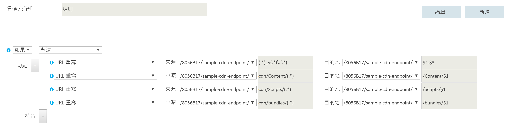

# <a name="content-delivery-network"></a><span data-ttu-id="29302-103">內容傳遞網路</span><span class="sxs-lookup"><span data-stu-id="29302-103">Content Delivery Network</span></span>
[!INCLUDE [header](../_includes/header.md)]

<span data-ttu-id="29302-104">Microsoft Azure [內容傳遞網路 (CDN)](/azure/cdn/cdn-overview) 為開發人員提供一套傳遞高頻寬內容 (裝載在 Azure 或任何其他位置中) 的通用解決方案。</span><span class="sxs-lookup"><span data-stu-id="29302-104">The Microsoft Azure [Content Delivery Network (CDN)](/azure/cdn/cdn-overview) offers developers a global solution for delivering high-bandwidth content that is hosted in Azure or any other location.</span></span> <span data-ttu-id="29302-105">使用 CDN，可讓您快取從 Azure Blob 儲存體、Web 應用程式、虛擬機器、應用程式資料夾或其他 HTTP/HTTPS 位置載入的公用物件。</span><span class="sxs-lookup"><span data-stu-id="29302-105">Using the CDN, you can cache publicly available objects loaded from Azure blob storage, a web application, virtual machine, application folder, or other HTTP/HTTPS location.</span></span> <span data-ttu-id="29302-106">CDN 快取可以保留在策略性位置上，以提供最大頻寬將內容傳遞給使用者。</span><span class="sxs-lookup"><span data-stu-id="29302-106">The CDN cache can be held at strategic locations to provide maximum bandwidth for delivering content to users.</span></span> <span data-ttu-id="29302-107">CDN 通常用來傳遞靜態內容，例如影像、樣式表、文件、檔案、用戶端指令碼和 HTML 頁面。</span><span class="sxs-lookup"><span data-stu-id="29302-107">The CDN is typically used for delivering static content such as images, style sheets, documents, files, client-side scripts, and HTML pages.</span></span>

<span data-ttu-id="29302-108">您也可以使用 CDN 做為提供動態內容的快取 (例如以指定的輸入為基礎的 PDF 報告或圖形)；如果不同的使用者提供了相同的輸入值，結果應會相同。</span><span class="sxs-lookup"><span data-stu-id="29302-108">You can also use the CDN as a cache for serving dynamic content, such as a PDF report or graph based on specified inputs; if the same input values are provided by different users the result should be the same.</span></span>

<span data-ttu-id="29302-109">使用 CDN 的主要優點是較低的延遲及更快將內容傳遞給使用者，而與裝載應用程式的資料中心的地理位置無關。</span><span class="sxs-lookup"><span data-stu-id="29302-109">The major advantages of using the CDN are lower latency and faster delivery of content to users irrespective of their geographical location in relation to the datacenter where the application is hosted.</span></span>  


<span data-ttu-id="29302-111">使用 CDN 也有助於降低應用程式的負載，因為它能免除存取和傳遞內容所需的處理程序。</span><span class="sxs-lookup"><span data-stu-id="29302-111">Using the CDN should also help to reduce the load on application because it is relieved of the processing required to access and deliver the content.</span></span> <span data-ttu-id="29302-112">此降低負載可協助提高應用程式的效能和延展性，以及減少達成特定層級的效能和可用性所需的處理資源，從而將裝載成本降至最低。</span><span class="sxs-lookup"><span data-stu-id="29302-112">This reduction in load can help to increase the performance and scalability of the application, as well as minimizing hosting costs by reducing the processing resources required to achieve a specific level of performance and availability.</span></span>

## <a name="how-and-why-a-cdn-is-used"></a><span data-ttu-id="29302-113">如何及為何使用 CDN</span><span class="sxs-lookup"><span data-stu-id="29302-113">How and why a CDN is used</span></span>
<span data-ttu-id="29302-114">CDN 的典型用法包括：</span><span class="sxs-lookup"><span data-stu-id="29302-114">Typical uses for a CDN include:</span></span>  

* <span data-ttu-id="29302-115">傳遞用戶端應用程式的靜態資源，通常是來自網站。</span><span class="sxs-lookup"><span data-stu-id="29302-115">Delivering static resources for client applications, often from a website.</span></span> <span data-ttu-id="29302-116">這些資源可以是映像、樣式表、文件、檔案、用戶端指令碼、HTML 頁面、HTML 片段，或伺服器不需要為每個要求修改的任何其他內容。</span><span class="sxs-lookup"><span data-stu-id="29302-116">These resources can be images, style sheets, documents, files, client-side scripts, HTML pages, HTML fragments, or any other content that the server does not need to modify for each request.</span></span> <span data-ttu-id="29302-117">應用程式可在執行階段建立項目，並讓 CDN 使用它們 (例如，藉由建立目前頭條新聞清單)，但它不會為每個要求這麼做。</span><span class="sxs-lookup"><span data-stu-id="29302-117">The application can create items at runtime and make them available to the CDN (for example, by creating a list of current news headlines), but it does not do so for each request.</span></span>
* <span data-ttu-id="29302-118">將公用靜態和共用內容傳遞給裝置，例如行動電話和平板電腦。</span><span class="sxs-lookup"><span data-stu-id="29302-118">Delivering public static and shared content to devices such as mobile phones and tablet computers.</span></span> <span data-ttu-id="29302-119">應用程式本身是一個 Web 服務，可將 API 提供給執行於各種裝置的用戶端。</span><span class="sxs-lookup"><span data-stu-id="29302-119">The application itself is a web service that offers an API to clients running on the various devices.</span></span> <span data-ttu-id="29302-120">CDN 也可以傳遞靜態資料集 (透過 Web 服務) 供用戶端使用，或許用來產生用戶端 UI。</span><span class="sxs-lookup"><span data-stu-id="29302-120">The CDN can also deliver static datasets (via the web service) for the clients to use, perhaps to generate the client UI.</span></span> <span data-ttu-id="29302-121">例如，CDN 可用來散發 JSON 或 XML 文件。</span><span class="sxs-lookup"><span data-stu-id="29302-121">For example, the CDN could be used to distribute JSON or XML documents.</span></span>
* <span data-ttu-id="29302-122">讓用戶端使用僅包含公用靜態內容的整個網站，而不需要任何專用的計算資源。</span><span class="sxs-lookup"><span data-stu-id="29302-122">Serving entire websites that consist of only public static content to clients, without requiring any dedicated compute resources.</span></span>
* <span data-ttu-id="29302-123">視需要將視訊檔案串流到用戶端。</span><span class="sxs-lookup"><span data-stu-id="29302-123">Streaming video files to the client on demand.</span></span> <span data-ttu-id="29302-124">視訊可從提供 CDN 連接的全球資料中心，獲得低延遲和可靠連線的好處。</span><span class="sxs-lookup"><span data-stu-id="29302-124">Video benefits from the low latency and reliable connectivity available from the globally located datacenters that offer CDN connections.</span></span> <span data-ttu-id="29302-125">Microsoft Azure 媒體服務 (AMS) 會與 Azure CDN 整合，直接提供內容給 CDN，以進行進一步的發佈。</span><span class="sxs-lookup"><span data-stu-id="29302-125">Microsoft Azure Media Services (AMS) integrates with Azure CDN to deliver content directly to the CDN for further distribution.</span></span> <span data-ttu-id="29302-126">如需詳細資訊，請參閱[串流端點概觀](/azure/media-services/media-services-streaming-endpoints-overview)。</span><span class="sxs-lookup"><span data-stu-id="29302-126">For more information, see [Streaming endpoints overview](/azure/media-services/media-services-streaming-endpoints-overview).</span></span>
* <span data-ttu-id="29302-127">一般可改善使用者體驗，特別是與裝載應用程式的資料中心相距較遠的使用者。</span><span class="sxs-lookup"><span data-stu-id="29302-127">Generally improving the experience for users, especially those located far from the datacenter hosting the application.</span></span> <span data-ttu-id="29302-128">這些使用者可能會遭遇到較高的延遲。</span><span class="sxs-lookup"><span data-stu-id="29302-128">These users might otherwise suffer higher latency.</span></span> <span data-ttu-id="29302-129">Web 應用程式中內容的總大小大都是靜態的，且使用 CDN 有助於維護效能和整體使用者體驗，同時不需要將應用程式部署到多個資料中心。</span><span class="sxs-lookup"><span data-stu-id="29302-129">A large proportion of the total size of the content in a web application is often static, and using the CDN can help to maintain performance and overall user experience while eliminating the requirement to deploy the application to multiple data centers.</span></span>
* <span data-ttu-id="29302-130">處理支援 IoT (物聯網) 解決方案的應用程式日益增加的負載。</span><span class="sxs-lookup"><span data-stu-id="29302-130">Handling the growing load on applications that support IoT (Internet of Things) solutions.</span></span> <span data-ttu-id="29302-131">如果需要處理廣播訊息及管理直接對每個裝置的韌體更新散發，則這些大量的裝置和設備可能很容易讓應用程式無法因應。</span><span class="sxs-lookup"><span data-stu-id="29302-131">The huge numbers of such devices and appliances involved could easily overwhelm an application if it was required to process broadcast messages and manage firmware update distribution directly to each device.</span></span>
* <span data-ttu-id="29302-132">處理尖峰和偶發性需求而不需應用程式調整，避免後續增加營運成本。</span><span class="sxs-lookup"><span data-stu-id="29302-132">Coping with peaks and surges in demand without requiring the application to scale, avoiding the consequent increased running costs.</span></span> <span data-ttu-id="29302-133">例如，針對硬體裝置 (例如特定型號的路由器) 或消費性裝置 (例如智慧型電視) 發行作業系統的更新時，如果數以百萬的使用者和裝置在短期間內下載更新，則可能會視需要產生龐大的尖峰量。</span><span class="sxs-lookup"><span data-stu-id="29302-133">For example, when an update to an operating system is released for a hardware device such as a specific model of router, or for a consumer device such as a smart TV, there will be a huge peak in demand as it is downloaded by millions of users and devices over a short period.</span></span>

<span data-ttu-id="29302-134">下列清單顯示來自不同地理位置的第一個位元組的時間中間值範例。</span><span class="sxs-lookup"><span data-stu-id="29302-134">The following list shows examples of the median time to first byte from various geographic locations.</span></span> <span data-ttu-id="29302-135">目標 Web 角色會部署到 Azure 美國西部。</span><span class="sxs-lookup"><span data-stu-id="29302-135">The target web role is deployed to Azure West US.</span></span> <span data-ttu-id="29302-136">因為 CDN 很接近 CDN 節點，所以較大的暴增之間有更強的關聯性。</span><span class="sxs-lookup"><span data-stu-id="29302-136">There is a strong correlation between greater boost due to the CDN and proximity to a CDN node.</span></span> <span data-ttu-id="29302-137">如需 Azure CDN 節點位置的完整清單，請參閱 [Azure 內容傳遞網路 (CDN) 節點位置](/azure/cdn/cdn-pop-locations/)。</span><span class="sxs-lookup"><span data-stu-id="29302-137">A complete list of Azure CDN node locations is available at [Azure Content Delivery Network (CDN) Node Locations](/azure/cdn/cdn-pop-locations/).</span></span>

|  | <span data-ttu-id="29302-138">距第一位元組 (來源) 時間 (毫秒)</span><span class="sxs-lookup"><span data-stu-id="29302-138">Time (ms) to First Byte (Origin)</span></span> | <span data-ttu-id="29302-139">第一個 (CDN) 的時間 (毫秒)</span><span class="sxs-lookup"><span data-stu-id="29302-139">Time (ms) to First (CDN)</span></span> | <span data-ttu-id="29302-140">%CDN 時間改善</span><span class="sxs-lookup"><span data-stu-id="29302-140">%CDN time improvement</span></span> |
| --- | --- | --- | --- |
| <span data-ttu-id="29302-141">\*加州聖荷西</span><span class="sxs-lookup"><span data-stu-id="29302-141">\*San Jose, CA</span></span> |<span data-ttu-id="29302-142">47.5</span><span class="sxs-lookup"><span data-stu-id="29302-142">47.5</span></span> |<span data-ttu-id="29302-143">46.5</span><span class="sxs-lookup"><span data-stu-id="29302-143">46.5</span></span> |<span data-ttu-id="29302-144">2%</span><span class="sxs-lookup"><span data-stu-id="29302-144">2%</span></span> |
| <span data-ttu-id="29302-145">\*\*維吉尼亞州杜勒斯</span><span class="sxs-lookup"><span data-stu-id="29302-145">\*\*Dulles, VA</span></span> |<span data-ttu-id="29302-146">109</span><span class="sxs-lookup"><span data-stu-id="29302-146">109</span></span> |<span data-ttu-id="29302-147">40.5</span><span class="sxs-lookup"><span data-stu-id="29302-147">40.5</span></span> |<span data-ttu-id="29302-148">169%</span><span class="sxs-lookup"><span data-stu-id="29302-148">169%</span></span> |
| <span data-ttu-id="29302-149">阿根廷布宜諾斯艾利斯</span><span class="sxs-lookup"><span data-stu-id="29302-149">Buenos Aires, AR</span></span> |<span data-ttu-id="29302-150">210</span><span class="sxs-lookup"><span data-stu-id="29302-150">210</span></span> |<span data-ttu-id="29302-151">151</span><span class="sxs-lookup"><span data-stu-id="29302-151">151</span></span> |<span data-ttu-id="29302-152">39%</span><span class="sxs-lookup"><span data-stu-id="29302-152">39%</span></span> |
| <span data-ttu-id="29302-153">\*英國倫敦</span><span class="sxs-lookup"><span data-stu-id="29302-153">\*London, UK</span></span> |<span data-ttu-id="29302-154">195</span><span class="sxs-lookup"><span data-stu-id="29302-154">195</span></span> |<span data-ttu-id="29302-155">44</span><span class="sxs-lookup"><span data-stu-id="29302-155">44</span></span> |<span data-ttu-id="29302-156">343%</span><span class="sxs-lookup"><span data-stu-id="29302-156">343%</span></span> |
| <span data-ttu-id="29302-157">中國上海</span><span class="sxs-lookup"><span data-stu-id="29302-157">Shanghai, CN</span></span> |<span data-ttu-id="29302-158">242</span><span class="sxs-lookup"><span data-stu-id="29302-158">242</span></span> |<span data-ttu-id="29302-159">206</span><span class="sxs-lookup"><span data-stu-id="29302-159">206</span></span> |<span data-ttu-id="29302-160">17%</span><span class="sxs-lookup"><span data-stu-id="29302-160">17%</span></span> |
| <span data-ttu-id="29302-161">\*新加坡</span><span class="sxs-lookup"><span data-stu-id="29302-161">\*Singapore</span></span> |<span data-ttu-id="29302-162">214</span><span class="sxs-lookup"><span data-stu-id="29302-162">214</span></span> |<span data-ttu-id="29302-163">74</span><span class="sxs-lookup"><span data-stu-id="29302-163">74</span></span> |<span data-ttu-id="29302-164">189%</span><span class="sxs-lookup"><span data-stu-id="29302-164">189%</span></span> |
| <span data-ttu-id="29302-165">\*日本東京</span><span class="sxs-lookup"><span data-stu-id="29302-165">\*Tokyo, JP</span></span> |<span data-ttu-id="29302-166">163</span><span class="sxs-lookup"><span data-stu-id="29302-166">163</span></span> |<span data-ttu-id="29302-167">48</span><span class="sxs-lookup"><span data-stu-id="29302-167">48</span></span> |<span data-ttu-id="29302-168">204%</span><span class="sxs-lookup"><span data-stu-id="29302-168">204%</span></span> |
| <span data-ttu-id="29302-169">韓國首爾</span><span class="sxs-lookup"><span data-stu-id="29302-169">Seoul, KR</span></span> |<span data-ttu-id="29302-170">190</span><span class="sxs-lookup"><span data-stu-id="29302-170">190</span></span> |<span data-ttu-id="29302-171">190</span><span class="sxs-lookup"><span data-stu-id="29302-171">190</span></span> |<span data-ttu-id="29302-172">0%</span><span class="sxs-lookup"><span data-stu-id="29302-172">0%</span></span> |

<span data-ttu-id="29302-173">\* 在同一城市中具有 Azure CDN 節點。</span><span class="sxs-lookup"><span data-stu-id="29302-173">\* Has an Azure CDN node in the same city.</span></span>  
<span data-ttu-id="29302-174">\*\* 在鄰近城市中具有 Azure CDN 節點。</span><span class="sxs-lookup"><span data-stu-id="29302-174">\*\* Has an Azure CDN node in a neighboring city.</span></span>  

## <a name="challenges"></a><span data-ttu-id="29302-175">挑戰</span><span class="sxs-lookup"><span data-stu-id="29302-175">Challenges</span></span>
<span data-ttu-id="29302-176">計劃使用 CDN 時必須考量有幾項挑戰：</span><span class="sxs-lookup"><span data-stu-id="29302-176">There are several challenges to take into account when planning to use the CDN:</span></span>  

* <span data-ttu-id="29302-177">**部署**。</span><span class="sxs-lookup"><span data-stu-id="29302-177">**Deployment**.</span></span> <span data-ttu-id="29302-178">決定 CDN 將從中提取內容的原點，及是否需要將內容部署到多個儲存體系統中 (例如在 CDN 和替代位置中)。</span><span class="sxs-lookup"><span data-stu-id="29302-178">Decide the origin from which the CDN fetches the content, and whether you need to deploy the content in more than one storage system (such as in the CDN and an alternative location).</span></span>

  <span data-ttu-id="29302-179">您的應用程式部署機制必須考慮部署靜態內容和資源的程序，以及部署應用程式檔案 (例如 ASPX 頁面) 的程序。</span><span class="sxs-lookup"><span data-stu-id="29302-179">Your application deployment mechanism must take into account the process for deploying static content and resources as well as deploying the application files, such as ASPX pages.</span></span> <span data-ttu-id="29302-180">比方說，您可能需要實作個別的步驟，才能將內容載入 Azure blob 儲存體。</span><span class="sxs-lookup"><span data-stu-id="29302-180">For example, you may need to implement a separate step to load content into Azure blob storage.</span></span>
* <span data-ttu-id="29302-181">**版本控制和快取控制**。</span><span class="sxs-lookup"><span data-stu-id="29302-181">**Versioning and cache-control**.</span></span> <span data-ttu-id="29302-182">考慮如何更新靜態內容和部署新版本。</span><span class="sxs-lookup"><span data-stu-id="29302-182">Consider how you will update static content and deploy new versions.</span></span> <span data-ttu-id="29302-183">當資產的新版本可供使用時，可能會使用 Azure 入口網站來 [清除](/azure/cdn/cdn-purge-endpoint/) CDN 內容。</span><span class="sxs-lookup"><span data-stu-id="29302-183">The CDN content may be [purged](/azure/cdn/cdn-purge-endpoint/) using the Azure portal when new versions of your assets are available.</span></span> <span data-ttu-id="29302-184">這類似於管理用戶端快取的挑戰，例如在網頁瀏覽器中發生的情形。</span><span class="sxs-lookup"><span data-stu-id="29302-184">This is a similar challenge to managing client-side caching, such as that which occurs in a web browser.</span></span>
* <span data-ttu-id="29302-185">**測試**。</span><span class="sxs-lookup"><span data-stu-id="29302-185">**Testing**.</span></span> <span data-ttu-id="29302-186">在本機或在預備環境中開發和測試應用程式時，很難為 CDN 設定執行本機測試。</span><span class="sxs-lookup"><span data-stu-id="29302-186">It can be difficult to perform local testing of your CDN settings when developing and testing an application locally or in a staging environment.</span></span>
* <span data-ttu-id="29302-187">**搜尋引擎最佳化 (SEO)**。</span><span class="sxs-lookup"><span data-stu-id="29302-187">**Search engine optimization (SEO)**.</span></span> <span data-ttu-id="29302-188">當您使用 CDN 時，如影像和文件等內容皆由不同的網域服務。</span><span class="sxs-lookup"><span data-stu-id="29302-188">Content such as images and documents are served from a different domain when you use the CDN.</span></span> <span data-ttu-id="29302-189">這可能會影響此內容的 SEO。</span><span class="sxs-lookup"><span data-stu-id="29302-189">This can have an effect on SEO for this content.</span></span>
* <span data-ttu-id="29302-190">**內容安全性**。</span><span class="sxs-lookup"><span data-stu-id="29302-190">**Content security**.</span></span> <span data-ttu-id="29302-191">許多 CDN 服務 (例如 Azure CDN) 目前不提供任何類型的內容存取控制。</span><span class="sxs-lookup"><span data-stu-id="29302-191">Many CDN services such as Azure CDN do not currently offer any type of access control for the content.</span></span>
* <span data-ttu-id="29302-192">**用戶端安全性**。</span><span class="sxs-lookup"><span data-stu-id="29302-192">**Client security**.</span></span> <span data-ttu-id="29302-193">用戶端可從不允許存取 CDN 上資源的環境中連接。</span><span class="sxs-lookup"><span data-stu-id="29302-193">Clients might connect from an environment that does not allow access to resources on the CDN.</span></span> <span data-ttu-id="29302-194">這可能是安全性限制的環境，限制只能存取一組已知來源，或防止從原始頁面以外的任何位置載入資源的環境。</span><span class="sxs-lookup"><span data-stu-id="29302-194">This could be a security-constrained environment that limits access to only a set of known sources, or one that prevents loading of resources from anything other than the page origin.</span></span> <span data-ttu-id="29302-195">需要後援實作，才能處理這些情況。</span><span class="sxs-lookup"><span data-stu-id="29302-195">A fallback implementation is required to handle these cases.</span></span>
* <span data-ttu-id="29302-196">**恢復功能**。</span><span class="sxs-lookup"><span data-stu-id="29302-196">**Resilience**.</span></span> <span data-ttu-id="29302-197">CDN 是應用程式的潛在單一失敗點。</span><span class="sxs-lookup"><span data-stu-id="29302-197">The CDN is a potential single point of failure for an application.</span></span> <span data-ttu-id="29302-198">它比 blob 儲存體具有更低的可用性 SLA (可用於直接傳遞內容)，因此您可能需要考慮為重要內容實作後援機制。</span><span class="sxs-lookup"><span data-stu-id="29302-198">It has a lower availability SLA than blob storage (which can be used to deliver content directly) so you may need to consider implementing a fallback mechanism for critical content.</span></span>

  <span data-ttu-id="29302-199">您可以從 Azure 入口網站的[即時](/azure/cdn/cdn-real-time-stats/)和[彙總報告](/azure/cdn/cdn-analyze-usage-patterns/)中監視 CDN 內容的可用性、頻寬、傳輸的資料、點擊數、快取點擊率和快取計量。</span><span class="sxs-lookup"><span data-stu-id="29302-199">You can monitor your CDN content availability, bandwidth, data transferred, hits, cache hit ratio, and cache metrics from the Azure portal in [real-time](/azure/cdn/cdn-real-time-stats/) and [aggregate reports](/azure/cdn/cdn-analyze-usage-patterns/).</span></span>

<span data-ttu-id="29302-200">CDN 較沒有用的案例括：</span><span class="sxs-lookup"><span data-stu-id="29302-200">Scenarios where CDN may be less useful include:</span></span>  

* <span data-ttu-id="29302-201">如果內容點擊率偏低，該內容在有效期間 (由其存留時間設定值決定) 可能僅被存取數次。</span><span class="sxs-lookup"><span data-stu-id="29302-201">If the content has a low hit rate, it might be accessed only few times while it is valid (determined by its time-to-live setting).</span></span> <span data-ttu-id="29302-202">第一次下載項目時會產生兩筆交易費用 (從原點到 CDN，然後從 CDN 到客戶)。</span><span class="sxs-lookup"><span data-stu-id="29302-202">The first time an item is downloaded you incur two transaction charges from the origin to the CDN, and then from the CDN to the customer.</span></span>
* <span data-ttu-id="29302-203">如果資料是私人的，例如適用於大型企業或供應鏈生態系統。</span><span class="sxs-lookup"><span data-stu-id="29302-203">If the data is private, such as for large enterprises or supply chain ecosystems.</span></span>

## <a name="general-guidelines-and-good-practices"></a><span data-ttu-id="29302-204">一般方針和最佳做法</span><span class="sxs-lookup"><span data-stu-id="29302-204">General guidelines and good practices</span></span>
<span data-ttu-id="29302-205">使用 CDN 是最小化應用程式負載，及最大化可用性與效能的好方法。</span><span class="sxs-lookup"><span data-stu-id="29302-205">Using the CDN is a good way to minimize the load on your application, and maximize availability and performance.</span></span> <span data-ttu-id="29302-206">為應用程式使用的所有適當內容和資源，考慮採用此策略。</span><span class="sxs-lookup"><span data-stu-id="29302-206">Consider adopting this strategy for all of the appropriate content and resources your application uses.</span></span> <span data-ttu-id="29302-207">設計使用 CDN 的策略時，請考慮以下幾節中的要點：</span><span class="sxs-lookup"><span data-stu-id="29302-207">Consider the points in the following sections when designing your strategy to use the CDN:</span></span>  

### <a name="origin"></a><span data-ttu-id="29302-208">來源</span><span class="sxs-lookup"><span data-stu-id="29302-208">Origin</span></span>
<span data-ttu-id="29302-209">透過 CDN 部署內容時，只需指定 CDN 服務將用來存取及快取內容的 HTTP 和/或 HTTPS [端點](/azure/cdn/cdn-create-new-endpoint)。</span><span class="sxs-lookup"><span data-stu-id="29302-209">Deploying content through the CDN simply requires you to specify an HTTP and/or HTTPS [endpoint](/azure/cdn/cdn-create-new-endpoint) that the CDN service will use to access and cache the content.</span></span>

<span data-ttu-id="29302-210">端點可指定 Azure Blob 儲存體容器，包含您要透過 CDN 傳遞的靜態內容。</span><span class="sxs-lookup"><span data-stu-id="29302-210">The endpoint can specify an Azure blob storage container that holds the static content you want to deliver through the CDN.</span></span> <span data-ttu-id="29302-211">容器必須標示為公用。</span><span class="sxs-lookup"><span data-stu-id="29302-211">The container must be marked as public.</span></span> <span data-ttu-id="29302-212">只能透過 CDN 取得公用容器中具有公用讀取權限的 blob。</span><span class="sxs-lookup"><span data-stu-id="29302-212">Only blobs in a public container that have public read access are available through the CDN.</span></span>

<span data-ttu-id="29302-213">端點可在其中一個應用程式之計算層級的根目錄中，指定名為 **cdn** 的資料夾 (例如 Web 角色或虛擬機器)。</span><span class="sxs-lookup"><span data-stu-id="29302-213">The endpoint can specify a folder named **cdn** in the root of one of application’s compute layers (such as a web role or a virtual machine).</span></span> <span data-ttu-id="29302-214">將在 CDN 上快取資源要求的結果，包括動態資源，例如 ASPX 頁面。</span><span class="sxs-lookup"><span data-stu-id="29302-214">The results from requests for resources, including dynamic resources such as ASPX pages, will be cached on the CDN.</span></span> <span data-ttu-id="29302-215">最小快取期間為 300 秒。</span><span class="sxs-lookup"><span data-stu-id="29302-215">The minimum cache period is 300 seconds.</span></span> <span data-ttu-id="29302-216">任何較短的期間，都將使內容無法部署至 CDN (如需詳細資訊，請參閱以下的*快取控制*標題)。</span><span class="sxs-lookup"><span data-stu-id="29302-216">Any shorter period prevents the content from being deployed to the CDN (for more information, see the following heading *Cache control* below).</span></span>

<span data-ttu-id="29302-217">如果您使用 Azure Web Apps，可在建立 CDN 執行個體時選取網站，將端點設為該網站的根資料夾。</span><span class="sxs-lookup"><span data-stu-id="29302-217">If you are using Azure Web Apps, the endpoint is set to the root folder of the site by selecting the site when creating the CDN instance.</span></span> <span data-ttu-id="29302-218">可透過 CDN 取得網站的所有內容。</span><span class="sxs-lookup"><span data-stu-id="29302-218">All of the content for the site will be available through the CDN.</span></span>

<span data-ttu-id="29302-219">在大部分情況下，指向應用程式的其中一個計算層級內的資料夾中 CDN 端點，將提供更多的彈性和控制能力。</span><span class="sxs-lookup"><span data-stu-id="29302-219">In most cases, pointing your CDN endpoint at a folder within one of the compute layers of your application offers more flexibility and control.</span></span> <span data-ttu-id="29302-220">比方說，它可讓您更輕鬆地管理目前和未來的路由需求，以及動態產生靜態內容，例如影像縮圖。</span><span class="sxs-lookup"><span data-stu-id="29302-220">For instance, it makes it easier to manage current and future routing requirements, and dynamically generate static content such as image thumbnails.</span></span>

<span data-ttu-id="29302-221">從 ASPX 頁面之類的動態來源傳遞內容時，您可以使用[查詢字串](/azure/cdn/cdn-query-string/)來區分快取中的物件。</span><span class="sxs-lookup"><span data-stu-id="29302-221">You can use [query strings](/azure/cdn/cdn-query-string/) to differentiate objects in the cache when content is delivered from dynamic sources, such as ASPX pages.</span></span> <span data-ttu-id="29302-222">不過，可在指定 CDN 端點時，利用 Azure 入口網站中的設定來停用這種行為。</span><span class="sxs-lookup"><span data-stu-id="29302-222">However, this behavior can be disabled by a setting in the Azure portal when you specify the CDN endpoint.</span></span> <span data-ttu-id="29302-223">從 blob 儲存體傳遞內容時，查詢字串會被視為字串常值，因此會將具有相同名稱但有不同查詢字串的兩個項目，儲存為 CDN 上的個別項目。</span><span class="sxs-lookup"><span data-stu-id="29302-223">When delivering content from blob storage, query strings are treated as string literals so two items that have the same name but different query strings are stored as separate items on the CDN.</span></span>

<span data-ttu-id="29302-224">您可以利用 URL 重寫資源 (例如指令碼和其他內容)，避免將檔案移至 CDN 原始資料夾。</span><span class="sxs-lookup"><span data-stu-id="29302-224">You can utilize URL rewriting for resources, such as scripts and other content, to avoid moving your files to the CDN origin folder.</span></span>

<span data-ttu-id="29302-225">使用 Azure 儲存體 blob 以保存 CDN 內容時，blob 中資源的 URL 對容器和 blob 名稱是區分大小寫的。</span><span class="sxs-lookup"><span data-stu-id="29302-225">When using Azure storage blobs to hold content for the CDN, the URL of the resources in blobs is case-sensitive for the container and blob name.</span></span>

<span data-ttu-id="29302-226">使用自訂來源或 Azure Web Apps 時，您可以在資源的連結中指定 CDN 執行個體的路徑。</span><span class="sxs-lookup"><span data-stu-id="29302-226">When using custom origins or Azure Web Apps, you specify the path to the CDN instance in the links to resources.</span></span> <span data-ttu-id="29302-227">例如，下列動作會在將透過 CDN 傳遞之網站的 **Images** 資料夾中，指定影像檔：</span><span class="sxs-lookup"><span data-stu-id="29302-227">For example, the following specifies an image file in the **Images** folder of the site that will be delivered through the CDN:</span></span>

```XML

```

### <a name="deployment"></a><span data-ttu-id="29302-228">部署</span><span class="sxs-lookup"><span data-stu-id="29302-228">Deployment</span></span>
<span data-ttu-id="29302-229">如果您未在應用程式部署封裝或程序中包含靜態內容，該靜態內容可能需要與應用程式分開佈建和部署。</span><span class="sxs-lookup"><span data-stu-id="29302-229">Static content may need to be provisioned and deployed independently from the application if you do not include it in the application deployment package or process.</span></span> <span data-ttu-id="29302-230">請思考這會如何影響版本控制方法，也就是您用於管理應用程式元件和靜態資源內容的方法。</span><span class="sxs-lookup"><span data-stu-id="29302-230">Consider how this will affect the versioning approach you use to manage both the application components and the static resource content.</span></span>

<span data-ttu-id="29302-231">請考慮如何針對指令碼與 CSS 檔案處理統合 (將數個檔案結合成一個檔案) 和縮製 (移除不必要的字元，例如空格、新行字元、註解和其他字元)。</span><span class="sxs-lookup"><span data-stu-id="29302-231">Consider how bundling (combining several files into one file) and minification (removing unnecessary characters such as white space, new line characters, comments, and other characters) for script and CSS files will be handled.</span></span> <span data-ttu-id="29302-232">這些常用的技術可減少用戶端的載入時間，並相容於透過 CDN 傳遞的內容。</span><span class="sxs-lookup"><span data-stu-id="29302-232">These are commonly used techniques that can reduce load times for clients, and are compatible with delivering content through the CDN.</span></span> <span data-ttu-id="29302-233">如需詳細資訊，請參閱 [統合和縮製](http://www.asp.net/mvc/tutorials/mvc-4/bundling-and-minification)(英文)。</span><span class="sxs-lookup"><span data-stu-id="29302-233">For more information, see [Bundling and Minification](http://www.asp.net/mvc/tutorials/mvc-4/bundling-and-minification).</span></span>

<span data-ttu-id="29302-234">如果您需要將內容部署到其他位置，這會是部署程序中的額外步驟。</span><span class="sxs-lookup"><span data-stu-id="29302-234">If you need to deploy the content to an additional location, this will be an extra step in the deployment process.</span></span> <span data-ttu-id="29302-235">如果應用程式更新 CDN 的內容 (或許是固定間隔或為了回應事件)，它必須將更新的內容儲存於任何其他位置，以及 CDN 的端點。</span><span class="sxs-lookup"><span data-stu-id="29302-235">If the application updates the content for the CDN, perhaps at regular intervals or in response to an event, it must store the updated content in any additional locations as well as the endpoint for the CDN.</span></span>

<span data-ttu-id="29302-236">您無法為本機 Azure 模擬器或 Visual Studio 中的應用程式設定 CDN 端點。</span><span class="sxs-lookup"><span data-stu-id="29302-236">You cannot set up a CDN endpoint for an application in the local Azure emulator in Visual Studio.</span></span> <span data-ttu-id="29302-237">此限制會影響單位測試、功能性測試，以及最終預先部署測試。</span><span class="sxs-lookup"><span data-stu-id="29302-237">This restriction will affect unit testing, functional testing, and final pre-deployment testing.</span></span> <span data-ttu-id="29302-238">您必須實作替代機制來允許此作法。</span><span class="sxs-lookup"><span data-stu-id="29302-238">You must allow for this by implementing an alternative mechanism.</span></span> <span data-ttu-id="29302-239">例如，您可以將內容預先部署到 CDN，方法是使用自訂應用程式或公用程式，並在其快取期間執行測試。</span><span class="sxs-lookup"><span data-stu-id="29302-239">For example, you could pre-deploy the content to the CDN using a custom application or utility, and perform testing during the period in which it is cached.</span></span> <span data-ttu-id="29302-240">或者，使用編譯指示詞或全域常數，控制應用程式載入資源的位置。</span><span class="sxs-lookup"><span data-stu-id="29302-240">Alternatively, use compile directives or global constants to control from where the application loads the resources.</span></span> <span data-ttu-id="29302-241">例如，在偵錯模式中執行時，可能會從本機資料夾載入資源，例如用戶端指令碼組合和其他內容，並在發行模式中執行時使用 CDN。</span><span class="sxs-lookup"><span data-stu-id="29302-241">For example, when running in debug mode it could load resources such as client-side script bundles and other content from a local folder, and use the CDN when running in release mode.</span></span>

<span data-ttu-id="29302-242">請考量您要讓 CDN 支援何種壓縮方法：</span><span class="sxs-lookup"><span data-stu-id="29302-242">Consider which compression approach you want your CDN to support:</span></span>

* <span data-ttu-id="29302-243">您可以在原始伺服器上[啟用壓縮](/azure/cdn/cdn-improve-performance/)，此時 CDN 會依預設支援壓縮，並將壓縮的內容以 zip 或 gzip 之類的格式傳遞到用戶端。</span><span class="sxs-lookup"><span data-stu-id="29302-243">You can [enable compression](/azure/cdn/cdn-improve-performance/) on your origin server, in which case the CDN will support compression by default and deliver compressed content to clients in a format such as zip or gzip.</span></span> <span data-ttu-id="29302-244">將應用程式資料夾做為 CDN 端點時，伺服器可能會自動壓縮某些內容，並且使用將內容直接傳遞到網頁瀏覽器或其他類型的用戶端時的相同方法。</span><span class="sxs-lookup"><span data-stu-id="29302-244">When using an application folder as the CDN endpoint, the server may compress some content automatically in the same way as when delivering it directly to a web browser or other type of client.</span></span> <span data-ttu-id="29302-245">格式取決於用戶端所傳送之要求中的 **Accept-Encoding** 標頭值。</span><span class="sxs-lookup"><span data-stu-id="29302-245">The format depends on the value of the **Accept-Encoding** header in the request sent by the client.</span></span> <span data-ttu-id="29302-246">Azure 中的預設機制是，當 CPU 使用率低於 50% 時，會自動壓縮內容。</span><span class="sxs-lookup"><span data-stu-id="29302-246">In Azure the default mechanism is to automatically compress content when CPU utilization is below 50%.</span></span> <span data-ttu-id="29302-247">如果您使用雲端服務來裝載應用程式，變更設定時可能需要使用啟動工作，在 IIS 中開啟動態輸出的壓縮。</span><span class="sxs-lookup"><span data-stu-id="29302-247">If you are using a cloud service to host the application, changing the settings may require using a startup task to turn on compression of dynamic output in IIS.</span></span> <span data-ttu-id="29302-248">如需詳細資訊，請參閱 [透過 Web 角色，使用 Microsoft Azure CDN 以啟用 gzip 壓縮](http://blogs.msdn.com/b/avkashchauhan/archive/2012/03/05/enableing-gzip-compression-with-windows-azure-cdn-through-web-role.aspx) 。</span><span class="sxs-lookup"><span data-stu-id="29302-248">See [Enabling gzip compression with Microsoft Azure CDN through a Web Role](http://blogs.msdn.com/b/avkashchauhan/archive/2012/03/05/enableing-gzip-compression-with-windows-azure-cdn-through-web-role.aspx) for more information.</span></span>
* <span data-ttu-id="29302-249">您可以直接在 CDN 邊緣伺服器上啟用壓縮，此時 CDN 會壓縮檔案並將其提供給使用者。</span><span class="sxs-lookup"><span data-stu-id="29302-249">You can enable compression directly on CDN edge servers, in which case the CDN will compress the files and serve it to end users.</span></span> <span data-ttu-id="29302-250">如需詳細資訊，請參閱 [Azure CDN 壓縮](/azure/cdn/cdn-improve-performance/)。</span><span class="sxs-lookup"><span data-stu-id="29302-250">For more information, see [Azure CDN Compression](/azure/cdn/cdn-improve-performance/).</span></span>

### <a name="routing-and-versioning"></a><span data-ttu-id="29302-251">路由和版本控制</span><span class="sxs-lookup"><span data-stu-id="29302-251">Routing and versioning</span></span>
<span data-ttu-id="29302-252">您可能需要在不同時間使用不同的 CDN 執行個體。</span><span class="sxs-lookup"><span data-stu-id="29302-252">You may need to use different CDN instances at various times.</span></span> <span data-ttu-id="29302-253">例如，當您部署新版的應用程式時，可能會想要使用新的 CDN，並保留舊的 CDN (以適用於舊版的舊格式保存內容)。</span><span class="sxs-lookup"><span data-stu-id="29302-253">For example, when you deploy a new version of the application you may want to use a new CDN and retain the old CDN (holding content in an older format) for previous versions.</span></span> <span data-ttu-id="29302-254">如果您將 Azure Blob 儲存體作為內容的原點，可以建立個別的儲存體帳戶或個別的容器，並將 CDN 端點指向它。</span><span class="sxs-lookup"><span data-stu-id="29302-254">If you use Azure blob storage as the content origin, you can create a separate storage account or a separate container and point the CDN endpoint to it.</span></span> <span data-ttu-id="29302-255">如果您將應用程式中的 cdn 根資料夾作為 CDN 端點，您可以使用 URL 重寫技術，將要求導向不同的資料夾。</span><span class="sxs-lookup"><span data-stu-id="29302-255">If you use the cdn root folder within the application as the CDN endpoint, you can use URL rewriting techniques to direct requests to a different folder.</span></span>

<span data-ttu-id="29302-256">請勿使用查詢字串來表示 CDN 上資源連結中不同版本的應用程式，因為從 Azure Blob 儲存體擷取內容時，查詢字串為資源名稱 (Blob 名稱) 的一部分。</span><span class="sxs-lookup"><span data-stu-id="29302-256">Do not use the query string to denote different versions of the application in links to resources on the CDN because, when retrieving content from Azure blob storage, the query string is part of the resource name (the blob name).</span></span> <span data-ttu-id="29302-257">此方法也會影響用戶端快取資源的方式。</span><span class="sxs-lookup"><span data-stu-id="29302-257">This approach can also affect how the client caches resources.</span></span>

<span data-ttu-id="29302-258">若是在 CDN 上快取先前的資源，則在部署新版本的靜態內容時，更新應用程式可能是一項挑戰。</span><span class="sxs-lookup"><span data-stu-id="29302-258">Deploying new versions of static content when you update an application can be a challenge if the previous resources are cached on the CDN.</span></span> <span data-ttu-id="29302-259">如需詳細資訊，請參閱＜快取控制＞一節。</span><span class="sxs-lookup"><span data-stu-id="29302-259">For more information, see the section *Cache control*).</span></span>

<span data-ttu-id="29302-260">請考慮依國家/地區限制 CDN 內容存取。</span><span class="sxs-lookup"><span data-stu-id="29302-260">Consider restricting the CDN content access by country.</span></span> <span data-ttu-id="29302-261">Azure CDN 可以讓您根據來源的國家/地區來篩選要求，並限制傳遞的內容。</span><span class="sxs-lookup"><span data-stu-id="29302-261">Azure CDN allows you to filter requests based on the country of origin and restrict the content delivered.</span></span> <span data-ttu-id="29302-262">如需詳細資訊，請參閱[依國家/地區限制對內容的存取](/azure/cdn/cdn-restrict-access-by-country/)。</span><span class="sxs-lookup"><span data-stu-id="29302-262">For more information, see [Restrict access to your content by country](/azure/cdn/cdn-restrict-access-by-country/).</span></span>

### <a name="cache-control"></a><span data-ttu-id="29302-263">快取控制</span><span class="sxs-lookup"><span data-stu-id="29302-263">Cache control</span></span>
<span data-ttu-id="29302-264">請考量如何管理系統內的快取。</span><span class="sxs-lookup"><span data-stu-id="29302-264">Consider how to manage caching within the system.</span></span> <span data-ttu-id="29302-265">比方說，將資料夾做為 CDN 原點時，您可以指定產生內容的頁面快取性，及特定資料夾中所有資源的內容到期時間。</span><span class="sxs-lookup"><span data-stu-id="29302-265">For example, when using a folder as the CDN origin you can specify the cacheability of pages that generate the content, and the content expiry time for all the resources in a specific folder.</span></span> <span data-ttu-id="29302-266">您也可以指定 CDN 的快取屬性，及使用標準 HTTP 標頭的用戶端。</span><span class="sxs-lookup"><span data-stu-id="29302-266">You can also specify cache properties for the CDN, and for the client using standard HTTP headers.</span></span> <span data-ttu-id="29302-267">雖然您應該已在伺服器和用戶端上管理快取，但使用 CDN 能讓您更了解內容的快取方式及其位置。</span><span class="sxs-lookup"><span data-stu-id="29302-267">Although you should already be managing caching on the server and client, using the CDN will help to make you more aware of how your content is cached, and where.</span></span>

<span data-ttu-id="29302-268">若要防止在 CDN 上使用物件，您可以從原點刪除它們 (Blob 容器或應用程式 cdn 根資料夾)、移除或刪除 CDN 端點，或在 Blob 儲存體情況下，讓容器或 Blob 變成私用。</span><span class="sxs-lookup"><span data-stu-id="29302-268">To prevent objects from being available on the CDN you can delete them from the origin (blob container or application *cdn* root folder), remove or delete the CDN endpoint, or, in the case of blob storage, make the container or blob private.</span></span> <span data-ttu-id="29302-269">不過，只有當項目的存留時間到期時，才會從 CDN 移除它們。</span><span class="sxs-lookup"><span data-stu-id="29302-269">However, items will be removed from the CDN only when their time-to-live expires.</span></span> <span data-ttu-id="29302-270">若未指定快取到期期限 (例如從 blob 儲存體載入內容時)，它會在 CDN 上快取長達七天。</span><span class="sxs-lookup"><span data-stu-id="29302-270">If no cache expiry period is specified (such as when content is loaded from blob storage), it is cached on the CDN for up to seven days.</span></span>  <span data-ttu-id="29302-271">您也可以手動[清除 CDN 端點](/azure/cdn/cdn-purge-endpoint/)。</span><span class="sxs-lookup"><span data-stu-id="29302-271">You can also manually [purge a CDN endpoint](/azure/cdn/cdn-purge-endpoint/).</span></span>

<span data-ttu-id="29302-272">在 Web 應用程式中，您可以在 web.config 檔案的 system.webServer/staticContent 區段中，使用 clientCache 項目來設定所有內容的快取和到期。</span><span class="sxs-lookup"><span data-stu-id="29302-272">In a web application, you can set the caching and expiry for all content by using the *clientCache* element in the *system.webServer/staticContent* section of the web.config file.</span></span> <span data-ttu-id="29302-273">請記住，當您在資料夾中放置 web.config 檔案時，它將會影響該資料夾中的檔案和所有子資料夾中的檔案。</span><span class="sxs-lookup"><span data-stu-id="29302-273">Remember that when you place a web.config file in a folder it affects the files in that folder and all subfolders.</span></span>

<span data-ttu-id="29302-274">如果您以動態方式建立 CDN 的內容 (例如，在應用程式的程式碼中)，請確實在每個頁面上指定 Cache.SetExpires 屬性。</span><span class="sxs-lookup"><span data-stu-id="29302-274">If you create the content for the CDN dynamically (in your application code for example), ensure that you specify the *Cache.SetExpires* property on each page.</span></span> <span data-ttu-id="29302-275">CDN 不會從使用預設快取性設定 (公用) 的頁面中快取輸出。</span><span class="sxs-lookup"><span data-stu-id="29302-275">The CDN will not cache the output from pages that use the default cacheability setting of *public*.</span></span>  <span data-ttu-id="29302-276">將快取到期期限設為適當值，確保不會在極短時間內從應用程式捨棄和重新載入內容。</span><span class="sxs-lookup"><span data-stu-id="29302-276">Set the cache expiry period to a suitable value to ensure that the content is not discarded and reloaded from the application at very short intervals.</span></span>  

### <a name="security"></a><span data-ttu-id="29302-277">安全性</span><span class="sxs-lookup"><span data-stu-id="29302-277">Security</span></span>
<span data-ttu-id="29302-278">CDN 可以使用 CDN 所提供的憑證，透過 HTTPS (SSL) 傳遞內容，也可以透過 HTTP。</span><span class="sxs-lookup"><span data-stu-id="29302-278">The CDN can deliver content over HTTPS (SSL), by using the certificate provided by the CDN, as well as over standard HTTP.</span></span> <span data-ttu-id="29302-279">為了避免瀏覽器發出混合內容警告，您最好使用 HTTPS，要求透過 HTTPS 載入的頁面所顯示的靜態內容。</span><span class="sxs-lookup"><span data-stu-id="29302-279">To avoid browser warnings about mixed content, you might need to use HTTPS to request static content that is displayed in pages loaded through HTTPS.</span></span>

<span data-ttu-id="29302-280">使用 CDN 傳遞靜態資產時 (如字型檔案)，如果使用 XMLHttpRequest 呼叫要求不同網域中的這些資源，可能會遇到相同來源原則問題。</span><span class="sxs-lookup"><span data-stu-id="29302-280">If you deliver static assets such as font files by using the CDN, you might encounter same-origin policy issues if you use an *XMLHttpRequest* call to request these resources from a different domain.</span></span> <span data-ttu-id="29302-281">許多網頁瀏覽器會防止跨原始來源資源分享 (CORS)，除非網頁伺服器已設定適當的回應標頭。</span><span class="sxs-lookup"><span data-stu-id="29302-281">Many web browsers prevent cross-origin resource sharing (CORS) unless the web server is configured to set the appropriate response headers.</span></span> <span data-ttu-id="29302-282">使用下列方法之一可以設定 CDN 支援 CORS：</span><span class="sxs-lookup"><span data-stu-id="29302-282">You can configure the CDN to support CORS by using one of the following methods:</span></span>

* <span data-ttu-id="29302-283">使用 CDN 規則引擎將 CORS 標頭新增至回應。</span><span class="sxs-lookup"><span data-stu-id="29302-283">Use the CDN rules engine to add CORS headers to the responses.</span></span> <span data-ttu-id="29302-284">這個方法通常是最佳做法，因為支援萬用字元和多個特定允許來源。</span><span class="sxs-lookup"><span data-stu-id="29302-284">This method is usually the best one to use because both wildcard and multiple specific-allowed origins are supported.</span></span> <span data-ttu-id="29302-285">如需詳細資訊，請參閱[搭配使用 Azure CDN 與 CORS](https://docs.microsoft.com/en-us/azure/cdn/cdn-cors)。</span><span class="sxs-lookup"><span data-stu-id="29302-285">For more information, see [Using Azure CDN with CORS](https://docs.microsoft.com/en-us/azure/cdn/cdn-cors).</span></span> 
* <span data-ttu-id="29302-286">在服務屬性中新增 CorsRule。</span><span class="sxs-lookup"><span data-stu-id="29302-286">Add a *CorsRule* to the service properties.</span></span> <span data-ttu-id="29302-287">如果傳遞內容的來源是 Azure Blob 儲存體，可以使用這個方法。</span><span class="sxs-lookup"><span data-stu-id="29302-287">You can use this method if the origin from which you are delivering content is Azure blob storage.</span></span> <span data-ttu-id="29302-288">此規則可指定 CORS 要求的允許原點、GET 之類的允許方法，以及以秒為單位的規則最長使用期限 (在載入原始內容之後，用戶端必須要求連結資源之期間)。</span><span class="sxs-lookup"><span data-stu-id="29302-288">The rule can specify the allowed origins for CORS requests, the allowed methods such as GET, and the maximum age in seconds for the rule (the period within which the client must request the linked resources after loading the original content).</span></span> <span data-ttu-id="29302-289">當您設定儲存體上 CORS 搭配使用 CDN，允許的來源清單只支援 '\*' 萬用字元。</span><span class="sxs-lookup"><span data-stu-id="29302-289">When you set CORS on Storage to use with CDN, only the ‘\*’ wildcard is supported for the allowed origins list.</span></span> <span data-ttu-id="29302-290">如需詳細資訊，請參閱[跨原始資源共用 (CORS) 支援 Azure 儲存體服務](http://msdn.microsoft.com/library/azure/dn535601.aspx)。</span><span class="sxs-lookup"><span data-stu-id="29302-290">For more information, see [Cross-Origin Resource Sharing (CORS) Support for the Azure Storage Services](http://msdn.microsoft.com/library/azure/dn535601.aspx).</span></span>
* <span data-ttu-id="29302-291">在應用程式組態檔中設定輸出規則，以便在所有回應上設定 Access-Control-Allow-Origin 標頭。</span><span class="sxs-lookup"><span data-stu-id="29302-291">Configure outbound rules in the application configuration file to set an *Access-Control-Allow-Origin* header on all responses.</span></span> <span data-ttu-id="29302-292">如果來源伺服器正在執行 IIS，您可以使用這個方法。</span><span class="sxs-lookup"><span data-stu-id="29302-292">You can use this method if the origin server is running IIS.</span></span> <span data-ttu-id="29302-293">當您使用這個方法搭配 CDN，允許的來源清單只支援 '\*' 萬用字元。</span><span class="sxs-lookup"><span data-stu-id="29302-293">When you use this method with CDN, only the ‘\*’ wildcard is supported for the allowed origins list.</span></span> <span data-ttu-id="29302-294">如需有關使用重寫規則的詳細資訊，請參閱 [URL 重寫模組](http://www.iis.net/learn/extensions/url-rewrite-module)。</span><span class="sxs-lookup"><span data-stu-id="29302-294">For more information about using rewrite rules, see [URL Rewrite Module](http://www.iis.net/learn/extensions/url-rewrite-module).</span></span>

### <a name="custom-domains"></a><span data-ttu-id="29302-295">自訂網域</span><span class="sxs-lookup"><span data-stu-id="29302-295">Custom domains</span></span>
<span data-ttu-id="29302-296">Azure CDN 可讓您指定[自訂網域名稱](/azure/cdn/cdn-map-content-to-custom-domain/)，並利用它來透過 CDN 存取資源。</span><span class="sxs-lookup"><span data-stu-id="29302-296">The Azure CDN allows you to specify a [custom domain name](/azure/cdn/cdn-map-content-to-custom-domain/) and use it to access resources through the CDN.</span></span> <span data-ttu-id="29302-297">您也可以在 DNS 中使用 CNAME 記錄，以設定自訂的子網域名稱。</span><span class="sxs-lookup"><span data-stu-id="29302-297">You can also set up a custom subdomain name using a *CNAME* record in your DNS.</span></span> <span data-ttu-id="29302-298">使用這種方法可以提供額外的抽象和控制層級。</span><span class="sxs-lookup"><span data-stu-id="29302-298">Using this approach can provide an additional layer of abstraction and control.</span></span>

<span data-ttu-id="29302-299">如果您使用 CNAME，您將無法使用 SSL，因為 CDN 會使用它本身的單一 SSL 憑證，而此憑證不符合您的自訂網域/子網域名稱。</span><span class="sxs-lookup"><span data-stu-id="29302-299">If you use a *CNAME*, you cannot use SSL because the CDN uses its own single SSL certificate, and this certificate will not match your custom domain/subdomain names.</span></span>

### <a name="cdn-fallback"></a><span data-ttu-id="29302-300">CDN 後援</span><span class="sxs-lookup"><span data-stu-id="29302-300">CDN fallback</span></span>
<span data-ttu-id="29302-301">考量應用程式如何處理 CDN 失敗或暫時無法使用。</span><span class="sxs-lookup"><span data-stu-id="29302-301">Consider how your application will cope with a failure or temporary unavailability of the CDN.</span></span> <span data-ttu-id="29302-302">如果無法使用 CDN，用戶端應用程式可使用前一個要求期間的本機快取資源複本 (位於用戶端)，或者可以加入程式碼來偵測失敗，而非從原點要求資源 (應用程式資料夾或佔用資源的 Azure Blob 容器)。</span><span class="sxs-lookup"><span data-stu-id="29302-302">Client applications may be able to use copies of the resources that were cached locally (on the client) during previous requests, or you can include code that detects failure and instead requests resources from the origin (the application folder or Azure blob container that holds the resources) if the CDN is unavailable.</span></span>

<span data-ttu-id="29302-303">下列範例顯示 Razor 檢視中使用[標記協助程式](https://docs.microsoft.com/en-us/aspnet/core/mvc/views/tag-helpers/intro)的後援機制。</span><span class="sxs-lookup"><span data-stu-id="29302-303">The example below shows the fallback mechanisms using [Tag Helpers](https://docs.microsoft.com/en-us/aspnet/core/mvc/views/tag-helpers/intro) in a Razor view.</span></span>

```HTML
...
<link rel="stylesheet" href="https://[your-cdn-endpoint].azureedge.net/lib/bootstrap/dist/css/bootstrap.min.css"
      asp-fallback-href="~/lib/bootstrap/dist/css/bootstrap.min.css"
      asp-fallback-test-class="sr-only" asp-fallback-test-property="position" asp-fallback-test-value="absolute"/>
<link rel="stylesheet" href="~/css/site.min.css" asp-append-version="true"/>
...
<script src="https://[your-cdn-endpoint].azureedge.net/lib/jquery/dist/jquery-2.2.0.min.js"
        asp-fallback-src="~/lib/jquery/dist/jquery.min.js"
        asp-fallback-test="window.jQuery">
</script>
<script src="https://[your-cdn-endpoint].azureedge.net/lib/bootstrap/dist/js/bootstrap.min.js"
        asp-fallback-src="~/lib/bootstrap/dist/js/bootstrap.min.js"
        asp-fallback-test="window.jQuery && window.jQuery.fn && window.jQuery.fn.modal">
</script>
...
```

### <a name="search-engine-optimization"></a><span data-ttu-id="29302-304">搜尋引擎最佳化</span><span class="sxs-lookup"><span data-stu-id="29302-304">Search engine optimization</span></span>
<span data-ttu-id="29302-305">如果 SEO 是您應用程式中的重要考量，請執行下列工作：</span><span class="sxs-lookup"><span data-stu-id="29302-305">If SEO is an important consideration in your application, perform the following tasks:</span></span>

* <span data-ttu-id="29302-306">在每個頁面或資源中包含 Rel 標準標頭。</span><span class="sxs-lookup"><span data-stu-id="29302-306">Include a *Rel* canonical header in each page or resource.</span></span>
* <span data-ttu-id="29302-307">使用 CNAME 子網域記錄，並使用此名稱存取資源。</span><span class="sxs-lookup"><span data-stu-id="29302-307">Use a *CNAME* subdomain record and access the resources using this name.</span></span>
* <span data-ttu-id="29302-308">請考慮 CDN 的 IP 位址所在的國家或區域，可能與應用程式本身所在的國家或區域不同所造成的影響。</span><span class="sxs-lookup"><span data-stu-id="29302-308">Consider the impact of the fact that the IP address of the CDN may be a country or region that differs from that of the application itself.</span></span>
* <span data-ttu-id="29302-309">使用 Azure blob 儲存體做為原點時，針對 CDN 上的資源，維護與應用程式資料夾中相同的檔案結構。</span><span class="sxs-lookup"><span data-stu-id="29302-309">When using Azure blob storage as the origin, maintain the same file structure for resources on the CDN as in the application folders.</span></span>

### <a name="monitoring-and-logging"></a><span data-ttu-id="29302-310">監視和記錄</span><span class="sxs-lookup"><span data-stu-id="29302-310">Monitoring and logging</span></span>
<span data-ttu-id="29302-311">加入 CDN 做為應用程式監視策略的一部分，以偵測並測量失敗或發生的過度延遲現象。</span><span class="sxs-lookup"><span data-stu-id="29302-311">Include the CDN as part of your application monitoring strategy to detect and measure failures or extended latency occurrences.</span></span>  <span data-ttu-id="29302-312">監視功能可從位於 Azure 入口網站上的 CDN 設定檔管理員中使用。</span><span class="sxs-lookup"><span data-stu-id="29302-312">Monitoring is available from the CDN profile manager located on the Azure portal site.</span></span>

<span data-ttu-id="29302-313">啟用 CDN 的記錄功能，並在您的日常作業中監視此記錄檔。</span><span class="sxs-lookup"><span data-stu-id="29302-313">Enable logging for the CDN and monitor this log as part of your daily operations.</span></span>

<span data-ttu-id="29302-314">請考慮分析 CDN 流量以找出使用模式。</span><span class="sxs-lookup"><span data-stu-id="29302-314">Consider analyzing the CDN traffic for usage patterns.</span></span> <span data-ttu-id="29302-315">Azure 入口網站提供工具，可讓您監視︰</span><span class="sxs-lookup"><span data-stu-id="29302-315">The Azure portal provides tools that enable you to monitor:</span></span>

* <span data-ttu-id="29302-316">頻寬、</span><span class="sxs-lookup"><span data-stu-id="29302-316">Bandwidth,</span></span>
* <span data-ttu-id="29302-317">傳輸的資料、</span><span class="sxs-lookup"><span data-stu-id="29302-317">Data Transferred,</span></span>
* <span data-ttu-id="29302-318">點擊數 (狀態碼)、</span><span class="sxs-lookup"><span data-stu-id="29302-318">Hits (status codes),</span></span>
* <span data-ttu-id="29302-319">快取狀態、</span><span class="sxs-lookup"><span data-stu-id="29302-319">Cache Status,</span></span>
* <span data-ttu-id="29302-320">快取點擊率，以及</span><span class="sxs-lookup"><span data-stu-id="29302-320">Cache HIT Ratio, and</span></span>
* <span data-ttu-id="29302-321">IPV4/IPV6 要求的比率。</span><span class="sxs-lookup"><span data-stu-id="29302-321">Ratio of IPV4/IPV6 requests.</span></span>

<span data-ttu-id="29302-322">如需詳細資訊，請參閱[分析 CDN 使用模式](/azure/cdn/cdn-analyze-usage-patterns/)。</span><span class="sxs-lookup"><span data-stu-id="29302-322">For more information, see [Analyze CDN usage patterns](/azure/cdn/cdn-analyze-usage-patterns/).</span></span>

### <a name="cost-implications"></a><span data-ttu-id="29302-323">成本併入</span><span class="sxs-lookup"><span data-stu-id="29302-323">Cost implications</span></span>
<span data-ttu-id="29302-324">您需要針對來自 CDN 的輸出資料傳輸支付費用。</span><span class="sxs-lookup"><span data-stu-id="29302-324">You are charged for outbound data transfers from the CDN.</span></span>  <span data-ttu-id="29302-325">此外，如果您使用 Blob 儲存體來裝載資產，就需要在 CDN 從您的應用程式載入資料時支付儲存體交易的費用。</span><span class="sxs-lookup"><span data-stu-id="29302-325">Additionally, if you're using blob storage to host your assets, you are charged for storage transactions when the CDN loads data from your application.</span></span> <span data-ttu-id="29302-326">為內容設定可行的快取到期期限以確保最新狀態，但不要短到將內容從應用程式或 blob 儲存體，重複地重新載入到 CDN。</span><span class="sxs-lookup"><span data-stu-id="29302-326">Set realistic cache expiry periods for content to ensure freshness, but not so short as to cause repeated reloading of content from the application or blob storage to the CDN.</span></span>

<span data-ttu-id="29302-327">很少下載的項目會產生兩筆交易費用，而不會大幅降低伺服器負載。</span><span class="sxs-lookup"><span data-stu-id="29302-327">Items that are rarely downloaded will incur the two transaction charges without providing any significant reduction in server load.</span></span>

### <a name="bundling-and-minification"></a><span data-ttu-id="29302-328">統合和縮製</span><span class="sxs-lookup"><span data-stu-id="29302-328">Bundling and minification</span></span>
<span data-ttu-id="29302-329">使用統合和縮製可減少儲存在 CDN 中的資源大小，例如 JavaScript 程式碼和 HTML 頁面。</span><span class="sxs-lookup"><span data-stu-id="29302-329">Use bundling and minification to reduce the size of resources such as JavaScript code and HTML pages stored in the CDN.</span></span> <span data-ttu-id="29302-330">此策略有助於縮短將這些項目下載至用戶端所花費的時間。</span><span class="sxs-lookup"><span data-stu-id="29302-330">This strategy can help to reduce the time taken to download these items to the client.</span></span>

<span data-ttu-id="29302-331">可由 ASP.NET 處理統合和縮製。</span><span class="sxs-lookup"><span data-stu-id="29302-331">Bundling and minification can be handled by ASP.NET.</span></span> <span data-ttu-id="29302-332">在 MVC 專案中，您可以定義您在 BundleConfig.cs中的套組。</span><span class="sxs-lookup"><span data-stu-id="29302-332">In an MVC project, you define your bundles in *BundleConfig.cs*.</span></span> <span data-ttu-id="29302-333">藉由呼叫 Script.Render 方法 (通常是在程式碼的 view 類別中)，可建立縮製指令碼套組的參考。</span><span class="sxs-lookup"><span data-stu-id="29302-333">A reference to the minified script bundle is created by calling the *Script.Render* method, typically in code in the view class.</span></span> <span data-ttu-id="29302-334">此參考包括內含雜湊的查詢字串 (根據套組的內容)。</span><span class="sxs-lookup"><span data-stu-id="29302-334">This reference contains a query string that includes a hash, which is based on the content of the bundle.</span></span> <span data-ttu-id="29302-335">如果套組內容變更時，產生的雜湊也會變更。</span><span class="sxs-lookup"><span data-stu-id="29302-335">If the bundle contents change, the generated hash will also change.</span></span>  

<span data-ttu-id="29302-336">根據預設，Azure CDN 執行個體已停用 [查詢字串狀態] 設定。</span><span class="sxs-lookup"><span data-stu-id="29302-336">By default, Azure CDN instances have the *Query String Status* setting disabled.</span></span> <span data-ttu-id="29302-337">為了讓 CDN 正確處理更新的指令碼套組，您必須為 CDN 執行個體啟用 [查詢字串狀態] 設定。</span><span class="sxs-lookup"><span data-stu-id="29302-337">In order for updated script bundles to be handled properly by the CDN, you must enable the *Query String Status* setting for the CDN instance.</span></span> <span data-ttu-id="29302-338">請注意，設定可能需要一個小時以上才會生效。</span><span class="sxs-lookup"><span data-stu-id="29302-338">Note that it may take an hour or more before the setting takes effect.</span></span>

### <a name="features"></a><span data-ttu-id="29302-339">特性</span><span class="sxs-lookup"><span data-stu-id="29302-339">Features</span></span>

<span data-ttu-id="29302-340">Azure 有數個 CDN 產品。</span><span class="sxs-lookup"><span data-stu-id="29302-340">Azure has several CDN products.</span></span> <span data-ttu-id="29302-341">選取 CDN 時，請考慮每項產品支援的功能。</span><span class="sxs-lookup"><span data-stu-id="29302-341">When selecting a CDN, consider the features that each product supports.</span></span> <span data-ttu-id="29302-342">詳細資訊請參閱 [Azure CDN 功能][cdn-features]。</span><span class="sxs-lookup"><span data-stu-id="29302-342">See [Azure CDN Features][cdn-features] for details.</span></span> <span data-ttu-id="29302-343">您可能要考慮的高階功能包括：</span><span class="sxs-lookup"><span data-stu-id="29302-343">Premium features that you may wish to consider include:</span></span>

- <span data-ttu-id="29302-344">**[規則引擎](/azure/cdn/cdn-rules-engine)**。</span><span class="sxs-lookup"><span data-stu-id="29302-344">**[Rules engine](/azure/cdn/cdn-rules-engine)**.</span></span> <span data-ttu-id="29302-345">規則引擎可讓您自訂 HTTP 要求的處理方式，例如封鎖傳遞特定類型的內容、定義快取原則及修改 HTTP 標頭。</span><span class="sxs-lookup"><span data-stu-id="29302-345">The rules engine allows you to customize how HTTP requests are handled, such as blocking the delivery of certain types of content, defining a caching policy, and modifying HTTP headers.</span></span> 

- <span data-ttu-id="29302-346">**[即時統計資料](/azure/cdn/cdn-real-time-stats)**。</span><span class="sxs-lookup"><span data-stu-id="29302-346">**[Real-time statistics](/azure/cdn/cdn-real-time-stats)**.</span></span> <span data-ttu-id="29302-347">監視即時資料，例如頻寬、快取狀態，及 CDN 設定檔的同時連線數，並接收[即時警示](/azure/cdn/cdn-real-time-alerts)。</span><span class="sxs-lookup"><span data-stu-id="29302-347">Monitor real-time data, such as bandwidth, cache statuses, and concurrent connections to your CDN profile, and receive [real-time alerts](/azure/cdn/cdn-real-time-alerts).</span></span> 


## <a name="rules-engine-url-rewriting-example"></a><span data-ttu-id="29302-348">規則引擎 URL 重寫範例</span><span class="sxs-lookup"><span data-stu-id="29302-348">Rules engine URL rewriting example</span></span>

<span data-ttu-id="29302-349">下圖示範使用 CDN 時如何執行 [URL 重寫](https://technet.microsoft.com/library/ee215194.aspx)。</span><span class="sxs-lookup"><span data-stu-id="29302-349">The following diagram demonstrates how to perform [URL rewriting](https://technet.microsoft.com/library/ee215194.aspx) when using the CDN.</span></span> <span data-ttu-id="29302-350">從 CDN 要求快取的內容時，會根據資源類型 (例如指令碼和影像)，將快取重新導向到應用程式根目錄中的特定資料夾。</span><span class="sxs-lookup"><span data-stu-id="29302-350">Requests from the CDN for content that is cached are redirected to specific folders within the application root based on the type of the resource (such as scripts and images).</span></span>  



<span data-ttu-id="29302-352">這些重寫規則會執行下列重新導向：</span><span class="sxs-lookup"><span data-stu-id="29302-352">These rewrite rules perform the following redirections:</span></span>

* <span data-ttu-id="29302-353">第一個規則可讓您在資源的檔案名稱中內嵌版本，接著會略過。</span><span class="sxs-lookup"><span data-stu-id="29302-353">The first rule allows you to embed a version in the file name of a resource, which is then ignored.</span></span> <span data-ttu-id="29302-354">例如，Filename_v123.jpg 重寫為 Filename.jpg。</span><span class="sxs-lookup"><span data-stu-id="29302-354">For example, *Filename_v123.jpg* is rewritten as *Filename.jpg*.</span></span>
* <span data-ttu-id="29302-355">接下來四個規則將顯示當您不想將資源儲存在 Web 角色的根目錄中名為 cdn\* 的資料夾時，如何重新導向要求。</span><span class="sxs-lookup"><span data-stu-id="29302-355">The next four rules show how to redirect requests if you do not want to store the resources in a folder named *cdn*\* in the root of the web role.</span></span> <span data-ttu-id="29302-356">規則會將 cdn/Images、cdn/Content、cdn/Scripts、cdn/bundles URL 對應到他們在 web 角色中各自的根資料夾。</span><span class="sxs-lookup"><span data-stu-id="29302-356">The rules map the *cdn/Images*, *cdn/Content*, *cdn/Scripts*, and *cdn/bundles* URLs to their respective root folders in the web role.</span></span>

<span data-ttu-id="29302-357">請注意，使用 URL 重寫需要對資源的統合進行一些變更。</span><span class="sxs-lookup"><span data-stu-id="29302-357">Note that using URL rewriting requires you to make some changes to the bundling of resources.</span></span>     

## <a name="more-information"></a><span data-ttu-id="29302-358">詳細資訊</span><span class="sxs-lookup"><span data-stu-id="29302-358">More information</span></span>
* [<span data-ttu-id="29302-359">Azure CDN</span><span class="sxs-lookup"><span data-stu-id="29302-359">Azure CDN</span></span>](https://azure.microsoft.com/services/cdn/)
* [<span data-ttu-id="29302-360">Azure 內容傳遞網路 (CDN) 文件</span><span class="sxs-lookup"><span data-stu-id="29302-360">Azure Content Delivery Network (CDN) Documentation</span></span>](https://azure.microsoft.com/documentation/services/cdn/)
* [<span data-ttu-id="29302-361">使用 Azure CDN</span><span class="sxs-lookup"><span data-stu-id="29302-361">Using Azure CDN</span></span>](/azure/cdn/cdn-create-new-endpoint/)
* <span data-ttu-id="29302-362">[整合雲端服務與 Azure CDN](/azure/cdn/cdn-cloud-service-with-cdn/) (https://azure.microsoft.com/blog/2011/03/18/best-practices-for-the-windows-azure-content-delivery-network/)</span><span class="sxs-lookup"><span data-stu-id="29302-362">[Integrate a cloud service with Azure CDN](/azure/cdn/cdn-cloud-service-with-cdn/)(https://azure.microsoft.com/blog/2011/03/18/best-practices-for-the-windows-azure-content-delivery-network/)</span></span>


<!-- links -->

[cdn-features]: /azure/cdn/cdn-overview#azure-cdn-features
