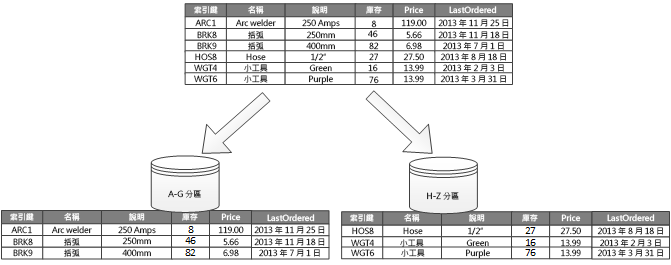

# 水平、垂直和功能性資料分割

在許多大型解決方案中，資料分成分割區，可以個別管理和存取。 資料分割可以改善延展性、減少爭用，以及最佳化效能。 它也提供機制以根據使用模式來分隔資料。 例如，您可以將較舊的資料封存至成本較低的資料儲存空間。

但是，您必須仔細選擇資料分割策略，才能最大化利益，同時將不良影響降至最低。

> [!NOTE]
> 本中所用的「資料分割」一詞指的是實際將資料區分至個別資料存放區的程序。 這和 SQL Server 的資料表分割不同。

<!-- markdownlint-disable MD026 -->

## 為何要分割資料？

<!-- markdownlint-enable MD026 -->

- **改善延展性**。 當您相應增加單一資料庫系統時，其最終將會到達實體硬體限制。 如果您跨多個分割區來區分資料，而其中每一個分割區都裝載於個別伺服器上，您幾乎能夠無限制地相應放大系統。

- **提升效能**。 在每個分割區上的資料存取作業會透過較小的資料磁碟區進行。 正確完成的話，資料分割可讓您的系統更有效率。 影響多個分割區的作業都能平行執行。

- **改善安全性**。 在某些情況下，您可以將機密和非機密資料分隔到不同的分割區，並且將不同的安全性控制項套用至機密資料。

- **提供做業彈性**。 資料分割提供許多微調作業、最大化系統管理效率和最小化成本的機會。 例如，您可以根據資料在每個分割區中的重要性，來定義適用於管理、監視、備份和還原的不同原則，以及其他系統管理工作。

- **比對資料存放區和使用模式**。 資料分割可根據資料存放區所提供的成本和內建功能，讓每個分割區部署在不同類型的資料存放區上。 例如，大型二進位資料可儲存於 Blob 儲存體，而更為結構化的資料可保存於文件資料庫中。 請參閱[選擇正確的資料存放區](../guide/technology-choices/data-store-overview.md)。

- **改善可用性**。 跨多個伺服器分格資料可避免單一失敗點。 如果一個執行個體失敗，則只有該分割區中的資料無法使用。 在其他分割區上的作業可以繼續進行。 針對受控 PaaS 資料存放區，這項考量較不相關，因為這些服務已設計成具有內建備援。

## 移除分割區

分割資料的三個典型的策略是：

- **水平資料分割** (通常稱為「分區化」)。 在此策略中，每個分割區都是資料存放區，但所有分割區具有相同的結構描述。 每個分割區都稱為「分區」，而且會保存特定的資料子集，例如，一組特定客戶的所有訂單。

- **垂直資料分割**。 在此策略中，每個分割區會在資料存放區中保留項目的欄位子集。 欄位會根據其使用模式來區分。 比方說，經常存取的欄位可能會放在一個垂直的分割區中，而較不常存取的欄位則放置於另一個分割區中。

- **功能資料分割**。 在此策略中，資料會根據系統中每個繫結的內容使用它的方式進行彙總。 例如，電子商務系統可能會將發票資料儲存在某個分割區，而將產品庫存資料儲存在另一個分割區。

這些策略可以合併，建議您在設計資料分割配置時應全部納入考量。 例如，您可能會將資料區分成分區，然後使用垂直資料分割進一步細分每個分區中的資料。

### 水平資料分割 (分區化)

圖 1 顯示水平資料分割或分區化。 在此範例中，產品庫存資料會根據產品索引鍵區分成分區。 每個分區都保存分區索引鍵 (A-G 和 H-Z) 的連續範圍資料，依照字母順序排列。 分區化會將負載分散到多部電腦，以減少爭用並改善效能。

*圖 1.水平資料分割 (分區化) 的資料是以分割區索引鍵為基礎。*

最重要的因素是分區金鑰的選擇。 系統在作業之後，就很難變更索引鍵。 金鑰必須確定資料已分割，使工作負載盡可能跨分區平均分配。

分區的大小不一定要相同。 務必讓要求數目平衡。 有些分區可能非常大，但每個項目都只有少量存取作業。 其他的分區可能比較小，但是更常存取每個項目。 另一個重點是確保單一分區不會超過資料存放區的規模限制 (以容量和處理資源為準)。

請避免建立「熱點」分割區，其會影響效能和可用性。 例如，使用客戶名稱的第一個字母會導致分散不平衡，因為某些字母較為常見。而改為使用客戶識別碼的雜湊就可以將資料平均地分散到分割區。

選擇可最小化任何未來需求的分區金鑰，以分割大型分區、將小型分區聯合成較大的分割區，或者變更結構描述。 這些作業非常耗時，而且可能需要在執行時讓一或多個分區離線。

如果複寫分區，某些複本可能要保持上線，而其他複本會被劃分、合併或重新設定。 但在進行重新設定時，系統可能需要限制可以執行的作業。 例如，複本中的資料可能會標示為唯讀，以避免資料不一致。

如需有關水平資料分割的詳細資訊，請參閱 [分區化模式]。

### 垂直資料分割

垂直資料分割的最常見用途是可降低與擷取最常存取之項目相關聯的 I/O 和效能成本。 圖 2 顯示垂直資料分割的範例。 在此範例中，項目的不同屬性都會儲存在不同的分割區中。 有一個分割區會保留較常存取的資料，包括產品名稱、描述和價格。 另一個分割區會保留庫存資料：庫存計數和上次訂購日期。

*圖 2.依使用模式垂直分割資料。*

在此範例中，應用程式會在向客戶顯示產品詳細資料時，固定查詢產品名稱、描述和價格。 庫存計數和上次訂購日期會保留在個別的分割區，因為這兩個項目通常會一起使用。

垂直資料分割的其他優點：

- 移動頻率相當低的資料 (產品名稱、描述和價格) 可以和較動態的資料 (存貨量和上一次訂單日期) 分開。 移動頻率低的資料是應用程式在記憶體中快取的良好候選項目。

- 機密資料可以儲存在具有其他安全性控制項的個別分割區中。

- 垂直資料分割可以減少所需的並行存取數量。

垂直資料分割都是在資料存放區內的實體層級運做，有部分會正規化實體，將其從「廣泛」項目細分成一組「縮小」項目。 在理想的情況下，它適用於 HBase 和 Cassandra 等資料行導向的資料存放區。 如果資料行集合中的資料不太可能變更，您也可以考慮使用 SQL Server 中的資料行存放區。

### 功能資料分割

可以在應用程式中為每個不同的商業領域識別繫結內容時，功能資料分割是可改善隔離和資料存取效能的一種方法。 功能資料分割的另一種常用功能是將讀寫資料與唯讀資料分開。 圖 3 顯示功能資料分割的概觀，清查資料可從客戶的資料分開。

*圖 3.依繫結的內容或子網域分割的功能分割資料。*

此資料分割策略有助於減少跨系統的不同部分所發生的資料存取爭用。

## 設計延展性的分割區

請務必考慮每個分割區的大小和工作負載並加以平衡，使資料分佈以達到最大延展性。 不過，您也必須分割資料，使它不會超過單一資料分割存放區的調整限制。

設計具延展性的分割區時，請遵循下列步驟：

1. 分析應用程式以了解資料存取模式，例如每個查詢所傳回的結果集大小、存取的頻率、固有的延遲，以及伺服器端計算處理需求。 在許多情況下，幾個主要實體會要求大部分的處理資源。
2. 使用此分析來判斷目前和未來的延展性目標，例如資料大小和工作負載。 然後將資料分散在各個分割區上，以符合延展性目標。 針對水平資料分割，選擇適當的分區金鑰，這對確定分佈是否平均很重要。 如需詳細資訊，請參閱 [分區化模式]。
3. 請確定每個分割區具有足夠資源，可處理資料大小和輸送量方面的延展性需求。 根據資料存放區的不同，儲存空間、處理能力或每個分割區的網路頻寬可能會有所限制。 如果需求可能會超過這些限制，您就可能需要調整您的資料分割策略或進一步劃分資料，也許要合併兩個以上的策略。
4. 監視系統以確認資料會如預期般分佈，而且分割區可以處理負載。 實際的使用方式不一定符合分析預測。 如果是這樣，可能可以重新平衡分割區，或是重新設計系統的某些部分以取得必要的平衡。

某些雲端環境會根據基礎結構界限配置資源。 您應該確定您所選界限的限制可在資料儲存體、處理能力及頻寬等方面，提供足夠的空間，使資料量能夠如預期般成長。

例如如果您使用 Azure 資料表儲存空間，對於單一磁碟區可在一段特定期間內處理的要求數量是有限制的。 (請參閱 [Azure 儲存體的延展性與效能目標]。)忙碌的分區可能會需要比單一分割區可以處理還要多的資源。 如果是這樣，可能需要重新分割分區以散佈負載。 如果這些資料表的總大小或輸送量超過儲存體帳戶的容量，您可能必須建立其他儲存體帳戶並跨這些帳戶散佈資料表。

## 設計查詢效能的分割區

使用較小的資料集和執行平行查詢，通常可提高查詢效能。 每個分割區都應包含整個資料集的一小部分。 數量的縮減可以改善查詢效能。 不過，資料分割並不是適當地設計和設定資料庫的替代方式。 例如，請確定您已備妥必要的索引。

基於查詢效能設計分割區時，請遵循下列步驟：

1. 檢查應用程式的需求以及效能：

   - 使用商務需求來判斷隨時必須快速執行的重要查詢。
   - 監視系統以識別任何執行速度慢的查詢。
   - 尋找最常執行的查詢。 即使單一查詢的成本最低，但是累計資源耗用量可能相當高。

2. 分割會導致效能變慢的資料：
   - 限制每個分割區的大小，使查詢回應時間在目標內。
   - 如果您使用水平資料分割，請設計分區金鑰，讓應用程式可以輕鬆地選取分割區。 這可防止查詢需要掃描每個分割區。
   - 請考慮分割區的位置。 如果可能，請嘗試將資料保留在地理位置靠近存取它之應用程式和使用者的分割區。

3. 如果實體有輸送量和查詢效能的需求，請根據該實體使用功能資料分割。 如果這樣還是無法滿足需求，請同時套用水平資料分割。 在大部分情況下，單一資料分割策略就足夠了，但在某些情況下，結合這兩種策略會更有效率。

4. 請考慮跨分割區平行執行查詢，以改善效能。

## 設計可用性的分割區

分割資料可以確保整個資料集不會構成單一失敗點，而且確保資料集的個別子集可以分開管理，藉以改善應用程式的可用性。

請考慮下列會影響可用性的因素：

**資料對商務營運的重要性**。 識別哪些資料是重要商務資訊，例如交易，而哪些資料是較不重要的作業資料，例如記錄檔。

- 請考慮利用適當的備份計劃，將重要資料儲存在高度可用的分割區中。

- 針對不同的資料集建立個別的管理和監視程序。

- 將具有相同嚴重性等級的資料放在同一個分割區，利用適當的頻率一併進行備份。 例如，保留交易資料的分割區的備份頻率可能必須高於保留記錄或追蹤資訊的分割區。

**個別分割區的管理方式**。 將分割區設計為支援獨立管理和維護可提供數個優點。 例如︰

- 如果分割區失敗，可以獨立復原而不會影響在其他分割區中存取資料的應用程式。

- 依地理區域分割資料，允許已排程的維護工作在每個位置的離峰時段進行。 請確定分割區不會太大而無法防止任何已規劃的分割區維護在這段期間完成。

**是否要跨分割區複寫重要資料**。 此策略可以改善可用性和效能，不過它也會導入一致性問題。 需要時間來同步處理每個複本的變更。 在這段期間，不同的分割區會包含不同的資料值。

## 應用程式設計考量

資料分割會增加系統設計和開發的複雜度。 即使系統一開始只包含單一分割區，也請考慮將資料分割視為系統設計的基本部分。 如果您事後才處理資料分割，因為您已經有需要維護的即時系統，因此更具挑戰性：

- 需要修改資料存取邏輯。
- 可能需要遷移大量的現有資料，將資料分佈到分割區
- 使用者期望可以在移轉期間繼續使用系統。

在某些情況下，資料分割並不重要，因為初始資料集很小，而且可以輕鬆地由單一伺服器處理。 對於部分工作負載來說可能是如此，但是許多商務系統需要隨著使用者數目增加而擴充。

此外，不只有大型資料存放區受益於資料分割。 例如，數百個並行用戶端可能會大量存取一個小型資料存放區。 在此情況下將資料分割可以協助減少爭用並提高輸送量。

當您設計資料分割配置時，應考慮下列幾點：

**最小化跨分割區資料存取作業**。 盡可能一併保留每個分割區中最常見資料庫作業的資料，以使跨分割區的資料存取作業減到最少。 跨分割區查詢可能比在單一分割區內查詢更費時，但是最佳化一組查詢的分割區可能會對其他組的查詢造成不良影響。 如果您必須跨分割區查詢，可以在應用程式內執行平行查詢並彙總結果，來將查詢時間降至最低。 (在某些情況下可能無法使用這種方法，例如，從某個查詢中取得的結果在下一個查詢使用時。)

**請考慮複寫靜態參考資料。** 如果查詢使用相對靜態的參考資料 (例如，郵遞區號資料表或產品清單)，請考慮將此資料複寫到所有分割區，以減少在不同分割區中個別查閱作業。 這種方法也會減少參考資料成為「熱門」資料集的可能性，具有整個系統中的高流量。 不過，還是會有與同步處理此參考資料的任何變更相關聯的其他成本。

**最小化跨分割區聯結。** 盡可能最小化跨垂直和功能分割區之參考完整性的需求。 在這些配置中，應用程式會負責維護跨分割區的參考完整性。 跨多個分割區聯結資料的查詢效率不佳，因為應用程式通常必須先根據索引鍵，接著根據外部索引鍵來執行連續查詢。 請改為考慮將相關資料複寫或取消正規化。 如果需要跨分割區聯結，請在分割區之間執行平行查詢，並在應用程式內聯結資料。

**擁有最終一致性**。  評估強式一致性是否為實際的需求。 分散式系統中的常見方法是實作最終一致性。 每個分割區中的資料會個別更新，而應用程式邏輯可確保所有更新都會順利完成。 它也會在執行最終一致性作業時，處理查詢資料所引發的不一致性。

**請考慮查詢如何尋找正確的分割區**。 如果查詢必須掃描所有分割區來尋找所需的資料，即使是有多個平行查詢正在執行，還是會對效能產生嚴重的影響。 搭配垂直和功能資料分割策略使用的查詢可以自然指定分割區。 但另一方面，水平資料分割會使得尋找項目變得困難，因為每個分區都有相同的結構描述。 典型解決方案是維護對應，用來查閱特定資料項目的分區位置。 此對應會在應用程式的分區化邏輯中實作，或者如果它支援透明的分區化，就會由資料存放區維護。

**請考慮定期重新平衡分區**。 使用水平資料分割，重新平衡分區有助於根據大小和工作負載來平均分佈資料，進而最小化作用點、最大化查詢效能，並解決實體的儲存體限制。 不過，這是一個複雜的工作，通常需要使用自訂工具或程序。

**複寫資料分割。** 如果您複寫每個分割區，就能提供額外的保護以防止發生錯誤。 如果單一複本失敗，查詢可以導向至可用的複本。

**如果您達到資料分割策略的實體限制，您可能必須將延展性擴充至不同層級**。 例如，如果資料分割是在資料庫層級，您可能需要尋找或複寫多個資料庫中的分割區。 如果資料分割已經在資料庫層級，而且發生實體限制的問題，可能表示您需要尋找或複寫多個裝載帳戶中的分割區。

**避免在多個分割區中存取資料的交易**。 某些資料存放區會為了修改資料的作業而實作交易一致性和完整性，但唯有當資料位於單一分割區時才如此。 如果您需要跨多個分割區的交易式支援，您可能必須實作此支援做為應用程式邏輯的一部分，因為大部分的資料分割系統不會提供原生支援。

所有資料存放區都需要某些作業管理和監視活動。 工作的範圍可包含載入資料、備份和還原資料、重新組織資料，以及確保系統正確、有效率地執行。

請考慮下列會影響作業管理的因素：

- **對分割資料時，如何實作適當的管理和操作工作**。 這些工作可能包括備份與還原、封存資料、監視系統，以及其他管理工作。 例如，在備份和還原作業期間維護邏輯一致性是一項挑戰。

- **如何將資料載入多個分割區，並新增從其他來源送達的新資料**。 某些工具和公用程式可能不支援分區化資料作業，例如，將資料載入正確的分割區。

- **如何定期封存及刪除資料**。 若要防止分割區過度成長，您必須定期 (也許是每月) 封存及刪除資料。 可能需要轉換資料，以符合不同的封存結構描述。

- **如何找出資料完整性問題**。 請考慮定期執行程序以尋找任何資料完整性問題，例如，某一個分割區中的資料會參考另一個分割區中遺失的資訊。 此程序可嘗試自動修正這些問題，或是只產生報告供手動檢閱。

## 重新平衡分割區

隨著系統成熟，您可能必須調整資料分割配置。 例如，個別的分割區可能開始有不當比例的流量並變得熱門，導致過度爭用。 或者您可能低估某些分割區中的資料量，導致某些分割區達到容量限制。

某些資料存放區 (例如 Cosmos DB) 會自動重新平衡分割區。 在其他情況下，重新平衡是由兩個階段組成的系統管理工作：

1. 判斷新的資料分割策略。

    - 哪些分割區必須劃分 (或可能必須結合)？
    - 新的分割區索引鍵是什麼？

2. 將資料從舊的資料分割配置遷移至一組新的分割區。

根據資料存放區的不同，您可以在分割區正在使用中時，在它們之間遷移資料。 這就是所謂的「線上移轉」。 如果此方法不可行，您可能必須在重新定位資料時讓分割區暫時無法使用 (「離線移轉」)。

### 離線移轉

離線移轉一般來說是較簡單的方法，因為它可以減少發生爭用的機會。 就概念而言，離線移轉的運作方式如下所示：

1. 將分割區標示為離線。
2. 劃分-合併資料，並將其移到新的分割區。
3. 驗證資料。
4. 讓新的分割區上線。
5. 移除舊的分割區。

(選擇性) 您可以在步驟 1 中將分割區標示為唯讀，讓應用程式在資料移動時，仍然可以讀取資料。

## 線上移轉

線上移轉執行上較複雜，但是比較不會受到干擾。 其程序與離線移轉相似，不同之處在於原始分割區未標示為離線。 根據移轉程序的細微性 (例如，逐項目與逐分區)，用戶端應用程式中的資料存取程式碼可能必須處理保留在兩個位置 (原始分割區和新分割區) 中之資料的讀取和寫入。

## 相關的模式

下列設計模式可能會與您的案例相關：

- [分區化模式](../patterns/sharding.md)說明一些分區化資料的常見策略。

- [索引資料表模式](../patterns/index-table.md)示範如何建立資料的次要索引。 應用程式可以使用未參考集合的主索引鍵的查詢，透過這個方法快速擷取資料。

- [具體化檢視模式](../patterns/materialized-view.md)說明如何產生預先填入的檢視，可摘要列出資料以支援快速查詢作業。 如果包含已摘要列出之資料的分割區會跨多個網站分佈，則這個方法對分割的資料存放區很有幫助。

## 後續步驟

- 深入了解特定 Azure 服務的資料分割策略。 請參閱[資料分割策略](./data-partitioning-strategies.md)

[Azure 儲存體的延展性與效能目標]: /azure/storage/storage-scalability-targets
