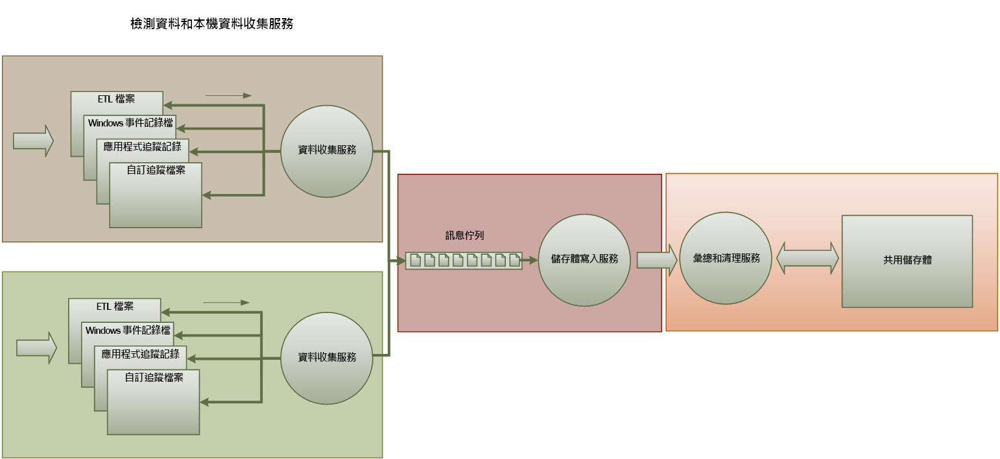

# <a name="monitoring-and-diagnostics"></a><span data-ttu-id="cf511-103">監視和診斷</span><span class="sxs-lookup"><span data-stu-id="cf511-103">Monitoring and diagnostics</span></span>
[!INCLUDE [header](../_includes/header.md)]

<span data-ttu-id="cf511-104">雲端中執行的分散式應用程式及服務依其本質為包括多個移動組件的複雜軟體片段。</span><span class="sxs-lookup"><span data-stu-id="cf511-104">Distributed applications and services running in the cloud are, by their nature, complex pieces of software that comprise many moving parts.</span></span> <span data-ttu-id="cf511-105">在生產環境中，務必能夠追蹤使用者利用您系統的方式、追蹤資源使用量的方式，以及通常監視您系統之健康狀況和效能的方式。</span><span class="sxs-lookup"><span data-stu-id="cf511-105">In a production environment, it's important to be able to track the way in which users utilize your system, trace resource utilization, and generally monitor the health and performance of your system.</span></span> <span data-ttu-id="cf511-106">您可以使用此資訊當做診斷協助來偵測並更正問題，同時也能夠協助找出潛在的問題並避免發生。</span><span class="sxs-lookup"><span data-stu-id="cf511-106">You can use this information as a diagnostic aid to detect and correct issues, and also to help spot potential problems and prevent them from occurring.</span></span>

## <a name="monitoring-and-diagnostics-scenarios"></a><span data-ttu-id="cf511-107">監視和診斷案例</span><span class="sxs-lookup"><span data-stu-id="cf511-107">Monitoring and diagnostics scenarios</span></span>
<span data-ttu-id="cf511-108">您可以使用監視來深入瞭解系統運作的程度。</span><span class="sxs-lookup"><span data-stu-id="cf511-108">You can use monitoring to gain an insight into how well a system is functioning.</span></span> <span data-ttu-id="cf511-109">監視是維護服務品質目標的重要部分。</span><span class="sxs-lookup"><span data-stu-id="cf511-109">Monitoring is a crucial part of maintaining quality-of-service targets.</span></span> <span data-ttu-id="cf511-110">收集監視資料的常見案例包括：</span><span class="sxs-lookup"><span data-stu-id="cf511-110">Common scenarios for collecting monitoring data include:</span></span>

* <span data-ttu-id="cf511-111">確保系統維持良好狀況。</span><span class="sxs-lookup"><span data-stu-id="cf511-111">Ensuring that the system remains healthy.</span></span>
* <span data-ttu-id="cf511-112">追蹤系統和其元件元素的可用性。</span><span class="sxs-lookup"><span data-stu-id="cf511-112">Tracking the availability of the system and its component elements.</span></span>
* <span data-ttu-id="cf511-113">維護效能，以確保系統的輸送量不會在工作量增加時意外地降級。</span><span class="sxs-lookup"><span data-stu-id="cf511-113">Maintaining performance to ensure that the throughput of the system does not degrade unexpectedly as the volume of work increases.</span></span>
* <span data-ttu-id="cf511-114">保證系統符合客戶所建立的任何服務等級協定 (SLA)。</span><span class="sxs-lookup"><span data-stu-id="cf511-114">Guaranteeing that the system meets any service-level agreements (SLAs) established with customers.</span></span>
* <span data-ttu-id="cf511-115">保護系統、使用者和其資料的隱私權和安全性。</span><span class="sxs-lookup"><span data-stu-id="cf511-115">Protecting the privacy and security of the system, users, and their data.</span></span>
* <span data-ttu-id="cf511-116">追蹤因稽核或法規目的而執行的作業。</span><span class="sxs-lookup"><span data-stu-id="cf511-116">Tracking the operations that are performed for auditing or regulatory purposes.</span></span>
* <span data-ttu-id="cf511-117">監視系統的日常使用情況，並找出若未處理，可能導致問題的趨勢。</span><span class="sxs-lookup"><span data-stu-id="cf511-117">Monitoring the day-to-day usage of the system and spotting trends that might lead to problems if they're not addressed.</span></span>
* <span data-ttu-id="cf511-118">追蹤發生的問題，從初始報告到分析可能原因、更正、後續軟體更新和部署。</span><span class="sxs-lookup"><span data-stu-id="cf511-118">Tracking issues that occur, from initial report through to analysis of possible causes, rectification, consequent software updates, and deployment.</span></span>
* <span data-ttu-id="cf511-119">追蹤作業和偵錯軟體版本。</span><span class="sxs-lookup"><span data-stu-id="cf511-119">Tracing operations and debugging software releases.</span></span>

> [!NOTE]
> <span data-ttu-id="cf511-120">這份清單旨不在完整。</span><span class="sxs-lookup"><span data-stu-id="cf511-120">This list is not intended to be comprehensive.</span></span> <span data-ttu-id="cf511-121">本文件著重的這些案例是執行監視時最常見的狀況。</span><span class="sxs-lookup"><span data-stu-id="cf511-121">This document focuses on these scenarios as the most common situations for performing monitoring.</span></span> <span data-ttu-id="cf511-122">可能還有其他較不常見或您環境專屬的案例。</span><span class="sxs-lookup"><span data-stu-id="cf511-122">There might be others that are less common or are specific to your environment.</span></span>
> 
> 

<span data-ttu-id="cf511-123">下列各節更詳細說明這些案例。</span><span class="sxs-lookup"><span data-stu-id="cf511-123">The following sections describe these scenarios in more detail.</span></span> <span data-ttu-id="cf511-124">每個案例的資訊是以下列格式討論：</span><span class="sxs-lookup"><span data-stu-id="cf511-124">The information for each scenario is discussed in the following format:</span></span>

1. <span data-ttu-id="cf511-125">案例的簡短概觀</span><span class="sxs-lookup"><span data-stu-id="cf511-125">A brief overview of the scenario</span></span>
2. <span data-ttu-id="cf511-126">此案例的一般需求</span><span class="sxs-lookup"><span data-stu-id="cf511-126">The typical requirements of this scenario</span></span>
3. <span data-ttu-id="cf511-127">支援案例所需的原始檢測資料，以及此資訊的可能來源</span><span class="sxs-lookup"><span data-stu-id="cf511-127">The raw instrumentation data that's required to support the scenario, and possible sources of this information</span></span>
4. <span data-ttu-id="cf511-128">如何分析並合併此原始資料，以產生有意義的診斷資訊</span><span class="sxs-lookup"><span data-stu-id="cf511-128">How this raw data can be analyzed and combined to generate meaningful diagnostic information</span></span>

## <a name="health-monitoring"></a><span data-ttu-id="cf511-129">健康狀況監視</span><span class="sxs-lookup"><span data-stu-id="cf511-129">Health monitoring</span></span>
<span data-ttu-id="cf511-130">如果系統正在執行，而且能夠處理要求，則狀況良好。</span><span class="sxs-lookup"><span data-stu-id="cf511-130">A system is healthy if it is running and capable of processing requests.</span></span> <span data-ttu-id="cf511-131">健康狀況監視的目的是產生目前系統健康狀況的快照，讓您能夠驗證系統的所有元件是否如預期般運作。</span><span class="sxs-lookup"><span data-stu-id="cf511-131">The purpose of health monitoring is to generate a snapshot of the current health of the system so that you can verify that all components of the system are functioning as expected.</span></span>

### <a name="requirements-for-health-monitoring"></a><span data-ttu-id="cf511-132">健康狀況監視的需求</span><span class="sxs-lookup"><span data-stu-id="cf511-132">Requirements for health monitoring</span></span>
<span data-ttu-id="cf511-133">如果系統的任何部分被視為健康狀況不良，應該快速 (在幾秒內) 警示操作員。</span><span class="sxs-lookup"><span data-stu-id="cf511-133">An operator should be alerted quickly (within a matter of seconds) if any part of the system is deemed to be unhealthy.</span></span> <span data-ttu-id="cf511-134">操作員應該能夠確定系統的哪些部分運作正常，以及哪些部分遭遇問題。</span><span class="sxs-lookup"><span data-stu-id="cf511-134">The operator should be able to ascertain which parts of the system are functioning normally, and which parts are experiencing problems.</span></span> <span data-ttu-id="cf511-135">系統健康狀況可以透過號誌燈系統反白顯示︰</span><span class="sxs-lookup"><span data-stu-id="cf511-135">System health can be highlighted through a traffic-light system:</span></span>

* <span data-ttu-id="cf511-136">紅色代表狀況不良 (系統已停止)</span><span class="sxs-lookup"><span data-stu-id="cf511-136">Red for unhealthy (the system has stopped)</span></span>
* <span data-ttu-id="cf511-137">黃色表示部分狀況良好 (系統是以精簡功能執行)</span><span class="sxs-lookup"><span data-stu-id="cf511-137">Yellow for partially healthy (the system is running with reduced functionality)</span></span>
* <span data-ttu-id="cf511-138">綠色代表完全健全</span><span class="sxs-lookup"><span data-stu-id="cf511-138">Green for completely healthy</span></span>

<span data-ttu-id="cf511-139">完整的健康狀況監視系統可讓操作員向下鑽研系統，來檢視子系統和元件的健康狀況狀態。</span><span class="sxs-lookup"><span data-stu-id="cf511-139">A comprehensive health-monitoring system enables an operator to drill down through the system to view the health status of subsystems and components.</span></span> <span data-ttu-id="cf511-140">例如，如果整體系統被描述成健康狀況局部良好，操作員應該能夠放大，並且判斷哪些功能目前無法使用。</span><span class="sxs-lookup"><span data-stu-id="cf511-140">For example, if the overall system is depicted as partially healthy, the operator should be able to zoom in and determine which functionality is currently unavailable.</span></span>

### <a name="data-sources-instrumentation-and-data-collection-requirements"></a><span data-ttu-id="cf511-141">資料來源、檢測和資料收集需求</span><span class="sxs-lookup"><span data-stu-id="cf511-141">Data sources, instrumentation, and data-collection requirements</span></span>
<span data-ttu-id="cf511-142">支援健康狀況監視所需的原始資料，可以由下列情況產生：</span><span class="sxs-lookup"><span data-stu-id="cf511-142">The raw data that's required to support health monitoring can be generated as a result of:</span></span>

* <span data-ttu-id="cf511-143">追蹤使用者要求的執行情況。</span><span class="sxs-lookup"><span data-stu-id="cf511-143">Tracing execution of user requests.</span></span> <span data-ttu-id="cf511-144">這項資訊可以用來判斷哪些要求已成功、哪些要求已失敗，以及每個要求花費多長時間。</span><span class="sxs-lookup"><span data-stu-id="cf511-144">This information can be used to determine which requests have succeeded, which have failed, and how long each request takes.</span></span>
* <span data-ttu-id="cf511-145">綜合使用者監視。</span><span class="sxs-lookup"><span data-stu-id="cf511-145">Synthetic user monitoring.</span></span> <span data-ttu-id="cf511-146">此程序會模擬使用者所執行的步驟，並遵循預先定義的一連串步驟。</span><span class="sxs-lookup"><span data-stu-id="cf511-146">This process simulates the steps performed by a user and follows a predefined series of steps.</span></span> <span data-ttu-id="cf511-147">應該擷取每個步驟的結果。</span><span class="sxs-lookup"><span data-stu-id="cf511-147">The results of each step should be captured.</span></span>
* <span data-ttu-id="cf511-148">記錄例外狀況、錯誤和警告。</span><span class="sxs-lookup"><span data-stu-id="cf511-148">Logging exceptions, faults, and warnings.</span></span> <span data-ttu-id="cf511-149">可以擷取此資訊，做為內嵌於應用程式程式碼之追蹤陳述式的結果，以及從系統參考之任何服務的事件記錄中擷取資訊。</span><span class="sxs-lookup"><span data-stu-id="cf511-149">This information can be captured as a result of trace statements embedded into the application code, as well as retrieving information from the event logs of any services that the system references.</span></span>
* <span data-ttu-id="cf511-150">監視系統使用之任何協力廠商服務的健康狀況。</span><span class="sxs-lookup"><span data-stu-id="cf511-150">Monitoring the health of any third-party services that the system uses.</span></span> <span data-ttu-id="cf511-151">此監視可能需要擷取並剖析這些服務提供的健康狀況資料。</span><span class="sxs-lookup"><span data-stu-id="cf511-151">This monitoring might require retrieving and parsing health data that these services supply.</span></span> <span data-ttu-id="cf511-152">此資訊可能採取各種格式。</span><span class="sxs-lookup"><span data-stu-id="cf511-152">This information might take a variety of formats.</span></span>
* <span data-ttu-id="cf511-153">端點監視。</span><span class="sxs-lookup"><span data-stu-id="cf511-153">Endpoint monitoring.</span></span> <span data-ttu-id="cf511-154">此機制會在＜可用性監視＞一節中詳細說明。</span><span class="sxs-lookup"><span data-stu-id="cf511-154">This mechanism is described in more detail in the "Availability monitoring" section.</span></span>
* <span data-ttu-id="cf511-155">收集環境效能資訊，例如背景 CPU 使用率或 I/O (包括網路) 活動。</span><span class="sxs-lookup"><span data-stu-id="cf511-155">Collecting ambient performance information, such as background CPU utilization or I/O (including network) activity.</span></span>

### <a name="analyzing-health-data"></a><span data-ttu-id="cf511-156">分析健康狀況資料</span><span class="sxs-lookup"><span data-stu-id="cf511-156">Analyzing health data</span></span>
<span data-ttu-id="cf511-157">健康狀況監視的主要焦點在於快速指出系統是否正在執行。</span><span class="sxs-lookup"><span data-stu-id="cf511-157">The primary focus of health monitoring is to quickly indicate whether the system is running.</span></span> <span data-ttu-id="cf511-158">如果偵測到重要元件的健康狀況不良，則即時資料的熱分析可以觸發警示</span><span class="sxs-lookup"><span data-stu-id="cf511-158">Hot analysis of the immediate data can trigger an alert if a critical component is detected as unhealthy.</span></span> <span data-ttu-id="cf511-159">(例如，其無法回應一連串連續的 Ping)。然後，操作員可以採取適當的更正動作。</span><span class="sxs-lookup"><span data-stu-id="cf511-159">(It fails to respond to a consecutive series of pings, for example.) The operator can then take the appropriate corrective action.</span></span>

<span data-ttu-id="cf511-160">更進階的系統可能包含對最近和目前工作負載執行冷分析的預測元素。</span><span class="sxs-lookup"><span data-stu-id="cf511-160">A more advanced system might include a predictive element that performs a cold analysis over recent and current workloads.</span></span> <span data-ttu-id="cf511-161">冷分析可以找出趨勢，並判斷系統是否可能一直保持健康狀況良好，或者系統是否需要其他資源。</span><span class="sxs-lookup"><span data-stu-id="cf511-161">A cold analysis can spot trends and determine whether the system is likely to remain healthy or whether the system will need additional resources.</span></span> <span data-ttu-id="cf511-162">此預測元素應該以關鍵效能計量為依據，例如：</span><span class="sxs-lookup"><span data-stu-id="cf511-162">This predictive element should be based on critical performance metrics, such as:</span></span>

* <span data-ttu-id="cf511-163">每個服務或子系統中引導的要求速率。</span><span class="sxs-lookup"><span data-stu-id="cf511-163">The rate of requests directed at each service or subsystem.</span></span>
* <span data-ttu-id="cf511-164">這些要求的回應時間。</span><span class="sxs-lookup"><span data-stu-id="cf511-164">The response times of these requests.</span></span>
* <span data-ttu-id="cf511-165">流入和流出每個服務的資料量。</span><span class="sxs-lookup"><span data-stu-id="cf511-165">The volume of data flowing into and out of each service.</span></span>

<span data-ttu-id="cf511-166">如果任何計量的值超過定義的臨界值，系統可引發警示，讓操作員或自動調整 (如果有的話) 能夠採取必要的預防動作，以維護系統健康狀況。</span><span class="sxs-lookup"><span data-stu-id="cf511-166">If the value of any metric exceeds a defined threshold, the system can raise an alert to enable an operator or autoscaling (if available) to take the preventative actions necessary to maintain system health.</span></span> <span data-ttu-id="cf511-167">這些動作可能包括加入資源、重新啟動一或多個失敗服務，或套用節流至優先順序較低的要求。</span><span class="sxs-lookup"><span data-stu-id="cf511-167">These actions might involve adding resources, restarting one or more services that are failing, or applying throttling to lower-priority requests.</span></span>

## <a name="availability-monitoring"></a><span data-ttu-id="cf511-168">可用性監視</span><span class="sxs-lookup"><span data-stu-id="cf511-168">Availability monitoring</span></span>
<span data-ttu-id="cf511-169">真正健康狀況良好的系統需要以可用的元件和子系統組成系統。</span><span class="sxs-lookup"><span data-stu-id="cf511-169">A truly healthy system requires that the components and subsystems that compose the system are available.</span></span> <span data-ttu-id="cf511-170">可用性監視與健康狀況監視密切相關。</span><span class="sxs-lookup"><span data-stu-id="cf511-170">Availability monitoring is closely related to health monitoring.</span></span> <span data-ttu-id="cf511-171">但是健康狀況監視提供系統目前健康狀況的即時檢視，而可用性監視涉及追蹤系統及其元件的可用性，以產生有關系統運作時間的統計資料。</span><span class="sxs-lookup"><span data-stu-id="cf511-171">But whereas health monitoring provides an immediate view of the current health of the system, availability monitoring is concerned with tracking the availability of the system and its components to generate statistics about the uptime of the system.</span></span>

<span data-ttu-id="cf511-172">在許多系統中，某些元件 (例如資料庫) 設定有內建備援，以允許發生嚴重錯誤或連線中斷時快速容錯移轉。</span><span class="sxs-lookup"><span data-stu-id="cf511-172">In many systems, some components (such as a database) are configured with built-in redundancy to permit rapid failover in the event of a serious fault or loss of connectivity.</span></span> <span data-ttu-id="cf511-173">在理想情況下，使用者應該不會察覺發生這類失敗。</span><span class="sxs-lookup"><span data-stu-id="cf511-173">Ideally, users should not be aware that such a failure has occurred.</span></span> <span data-ttu-id="cf511-174">但從可用性監視的觀點來看，儘可能收集越多有關這類失敗的資訊來判斷原因，然後採取更正動作，以防止它們重複發生。</span><span class="sxs-lookup"><span data-stu-id="cf511-174">But from an availability monitoring perspective, it's necessary to gather as much information as possible about such failures to determine the cause and take corrective actions to prevent them from recurring.</span></span>

<span data-ttu-id="cf511-175">追蹤可用性所需的資料可能取決於一些低階因素。</span><span class="sxs-lookup"><span data-stu-id="cf511-175">The data that's required to track availability might depend on a number of lower-level factors.</span></span> <span data-ttu-id="cf511-176">這其中許多因素可能是應用程式、系統和環境特定的。</span><span class="sxs-lookup"><span data-stu-id="cf511-176">Many of these factors might be specific to the application, system, and environment.</span></span> <span data-ttu-id="cf511-177">有效的監視系統會擷取對應至這些低階因素的可用性資料，然後將其彙總以提供系統的整體圖片。</span><span class="sxs-lookup"><span data-stu-id="cf511-177">An effective monitoring system captures the availability data that corresponds to these low-level factors and then aggregates them to give an overall picture of the system.</span></span> <span data-ttu-id="cf511-178">例如，在電子商務系統中，可讓客戶下訂單的商務功能可能取決於儲存訂單詳細資料的儲存機制，以及為這些訂單處理貨幣交易的付款系統。</span><span class="sxs-lookup"><span data-stu-id="cf511-178">For example, in an e-commerce system, the business functionality that enables a customer to place orders might depend on the repository where order details are stored and the payment system that handles the monetary transactions for paying for these orders.</span></span> <span data-ttu-id="cf511-179">因此，系統下訂單部分的可用性是儲存機制和付款子系統的可用性功能。</span><span class="sxs-lookup"><span data-stu-id="cf511-179">The availability of the order-placement part of the system is therefore a function of the availability of the repository and the payment subsystem.</span></span>

### <a name="requirements-for-availability-monitoring"></a><span data-ttu-id="cf511-180">可用性監視需求</span><span class="sxs-lookup"><span data-stu-id="cf511-180">Requirements for availability monitoring</span></span>
<span data-ttu-id="cf511-181">操作員也應該能夠檢視每個系統和子系統的可用性歷程記錄，並使用此資訊來找出任何可能造成一或多個子系統定期失敗的趨勢(服務是否會在當天對應至尖峰處理時間的特定時間開始失敗？</span><span class="sxs-lookup"><span data-stu-id="cf511-181">An operator should also be able to view the historical availability of each system and subsystem, and use this information to spot any trends that might cause one or more subsystems to periodically fail.</span></span> <span data-ttu-id="cf511-182">)</span><span class="sxs-lookup"><span data-stu-id="cf511-182">(Do services start to fail at a particular time of day that corresponds to peak processing hours?)</span></span>

<span data-ttu-id="cf511-183">監視解決方案應該提供每個子系統的可用性或無法使用的即時和歷程記錄檢視。</span><span class="sxs-lookup"><span data-stu-id="cf511-183">A monitoring solution should provide an immediate and historical view of the availability or unavailability of each subsystem.</span></span> <span data-ttu-id="cf511-184">它也應該能夠在一或多個服務失敗或使用者無法連接至服務時快速警示操作員。</span><span class="sxs-lookup"><span data-stu-id="cf511-184">It should also be capable of quickly alerting an operator when one or more services fail or when users can't connect to services.</span></span> <span data-ttu-id="cf511-185">這不只會監視每個服務，也會在每位使用者執行的動作嘗試與服務通訊但卻失敗時檢查這些動作。</span><span class="sxs-lookup"><span data-stu-id="cf511-185">This is a matter of not only monitoring each service, but also examining the actions that each user performs if these actions fail when they attempt to communicate with a service.</span></span> <span data-ttu-id="cf511-186">某種程度來說，有一些連接失敗是正常情況。</span><span class="sxs-lookup"><span data-stu-id="cf511-186">To some extent, a degree of connectivity failure is normal and might be due to transient errors.</span></span> <span data-ttu-id="cf511-187">有可能是因為暫時性錯誤，但允許系統就特定時段發生的子系統失敗連接數目發出警示，可能會有幫助。</span><span class="sxs-lookup"><span data-stu-id="cf511-187">But it might be useful to allow the system to raise an alert for the number of connectivity failures to a specified subsystem that occur during a specific period.</span></span>

### <a name="data-sources-instrumentation-and-data-collection-requirements"></a><span data-ttu-id="cf511-188">資料來源、檢測和資料收集需求</span><span class="sxs-lookup"><span data-stu-id="cf511-188">Data sources, instrumentation, and data-collection requirements</span></span>
<span data-ttu-id="cf511-189">使用健康狀況監視時，支援可用性監視所需的原始資料，可由綜合使用者監控和記錄任何例外狀況、錯誤和警告產生。</span><span class="sxs-lookup"><span data-stu-id="cf511-189">As with health monitoring, the raw data that's required to support availability monitoring can be generated as a result of synthetic user monitoring and logging any exceptions, faults, and warnings that might occur.</span></span> <span data-ttu-id="cf511-190">此外，可用性資料也可以取自執行端點監視。</span><span class="sxs-lookup"><span data-stu-id="cf511-190">In addition, availability data can be obtained from performing endpoint monitoring.</span></span> <span data-ttu-id="cf511-191">應用程式可以公開一個或多個健康的端點，每個測試皆存取至系統內的功能區域。</span><span class="sxs-lookup"><span data-stu-id="cf511-191">The application can expose one or more health endpoints, each testing access to a functional area within the system.</span></span> <span data-ttu-id="cf511-192">監視系統可以依照定義的排程 Ping 每個端點，並收集結果 (成功或失敗)。</span><span class="sxs-lookup"><span data-stu-id="cf511-192">The monitoring system can ping each endpoint by following a defined schedule and collect the results (success or fail).</span></span>

<span data-ttu-id="cf511-193">必須記錄所有的逾時、網路連線失敗，以及連接重試次數。</span><span class="sxs-lookup"><span data-stu-id="cf511-193">All timeouts, network connectivity failures, and connection retry attempts must be recorded.</span></span> <span data-ttu-id="cf511-194">所有資料應該加上時間戳記。</span><span class="sxs-lookup"><span data-stu-id="cf511-194">All data should be time-stamped.</span></span>

<a name="analyzing-availability-data"></a>

### <a name="analyzing-availability-data"></a><span data-ttu-id="cf511-195">分析可用性資料</span><span class="sxs-lookup"><span data-stu-id="cf511-195">Analyzing availability data</span></span>
<span data-ttu-id="cf511-196">檢測資料必須加以彙總並相互關聯，以支援下列類型的分析：</span><span class="sxs-lookup"><span data-stu-id="cf511-196">The instrumentation data must be aggregated and correlated to support the following types of analysis:</span></span>

* <span data-ttu-id="cf511-197">系統與子系統的立即可用性。</span><span class="sxs-lookup"><span data-stu-id="cf511-197">The immediate availability of the system and subsystems.</span></span>
* <span data-ttu-id="cf511-198">系統和子系統的可用性失敗率。</span><span class="sxs-lookup"><span data-stu-id="cf511-198">The availability failure rates of the system and subsystems.</span></span> <span data-ttu-id="cf511-199">在理想情況下，操作員應該能夠使失敗與特定活動相互關聯：系統失敗時正在進行什麼動作？</span><span class="sxs-lookup"><span data-stu-id="cf511-199">Ideally, an operator should be able to correlate failures with specific activities: what was happening when the system failed?</span></span>
* <span data-ttu-id="cf511-200">系統或任何子系統在任何指定期間範圍內的失敗率歷程記錄檢視，以及系統在失敗發生時的負載 (例如使用者要求的數目)。</span><span class="sxs-lookup"><span data-stu-id="cf511-200">A historical view of failure rates of the system or any subsystems across any specified period, and the load on the system (number of user requests, for example) when a failure occurred.</span></span>
* <span data-ttu-id="cf511-201">無法使用系統或任何子系統的原因。</span><span class="sxs-lookup"><span data-stu-id="cf511-201">The reasons for unavailability of the system or any subsystems.</span></span> <span data-ttu-id="cf511-202">例如，原因可能是服務未執行、連線遺失、已連接但逾時，以及已連接但傳回錯誤。</span><span class="sxs-lookup"><span data-stu-id="cf511-202">For example, the reasons might be service not running, connectivity lost, connected but timing out, and connected but returning errors.</span></span>

<span data-ttu-id="cf511-203">您可以在一段期間後，使用下列公式來計算服務的可用性百分比：</span><span class="sxs-lookup"><span data-stu-id="cf511-203">You can calculate the percentage availability of a service over a period of time by using the following formula:</span></span>

```
%Availability =  ((Total Time – Total Downtime) / Total Time ) * 100
```

<span data-ttu-id="cf511-204">這有助於 SLA 用途</span><span class="sxs-lookup"><span data-stu-id="cf511-204">This is useful for SLA purposes.</span></span> <span data-ttu-id="cf511-205">(本指南稍後將詳加說明 [SLA 監視](#SLA-monitoring))。「停機」定義取決於服務。</span><span class="sxs-lookup"><span data-stu-id="cf511-205">([SLA monitoring](#SLA-monitoring) is described in more detail later in this guidance.) The definition of *downtime* depends on the service.</span></span> <span data-ttu-id="cf511-206">舉例來說，Visual Studio Team Services 建置服務將停機時間定義為建置服務無法使用的時間範圍 (總累積分鐘數)。</span><span class="sxs-lookup"><span data-stu-id="cf511-206">For example, Visual Studio Team Services Build Service defines downtime as the period (total accumulated minutes) during which Build Service is unavailable.</span></span> <span data-ttu-id="cf511-207">如果所要求對組建服務執行由客戶起始之作業的連續 HTTP 要求，在整整一分鐘內產生了錯誤代碼或未傳回回應，則視為該服務無法使用一分鐘。</span><span class="sxs-lookup"><span data-stu-id="cf511-207">A minute is considered unavailable if all continuous HTTP requests to Build Service to perform customer-initiated operations throughout the minute either result in an error code or do not return a response.</span></span>

## <a name="performance-monitoring"></a><span data-ttu-id="cf511-208">效能監視</span><span class="sxs-lookup"><span data-stu-id="cf511-208">Performance monitoring</span></span>
<span data-ttu-id="cf511-209">由於系統的壓力越來越大 (因為使用者數量增加)，這些使用者存取的資料集大小會成長，而且越可能發生一或多個元件失敗的情況。</span><span class="sxs-lookup"><span data-stu-id="cf511-209">As the system is placed under more and more stress (by increasing the volume of users), the size of the datasets that these users access grows and the possibility of failure of one or more components becomes more likely.</span></span> <span data-ttu-id="cf511-210">通常，在元件失敗之前效能會先降低。</span><span class="sxs-lookup"><span data-stu-id="cf511-210">Frequently, component failure is preceded by a decrease in performance.</span></span> <span data-ttu-id="cf511-211">如果您能夠偵測這類降低，就可以採取主動步驟來修正這個狀況。</span><span class="sxs-lookup"><span data-stu-id="cf511-211">If you're able detect such a decrease, you can take proactive steps to remedy the situation.</span></span>

<span data-ttu-id="cf511-212">系統效能取決於許多因素。</span><span class="sxs-lookup"><span data-stu-id="cf511-212">System performance depends on a number of factors.</span></span> <span data-ttu-id="cf511-213">每個因素通常是透過關鍵效能指標 (KPI) 來測量，例如，每秒的資料庫交易數，或在指定時間範圍內順利為其提供服務的網路要求數量。</span><span class="sxs-lookup"><span data-stu-id="cf511-213">Each factor is typically measured through key performance indicators (KPIs), such as the number of database transactions per second or the volume of network requests that are successfully serviced in a specified time frame.</span></span> <span data-ttu-id="cf511-214">這其中有一些 KPI 可做為特定的效能量值，而其他 KPI 則可衍生自計量的組合。</span><span class="sxs-lookup"><span data-stu-id="cf511-214">Some of these KPIs might be available as specific performance measures, whereas others might be derived from a combination of metrics.</span></span>

> [!NOTE]
> <span data-ttu-id="cf511-215">若要判斷效能不佳或良好，需要您瞭解系統應該能夠執行的效能層級。</span><span class="sxs-lookup"><span data-stu-id="cf511-215">Determining poor or good performance requires that you understand the level of performance at which the system should be capable of running.</span></span> <span data-ttu-id="cf511-216">這需要系統於一般負載下運作時加以觀察，並在一段時間後擷取每個 KPI 的資料。</span><span class="sxs-lookup"><span data-stu-id="cf511-216">This requires observing the system while it's functioning under a typical load and capturing the data for each KPI over a period of time.</span></span> <span data-ttu-id="cf511-217">這可能包括在測試環境中於模擬負載下執行系統，以及在將系統部署到生產環境之前收集適當的資料。</span><span class="sxs-lookup"><span data-stu-id="cf511-217">This might involve running the system under a simulated load in a test environment and gathering the appropriate data before deploying the system to a production environment.</span></span>
> 
> <span data-ttu-id="cf511-218">您也應該確保基於效能用途的監視不會成為系統上的負擔。</span><span class="sxs-lookup"><span data-stu-id="cf511-218">You should also ensure that monitoring for performance purposes does not become a burden on the system.</span></span> <span data-ttu-id="cf511-219">您或許能夠動態調整效能監視程序收集之資料的詳細程度。</span><span class="sxs-lookup"><span data-stu-id="cf511-219">You might be able to dynamically adjust the level of detail for the data that the performance monitoring process gathers.</span></span>
> 
> 

### <a name="requirements-for-performance-monitoring"></a><span data-ttu-id="cf511-220">效能監視的需求</span><span class="sxs-lookup"><span data-stu-id="cf511-220">Requirements for performance monitoring</span></span>
<span data-ttu-id="cf511-221">若要檢查系統效能，操作員通常需要查看資訊，包括：</span><span class="sxs-lookup"><span data-stu-id="cf511-221">To examine system performance, an operator typically needs to see information that includes:</span></span>

* <span data-ttu-id="cf511-222">使用者要求的回應率。</span><span class="sxs-lookup"><span data-stu-id="cf511-222">The response rates for user requests.</span></span>
* <span data-ttu-id="cf511-223">並行的使用者要求數目。</span><span class="sxs-lookup"><span data-stu-id="cf511-223">The number of concurrent user requests.</span></span>
* <span data-ttu-id="cf511-224">網路流量。</span><span class="sxs-lookup"><span data-stu-id="cf511-224">The volume of network traffic.</span></span>
* <span data-ttu-id="cf511-225">完成商務交易的速率。</span><span class="sxs-lookup"><span data-stu-id="cf511-225">The rates at which business transactions are being completed.</span></span>
* <span data-ttu-id="cf511-226">要求的平均處理時間。</span><span class="sxs-lookup"><span data-stu-id="cf511-226">The average processing time for requests.</span></span>

<span data-ttu-id="cf511-227">提供可讓操作員協助找出相互關聯的工具也很有幫助，例如：</span><span class="sxs-lookup"><span data-stu-id="cf511-227">It can also be helpful to provide tools that enable an operator to help spot correlations, such as:</span></span>

* <span data-ttu-id="cf511-228">並行使用者數目與要求延遲時間的比較 (在使用者傳送要求之後開始處理要求所花費的時間長度)。</span><span class="sxs-lookup"><span data-stu-id="cf511-228">The number of concurrent users versus request latency times (how long it takes to start processing a request after the user has sent it).</span></span>
* <span data-ttu-id="cf511-229">並行使用者數目與平均回應時間的比較 (在要求開始處理之後完成要求所花費的時間長度)。</span><span class="sxs-lookup"><span data-stu-id="cf511-229">The number of concurrent users versus the average response time (how long it takes to complete a request after it has started processing).</span></span>
* <span data-ttu-id="cf511-230">要求數量與處理錯誤次數。</span><span class="sxs-lookup"><span data-stu-id="cf511-230">The volume of requests versus the number of processing errors.</span></span>

<span data-ttu-id="cf511-231">除了此高階功能資訊之外，操作員應該能夠在系統中取得每個元件效能的詳細檢視。</span><span class="sxs-lookup"><span data-stu-id="cf511-231">Along with this high-level functional information, an operator should be able to obtain a detailed view of the performance for each component in the system.</span></span> <span data-ttu-id="cf511-232">此資料通常是透過追蹤資訊的低階效能計數器所提供，例如：</span><span class="sxs-lookup"><span data-stu-id="cf511-232">This data is typically provided through low-level performance counters that track information such as:</span></span>

* <span data-ttu-id="cf511-233">記憶體使用量。</span><span class="sxs-lookup"><span data-stu-id="cf511-233">Memory utilization.</span></span>
* <span data-ttu-id="cf511-234">執行緒數目。</span><span class="sxs-lookup"><span data-stu-id="cf511-234">Number of threads.</span></span>
* <span data-ttu-id="cf511-235">CPU 處理時間。</span><span class="sxs-lookup"><span data-stu-id="cf511-235">CPU processing time.</span></span>
* <span data-ttu-id="cf511-236">要求佇列長度。</span><span class="sxs-lookup"><span data-stu-id="cf511-236">Request queue length.</span></span>
* <span data-ttu-id="cf511-237">磁碟或網路 I/O 速率和錯誤。</span><span class="sxs-lookup"><span data-stu-id="cf511-237">Disk or network I/O rates and errors.</span></span>
* <span data-ttu-id="cf511-238">寫入或讀取的位元組數目。</span><span class="sxs-lookup"><span data-stu-id="cf511-238">Number of bytes written or read.</span></span>
* <span data-ttu-id="cf511-239">中介軟體指標，例如佇列長度。</span><span class="sxs-lookup"><span data-stu-id="cf511-239">Middleware indicators, such as queue length.</span></span>

<span data-ttu-id="cf511-240">所有視覺效果應該允許操作員指定時段。</span><span class="sxs-lookup"><span data-stu-id="cf511-240">All visualizations should allow an operator to specify a time period.</span></span> <span data-ttu-id="cf511-241">顯示的資料可能是目前狀況的快照及/或效能的歷程記錄檢視。</span><span class="sxs-lookup"><span data-stu-id="cf511-241">The displayed data might be a snapshot of the current situation and/or a historical view of the performance.</span></span>

<span data-ttu-id="cf511-242">操作員應該能夠根據任何指定的時間間隔期間，為任何指定值的任何效能量值引發警示。</span><span class="sxs-lookup"><span data-stu-id="cf511-242">An operator should be able to raise an alert based on any performance measure for any specified value during any specified time interval.</span></span>

### <a name="data-sources-instrumentation-and-data-collection-requirements"></a><span data-ttu-id="cf511-243">資料來源、檢測和資料收集需求</span><span class="sxs-lookup"><span data-stu-id="cf511-243">Data sources, instrumentation, and data-collection requirements</span></span>
<span data-ttu-id="cf511-244">您可以藉由監視使用者要求抵達並通過系統的進度，來收集高階效能資料 (輸送量、並行使用者數目、商務交易數目、錯誤率等等)。</span><span class="sxs-lookup"><span data-stu-id="cf511-244">You can gather high-level performance data (throughput, number of concurrent users, number of business transactions, error rates, and so on) by monitoring the progress of users' requests as they arrive and pass through the system.</span></span> <span data-ttu-id="cf511-245">這牽涉到在應用程式程式碼的關鍵點中加入追蹤陳述式以及計時資訊。</span><span class="sxs-lookup"><span data-stu-id="cf511-245">This involves incorporating tracing statements at key points in the application code, together with timing information.</span></span> <span data-ttu-id="cf511-246">應該擷取所有錯誤、例外狀況和警告，並有足夠的資料，以讓其與導致其發生的要求相互關聯。</span><span class="sxs-lookup"><span data-stu-id="cf511-246">All faults, exceptions, and warnings should be captured with sufficient data for correlating them with the requests that caused them.</span></span> <span data-ttu-id="cf511-247">Internet Information Services (IIS) 記錄是另一個有用的來源。</span><span class="sxs-lookup"><span data-stu-id="cf511-247">The Internet Information Services (IIS) log is another useful source.</span></span>

<span data-ttu-id="cf511-248">可能的話，您也應該對應用程式使用的任何外部系統擷取效能資料。</span><span class="sxs-lookup"><span data-stu-id="cf511-248">If possible, you should also capture performance data for any external systems that the application uses.</span></span> <span data-ttu-id="cf511-249">這些外部系統可能會提供自己的效能計數器，或其他用於要求效能資料的功能。</span><span class="sxs-lookup"><span data-stu-id="cf511-249">These external systems might provide their own performance counters or other features for requesting performance data.</span></span> <span data-ttu-id="cf511-250">如果這不可行，請記錄如下的資訊：每個對外部系統提出之要求的開始時間和結束時間，以及作業的狀態 (成功、失敗或警告)。</span><span class="sxs-lookup"><span data-stu-id="cf511-250">If this is not possible, record information such as the start time and end time of each request made to an external system, together with the status (success, fail, or warning) of the operation.</span></span> <span data-ttu-id="cf511-251">例如，您可以使用馬錶方法為要求計時：在要求啟動時啟動計時器，然後在要求完成時停止計時器。</span><span class="sxs-lookup"><span data-stu-id="cf511-251">For example, you can use a stopwatch approach to time requests: start a timer when the request starts and then stop the timer when the request finishes.</span></span>

<span data-ttu-id="cf511-252">在系統中個別元件的低階效能資料可透過 Windows 效能計數器和 Azure 診斷之類的功能來取得。</span><span class="sxs-lookup"><span data-stu-id="cf511-252">Low-level performance data for individual components in a system might be available through features and services such as Windows performance counters and Azure Diagnostics.</span></span>

### <a name="analyzing-performance-data"></a><span data-ttu-id="cf511-253">分析效能資料</span><span class="sxs-lookup"><span data-stu-id="cf511-253">Analyzing performance data</span></span>
<span data-ttu-id="cf511-254">許多分析工作包含依使用者要求類型及/或每個要求傳送至的子系統或服務來彙總效能資料。</span><span class="sxs-lookup"><span data-stu-id="cf511-254">Much of the analysis work consists of aggregating performance data by user request type and/or the subsystem or service to which each request is sent.</span></span> <span data-ttu-id="cf511-255">有一個使用者要求的範例是將項目加入購物車，或在電子商務系統中執行結帳程序。</span><span class="sxs-lookup"><span data-stu-id="cf511-255">An example of a user request is adding an item to a shopping cart or performing the checkout process in an e-commerce system.</span></span>

<span data-ttu-id="cf511-256">另一個常見的需求為以選取的百分位數彙總效能資料。</span><span class="sxs-lookup"><span data-stu-id="cf511-256">Another common requirement is summarizing performance data in selected percentiles.</span></span> <span data-ttu-id="cf511-257">例如，操作員可能會判斷 99% 的要求、95%的要求，以及 70% 的要求的回應時間。</span><span class="sxs-lookup"><span data-stu-id="cf511-257">For example, an operator might determine the response times for 99 percent of requests, 95 percent of requests, and 70 percent of requests.</span></span> <span data-ttu-id="cf511-258">可能有 SLA 目標或其他針對每個百分位數設定的目標。</span><span class="sxs-lookup"><span data-stu-id="cf511-258">There might be SLA targets or other goals set for each percentile.</span></span> <span data-ttu-id="cf511-259">進行中的結果應該以近乎即時的方式進行報告，以協助偵測立即問題。</span><span class="sxs-lookup"><span data-stu-id="cf511-259">The ongoing results should be reported in near real time to help detect immediate issues.</span></span> <span data-ttu-id="cf511-260">基於統計用途，結果也應該進行長時間彙總。</span><span class="sxs-lookup"><span data-stu-id="cf511-260">The results should also be aggregated over the longer time for statistical purposes.</span></span>

<span data-ttu-id="cf511-261">如果延遲問題影響到效能，操作員應該能夠藉由檢查每個要求執行的每個步驟是否延遲，迅速識別瓶頸的原因。</span><span class="sxs-lookup"><span data-stu-id="cf511-261">In the case of latency issues affecting performance, an operator should be able to quickly identify the cause of the bottleneck by examining the latency of each step that each request performs.</span></span> <span data-ttu-id="cf511-262">因此，效能資料必須提供一種方式，讓每個步驟的效能量值相互關聯，以將其繫結至特定的要求。</span><span class="sxs-lookup"><span data-stu-id="cf511-262">The performance data must therefore provide a means of correlating performance measures for each step to tie them to a specific request.</span></span>

<span data-ttu-id="cf511-263">根據視覺效果需求，可能有助於產生並儲存包含原始資料檢視的資料 Cube。</span><span class="sxs-lookup"><span data-stu-id="cf511-263">Depending on the visualization requirements, it might be useful to generate and store a data cube that contains views of the raw data.</span></span> <span data-ttu-id="cf511-264">這個資料 Cube 可以允許對效能資訊進行複雜的特定查詢和分析。</span><span class="sxs-lookup"><span data-stu-id="cf511-264">This data cube can allow complex ad hoc querying and analysis of the performance information.</span></span>

## <a name="security-monitoring"></a><span data-ttu-id="cf511-265">安全性監控</span><span class="sxs-lookup"><span data-stu-id="cf511-265">Security monitoring</span></span>
<span data-ttu-id="cf511-266">包含機密資料的所有商務系統皆必須實作安全性結構。</span><span class="sxs-lookup"><span data-stu-id="cf511-266">All commercial systems that include sensitive data must implement a security structure.</span></span> <span data-ttu-id="cf511-267">安全性機制的複雜度通常是資料機密性的函數。</span><span class="sxs-lookup"><span data-stu-id="cf511-267">The complexity of the security mechanism is usually a function of the sensitivity of the data.</span></span> <span data-ttu-id="cf511-268">在需要使用者進行驗證的系統中，您應該記錄：</span><span class="sxs-lookup"><span data-stu-id="cf511-268">In a system that requires users to be authenticated, you should record:</span></span>

* <span data-ttu-id="cf511-269">所有的登入嘗試，不論失敗或成功。</span><span class="sxs-lookup"><span data-stu-id="cf511-269">All sign-in attempts, whether they fail or succeed.</span></span>
* <span data-ttu-id="cf511-270">已驗證的使用者執行的所有作業，以及已驗證的使用者存取的所有資源。</span><span class="sxs-lookup"><span data-stu-id="cf511-270">All operations performed by--and the details of all resources accessed by--an authenticated user.</span></span>
* <span data-ttu-id="cf511-271">當使用者結束工作階段並登出時。</span><span class="sxs-lookup"><span data-stu-id="cf511-271">When a user ends a session and signs out.</span></span>

<span data-ttu-id="cf511-272">監視應該能夠協助偵測系統上的攻擊。</span><span class="sxs-lookup"><span data-stu-id="cf511-272">Monitoring might be able to help detect attacks on the system.</span></span> <span data-ttu-id="cf511-273">例如，大量的失敗登入嘗試可能表示暴力密碼破解攻擊。</span><span class="sxs-lookup"><span data-stu-id="cf511-273">For example, a large number of failed sign-in attempts might indicate a brute-force attack.</span></span> <span data-ttu-id="cf511-274">非預期的要求數目激增可能是分散式阻斷服務 (DDoS) 攻擊的結果。</span><span class="sxs-lookup"><span data-stu-id="cf511-274">An unexpected surge in requests might be the result of a distributed denial-of-service (DDoS) attack.</span></span> <span data-ttu-id="cf511-275">您必須準備好監視所有資源的所有要求，而不論這些要求的來源為何。</span><span class="sxs-lookup"><span data-stu-id="cf511-275">You must be prepared to monitor all requests to all resources regardless of the source of these requests.</span></span> <span data-ttu-id="cf511-276">具有登入弱點的系統可能不需要使用者實際登入，就意外地向外界公開資源。</span><span class="sxs-lookup"><span data-stu-id="cf511-276">A system that has a sign-in vulnerability might accidentally expose resources to the outside world without requiring a user to actually sign in.</span></span>

### <a name="requirements-for-security-monitoring"></a><span data-ttu-id="cf511-277">安全性監視的需求</span><span class="sxs-lookup"><span data-stu-id="cf511-277">Requirements for security monitoring</span></span>
<span data-ttu-id="cf511-278">安全性監視最重要的層面應為可讓操作員迅速：</span><span class="sxs-lookup"><span data-stu-id="cf511-278">The most critical aspects of security monitoring should enable an operator to quickly:</span></span>

* <span data-ttu-id="cf511-279">偵測未經驗證實體嘗試的入侵。</span><span class="sxs-lookup"><span data-stu-id="cf511-279">Detect attempted intrusions by an unauthenticated entity.</span></span>
* <span data-ttu-id="cf511-280">識別實體對無權存取資料執行作業的嘗試。</span><span class="sxs-lookup"><span data-stu-id="cf511-280">Identify attempts by entities to perform operations on data for which they have not been granted access.</span></span>
* <span data-ttu-id="cf511-281">判斷系統或系統某些部分是否受到內外攻擊</span><span class="sxs-lookup"><span data-stu-id="cf511-281">Determine whether the system, or some part of the system, is under attack from outside or inside.</span></span> <span data-ttu-id="cf511-282">(例如，惡意的已驗證使用者可能嘗試讓系統當機)。</span><span class="sxs-lookup"><span data-stu-id="cf511-282">(For example, a malicious authenticated user might be attempting to bring the system down.)</span></span>

<span data-ttu-id="cf511-283">若要支援這些需求，應該將下列情況通知操作員：</span><span class="sxs-lookup"><span data-stu-id="cf511-283">To support these requirements, an operator should be notified:</span></span>

* <span data-ttu-id="cf511-284">如果有一個帳戶在指定期間內重複嘗試失敗的登入。</span><span class="sxs-lookup"><span data-stu-id="cf511-284">If one account makes repeated failed sign-in attempts within a specified period.</span></span>
* <span data-ttu-id="cf511-285">如果有一個已驗證的帳戶在指定期間內重複嘗試存取禁止的資源。</span><span class="sxs-lookup"><span data-stu-id="cf511-285">If one authenticated account repeatedly tries to access a prohibited resource during a specified period.</span></span>
* <span data-ttu-id="cf511-286">如果在指定期間內發生大量未經驗證或未獲授權的要求。</span><span class="sxs-lookup"><span data-stu-id="cf511-286">If a large number of unauthenticated or unauthorized requests occur during a specified period.</span></span>

<span data-ttu-id="cf511-287">提供給操作員的資訊應該包含每個要求來源的主機位址。</span><span class="sxs-lookup"><span data-stu-id="cf511-287">The information that's provided to an operator should include the host address of the source for each request.</span></span> <span data-ttu-id="cf511-288">如果特定的位址範圍會定期發生安全性違規，這些主機可能遭到封鎖。</span><span class="sxs-lookup"><span data-stu-id="cf511-288">If security violations regularly arise from a particular range of addresses, these hosts might be blocked.</span></span>

<span data-ttu-id="cf511-289">維護系統安全性的關鍵部分就是能夠快速偵測偏離常見模式的動作。</span><span class="sxs-lookup"><span data-stu-id="cf511-289">A key part in maintaining the security of a system is being able to quickly detect actions that deviate from the usual pattern.</span></span> <span data-ttu-id="cf511-290">失敗和/或成功登入要求數目之類的資訊可以視覺化方式顯示，以協助偵測活動中是否會在不尋常時間出現高峰</span><span class="sxs-lookup"><span data-stu-id="cf511-290">Information such as the number of failed and/or successful sign-in requests can be displayed visually to help detect whether there is a spike in activity at an unusual time.</span></span> <span data-ttu-id="cf511-291">(這類活動的範例之一是，使用者在上午 3 點登入並執行大量作業，而他們的工作日是從上午 9 點開始)。</span><span class="sxs-lookup"><span data-stu-id="cf511-291">(An example of this activity is users signing in at 3:00 AM and performing a large number of operations when their working day starts at 9:00 AM).</span></span> <span data-ttu-id="cf511-292">此資訊也可用來協助設定以時間為基礎的自動調整。</span><span class="sxs-lookup"><span data-stu-id="cf511-292">This information can also be used to help configure time-based autoscaling.</span></span> <span data-ttu-id="cf511-293">例如，如果操作員觀察到大量使用者定期在一天的特定時間登入，操作員就可以安排啟動額外的驗證服務來處理此工作量，然後在高峰過去後，關閉這些額外的服務。</span><span class="sxs-lookup"><span data-stu-id="cf511-293">For example, if an operator observes that a large number of users regularly sign in at a particular time of day, the operator can arrange to start additional authentication services to handle the volume of work, and then shut down these additional services when the peak has passed.</span></span>

### <a name="data-sources-instrumentation-and-data-collection-requirements"></a><span data-ttu-id="cf511-294">資料來源、檢測和資料收集需求</span><span class="sxs-lookup"><span data-stu-id="cf511-294">Data sources, instrumentation, and data-collection requirements</span></span>
<span data-ttu-id="cf511-295">安全性是大多數分散式系統的全方位層面。</span><span class="sxs-lookup"><span data-stu-id="cf511-295">Security is an all-encompassing aspect of most distributed systems.</span></span> <span data-ttu-id="cf511-296">相關的資料很可能會在整個系統的多個點產生。</span><span class="sxs-lookup"><span data-stu-id="cf511-296">The pertinent data is likely to be generated at multiple points throughout a system.</span></span> <span data-ttu-id="cf511-297">您應該考慮採用安全性資訊及事件管理 (SIEM) 方式來收集應用程式、網路設備、伺服器、防火牆、防毒軟體和其他入侵預防項目引發事件所產生的安全性相關資訊。</span><span class="sxs-lookup"><span data-stu-id="cf511-297">You should consider adopting a Security Information and Event Management (SIEM) approach to gather the security-related information that results from events raised by the application, network equipment, servers, firewalls, antivirus software, and other intrusion-prevention elements.</span></span>

<span data-ttu-id="cf511-298">安全性監視可以納入來自不屬於您應用程式之工具的資料。</span><span class="sxs-lookup"><span data-stu-id="cf511-298">Security monitoring can incorporate data from tools that are not part of your application.</span></span> <span data-ttu-id="cf511-299">這些工具可包括識別外部機構所進行連接埠掃描活動的公用程式，或偵測嘗試對您的應用程式和資料取得未經驗證存取權的網路篩選器。</span><span class="sxs-lookup"><span data-stu-id="cf511-299">These tools can include utilities that identify port-scanning activities by external agencies, or network filters that detect attempts to gain unauthenticated access to your application and data.</span></span>

<span data-ttu-id="cf511-300">在所有情況下，收集的資料必須可讓系統管理員判斷任何攻擊的本質，並採取適當的應變措施。</span><span class="sxs-lookup"><span data-stu-id="cf511-300">In all cases, the gathered data must enable an administrator to determine the nature of any attack and take the appropriate countermeasures.</span></span>

### <a name="analyzing-security-data"></a><span data-ttu-id="cf511-301">分析安全性資料</span><span class="sxs-lookup"><span data-stu-id="cf511-301">Analyzing security data</span></span>
<span data-ttu-id="cf511-302">安全性監視的功能是產生資料的各種來源。</span><span class="sxs-lookup"><span data-stu-id="cf511-302">A feature of security monitoring is the variety of sources from which the data arises.</span></span> <span data-ttu-id="cf511-303">不同格式和詳細程度通常需要對擷取的資訊進行複雜分析，以將其繫結成資訊的一致執行緒。</span><span class="sxs-lookup"><span data-stu-id="cf511-303">The different formats and level of detail often require complex analysis of the captured data to tie it together into a coherent thread of information.</span></span> <span data-ttu-id="cf511-304">除了最簡單的情況外 (例如，偵測大量失敗登入或重複嘗試對重要資源取得未獲授權的存取)，其可能無法對安全性資料執行任何複雜的自動化處理。</span><span class="sxs-lookup"><span data-stu-id="cf511-304">Apart from the simplest of cases (such as detecting a large number of failed sign-ins, or repeated attempts to gain unauthorized access to critical resources), it might not be possible to perform any complex automated processing of security data.</span></span> <span data-ttu-id="cf511-305">反而可能偏好將此資料 (加上時間戳記，但另以其原始形式以外的形式表示) 寫入安全的儲存機制，讓專家能夠手動分析。</span><span class="sxs-lookup"><span data-stu-id="cf511-305">Instead, it might be preferable to write this data, time-stamped but otherwise in its original form, to a secure repository to allow for expert manual analysis.</span></span>

<a name="SLA-monitoring"></a>

## <a name="sla-monitoring"></a><span data-ttu-id="cf511-306">SAL 監視</span><span class="sxs-lookup"><span data-stu-id="cf511-306">SLA monitoring</span></span>
<span data-ttu-id="cf511-307">許多支援付款客戶的商務系統保證系統的效能具有 SLA 形式。</span><span class="sxs-lookup"><span data-stu-id="cf511-307">Many commercial systems that support paying customers make guarantees about the performance of the system in the form of SLAs.</span></span> <span data-ttu-id="cf511-308">基本上，SLA 指明系統可以在協議時間範圍內處理已定義的工作量，而不會遺失重要資訊。</span><span class="sxs-lookup"><span data-stu-id="cf511-308">Essentially, SLAs state that the system can handle a defined volume of work within an agreed time frame and without losing critical information.</span></span> <span data-ttu-id="cf511-309">SLA 監視涉及確保系統可以符合可測量的 SLA。</span><span class="sxs-lookup"><span data-stu-id="cf511-309">SLA monitoring is concerned with ensuring that the system can meet measurable SLAs.</span></span>

> [!NOTE]
> <span data-ttu-id="cf511-310">SLA 監視與效能監視密切相關。</span><span class="sxs-lookup"><span data-stu-id="cf511-310">SLA monitoring is closely related to performance monitoring.</span></span> <span data-ttu-id="cf511-311">但效能監視渉及確保系統以「最佳方式」運作，SLA 監視則是由定義「最佳方式」的契約義務所控管。</span><span class="sxs-lookup"><span data-stu-id="cf511-311">But whereas performance monitoring is concerned with ensuring that the system functions *optimally*, SLA monitoring is governed by a contractual obligation that defines what *optimally* actually means.</span></span>
> 
> 

<span data-ttu-id="cf511-312">SLA 通常依據下列項目定義：</span><span class="sxs-lookup"><span data-stu-id="cf511-312">SLAs are often defined in terms of:</span></span>

* <span data-ttu-id="cf511-313">整體系統可用性。</span><span class="sxs-lookup"><span data-stu-id="cf511-313">Overall system availability.</span></span> <span data-ttu-id="cf511-314">例如，組織可能會保證 99.9% 的時間將可使用系統。</span><span class="sxs-lookup"><span data-stu-id="cf511-314">For example, an organization might guarantee that the system will be available for 99.9 percent of the time.</span></span> <span data-ttu-id="cf511-315">這等同於每年停機不超過 9 小時或每週停機約 10 分鐘。</span><span class="sxs-lookup"><span data-stu-id="cf511-315">This equates to no more than 9 hours of downtime per year, or approximately 10 minutes a week.</span></span>
* <span data-ttu-id="cf511-316">作業輸送量。</span><span class="sxs-lookup"><span data-stu-id="cf511-316">Operational throughput.</span></span> <span data-ttu-id="cf511-317">這方面通常是以一或多個上限標記表示，例如，保證系統能夠支援多達 100,000 個並行使用者要求，或處理 10,000 筆並行商務交易。</span><span class="sxs-lookup"><span data-stu-id="cf511-317">This aspect is often expressed as one or more high-water marks, such as guaranteeing that the system can support up to 100,000 concurrent user requests or handle 10,000 concurrent business transactions.</span></span>
* <span data-ttu-id="cf511-318">作業回應時間。</span><span class="sxs-lookup"><span data-stu-id="cf511-318">Operational response time.</span></span> <span data-ttu-id="cf511-319">系統也可能對要求的處理速率做出保證。</span><span class="sxs-lookup"><span data-stu-id="cf511-319">The system might also make guarantees for the rate at which requests are processed.</span></span> <span data-ttu-id="cf511-320">範例之一是所有商務交易的 99% 將在 2 秒內完成，而且沒有單一交易將花費超過 10 秒。</span><span class="sxs-lookup"><span data-stu-id="cf511-320">An example is that 99 percent of all business transactions will finish within 2 seconds, and no single transaction will take longer than 10 seconds.</span></span>

> [!NOTE]
> <span data-ttu-id="cf511-321">商業系統的某些合約也可能包含有關客戶支援的 SLA。</span><span class="sxs-lookup"><span data-stu-id="cf511-321">Some contracts for commercial systems might also include SLAs for customer support.</span></span> <span data-ttu-id="cf511-322">有個範例是所有服務台要求將在 5 分鐘內引發回應，以及所有問題的 99% 應該在 1 個工作天內完全解決。</span><span class="sxs-lookup"><span data-stu-id="cf511-322">An example is that all help-desk requests will elicit a response within 5 minutes, and that 99 percent of all problems will be fully addressed within 1 working day.</span></span> <span data-ttu-id="cf511-323">有效 [問題追蹤](#issue-tracking) (本節稍後說明) 是這類符合 SLA 的關鍵。</span><span class="sxs-lookup"><span data-stu-id="cf511-323">Effective [issue tracking](#issue-tracking) (described later in this section) is key to meeting SLAs such as these.</span></span>
> 
> 

### <a name="requirements-for-sla-monitoring"></a><span data-ttu-id="cf511-324">SLA 監視的需求</span><span class="sxs-lookup"><span data-stu-id="cf511-324">Requirements for SLA monitoring</span></span>
<span data-ttu-id="cf511-325">在最高階中，操作員應該能夠快速判斷系統是否符合協議的 SLA。</span><span class="sxs-lookup"><span data-stu-id="cf511-325">At the highest level, an operator should be able to determine at a glance whether the system is meeting the agreed SLAs or not.</span></span> <span data-ttu-id="cf511-326">而且如果不符合，操作員應該能夠向下鑽研並檢查基礎因素，以判斷效能未達標準的原因。</span><span class="sxs-lookup"><span data-stu-id="cf511-326">And if not, the operator should be able to drill down and examine the underlying factors to determine the reasons for substandard performance.</span></span>

<span data-ttu-id="cf511-327">通常，可用視覺化方式描述的高階指標包括：</span><span class="sxs-lookup"><span data-stu-id="cf511-327">Typical high-level indicators that can be depicted visually include:</span></span>

* <span data-ttu-id="cf511-328">服務運作時間的百分比。</span><span class="sxs-lookup"><span data-stu-id="cf511-328">The percentage of service uptime.</span></span>
* <span data-ttu-id="cf511-329">應用程式輸送量 (根據每秒成功的交易和/或作業數測量)。</span><span class="sxs-lookup"><span data-stu-id="cf511-329">The application throughput (measured in terms of successful transactions and/or operations per second).</span></span>
* <span data-ttu-id="cf511-330">成功/失敗的應用程式要求數目。</span><span class="sxs-lookup"><span data-stu-id="cf511-330">The number of successful/failing application requests.</span></span>
* <span data-ttu-id="cf511-331">應用程式和系統的錯誤、例外狀況和警告數目。</span><span class="sxs-lookup"><span data-stu-id="cf511-331">The number of application and system faults, exceptions, and warnings.</span></span>

<span data-ttu-id="cf511-332">所有這些指標應該能夠由指定的一段時間進行篩選。</span><span class="sxs-lookup"><span data-stu-id="cf511-332">All of these indicators should be capable of being filtered by a specified period of time.</span></span>

<span data-ttu-id="cf511-333">雲端應用程式可能會組成一些子系統和元件。</span><span class="sxs-lookup"><span data-stu-id="cf511-333">A cloud application will likely comprise a number of subsystems and components.</span></span> <span data-ttu-id="cf511-334">操作員應該能夠選取高階指標，並查看如何從基礎項目的健康狀況來組成。</span><span class="sxs-lookup"><span data-stu-id="cf511-334">An operator should be able to select a high-level indicator and see how it's composed from the health of the underlying elements.</span></span> <span data-ttu-id="cf511-335">例如，如果整體系統的運作時間低於可接受的值，操作員應該能夠放大，並判斷哪些項目造成此失敗。</span><span class="sxs-lookup"><span data-stu-id="cf511-335">For example, if the uptime of the overall system falls below an acceptable value, an operator should be able to zoom in and determine which elements are contributing to this failure.</span></span>

> [!NOTE]
> <span data-ttu-id="cf511-336">系統運作時間必須仔細定義。</span><span class="sxs-lookup"><span data-stu-id="cf511-336">System uptime needs to be defined carefully.</span></span> <span data-ttu-id="cf511-337">在使用備援性以確保最大可用性的系統中，項目的個別執行個體可能會失敗，但系統仍可維持運作。</span><span class="sxs-lookup"><span data-stu-id="cf511-337">In a system that uses redundancy to ensure maximum availability, individual instances of elements might fail, but the system can remain functional.</span></span> <span data-ttu-id="cf511-338">健康狀況監視所呈現的系統運作時間應該指出每個元素的彙總運作時間，而不盡然為系統是否已實際停止。</span><span class="sxs-lookup"><span data-stu-id="cf511-338">System uptime as presented by health monitoring should indicate the aggregate uptime of each element and not necessarily whether the system has actually halted.</span></span> <span data-ttu-id="cf511-339">此外，您可能會隔離失敗。</span><span class="sxs-lookup"><span data-stu-id="cf511-339">Additionally, failures might be isolated.</span></span> <span data-ttu-id="cf511-340">因此，即使特定系統無法使用，系統的其餘部分可能仍然可用，但功能卻會減少</span><span class="sxs-lookup"><span data-stu-id="cf511-340">So even if a specific system is unavailable, the remainder of the system might remain available, although with decreased functionality.</span></span> <span data-ttu-id="cf511-341">(在電子商務系統中，系統中的失敗可能會阻止客戶下訂單，但客戶仍然可以瀏覽產品目錄)。</span><span class="sxs-lookup"><span data-stu-id="cf511-341">(In an e-commerce system, a failure in the system might prevent a customer from placing orders, but the customer might still be able to browse the product catalog.)</span></span>
> 
> 

<span data-ttu-id="cf511-342">基於警示用途，如果有任何高階指標超出指定的臨界值，系統應該能夠引發事件。</span><span class="sxs-lookup"><span data-stu-id="cf511-342">For alerting purposes, the system should be able to raise an event if any of the high-level indicators exceed a specified threshold.</span></span> <span data-ttu-id="cf511-343">組成高階指標之各種因素的低階詳細資料應該可以做為警示系統的關聯式資料。</span><span class="sxs-lookup"><span data-stu-id="cf511-343">The lower-level details of the various factors that compose the high-level indicator should be available as contextual data to the alerting system.</span></span>

### <a name="data-sources-instrumentation-and-data-collection-requirements"></a><span data-ttu-id="cf511-344">資料來源、檢測和資料收集需求</span><span class="sxs-lookup"><span data-stu-id="cf511-344">Data sources, instrumentation, and data-collection requirements</span></span>
<span data-ttu-id="cf511-345">支援 SLA 監視所需的原始資料類似於效能監視所需的原始資料，以及健康狀況和可用性監視的某些層面</span><span class="sxs-lookup"><span data-stu-id="cf511-345">The raw data that's required to support SLA monitoring is similar to the raw data that's required for performance monitoring, together with some aspects of health and availability monitoring.</span></span> <span data-ttu-id="cf511-346">(如需詳細資訊，請參閱這些章節)。您可以擷取此資料，方法為：</span><span class="sxs-lookup"><span data-stu-id="cf511-346">(See those sections for more details.) You can capture this data by:</span></span>

* <span data-ttu-id="cf511-347">執行端點監視。</span><span class="sxs-lookup"><span data-stu-id="cf511-347">Performing endpoint monitoring.</span></span>
* <span data-ttu-id="cf511-348">記錄例外狀況、錯誤和警告。</span><span class="sxs-lookup"><span data-stu-id="cf511-348">Logging exceptions, faults, and warnings.</span></span>
* <span data-ttu-id="cf511-349">追蹤使用者要求的執行情況。</span><span class="sxs-lookup"><span data-stu-id="cf511-349">Tracing the execution of user requests.</span></span>
* <span data-ttu-id="cf511-350">監視系統使用之任何協力廠商服務的可用性。</span><span class="sxs-lookup"><span data-stu-id="cf511-350">Monitoring the availability of any third-party services that the system uses.</span></span>
* <span data-ttu-id="cf511-351">使用效能度量和計數器。</span><span class="sxs-lookup"><span data-stu-id="cf511-351">Using performance metrics and counters.</span></span>

<span data-ttu-id="cf511-352">所有資料必須計時，並加上時間戳記。</span><span class="sxs-lookup"><span data-stu-id="cf511-352">All data must be timed and time-stamped.</span></span>

### <a name="analyzing-sla-data"></a><span data-ttu-id="cf511-353">分析 SLA 資料</span><span class="sxs-lookup"><span data-stu-id="cf511-353">Analyzing SLA data</span></span>
<span data-ttu-id="cf511-354">檢測資料必須加以彙總，來產生系統整體效能的狀況。</span><span class="sxs-lookup"><span data-stu-id="cf511-354">The instrumentation data must be aggregated to generate a picture of the overall performance of the system.</span></span> <span data-ttu-id="cf511-355">彙總的資料也必須支援向下鑽研，讓您能夠檢查基礎子系統的效能。</span><span class="sxs-lookup"><span data-stu-id="cf511-355">Aggregated data must also support drill-down to enable examination of the performance of the underlying subsystems.</span></span> <span data-ttu-id="cf511-356">例如，您應該能夠：</span><span class="sxs-lookup"><span data-stu-id="cf511-356">For example, you should be able to:</span></span>

* <span data-ttu-id="cf511-357">在指定的期間內計算使用者要求的總數，並判斷這些要求的成功率和失敗率。</span><span class="sxs-lookup"><span data-stu-id="cf511-357">Calculate the total number of user requests during a specified period and determine the success and failure rate of these requests.</span></span>
* <span data-ttu-id="cf511-358">結合使用者要求的回應時間，來產生系統回應時間的整體檢視。</span><span class="sxs-lookup"><span data-stu-id="cf511-358">Combine the response times of user requests to generate an overall view of system response times.</span></span>
* <span data-ttu-id="cf511-359">分析使用者要求的進度，將要求的整體回應時間細分為該要求中個別工作項目的回應時間。</span><span class="sxs-lookup"><span data-stu-id="cf511-359">Analyze the progress of user requests to break down the overall response time of a request into the response times of the individual work items in that request.</span></span>  
* <span data-ttu-id="cf511-360">以任何特定期間的百分比運作時間判斷系統的整體可用性。</span><span class="sxs-lookup"><span data-stu-id="cf511-360">Determine the overall availability of the system as a percentage of uptime for any specific period.</span></span>
* <span data-ttu-id="cf511-361">分析系統中個別元件和服務的百分比時間可用性。</span><span class="sxs-lookup"><span data-stu-id="cf511-361">Analyze the percentage time availability of the individual components and services in the system.</span></span> <span data-ttu-id="cf511-362">這可能包括剖析協力廠商服務所產生的記錄檔。</span><span class="sxs-lookup"><span data-stu-id="cf511-362">This might involve parsing logs that third-party services have generated.</span></span>

<span data-ttu-id="cf511-363">許多商務系統需要針對協議的 SLA，報告指定期間 (通常一個月) 的實際效能數據。</span><span class="sxs-lookup"><span data-stu-id="cf511-363">Many commercial systems are required to report real performance figures against agreed SLAs for a specified period, typically a month.</span></span> <span data-ttu-id="cf511-364">如果在該期間不符合 SLA，這項資訊可以用來計算客戶的信用額度或其他形式的償還。</span><span class="sxs-lookup"><span data-stu-id="cf511-364">This information can be used to calculate credits or other forms of repayments for customers if the SLAs are not met during that period.</span></span> <span data-ttu-id="cf511-365">您可以使用 [分析可用性資料](#analyzing-availability-data)一節所述的技巧來計算服務的可用性。</span><span class="sxs-lookup"><span data-stu-id="cf511-365">You can calculate availability for a service by using the technique described in the section [Analyzing availability data](#analyzing-availability-data).</span></span>

<span data-ttu-id="cf511-366">供內部使用，組織也可能追蹤造成服務失敗的意外數目與本質。</span><span class="sxs-lookup"><span data-stu-id="cf511-366">For internal purposes, an organization might also track the number and nature of incidents that caused services to fail.</span></span> <span data-ttu-id="cf511-367">學習如何快速解決這些問題或完整地將其消除，將有助於減少停機並符合 SLA。</span><span class="sxs-lookup"><span data-stu-id="cf511-367">Learning how to resolve these issues quickly, or eliminate them completely, will help to reduce downtime and meet SLAs.</span></span>

## <a name="auditing"></a><span data-ttu-id="cf511-368">稽核</span><span class="sxs-lookup"><span data-stu-id="cf511-368">Auditing</span></span>
<span data-ttu-id="cf511-369">根據應用程式的本質，可能有法令或其他法規，指定稽核使用者作業的需求並記錄所有資料的存取。</span><span class="sxs-lookup"><span data-stu-id="cf511-369">Depending on the nature of the application, there might be statutory or other legal regulations that specify requirements for auditing users' operations and recording all data access.</span></span> <span data-ttu-id="cf511-370">稽核可以提供將客戶連結到特定要求的證據。</span><span class="sxs-lookup"><span data-stu-id="cf511-370">Auditing can provide evidence that links customers to specific requests.</span></span> <span data-ttu-id="cf511-371">不可否認性是許多電子商務系統中，協助維護客戶與負責應用程式或服務組織之間信任的重要因素。</span><span class="sxs-lookup"><span data-stu-id="cf511-371">Non-repudiation is an important factor in many e-business systems to help maintain trust be between a customer and the organization that's responsible for the application or service.</span></span>

### <a name="requirements-for-auditing"></a><span data-ttu-id="cf511-372">稽核的需求</span><span class="sxs-lookup"><span data-stu-id="cf511-372">Requirements for auditing</span></span>
<span data-ttu-id="cf511-373">分析人員必須能夠追蹤使用者正在執行的商務作業順序，讓您能夠重新建構使用者的動作。</span><span class="sxs-lookup"><span data-stu-id="cf511-373">An analyst must be able to trace the sequence of business operations that users are performing so that you can reconstruct users' actions.</span></span> <span data-ttu-id="cf511-374">可能只是因為記錄問題或屬於鑑識調查而需要這樣做。</span><span class="sxs-lookup"><span data-stu-id="cf511-374">This might be necessary simply as a matter of record, or as part of a forensic investigation.</span></span>

<span data-ttu-id="cf511-375">稽核資訊是高度機密。</span><span class="sxs-lookup"><span data-stu-id="cf511-375">Audit information is highly sensitive.</span></span> <span data-ttu-id="cf511-376">因其很可能包含識別系統使用者的資料，以及其所執行的工作。</span><span class="sxs-lookup"><span data-stu-id="cf511-376">It will likely include data that identifies the users of the system, together with the tasks that they're performing.</span></span> <span data-ttu-id="cf511-377">基於這個原因，稽核資訊最可能採取的是僅可供受信任的分析人員使用的報告形式，而不是做為支援向下鑽研圖形作業的互動式系統。</span><span class="sxs-lookup"><span data-stu-id="cf511-377">For this reason, audit information will most likely take the form of reports that are available only to trusted analysts rather than as an interactive system that supports drill-down of graphical operations.</span></span> <span data-ttu-id="cf511-378">分析人員應該能夠產生各種報告。</span><span class="sxs-lookup"><span data-stu-id="cf511-378">An analyst should be able to generate a range of reports.</span></span> <span data-ttu-id="cf511-379">例如，報告可能會列出在指定時間範圍內發生的所有使用者活動、詳述單一使用者之活動的時序，或列出針對一或多個資源執行的一連串作業。</span><span class="sxs-lookup"><span data-stu-id="cf511-379">For example, reports might list all users' activities occurring during a specified time frame, detail the chronology of activity for a single user, or list the sequence of operations performed against one or more resources.</span></span>

### <a name="data-sources-instrumentation-and-data-collection-requirements"></a><span data-ttu-id="cf511-380">資料來源、檢測和資料收集需求</span><span class="sxs-lookup"><span data-stu-id="cf511-380">Data sources, instrumentation, and data-collection requirements</span></span>
<span data-ttu-id="cf511-381">稽核資訊的主要來源可以包括：</span><span class="sxs-lookup"><span data-stu-id="cf511-381">The primary sources of information for auditing can include:</span></span>

* <span data-ttu-id="cf511-382">管理使用者驗證的安全性系統。</span><span class="sxs-lookup"><span data-stu-id="cf511-382">The security system that manages user authentication.</span></span>
* <span data-ttu-id="cf511-383">記錄使用者活動的追蹤記錄檔。</span><span class="sxs-lookup"><span data-stu-id="cf511-383">Trace logs that record user activity.</span></span>
* <span data-ttu-id="cf511-384">追蹤所有可識別和不可識別網路要求的安全性記錄檔。</span><span class="sxs-lookup"><span data-stu-id="cf511-384">Security logs that track all identifiable and unidentifiable network requests.</span></span>

<span data-ttu-id="cf511-385">稽核資料的格式及其儲存方式可能會依法規需求來推動。</span><span class="sxs-lookup"><span data-stu-id="cf511-385">The format of the audit data and the way in which it's stored might be driven by regulatory requirements.</span></span> <span data-ttu-id="cf511-386">例如，可能無法以任何方式清除資料</span><span class="sxs-lookup"><span data-stu-id="cf511-386">For example, it might not be possible to clean the data in any way.</span></span> <span data-ttu-id="cf511-387">(必須以資料的原始格式來記錄)。存取保留資料的儲存機制必須受到保護，以防遭到竄改。</span><span class="sxs-lookup"><span data-stu-id="cf511-387">(It must be recorded in its original format.) Access to the repository where it's held must be protected to prevent tampering.</span></span>

### <a name="analyzing-audit-data"></a><span data-ttu-id="cf511-388">分析稽核資料</span><span class="sxs-lookup"><span data-stu-id="cf511-388">Analyzing audit data</span></span>
<span data-ttu-id="cf511-389">分析人員必須能夠完整存取原始形式的原始資料。</span><span class="sxs-lookup"><span data-stu-id="cf511-389">An analyst must be able to access the raw data in its entirety, in its original form.</span></span> <span data-ttu-id="cf511-390">除了產生一般稽核報告的需求外，用來分析此資料的工具也會特製化並保持為系統的外部工具。</span><span class="sxs-lookup"><span data-stu-id="cf511-390">Aside from the requirement to generate common audit reports, the tools for analyzing this data are likely to be specialized and kept external to the system.</span></span>

## <a name="usage-monitoring"></a><span data-ttu-id="cf511-391">使用情況監視</span><span class="sxs-lookup"><span data-stu-id="cf511-391">Usage monitoring</span></span>
<span data-ttu-id="cf511-392">使用情況監視會追蹤如何使用應用程式的功能和元件。</span><span class="sxs-lookup"><span data-stu-id="cf511-392">Usage monitoring tracks how the features and components of an application are used.</span></span> <span data-ttu-id="cf511-393">操作員可以使用收集到的資料︰</span><span class="sxs-lookup"><span data-stu-id="cf511-393">An operator can use the gathered data to:</span></span>

* <span data-ttu-id="cf511-394">判斷重度使用的功能，以及判斷系統中的任何潛在熱點。</span><span class="sxs-lookup"><span data-stu-id="cf511-394">Determine which features are heavily used and determine any potential hotspots in the system.</span></span> <span data-ttu-id="cf511-395">高流量項目可能受惠於功能分割或更平均分散負載的平均複寫。</span><span class="sxs-lookup"><span data-stu-id="cf511-395">High-traffic elements might benefit from functional partitioning or even replication to spread the load more evenly.</span></span> <span data-ttu-id="cf511-396">操作員也可以使用此資訊來確定哪些功能不常使用，而且可能成為未來系統版本中淘汰或取代的候選項。</span><span class="sxs-lookup"><span data-stu-id="cf511-396">An operator can also use this information to ascertain which features are infrequently used and are possible candidates for retirement or replacement in a future version of the system.</span></span>
* <span data-ttu-id="cf511-397">取得正常使用下系統作業事件的相關資訊。</span><span class="sxs-lookup"><span data-stu-id="cf511-397">Obtain information about the operational events of the system under normal use.</span></span> <span data-ttu-id="cf511-398">例如，在電子商務網站中，您可以記錄有關交易數目和負責其客戶數量的統計資訊。</span><span class="sxs-lookup"><span data-stu-id="cf511-398">For example, in an e-commerce site, you can record the statistical information about the number of transactions and the volume of customers that are responsible for them.</span></span> <span data-ttu-id="cf511-399">此資訊可在客戶數目增加時用於容量規劃。</span><span class="sxs-lookup"><span data-stu-id="cf511-399">This information can be used for capacity planning as the number of customers grows.</span></span>
* <span data-ttu-id="cf511-400">偵測 (可能為間接) 系統效能或功能的使用者滿意度。</span><span class="sxs-lookup"><span data-stu-id="cf511-400">Detect (possibly indirectly) user satisfaction with the performance or functionality of the system.</span></span> <span data-ttu-id="cf511-401">例如，如果電子商務系統中有大量的客戶會定期放棄其購物車，這可能是因為結帳功能出問題。</span><span class="sxs-lookup"><span data-stu-id="cf511-401">For example, if a large number of customers in an e-commerce system regularly abandon their shopping carts, this might be due to a problem with the checkout functionality.</span></span>
* <span data-ttu-id="cf511-402">產生帳單資訊。</span><span class="sxs-lookup"><span data-stu-id="cf511-402">Generate billing information.</span></span> <span data-ttu-id="cf511-403">商務應用程式或多租用戶服務可能會由於客戶使用的資源而向其收費。</span><span class="sxs-lookup"><span data-stu-id="cf511-403">A commercial application or multitenant service might charge customers for the resources that they use.</span></span>
* <span data-ttu-id="cf511-404">強制配額。</span><span class="sxs-lookup"><span data-stu-id="cf511-404">Enforce quotas.</span></span> <span data-ttu-id="cf511-405">如果多租用戶系統中的使用者在指定期間內超過其付費的處理時間或資源使用量配額，則可限制其存取或可進行節流處理。</span><span class="sxs-lookup"><span data-stu-id="cf511-405">If a user in a multitenant system exceeds their paid quota of processing time or resource usage during a specified period, their access can be limited or processing can be throttled.</span></span>

### <a name="requirements-for-usage-monitoring"></a><span data-ttu-id="cf511-406">使用情況監視的需求</span><span class="sxs-lookup"><span data-stu-id="cf511-406">Requirements for usage monitoring</span></span>
<span data-ttu-id="cf511-407">若要檢查系統使用情況，操作員通常需要查看資訊，包括：</span><span class="sxs-lookup"><span data-stu-id="cf511-407">To examine system usage, an operator typically needs to see information that includes:</span></span>

* <span data-ttu-id="cf511-408">每個子系統所處理並導向到每個資源的要求數目。</span><span class="sxs-lookup"><span data-stu-id="cf511-408">The number of requests that are processed by each subsystem and directed to each resource.</span></span>
* <span data-ttu-id="cf511-409">每位使用者正在執行的工作。</span><span class="sxs-lookup"><span data-stu-id="cf511-409">The work that each user is performing.</span></span>
* <span data-ttu-id="cf511-410">每位使用者所佔用的資料儲存體數量。</span><span class="sxs-lookup"><span data-stu-id="cf511-410">The volume of data storage that each user occupies.</span></span>
* <span data-ttu-id="cf511-411">每位使用者正在存取的資源。</span><span class="sxs-lookup"><span data-stu-id="cf511-411">The resources that each user is accessing.</span></span>

<span data-ttu-id="cf511-412">操作員也應該能夠產生圖形。</span><span class="sxs-lookup"><span data-stu-id="cf511-412">An operator should also be able to generate graphs.</span></span> <span data-ttu-id="cf511-413">例如，圖形可能會顯示使用資源最凶的使用者，或是使用者最常存取的資源或系統功能。</span><span class="sxs-lookup"><span data-stu-id="cf511-413">For example, a graph might display the most resource-hungry users, or the most frequently accessed resources or system features.</span></span>

### <a name="data-sources-instrumentation-and-data-collection-requirements"></a><span data-ttu-id="cf511-414">資料來源、檢測和資料收集需求</span><span class="sxs-lookup"><span data-stu-id="cf511-414">Data sources, instrumentation, and data-collection requirements</span></span>
<span data-ttu-id="cf511-415">可在相對高階中執行使用情況追蹤。</span><span class="sxs-lookup"><span data-stu-id="cf511-415">Usage tracking can be performed at a relatively high level.</span></span> <span data-ttu-id="cf511-416">它會記下每個要求的開始和結束時間，以及要求的本質 (讀取、寫入等等，視有問題的資源而定)。</span><span class="sxs-lookup"><span data-stu-id="cf511-416">It can note the start and end times of each request and the nature of the request (read, write, and so on, depending on the resource in question).</span></span> <span data-ttu-id="cf511-417">您可以取得這項資訊，方法是：</span><span class="sxs-lookup"><span data-stu-id="cf511-417">You can obtain this information by:</span></span>

* <span data-ttu-id="cf511-418">追蹤使用者活動。</span><span class="sxs-lookup"><span data-stu-id="cf511-418">Tracing user activity.</span></span>
* <span data-ttu-id="cf511-419">擷取測量每個資源使用率的效能計數器。</span><span class="sxs-lookup"><span data-stu-id="cf511-419">Capturing performance counters that measure the utilization for each resource.</span></span>
* <span data-ttu-id="cf511-420">監視每個使用者的資源耗用量。</span><span class="sxs-lookup"><span data-stu-id="cf511-420">Monitoring the resource consumption by each user.</span></span>

<span data-ttu-id="cf511-421">基於計量用途，您也需要能夠識別哪些使用者負責執行哪些作業，以及這些作業使用的資源。</span><span class="sxs-lookup"><span data-stu-id="cf511-421">For metering purposes, you also need to be able to identify which users are responsible for performing which operations, and the resources that these operations utilize.</span></span> <span data-ttu-id="cf511-422">所收集的資訊應該詳細到足以啟用精確的計費。</span><span class="sxs-lookup"><span data-stu-id="cf511-422">The gathered information should be detailed enough to enable accurate billing.</span></span>

<a name="issue-tracking"></a>

## <a name="issue-tracking"></a><span data-ttu-id="cf511-423">問題追蹤</span><span class="sxs-lookup"><span data-stu-id="cf511-423">Issue tracking</span></span>
<span data-ttu-id="cf511-424">如果系統中發生未預期的事件或行為，客戶與其他使用者可能會報告問題。</span><span class="sxs-lookup"><span data-stu-id="cf511-424">Customers and other users might report issues if unexpected events or behavior occurs in the system.</span></span> <span data-ttu-id="cf511-425">問題追蹤涉及管理這些問題、使其與解決系統中任何基礎問題的成果產生關聯，以及通知客戶可能的解決方案。</span><span class="sxs-lookup"><span data-stu-id="cf511-425">Issue tracking is concerned with managing these issues, associating them with efforts to resolve any underlying problems in the system, and informing customers of possible resolutions.</span></span>

### <a name="requirements-for-issue-tracking"></a><span data-ttu-id="cf511-426">問題追蹤的需求</span><span class="sxs-lookup"><span data-stu-id="cf511-426">Requirements for issue tracking</span></span>
<span data-ttu-id="cf511-427">操作員通常會使用個別系統來執行問題追蹤，讓他們可以記錄和報告使用者報告之問題的詳細資料。</span><span class="sxs-lookup"><span data-stu-id="cf511-427">Operators often perform issue tracking by using a separate system that enables them to record and report the details of problems that users report.</span></span> <span data-ttu-id="cf511-428">這些詳細資料可以包含使用者正在嘗試執行的工作、問題的徵狀、一連串事件，以及已發出的任何錯誤或警告訊息。</span><span class="sxs-lookup"><span data-stu-id="cf511-428">These details can include the tasks that the user was trying to perform, symptoms of the problem, the sequence of events, and any error or warning messages that were issued.</span></span>

### <a name="data-sources-instrumentation-and-data-collection-requirements"></a><span data-ttu-id="cf511-429">資料來源、檢測和資料收集需求</span><span class="sxs-lookup"><span data-stu-id="cf511-429">Data sources, instrumentation, and data-collection requirements</span></span>
<span data-ttu-id="cf511-430">問題追蹤資料的初始資料來源是第一時間報告問題的使用者。</span><span class="sxs-lookup"><span data-stu-id="cf511-430">The initial data source for issue-tracking data is the user who reported the issue in the first place.</span></span> <span data-ttu-id="cf511-431">使用者可能會提供其他資料，例如：</span><span class="sxs-lookup"><span data-stu-id="cf511-431">The user might be able to provide additional data such as:</span></span>

* <span data-ttu-id="cf511-432">當機傾印 (如果應用程式包含在使用者桌面上執行的元件)。</span><span class="sxs-lookup"><span data-stu-id="cf511-432">A crash dump (if the application includes a component that runs on the user's desktop).</span></span>
* <span data-ttu-id="cf511-433">螢幕快照。</span><span class="sxs-lookup"><span data-stu-id="cf511-433">A screen snapshot.</span></span>
* <span data-ttu-id="cf511-434">發生錯誤的日期和時間，以及任何其他環境資訊，例如使用者的位置。</span><span class="sxs-lookup"><span data-stu-id="cf511-434">The date and time when the error occurred, together with any other environmental information such as the user's location.</span></span>

<span data-ttu-id="cf511-435">此資訊可用來協助偵錯成果，有助於建構未來軟體版本的待處理項目。</span><span class="sxs-lookup"><span data-stu-id="cf511-435">This information can be used to help the debugging effort and help construct a backlog for future releases of the software.</span></span>

### <a name="analyzing-issue-tracking-data"></a><span data-ttu-id="cf511-436">分析問題追蹤資料</span><span class="sxs-lookup"><span data-stu-id="cf511-436">Analyzing issue-tracking data</span></span>
<span data-ttu-id="cf511-437">不同的使用者可能會報告相同的問題。</span><span class="sxs-lookup"><span data-stu-id="cf511-437">Different users might report the same problem.</span></span> <span data-ttu-id="cf511-438">問題追蹤系統應該會與常見報告產生關聯。</span><span class="sxs-lookup"><span data-stu-id="cf511-438">The issue-tracking system should associate common reports.</span></span>

<span data-ttu-id="cf511-439">偵錯成果的進度應該針對每個問題報告而記錄。</span><span class="sxs-lookup"><span data-stu-id="cf511-439">The progress of the debugging effort should be recorded against each issue report.</span></span> <span data-ttu-id="cf511-440">當問題解決時，可將解決方案通知客戶。</span><span class="sxs-lookup"><span data-stu-id="cf511-440">When the problem is resolved, the customer can be informed of the solution.</span></span>

<span data-ttu-id="cf511-441">如果使用者所報告的問題在問題追蹤系統中有已知的解決方案，操作員應該能立即將解決方案通知使用者。</span><span class="sxs-lookup"><span data-stu-id="cf511-441">If a user reports an issue that has a known solution in the issue-tracking system, the operator should be able to inform the user of the solution immediately.</span></span>

## <a name="tracing-operations-and-debugging-software-releases"></a><span data-ttu-id="cf511-442">追蹤作業和偵錯軟體版本</span><span class="sxs-lookup"><span data-stu-id="cf511-442">Tracing operations and debugging software releases</span></span>
<span data-ttu-id="cf511-443">當使用者報告問題時，通常只會留意該問題對其作業的立即影響</span><span class="sxs-lookup"><span data-stu-id="cf511-443">When a user reports an issue, the user is often only aware of the immediate impact that it has on their operations.</span></span> <span data-ttu-id="cf511-444">使用者只能將自己體驗的結果回報給負責維護系統的操作員。</span><span class="sxs-lookup"><span data-stu-id="cf511-444">The user can only report the results of their own experience back to an operator who is responsible for maintaining the system.</span></span> <span data-ttu-id="cf511-445">這些體驗通常只是一或多個基本問題的可見徵兆。</span><span class="sxs-lookup"><span data-stu-id="cf511-445">These experiences are usually just a visible symptom of one or more fundamental problems.</span></span> <span data-ttu-id="cf511-446">在許多情況下，分析人員必須仔細找出基本作業的時序，以建立問題的根本原因。</span><span class="sxs-lookup"><span data-stu-id="cf511-446">In many cases, an analyst will need to dig through the chronology of the underlying operations to establish the root cause of the problem.</span></span> <span data-ttu-id="cf511-447">此程序稱為「根本原因分析」。</span><span class="sxs-lookup"><span data-stu-id="cf511-447">This process is called *root cause analysis*.</span></span>

> [!NOTE]
> <span data-ttu-id="cf511-448">根本原因分析可能會發現應用程式設計中缺乏效率。</span><span class="sxs-lookup"><span data-stu-id="cf511-448">Root cause analysis might uncover inefficiencies in the design of an application.</span></span> <span data-ttu-id="cf511-449">在這些情況下，或許能夠重做受影響的項目，並將其部署為後續版本的一部分。</span><span class="sxs-lookup"><span data-stu-id="cf511-449">In these situations, it might be possible to rework the affected elements and deploy them as part of a subsequent release.</span></span> <span data-ttu-id="cf511-450">此程序需要仔細控制，而且應該密切監視更新的元件。</span><span class="sxs-lookup"><span data-stu-id="cf511-450">This process requires careful control, and the updated components should be monitored closely.</span></span>
> 
> 

### <a name="requirements-for-tracing-and-debugging"></a><span data-ttu-id="cf511-451">追蹤和偵錯的需求</span><span class="sxs-lookup"><span data-stu-id="cf511-451">Requirements for tracing and debugging</span></span>
<span data-ttu-id="cf511-452">對於追蹤非預期的事件和其他問題，監視資料務必提供足夠的資訊，讓分析人員可以往回追蹤至這些問題的起源，並重新建構一連串發生的事件。</span><span class="sxs-lookup"><span data-stu-id="cf511-452">For tracing unexpected events and other problems, it's vital that the monitoring data provides enough information to enable an analyst to trace back to the origins of these issues and reconstruct the sequence of events that occurred.</span></span> <span data-ttu-id="cf511-453">此資訊必須足以讓分析人員能夠診斷任何問題的根本原因。</span><span class="sxs-lookup"><span data-stu-id="cf511-453">This information must be sufficient to enable an analyst to diagnose the root cause of any problems.</span></span> <span data-ttu-id="cf511-454">開發人員接著就能進行必要的修改，以防止問題重複發生。</span><span class="sxs-lookup"><span data-stu-id="cf511-454">A developer can then make the necessary modifications to prevent them from recurring.</span></span>

### <a name="data-sources-instrumentation-and-data-collection-requirements"></a><span data-ttu-id="cf511-455">資料來源、檢測和資料收集需求</span><span class="sxs-lookup"><span data-stu-id="cf511-455">Data sources, instrumentation, and data-collection requirements</span></span>
<span data-ttu-id="cf511-456">疑難排解可包含追蹤所有當做作業一部分叫用的方法 (和其參數)，而此作業會建置樹狀結構，描述當客戶提出特定要求時整個系統的邏輯流程。</span><span class="sxs-lookup"><span data-stu-id="cf511-456">Troubleshooting can involve tracing all the methods (and their parameters) invoked as part of an operation to build up a tree that depicts the logical flow through the system when a customer makes a specific request.</span></span> <span data-ttu-id="cf511-457">您需要擷取並記錄系統產生來做為此流程之結果的例外狀況和警告。</span><span class="sxs-lookup"><span data-stu-id="cf511-457">Exceptions and warnings that the system generates as a result of this flow need to be captured and logged.</span></span>

<span data-ttu-id="cf511-458">若要支援偵錯，系統可以提供勾點，讓操作員能夠在系統中的關鍵點擷取狀態資訊。</span><span class="sxs-lookup"><span data-stu-id="cf511-458">To support debugging, the system can provide hooks that enable an operator to capture state information at crucial points in the system.</span></span> <span data-ttu-id="cf511-459">或者，系統可以在選取的作業進行時提供詳細的逐步資訊。</span><span class="sxs-lookup"><span data-stu-id="cf511-459">Or, the system can deliver detailed step-by-step information as selected operations progress.</span></span> <span data-ttu-id="cf511-460">擷取此程度的詳細資料可能會對系統造成額外負載，但這應該是短暫的程序。</span><span class="sxs-lookup"><span data-stu-id="cf511-460">Capturing data at this level of detail can impose an additional load on the system and should be a temporary process.</span></span> <span data-ttu-id="cf511-461">操作員使用此程序的時機主要是在發生極不尋常的一系列事件，或系統中新發行的一或多個項目需要仔細監視，以確保其如預期般運作。</span><span class="sxs-lookup"><span data-stu-id="cf511-461">An operator uses this process mainly when a highly unusual series of events occurs and is difficult to replicate, or when a new release of one or more elements into a system requires careful monitoring to ensure that the elements function as expected.</span></span>

## <a name="the-monitoring-and-diagnostics-pipeline"></a><span data-ttu-id="cf511-462">監視和診斷管線</span><span class="sxs-lookup"><span data-stu-id="cf511-462">The monitoring and diagnostics pipeline</span></span>
<span data-ttu-id="cf511-463">監視大規模分散式系統會是重大挑戰。</span><span class="sxs-lookup"><span data-stu-id="cf511-463">Monitoring a large-scale distributed system poses a significant challenge.</span></span> <span data-ttu-id="cf511-464">上一節中所述的每個案例不一定會被視為隔離案例。</span><span class="sxs-lookup"><span data-stu-id="cf511-464">Each of the scenarios described in the previous section should not necessarily be considered in isolation.</span></span> <span data-ttu-id="cf511-465">很可能在每一種情況所需的監視和診斷資料中發生相當程度的重疊，但此資料可能需要以不同方式來處理和呈現。</span><span class="sxs-lookup"><span data-stu-id="cf511-465">There is likely to be a significant overlap in the monitoring and diagnostic data that's required for each situation, although this data might need to be processed and presented in different ways.</span></span> <span data-ttu-id="cf511-466">基於這些理由，您應該取得監視和診斷的整體檢視。</span><span class="sxs-lookup"><span data-stu-id="cf511-466">For these reasons, you should take a holistic view of monitoring and diagnostics.</span></span>

<span data-ttu-id="cf511-467">您可以包含整個監視和診斷程序，做為組成圖 1 所示之階段的管線。</span><span class="sxs-lookup"><span data-stu-id="cf511-467">You can envisage the entire monitoring and diagnostics process as a pipeline that comprises the stages shown in Figure 1.</span></span>


<span data-ttu-id="cf511-469">*圖 1.監視和診斷管線中的階段*</span><span class="sxs-lookup"><span data-stu-id="cf511-469">*Figure 1. The stages in the monitoring and diagnostics pipeline*</span></span>

<span data-ttu-id="cf511-470">圖 1 突顯監控與診斷的資料來自各種資料來源的方法。</span><span class="sxs-lookup"><span data-stu-id="cf511-470">Figure 1 highlights how the data for monitoring and diagnostics can come from a variety of data sources.</span></span> <span data-ttu-id="cf511-471">檢測和收集階段會渉及識別需要從中擷取資料的來源、判斷要擷取哪些資料、如何擷取資料，以及如何格式化此資料，以便輕鬆地檢查資料。</span><span class="sxs-lookup"><span data-stu-id="cf511-471">The instrumentation and collection stages are concerned with identifying the sources from where the data needs to be captured, determining which data to capture, how to capture it, and how to format this data so that it can be easily examined.</span></span> <span data-ttu-id="cf511-472">分析/診斷階段會採用原始資料，並用它來產生有意義的資訊，讓操作員可用來判斷系統的狀態。</span><span class="sxs-lookup"><span data-stu-id="cf511-472">The analysis/diagnosis stage takes the raw data and uses it to generate meaningful information that an operator can use to determine the state of the system.</span></span> <span data-ttu-id="cf511-473">操作員可以使用此資訊來做出要採取之可能動作的相關決策，然後將結果饋送回到檢測和收集階段。</span><span class="sxs-lookup"><span data-stu-id="cf511-473">The operator can use this information to make decisions about possible actions to take, and then feed the results back into the instrumentation and collection stages.</span></span> <span data-ttu-id="cf511-474">視覺化/警示階段會顯示系統狀態的耗用檢視。</span><span class="sxs-lookup"><span data-stu-id="cf511-474">The visualization/alerting stage phase presents a consumable view of the system state.</span></span> <span data-ttu-id="cf511-475">它可以使用一系列儀表板來顯示近乎即時的資訊。</span><span class="sxs-lookup"><span data-stu-id="cf511-475">It can display information in near real time by using a series of dashboards.</span></span> <span data-ttu-id="cf511-476">此外，還能產生報告、圖形和圖表來提供資料的歷程記錄檢視，以協助您識別長期的趨勢。</span><span class="sxs-lookup"><span data-stu-id="cf511-476">And it can generate reports, graphs, and charts to provide a historical view of the data that can help identify long-term trends.</span></span> <span data-ttu-id="cf511-477">如果資訊指出 KPI 可能超過可接受的界限，此階段也可以觸發給操作員的警示。</span><span class="sxs-lookup"><span data-stu-id="cf511-477">If information indicates that a KPI is likely to exceed acceptable bounds, this stage can also trigger an alert to an operator.</span></span> <span data-ttu-id="cf511-478">在某些情況下，警示也可以用來觸發自動化程序，以嘗試採取更正動作，例如自動調整。</span><span class="sxs-lookup"><span data-stu-id="cf511-478">In some cases, an alert can also be used to trigger an automated process that attempts to take corrective actions, such as autoscaling.</span></span>

<span data-ttu-id="cf511-479">請注意，這些步驟會建構連續流程，其中各階段皆將會平行發生。</span><span class="sxs-lookup"><span data-stu-id="cf511-479">Note that these steps constitute a continuous-flow process where the stages are happening in parallel.</span></span> <span data-ttu-id="cf511-480">在理想情況下，所有階段應該都能動態設定。</span><span class="sxs-lookup"><span data-stu-id="cf511-480">Ideally, all the phases should be dynamically configurable.</span></span> <span data-ttu-id="cf511-481">在某些時刻，尤其是新部署系統或系統發生問題時，可能需要更頻繁地收集擴充的資料。</span><span class="sxs-lookup"><span data-stu-id="cf511-481">At some points, especially when a system has been newly deployed or is experiencing problems, it might be necessary to gather extended data on a more frequent basis.</span></span> <span data-ttu-id="cf511-482">在其他時候，應該可以還原成擷取基本層級的重要資訊，以驗證系統是否正常運作。</span><span class="sxs-lookup"><span data-stu-id="cf511-482">At other times, it should be possible to revert to capturing a base level of essential information to verify that the system is functioning properly.</span></span>

<span data-ttu-id="cf511-483">此外，應將整個監視程序視為即時且進行中的解決方案，此為基於意見反應進行微調和改善的結果。</span><span class="sxs-lookup"><span data-stu-id="cf511-483">Additionally, the entire monitoring process should be considered a live, ongoing solution that's subject to fine-tuning and improvements as a result of feedback.</span></span> <span data-ttu-id="cf511-484">例如，您可能開始測量許多因素，以判斷系統健康狀況。</span><span class="sxs-lookup"><span data-stu-id="cf511-484">For example, you might start with measuring many factors to determine system health.</span></span> <span data-ttu-id="cf511-485">經過一段時間的分析可能會更為精簡，因為您會捨棄無關的量值，讓您能夠更精確地專注於所需的資料，同時又可將任何背景噪音降至最低。</span><span class="sxs-lookup"><span data-stu-id="cf511-485">Analysis over time might lead to a refinement as you discard measures that aren't relevant, enabling you to more precisely focus on the data that you need while minimizing background noise.</span></span>

## <a name="sources-of-monitoring-and-diagnostic-data"></a><span data-ttu-id="cf511-486">監視和診斷資料的來源</span><span class="sxs-lookup"><span data-stu-id="cf511-486">Sources of monitoring and diagnostic data</span></span>
<span data-ttu-id="cf511-487">監視程序使用的資訊來自數個來源，如圖 1 所示。</span><span class="sxs-lookup"><span data-stu-id="cf511-487">The information that the monitoring process uses can come from several sources, as illustrated in Figure 1.</span></span> <span data-ttu-id="cf511-488">在應用程式層級中，資訊來自納入系統程式碼中的追蹤記錄檔。</span><span class="sxs-lookup"><span data-stu-id="cf511-488">At the application level, information comes from trace logs incorporated into the code of the system.</span></span> <span data-ttu-id="cf511-489">開發人員應該遵循透過其程式碼追蹤控制流程的標準方法。</span><span class="sxs-lookup"><span data-stu-id="cf511-489">Developers should follow a standard approach for tracking the flow of control through their code.</span></span> <span data-ttu-id="cf511-490">例如，在進入方法時可以發出追蹤訊息，指定方法的名稱、目前時間、每個參數的值，以及任何其他相關資訊。</span><span class="sxs-lookup"><span data-stu-id="cf511-490">For example, an entry to a method can emit a trace message that specifies the name of the method, the current time, the value of each parameter, and any other pertinent information.</span></span> <span data-ttu-id="cf511-491">記錄進入和離開時間也可派上用場。</span><span class="sxs-lookup"><span data-stu-id="cf511-491">Recording the entry and exit times can also prove useful.</span></span>

<span data-ttu-id="cf511-492">您應該記錄所有例外狀況和警告，並確保您保留任何巢狀例外狀況和警告的完整追蹤。</span><span class="sxs-lookup"><span data-stu-id="cf511-492">You should log all exceptions and warnings, and ensure that you retain a full trace of any nested exceptions and warnings.</span></span> <span data-ttu-id="cf511-493">在理想情況下，您也應該擷取用來識別執行程式碼之使用者的資訊，以及活動相互關聯資訊 (可在要求通過系統時加以追蹤)。</span><span class="sxs-lookup"><span data-stu-id="cf511-493">Ideally, you should also capture information that identifies the user who is running the code, together with activity correlation information (to track requests as they pass through the system).</span></span> <span data-ttu-id="cf511-494">此外，您應該記錄存取所有資源 (例如，訊息佇列、資料庫、檔案及其他相依服務) 的嘗試。</span><span class="sxs-lookup"><span data-stu-id="cf511-494">And you should log attempts to access all resources such as message queues, databases, files, and other dependent services.</span></span> <span data-ttu-id="cf511-495">此資訊可用於計量和稽核用途。</span><span class="sxs-lookup"><span data-stu-id="cf511-495">This information can be used for metering and auditing purposes.</span></span>

<span data-ttu-id="cf511-496">許多應用程式會使用程式庫和架構來執行一般工作，例如存取資料存放區，或透過網路進行通訊。</span><span class="sxs-lookup"><span data-stu-id="cf511-496">Many applications make use of libraries and frameworks to perform common tasks such as accessing a data store or communicating over a network.</span></span> <span data-ttu-id="cf511-497">這些架構可能設定為輸出他們自己的追蹤訊息和原始診斷資訊，例如交易率以及資料傳輸成功和失敗。</span><span class="sxs-lookup"><span data-stu-id="cf511-497">These frameworks might be configurable to provide their own trace messages and raw diagnostic information, such as transaction rates and data transmission successes and failures.</span></span>

> [!NOTE]
> <span data-ttu-id="cf511-498">許多現代架構會自動發佈效能和追蹤事件。</span><span class="sxs-lookup"><span data-stu-id="cf511-498">Many modern frameworks automatically publish performance and trace events.</span></span> <span data-ttu-id="cf511-499">擷取此資訊只是提供一種方法，來抓取資訊並將其儲存於可進行處理和分析的位置上。</span><span class="sxs-lookup"><span data-stu-id="cf511-499">Capturing this information is simply a matter of providing a means to retrieve and store it where it can be processed and analyzed.</span></span>
> 
> 

<span data-ttu-id="cf511-500">應用程式執行所在的作業系統可以是低階全系統資訊的來源，例如指出 I/O 速率、記憶體使用率及 CPU 使用率的效能計數器。</span><span class="sxs-lookup"><span data-stu-id="cf511-500">The operating system where the application is running can be a source of low-level system-wide information, such as performance counters that indicate I/O rates, memory utilization, and CPU usage.</span></span> <span data-ttu-id="cf511-501">可能也會報告作業系統錯誤 (例如，無法正確開啟檔案)。</span><span class="sxs-lookup"><span data-stu-id="cf511-501">Operating system errors (such as the failure to open a file correctly) might also be reported.</span></span>

<span data-ttu-id="cf511-502">您也應該考慮執行您系統的基礎結構以及元件。</span><span class="sxs-lookup"><span data-stu-id="cf511-502">You should also consider the underlying infrastructure and components on which your system runs.</span></span> <span data-ttu-id="cf511-503">虛擬機器、虛擬網路和儲存體服務全都可以是重要基礎結構層級效能計數器和其他診斷資料的來源。</span><span class="sxs-lookup"><span data-stu-id="cf511-503">Virtual machines, virtual networks, and storage services can all be sources of important infrastructure-level performance counters and other diagnostic data.</span></span>

<span data-ttu-id="cf511-504">如果您的應用程式使用其他外部服務，例如網頁伺服器或資料庫管理系統，這些服務可能會發佈自己的追蹤資訊、記錄檔以及效能計數器。</span><span class="sxs-lookup"><span data-stu-id="cf511-504">If your application uses other external services, such as a web server or database management system, these services might publish their own trace information, logs, and performance counters.</span></span> <span data-ttu-id="cf511-505">範例包括 SQL Server 動態管理檢視 (用於追蹤針對 SQL Server 資料庫執行的作業) 和 IIS 追蹤記錄檔 (用於記錄對網頁伺服器提出的要求)。</span><span class="sxs-lookup"><span data-stu-id="cf511-505">Examples include SQL Server Dynamic Management Views for tracking operations performed against a SQL Server database, and IIS trace logs for recording requests made to a web server.</span></span>

<span data-ttu-id="cf511-506">修改系統的元件並部署新版本時，請務必能夠將問題、事件和計量歸因於每個版本。</span><span class="sxs-lookup"><span data-stu-id="cf511-506">As the components of a system are modified and new versions are deployed, it's important to be able to attribute issues, events, and metrics to each version.</span></span> <span data-ttu-id="cf511-507">這項資訊應該繫結回發行管線，這樣可以快速追蹤並修正特定元件版本的問題。</span><span class="sxs-lookup"><span data-stu-id="cf511-507">This information should be tied back to the release pipeline so that problems with a specific version of a component can be tracked quickly and rectified.</span></span>

<span data-ttu-id="cf511-508">安全性問題可能會發生在系統中的任何時間點。</span><span class="sxs-lookup"><span data-stu-id="cf511-508">Security issues might occur at any point in the system.</span></span> <span data-ttu-id="cf511-509">例如，使用者可能嘗試以無效的使用者識別碼或密碼登入。</span><span class="sxs-lookup"><span data-stu-id="cf511-509">For example, a user might attempt to sign in with an invalid user ID or password.</span></span> <span data-ttu-id="cf511-510">已驗證的使用者可能嘗試取得資源的未獲授權存取。</span><span class="sxs-lookup"><span data-stu-id="cf511-510">An authenticated user might try to obtain unauthorized access to a resource.</span></span> <span data-ttu-id="cf511-511">或者，使用者可能提供無效或過期的金鑰來存取加密資訊。</span><span class="sxs-lookup"><span data-stu-id="cf511-511">Or a user might provide an invalid or outdated key to access encrypted information.</span></span> <span data-ttu-id="cf511-512">應該一律記錄成功和失敗要求的安全性相關資訊。</span><span class="sxs-lookup"><span data-stu-id="cf511-512">Security-related information for successful and failing requests should always be logged.</span></span>

<span data-ttu-id="cf511-513">[檢測應用程式](#instrumenting-an-application) 一節包含您應該擷取之資訊的詳細指引。</span><span class="sxs-lookup"><span data-stu-id="cf511-513">The section [Instrumenting an application](#instrumenting-an-application) contains more guidance on the information that you should capture.</span></span> <span data-ttu-id="cf511-514">但是您可以使用各種策略，在第一時間收集此資訊：</span><span class="sxs-lookup"><span data-stu-id="cf511-514">But you can use a variety of strategies to gather this information:</span></span>

* <span data-ttu-id="cf511-515">**應用程式/系統監視**。</span><span class="sxs-lookup"><span data-stu-id="cf511-515">**Application/system monitoring**.</span></span> <span data-ttu-id="cf511-516">此策略會使用應用程式、應用程式架構、作業系統和基礎結構內的內部來源。</span><span class="sxs-lookup"><span data-stu-id="cf511-516">This strategy uses internal sources within the application, application frameworks, operating system, and infrastructure.</span></span> <span data-ttu-id="cf511-517">應用程式程式碼可以在用戶端要求的生命週期期間，於值得注意的時間點產生自己的監視資料。</span><span class="sxs-lookup"><span data-stu-id="cf511-517">The application code can generate its own monitoring data at notable points during the lifecycle of a client request.</span></span> <span data-ttu-id="cf511-518">應用程式可以包含追蹤陳述式，您可以視情況選擇性地啟用或停用這些陳述式。</span><span class="sxs-lookup"><span data-stu-id="cf511-518">The application can include tracing statements that might be selectively enabled or disabled as circumstances dictate.</span></span> <span data-ttu-id="cf511-519">也可以藉由使用診斷架構動態注入診斷。</span><span class="sxs-lookup"><span data-stu-id="cf511-519">It might also be possible to inject diagnostics dynamically by using a diagnostics framework.</span></span> <span data-ttu-id="cf511-520">這些架構通常會提供可附加至程式碼中各種檢測點的外掛程式，並在這些點擷取追蹤資料。</span><span class="sxs-lookup"><span data-stu-id="cf511-520">These frameworks typically provide plug-ins that can attach to various instrumentation points in your code and capture trace data at these points.</span></span>
  
    <span data-ttu-id="cf511-521">此外，您的程式碼和/或基礎結構可能會在關鍵點引發事件。</span><span class="sxs-lookup"><span data-stu-id="cf511-521">Additionally, your code and/or the underlying infrastructure might raise events at critical points.</span></span> <span data-ttu-id="cf511-522">設定為接聽這些事件的監視代理程式可以記錄事件資訊。</span><span class="sxs-lookup"><span data-stu-id="cf511-522">Monitoring agents that are configured to listen for these events can record the event information.</span></span>
* <span data-ttu-id="cf511-523">**實際使用者監視**。</span><span class="sxs-lookup"><span data-stu-id="cf511-523">**Real user monitoring**.</span></span> <span data-ttu-id="cf511-524">這種方法記錄使用者與應用程式之間的互動，並會遵守每個要求和回應的流程。</span><span class="sxs-lookup"><span data-stu-id="cf511-524">This approach records the interactions between a user and the application and observes the flow of each request and response.</span></span> <span data-ttu-id="cf511-525">此資訊可具有雙重用途：可用來依每位使用者計量使用情況，而且可用來判斷使用者是否接收適當的服務品質 (例如，快速回應時間、低延遲和最少錯誤)。</span><span class="sxs-lookup"><span data-stu-id="cf511-525">This information can have a two-fold purpose: it can be used for metering usage by each user, and it can be used to determine whether users are receiving a suitable quality of service (for example, fast response times, low latency, and minimal errors).</span></span> <span data-ttu-id="cf511-526">您可以使用擷取的資料來識別最常發生失敗的關切區域。</span><span class="sxs-lookup"><span data-stu-id="cf511-526">You can use the captured data to identify areas of concern where failures occur most often.</span></span> <span data-ttu-id="cf511-527">您也可以使用資料來識別系統可能因為應用程式中的熱點或某些其他形式的瓶頸而變慢的項目。</span><span class="sxs-lookup"><span data-stu-id="cf511-527">You can also use the data to identify elements where the system slows down, possibly due to hotspots in the application or some other form of bottleneck.</span></span> <span data-ttu-id="cf511-528">如果您仔細實作此方法，或許就能基於偵錯及測試用途而重新建構整個應用程式的使用者流程。</span><span class="sxs-lookup"><span data-stu-id="cf511-528">If you implement this approach carefully, it might be possible to reconstruct users' flows through the application for debugging and testing purposes.</span></span>
  
  > [!IMPORTANT]
  > <span data-ttu-id="cf511-529">您應該考慮將藉由監視真實使用者而擷取的資料視為高度機密，因為其中可能包含機密資料。</span><span class="sxs-lookup"><span data-stu-id="cf511-529">You should consider the data that's captured by monitoring real users to be highly sensitive because it might include confidential material.</span></span> <span data-ttu-id="cf511-530">如果您儲存擷取的資料，請安全地加以儲存。</span><span class="sxs-lookup"><span data-stu-id="cf511-530">If you save captured data, store it securely.</span></span> <span data-ttu-id="cf511-531">如果您想要基於效能監視或偵錯用途來使用資料，請先清除所有的個人識別資訊。</span><span class="sxs-lookup"><span data-stu-id="cf511-531">If you want to use the data for performance monitoring or debugging purposes, strip out all personally identifiable information first.</span></span>
  > 
  > 
* <span data-ttu-id="cf511-532">**綜合使用者監視**。</span><span class="sxs-lookup"><span data-stu-id="cf511-532">**Synthetic user monitoring**.</span></span> <span data-ttu-id="cf511-533">在這種方法中，您可以撰寫自己的測試用戶端，來模擬使用者，並執行可設定但典型的一系列作業。</span><span class="sxs-lookup"><span data-stu-id="cf511-533">In this approach, you write your own test client that simulates a user and performs a configurable but typical series of operations.</span></span> <span data-ttu-id="cf511-534">您可以追蹤測試用戶端的效能，以協助判斷系統的狀態。</span><span class="sxs-lookup"><span data-stu-id="cf511-534">You can track the performance of the test client to help determine the state of the system.</span></span> <span data-ttu-id="cf511-535">您也可以使用測試用戶端的多個執行個體，做為負載測試作業的一部分，來確定系統在壓力下如何回應，以及在這些情況下產生哪一種監視輸出。</span><span class="sxs-lookup"><span data-stu-id="cf511-535">You can also use multiple instances of the test client as part of a load-testing operation to establish how the system responds under stress, and what sort of monitoring output is generated under these conditions.</span></span>
  
  > [!NOTE]
  > <span data-ttu-id="cf511-536">您可以實作實際和綜合使用者監視，方法是包括程式碼來追蹤方法呼叫的執行情況並計時，以及包括應用程式的其他重要部分。</span><span class="sxs-lookup"><span data-stu-id="cf511-536">You can implement real and synthetic user monitoring by including code that traces and times the execution of method calls and other critical parts of an application.</span></span>
  > 
  > 
* <span data-ttu-id="cf511-537">**分析**。</span><span class="sxs-lookup"><span data-stu-id="cf511-537">**Profiling**.</span></span> <span data-ttu-id="cf511-538">這個方法主要以監視並改善應用程式效能為目標。</span><span class="sxs-lookup"><span data-stu-id="cf511-538">This approach is primarily targeted at monitoring and improving application performance.</span></span> <span data-ttu-id="cf511-539">其會在應用程式執行時擷取更低階資訊，而不是在實際和綜合使用者監視的功能層級中作業。</span><span class="sxs-lookup"><span data-stu-id="cf511-539">Rather than operating at the functional level of real and synthetic user monitoring, it captures lower-level information as the application runs.</span></span> <span data-ttu-id="cf511-540">您可以使用定期取樣應用程式的執行狀態 (判斷應用程式在特定時間點正在執行哪一段程式碼)，來實作分析。</span><span class="sxs-lookup"><span data-stu-id="cf511-540">You can implement profiling by using periodic sampling of the execution state of an application (determining which piece of code that the application is running at a given point in time).</span></span> <span data-ttu-id="cf511-541">您也可以使用於重要連接點 (例如方法呼叫的開始和結束時間) 將探查插入程式碼的檢測，並記錄何時要叫用哪些方法，以及每個呼叫花費多長時間。</span><span class="sxs-lookup"><span data-stu-id="cf511-541">You can also use instrumentation that inserts probes into the code at important junctures (such as the start and end of a method call) and records which methods were invoked, at what time, and how long each call took.</span></span> <span data-ttu-id="cf511-542">然後可分析此資料，以判斷應用程式的哪些部分可能會造成效能問題。</span><span class="sxs-lookup"><span data-stu-id="cf511-542">You can then analyze this data to determine which parts of the application might cause performance problems.</span></span>
* <span data-ttu-id="cf511-543">**端點監視**。</span><span class="sxs-lookup"><span data-stu-id="cf511-543">**Endpoint monitoring**.</span></span> <span data-ttu-id="cf511-544">此技術會使用應用程式特別公開的一或多個診斷端點來啟用監視。</span><span class="sxs-lookup"><span data-stu-id="cf511-544">This technique uses one or more diagnostic endpoints that the application exposes specifically to enable monitoring.</span></span> <span data-ttu-id="cf511-545">端點會提供一個進入應用程式程式碼的途徑，並可傳回系統健康狀況的相關資訊。</span><span class="sxs-lookup"><span data-stu-id="cf511-545">An endpoint provides a pathway into the application code and can return information about the health of the system.</span></span> <span data-ttu-id="cf511-546">不同的端點可專注於功能的各方面。</span><span class="sxs-lookup"><span data-stu-id="cf511-546">Different endpoints can focus on various aspects of the functionality.</span></span> <span data-ttu-id="cf511-547">您可以撰寫自己的診斷用戶端，其將定期要求傳送至這些端點，並同化回應。</span><span class="sxs-lookup"><span data-stu-id="cf511-547">You can write your own diagnostics client that sends periodic requests to these endpoints and assimilate the responses.</span></span> <span data-ttu-id="cf511-548">如需詳細資訊，請參閱[健康情況端點監控模式](../patterns/health-endpoint-monitoring.md)。</span><span class="sxs-lookup"><span data-stu-id="cf511-548">For more information, see the [Health Endpoint Monitoring Pattern](../patterns/health-endpoint-monitoring.md).</span></span>

<span data-ttu-id="cf511-549">如需最大涵蓋範圍，您應該使用這些技術的組合。</span><span class="sxs-lookup"><span data-stu-id="cf511-549">For maximum coverage, you should use a combination of these techniques.</span></span>

<a name="instrumenting-an-application"></a>

## <a name="instrumenting-an-application"></a><span data-ttu-id="cf511-550">檢測應用程式</span><span class="sxs-lookup"><span data-stu-id="cf511-550">Instrumenting an application</span></span>
<span data-ttu-id="cf511-551">檢測是監視程序不可或缺的一部分。</span><span class="sxs-lookup"><span data-stu-id="cf511-551">Instrumentation is a critical part of the monitoring process.</span></span> <span data-ttu-id="cf511-552">唯有當您先擷取可讓您做出有意義之決策的資料時，才能對系統的效能和健康狀況做出有意義的決策。</span><span class="sxs-lookup"><span data-stu-id="cf511-552">You can make meaningful decisions about the performance and health of a system only if you first capture the data that enables you to make these decisions.</span></span> <span data-ttu-id="cf511-553">您使用檢測所收集的資訊應該足以讓您能夠評估效能、診斷問題和做出決策，而不會要求您登入遠端實際執行伺服器，手動執行追蹤 (和偵錯)。</span><span class="sxs-lookup"><span data-stu-id="cf511-553">The information that you gather by using instrumentation should be sufficient to enable you to assess performance, diagnose problems, and make decisions without requiring you to sign in to a remote production server to perform tracing (and debugging) manually.</span></span> <span data-ttu-id="cf511-554">檢測資料通常會包含寫入追蹤記錄檔的計量和資訊。</span><span class="sxs-lookup"><span data-stu-id="cf511-554">Instrumentation data typically comprises metrics and information that's written to trace logs.</span></span>

<span data-ttu-id="cf511-555">追蹤記錄檔的內容可能是由應用程式所寫入的文字資料結果，這是由於追蹤事件而建立的二進位資料 (如果應用程式使用 Windows 的事件追蹤 – ETW)。</span><span class="sxs-lookup"><span data-stu-id="cf511-555">The contents of a trace log can be the result of textual data that's written by the application or binary data that's created as the result of a trace event (if the application is using Event Tracing for Windows--ETW).</span></span> <span data-ttu-id="cf511-556">它們也可以從系統記錄檔產生，而這類記錄檔會記錄由部分基礎結構 (例如網頁伺服器) 所產生的事件。</span><span class="sxs-lookup"><span data-stu-id="cf511-556">They can also be generated from system logs that record events arising from parts of the infrastructure, such as a web server.</span></span> <span data-ttu-id="cf511-557">文字記錄檔訊息通常會設計為人類看得懂的格式，但它們也應該以能讓自動化系統輕鬆剖析的格式來寫入。</span><span class="sxs-lookup"><span data-stu-id="cf511-557">Textual log messages are often designed to be human-readable, but they should also be written in a format that enables an automated system to parse them easily.</span></span>

<span data-ttu-id="cf511-558">您也應該將記錄檔分類。</span><span class="sxs-lookup"><span data-stu-id="cf511-558">You should also categorize logs.</span></span> <span data-ttu-id="cf511-559">不要將所有追蹤資料寫入單一記錄檔，但請使用個別記錄檔來記錄系統不同作業層面的追蹤輸出。</span><span class="sxs-lookup"><span data-stu-id="cf511-559">Don't write all trace data to a single log, but use separate logs to record the trace output from different operational aspects of the system.</span></span> <span data-ttu-id="cf511-560">您接著可以從適當的記錄檔讀取來快速篩選記錄檔訊息，而不必處理單一冗長的檔案。</span><span class="sxs-lookup"><span data-stu-id="cf511-560">You can then quickly filter log messages by reading from the appropriate log rather than having to process a single lengthy file.</span></span> <span data-ttu-id="cf511-561">請勿將具有不同安全性需求的資訊 (例如稽核資訊和偵錯資料) 寫入至相同的記錄檔。</span><span class="sxs-lookup"><span data-stu-id="cf511-561">Never write information that has different security requirements (such as audit information and debugging data) to the same log.</span></span>

> [!NOTE]
> <span data-ttu-id="cf511-562">記錄檔可做為檔案系統上的檔案來實作，也可能會以某些其他格式來保留，例如 Blob 儲存體中的 Blob。</span><span class="sxs-lookup"><span data-stu-id="cf511-562">A log might be implemented as a file on the file system, or it might be held in some other format, such as a blob in blob storage.</span></span> <span data-ttu-id="cf511-563">記錄資訊也可能保留在更結構化的儲存體，例如資料表中的資料列。</span><span class="sxs-lookup"><span data-stu-id="cf511-563">Log information might also be held in more structured storage, such as rows in a table.</span></span>
> 
> 

<span data-ttu-id="cf511-564">計量通常只是系統中某個層面或資源在特定時間的量值或計數，並附有一或多個關聯的標籤或維度 (有時稱為「範例」 )。</span><span class="sxs-lookup"><span data-stu-id="cf511-564">Metrics will generally be a measure or count of some aspect or resource in the system at a specific time, with one or more associated tags or dimensions (sometimes called a *sample*).</span></span> <span data-ttu-id="cf511-565">隔離時計量的單一執行個體通常沒有用。</span><span class="sxs-lookup"><span data-stu-id="cf511-565">A single instance of a metric is usually not useful in isolation.</span></span> <span data-ttu-id="cf511-566">而是必須改為經過一段時間後擷取計量。</span><span class="sxs-lookup"><span data-stu-id="cf511-566">Instead, metrics have to be captured over time.</span></span> <span data-ttu-id="cf511-567">要考量的重點是您應該記錄哪些計量，以及多久一次。</span><span class="sxs-lookup"><span data-stu-id="cf511-567">The key issue to consider is which metrics you should record and how frequently.</span></span> <span data-ttu-id="cf511-568">太常產生計量資料可能會對系統造成極大的額外負擔，而不常擷取計量可能會導致您遺漏造成重大事件的情況。</span><span class="sxs-lookup"><span data-stu-id="cf511-568">Generating data for metrics too often can impose a significant additional load on the system, whereas capturing metrics infrequently might cause you to miss the circumstances that lead to a significant event.</span></span> <span data-ttu-id="cf511-569">考量將隨度量而有所不同。</span><span class="sxs-lookup"><span data-stu-id="cf511-569">The considerations will vary from metric to metric.</span></span> <span data-ttu-id="cf511-570">例如，伺服器上的 CPU 使用率可能在很短時間內就有很大的變化，但只有在高使用率長時間存活超過數分鐘時才會變成問題。</span><span class="sxs-lookup"><span data-stu-id="cf511-570">For example, CPU utilization on a server might vary significantly from second to second, but high utilization becomes an issue only if it's long-lived over a number of minutes.</span></span>

<a name="information-for-correlating-data"></a>

### <a name="information-for-correlating-data"></a><span data-ttu-id="cf511-571">相互關聯資料的資訊</span><span class="sxs-lookup"><span data-stu-id="cf511-571">Information for correlating data</span></span>
<span data-ttu-id="cf511-572">您可以輕易地監視個別系統層級的效能計數器、擷取資源的計量，以及從各種記錄檔中取得應用程式追蹤資訊。</span><span class="sxs-lookup"><span data-stu-id="cf511-572">You can easily monitor individual system-level performance counters, capture metrics for resources, and obtain application trace information from various log files.</span></span> <span data-ttu-id="cf511-573">但某些形式的監視需要監視管線中的分析與診斷階段，才能使從數個來源擷取的資料相互關聯。</span><span class="sxs-lookup"><span data-stu-id="cf511-573">But some forms of monitoring require the analysis and diagnostics stage in the monitoring pipeline to correlate the data that's retrieved from several sources.</span></span> <span data-ttu-id="cf511-574">此資料可能會在原始資料中採用數種形式，而且必須為分析程序提供足夠的檢測資料，才能對應這些不同的形式。</span><span class="sxs-lookup"><span data-stu-id="cf511-574">This data might take several forms in the raw data, and the analysis process must be provided with sufficient instrumentation data to be able to map these different forms.</span></span> <span data-ttu-id="cf511-575">例如，在應用程式架構層級中，工作可能是由執行緒識別碼所識別。</span><span class="sxs-lookup"><span data-stu-id="cf511-575">For example, at the application framework level, a task might be identified by a thread ID.</span></span> <span data-ttu-id="cf511-576">在應用程式內，相同的工作可能會與執行該工作之使用者的使用者識別碼相關聯。</span><span class="sxs-lookup"><span data-stu-id="cf511-576">Within an application, the same work might be associated with the user ID for the user who is performing that task.</span></span>

<span data-ttu-id="cf511-577">此外，執行緒與使用者要求之間不可能有 1:1 對應，因為非同步作業可能會重複使用相同的執行緒，代表多位使用者執行作業。</span><span class="sxs-lookup"><span data-stu-id="cf511-577">Also, there's unlikely to be a 1:1 mapping between threads and user requests, because asynchronous operations might reuse the same threads to perform operations on behalf of more than one user.</span></span> <span data-ttu-id="cf511-578">為了讓事情更加複雜，單一要求可能會由多個執行緒做為整個系統的執行流程來處理。</span><span class="sxs-lookup"><span data-stu-id="cf511-578">To complicate matters further, a single request might be handled by more than one thread as execution flows through the system.</span></span> <span data-ttu-id="cf511-579">可能的話，使每個要求與透過系統做為要求內容一部分而傳播的唯一活動識別碼產生關聯</span><span class="sxs-lookup"><span data-stu-id="cf511-579">If possible, associate each request with a unique activity ID that's propagated through the system as part of the request context.</span></span> <span data-ttu-id="cf511-580">(用於產生活動識別碼並將其併入追蹤資訊的技術，取決於用來擷取追蹤資料的技術)。</span><span class="sxs-lookup"><span data-stu-id="cf511-580">(The technique for generating and including activity IDs in trace information depends on the technology that's used to capture the trace data.)</span></span>

<span data-ttu-id="cf511-581">所有的監視資料應該以相同方式加上時間戳記。</span><span class="sxs-lookup"><span data-stu-id="cf511-581">All monitoring data should be time-stamped in the same way.</span></span> <span data-ttu-id="cf511-582">為求一致，請使用國際標準時間記錄所有日期和時間。</span><span class="sxs-lookup"><span data-stu-id="cf511-582">For consistency, record all dates and times by using Coordinated Universal Time.</span></span> <span data-ttu-id="cf511-583">這有助於您更輕鬆地追蹤事件的順序。</span><span class="sxs-lookup"><span data-stu-id="cf511-583">This will help you more easily trace sequences of events.</span></span>

> [!NOTE]
> <span data-ttu-id="cf511-584">在不同時區和網路操作的電腦可能不會同步處理。</span><span class="sxs-lookup"><span data-stu-id="cf511-584">Computers operating in different time zones and networks might not be synchronized.</span></span> <span data-ttu-id="cf511-585">不應該依靠單獨使用時間戳記，使跨越多部電腦的檢測資料相互關聯。</span><span class="sxs-lookup"><span data-stu-id="cf511-585">Don't depend on using time stamps alone for correlating instrumentation data that spans multiple machines.</span></span>
> 
> 

### <a name="information-to-include-in-the-instrumentation-data"></a><span data-ttu-id="cf511-586">檢測資料包含的資訊</span><span class="sxs-lookup"><span data-stu-id="cf511-586">Information to include in the instrumentation data</span></span>
<span data-ttu-id="cf511-587">判斷您需要收集哪些檢測資料時，請考慮下列幾點：</span><span class="sxs-lookup"><span data-stu-id="cf511-587">Consider the following points when you're deciding which instrumentation data you need to collect:</span></span>

* <span data-ttu-id="cf511-588">確定追蹤事件所擷取的資訊應該是機器和人類看得懂的資訊。</span><span class="sxs-lookup"><span data-stu-id="cf511-588">Make sure that information captured by trace events is machine and human readable.</span></span> <span data-ttu-id="cf511-589">對此資訊採用妥善定義的結構描述，來協助自動處理跨系統的記錄資料，並對讀取記錄檔的作業和工程人員提供一致性。</span><span class="sxs-lookup"><span data-stu-id="cf511-589">Adopt well-defined schemas for this information to facilitate automated processing of log data across systems, and to provide consistency to operations and engineering staff reading the logs.</span></span> <span data-ttu-id="cf511-590">包含環境資訊，例如部署環境、程序執行所在的機器、程序的詳細資料，以及和呼叫堆疊。</span><span class="sxs-lookup"><span data-stu-id="cf511-590">Include environmental information, such as the deployment environment, the machine on which the process is running, the details of the process, and the call stack.</span></span>  
* <span data-ttu-id="cf511-591">只在必要時才啟用分析，因為這會對系統造成顯著的額外負荷。</span><span class="sxs-lookup"><span data-stu-id="cf511-591">Enable profiling only when necessary because it can impose a significant overhead on the system.</span></span> <span data-ttu-id="cf511-592">使用檢測進行分析會在每次事件 (例如方法呼叫) 發生時加以記錄，而取樣只會記錄選取的事件。</span><span class="sxs-lookup"><span data-stu-id="cf511-592">Profiling by using instrumentation records an event (such as a method call) every time it occurs, whereas sampling records only selected events.</span></span> <span data-ttu-id="cf511-593">選取項目可以是時間型 (每隔 *n* 秒一次) 或頻率型 (每隔 *n* 個要求一次)。</span><span class="sxs-lookup"><span data-stu-id="cf511-593">The selection can be time-based (once every *n* seconds), or frequency-based (once every *n* requests).</span></span> <span data-ttu-id="cf511-594">如果事件發生得太過頻繁，透過檢測進行分析可能會造成太多負擔，而且本身會影響整體效能。</span><span class="sxs-lookup"><span data-stu-id="cf511-594">If events occur very frequently, profiling by instrumentation might cause too much of a burden and itself affect overall performance.</span></span> <span data-ttu-id="cf511-595">在此情況下，可能會偏好取樣方法。</span><span class="sxs-lookup"><span data-stu-id="cf511-595">In this case, the sampling approach might be preferable.</span></span> <span data-ttu-id="cf511-596">不過，如果事件的頻率太低，則取樣可能會錯過它們。</span><span class="sxs-lookup"><span data-stu-id="cf511-596">However, if the frequency of events is low, sampling might miss them.</span></span> <span data-ttu-id="cf511-597">在此情況下，檢測可能是更好的方法。</span><span class="sxs-lookup"><span data-stu-id="cf511-597">In this case, instrumentation might be the better approach.</span></span>
* <span data-ttu-id="cf511-598">提供足夠的內容，讓開發人員或系統管理員能夠判斷每個要求的來源。</span><span class="sxs-lookup"><span data-stu-id="cf511-598">Provide sufficient context to enable a developer or administrator to determine the source of each request.</span></span> <span data-ttu-id="cf511-599">這可能包括某種形式的活動識別碼，識別要求的特定執行個體。</span><span class="sxs-lookup"><span data-stu-id="cf511-599">This might include some form of activity ID that identifies a specific instance of a request.</span></span> <span data-ttu-id="cf511-600">其中可能也會包括可用來使此活動與執行的運算工作和使用的資源相互關聯的資訊。</span><span class="sxs-lookup"><span data-stu-id="cf511-600">It might also include information that can be used to correlate this activity with the computational work performed and the resources used.</span></span> <span data-ttu-id="cf511-601">請注意，此工作可能跨越程序與機器界限。</span><span class="sxs-lookup"><span data-stu-id="cf511-601">Note that this work might cross process and machine boundaries.</span></span> <span data-ttu-id="cf511-602">對於計量，內容也應該包括 (直接或間接透過其他相互關聯的資訊) 導致提出要求之客戶的參考。</span><span class="sxs-lookup"><span data-stu-id="cf511-602">For metering, the context should also include (either directly or indirectly via other correlated information) a reference to the customer who caused the request to be made.</span></span> <span data-ttu-id="cf511-603">此內容會提供有關擷取監視資料時應用程式狀態的珍貴資訊。</span><span class="sxs-lookup"><span data-stu-id="cf511-603">This context provides valuable information about the application state at the time that the monitoring data was captured.</span></span>
* <span data-ttu-id="cf511-604">記錄所有要求，以及從中提出這些要求的位置或區域。</span><span class="sxs-lookup"><span data-stu-id="cf511-604">Record all requests, and the locations or regions from which these requests are made.</span></span> <span data-ttu-id="cf511-605">此資訊可協助判斷是否有任何位置特定的熱點。</span><span class="sxs-lookup"><span data-stu-id="cf511-605">This information can assist in determining whether there are any location-specific hotspots.</span></span> <span data-ttu-id="cf511-606">在判斷是否要重新分割應用程式或其所使用的資料時，此資訊也非常實用。</span><span class="sxs-lookup"><span data-stu-id="cf511-606">This information can also be useful in determining whether to repartition an application or the data that it uses.</span></span>
* <span data-ttu-id="cf511-607">仔細記錄並擷取例外狀況的詳細資料。</span><span class="sxs-lookup"><span data-stu-id="cf511-607">Record and capture the details of exceptions carefully.</span></span> <span data-ttu-id="cf511-608">通常，遺失重要的偵錯資訊是因為不良的例外狀況處理所導致。</span><span class="sxs-lookup"><span data-stu-id="cf511-608">Often, critical debug information is lost as a result of poor exception handling.</span></span> <span data-ttu-id="cf511-609">擷取應用程式所擲回的例外狀況完整詳細資料，包括任何內部例外狀況和其他內容資訊。</span><span class="sxs-lookup"><span data-stu-id="cf511-609">Capture the full details of exceptions that the application throws, including any inner exceptions and other context information.</span></span> <span data-ttu-id="cf511-610">包括呼叫堆疊 (可能的話)。</span><span class="sxs-lookup"><span data-stu-id="cf511-610">Include the call stack if possible.</span></span>
* <span data-ttu-id="cf511-611">您應用程式的不同項目所擷取的資料必須一致，因為這可協助分析事件，並使其與使用者要求相互關聯。</span><span class="sxs-lookup"><span data-stu-id="cf511-611">Be consistent in the data that the different elements of your application capture, because this can assist in analyzing events and correlating them with user requests.</span></span> <span data-ttu-id="cf511-612">請考慮使用完整且可設定的記錄封裝來收集資訊，而不是依靠開發人員在實作系統的不同部分時採用相同的方法。</span><span class="sxs-lookup"><span data-stu-id="cf511-612">Consider using a comprehensive and configurable logging package to gather information, rather than depending on developers to adopt the same approach as they implement different parts of the system.</span></span> <span data-ttu-id="cf511-613">從關鍵效能計數器中收集資料，例如執行的 I/O 數量、網路使用率、要求數目、記憶體使用量，以及 CPU 使用率。</span><span class="sxs-lookup"><span data-stu-id="cf511-613">Gather data from key performance counters, such as the volume of I/O being performed, network utilization, number of requests, memory use, and CPU utilization.</span></span> <span data-ttu-id="cf511-614">某些基礎結構服務可能會提供自己的特定效能計數器，例如資料庫的連接數目、執行交易的速率，以及成功或失敗的交易數目。</span><span class="sxs-lookup"><span data-stu-id="cf511-614">Some infrastructure services might provide their own specific performance counters, such as the number of connections to a database, the rate at which transactions are being performed, and the number of transactions that succeed or fail.</span></span> <span data-ttu-id="cf511-615">應用程式也可以定義自己的特定效能計數器。</span><span class="sxs-lookup"><span data-stu-id="cf511-615">Applications might also define their own specific performance counters.</span></span>
* <span data-ttu-id="cf511-616">記錄所有對外部服務進行的呼叫，例如資料庫系統、Web 服務，或其他當做基礎結構一部分的系統層級服務。</span><span class="sxs-lookup"><span data-stu-id="cf511-616">Log all calls made to external services, such as database systems, web services, or other system-level services that are part of the infrastructure.</span></span> <span data-ttu-id="cf511-617">記錄執行每個呼叫所花費之時間，以及呼叫成功或失敗的相關資訊。</span><span class="sxs-lookup"><span data-stu-id="cf511-617">Record information about the time taken to perform each call, and the success or failure of the call.</span></span> <span data-ttu-id="cf511-618">可能的話，擷取所有重試和由於發生任何暫時性錯誤而失敗的相關資訊。</span><span class="sxs-lookup"><span data-stu-id="cf511-618">If possible, capture information about all retry attempts and failures for any transient errors that occur.</span></span>

### <a name="ensuring-compatibility-with-telemetry-systems"></a><span data-ttu-id="cf511-619">確保與遙測系統的相容性</span><span class="sxs-lookup"><span data-stu-id="cf511-619">Ensuring compatibility with telemetry systems</span></span>
<span data-ttu-id="cf511-620">在許多情況下，檢測產生的資訊會產生成一連串事件，並將其傳遞至個別的遙測系統進行處理及分析。</span><span class="sxs-lookup"><span data-stu-id="cf511-620">In many cases, the information that instrumentation produces is generated as a series of events and passed to a separate telemetry system for processing and analysis.</span></span> <span data-ttu-id="cf511-621">遙測系統一般不會依賴任何特定的應用程式或技術，但會預期資訊將遵循通常是由結構描述所定義的特定格式。</span><span class="sxs-lookup"><span data-stu-id="cf511-621">A telemetry system is typically independent of any specific application or technology, but it expects information to follow a specific format that's usually defined by a schema.</span></span> <span data-ttu-id="cf511-622">結構描述會有效地指定一個協議，定義遙測系統可內嵌的資料欄位和類型。</span><span class="sxs-lookup"><span data-stu-id="cf511-622">The schema effectively specifies a contract that defines the data fields and types that the telemetry system can ingest.</span></span> <span data-ttu-id="cf511-623">結構描述應該一般化，以允許從廣泛平台和裝置送達的資料。</span><span class="sxs-lookup"><span data-stu-id="cf511-623">The schema should be generalized to allow for data arriving from a range of platforms and devices.</span></span>

<span data-ttu-id="cf511-624">常用的結構描述應該包含通用於所有檢測事件的欄位，例如事件名稱、事件時間、寄件者的 IP 位址，以及與其他事件相互關聯所需的詳細資料 (例如使用者識別碼、 裝置識別碼和應用程式識別碼)。</span><span class="sxs-lookup"><span data-stu-id="cf511-624">A common schema should include fields that are common to all instrumentation events, such as the event name, the event time, the IP address of the sender, and the details that are required for correlating with other events (such as a user ID, a device ID, and an application ID).</span></span> <span data-ttu-id="cf511-625">請記住任意數目的裝置可能會引發事件，因此結構描述不應取決於裝置類型。</span><span class="sxs-lookup"><span data-stu-id="cf511-625">Remember that any number of devices might raise events, so the schema should not depend on the device type.</span></span> <span data-ttu-id="cf511-626">此外，各種不同裝置也可能對同一個應用程式引發事件；該應用程式可能支援漫遊或某些其他形式的跨裝置散發。</span><span class="sxs-lookup"><span data-stu-id="cf511-626">Additionally, various devices might raise events for the same application; the application might support roaming or some other form of cross-device distribution.</span></span>

<span data-ttu-id="cf511-627">結構描述可能也會包含與不同應用程式間常用的特定案例相關的網域欄位。</span><span class="sxs-lookup"><span data-stu-id="cf511-627">The schema might also include domain fields that are relevant to a particular scenario that's common across different applications.</span></span> <span data-ttu-id="cf511-628">這可能是例外狀況、應用程式開始和結束事件，以及 Web 服務 API 呼叫成功及/或失敗的相關資訊。</span><span class="sxs-lookup"><span data-stu-id="cf511-628">This might be information about exceptions, application start and end events, and success and/or failure of web service API calls.</span></span> <span data-ttu-id="cf511-629">所有使用相同一組網域欄位的應用程式應該發出相同的一組事件，讓您能夠建置一組常見的報告和分析。</span><span class="sxs-lookup"><span data-stu-id="cf511-629">All applications that use the same set of domain fields should emit the same set of events, enabling a set of common reports and analytics to be built.</span></span>

<span data-ttu-id="cf511-630">最後，結構描述可能包含自訂欄位，用於擷取應用程式特定事件的詳細資料。</span><span class="sxs-lookup"><span data-stu-id="cf511-630">Finally, a schema might contain custom fields for capturing the details of application-specific events.</span></span>

### <a name="best-practices-for-instrumenting-applications"></a><span data-ttu-id="cf511-631">稽核應用程式的最佳作法</span><span class="sxs-lookup"><span data-stu-id="cf511-631">Best practices for instrumenting applications</span></span>
<span data-ttu-id="cf511-632">下列清單總結用於檢測雲端中執行之分散式應用程式的最佳作法。</span><span class="sxs-lookup"><span data-stu-id="cf511-632">The following list summarizes best practices for instrumenting a distributed application running in the cloud.</span></span>

* <span data-ttu-id="cf511-633">使記錄檔易於閱讀，也易於剖析。</span><span class="sxs-lookup"><span data-stu-id="cf511-633">Make logs easy to read and easy to parse.</span></span> <span data-ttu-id="cf511-634">儘可能使用結構化記錄。</span><span class="sxs-lookup"><span data-stu-id="cf511-634">Use structured logging where possible.</span></span> <span data-ttu-id="cf511-635">記錄檔訊息務必簡明扼要。</span><span class="sxs-lookup"><span data-stu-id="cf511-635">Be concise and descriptive in log messages.</span></span>
* <span data-ttu-id="cf511-636">在所有記錄檔中，寫入每一筆記錄檔記錄時識別來源並提供內容和計時資訊。</span><span class="sxs-lookup"><span data-stu-id="cf511-636">In all logs, identify the source and provide context and timing information as each log record is written.</span></span>
* <span data-ttu-id="cf511-637">對所有時間戳記使用相同的時區和格式。</span><span class="sxs-lookup"><span data-stu-id="cf511-637">Use the same time zone and format for all time stamps.</span></span> <span data-ttu-id="cf511-638">這將協助使橫跨不同地理區域中執行之硬體和服務的作業事件相互關聯。</span><span class="sxs-lookup"><span data-stu-id="cf511-638">This will help to correlate events for operations that span hardware and services running in different geographic regions.</span></span>
* <span data-ttu-id="cf511-639">分類記錄檔並將訊息寫入適當的記錄檔中。</span><span class="sxs-lookup"><span data-stu-id="cf511-639">Categorize logs and write messages to the appropriate log file.</span></span>
* <span data-ttu-id="cf511-640">不要公開系統的機密資訊或使用者的個人資訊。</span><span class="sxs-lookup"><span data-stu-id="cf511-640">Do not disclose sensitive information about the system or personal information about users.</span></span> <span data-ttu-id="cf511-641">記錄之前先刪除此資訊，但請確定保留相關的詳細資料。</span><span class="sxs-lookup"><span data-stu-id="cf511-641">Scrub this information before it's logged, but ensure that the relevant details are retained.</span></span> <span data-ttu-id="cf511-642">例如，從任何資料庫連接字串中移除識別碼和密碼，但將其餘資訊寫入記錄檔，好讓分析人員可以判斷系統是否正在存取正確的資料庫。</span><span class="sxs-lookup"><span data-stu-id="cf511-642">For example, remove the ID and password from any database connection strings, but write the remaining information to the log so that an analyst can determine that the system is accessing the correct database.</span></span> <span data-ttu-id="cf511-643">記錄所有重大的例外狀況，但可讓系統管理員開啟和關閉更低階之例外狀況和警告的記錄。</span><span class="sxs-lookup"><span data-stu-id="cf511-643">Log all critical exceptions, but enable the administrator to turn logging on and off for lower levels of exceptions and warnings.</span></span> <span data-ttu-id="cf511-644">此外，也會擷取並記錄所有重試邏輯資訊。</span><span class="sxs-lookup"><span data-stu-id="cf511-644">Also, capture and log all retry logic information.</span></span> <span data-ttu-id="cf511-645">這項資料有助於監視系統的暫時性健全狀況。</span><span class="sxs-lookup"><span data-stu-id="cf511-645">This data can be useful in monitoring the transient health of the system.</span></span>
* <span data-ttu-id="cf511-646">追蹤程序呼叫，例如對外部 Web 服務或資料庫的要求。</span><span class="sxs-lookup"><span data-stu-id="cf511-646">Trace out of process calls, such as requests to external web services or databases.</span></span>
* <span data-ttu-id="cf511-647">請勿在相同的記錄檔中混合記錄檔訊息與不同安全性需求。</span><span class="sxs-lookup"><span data-stu-id="cf511-647">Don't mix log messages with different security requirements in the same log file.</span></span> <span data-ttu-id="cf511-648">例如，請勿將偵錯和稽核資訊寫入至相同的記錄檔。</span><span class="sxs-lookup"><span data-stu-id="cf511-648">For example, don't write debug and audit information to the same log.</span></span>
* <span data-ttu-id="cf511-649">除了稽核事件外，請確定所有記錄呼叫都是不得封鎖商務作業進度的射後不理作業。</span><span class="sxs-lookup"><span data-stu-id="cf511-649">With the exception of auditing events, make sure that all logging calls are fire-and-forget operations that do not block the progress of business operations.</span></span> <span data-ttu-id="cf511-650">稽核事件是例外事件，因為其對企業很重要，而且可以分類為商務作業的基本部分。</span><span class="sxs-lookup"><span data-stu-id="cf511-650">Auditing events are exceptional because they are critical to the business and can be classified as a fundamental part of business operations.</span></span>
* <span data-ttu-id="cf511-651">請確定記錄是可延伸的，而且對具體目標沒有任何直接依存性。</span><span class="sxs-lookup"><span data-stu-id="cf511-651">Make sure that logging is extensible and does not have any direct dependencies on a concrete target.</span></span> <span data-ttu-id="cf511-652">例如，不是使用 *System.Diagnostics.Trace* 寫入資訊，而是定義抽象介面 (例如 *ILogger*) 來公開記錄方法，而且可透過任何適當的方式來實作。</span><span class="sxs-lookup"><span data-stu-id="cf511-652">For example, rather than writing information by using *System.Diagnostics.Trace*, define an abstract interface (such as *ILogger*) that exposes logging methods and that can be implemented through any appropriate means.</span></span>
* <span data-ttu-id="cf511-653">請確定所有記錄都必須保全，而且永遠不會觸發任何階層式錯誤。</span><span class="sxs-lookup"><span data-stu-id="cf511-653">Make sure that all logging is fail-safe and never triggers any cascading errors.</span></span> <span data-ttu-id="cf511-654">記錄不得擲回任何例外狀況。</span><span class="sxs-lookup"><span data-stu-id="cf511-654">Logging must not throw any exceptions.</span></span>
* <span data-ttu-id="cf511-655">將檢測視為進行中的反覆程序，並定期檢閱記錄檔，不只在有問題時。</span><span class="sxs-lookup"><span data-stu-id="cf511-655">Treat instrumentation as an ongoing iterative process and review logs regularly, not just when there is a problem.</span></span>

## <a name="collecting-and-storing-data"></a><span data-ttu-id="cf511-656">收集並儲存資料</span><span class="sxs-lookup"><span data-stu-id="cf511-656">Collecting and storing data</span></span>
<span data-ttu-id="cf511-657">監視程序的收集階段涉及擷取檢測所產生的資訊、格式化此資料以更方便取用分析/診斷階段，以及將已轉換的資料儲存在可靠的儲存體中。</span><span class="sxs-lookup"><span data-stu-id="cf511-657">The collection stage of the monitoring process is concerned with retrieving the information that instrumentation generates, formatting this data to make it easier for the analysis/diagnosis stage to consume, and saving the transformed data in reliable storage.</span></span> <span data-ttu-id="cf511-658">您從分散式系統的不同部分中收集的檢測資料可以保留在各種位置中，並以不同格式保留。</span><span class="sxs-lookup"><span data-stu-id="cf511-658">The instrumentation data that you gather from different parts of a distributed system can be held in a variety of locations and with varying formats.</span></span> <span data-ttu-id="cf511-659">例如，當監視應用程式所使用的基礎結構的關鍵層面的效能計數器，可透過其他技術來擷取時，應用程式程式碼可能會產生追蹤記錄檔，並產生應用程式事件記錄檔資料。</span><span class="sxs-lookup"><span data-stu-id="cf511-659">For example, your application code might generate trace log files and generate application event log data, whereas performance counters that monitor key aspects of the infrastructure that your application uses can be captured through other technologies.</span></span> <span data-ttu-id="cf511-660">應用程式使用的任何協力廠商元件和服務可能會使用個別的追蹤檔案、Blob 儲存體或甚至是自訂資料存放區，提供不同格式的檢測資訊。</span><span class="sxs-lookup"><span data-stu-id="cf511-660">Any third-party components and services that your application uses might provide instrumentation information in different formats, by using separate trace files, blob storage, or even a custom data store.</span></span>

<span data-ttu-id="cf511-661">執行資料收集的方式通常是透過可從產生檢測資料之應用程式自主執行的收集服務。</span><span class="sxs-lookup"><span data-stu-id="cf511-661">Data collection is often performed through a collection service that can run autonomously from the application that generates the instrumentation data.</span></span> <span data-ttu-id="cf511-662">圖 2 說明此架構的範例，反白顯示檢測資料收集子系統。</span><span class="sxs-lookup"><span data-stu-id="cf511-662">Figure 2 illustrates an example of this architecture, highlighting the instrumentation data-collection subsystem.</span></span>


<span data-ttu-id="cf511-664">*圖 2.收集檢測資料*</span><span class="sxs-lookup"><span data-stu-id="cf511-664">*Figure 2. Collecting instrumentation data*</span></span>

<span data-ttu-id="cf511-665">請注意這是簡化的檢視。</span><span class="sxs-lookup"><span data-stu-id="cf511-665">Note that this is a simplified view.</span></span> <span data-ttu-id="cf511-666">收集服務不一定是單一程序，而且可能包含不同機器上執行的許多構成部分，如下列各節中所述。</span><span class="sxs-lookup"><span data-stu-id="cf511-666">The collection service is not necessarily a single process and might comprise many constituent parts running on different machines, as described in the following sections.</span></span> <span data-ttu-id="cf511-667">此外，如果必須迅速執行某些遙測資料的分析 (熱分析，如稍後 [支援熱、暖和冷分析](#supporting-hot-warm-and-cold-analysis) 一節中所述)，在收集服務外部作業的本機元件可能會立即執行分析工作。</span><span class="sxs-lookup"><span data-stu-id="cf511-667">Additionally, if the analysis of some telemetry data must be performed quickly (hot analysis, as described in the section [Supporting hot, warm, and cold analysis](#supporting-hot-warm-and-cold-analysis) later in this document), local components that operate outside the collection service might perform the analysis tasks immediately.</span></span> <span data-ttu-id="cf511-668">圖 2 會針對選取的事件說明這種情況。</span><span class="sxs-lookup"><span data-stu-id="cf511-668">Figure 2 depicts this situation for selected events.</span></span> <span data-ttu-id="cf511-669">在分析處理之後，結果可以直接傳送到視覺效果和警示子系統。</span><span class="sxs-lookup"><span data-stu-id="cf511-669">After analytical processing, the results can be sent directly to the visualization and alerting subsystem.</span></span> <span data-ttu-id="cf511-670">需要暖或冷分析的資料會保留在儲存體中，同時等候處理。</span><span class="sxs-lookup"><span data-stu-id="cf511-670">Data that's subjected to warm or cold analysis is held in storage while it awaits processing.</span></span>

<span data-ttu-id="cf511-671">對於 Azure 應用程式和服務，Azure 診斷提供一個可行的解決方案來擷取資料。</span><span class="sxs-lookup"><span data-stu-id="cf511-671">For Azure applications and services, Azure Diagnostics provides one possible solution for capturing data.</span></span> <span data-ttu-id="cf511-672">Azure 診斷會從每個計算節點的下列來源收集資料、進行彙總，然後上傳至 Azure 儲存體：</span><span class="sxs-lookup"><span data-stu-id="cf511-672">Azure Diagnostics gathers data from the following sources for each compute node, aggregates it, and then uploads it to Azure Storage:</span></span>

* <span data-ttu-id="cf511-673">IIS 記錄檔</span><span class="sxs-lookup"><span data-stu-id="cf511-673">IIS logs</span></span>
* <span data-ttu-id="cf511-674">IIS 失敗要求記錄檔</span><span class="sxs-lookup"><span data-stu-id="cf511-674">IIS Failed Request logs</span></span>
* <span data-ttu-id="cf511-675">Windows 事件記錄檔</span><span class="sxs-lookup"><span data-stu-id="cf511-675">Windows event logs</span></span>
* <span data-ttu-id="cf511-676">效能計數器</span><span class="sxs-lookup"><span data-stu-id="cf511-676">Performance counters</span></span>
* <span data-ttu-id="cf511-677">損毀傾印</span><span class="sxs-lookup"><span data-stu-id="cf511-677">Crash dumps</span></span>
* <span data-ttu-id="cf511-678">Azure 診斷基礎結構記錄檔</span><span class="sxs-lookup"><span data-stu-id="cf511-678">Azure Diagnostics infrastructure logs</span></span>  
* <span data-ttu-id="cf511-679">自訂錯誤記錄檔</span><span class="sxs-lookup"><span data-stu-id="cf511-679">Custom error logs</span></span>
* <span data-ttu-id="cf511-680">.NET EventSource</span><span class="sxs-lookup"><span data-stu-id="cf511-680">.NET EventSource</span></span>
* <span data-ttu-id="cf511-681">以資訊清單為基礎的 ETW</span><span class="sxs-lookup"><span data-stu-id="cf511-681">Manifest-based ETW</span></span>

<span data-ttu-id="cf511-682">如需詳細資訊，請參閱 [Azure：遙測基本概念和疑難排解](https://social.technet.microsoft.com/wiki/contents/articles/18146.windows-azure-telemetry-basics-and-troubleshooting.aspx)文章。</span><span class="sxs-lookup"><span data-stu-id="cf511-682">For more information, see the article [Azure: Telemetry Basics and Troubleshooting](https://social.technet.microsoft.com/wiki/contents/articles/18146.windows-azure-telemetry-basics-and-troubleshooting.aspx).</span></span>

### <a name="strategies-for-collecting-instrumentation-data"></a><span data-ttu-id="cf511-683">收集檢測資料的策略</span><span class="sxs-lookup"><span data-stu-id="cf511-683">Strategies for collecting instrumentation data</span></span>
<span data-ttu-id="cf511-684">考量雲端的彈性本質，以及避免需要從系統中每個節點手動擷取遙測資料，您應該安排將資料傳送到中央位置並進行合併。</span><span class="sxs-lookup"><span data-stu-id="cf511-684">Considering the elastic nature of the cloud, and to avoid the necessity of manually retrieving telemetry data from every node in the system, you should arrange for the data to be transferred to a central location and consolidated.</span></span> <span data-ttu-id="cf511-685">在跨越多個資料中心的系統中，先根據區域收集、合併並儲存資料，然後將區域資料彙總成單一中央系統，可能很有幫助。</span><span class="sxs-lookup"><span data-stu-id="cf511-685">In a system that spans multiple datacenters, it might be useful to first collect, consolidate, and store data on a region-by-region basis, and then aggregate the regional data into a single central system.</span></span>

<span data-ttu-id="cf511-686">若要最佳化頻寬的使用，您可以選擇以區塊方式 (如批次) 傳送較不緊急的資料。</span><span class="sxs-lookup"><span data-stu-id="cf511-686">To optimize the use of bandwidth, you can elect to transfer less urgent data in chunks, as batches.</span></span> <span data-ttu-id="cf511-687">不過，資料不得無限期延遲，特別是如果其包含時間緊迫的資訊。</span><span class="sxs-lookup"><span data-stu-id="cf511-687">However, the data must not be delayed indefinitely, especially if it contains time-sensitive information.</span></span>

#### <a name="pulling-and-pushing-instrumentation-data"></a><span data-ttu-id="cf511-688">*提取和發送檢測資料*</span><span class="sxs-lookup"><span data-stu-id="cf511-688">*Pulling and pushing instrumentation data*</span></span>
<span data-ttu-id="cf511-689">檢測資料收集子系統可以從各種記錄檔和應用程式的每個執行個體的其他來源主動擷取檢測資料 (提取模型 )。</span><span class="sxs-lookup"><span data-stu-id="cf511-689">The instrumentation data-collection subsystem can actively retrieve instrumentation data from the various logs and other sources for each instance of the application (the *pull model*).</span></span> <span data-ttu-id="cf511-690">或者，其可做為被動接收者，等候要從構成應用程式的每個執行個體的元件傳送的資料 (發送模型 )。</span><span class="sxs-lookup"><span data-stu-id="cf511-690">Or, it can act as a passive receiver that waits for the data to be sent from the components that constitute each instance of the application (the *push model*).</span></span>

<span data-ttu-id="cf511-691">有一個實作提取模型的方法是，使用本機執行的監視代理程式搭配應用程式的每一個執行個體。</span><span class="sxs-lookup"><span data-stu-id="cf511-691">One approach to implementing the pull model is to use monitoring agents that run locally with each instance of the application.</span></span> <span data-ttu-id="cf511-692">監視代理程式是一種個別程序，可定期擷取 (提取) 在本機節點收集的遙測資料，並將此資訊直接寫入應用程式的所有執行個體共用的集中式儲存體。</span><span class="sxs-lookup"><span data-stu-id="cf511-692">A monitoring agent is a separate process that periodically retrieves (pulls) telemetry data collected at the local node and writes this information directly to centralized storage that all instances of the application share.</span></span> <span data-ttu-id="cf511-693">此為 Azure 診斷實作的機制。</span><span class="sxs-lookup"><span data-stu-id="cf511-693">This is the mechanism that Azure Diagnostics implements.</span></span> <span data-ttu-id="cf511-694">Azure Web 或背景工作角色的每個執行個體可以設定為擷取本機儲存的診斷和其他追蹤資訊。</span><span class="sxs-lookup"><span data-stu-id="cf511-694">Each instance of an Azure web or worker role can be configured to capture diagnostic and other trace information that's stored locally.</span></span> <span data-ttu-id="cf511-695">並存執行的監視代理程式，每一個執行個體都會將指定的資料複製至 Azure 儲存體。</span><span class="sxs-lookup"><span data-stu-id="cf511-695">The monitoring agent that runs alongside each instance copies the specified data to Azure Storage.</span></span> <span data-ttu-id="cf511-696">[在 Azure 雲端服務中啟用 Azure 診斷](/azure/cloud-services/cloud-services-dotnet-diagnostics) 文章提供此程序的詳細資料。</span><span class="sxs-lookup"><span data-stu-id="cf511-696">The article [Enabling Diagnostics in Azure Cloud Services and Virtual Machines](/azure/cloud-services/cloud-services-dotnet-diagnostics) provides more details on this process.</span></span> <span data-ttu-id="cf511-697">某些項目 (例如 IIS 記錄檔、當機傾印，以及自訂錯誤記錄檔) 會寫入 Blob 儲存體。</span><span class="sxs-lookup"><span data-stu-id="cf511-697">Some elements, such as IIS logs, crash dumps, and custom error logs, are written to blob storage.</span></span> <span data-ttu-id="cf511-698">來自 Windows 事件記錄檔、ETW 事件和效能計數器的資料則會記錄在表格儲存體中。</span><span class="sxs-lookup"><span data-stu-id="cf511-698">Data from the Windows event log, ETW events, and performance counters is recorded in table storage.</span></span> <span data-ttu-id="cf511-699">圖 3 說明此機制。</span><span class="sxs-lookup"><span data-stu-id="cf511-699">Figure 3 illustrates this mechanism.</span></span>


<span data-ttu-id="cf511-701">*圖 3.使用監視代理程式來提取資訊，並寫入至共用儲存體*</span><span class="sxs-lookup"><span data-stu-id="cf511-701">*Figure 3. Using a monitoring agent to pull information and write to shared storage*</span></span>

> [!NOTE]
> <span data-ttu-id="cf511-702">使用監視代理程式非常適合擷取從資料來源自然提取的檢測資料。</span><span class="sxs-lookup"><span data-stu-id="cf511-702">Using a monitoring agent is ideally suited to capturing instrumentation data that's naturally pulled from a data source.</span></span> <span data-ttu-id="cf511-703">有一個範例是來自 SQL Server 動態管理檢視的資訊或 Azure 服務匯流排佇列的長度。</span><span class="sxs-lookup"><span data-stu-id="cf511-703">An example is information from SQL Server Dynamic Management Views or the length of an Azure Service Bus queue.</span></span>
> 
> 

<span data-ttu-id="cf511-704">針對單一位置中有限數目的節點上執行的小型應用程式，適合使用剛描述的方法來儲存遙測資料。</span><span class="sxs-lookup"><span data-stu-id="cf511-704">It's feasible to use the approach just described to store telemetry data for a small-scale application running on a limited number of nodes in a single location.</span></span> <span data-ttu-id="cf511-705">不過，複雜且高度可調整的全域雲端應用程式可以從數百個 Web 和背景工作角色、資料庫分區和其他服務產生大量的資料。</span><span class="sxs-lookup"><span data-stu-id="cf511-705">However, a complex, highly scalable, global cloud application might generate huge volumes of data from hundreds of web and worker roles, database shards, and other services.</span></span> <span data-ttu-id="cf511-706">此大量資料可以輕鬆地超過可搭配單一中央位置使用的 I/O 頻寬。</span><span class="sxs-lookup"><span data-stu-id="cf511-706">This flood of data can easily overwhelm the I/O bandwidth available with a single, central location.</span></span> <span data-ttu-id="cf511-707">因此，您的遙測解決方案必須可以調整，以防止它在系統擴充時成為瓶頸。</span><span class="sxs-lookup"><span data-stu-id="cf511-707">Therefore, your telemetry solution must be scalable to prevent it from acting as a bottleneck as the system expands.</span></span> <span data-ttu-id="cf511-708">在理想情況下，您的解決方案應納入某種程度的備援，以降低在部分系統失效時，遺失重要監視資訊 (例如稽核或帳單資料) 的風險。</span><span class="sxs-lookup"><span data-stu-id="cf511-708">Ideally, your solution should incorporate a degree of redundancy to reduce the risks of losing important monitoring information (such as auditing or billing data) if part of the system fails.</span></span>

<span data-ttu-id="cf511-709">若要解決這些問題，您可以實作佇列，如圖 4 所示。</span><span class="sxs-lookup"><span data-stu-id="cf511-709">To address these issues, you can implement queuing, as shown in Figure 4.</span></span> <span data-ttu-id="cf511-710">在此架構中，本機監視代理程式 (如果可適當設定) 或自訂資料收集服務 (如果不可以) 會將資料張貼至佇列。</span><span class="sxs-lookup"><span data-stu-id="cf511-710">In this architecture, the local monitoring agent (if it can be configured appropriately) or custom data-collection service (if not) posts data to a queue.</span></span> <span data-ttu-id="cf511-711">非同步執行的個別程序 (圖 4 中的儲存體寫入服務) 會採用此佇列中的資料，並將其寫入共用儲存體。</span><span class="sxs-lookup"><span data-stu-id="cf511-711">A separate process running asynchronously (the storage writing service in Figure 4) takes the data in this queue and writes it to shared storage.</span></span> <span data-ttu-id="cf511-712">訊息佇列適用於這種案例，因為其提供「至少一次」語意，並可協助確保已排入佇列的資訊一旦張貼之後就不會遺失。</span><span class="sxs-lookup"><span data-stu-id="cf511-712">A message queue is suitable for this scenario because it provides "at least once" semantics that help ensure that queued data will not be lost after it's posted.</span></span> <span data-ttu-id="cf511-713">您可以使用個別的背景工作角色，來實作儲存體寫入服務。</span><span class="sxs-lookup"><span data-stu-id="cf511-713">You can implement the storage writing service by using a separate worker role.</span></span>


<span data-ttu-id="cf511-715">*圖 4：使用佇列來緩衝檢測資料*</span><span class="sxs-lookup"><span data-stu-id="cf511-715">*Figure 4. Using a queue to buffer instrumentation data*</span></span>

<span data-ttu-id="cf511-716">收到資料之後，本機資料收集服務可以將其立即加入至佇列。</span><span class="sxs-lookup"><span data-stu-id="cf511-716">The local data-collection service can add data to a queue immediately after it's received.</span></span> <span data-ttu-id="cf511-717">佇列可做為緩衝區，而且儲存體寫入服務可以按自己的步調擷取並寫入資料。</span><span class="sxs-lookup"><span data-stu-id="cf511-717">The queue acts as a buffer, and the storage writing service can retrieve and write the data at its own pace.</span></span> <span data-ttu-id="cf511-718">佇列預設會根據先進先出運作。</span><span class="sxs-lookup"><span data-stu-id="cf511-718">By default, a queue operates on a first-in, first-out basis.</span></span> <span data-ttu-id="cf511-719">但如果訊息包含必須更快速處理的資料，您可以排定訊息的優先順序，以透過佇列將其加速。</span><span class="sxs-lookup"><span data-stu-id="cf511-719">But you can prioritize messages to accelerate them through the queue if they contain data that must be handled more quickly.</span></span> <span data-ttu-id="cf511-720">如需詳細資訊，請參閱＜ [優先順序佇列](https://msdn.microsoft.com/library/dn589794.aspx) ＞模式。</span><span class="sxs-lookup"><span data-stu-id="cf511-720">For more information, see the [Priority Queue](https://msdn.microsoft.com/library/dn589794.aspx) pattern.</span></span> <span data-ttu-id="cf511-721">或者，您可以使用不同的通道 (例如服務匯流排主題)，根據所需的分析處理形式將資料引導至不同的目的地。</span><span class="sxs-lookup"><span data-stu-id="cf511-721">Alternatively, you can use different channels (such as Service Bus topics) to direct data to different destinations depending on the form of analytical processing that's required.</span></span>

<span data-ttu-id="cf511-722">如需擴充性，您可以執行儲存體寫入服務的多個執行個體。</span><span class="sxs-lookup"><span data-stu-id="cf511-722">For scalability, you can run multiple instances of the storage writing service.</span></span> <span data-ttu-id="cf511-723">如果有大量事件，您可以使用事件中樞，將資料分派給不同的計算資源以進行處理和儲存。</span><span class="sxs-lookup"><span data-stu-id="cf511-723">If there is a high volume of events, you can use an event hub to dispatch the data to different compute resources for processing and storage.</span></span>

<a name="consolidating-instrumentation-data"></a>

#### <a name="consolidating-instrumentation-data"></a><span data-ttu-id="cf511-724">*合併檢測資料*</span><span class="sxs-lookup"><span data-stu-id="cf511-724">*Consolidating instrumentation data*</span></span>
<span data-ttu-id="cf511-725">資料收集服務從應用程式的單一執行個體中擷取的檢測資料，提供該執行個體之健康狀況和效能的當地語系化檢視。</span><span class="sxs-lookup"><span data-stu-id="cf511-725">The instrumentation data that the data-collection service retrieves from a single instance of an application gives a localized view of the health and performance of that instance.</span></span> <span data-ttu-id="cf511-726">若要評估系統的整體健康狀況，需要合併本機檢視中某些層面的資料。</span><span class="sxs-lookup"><span data-stu-id="cf511-726">To assess the overall health of the system, it's necessary to consolidate some aspects of the data in the local views.</span></span> <span data-ttu-id="cf511-727">您可以在儲存資料之後執行此動作，但在某些情況下，也可以在收集資料時完成。</span><span class="sxs-lookup"><span data-stu-id="cf511-727">You can perform this after the data has been stored, but in some cases, you can also achieve it as the data is collected.</span></span> <span data-ttu-id="cf511-728">不是直接寫入共用儲存體，而是檢測資料可以透過個別資料合併服務來傳遞，此服務可以結合資料，並做為篩選和清除程序。</span><span class="sxs-lookup"><span data-stu-id="cf511-728">Rather than being written directly to shared storage, the instrumentation data can pass through a separate data consolidation service that combines data and acts as a filter and cleanup process.</span></span> <span data-ttu-id="cf511-729">例如，包含相同相互關聯資訊 (例如活動識別碼) 的檢測資料可以合併</span><span class="sxs-lookup"><span data-stu-id="cf511-729">For example, instrumentation data that includes the same correlation information such as an activity ID can be amalgamated.</span></span> <span data-ttu-id="cf511-730">(使用者可能會在某個節點上開始執行商務作業，然後在節點失敗時，或根據負載平衡的設定方式，轉移到另一個節點)。此程序也可以偵測並移除任何重複的資料 (如果遙測服務使用訊息佇列來發送檢測資料至儲存體，則永遠有這種可能性)。</span><span class="sxs-lookup"><span data-stu-id="cf511-730">(It's possible that a user starts performing a business operation on one node and then gets transferred to another node in the event of node failure, or depending on how load balancing is configured.) This process can also detect and remove any duplicated data (always a possibility if the telemetry service uses message queues to push instrumentation data out to storage).</span></span> <span data-ttu-id="cf511-731">圖 5 說明此結構的範例。</span><span class="sxs-lookup"><span data-stu-id="cf511-731">Figure 5 illustrates an example of this structure.</span></span>



<span data-ttu-id="cf511-733">*圖 5.使用個別服務來合併並清除檢測資料*</span><span class="sxs-lookup"><span data-stu-id="cf511-733">*Figure 5. Using a separate service to consolidate and clean up instrumentation data*</span></span>

### <a name="storing-instrumentation-data"></a><span data-ttu-id="cf511-734">儲存檢測資料</span><span class="sxs-lookup"><span data-stu-id="cf511-734">Storing instrumentation data</span></span>
<span data-ttu-id="cf511-735">先前的討論已描述檢測資料儲存方式相當簡單的檢視。</span><span class="sxs-lookup"><span data-stu-id="cf511-735">The previous discussions have depicted a rather simplistic view of the way in which instrumentation data is stored.</span></span> <span data-ttu-id="cf511-736">事實上，其可以合理使用最適合每一種類型可能使用方式的技術，儲存不同類型的資訊。</span><span class="sxs-lookup"><span data-stu-id="cf511-736">In reality, it can make sense to store the different types of information by using technologies that are most appropriate to the way in which each type is likely to be used.</span></span>

<span data-ttu-id="cf511-737">例如，Azure Blob 和表格儲存體在其存取方式中有一些相似之處。</span><span class="sxs-lookup"><span data-stu-id="cf511-737">For example, Azure blob and table storage have some similarities in the way in which they're accessed.</span></span> <span data-ttu-id="cf511-738">但對您可用其來執行的作業卻有所限制，而且其保留之資料的細微性相當不同。</span><span class="sxs-lookup"><span data-stu-id="cf511-738">But they have limitations in the operations that you can perform by using them, and the granularity of the data that they hold is quite different.</span></span> <span data-ttu-id="cf511-739">如果您需要執行更多的分析作業或需要資料上的全文檢索搜尋功能，可能更適合使用資料儲存體，因為它提供的功能已針對特定類型的查詢和資料存取最佳化。</span><span class="sxs-lookup"><span data-stu-id="cf511-739">If you need to perform more analytical operations or require full-text search capabilities on the data, it might be more appropriate to use data storage that provides capabilities that are optimized for specific types of queries and data access.</span></span> <span data-ttu-id="cf511-740">例如︰</span><span class="sxs-lookup"><span data-stu-id="cf511-740">For example:</span></span>

* <span data-ttu-id="cf511-741">效能計數器資料可以儲存在 SQL Database 中，以啟用特定分析。</span><span class="sxs-lookup"><span data-stu-id="cf511-741">Performance counter data can be stored in a SQL database to enable ad hoc analysis.</span></span>
* <span data-ttu-id="cf511-742">追蹤記錄檔可能更適合儲存於 Azure Cosmos DB。</span><span class="sxs-lookup"><span data-stu-id="cf511-742">Trace logs might be better stored in Azure Cosmos DB.</span></span>
* <span data-ttu-id="cf511-743">安全性資訊可以寫入 HDFS。</span><span class="sxs-lookup"><span data-stu-id="cf511-743">Security information can be written to HDFS.</span></span>
* <span data-ttu-id="cf511-744">需要全文檢索搜尋的資訊可以透過彈性搜尋來儲存 (也可以使用豐富的檢索來加速搜尋)。</span><span class="sxs-lookup"><span data-stu-id="cf511-744">Information that requires full-text search can be stored through Elasticsearch (which can also speed searches by using rich indexing).</span></span>

<span data-ttu-id="cf511-745">您可以實作定期從共用儲存體、磁碟分割擷取資料，並根據其用途篩選資料的其他服務，然後將其寫入至一組適合的資料存放區，如圖 6 所示。</span><span class="sxs-lookup"><span data-stu-id="cf511-745">You can implement an additional service that periodically retrieves the data from shared storage, partitions and filters the data according to its purpose, and then writes it to an appropriate set of data stores as shown in Figure 6.</span></span> <span data-ttu-id="cf511-746">替代方法是在彙總及清除程序中包含此功能，並直接將資料寫入這些存放區，因為會擷取它，而不是將它儲存在中間共用的儲存體區域中。</span><span class="sxs-lookup"><span data-stu-id="cf511-746">An alternative approach is to include this functionality in the consolidation and cleanup process and write the data directly to these stores as it's retrieved rather than saving it in an intermediate shared storage area.</span></span> <span data-ttu-id="cf511-747">每一種方法有其優點和缺點。</span><span class="sxs-lookup"><span data-stu-id="cf511-747">Each approach has its advantages and disadvantages.</span></span> <span data-ttu-id="cf511-748">實作個別分割服務可減少彙總與清除服務的負載，並至少讓部分分割的資料能夠在需要時重新產生 (視共用儲存體中保留的資料量而定)。</span><span class="sxs-lookup"><span data-stu-id="cf511-748">Implementing a separate partitioning service lessens the load on the consolidation and cleanup service, and it enables at least some of the partitioned data to be regenerated if necessary (depending on how much data is retained in shared storage).</span></span> <span data-ttu-id="cf511-749">不過，它會耗用其他資源。</span><span class="sxs-lookup"><span data-stu-id="cf511-749">However, it consumes additional resources.</span></span> <span data-ttu-id="cf511-750">此外，在從每個應用程式執行個體接收的檢測資料，以及將資料轉換成可採取動作的資訊之間，可能會出現延遲。</span><span class="sxs-lookup"><span data-stu-id="cf511-750">Also, there might be a delay between the receipt of instrumentation data from each application instance and the conversion of this data into actionable information.</span></span>


<span data-ttu-id="cf511-752">*圖 6.根據分析和儲存體需求分割資料*</span><span class="sxs-lookup"><span data-stu-id="cf511-752">*Figure 6. Partitioning data according to analytical and storage requirements*</span></span>

<span data-ttu-id="cf511-753">基於多個用途，可能需要相同的檢測資料。</span><span class="sxs-lookup"><span data-stu-id="cf511-753">The same instrumentation data might be required for more than one purpose.</span></span> <span data-ttu-id="cf511-754">例如，效能計數器可以用來提供一段時間後系統效能的歷程記錄檢視。</span><span class="sxs-lookup"><span data-stu-id="cf511-754">For example, performance counters can be used to provide a historical view of system performance over time.</span></span> <span data-ttu-id="cf511-755">此資訊可能會與其他使用情況資料結合，來產生客戶帳單資訊。</span><span class="sxs-lookup"><span data-stu-id="cf511-755">This information might be combined with other usage data to generate customer billing information.</span></span> <span data-ttu-id="cf511-756">在這些情況下，相同的資料可能會傳送至多個目的地，例如文件資料庫 (可做為長期存放區，保留帳單資訊) 和多維度存放區 (用於處理複雜的效能分析)。</span><span class="sxs-lookup"><span data-stu-id="cf511-756">In these situations, the same data might be sent to more than one destination, such as a document database that can act as a long-term store for holding billing information, and a multidimensional store for handling complex performance analytics.</span></span>

<span data-ttu-id="cf511-757">您也應該考慮需要資料的緊急程度。</span><span class="sxs-lookup"><span data-stu-id="cf511-757">You should also consider how urgently the data is required.</span></span> <span data-ttu-id="cf511-758">提供警示資訊的資料需要快速存取，因此應該保留在快速資料儲存體中，並編製索引或結構化以最佳化警示系統執行的查詢。</span><span class="sxs-lookup"><span data-stu-id="cf511-758">Data that provides information for alerting must be accessed quickly, so it should be held in fast data storage and indexed or structured to optimize the queries that the alerting system performs.</span></span> <span data-ttu-id="cf511-759">在某些情況下，可能需要遙測服務收集每個節點上要格式化的資料，並在本機儲存資料，以便警示系統的本機執行個體可以快速通知您任何問題。</span><span class="sxs-lookup"><span data-stu-id="cf511-759">In some cases, it might be necessary for the telemetry service that gathers the data on each node to format and save data locally so that a local instance of the alerting system can quickly notify you of any issues.</span></span> <span data-ttu-id="cf511-760">相同的資料可以發送至先前圖表中顯示的儲存體寫入服務，而且如果基於其他用途而需要它，則集中儲存。</span><span class="sxs-lookup"><span data-stu-id="cf511-760">The same data can be dispatched to the storage writing service shown in the previous diagrams and stored centrally if it's also required for other purposes.</span></span>

<span data-ttu-id="cf511-761">用於考量更多的分析、用於報告，以及用於找出歷史趨勢的資訊較不緊急，而且可用支援資料採礦和特定查詢的方式儲存。</span><span class="sxs-lookup"><span data-stu-id="cf511-761">Information that's used for more considered analysis, for reporting, and for spotting historical trends is less urgent and can be stored in a manner that supports data mining and ad hoc queries.</span></span> <span data-ttu-id="cf511-762">如需詳細資訊，請參閱本文件稍後的 [支援熱、暖和冷分析](#supporting-hot-warm-and-cold-analysis) 一節。</span><span class="sxs-lookup"><span data-stu-id="cf511-762">For more information, see the section [Supporting hot, warm, and cold analysis](#supporting-hot-warm-and-cold-analysis) later in this document.</span></span>

#### <a name="log-rotation-and-data-retention"></a><span data-ttu-id="cf511-763">*記錄輪替和資料保留*</span><span class="sxs-lookup"><span data-stu-id="cf511-763">*Log rotation and data retention*</span></span>
<span data-ttu-id="cf511-764">檢測可以產生相當大量的資料。</span><span class="sxs-lookup"><span data-stu-id="cf511-764">Instrumentation can generate considerable volumes of data.</span></span> <span data-ttu-id="cf511-765">這項資料可以保留在幾個地方，從原始記錄檔、追蹤檔案和在每個節點擷取的其他資訊開始，到共用儲存體中保留的這項資料的已合併、已清理和已分割檢視。</span><span class="sxs-lookup"><span data-stu-id="cf511-765">This data can be held in several places, starting with the raw log files, trace files, and other information captured at each node to the consolidated, cleaned, and partitioned view of this data held in shared storage.</span></span> <span data-ttu-id="cf511-766">在某些情況下，處理並傳送資料之後，就可以從每個節點中移除原始來源資料。</span><span class="sxs-lookup"><span data-stu-id="cf511-766">In some cases, after the data has been processed and transferred, the original raw source data can be removed from each node.</span></span> <span data-ttu-id="cf511-767">在其他情況下，可能需要或只是有用而儲存原始資訊。</span><span class="sxs-lookup"><span data-stu-id="cf511-767">In other cases, it might be necessary or simply useful to save the raw information.</span></span> <span data-ttu-id="cf511-768">例如，基於偵錯用途產生的資料最好能夠留下可用的原始形式，但在修正任何錯誤之後，接著就能相當快速地將其捨棄。</span><span class="sxs-lookup"><span data-stu-id="cf511-768">For example, data that's generated for debugging purposes might be best left available in its raw form but can then be discarded quickly after any bugs have been rectified.</span></span>

<span data-ttu-id="cf511-769">效能資料的有效期限通常較長，讓它可用來找出效能趨勢，以及進行容量規劃。</span><span class="sxs-lookup"><span data-stu-id="cf511-769">Performance data often has a longer life so that it can be used for spotting performance trends and for capacity planning.</span></span> <span data-ttu-id="cf511-770">此資料的合併檢視通常會在一段有限期間內，保留線上狀態以啟用快速存取。</span><span class="sxs-lookup"><span data-stu-id="cf511-770">The consolidated view of this data is usually kept online for a finite period to enable fast access.</span></span> <span data-ttu-id="cf511-771">在這段期間之後，即會將其封存或捨棄。</span><span class="sxs-lookup"><span data-stu-id="cf511-771">After that, it can be archived or discarded.</span></span> <span data-ttu-id="cf511-772">針對計量和計費收集的資料，客戶可能需要無限期地儲存。</span><span class="sxs-lookup"><span data-stu-id="cf511-772">Data gathered for metering and billing customers might need to be saved indefinitely.</span></span> <span data-ttu-id="cf511-773">此外，法規需求可能會指定基於稽核及安全性用途所收集的資訊也需要封存和儲存。</span><span class="sxs-lookup"><span data-stu-id="cf511-773">Additionally, regulatory requirements might dictate that information collected for auditing and security purposes also needs to be archived and saved.</span></span> <span data-ttu-id="cf511-774">此資料也是機密資料，因此可能需要加密或保護以防止竄改。</span><span class="sxs-lookup"><span data-stu-id="cf511-774">This data is also sensitive and might need to be encrypted or otherwise protected to prevent tampering.</span></span> <span data-ttu-id="cf511-775">您絕對不能記錄使用者的密碼，或其他可能可用來認可身分識別詐騙的資訊。</span><span class="sxs-lookup"><span data-stu-id="cf511-775">You should never record users' passwords or other information that might be used to commit identity fraud.</span></span> <span data-ttu-id="cf511-776">應該先從資料中消除這類詳細資料，再儲存資料。</span><span class="sxs-lookup"><span data-stu-id="cf511-776">Such details should be scrubbed from the data before it's stored.</span></span>

#### <a name="down-sampling"></a><span data-ttu-id="cf511-777">*向下取樣*</span><span class="sxs-lookup"><span data-stu-id="cf511-777">*Down-sampling*</span></span>
<span data-ttu-id="cf511-778">儲存歷程記錄資料非常有用，讓您能夠找出長期趨勢。</span><span class="sxs-lookup"><span data-stu-id="cf511-778">It's useful to store historical data so you can spot long-term trends.</span></span> <span data-ttu-id="cf511-779">不是儲存整個舊資料，而是可以向下取樣資料，以降低其解析度，並節省儲存體成本。</span><span class="sxs-lookup"><span data-stu-id="cf511-779">Rather than saving old data in its entirety, it might be possible to down-sample the data to reduce its resolution and save storage costs.</span></span> <span data-ttu-id="cf511-780">舉例來說，不是儲存按分鐘的效能指標，您可以改為合併超過一個月的資料，以形成按小時檢視。</span><span class="sxs-lookup"><span data-stu-id="cf511-780">As an example, rather than saving minute-by-minute performance indicators, you can consolidate data that's more than a month old to form an hour-by-hour view.</span></span>

### <a name="best-practices-for-collecting-and-storing-logging-information"></a><span data-ttu-id="cf511-781">收集和儲存記錄資訊的最佳作法</span><span class="sxs-lookup"><span data-stu-id="cf511-781">Best practices for collecting and storing logging information</span></span>
<span data-ttu-id="cf511-782">下列清單總結擷取和儲存記錄資訊的最佳做法：</span><span class="sxs-lookup"><span data-stu-id="cf511-782">The following list summarizes best practices for capturing and storing logging information:</span></span>

* <span data-ttu-id="cf511-783">監視代理程式或資料收集服務應該做為程序外服務來執行，而且應該是簡單部署。</span><span class="sxs-lookup"><span data-stu-id="cf511-783">The monitoring agent or data-collection service should run as an out-of-process service and should be simple to deploy.</span></span>
* <span data-ttu-id="cf511-784">來自監視代理程式或資料收集服務的所有輸出應該是與機器、作業系統或網路通訊協定無關的無從驗證格式。</span><span class="sxs-lookup"><span data-stu-id="cf511-784">All output from the monitoring agent or data-collection service should be an agnostic format that's independent of the machine, operating system, or network protocol.</span></span> <span data-ttu-id="cf511-785">例如，以自我描述格式發出資訊，例如 JSON、MessagePack 或 Protobuf，而不是 ETL/ETW。</span><span class="sxs-lookup"><span data-stu-id="cf511-785">For example, emit information in a self-describing format such as JSON, MessagePack, or Protobuf rather than ETL/ETW.</span></span> <span data-ttu-id="cf511-786">使用標準格式可讓系統建構處理管線；以同意的格式讀取、轉換和傳送資料的元件可以輕鬆地整合。</span><span class="sxs-lookup"><span data-stu-id="cf511-786">Using a standard format enables the system to construct processing pipelines; components that read, transform, and send data in the agreed format can be easily integrated.</span></span>
* <span data-ttu-id="cf511-787">監視和資料收集程序必須保全，而且不得觸發任何階層式錯誤狀況。</span><span class="sxs-lookup"><span data-stu-id="cf511-787">The monitoring and data-collection process must be fail-safe and must not trigger any cascading error conditions.</span></span>
* <span data-ttu-id="cf511-788">傳送資訊至資料接收器時，如果發生暫時性失敗，監視代理程式或資料收集服務應該已準備好重新排列遙測資料，以便先傳送最新的資訊</span><span class="sxs-lookup"><span data-stu-id="cf511-788">In the event of a transient failure in sending information to a data sink, the monitoring agent or data-collection service should be prepared to reorder telemetry data so that the newest information is sent first.</span></span> <span data-ttu-id="cf511-789">(監視代理程式/資料收集服務可自行斟酌選擇捨棄較舊資料，或將其儲存在本機，並在稍後進行傳輸以趕上新版本)。</span><span class="sxs-lookup"><span data-stu-id="cf511-789">(The monitoring agent/data-collection service might elect to drop the older data, or save it locally and transmit it later to catch up, at its own discretion.)</span></span>

## <a name="analyzing-data-and-diagnosing-issues"></a><span data-ttu-id="cf511-790">分析資料和診斷問題</span><span class="sxs-lookup"><span data-stu-id="cf511-790">Analyzing data and diagnosing issues</span></span>
<span data-ttu-id="cf511-791">監視和診斷程序的重要部分是分析收集的資料，以取得系統整體狀態良好的狀況。</span><span class="sxs-lookup"><span data-stu-id="cf511-791">An important part of the monitoring and diagnostics process is analyzing the gathered data to obtain a picture of the overall well-being of the system.</span></span> <span data-ttu-id="cf511-792">您應該已定義自己的 KPI 和效能計量，請務必了解如何建構已收集的資料，以符合您的分析需求。</span><span class="sxs-lookup"><span data-stu-id="cf511-792">You should have defined your own KPIs and performance metrics, and it's important to understand how you can structure the data that has been gathered to meet your analysis requirements.</span></span> <span data-ttu-id="cf511-793">也請務必了解如何在不同的計量中擷取資料，以及記錄檔如何相互關聯，因為此資訊可以是追蹤一連串事件的關鍵，並有助於診斷引發的問題。</span><span class="sxs-lookup"><span data-stu-id="cf511-793">It's also important to understand how the data that's captured in different metrics and log files is correlated, because this information can be key to tracking a sequence of events and help diagnose problems that arise.</span></span>

<span data-ttu-id="cf511-794">如同 [合併檢測資料](#consolidating-instrumentation-data)一節中所述，系統每個部分的資料一般是在本機擷取，但通常需要和在參與系統的其他網站上產生的資料結合。</span><span class="sxs-lookup"><span data-stu-id="cf511-794">As described in the section [Consolidating instrumentation data](#consolidating-instrumentation-data), the data for each part of the system is typically captured locally, but it generally needs to be combined with data generated at other sites that participate in the system.</span></span> <span data-ttu-id="cf511-795">這項資訊需要小心相互關聯，以確保正確地合併資料。</span><span class="sxs-lookup"><span data-stu-id="cf511-795">This information requires careful correlation to ensure that data is combined accurately.</span></span> <span data-ttu-id="cf511-796">例如，作業的使用情況資料可能會跨越裝載使用者所連接之網站的節點、執行當做此作業一部分存取之個別服務的節點，以及其他節點上保留的資料儲存體。</span><span class="sxs-lookup"><span data-stu-id="cf511-796">For example, the usage data for an operation might span a node that hosts a website to which a user connects, a node that runs a separate service accessed as part of this operation, and data storage held on another node.</span></span> <span data-ttu-id="cf511-797">此資訊必須繫結在一起，以提供作業的資源和處理使用情況的整體檢視。</span><span class="sxs-lookup"><span data-stu-id="cf511-797">This information needs to be tied together to provide an overall view of the resource and processing usage for the operation.</span></span> <span data-ttu-id="cf511-798">某些前置處理和篩選的資料可能會發生在擷取資料的節點上，而彙總和格式化更可能發生中央節點上。</span><span class="sxs-lookup"><span data-stu-id="cf511-798">Some pre-processing and filtering of data might occur on the node on which the data is captured, whereas aggregation and formatting are more likely to occur on a central node.</span></span>

<a name="supporting-hot-warm-and-cold-analysis"></a>

### <a name="supporting-hot-warm-and-cold-analysis"></a><span data-ttu-id="cf511-799">支援熱、暖和冷分析</span><span class="sxs-lookup"><span data-stu-id="cf511-799">Supporting hot, warm, and cold analysis</span></span>
<span data-ttu-id="cf511-800">基於視覺效果、報告和警示用途分析和重新格式化資料，可以是耗用自己資源集的複雜程序。</span><span class="sxs-lookup"><span data-stu-id="cf511-800">Analyzing and reformatting data for visualization, reporting, and alerting purposes can be a complex process that consumes its own set of resources.</span></span> <span data-ttu-id="cf511-801">某些形式的監視是關鍵時間，而且需要立即分析資料是否有效。</span><span class="sxs-lookup"><span data-stu-id="cf511-801">Some forms of monitoring are time-critical and require immediate analysis of data to be effective.</span></span> <span data-ttu-id="cf511-802">這就是所謂的 *熱分析*。</span><span class="sxs-lookup"><span data-stu-id="cf511-802">This is known as *hot analysis*.</span></span> <span data-ttu-id="cf511-803">範例包括警示所需的分析，以及某些層面的安全性監視 (例如偵測系統上的攻擊)。</span><span class="sxs-lookup"><span data-stu-id="cf511-803">Examples include the analyses that are required for alerting and some aspects of security monitoring (such as detecting an attack on the system).</span></span> <span data-ttu-id="cf511-804">基於這些用途所需的資料必須快速可用且結構化，才能有效處理。</span><span class="sxs-lookup"><span data-stu-id="cf511-804">Data that's required for these purposes must be quickly available and structured for efficient processing.</span></span> <span data-ttu-id="cf511-805">在某些案例中，可能需要將分析處理移至保留資料的個別節點。</span><span class="sxs-lookup"><span data-stu-id="cf511-805">In some cases, it might be necessary to move the analysis processing to the individual nodes where the data is held.</span></span>

<span data-ttu-id="cf511-806">其他形式的分析時間較不關鍵，而且收到原始資料之後，可能需要一些計算和彙總。</span><span class="sxs-lookup"><span data-stu-id="cf511-806">Other forms of analysis are less time-critical and might require some computation and aggregation after the raw data has been received.</span></span> <span data-ttu-id="cf511-807">這稱為「暖分析」。</span><span class="sxs-lookup"><span data-stu-id="cf511-807">This is called *warm analysis*.</span></span> <span data-ttu-id="cf511-808">效能分析通常屬於此類別。</span><span class="sxs-lookup"><span data-stu-id="cf511-808">Performance analysis often falls into this category.</span></span> <span data-ttu-id="cf511-809">在此情況下，隔離的單一效能事件不可能有明顯的統計資料</span><span class="sxs-lookup"><span data-stu-id="cf511-809">In this case, an isolated, single performance event is unlikely to be statistically significant.</span></span> <span data-ttu-id="cf511-810">(可能是因為突然激增或小異常所導致)。來自一連串事件的資料應該提供更可靠的系統效能狀況。</span><span class="sxs-lookup"><span data-stu-id="cf511-810">(It might be caused by a sudden spike or glitch.) The data from a series of events should provide a more reliable picture of system performance.</span></span>

<span data-ttu-id="cf511-811">暖分析也可用來協助診斷效能問題。</span><span class="sxs-lookup"><span data-stu-id="cf511-811">Warm analysis can also be used to help diagnose health issues.</span></span> <span data-ttu-id="cf511-812">健康狀況事件通常是透過執行熱分析來處理，而且可以立即引發警示。</span><span class="sxs-lookup"><span data-stu-id="cf511-812">A health event is typically processed through hot analysis and can raise an alert immediately.</span></span> <span data-ttu-id="cf511-813">操作員應該能夠藉由檢查來自暖路徑的資料，來掌握健康狀況事件的原因。</span><span class="sxs-lookup"><span data-stu-id="cf511-813">An operator should be able to drill into the reasons for the health event by examining the data from the warm path.</span></span> <span data-ttu-id="cf511-814">此資料應該包含導致問題之事件的相關資訊，而此問題已造成健康狀況事件。</span><span class="sxs-lookup"><span data-stu-id="cf511-814">This data should contain information about the events leading up to the issue that caused the health event.</span></span>

<span data-ttu-id="cf511-815">某些類型的監視會產生更長期的資料。</span><span class="sxs-lookup"><span data-stu-id="cf511-815">Some types of monitoring generate more long-term data.</span></span> <span data-ttu-id="cf511-816">此分析可能會根據預先定義的排程，在較晚的日期中執行。</span><span class="sxs-lookup"><span data-stu-id="cf511-816">This analysis can be performed at a later date, possibly according to a predefined schedule.</span></span> <span data-ttu-id="cf511-817">在某些情況下，分析可能需要對經過一段時間後擷取的大量資料擷取執行複雜篩選。</span><span class="sxs-lookup"><span data-stu-id="cf511-817">In some cases, the analysis might need to perform complex filtering of large volumes of data captured over a period of time.</span></span> <span data-ttu-id="cf511-818">這稱為「冷分析」 。</span><span class="sxs-lookup"><span data-stu-id="cf511-818">This is called *cold analysis*.</span></span> <span data-ttu-id="cf511-819">關鍵需求是擷取資料之後，即會安全地加以儲存。</span><span class="sxs-lookup"><span data-stu-id="cf511-819">The key requirement is that the data is stored safely after it has been captured.</span></span> <span data-ttu-id="cf511-820">例如，使用情況的監視和稽核需要定時擷取系統狀態的精確狀況，但此狀態資訊不必在收集之後立刻可供處理。</span><span class="sxs-lookup"><span data-stu-id="cf511-820">For example, usage monitoring and auditing require an accurate picture of the state of the system at regular points in time, but this state information does not have to be available for processing immediately after it has been gathered.</span></span>

<span data-ttu-id="cf511-821">操作員也可以使用冷分析來提供預測性健康狀況分析的資料。</span><span class="sxs-lookup"><span data-stu-id="cf511-821">An operator can also use cold analysis to provide the data for predictive health analysis.</span></span> <span data-ttu-id="cf511-822">操作員可以收集指定時段的歷程記錄資訊，並用於搭配目前的健康狀況資料 (擷取自最忙碌的路徑)，以找出可能很快就會導致健康狀況問題的趨勢。</span><span class="sxs-lookup"><span data-stu-id="cf511-822">The operator can gather historical information over a specified period and use it in conjunction with the current health data (retrieved from the hot path) to spot trends that might soon cause health issues.</span></span> <span data-ttu-id="cf511-823">在這些情況下，可能必須引發警示，以便採取更正動作。</span><span class="sxs-lookup"><span data-stu-id="cf511-823">In these cases, it might be necessary to raise an alert so that corrective action can be taken.</span></span>

### <a name="correlating-data"></a><span data-ttu-id="cf511-824">使資料相互關聯</span><span class="sxs-lookup"><span data-stu-id="cf511-824">Correlating data</span></span>
<span data-ttu-id="cf511-825">檢測擷取的資料可提供系統狀態的快照，但分析的目的是為了使此資料可採取動作。</span><span class="sxs-lookup"><span data-stu-id="cf511-825">The data that instrumentation captures can provide a snapshot of the system state, but the purpose of analysis is to make this data actionable.</span></span> <span data-ttu-id="cf511-826">例如︰</span><span class="sxs-lookup"><span data-stu-id="cf511-826">For example:</span></span>

* <span data-ttu-id="cf511-827">什麼會在特定時間於系統層級導致密集 I/O 載入？</span><span class="sxs-lookup"><span data-stu-id="cf511-827">What has caused an intense I/O loading at the system level at a specific time?</span></span>
* <span data-ttu-id="cf511-828">是大量資料庫作業的結果嗎？</span><span class="sxs-lookup"><span data-stu-id="cf511-828">Is it the result of a large number of database operations?</span></span>
* <span data-ttu-id="cf511-829">這是否反映在資料庫的回應時間、每秒交易數，以及相同連接點的應用程式回應時間？</span><span class="sxs-lookup"><span data-stu-id="cf511-829">Is this reflected in the database response times, the number of transactions per second, and application response times at the same juncture?</span></span>

<span data-ttu-id="cf511-830">如果是這樣，可能降低負載的一個補救動作可透過更多的伺服器來分區化資料。</span><span class="sxs-lookup"><span data-stu-id="cf511-830">If so, one remedial action that might reduce the load might be to shard the data over more servers.</span></span> <span data-ttu-id="cf511-831">此外，結果中的例外狀況可以由系統任何層級中的錯誤所引起。</span><span class="sxs-lookup"><span data-stu-id="cf511-831">In addition, exceptions can arise as a result of a fault in any level of the system.</span></span> <span data-ttu-id="cf511-832">某個層級中的例外狀況通常會觸發上面層級中的另一個錯誤。</span><span class="sxs-lookup"><span data-stu-id="cf511-832">An exception in one level often triggers another fault in the level above.</span></span>

<span data-ttu-id="cf511-833">基於這些理由，您需要能夠使每個層級中不同類型的監視資料相互關聯，以產生系統及在其上執行之應用程式的狀態的整體檢視。</span><span class="sxs-lookup"><span data-stu-id="cf511-833">For these reasons, you need to be able to correlate the different types of monitoring data at each level to produce an overall view of the state of the system and the applications that are running on it.</span></span> <span data-ttu-id="cf511-834">您可以使用此資訊來做出系統是否以可接受方式運作的決策，並決定可做什麼來提升系統品質。</span><span class="sxs-lookup"><span data-stu-id="cf511-834">You can then use this information to make decisions about whether the system is functioning acceptably or not, and determine what can be done to improve the quality of the system.</span></span>

<span data-ttu-id="cf511-835">如同 [相互關聯資料的資訊](#information-for-correlating-data)一節中所述，您必須確保原始檢測資料包含足夠的內容和活動識別碼資訊，來支援相互關聯事件所需的彙總。</span><span class="sxs-lookup"><span data-stu-id="cf511-835">As described in the section [Information for correlating data](#information-for-correlating-data), you must ensure that the raw instrumentation data includes sufficient context and activity ID information to support the required aggregations for correlating events.</span></span> <span data-ttu-id="cf511-836">此外，此資料可能會以不同格式保留，並且可能需要剖析此資訊，才能將它轉換成標準化格式，以供分析之用。</span><span class="sxs-lookup"><span data-stu-id="cf511-836">Additionally, this data might be held in different formats, and it might be necessary to parse this information to convert it into a standardized format for analysis.</span></span>

### <a name="troubleshooting-and-diagnosing-issues"></a><span data-ttu-id="cf511-837">疑難排解和診斷問題</span><span class="sxs-lookup"><span data-stu-id="cf511-837">Troubleshooting and diagnosing issues</span></span>
<span data-ttu-id="cf511-838">診斷需要能夠判斷錯誤或非預期行為的原因，包括執行根本原因分析。</span><span class="sxs-lookup"><span data-stu-id="cf511-838">Diagnosis requires the ability to determine the cause of faults or unexpected behavior, including performing root cause analysis.</span></span> <span data-ttu-id="cf511-839">所需資訊通常包括：</span><span class="sxs-lookup"><span data-stu-id="cf511-839">The information that's required typically includes:</span></span>

* <span data-ttu-id="cf511-840">在指定的時間範圍內來自整個系統或指定子系統之事件記錄檔和追蹤的詳細資訊。</span><span class="sxs-lookup"><span data-stu-id="cf511-840">Detailed information from event logs and traces, either for the entire system or for a specified subsystem during a specified time window.</span></span>
* <span data-ttu-id="cf511-841">由任何指定層級之例外狀況和錯誤所產生的完整堆疊追蹤，而這些例外狀況和錯誤會在指定時段發生於系統或指定的子系統內。</span><span class="sxs-lookup"><span data-stu-id="cf511-841">Complete stack traces resulting from exceptions and faults of any specified level that occur within the system or a specified subsystem during a specified period.</span></span>
* <span data-ttu-id="cf511-842">在指定的時間範圍期間系統或指定的子系統中任何位置的任何失敗程序的當機傾印。</span><span class="sxs-lookup"><span data-stu-id="cf511-842">Crash dumps for any failed processes either anywhere in the system or for a specified subsystem during a specified time window.</span></span>
* <span data-ttu-id="cf511-843">記錄所有使用者或所選使用者在指定時段內所執行之作業的活動記錄檔。</span><span class="sxs-lookup"><span data-stu-id="cf511-843">Activity logs recording the operations that are performed either by all users or for selected users during a specified period.</span></span>

<span data-ttu-id="cf511-844">基於疑難排解用途分析資料，通常需要深厚的技術知識，才能了解系統架構以及構成解決方案的各種元件。</span><span class="sxs-lookup"><span data-stu-id="cf511-844">Analyzing data for troubleshooting purposes often requires a deep technical understanding of the system architecture and the various components that compose the solution.</span></span> <span data-ttu-id="cf511-845">因此，經常需要大程度的手動介入來解譯資料、建立問題的原因，以及建議適當策略來更正它們。</span><span class="sxs-lookup"><span data-stu-id="cf511-845">As a result, a large degree of manual intervention is often required to interpret the data, establish the cause of problems, and recommend an appropriate strategy to correct them.</span></span> <span data-ttu-id="cf511-846">可能只適合以其原始格式儲存此資訊的複本，並讓專家可用來進行冷分析。</span><span class="sxs-lookup"><span data-stu-id="cf511-846">It might be appropriate simply to store a copy of this information in its original format and make it available for cold analysis by an expert.</span></span>

## <a name="visualizing-data-and-raising-alerts"></a><span data-ttu-id="cf511-847">視覺化資料和引發警示</span><span class="sxs-lookup"><span data-stu-id="cf511-847">Visualizing data and raising alerts</span></span>
<span data-ttu-id="cf511-848">任何監視系統的重要層面就是能夠以下列方式呈現資料：操作員可以快速找出任何趨勢或問題。</span><span class="sxs-lookup"><span data-stu-id="cf511-848">An important aspect of any monitoring system is the ability to present the data in such a way that an operator can quickly spot any trends or problems.</span></span> <span data-ttu-id="cf511-849">另一個重點是，如果發生可能需要注意的重大事件，快速通知操作員。</span><span class="sxs-lookup"><span data-stu-id="cf511-849">Also important is the ability to quickly inform an operator if a significant event has occurred that might require attention.</span></span>

<span data-ttu-id="cf511-850">資料簡報可以採取數種形式，包括使用儀表板、警示和報告的視覺效果。</span><span class="sxs-lookup"><span data-stu-id="cf511-850">Data presentation can take several forms, including visualization by using dashboards, alerting, and reporting.</span></span>

### <a name="visualization-by-using-dashboards"></a><span data-ttu-id="cf511-851">使用儀表板的視覺效果</span><span class="sxs-lookup"><span data-stu-id="cf511-851">Visualization by using dashboards</span></span>
<span data-ttu-id="cf511-852">視覺化資料的最常見方式是使用儀表板，可將資訊顯示為一系列的圖表、圖形或一些其他圖例。</span><span class="sxs-lookup"><span data-stu-id="cf511-852">The most common way to visualize data is to use dashboards that can display information as a series of charts, graphs, or some other illustration.</span></span> <span data-ttu-id="cf511-853">這些項目可以參數化，而且分析人員應該能夠針對任何特定情況選取重要參數 (例如時段)。</span><span class="sxs-lookup"><span data-stu-id="cf511-853">These items can be parameterized, and an analyst should be able to select the important parameters (such as the time period) for any specific situation.</span></span>

<span data-ttu-id="cf511-854">儀表板可以階層方式組織。</span><span class="sxs-lookup"><span data-stu-id="cf511-854">Dashboards can be organized hierarchically.</span></span> <span data-ttu-id="cf511-855">最上層的儀表板可以提供系統各層面的整體檢視，但能夠讓操作員向下鑽研到詳細資料。</span><span class="sxs-lookup"><span data-stu-id="cf511-855">Top-level dashboards can give an overall view of each aspect of the system but enable an operator to drill down to the details.</span></span> <span data-ttu-id="cf511-856">例如，描述系統的整體磁碟 I/O 的儀表板應該允許分析人員檢視每個個別磁碟的 I/O 速率，來確定是否有一或多個特定裝置會導致不當比例的流量。</span><span class="sxs-lookup"><span data-stu-id="cf511-856">For example, a dashboard that depicts the overall disk I/O for the system should allow an analyst to view the I/O rates for each individual disk to ascertain whether one or more specific devices account for a disproportionate volume of traffic.</span></span> <span data-ttu-id="cf511-857">在理想情況下，儀表板應該也會顯示相關資訊，例如，產生此 I/O 之每個要求的來源 (使用者或活動)。</span><span class="sxs-lookup"><span data-stu-id="cf511-857">Ideally, the dashboard should also display related information, such as the source of each request (the user or activity) that's generating this I/O.</span></span> <span data-ttu-id="cf511-858">然後，此資訊可用來判斷 (以及如何) 是否將負載更平均地分散在各個裝置，以及如果加入更多裝置，系統是否能執行的更好。</span><span class="sxs-lookup"><span data-stu-id="cf511-858">This information can then be used to determine whether (and how) to spread the load more evenly across devices, and whether the system would perform better if more devices were added.</span></span>

<span data-ttu-id="cf511-859">儀表板可能也會使用色彩編碼或一些其他的視覺提示，來指出出現異常或超出預期範圍的值。</span><span class="sxs-lookup"><span data-stu-id="cf511-859">A dashboard might also use color-coding or some other visual cues to indicate values that appear anomalous or that are outside an expected range.</span></span> <span data-ttu-id="cf511-860">使用上述範例︰</span><span class="sxs-lookup"><span data-stu-id="cf511-860">Using the previous example:</span></span>

* <span data-ttu-id="cf511-861">I/O 速率在經過一段長時間後接近最大容量的磁碟 (熱磁碟) 可以紅色反白顯示。</span><span class="sxs-lookup"><span data-stu-id="cf511-861">A disk with an I/O rate that's approaching its maximum capacity over an extended period (a hot disk) can be highlighted in red.</span></span>
* <span data-ttu-id="cf511-862">I/O 速率以其最大限制定期執行的磁碟 (暖磁碟) 可以黃色反白顯示。</span><span class="sxs-lookup"><span data-stu-id="cf511-862">A disk with an I/O rate that periodically runs at its maximum limit over short periods (a warm disk) can be highlighted in yellow.</span></span>
* <span data-ttu-id="cf511-863">呈現正常使用情況的磁碟則可以綠色顯示。</span><span class="sxs-lookup"><span data-stu-id="cf511-863">A disk that's exhibiting normal usage can be displayed in green.</span></span>

<span data-ttu-id="cf511-864">請注意，若要讓儀表板系統有效運作，它必須具有要使用的原始資料。</span><span class="sxs-lookup"><span data-stu-id="cf511-864">Note that for a dashboard system to work effectively, it must have the raw data to work with.</span></span> <span data-ttu-id="cf511-865">如果您正在建置自己的儀表板系統，或利用由另一個組織所開發的儀表板，則必須了解您需要以哪些程度的細微性來收集哪些檢測資料，以及應該如何格式化以供儀表板取用。</span><span class="sxs-lookup"><span data-stu-id="cf511-865">If you are building your own dashboard system, or using a dashboard developed by another organization, you must understand which instrumentation data you need to collect, at what levels of granularity, and how it should be formatted for the dashboard to consume.</span></span>

<span data-ttu-id="cf511-866">良好的儀表板不只會顯示資訊，也可讓分析人員提出有關該資訊的特定疑問。</span><span class="sxs-lookup"><span data-stu-id="cf511-866">A good dashboard does not only display information, it also enables an analyst to pose ad hoc questions about that information.</span></span> <span data-ttu-id="cf511-867">某些系統會提供管理工具，操作員可以用來執行這些工作，並瀏覽基礎資料。</span><span class="sxs-lookup"><span data-stu-id="cf511-867">Some systems provide management tools that an operator can use to perform these tasks and explore the underlying data.</span></span> <span data-ttu-id="cf511-868">或者，可以根據用來保留此資訊的儲存機制直接查詢，或將其匯入如 Microsoft Excel 的工具，進行進一步的分析和報告。</span><span class="sxs-lookup"><span data-stu-id="cf511-868">Alternatively, depending on the repository that's used to hold this information, it might be possible to query this data directly, or import it into tools such as Microsoft Excel for further analysis and reporting.</span></span>

> [!NOTE]
> <span data-ttu-id="cf511-869">您應該限制只有已獲授權的人員可以存取儀表板，因為此資訊可能是商業機密。</span><span class="sxs-lookup"><span data-stu-id="cf511-869">You should restrict access to dashboards to authorized personnel, because this information might be commercially sensitive.</span></span> <span data-ttu-id="cf511-870">您也應該保護儀表板的基礎資料，以防止使用者進行變更。</span><span class="sxs-lookup"><span data-stu-id="cf511-870">You should also protect the underlying data for dashboards to prevent users from changing it.</span></span>
> 
> 

### <a name="raising-alerts"></a><span data-ttu-id="cf511-871">引發警示</span><span class="sxs-lookup"><span data-stu-id="cf511-871">Raising alerts</span></span>
<span data-ttu-id="cf511-872">警示是分析監視和檢測資料，並在偵測到重大事件時產生通知的程序。</span><span class="sxs-lookup"><span data-stu-id="cf511-872">Alerting is the process of analyzing the monitoring and instrumentation data and generating a notification if a significant event is detected.</span></span>

<span data-ttu-id="cf511-873">警示有助於確保讓系統維持狀況良好、可回應性及安全。</span><span class="sxs-lookup"><span data-stu-id="cf511-873">Alerting helps ensure that the system remains healthy, responsive, and secure.</span></span> <span data-ttu-id="cf511-874">這是任何系統的一個重要部分，可對使用者做出效能、可用性和隱私權保證，而其中的資料可能需要立即處理。</span><span class="sxs-lookup"><span data-stu-id="cf511-874">It's an important part of any system that makes performance, availability, and privacy guarantees to the users where the data might need to be acted on immediately.</span></span> <span data-ttu-id="cf511-875">事件若觸發警示，可能需要通知操作員。</span><span class="sxs-lookup"><span data-stu-id="cf511-875">An operator might need to be notified of the event that triggered the alert.</span></span> <span data-ttu-id="cf511-876">警示也可以用來叫用系統函數，例如自動調整。</span><span class="sxs-lookup"><span data-stu-id="cf511-876">Alerting can also be used to invoke system functions such as autoscaling.</span></span>

<span data-ttu-id="cf511-877">警示通常取決於下列檢測資料：</span><span class="sxs-lookup"><span data-stu-id="cf511-877">Alerting usually depends on the following instrumentation data:</span></span>

* <span data-ttu-id="cf511-878">安全性事件。</span><span class="sxs-lookup"><span data-stu-id="cf511-878">Security events.</span></span> <span data-ttu-id="cf511-879">如果事件記錄檔指出發生重複驗證和/或授權失敗，系統可能遭受攻擊，而操作員應該會收到通知。</span><span class="sxs-lookup"><span data-stu-id="cf511-879">If the event logs indicate that repeated authentication and/or authorization failures are occurring, the system might be under attack and an operator should be informed.</span></span>
* <span data-ttu-id="cf511-880">效能度量。</span><span class="sxs-lookup"><span data-stu-id="cf511-880">Performance metrics.</span></span> <span data-ttu-id="cf511-881">如果特定效能度量超過指定的臨界值，系統必須快速回應。</span><span class="sxs-lookup"><span data-stu-id="cf511-881">The system must quickly respond if a particular performance metric exceeds a specified threshold.</span></span>
* <span data-ttu-id="cf511-882">可用性資訊。</span><span class="sxs-lookup"><span data-stu-id="cf511-882">Availability information.</span></span> <span data-ttu-id="cf511-883">如果偵測到錯誤，可能需要快速地重新啟動一或多個子系統，或容錯移轉至備份資源。</span><span class="sxs-lookup"><span data-stu-id="cf511-883">If a fault is detected, it might be necessary to quickly restart one or more subsystems, or fail over to a backup resource.</span></span> <span data-ttu-id="cf511-884">子系統中重複的錯誤可能表示更嚴重的問題。</span><span class="sxs-lookup"><span data-stu-id="cf511-884">Repeated faults in a subsystem might indicate more serious concerns.</span></span>

<span data-ttu-id="cf511-885">操作員可能藉由使用多種傳送通道 (例如電子郵件、呼叫器裝置或 SMS 文字訊息) 來接收警示資訊。</span><span class="sxs-lookup"><span data-stu-id="cf511-885">Operators might receive alert information by using many delivery channels such as email, a pager device, or an SMS text message.</span></span> <span data-ttu-id="cf511-886">警示可能也會指出某種情況的重要性為何。</span><span class="sxs-lookup"><span data-stu-id="cf511-886">An alert might also include an indication of how critical a situation is.</span></span> <span data-ttu-id="cf511-887">許多警示系統支援訂閱者群組，而且所有屬於相同群組之成員的操作員都會接收到同一組警示。</span><span class="sxs-lookup"><span data-stu-id="cf511-887">Many alerting systems support subscriber groups, and all operators who are members of the same group can receive the same set of alerts.</span></span>

<span data-ttu-id="cf511-888">警示系統應該是可自訂，而且來自基礎檢測資料的適當值可以當做參數提供。</span><span class="sxs-lookup"><span data-stu-id="cf511-888">An alerting system should be customizable, and the appropriate values from the underlying instrumentation data can be provided as parameters.</span></span> <span data-ttu-id="cf511-889">這種方法可讓操作員篩選資料，並著重於那些臨界值或感興趣的值組合。</span><span class="sxs-lookup"><span data-stu-id="cf511-889">This approach enables an operator to filter data and focus on those thresholds or combinations of values that are of interest.</span></span> <span data-ttu-id="cf511-890">請注意，在某些情況下，可將原始檢測資料提供給警示系統。</span><span class="sxs-lookup"><span data-stu-id="cf511-890">Note that in some cases, the raw instrumentation data can be provided to the alerting system.</span></span> <span data-ttu-id="cf511-891">在其他情況下，可能更適合提供彙總的資料</span><span class="sxs-lookup"><span data-stu-id="cf511-891">In other situations, it might be more appropriate to supply aggregated data.</span></span> <span data-ttu-id="cf511-892">(例如，如果節點的 CPU 使用率在過去 10 分鐘超過 90%，則可能會觸發警示)。</span><span class="sxs-lookup"><span data-stu-id="cf511-892">(For example, an alert can be triggered if the CPU utilization for a node has exceeded 90 percent over the last 10 minutes).</span></span> <span data-ttu-id="cf511-893">提供給警示系統的詳細資料也應該包括任何適當的摘要和內容資訊。</span><span class="sxs-lookup"><span data-stu-id="cf511-893">The details provided to the alerting system should also include any appropriate summary and context information.</span></span> <span data-ttu-id="cf511-894">此資料可以協助降低誤判事件誤發警示的可能性。</span><span class="sxs-lookup"><span data-stu-id="cf511-894">This data can help reduce the possibility that false-positive events will trip an alert.</span></span>

### <a name="reporting"></a><span data-ttu-id="cf511-895">報告</span><span class="sxs-lookup"><span data-stu-id="cf511-895">Reporting</span></span>
<span data-ttu-id="cf511-896">報告可用來產生系統的整體檢視。</span><span class="sxs-lookup"><span data-stu-id="cf511-896">Reporting is used to generate an overall view of the system.</span></span> <span data-ttu-id="cf511-897">它可能會納入歷程記錄資料以及目前的資訊。</span><span class="sxs-lookup"><span data-stu-id="cf511-897">It might incorporate historical data in addition to current information.</span></span> <span data-ttu-id="cf511-898">報告本身的需求落在兩大類：作業報告和安全性報告。</span><span class="sxs-lookup"><span data-stu-id="cf511-898">Reporting requirements themselves fall into two broad categories: operational reporting and security reporting.</span></span>

<span data-ttu-id="cf511-899">作業報告通常包括下列層面：</span><span class="sxs-lookup"><span data-stu-id="cf511-899">Operational reporting typically includes the following aspects:</span></span>

* <span data-ttu-id="cf511-900">彙總統計資料，您可以用來了解整體系統或指定子系統在指定時間範圍內的資源使用率。</span><span class="sxs-lookup"><span data-stu-id="cf511-900">Aggregating statistics that you can use to understand resource utilization of the overall system or specified subsystems during a specified time window</span></span>
* <span data-ttu-id="cf511-901">識別整體系統或指定子系統在指定時段內資源使用狀況的趨勢</span><span class="sxs-lookup"><span data-stu-id="cf511-901">Identifying trends in resource usage for the overall system or specified subsystems during a specified period</span></span>
* <span data-ttu-id="cf511-902">監視整個系統或指定子系統在指定時段內發生的例外狀況</span><span class="sxs-lookup"><span data-stu-id="cf511-902">Monitoring the exceptions that have occurred throughout the system or in specified subsystems during a specified period</span></span>
* <span data-ttu-id="cf511-903">根據部署的資源判斷應用程式的效率，並了解是否可以減少資源數量 (和其相關聯的成本)，而不會無謂地影響效能</span><span class="sxs-lookup"><span data-stu-id="cf511-903">Determining the efficiency of the application in terms of the deployed resources, and understanding whether the volume of resources (and their associated cost) can be reduced without affecting performance unnecessarily</span></span>

<span data-ttu-id="cf511-904">安全性報告渉及追蹤客戶使用系統的方式。</span><span class="sxs-lookup"><span data-stu-id="cf511-904">Security reporting is concerned with tracking customers' use of the system.</span></span> <span data-ttu-id="cf511-905">其中包含︰</span><span class="sxs-lookup"><span data-stu-id="cf511-905">It can include:</span></span>

* <span data-ttu-id="cf511-906">稽核使用者作業。</span><span class="sxs-lookup"><span data-stu-id="cf511-906">Auditing user operations.</span></span> <span data-ttu-id="cf511-907">這需要記錄每位使用者執行的個別要求，以及日期和時間。</span><span class="sxs-lookup"><span data-stu-id="cf511-907">This requires recording the individual requests that each user performs, together with dates and times.</span></span> <span data-ttu-id="cf511-908">資料應該結構化，以便讓系統管理員能夠迅速重新建構使用者在指定時段執行作業的順序。</span><span class="sxs-lookup"><span data-stu-id="cf511-908">The data should be structured to enable an administrator to quickly reconstruct the sequence of operations that a user performs over a specified period.</span></span>
* <span data-ttu-id="cf511-909">依使用者追蹤資源使用。</span><span class="sxs-lookup"><span data-stu-id="cf511-909">Tracking resource use by user.</span></span> <span data-ttu-id="cf511-910">這需要記錄使用者的每個要求存取組成系統之各種資源的方法，以及時間的長度。</span><span class="sxs-lookup"><span data-stu-id="cf511-910">This requires recording how each request for a user accesses the various resources that compose the system, and for how long.</span></span> <span data-ttu-id="cf511-911">系統管理員可能基於計費用途，而必須能夠使用此資料，依使用者產生指定時段的使用率報告。</span><span class="sxs-lookup"><span data-stu-id="cf511-911">An administrator must be able to use this data to generate a utilization report by user over a specified period, possibly for billing purposes.</span></span>

<span data-ttu-id="cf511-912">在許多情況下，批次程序可以根據定義的排程產生報告</span><span class="sxs-lookup"><span data-stu-id="cf511-912">In many cases, batch processes can generate reports according to a defined schedule.</span></span> <span data-ttu-id="cf511-913">(正常情況下，延遲不是問題)。但在需要時，也應該可以根據特定情況產生報告。</span><span class="sxs-lookup"><span data-stu-id="cf511-913">(Latency is not normally an issue.) But they should also be available for generation on an ad hoc basis if needed.</span></span> <span data-ttu-id="cf511-914">舉例來說，如果您是將資料儲存在關聯式資料庫，例如 Azure SQL Database，則可以使用 SQL Server Reporting Services 之類的工具來擷取並格式化資料，然後將其呈現為一組報告。</span><span class="sxs-lookup"><span data-stu-id="cf511-914">As an example, if you are storing data in a relational database such as Azure SQL Database, you can use a tool such as SQL Server Reporting Services to extract and format data and present it as a set of reports.</span></span>

## <a name="related-patterns-and-guidance"></a><span data-ttu-id="cf511-915">相關的模式和指導方針</span><span class="sxs-lookup"><span data-stu-id="cf511-915">Related patterns and guidance</span></span>
* <span data-ttu-id="cf511-916">[自動調整指引](../best-practices/auto-scaling.md) 描述如何藉由減少操作員持續監視系統效能的需求來降低管理的額外負荷，並做出有關加入或移除資源的決策。</span><span class="sxs-lookup"><span data-stu-id="cf511-916">[Autoscaling guidance](../best-practices/auto-scaling.md) describes how to decrease management overhead by reducing the need for an operator to continually monitor the performance of a system and make decisions about adding or removing resources.</span></span>
* <span data-ttu-id="cf511-917">[Health Endpoint Monitoring Pattern (健康狀況端點監視模式)](https://msdn.microsoft.com/library/dn589789.aspx) 描述如何實作應用程式內的功能檢查，而外部工具可透過公開的端點定期存取此應用程式。</span><span class="sxs-lookup"><span data-stu-id="cf511-917">[Health Endpoint Monitoring Pattern](https://msdn.microsoft.com/library/dn589789.aspx) describes how to implement functional checks within an application that external tools can access through exposed endpoints at regular intervals.</span></span>
* <span data-ttu-id="cf511-918">[Priority Queue Pattern (優先順序佇列模式)](https://msdn.microsoft.com/library/dn589794.aspx) 會顯示如何排定佇列訊息的優先順序，以便在較不緊急的訊息之前收到緊急要求並加以處理。</span><span class="sxs-lookup"><span data-stu-id="cf511-918">[Priority Queue Pattern](https://msdn.microsoft.com/library/dn589794.aspx) shows how to prioritize queued messages so that urgent requests are received and can be processed before less urgent messages.</span></span>

## <a name="more-information"></a><span data-ttu-id="cf511-919">詳細資訊</span><span class="sxs-lookup"><span data-stu-id="cf511-919">More information</span></span>
* [<span data-ttu-id="cf511-920">監視、診斷與疑難排解 Microsoft Azure 儲存體</span><span class="sxs-lookup"><span data-stu-id="cf511-920">Monitor, diagnose, and troubleshoot Microsoft Azure Storage</span></span>](/azure/storage/storage-monitoring-diagnosing-troubleshooting)
* [<span data-ttu-id="cf511-921">Azure︰遙測基本概念和疑難排解</span><span class="sxs-lookup"><span data-stu-id="cf511-921">Azure: Telemetry Basics and Troubleshooting</span></span>](https://social.technet.microsoft.com/wiki/contents/articles/18146.windows-azure-telemetry-basics-and-troubleshooting.aspx)
* [<span data-ttu-id="cf511-922">在 Azure 雲端服務和虛擬機器中啟用診斷</span><span class="sxs-lookup"><span data-stu-id="cf511-922">Enabling Diagnostics in Azure Cloud Services and Virtual Machines</span></span>](/azure/cloud-services/cloud-services-dotnet-diagnostics)
* <span data-ttu-id="cf511-923">[Azure Redis 快取](https://azure.microsoft.com/services/cache/)、[Azure Cosmos DB](https://azure.microsoft.com/services/cosmos-db/) 和 [HDInsight](https://azure.microsoft.com/services/hdinsight/)</span><span class="sxs-lookup"><span data-stu-id="cf511-923">[Azure Redis Cache](https://azure.microsoft.com/services/cache/), [Azure Cosmos DB](https://azure.microsoft.com/services/cosmos-db/), and [HDInsight](https://azure.microsoft.com/services/hdinsight/)</span></span>
* [<span data-ttu-id="cf511-924">如何使用服務匯流排佇列</span><span class="sxs-lookup"><span data-stu-id="cf511-924">How to use Service Bus queues</span></span>](/azure/service-bus-messaging/service-bus-dotnet-get-started-with-queues)
* [<span data-ttu-id="cf511-925">Azure 虛擬機器中的 SQL Server Business Intelligence</span><span class="sxs-lookup"><span data-stu-id="cf511-925">SQL Server business intelligence in Azure Virtual Machines</span></span>](/azure/virtual-machines/windows/sqlclassic/virtual-machines-windows-classic-ps-sql-bi)
* <span data-ttu-id="cf511-926">[接收警示通知](/azure/monitoring-and-diagnostics/insights-receive-alert-notifications)和[追蹤服務健全狀況](/azure/monitoring-and-diagnostics/insights-service-health)</span><span class="sxs-lookup"><span data-stu-id="cf511-926">[Receive alert notifications](/azure/monitoring-and-diagnostics/insights-receive-alert-notifications) and [Track service health](/azure/monitoring-and-diagnostics/insights-service-health)</span></span>
* [<span data-ttu-id="cf511-927">Application Insights</span><span class="sxs-lookup"><span data-stu-id="cf511-927">Application Insights</span></span>](/azure/application-insights/app-insights-overview)

