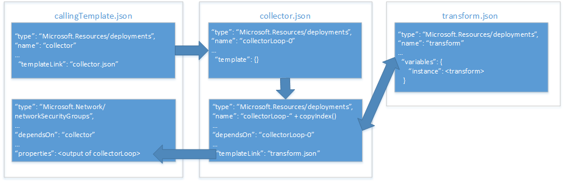

# <a name="implement-a-property-transformer-and-collector-in-an-azure-resource-manager-template"></a>在 Azure Resource Manager 範本中實作屬性轉換器與收集器

在[使用物件作為 Azure Resource Manager 範本中的參數][objects-as-parameters]中，您學會了如何將資源屬性值儲存在物件中，並在部署期間將它們套用至資源。 雖然這是非常實用的參數管理方式，但每次您在範本中使用它時，您仍需要將物件的屬性對應到資源屬性。

為了因應這種情況，您可以實作屬性轉換和收集器範本，逐一查看物件陣列，並將其轉換為資源所預期的 JSON 結構描述。

> [!IMPORTANT]
> 採取這種做法，您需要十分熟悉 Resource Manager 範本和函式。

讓我們透過部署[網路安全性群組 (NSG)][nsg]的範例，看看如何實作屬性收集器和轉換器。 下圖顯示我們的範本和我們在這些範本內的資源之間的關聯性：



我們的**呼叫範本**有兩個資源：

- 範本超連結，可呼叫的我們的**收集器範本**。
- 要部署的 NSG 資源。

我們的**收集器範本**有兩個資源：

- **錨點**資源。
- 範本超連結，可在複製迴圈中呼叫轉換範本。

我們的**轉換範本**有一個資源：包含單一變數的空白範本，會將我們的 `source` JSON 結構描述轉換為我們的**主要範本**中 NSG 資源所預期的 JSON 結構描述。

## <a name="parameter-object"></a>參數物件

我們將使用 [ 物件中的 `securityRules` 參數作為參數][objects-as-parameters]。 **轉換範本**會將 `securityRules` 陣列中的每個物件轉換為**呼叫範本**中 NSG 資源所預期的 JSON 結構描述。

```json
{
    "$schema": "https://schema.management.azure.com/schemas/2015-01-01/deploymentParameters.json#",
    "contentVersion": "1.0.0.0",
    "parameters": {
      "networkSecurityGroupsSettings": {
      "value": {
          "securityRules": [
            {
              "name": "RDPAllow",
              "description": "allow RDP connections",
              "direction": "Inbound",
              "priority": 100,
              "sourceAddressPrefix": "*",
              "destinationAddressPrefix": "10.0.0.0/24",
              "sourcePortRange": "*",
              "destinationPortRange": "3389",
              "access": "Allow",
              "protocol": "Tcp"
            },
            {
              "name": "HTTPAllow",
              "description": "allow HTTP connections",
              "direction": "Inbound",
              "priority": 200,
              "sourceAddressPrefix": "*",
              "destinationAddressPrefix": "10.0.1.0/24",
              "sourcePortRange": "*",
              "destinationPortRange": "80",
              "access": "Allow",
              "protocol": "Tcp"
            }
          ]
        }
      }
    }
  }
```

先來看看**轉換範本**。

## <a name="transform-template"></a>轉換範本

我們的**轉換範本**包含從**收集器範本**傳來的兩個參數：

- `source` 是物件，會接收屬性陣列的其中一個屬性值物件。 我們的範例會傳遞 `"securityRules"` 陣列中的每個物件，一次傳遞一個。
- `state` 是陣列，會接收所有先前轉換後的結果串連。 這是轉換後 JSON 的集合。

我們的參數看起來像這樣：

```json
{
  "$schema": "https://schema.management.azure.com/schemas/2015-01-01/deploymentTemplate.json#",
  "contentVersion": "1.0.0.0",
  "parameters": {
    "source": { "type": "object" },
    "state": {
      "type": "array",
      "defaultValue": [ ]
    }
  },
```

我們的範本也會定義名為 `instance` 的變數。 它會執行實際的轉換，將 `source` 物件轉換成所需的 JSON 結構描述：

```json
  "variables": {
    "instance": [
      {
        "name": "[parameters('source').name]",
        "properties":{
            "description": "[parameters('source').description]",
            "protocol": "[parameters('source').protocol]",
            "sourcePortRange": "[parameters('source').sourcePortRange]",
            "destinationPortRange": "[parameters('source').destinationPortRange]",
            "sourceAddressPrefix": "[parameters('source').sourceAddressPrefix]",
            "destinationAddressPrefix": "[parameters('source').destinationAddressPrefix]",
            "access": "[parameters('source').access]",
            "priority": "[parameters('source').priority]",
            "direction": "[parameters('source').direction]"
        }
      }
    ]

  },
```

最後，範本中的 `output` 會將收集到的 `state`參數的轉換，以及 `instance` 變數目前執行的轉換串連起來：

```json
    "resources": [],
    "outputs": {
    "collection": {
      "type": "array",
      "value": "[concat(parameters('state'), variables('instance'))]"
    }
```

接下來，看看**收集器**如何傳遞參數值。

## <a name="collector-template"></a>收集器範本

我們的**收集器範本**包含三個參數：

- `source` 是完整的參數物件陣列， 由**呼叫範本**傳入。 它的名稱和**轉換範本**中的 `source`參數相同，但您可能已經注意到一個主要的差異：這是完整的陣列，但是我們一次只傳遞這個陣列的一個元素給**轉換範本**。
- `transformTemplateUri` 是**轉換範本**的 URI。 我們在此將它定義為範本，以利重複使用範本。
- `state` 一開始是空陣列，由我們傳遞給**轉換範本**。 在複製迴圈完成時，它會儲存轉換後之參數物件的集合。

我們的參數看起來像這樣：

```json
  "parameters": {
    "source": { "type": "array" },
    "transformTemplateUri": { "type": "string" },
    "state": {
      "type": "array",
      "defaultValue": [ ]
    }
```

接下來，我們要定義名為 `count` 的變數。 其值是 `source` 參數物件陣列的長度：

```json
  "variables": {
    "count": "[length(parameters('source'))]"
  },
```

您大概猜到了，我們用它來作為複製迴圈中的反覆項目數。

現在，來看看我們的資源。 我們定義兩個資源︰

- `loop-0` 是複製迴圈的從零開始編號的資源。
- `loop-` 會與 `copyIndex(1)` 函式的結果串連，產生以反覆項目編號的唯一資源名稱，從 `1` 開始。

我們的資源看起來會像這樣：

```json
  "resources": [
    {
      "type": "Microsoft.Resources/deployments",
      "apiVersion": "2015-01-01",
      "name": "loop-0",
      "properties": {
        "mode": "Incremental",
        "parameters": { },
        "template": {
          "$schema": "https://schema.management.azure.com/schemas/2015-01-01/deploymentTemplate.json#",
          "contentVersion": "1.0.0.0",
          "parameters": { },
          "variables": { },
          "resources": [ ],
          "outputs": {
            "collection": {
              "type": "array",
              "value": "[parameters('state')]"
            }
          }
        }
      }
    },
    {
      "type": "Microsoft.Resources/deployments",
      "apiVersion": "2015-01-01",
      "name": "[concat('loop-', copyindex(1))]",
      "copy": {
        "name": "iterator",
        "count": "[variables('count')]",
        "mode": "serial"
      },
      "dependsOn": [
        "loop-0"
      ],
      "properties": {
        "mode": "Incremental",
        "templateLink": { "uri": "[parameters('transformTemplateUri')]" },
        "parameters": {
          "source": { "value": "[parameters('source')[copyindex()]]" },
          "state": { "value": "[reference(concat('loop-', copyindex())).outputs.collection.value]" }
        }
      }
    }
  ],
```

讓我們來看看我們傳遞給巢狀範本中**轉換範本**的參數。 回想前面，`source` 參數將目前的物件傳遞給 `source` 參數物件陣列。 `state` 參數就是集合發生之處，因為它會取得先前複製迴圈的反覆運算輸出 &mdash; 請注意，`reference()` 函式使用 `copyIndex()` 函式時沒有使用參數來參考先前連結的範本物件的 `name` &mdash; 然後將其傳遞給目前的反覆運算。

最後，範本的 `output` 傳回**轉換範本**最後一個反覆運算的 `output`：

```json
  "outputs": {
    "result": {
      "type": "array",
      "value": "[reference(concat('loop-', variables('count'))).outputs.collection.value]"
    }
  }
```

將**轉換範本**最後一個反覆運算的 `output` 傳回至**呼叫範本**看似矛盾，因為看來我們要將它儲存在 `source` 參數。 不過，請記住，**轉換範本**最後一個反覆運算才有完整的轉換後屬性物件陣列，而這就是我們要傳回的東西。

最後，讓我們看看如何從**呼叫範本**呼叫**收集器範本**。

## <a name="calling-template"></a>呼叫範本

我們的**呼叫範本**會定義一個名為 `networkSecurityGroupsSettings` 的參數：

```json
...
"parameters": {
    "networkSecurityGroupsSettings": {
        "type": "object"
    }
```

我們的範本會定義一個名為 `collectorTemplateUri` 的參數：

```json
"variables": {
    "collectorTemplateUri": "[uri(deployment().properties.templateLink.uri, 'collector.template.json')]"
  }
```

如您所預期，這是**收集器範本**的 URI，將由我們連結的範本資源使用：

```json
{
    "apiVersion": "2015-01-01",
    "name": "collector",
    "type": "Microsoft.Resources/deployments",
    "properties": {
        "mode": "Incremental",
        "templateLink": {
            "uri": "[variables('collectorTemplateUri')]",
            "contentVersion": "1.0.0.0"
        },
        "parameters": {
            "source" : {"value": "[parameters('networkSecurityGroupsSettings').securityRules]"},
            "transformTemplateUri": { "value": "[uri(deployment().properties.templateLink.uri, 'transform.json')]"}
        }
    }
}
```

我們傳遞兩個參數給**收集器範本**：

- `source` 是屬性物件陣列。 在我們的範例中是 `networkSecurityGroupsSettings` 參數。
- `transformTemplateUri` 是我們剛才用**收集器範本** URI 定義的變數。

最後，`Microsoft.Network/networkSecurityGroups` 資源將 `collector` 連結範本資源的 `output` 直接指派給其 `securityRules` 屬性：

```json
    {
      "apiVersion": "2015-06-15",
      "type": "Microsoft.Network/networkSecurityGroups",
      "name": "networkSecurityGroup1",
      "location": "[resourceGroup().location]",
      "properties": {
        "securityRules": "[reference('collector').outputs.result.value]"
      }
    }
  ],
  "outputs": {
      "instance":{
          "type": "array",
          "value": "[reference('collector').outputs.result.value]"
      }

  }
```

## <a name="try-the-template"></a>試用範本

您可以在 [GitHub][github] 上取得範本範例。 若要部署範本，請複製報告並執行下列 [Azure CLI][cli] 命令：

```bash
git clone https://github.com/mspnp/template-examples.git
cd template-examples/example4-collector
az group create --location <location> --name <resource-group-name>
az group deployment create -g <resource-group-name> \
    --template-uri https://raw.githubusercontent.com/mspnp/template-examples/master/example4-collector/deploy.json \
    --parameters deploy.parameters.json
```

<!-- links -->
[objects-as-parameters]: ./objects-as-parameters.md
[resource-manager-linked-template]: /azure/azure-resource-manager/resource-group-linked-templates
[resource-manager-variables]: /azure/azure-resource-manager/resource-group-template-functions-deployment
[nsg]: /azure/virtual-network/virtual-networks-nsg
[cli]: /cli/azure/?view=azure-cli-latest
[github]: https://github.com/mspnp/template-examples
