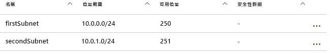
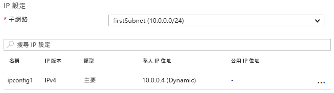

# <a name="update-a-resource-in-an-azure-resource-manager-template"></a>更新 Azure Resource Manager 範本中的資源

在某些情況下，您必須在部署期間更新資源。 當您必須等到其他相依資源建立後才能指定某項資源的所有屬性時，可能會遇到這種情況。 例如，如果您建立負載平衡器的後端集區，您可能會更新虛擬機器 (VM) 上的網路介面 (NIC)，以將這些介面納入後端集區。 當 Resource Manager 支援在部署期間更新資源，您必須正確設計範本以免發生錯誤，並確保會以更新的方式來處理部署。

首先，您必須在範本中參考資源一次以建立資源，之後必須以相同的名稱參考資源，才能在稍後對資源進行更新。 不過，如果這兩個資源在範本中擁有相同名稱，Resource Manager 就會擲回例外狀況。 為了避免這個錯誤，請在第二個範本中指定更新後的資源，並使用 `Microsoft.Resources/deployments` 資源類型，將更新後的資源連結或納入為子範本。

其次，您必須在巢狀的範本中指定要變更的現有屬性名稱，或為要新增的屬性指定新名稱。 您也必須指定原始屬性和其原始值。 如果您無法提供原始的屬性和值，Resource Manager 會假設您想要建立新的資源，並會刪除原始資源。

## <a name="example-template"></a>範本範例

讓我們看看示範這項操作的範例範本。 我們的範本會部署名為 `firstVNet` 的虛擬網路，此網路具有一個名為 `firstSubnet` 的子網路。 接著，它會部署名為 `nic1` 的虛擬網路介面 (NIC)，並讓它與我們的子網路相關聯。 然後，名為 `updateVNet` 的部署資源會納入巢狀範本，此範本會更新 `firstVNet` 資源，新增名為 `secondSubnet` 的第二個子網路 。

```json
{
  "$schema": "https://schema.management.azure.com/schemas/2015-01-01/deploymentTemplate.json#",
  "contentVersion": "1.0.0.0",
  "parameters": {},
  "resources": [
      {
      "apiVersion": "2016-03-30",
      "name": "firstVNet",
      "location":"[resourceGroup().location]",
      "type": "Microsoft.Network/virtualNetworks",
      "properties": {
          "addressSpace":{"addressPrefixes": [
              "10.0.0.0/22"
          ]},
          "subnets":[
              {
                  "name":"firstSubnet",
                  "properties":{
                    "addressPrefix":"10.0.0.0/24"
                  }
              }
            ]
      }
    },
    {
        "apiVersion": "2015-06-15",
        "type":"Microsoft.Network/networkInterfaces",
        "name":"nic1",
        "location":"[resourceGroup().location]",
        "dependsOn": [
            "firstVNet"
        ],
        "properties": {
            "ipConfigurations":[
                {
                    "name":"ipconfig1",
                    "properties": {
                        "privateIPAllocationMethod":"Dynamic",
                        "subnet": {
                            "id": "[concat(resourceId('Microsoft.Network/virtualNetworks','firstVNet'),'/subnets/firstSubnet')]"
                        }
                    }
                }
            ]
        }
    },
    {
      "apiVersion": "2015-01-01",
      "type": "Microsoft.Resources/deployments",
      "name": "updateVNet",
      "dependsOn": [
          "nic1"
      ],
      "properties": {
        "mode": "Incremental",
        "parameters": {},
        "template": {
          "$schema": "https://schema.management.azure.com/schemas/2015-01-01/deploymentTemplate.json#",
          "contentVersion": "1.0.0.0",
          "parameters": {},
          "variables": {},
          "resources": [
              {
                  "apiVersion": "2016-03-30",
                  "name": "firstVNet",
                  "location":"[resourceGroup().location]",
                  "type": "Microsoft.Network/virtualNetworks",
                  "properties": {
                      "addressSpace": "[reference('firstVNet').addressSpace]",
                      "subnets":[
                          {
                              "name":"[reference('firstVNet').subnets[0].name]",
                              "properties":{
                                  "addressPrefix":"[reference('firstVNet').subnets[0].properties.addressPrefix]"
                                  }
                          },
                          {
                              "name":"secondSubnet",
                              "properties":{
                                  "addressPrefix":"10.0.1.0/24"
                                  }
                          }
                     ]
                  }
              }
          ],
          "outputs": {}
          }
        }
    }
  ],
  "outputs": {}
}
```

讓我們先來看看 `firstVNet` 資源的資源物件。 請注意，我們重新指定巢狀範本中 `firstVNet` 的設定 &mdash; 這是因為 Resource Manager 不允許在相同範本內，有相同部署名稱，而巢狀範本被視為不同的範本。 我們藉由重新指定 `firstSubnet` 資源的值，告訴 Resource Manager 要更新現有的資源，而不是刪除它並重新部署它。 最後，在此更新期間會收取 `secondSubnet` 的新設定。

## <a name="try-the-template"></a>試用範本

您可以在 [GitHub][github] 上取得範本範例。 若要部署範本，請執行下列 [Azure CLI][cli] 命令：

```bash
az group create --location <location> --name <resource-group-name>
az group deployment create -g <resource-group-name> \
    --template-uri https://raw.githubusercontent.com/mspnp/template-examples/master/example1-update/deploy.json
```

當部署完成之後，開啟您在入口網站中指定的資源群組。 您會看到名為 `firstVNet` 的虛擬網路和名為 `nic1` 的 NIC。 按一下 `firstVNet`，然後再按一下 `subnets`。 您會看到原先建立的 `firstSubnet`，並看到 `updateVNet` 資源中新增的 `secondSubnet`。



然後，返回資源群組，並依序按一下 `nic1` 和 `IP configurations`。 在 `IP configurations` 區段中，`subnet` 會設為 `firstSubnet (10.0.0.0/24)`。



原始的 `firstVNet` 已更新而非重新建立。 如果 `firstVNet` 已重新建立，`nic1` 不會與 `firstVNet` 相關聯。

## <a name="next-steps"></a>後續步驟

* 了解如何根據條件部署資源，例如參數值是否存在。 請參閱[在 Azure Resource Manager 範本中依條件部署資源](./conditional-deploy.md)。

[cli]: /cli/azure/?view=azure-cli-latest
[github]: https://github.com/mspnp/template-examples
