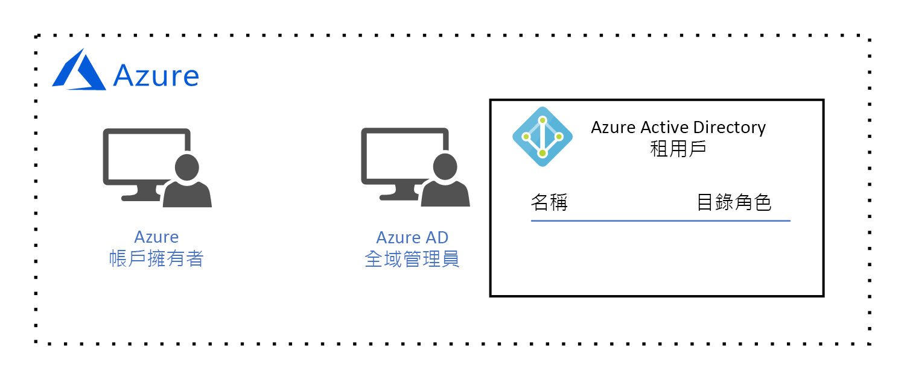

# Azure 管理設計指南Azure governance design guide

此設計指南的對象是貴組織中的「中央 IT」角色。The audience for this design guide is the *central IT* persona in your organization. 「中央 IT」負責設計和實作貴組織的雲端治理架構。*Central IT* is responsible for designing and implementing your organization's cloud governance architecture. 如同您在[雲端資源治理是什麼？](governance-explainer.md)說明中所學的，治理指的是進行中的程序，用以管理、監視及稽核 Azure 資源的使用符合組織目標和需求。As you learned in the [what is cloud resource governance?](governance-explainer.md) explainer, governance refers to the ongoing process of managing, monitoring, and auditing the use of Azure resources to meet the goals and requirements of your organization.

本指導方針旨在協助您藉由查看一組假設的治理目標和需求，了解設計貴組織治理架構的程序。The goal of this guidance is to help you learn the process of designing your organization's governance architecture by looking at a set of hypothetical governance goals and requirements. 然後，我們將討論如何設定 Azure 治理工具，來滿足這些需求。Then, we'll discuss how to configure Azure's governance tools to meet them. 

在基礎採用階段中，我們的目標是將簡單工作負載部署到 Azure。In the foundational adoption stage, our goal is to deploy a simple workload to Azure. 這會導致下列需求：This results in the following requirements:
* 單一**工作負載擁有者**的身分識別管理，該擁有者負責部署和維護簡單工作負載。Identity management for a single **workload owner** who is responsible for deploying and maintaining the simple workload. 工作負載擁有者需要建立、讀取、更新和刪除資源的權限，以及將這些權限委派給身分識別管理系統中其他使用者的權限。The workload owner requires permission to create, read, update, and delete resources as well as permission to delegate these rights to other users in the identity management system.
* 以單一管理單位的形式管理簡單工作負載的所有資源。Manage all resources for the simple workload as a single management unit.

## 授權 AzureLicensing Azure

在我們開始設計治理模型之前，務必先了解 Azure 的授權方式。Before we begin designing our governance model, it's important to understand how Azure is licensed. 這是因為與您的 Azure 授權相關聯的系統管理帳戶，具有所有 Azure 資源的最高等級存取權。This is because the administrative accounts associated with your Azure license have the highest level of access to all of your Azure resources. 這些系統管理帳戶形成治理模型的基礎。These administrative accounts form the basis of your governance model.  

> [!NOTE]
> 如果貴組織擁有現有 [Microsoft Enterprise 合約](https://www.microsoft.com/en-us/licensing/licensing-programs/enterprise.aspx)，但是其中不包含 Azure，可以藉由預先付款承諾來新增 Azure。If your organization has an existing [Microsoft Enterprise Agreement](https://www.microsoft.com/en-us/licensing/licensing-programs/enterprise.aspx) that does not include Azure, Azure can be added by making an upfront monetary commitment. 如需詳細資訊，請參閱 [Azure 企業授權](https://azure.microsoft.com/pricing/enterprise-agreement/)。See [licensing Azure for the enterprise](https://azure.microsoft.com/pricing/enterprise-agreement/) for more information. 

當 Azure 新增至貴組織的 Enterprise 合約時，系統會提示貴組織建立 **Azure 帳戶**。When Azure added to your organization's Enterprise Agreement, your organization was prompted to create an **Azure account**. 在帳戶建立程序中，會建立 **Azure 帳戶擁有者**，以及具有**全域管理員**帳戶的 Azure Active Directory (Azure AD) 租用戶。During the account creation process, an **Azure account owner** was created, as well as an Azure Active Directory (Azure AD) tenant with a **global administrator** account. Azure AD 租用戶是一種邏輯建構，代表 Azure AD 專用的安全執行個體。An Azure AD tenant is a logical construct that represents a secure, dedicated instance of Azure AD.

*圖 1。具有帳戶管理員和 Azure AD 全域管理員的 Azure 帳戶。*
*Figure 1. An Azure account with an Account Manager and Azure AD Global Administrator.*

## 身分識別管理Identity management

Azure 只信任由 [Azure AD](/azure/active-directory) 來驗證使用者以及將資源存取權授權給使用者，因此 Azure AD 是我們的身分識別管理系統。Azure only trusts [Azure AD](/azure/active-directory) to authenticate users and authorize user access to resources, so Azure AD is our identity management system. Azure AD 全域管理員具有最高等級權限，可以執行與身分識別相關的所有動作，包括建立使用者與指派權限。The Azure AD global administrator has the highest level of permissions and can perform all actions related to identity, including creating users and assigning permissions. 

我們的需求是單一**工作負載擁有者**的身分識別管理，該擁有者負責部署和維護簡單工作負載。Our requirement is identity management for a single **workload owner** who is responsible for deploying and maintaining the simple workload. 工作負載擁有者需要建立、讀取、更新和刪除資源的權限，以及將這些權限委派給身分識別管理系統中其他使用者的權限。The workload owner requires permission to create, read, update, and delete resources as well as permission to delegate these rights to other users in the identity management system.

我們的 Azure AD 全域管理員會為**工作負載擁有者**建立**工作負載擁有者**帳戶：Our Azure AD global administrator will create the **workload owner** account for the **workload owner**:

*圖 2。Azure AD 全域管理員建立工作負載擁有者使用者帳戶。*
*Figure 2. The Azure AD global administrator creates the workload owner user account.*

在這個使用者新增至**訂用帳戶**之前，我們無法指派資源存取權限，因此我們會在後續兩個章節進行這項操作。We aren't able to assign resource access permission until this user is added to a **subscription**, so we'll do that in the next two sections. 

## 資源管理範圍Resource management scope

隨著貴組織部署的資源數成長，治理這些資源的複雜度也隨之增加。As the number of resources deployed by your organization grows, the complexity of governing those resources grows as well. Azure 會實作邏輯容器階層，讓貴組織以各種層級的細微性 (也稱為**範圍**) 管理群組中的資源。Azure implements a logical container hierarchy to enable your organization to manage your resources in groups at various levels of granularity, also known as **scope**. 

最上層的資源管理範圍是**訂用帳戶**層級。The top level of resource management scope is the **subscription** level. 訂用帳戶是由 Azure **帳戶擁有者**建立，該擁有者會建立財務承諾，並且負責支付與訂用帳戶相關聯的所有 Azure 資源費用：A subscription is created by the Azure **account owner**, who establishes the financial commitment and is responsible for paying for all Azure resources associated with the subscription:

*圖 3。Azure 帳戶擁有者建立訂用帳戶。*
*Figure 3. The Azure account owner creates a subscription.*

訂用帳戶建立時，Azure **帳戶擁有者**會讓 Azure AD 租用戶與訂用帳戶產生關聯，並且使用這個 Azure AD 租用戶來驗證和授權使用者：When the subscription is created, the Azure **account owner** associates an Azure AD tenant with the subscription, and this Azure AD tenant is used for authenticating and authorizing users:

*圖 4。Azure 帳戶擁有者讓 Azure AD 租用戶與訂用帳戶產生關聯。*
*Figure 4. The Azure account owner associates the Azure AD tenant with the subscription.*

您可能已經注意到，目前沒有任何使用者與訂用帳戶相關聯，這表示沒有任何使用者具有管理資源的權限。You may have noticed that there is currently no user associated with the subscription, which means that no one has permission to manage resources. 事實上，**帳戶擁有者**是訂用帳戶的擁有者，而且具有對訂用帳戶中資源採取任何動作的權限。In reality, the **account owner** is the owner of the subscription and has permission to take any action on a resource in the subscription. 不過，實際上**帳戶擁有者**更像是貴組織中的財務人員，不負責建立、讀取、更新和刪除資源，這些工作會由**工作負載擁有者**執行。However, in practical terms the **account owner** is more than likely a finance person in your organization and is not responsible for creating, reading, updating, and deleting resources - those tasks will be performed by the **workload owner**. 因此，我們必須將**工作負載擁有者**新增至訂用帳戶並指派權限。Therefore, we need to add the **workload owner** to the subscription and assign permissions.

由於**帳戶擁有者**是目前唯一有權將**工作負載擁有者**新增至訂用帳戶的使用者，因此他們要將**工作負載擁有者**新增至訂用帳戶：Since the **account owner** is currently the only user with permission to add the **workload owner** to the subscription, they add the **workload owner** to the subscription:

*圖 5。Azure 帳戶擁有者將工作負載擁有者新增至訂用帳戶。*
*Figure 5. The Azure account owner adds the workload owner to the subscription.*

Azure **帳戶擁有者**會藉由指派[角色型存取控制 (RBAC)](/azure/role-based-access-control/) 角色，將權限授與**工作負載擁有者**。The Azure **account owner** grants permissions to the **workload owner** by assigning a [role-based access control (RBAC)](/azure/role-based-access-control/) role. RBAC 角色會指定一組權限，讓**工作負載擁有者**針對個別資源類型或一組資源類型使用。The RBAC role specifies a set of permissions that the **workload owner** has for an individual resource type or a set of resource types.

請注意，在此範例中，**帳戶擁有者**已獲得指派[內建**擁有者**角色](/azure/role-based-access-control/built-in-roles#owner)：Notice that in this example, the **account owner** has assigned the [built-in **owner** role](/azure/role-based-access-control/built-in-roles#owner): 

*圖 6。工作負載擁有者獲得指派內建擁有者角色。*
*Figure 6. The workload owner was assigned the built-in owner role.*

內建**擁有者**角色會在訂用帳戶範圍內，將所有權限授與**工作負載擁有者**。The built-in **owner** role grants all permissions to the **workload owner** at the subscription scope. 

> [!IMPORTANT]
> Azure **帳戶擁有者**負責與訂用帳戶相關聯的財務承諾，但是**工作負載擁有者**具有相同的權限。The Azure **acount owner** is responsible for the financial committment associated with the subscription, but the **workload owner** has the same permissions. **帳戶擁有者**必須信任**工作負載擁有者**會在訂用帳戶預算內部署資源。The **account owner** must trust the **workload owner** to deploy resources that are within the subscription budget.

管理範圍的下一個層級是**資源群組**層級。The next level of management scope is the **resource group** level. 資源群組是資源的邏輯容器。A resource group is a logical container for resources. 在資源群組層級套用的作業會套用至群組中的所有資源。Operations applied at the resource group level apply to all resources in a group. 此外，請務必注意，每個使用者的權限繼承自下一個層級以上，除非在該範圍明確變更。Also, it's important to note that permissions for each user are inherited from the next level up unless they are explicitly changed at that scope. 

為了說明這點，讓我們看看當**工作負載擁有者**建立資源群組時會發生什麼事：To illustrate this, let's look at what happens when the **workload owner** creates a resource group:

*圖 7。工作負載擁有者建立資源群組，並且在資源群組範圍繼承內建擁有者角色。*
*Figure 7. The workload owner creates a resource group and inherits the built-in owner role at the resource group scope.*

同樣地，內建**擁有者**角色會在資源群組範圍內，將所有權限授與**工作負載擁有者**。Again, the built-in **owner** role grants all permissions to the **workload owner** at the resource group scope. 如同我們稍早所述，此角色是繼承自訂用帳戶層級。As we discussed earlier, this role is inherited from the subscription level. 如果有不同的角色在此範圍中指派給這位使用者，則它僅適用於此範圍。If a different role is assigned to this user at this scope, it applies to this scope only.

管理範圍的最低層級是**資源**層級。The lowest level of management scope is at the **resource** level. 在資源層級套用的作業僅會套用到資源本身。Operations applied at the resource level apply only to the resource itself. 同樣地，資源層級的權限繼承自資源群組範圍。And once again, permissions at the resource level are inherited from resource group scope. 例如，讓我們看看如果**工作負載擁有者**將[虛擬網路](/azure/virtual-network/virtual-networks-overview)部署到資源群組，會發生什麼情況：For example, let's look at what happens if the **workload owner** deploys a [virtual network](/azure/virtual-network/virtual-networks-overview) into the resource group:

*圖 8。工作負載擁有者建立資源，並且在資源範圍繼承內建擁有者角色。*
*Figure 8. The workload owner creates a resource and inherits the built-in owner role at the resource scope.*

**工作負載擁有者**會在資源範圍繼承擁有者角色，這表示工作負載擁有者具有虛擬網路的所有權限。The **workload owner** inherits the owner role at the resource scope, which means the workload owner has all permissions for the virtual network. 

## 總結Summary

在本文中，您已了解：In this article, you learned:

* Azure 只信任由 Azure AD 進行身分識別管理。Azure only trusts Azure AD for identity management.
* 訂用帳戶具有資源管理的最高範圍，而且每個訂用帳戶都會與 Azure AD 租用戶相關聯。A subscription has the highest scope of resource management, and each subscription is associated with an Azure AD tenant. 只有相關聯 Azure AD 租用戶中的使用者，可以存取訂用帳戶中的資源。Only users in the associated Azure AD tenant can access resources in the subscription.
* 資源管理範圍有三個層級：訂用帳戶、資源群組和資源。There are three levels of resource management scope: subscription, resource group, and resource. 您要使用 RBAC 角色在每個範圍指派權限。Permissions are assigned at each scope using RBAC roles. RBAC 角色是從較高的範圍繼承到較低的範圍。RBAC roles are inherited from higher scope to lower scope.

## 後續步驟Next steps

請返回[基礎採用階段概觀](overview.md)，以了解如何實作此治理模型。Return to the [foundational adoption stage overview](overview.md) to learn how to implement this goverance model. 然後，選取工作負載類型，並了解如何部署。Then, select a type of workload and learn how to deploy it.