# 治理設計指南：在 Azure 中針對多個小組的新開發Governance design guide: new development in Azure for multiple teams

本指南的目標是協助您了解在 Azure 中設計資源治理模型的程序。The goal of this guidance is to help you learn the process for designing a resource governance model in Azure.  我們會查看一組假設性治理需求，然後瀏覽滿足這些需求的數個範例實作。We'll look at a set of hypothetical governance requirements, then go through several example implementations that satisfy those requirements. 

需求包括：Our requirements are:
* 在 Azure 中具有不同資源存取需求的多個小組身分識別管理。Identity management for multiple teams with different resource access requirements in Azure. 身分識別管理系統會儲存下列使用者的身分識別：The identity management system stores the identity of the following users:
  1. 組織中負責**訂用帳戶**擁有權的個人。The individual in our organization responsible for ownership of **subscriptions**.
  2. 組織中負責**共用基礎結構資源** (用來將內部部署網路連線到 Azure 虛擬網路) 的個人。The individual in our organization responsible for the **shared infrastructure resources** used to connect our on-premises network to an Azure virtual network. 
  3. 組織中負責管理**工作負載**的兩個個人。Two individuals in our organization responsible for managing a **workload**. 
* 支援多個**環境**。Support for multiple **environments**. 如同您先前所了解的，環境是資源的邏輯群組，具有類似的管理和安全性需求。As you learned earlier, an environment is a logical grouping of resources with similar management and security requirements. 我們需要三種環境：We require three environments:
  1. **共用基礎結構環境**，其中包含其他環境中工作負載共用的資源。A **shared infrastructure environment** that includes resources shared by workloads in other environments. 例如虛擬網路，具有提供與內部部署連線的閘道子網路。For example, a virtual network with a gateway subnet that provides connectivity to on-premises.
  2. **生產環境**，具有最嚴格的安全性原則。A **production environment** with the most restrictive security policies. 可能包含內部或外部對向工作負載。May include internal or external facing workloads.
  3. **開發環境**，適用於概念證明和測試工作。A **development environment** for proof-of-concept and testing work. 此環境具有與生產環境不同的安全性、合規性和成本原則。This environment has security, compliance, and cost policies that differ from those in the production environment.
* **最低權限的權限模型**，使用者在其中預設沒有任何權限。A **permissions model of least privilege** in which users have no permissions by default. 模型必須支援下列項目：The model must support the following:
  * 在訂用帳戶範圍中的單一信任使用者，具有指派資源存取權的權限。A single trusted user at the subscription scope with permission to assign resource access rights.
  * 每個工作負載擁有者預設會遭到拒絕存取資源。Each workload owner is denied access to resources by default. 資源存取權限是由訂用帳戶範圍的單一信任使用者明確授與。Resource access rights are granted explicitly by the single trusted user at the subscription scope.
  * 共用基礎結構資源的管理存取權僅限於共用基礎結構擁有者。Management access for the shared infrastructure resources limited to the shared infrastructure owner.  
  * 每個工作負載的管理存取權僅限於工作負載管理員。Management access for each workload restricted to the workload owner.
  * 僅使用[內建 RBAC 角色][rbac-built-in-roles]。Use of [built-in RBAC roles][rbac-built-in-roles] only. 沒有自訂 RBAC 角色。No custom RBAC roles.
* 依工作負載擁有者名稱、環境或兩者所追蹤的成本。Cost tracking by workload owner name, environment, or both. 

## 身分識別管理Identity management

在我們可以設計治理模型中的身分識別管理之前，請務必了解它所包含的四個主要區域：Before we can design identity management for our governance model, it's important to understand the four major areas it encompasses:

* 管理：建立、編輯和刪除使用者身分識別的程序和工具。Administration: the processes and tools for creating, editing, and deleting user identity.
* 驗證：藉由驗證認證 (例如使用者名稱和密碼) 來驗證使用者身分識別。Authentication: verifying user identity by validating credentials, such as a user name and password.
* 授權：決定通過驗證的使用者可以存取哪些資源，或者他們有權限可以執行哪些作業。Authorization: determining which resources an authenticated user is allowed to access or what operations they have permission to perform.
* 稽核：定期檢閱記錄和其他資訊，以探索與使用者身分識別相關的安全性問題。Auditing: periodically reviewing logs and other information to discover security issues related to user identity. 這包括檢閱可疑的使用模式、定期檢閱使用者權限以確認它們都正確，以及其他功能。This includes reviewing suspicious usage patterns, periodically reviewing user permissions to verify they are accurate, and other functions.

Azure 只信任一個服務的身分識別，那就是 Azure Active Directory (AD)。There is only one service trusted by Azure for identity, and that is Azure Active Directory (AD). 我們會將使用者新增至 Azure AD，並且針對上述所有功能使用它。We'll be adding users to Azure AD and using it for all of the functions listed above. 但是，在我們審視如何設定 Azure AD 之前，務必了解用來管理這些服務存取權的特殊權限帳戶。But before we look at how we'll configure Azure AD, it's important to understand the privileged accounts that are used to manage access to these services.

當貴組織註冊 Azure 帳戶時，至少會指派一個 Azure**帳戶擁有者**，如果還沒有任何 Azure AD 租用戶與貴組織的其他 Microsoft 服務 (例如 Office 365) 使用相關聯，則會建立 Azure AD**租用戶**。When your organization signed up for an Azure account, at least one Azure **account owner** was assigned and an Azure AD **tenant** was created if there was not already an Azure AD tenant associated with your organization's use of other Microsoft services such as Office 365. 具有 Azure AD 租用戶完整權限的**全域管理員**，會在建立時產生關聯。A **global administrator** with full permissions on the Azure AD tenant was associated when it was created. 

Azure 帳戶擁有者和 Azure AD 全域管理員使用者身分識別，都會儲存在由 Microsoft 管理的高度安全身分識別系統。Both of the Azure Account Owner and Azure AD global administrator user identities are stored in a highly secure identity system that is managed by Microsoft. Azure 帳戶擁有者已獲授權可以建立、更新和刪除訂用帳戶。The Azure Account Owner is authorized to create, update, and delete subscriptions. Azure AD 全域管理員已獲授權可以在 Azure AD 中執行許多動作，但是針對這個設計指南，我們將著重於使用者身分識別的建立和刪除。The Azure AD global administrator is authorized to perform many actions in Azure AD, but for this design guide we'll focus on the creation and deletion of user identity. 

> [!NOTE]
> 如果有現有 Office 365 或 Intune 授權與您的帳戶相關聯，則貴組織可能已經有現有的 Azure AD 租用戶。Your organization may already have an existing Azure AD tenant if there's an existing Office 365 or Intune license associated with your account.

Azure 帳戶擁有者有權可以建立、更新和刪除訂用帳戶：The Azure Account Owner has permission to create, update, and delete subscriptions: 

*圖 1.具有帳戶管理員和 Azure AD 全域管理員的 Azure 帳戶。*
*Figure 1. An Azure account with an Account Manager and Azure AD Global Administrator.*

Azure AD **全域管理員**有權可以建立使用者帳戶：The Azure AD **global administrator** has permission to create user accounts:  

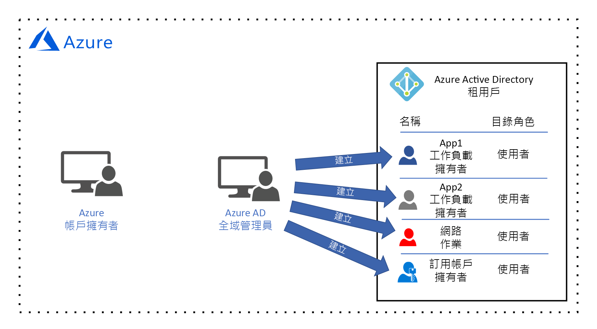
*圖 2.Azure AD 全域管理員會在租用戶中建立必要的使用者帳戶。*
*Figure 2. The Azure AD Global Administrator creates the required user accounts in the tenant.*

前兩個帳戶 **App1 工作負載擁有者**和 **App2 工作負載擁有者**，分別都與組織中負責管理工作負載的個人相關聯。The first two accounts, **App1 Workload Owner** and **App2 Workload Owner** are each associated with an individual in our organization responsible for managing a workload. **網路作業**帳戶是由負責共用基礎結構資源的個人所擁有。The **network operations** account is owned by the individual that is responsible for the shared infrastructure resources. 最後，**訂用帳戶擁有者**帳戶是與負責訂用帳戶擁有權的個人相關聯。Finally, the **subscription owner** account is associated with the individual responsible for ownership of subscriptions.

## 最低權限的資源存取權限模型Resource access permissions model of least privilege

既然我們已經建立身分識別管理系統和使用者帳戶，我們必須決定如何將角色型存取控制 (RBAC) 角色套用到每個帳戶，以支援最低權限的權限模型。Now that we have our identity management system and user accounts created, we have to decide how we'll apply role-based access control (RBAC) roles to each account to support a permissions model of least privilege.

我們的其他需求是與每個工作負載相關聯的資源要彼此隔離，這樣就不會有工作負載擁有者具備並非他們擁有的其他任何工作負載的管理存取權。Our other requirement is for the resources associated with each workload be isolated from one another such that no one workload owner has management access to any other workload they do not own. 我們有需求僅使用[適用於 Azure RBAC 的內建角色][rbac-built-in-roles]來實作這個模型。We have a requirement to implement this model using only [built-in roles for Azure RBAC][rbac-built-in-roles].

每個 RBAC 角色會在 Azure 中三個範圍的其中一個套用：**訂用帳戶**、**資源群組**，然後是個別**資源**。Each RBAC role is applied at one of three scopes in Azure: **subscription**, **resource group**, then an individual **resource**. 角色會在較低的範圍繼承。Roles are inherited at lower scopes. 例如，如果使用者在訂用帳戶層級獲指派[內建擁有者角色][rbac-built-in-owner]，該角色也會在資源群組和個別資源層級指派給該使用者，除非已覆寫。For example, if a user is assigned the [built-in owner role][rbac-built-in-owner] at the subscription level, that role is also assigned to that user at the resource group and individual resource level unless it's overridden.

因此，若要建立最低權限的模型，我們必須決定特定類型使用者在這三個範圍中分別可以採取的動作。Therefore, to create a model of least privilege access we have to decide the actions a particular type of user is allowed to take at each of these three scopes. 例如，我們的需求是工作負載擁有者僅有權可以管理與他們的工作負載相關聯的資源，無法管理其他工作負載。For example, our requirement is for a workload owner to have permission to manage access to only the resources associated with their workload and no others. 如果我們在訂用帳戶範圍指派[內建擁有者角色][rbac-built-in-owner]，每個工作負載擁有者都會具有所有工作負載的管理存取權。If we were to assign the [built-in owner role][rbac-built-in-owner] at the subscription scope, each workload owner would have management access to all workloads.

讓我們看看兩個範例權限模型，再稍微了解這個概念。Let's take a look at two example permission models to understand this concept a little better. 在第一個範例中，我們的模型只信任服務管理員來建立資源群組。In the first example, our model trusts only the service administrator to create resource groups. 在第二個範例中，我們的模型在訂用帳戶範圍將內建擁有者角色指派給每個工作負載擁有者。In the second example, our model assigns the built-in owner role to each workload owner at the subscription scope. 

在這兩個範例中，我們有訂用帳戶服務管理員在訂用帳戶範圍獲指派[內建擁有者角色][rbac-built-in-owner]。In both examples, we have a subscription service administrator that is assigned the [built-in owner role][rbac-built-in-owner] at the subscription scope. 請回想[內建擁有者角色][rbac-built-in-owner]會授與所有權限，包括資源存取權的管理。Recall that the [built-in owner role][rbac-built-in-owner] grants all permissions including the management of access to resources.
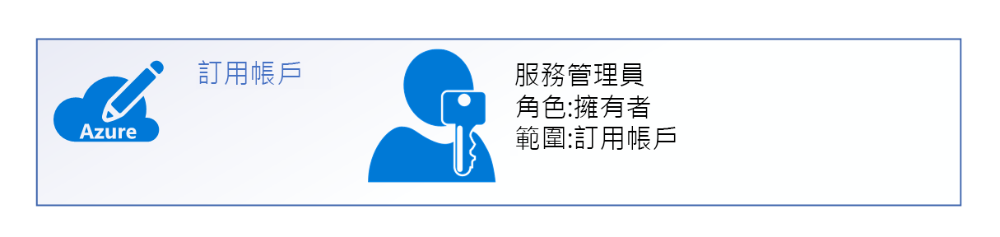
*圖 3.訂用帳戶，具有獲指派內建擁有者角色的服務管理員。*
*Figure 3. A subscription with a service administrator assigned the built-in owner role.* 

1. 在第一個範例中，我們有**工作負載擁有者 A**，他們沒有訂用帳戶範圍的任何權限，也就是預設沒有資源存取權管理權限。In our first example, we have **workload owner A** with no permissions at the subscription scope - they have no resource access management rights by default. 此使用者想要為其工作負載部署和管理資源。This user wants to deploy and manage the resources for their workload. 他們必須連絡**服務管理員**以要求建立資源群組。They must contact the **service administrator** to request creation of a resource group.
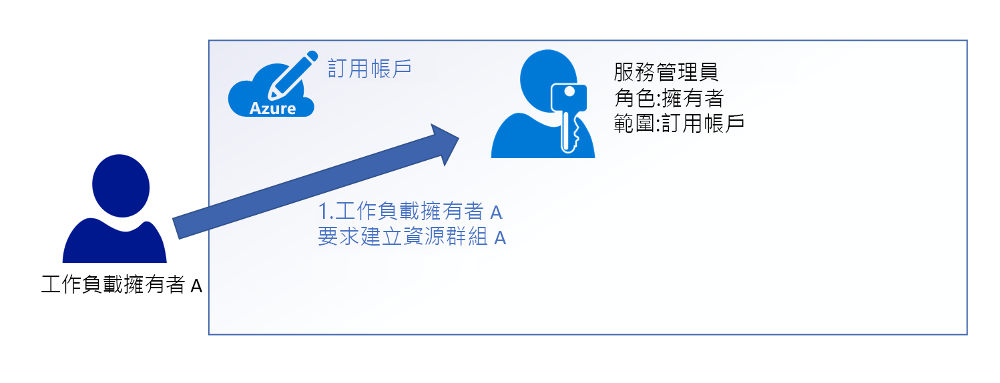  

2. **服務管理員**檢閱其要求，並且建立**資源群組 A**。此時，**工作負載擁有者 A** 仍然沒有執行任何動作的權限。The **service administrator** reviews their request and creates **resource group A**. At this point, **workload owner A** still doesn't have permission to do anything.
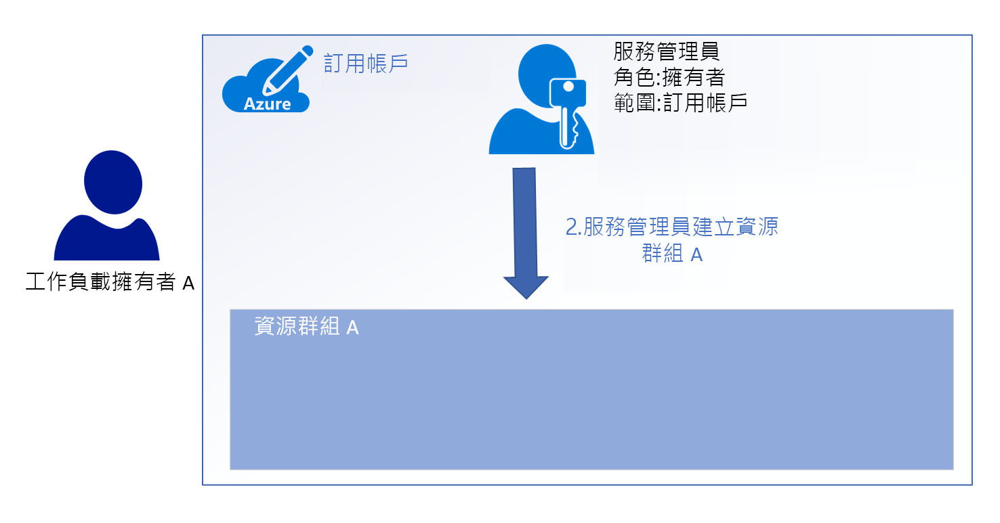

3. **服務管理員**將**工作負載擁有者 A** 新增至**資源群組 A**，並指派[內建參與者角色](/azure/role-based-access-control/built-in-roles#contributor)。The **service administrator** adds **workload owner A** to **resource group A** and assigns the [built-in contributor role](/azure/role-based-access-control/built-in-roles#contributor). 參與者角色授與**資源群組 A** 的所有權限，管理存取權限除外。The contributor role grants all permissions on **resource group A** except managing access permission.
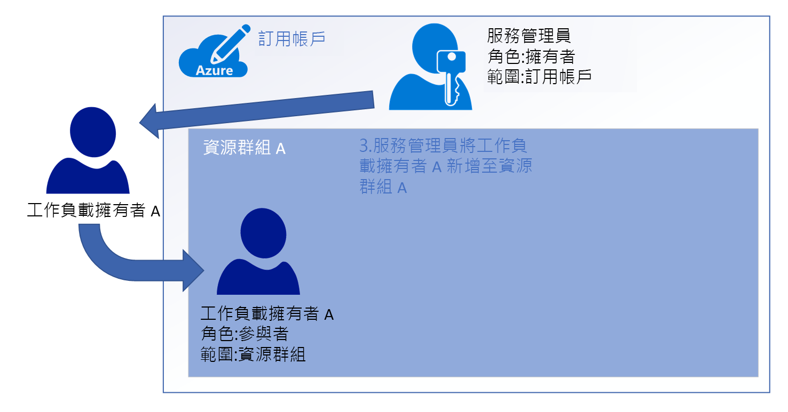

4. 假設**工作負載擁有者 A** 具有需求，需要小組成員配對在工作負載容量規劃時，檢視 CPU 和網路流量監視資料。Let's assume that **Workload owner A** has a requirement for a pair of team members to view the CPU and network traffic monitoring data as part of capacity planning for the workload. 因為**工作負載擁有者 A** 獲指派參與者角色，他們沒有權限可以將使用者新增至**資源群組 A**。他們必須將此要求傳送給**服務管理員**。Because **workload owner A** is assigned the contributor role, they do not have permission to add a user to **resource group A**. They must send this request to the **service administrator**.
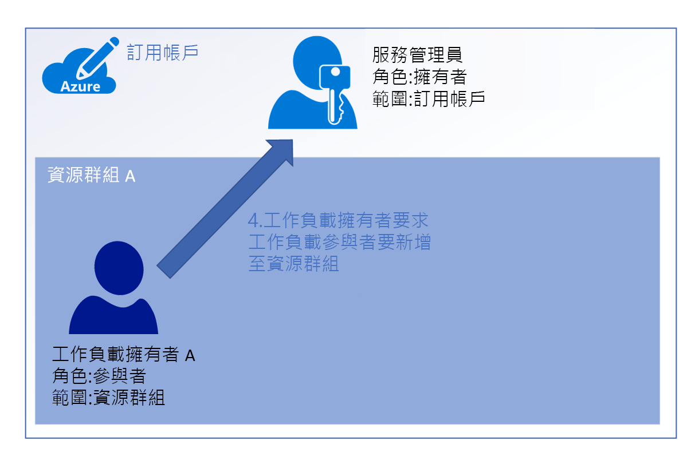

5. **服務管理員**檢閱要求，並且將兩個**工作負載參與者**使用者新增至**資源群組 A**。這兩個使用者都不需要管理資源的權限，因此指派[內建讀者角色](/azure/role-based-access-control/built-in-roles#contributor)給他們。The **service administrator** reviews the request, and adds the two **workload contributor** users to **resource group A**. Neither of these two users require permission to manage resources, so they are assigned the [built-in reader role](/azure/role-based-access-control/built-in-roles#contributor). 
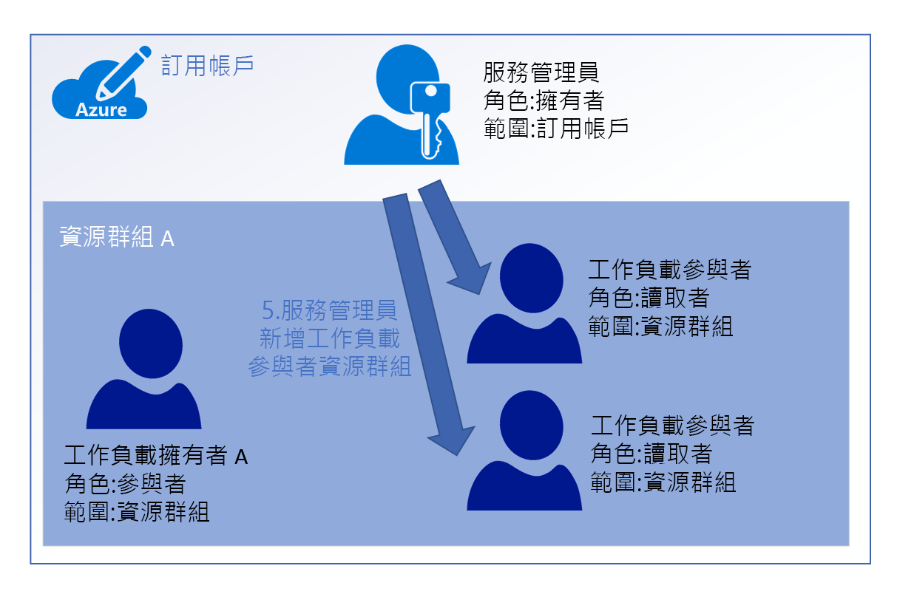

6. 接下來，**工作負載擁有者 B** 也需要資源群組包含其工作負載的資源。Next, **workload owner B** also requires a resource group to contain the resources for their workload. 如同**工作負載擁有者 A**，**工作負載擁有者 B** 最初沒有在訂用帳戶範圍採取任何動作的權限，因此他們必須將要求傳送給**服務管理員**。As with **workload owner A**, **workload owner B** initially does not have permission to take any action at the subscription scope so they must send a request to the **service administrator**. 
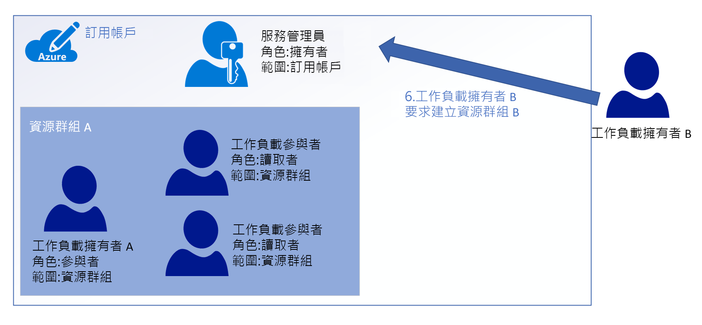

7. **服務管理員**檢閱要求，並且建立**資源群組 B**。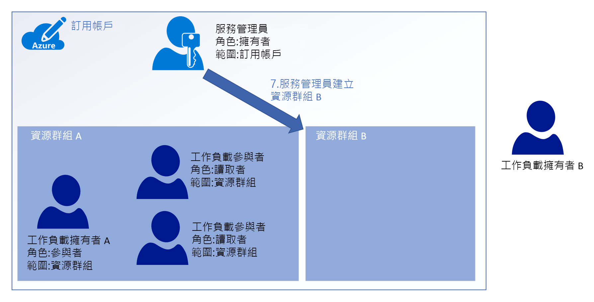The **service administrator** reviews the request and creates **resource group B**. 

8. 然後**服務管理員**將**工作負載擁有者 B** 新增至**資源群組 B**，並指派[內建參與者角色](https://docs.microsoft.com/en-us/azure/role-based-access-control/built-in-roles#contributor)。The **service administrator** then adds **workload owner B** to **resource group B** and assigns the [built-in contributor role](https://docs.microsoft.com/en-us/azure/role-based-access-control/built-in-roles#contributor). 
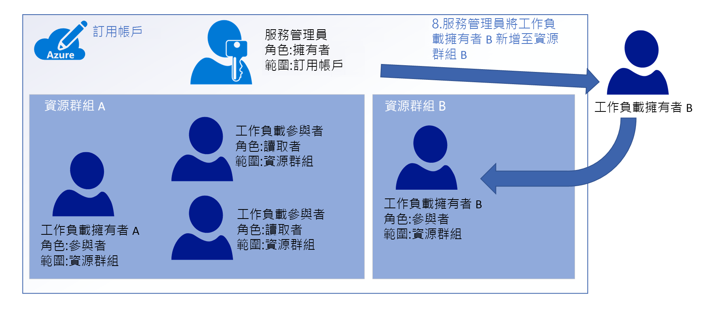

此時，每個工作負載擁有者會在本身的資源群組中隔離。At this point, each of the workload owners is isolated in their own resource group. 工作負載擁有者或其小組成員都沒有任何其他資源群組中資源的管理存取權。None of the workload owners or their team members have management access to the resources in any other resource group. 

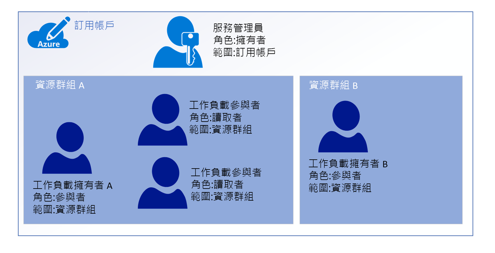
*圖 4.具有兩個工作負載擁有者與其本身資源群組隔離的訂用帳戶。*
*Figure 4. A subscription with two workload owners isolated with their own resource group.*

此模型是最低權限模型，每個使用者在正確的資源管理範圍獲指派正確的權限。This model is a least privilege model - each user is assigned the correct permission at the correct resource management scope.

不過，請考量到此範例中的每項工作都是由**服務管理員**執行。However, consider that every task in this example was performed by the **service administrator**. 雖然這是簡單的範例而且可能不會造成問題，但是因為只有兩個工作負載擁有者，所以不難想像對於大型組織會造成的問題類型。While this is a simple example and may not appear to be an issue because there were only two workload owners, it's easy to imagine the types of issues that would result for a large organization. 例如，**服務管理員**成為瓶頸，具有導致延遲的大量要求待處理項目。For example, the **service administrator** can become a bottleneck with a large backlog of requests that result in delays.  

讓我們看看第二個範例，其中減少了由**服務管理員**執行的工作數目。Let's take a look at second example that reduces the number of tasks performed by the **service administrator**. 

1. 在此模型中，**工作負載擁有者 A** 在訂用帳戶範圍獲指派[內建擁有者角色][rbac-built-in-owner]，讓他們可以建立自己的資源群組：**資源群組 A**。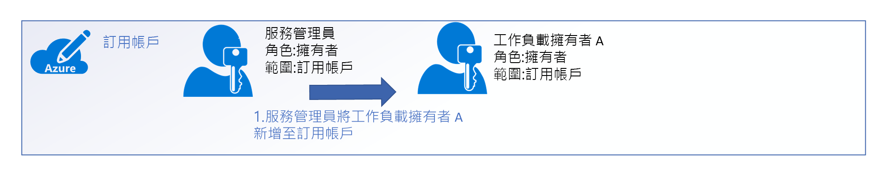In this model, **workload owner A** is assigned the [built-in owner role][rbac-built-in-owner] at the subscription scope, enabling them to create their own resource group: **resource group A**. 

2. 當**資源群組 A** 建立時，**工作負載擁有者 A** 預設會新增，並且從訂用帳戶範圍繼承[內建擁有者][rbac-built-in-owner]角色。When **resource group A** is created, **workload owner A** is added by default and inherits the [built-in owner][rbac-built-in-owner] role from the subscription scope.
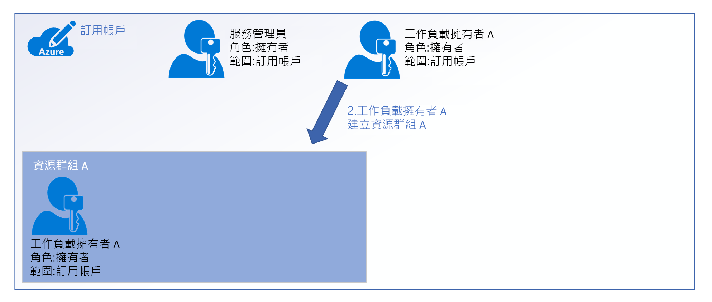

3. [內建擁有者角色][rbac-built-in-owner]授與**工作負載擁有者 A** 管理資源群組存取權的權限。The [built-in owner role][rbac-built-in-owner] grants **workload owner A** permission to manage access to the resource group. **工作負載擁有者 A** 新增兩個**工作負載參與者**，並指派[內建讀者角色][rbac-built-in-owner]給每個參與者。**Workload owner A** adds two **workload contributors** and assigns the [built-in reader role][rbac-built-in-owner] to each of them. 
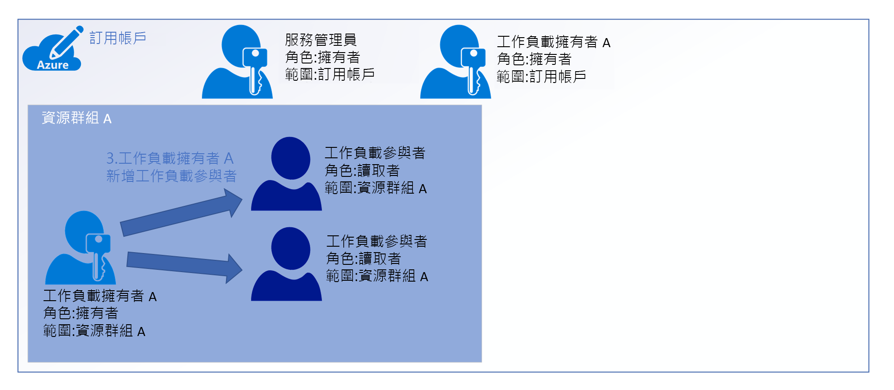

4. **服務管理員**現在將**工作負載擁有者 B** 新增至具有內建擁有者角色的訂用帳戶。**Service administrator** now adds **workload owner B** to the subscription with the built-in owner role. 
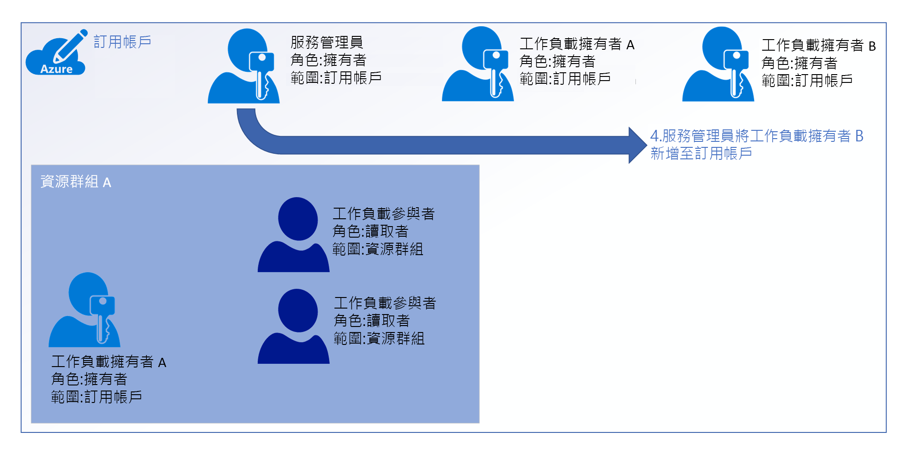

5. **工作負載擁有者 B** 建立**資源群組 B**，預設會新增。**Workload owner B** creates **resource group B** and is added by default. 同樣地，**工作負載擁有者 B** 會從訂用帳戶範圍繼承內建擁有者角色。Again, **workload owner B** inherits the built-in owner role from the subscription scope.
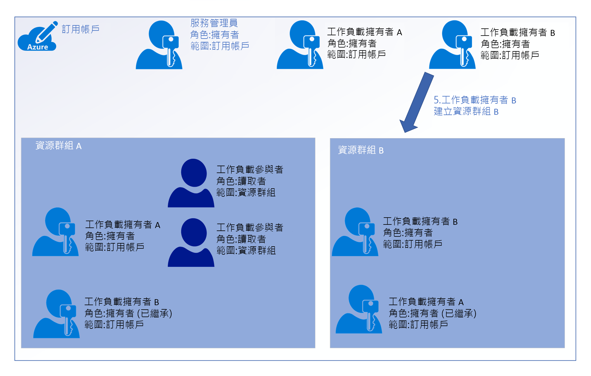

請注意，在此模型中，**服務管理員**執行的動作比在第一個範例中還要少，原因是將管理存取權委派給個別的工作負載擁有者。Note that in this model, the **service administrator** performed fewer actions than they did in the first example due to the delegation of management access to each of the individual workload owners.

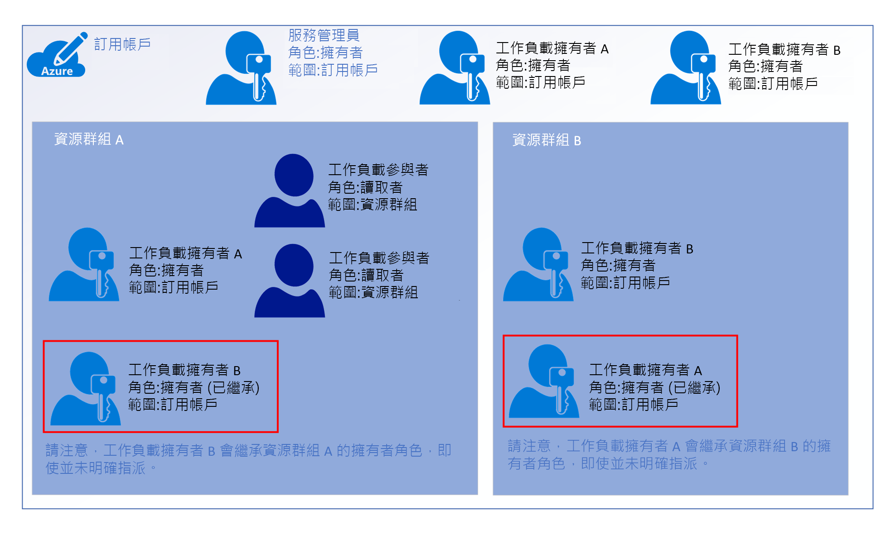
*圖 5.訂用帳戶，具有服務管理員和兩個工作負載擁有者，都獲指派內建擁有者角色。*
*Figure 5. A subscription with a service administrator and two workload owners, all assigned the built-in owner role.*

不過，因為**工作負載擁有者 A** 和**工作負載擁有者 B** 都在訂用帳戶範圍獲指派內建擁有者角色，他們各自都繼承彼此資源群組的內建擁有者角色。However, because both **workload owner A** and **workload owner B** are assigned the built-in owner role at the subscription scope, they have each inherited the built-in owner role for each other's resource group. 這表示他們不只有其他資源的完整存取權，他們還可以將管理存取權委派給彼此的資源群組。This means that not only do they have full access to one another's resources, they are also able to delegate management access to each other's resource groups. 例如，**工作負載擁有者 B** 有權可以將任何其他使用者新增至**資源群組 A**，並且可以將任何角色指派給它們，包括內建擁有者角色。For example, **workload owner B** has rights to add any other user to **resource group A** and can assign any role to them, including the built-in owner role.

如果將每個範例與我們的需求相互比較，我們會看到這兩個範例都支援在訂用帳戶範圍的單一信任使用者，有權可以將資源存取權限授與我們的兩個工作負載擁有者。If we compare each example to our requirements, we see that both examples support a single trusted user at the subscription scope with permission to grant resource access rights to our two workload owners. 這兩個工作負載擁有者預設都沒有資源管理存取權，需要**服務管理員**明確地將權限指派給他們。Each of the two workload owners did not have access to resource management by default and required the **service administrator** to explicitly assign permissions to them. 不過，只有第一個範例支援與每個工作負載相關聯的資源要彼此隔離的需求，如此才沒有任何工作負載擁有者具有任何其他工作負載的資源存取權。However, only the first example supports the requirement that the resources associated with each workload are isolated from one another such that no workload owner has access to the resources of any other workload.

## 資源管理模型Resource management model

既然我們已經設計最低權限的權限模型，讓我們繼續查看這些治理模型的一些實際應用。Now that we've designed a permissions model of least privilege, let's move on to take a look at some practical applications of these governance models. 請回想我們的需求，我們必須支援下列三種環境：Recall from our requirements that we must support the following three environments:
1. **共用基礎結構：** 所有工作負載共用的單一群組資源。**Shared infrastructure:** a single group of resources shared by all workloads. 這些資源是網路閘道、防火牆和安全性服務等等。These are resources such as network gateways, firewalls, and security services.  
2. **開發：** 代表多個非生產就緒工作負載的多個資源群組。**Development:** multiple groups of resources representing multiple non-production ready workloads. 這些資源用於概念證明、測試及其他開發人員活動。These resources are used for proof-of-concept, testing, and other developer activities. 這些資源可能會有比較寬鬆的治理模型，以便增加開發人員的靈活度。These resources may have a more relaxed governance model because to allow for increased developer agility.
3. **生產：** 代表多個生產工作負載的多個資源群組。**Production:** multiple groups of resources representing multiple production workloads. 這些資源是用來裝載私人和公用對向的應用程式成品。These resources are used to host the private and public facing application artifacts. 這些資源通常有最嚴謹的治理和安全性模型，以防止未經授權存取資源、應用程式程式碼和資料。These resources typically have the tightest governance and security models to protect the resources, application code, and data from unauthorized access.

針對這三種環境，我們需要依**工作負載擁有者**、**環境**或兩者來追蹤成本資料。For each of these three environments, we have a requirement to track cost data by **workload owner**, **environment**, or both. 也就是說，我們想要知道**共用基礎結構**的進行中成本，**開發**和**生產**環境中個人所產生的成本，最後是**開發**和**生產**的整體成本。That is, we want to know the ongoing cost of our **shared infrastructure**, the costs incurred by individuals in both the **development** and **production** environments, and finally the overall cost of **development** and **production**. 

您已了解資源分成兩個層級：**訂用帳戶**和**資源群組**。You have already learned that resources are scoped to two levels: **subscription** and **resource group**. 因此，我們的第一個決策是如何依據**訂用帳戶**來組織我們的環境。Therefore, our first decision is how to organize our environments by **subscription**. 只有兩種可能性：單一訂用帳戶或多個訂用帳戶。There are only two possibilities: a single subscription, or, multiple subscriptions. 

在查看每個模型的範例之前，讓我們檢閱 Azure 中訂用帳戶的管理結構。Before we look at examples of each of these models, let's review the management structure for subscriptions in Azure. 

請回想我們的需求，我們在組織中有個人負責訂用帳戶，這個使用者擁有 Azure AD 租用戶中的**訂用帳戶擁有者**帳戶。Recall from our requirements that we have an individual in our organization that is responsible for subscriptions, and this user owns the **subscription owner** account in our Azure AD tenant. 不過，此帳戶沒有建立訂用帳戶的權限。However, this account does not have permission to create subscriptions. 只有 **Azure 帳戶擁有者**有權執行這個操作：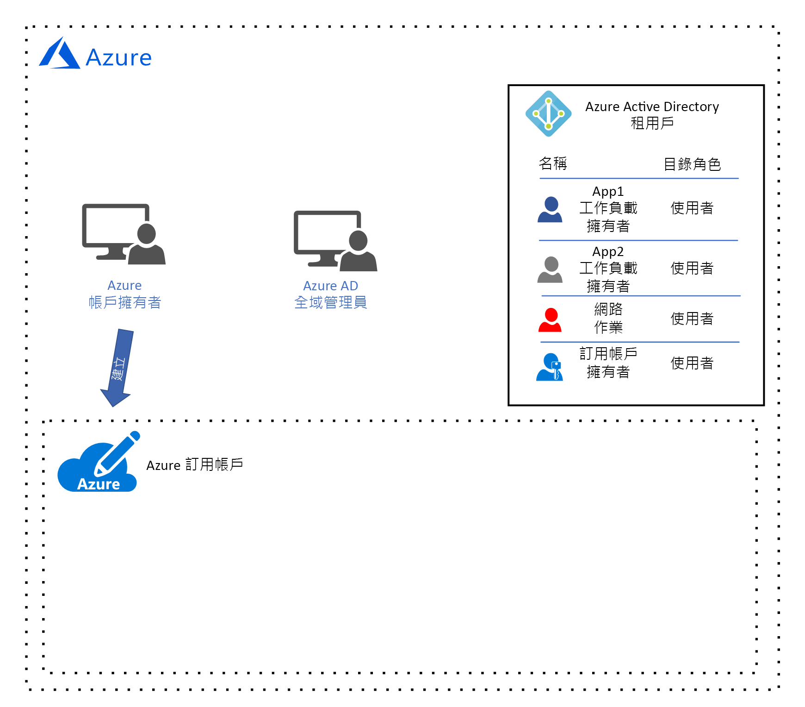
*圖 6.Azure 帳戶擁有者建立訂用帳戶。*Only the **Azure Account Owner** has permission to do this: 
*Figure 6. An Azure Account Owner creates a subscription.*

一旦建立訂用帳戶，**Azure 帳戶擁有者**可以將**訂用帳戶擁有者**帳戶新增至具有**擁有者**角色的訂用帳戶：Once the subscription has been created, the **Azure Account Owner** can add the **subscription owner** account to the subscription with the **owner** role:

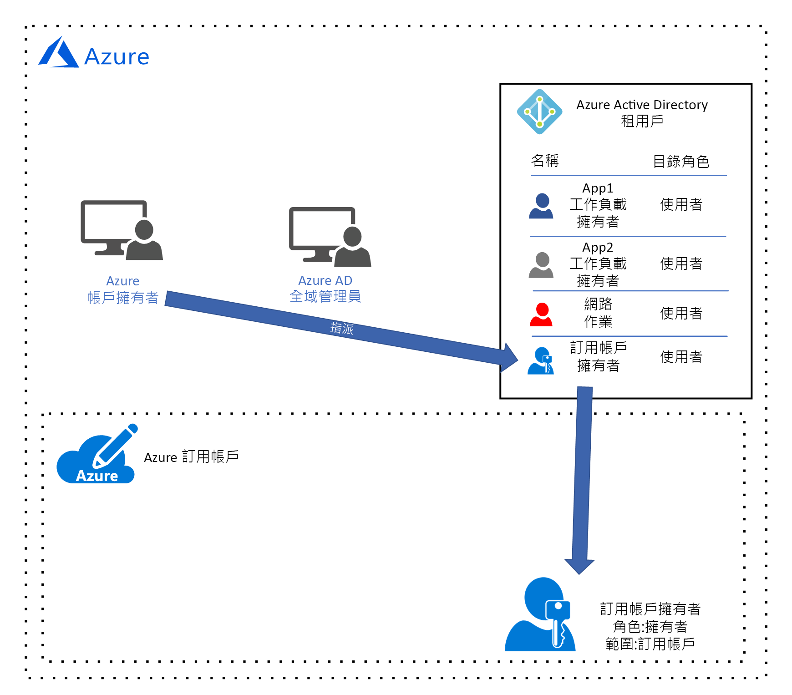
*圖 7.Azure 帳戶擁有者將**訂用帳戶擁有者**使用者帳戶新增至具有**擁有者**角色的訂用帳戶。*
*Figure 7. The Azure Account Owner adds the **subscription owner** user account to the subscription with the **owner** role.*

**訂用帳戶擁有者**現在可以建立**資源群組**，並且委派資源存取權管理。The **subscription owner** can now create **resource groups** and delegate resource access management.

首先讓我們看看使用單一訂用帳戶的範例資源管理模型。First let's look at an example resource management model using a single subscription. 我們的第一個決策是如何將資源群組對齊至三個環境。Our first decision is how to align resource groups to the three environments. 我們有兩個選擇：We have two options:
1. 將每個環境對齊至單一資源群組。Align each environment to a single resource group. 所有共用基礎結構資源會部署到單一**共用基礎結構**資源群組。All shared infrastructure resources are deployed to a single **shared infrastructure** resource group. 與開發工作負載相關聯的所有資源都會部署到單一**開發**資源群組。All resources associated with development workloads are deployed to a single **development** resource group. 與生產工作負載相關聯的所有資源都會都部署到**生產**環境的單一**生產**資源群組。All resources associated with production workloads are deployed into a single **production** resource group for the **production** environment. 
2. 對齊工作負載與個別資源群組，使用命名慣例和標記來對齊資源群組與三個環境。Align workloads with a separate resource group, using a naming convention and tags to align resource groups with each of the three environments.  

讓我們從評估第一個選項開始。Let's begin by evaluating the first option. 我們將會使用我們在上一節中討論的權限模型，以及單一訂用帳戶服務管理員，他會建立資源群組並且將使用者新增至其中，具有內建**參與者**或**讀者**角色。We'll be using the permissions model that we discussed in the previous section, with a single subscription service administrator that creates resource groups and adds users to them with either the built-in **contributor** or **reader** role. 

1. 所部署的第一個資源群組代表**共用基礎結構**環境。The first resource group deployed represents the **shared infrastructure** environment. **訂用帳戶擁有者**會為名為 **netops-shared-rg** 的共用基礎結構資源建立資源群組。The **subscription owner** creates a resource group for the shared infrastructure resources named **netops-shared-rg**. 
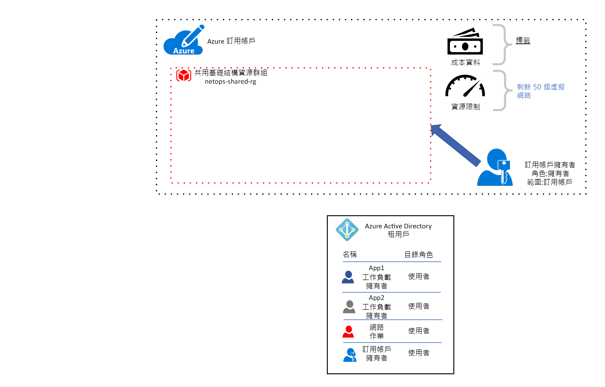
2. **訂用帳戶擁有者**會將**網路作業使用者**帳戶新增至資源群組，並且指派**參與者**角色。The **subscription owner** adds the **network operations user** account to the resource group and assigns the **contributor** role. 
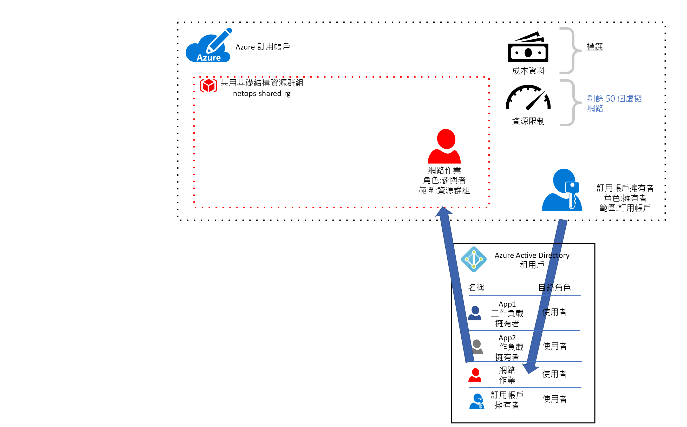
3. **網路作業使用者**會建立 [VPN 閘道](/azure/vpn-gateway/vpn-gateway-about-vpngateways)，並且設定它來連線到內部部署 VPN 設備。The **network operations user** creates a [VPN gateway](/azure/vpn-gateway/vpn-gateway-about-vpngateways) and configures it to connect to the on-premises VPN appliance. **網路作業**使用者也會將一組[標記](/azure/azure-resource-manager/resource-group-using-tags)套用至每個資源：environment:shared 和 managedBy:netOps。The **network operations** user also applies a pair of [tags](/azure/azure-resource-manager/resource-group-using-tags) to each of the resources: *environment:shared* and *managedBy:netOps*. 當**訂用帳戶服務管理員**匯出成本報告時，成本會與每個標記對齊。When the **subscription service administrator** exports a cost report, costs will be aligned with each of these tags. 這可讓**訂用帳戶服務管理員**使用 environment 標記和 managedBy 標記來樞紐成本。This allows the **subscription service administrator** to pivot costs using the *environment* tag and the *managedBy* tag. 請注意圖表右上方的**資源限制**計數器。Notice the **resource limits** counter at the top right-hand side of the figure. 每個 Azure 訂用帳戶具有[服務限制](/azure/azure-subscription-service-limits)，為了協助您了解這些限制的影響，我們會遵循每個訂用帳戶的虛擬網路限制。Each Azure subscription has [service limits](/azure/azure-subscription-service-limits), and to help you understand the effect of these limits we'll follow the virtual network limit for each subscription. 每個訂用帳戶的預設限制為 50 個虛擬網路，在部署第一個虛擬網路之後，目前有 49 個可用。There is a default limit of 50 virtual networks per subscription, and after the first virtual network is deployed there are now 49 available.
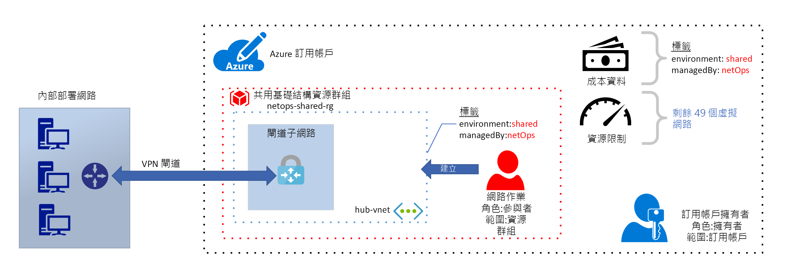
4. 另外部署了兩個資源群組，第一個資源群組的名稱是 prod-rg。Two more resource groups are deployed, the first is named *prod-rg*. 此資源群組會與**生產**環境對齊。This resource group is aligned with the **production** environment. 第二個資源群組的名稱是 dev-rg，會與**開發**環境對齊。The second is named *dev-rg* and is aligned with the **development** environment. 與生產工作負載相關聯的所有資源都會部署至**生產**環境，與開發工作負載相關聯的所有資源都會部署至**開發**環境。All resources associated with production workloads are deployed to the **production** environment and all resources associated with development workloads are deployed to the **development** environment. 在此範例中，我們只會將兩個工作負載部署到這兩個環境，這樣我們就不會遇到任何 Azure 訂用帳戶服務限制。In this example we'll only deploy two workloads to each of these two environments so we won't encounter any Azure subscription service limits. 不過，務必考慮每個資源群組具有 800 個資源的限制。However, it's important to consider that each resource group has a limit of 800 resources per resource group. 因此，如果我們持續將工作負載新增至每個資源群組，很可能會達到此限制。Therefore, if we keep adding workloads to each resource group it is possible that this limit will be reached. 
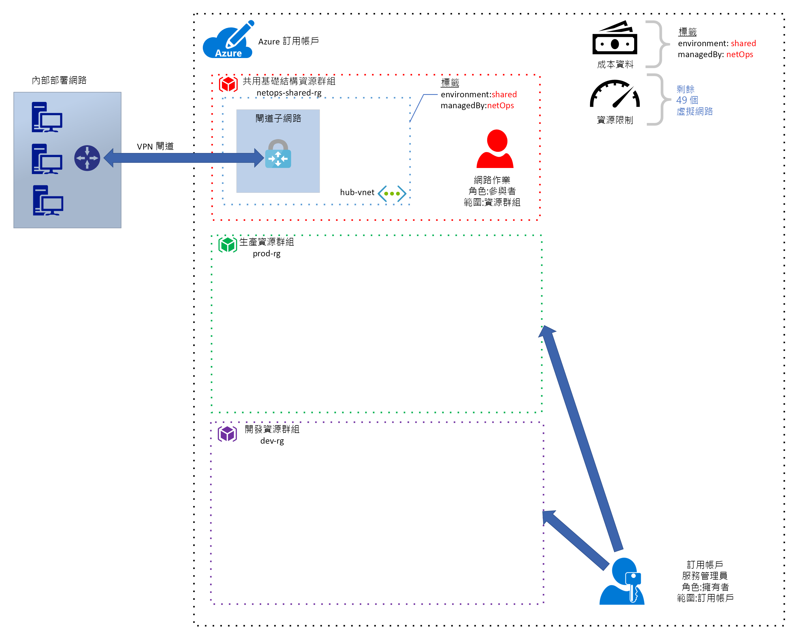
5. 第一個**工作負載擁有者**會將要求傳送給**訂用帳戶服務管理員**，並且新增至每個**開發**和**生產**環境中具有**參與者**角色的資源群組。The first **workload owner** sends a request to the **subscription service administrator** and is added to each of the **development** and **production** environment resource groups with the **contributor** role. 如同您先前所了解的，**參與者**角色允許使用者執行除了指派角色給其他使用者以外的任何作業。As you learned earlier, the **contributor** role allows the user to perform any operation other than assigning a role to another user. 第一個**工作負載擁有者**現在可以建立與其工作負載相關聯的資源。The first **workload owner** can now create the resources associated with their workload.
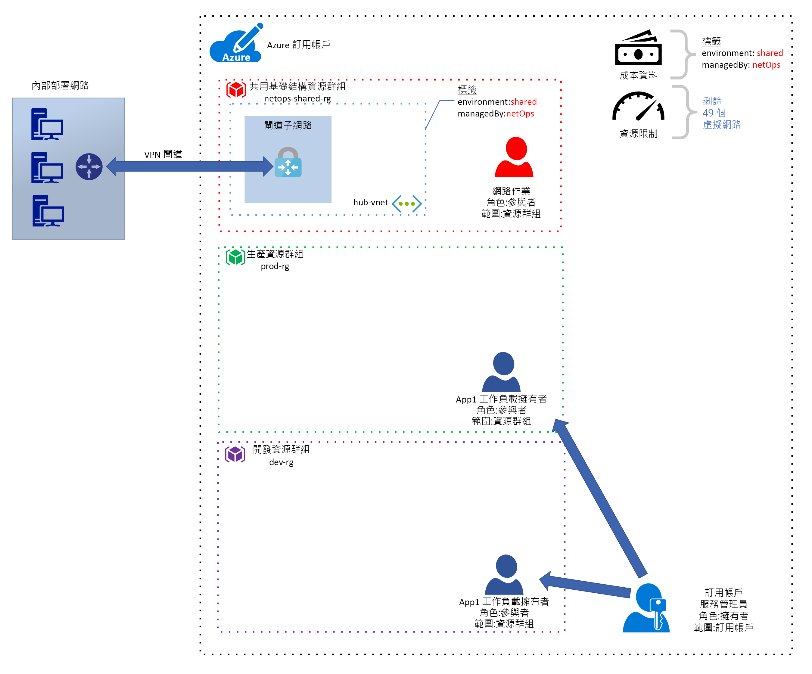
6. 第一個**工作負載擁有者**會在其中包含一組虛擬機器的兩個資源群組中，建立虛擬網路。The first **workload owner** creates a virtual network in each of the two resource groups with a pair of virtual machines in each. 第一個**工作負載擁有者**會將 environment 和 managedBy 標記套用至所有資源。The first **workload owner** applies the *environment* and *managedBy* tags to all resources. 請注意，Azure 服務限制計數器現在剩餘 47 個虛擬網路。Note that the Azure service limit counter is now at 47 virtual networks remaining.
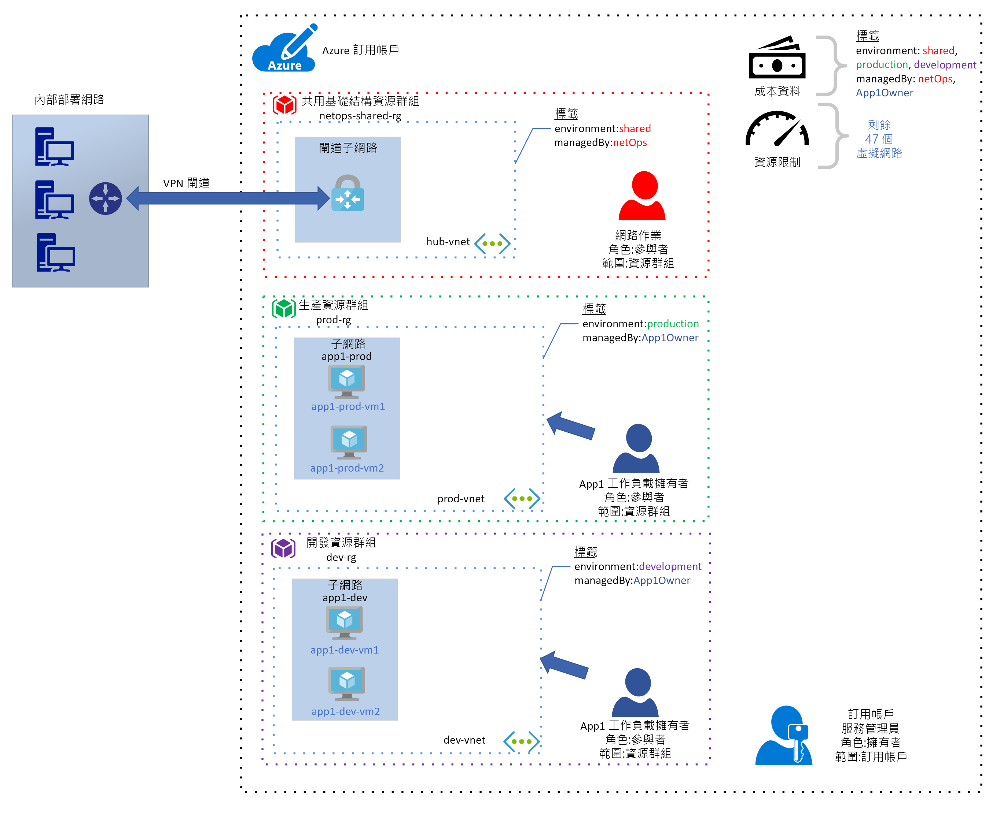
7. 每個虛擬網路在建立時，並沒有與內部部署的連線。Each of the virtual networks does not have connectivity to on-premises when they are created. 在這種類型的架構中，每個虛擬網路必須對等互連至**共用基礎結構**環境中的 hub-vnet。In this type of architecture, each virtual network must be peered to the *hub-vnet* in the **shared infrastructure** environment. 虛擬網路對等互連會建立兩個不同虛擬網路之間的連線，並且允許網路流量在兩者之間傳送。Virtual network peering creates a connection between two separate virtual networks and allows network traffic to travel between them. 請注意，虛擬網路對等互連原本並非可轉移。Note that virtual network peering is not inherently transitive. 必須在已連線的兩個虛擬網路其中一個指定對等互連，且只有在其中一個虛擬網路指定對等互連時，連線才會完成。A peering must be specified in each of the two virtual networks that are connected, and if only one of the virtual networks specifies a peering the connection is incomplete. 為了說明其效果，第一個**工作負載擁有者**會指定 **prod-vnet** 與 **hub-vnet** 之間的對等互連。To illustrate the effect of this, the first **workload owner** specifies a peering between **prod-vnet** and **hub-vnet**. 隨即建立第一個對等互連，但是沒有流量，因為從 **hub-vnet** 到 **prod-vnet** 的互補對等互連尚未指定。The first peering is created, but no traffic flows because the complementary peering from **hub-vnet** to **prod-vnet** has not yet been specified. 第一個**工作負載擁有者**會連絡**網路作業**使用者，並且要求這個互補對等互連連線。The first **workload owner** contacts the **network operations** user and requests this complementary peering connection.
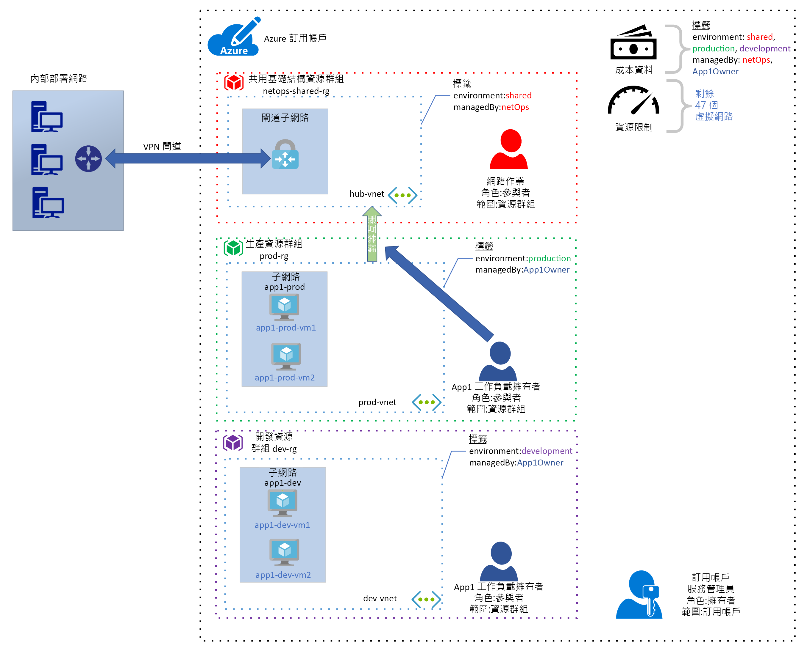
8. **網路作業**使用者檢閱要求、核准，然後在 **hub-vnet** 的設定中指定對等互連。The **network operations** user reviews the request, approves it, then specifies the peering in the settings for the **hub-vnet**. 對等互連連線現在已完成，網路流量會在兩個虛擬網路之間流動。The peering connection is now complete and network traffic flows between the two virtual networks.
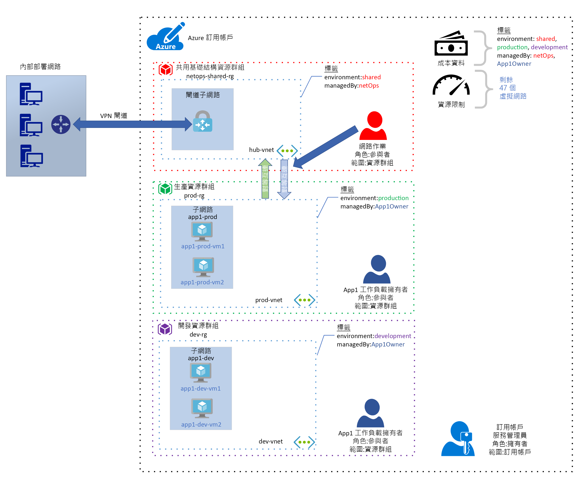
9. 現在，第二個**工作負載擁有者**會將要求傳送給**訂用帳戶服務管理員**，並且新增至現有**生產**和**開發**環境中具有**參與者**角色的資源群組。Now, a second **workload owner** sends a request to the **subscription service administrator** and is added to the existing **production** and **development** environment resource groups with the **contributor** role. 在每個資源群組中，第二個**工作負載擁有者**具有與第一個**工作負載擁有者**相同的所有資源權限。The second **workload owner** has the same permissions on all resources as the first **workload owner** in each resource group. 
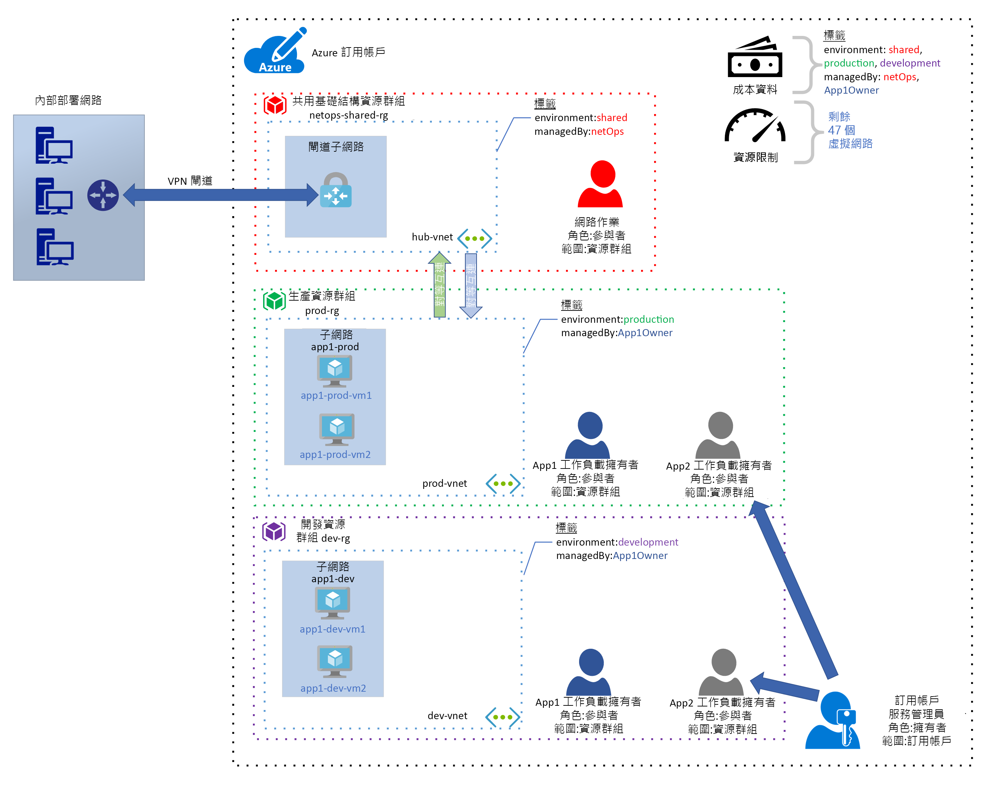
10. 第二個**工作負載擁有者**會在 **prod-vnet** 虛擬網路中建立子網路，然後新增兩部虛擬機器。The second **workload owner** creates a subnet in the **prod-vnet** virtual network, then adds two virtual machines. 第二個**工作負載擁有者**會將 environment 和 managedBy 標記套用至每個資源。The second **workload owner** applies the *environment* and *managedBy* tags to each resource.
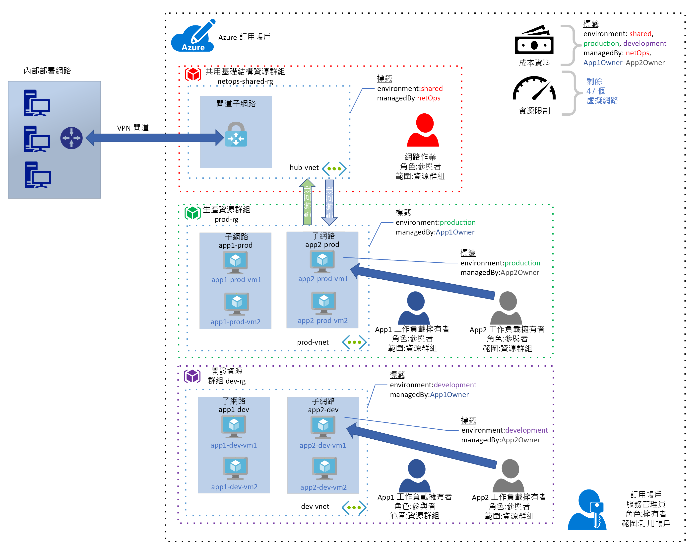 

這個範例資源管理模型可讓我們在三個必要的環境中管理資源。This example resource management model enables us to manage our resources in the three required environments. 我們的共用基礎結構資源會受到保護，因為訂用帳戶中只有單一使用者有權可以存取這些資源。Our shared infrastructure resources are protected because there's only a single user in the subscription with permission to access those resources. 每個工作負載擁有者能夠利用共用基礎結構資源，而不需要自己具備實際共用資源的任何權限。Each of our workload owners is able to utilize the share infrastructure resources without having any permissions on the actual shared resources themselves. 此管理模組不符我們對於工作負載隔離的需求，兩個**工作負載擁有者**都能夠存取其他工作負載的資源。This management model fails our requirement for workload isolation - each of the two **workload owners** are able to access the resources of the other's workload. 

此模型還有一個可能無法立竿見影的重要考量。There's another important consideration with this model that may not be immediately obvious. 在我們的範例中，它是 **app1 工作負載擁有者**，會要求與 **hub-vnet** 的網路對等互連連線，以提供與內部部署的連線。In our example, it was **app1 workload owner** that requested the network peering connection with the **hub-vnet** to provide connectivity to on-premises. **網路作業**使用者會根據使用該工作負載部署的資源，評估該要求。The **network operations** user evaluated that request based on the resources deployed with that workload. 當**訂用帳戶擁有者**新增具有**參與者**角色的 **app2 工作負載擁有者**時，該使用者擁有 **prod-rg** 資源群組中所有資源的管理存取權限。When the **subscription owner** added **app2 workload owner** with the **contributor** role, that user had management access rights to all resources in the **prod-rg** resource group. 

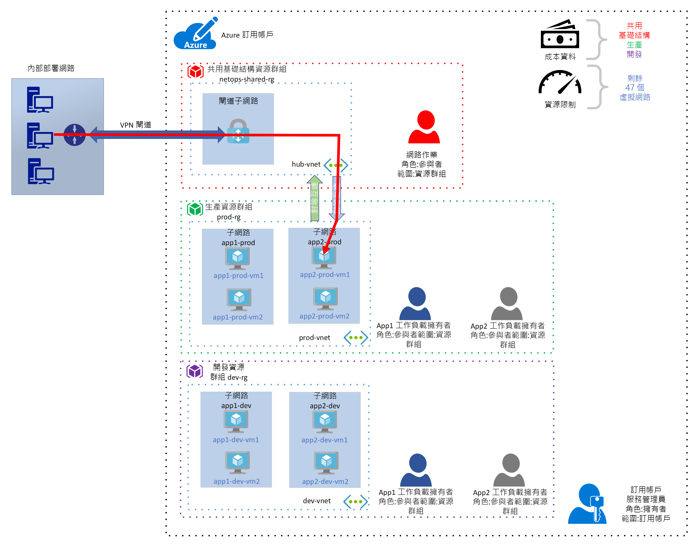

這表示 **app2 工作負載擁有者**有權可以使用 **prod-vnet** 虛擬網路中的虛擬機器，來部署他們自己的子網路。This means **app2 workload owner** had permission to deploy their own subnet with virtual machines in the **prod-vnet** virtual network. 根據預設，這些虛擬機器現在具有內部部署網路的存取權。By default, those virtual machines now have access to the on-premises network. **網路作業**使用者並不知道這些機器，且未核准它們與內部部署的連線。The **network operations** user is not aware of those machines and did not approve their connectivity to on-premises.

接下來，讓我們看看不同環境和工作負載中，具有多個資源群組的單一訂用帳戶。Next, let's look at a single subscription with multiple resources groups for different environments and workloads. 請注意，在上一個範例中，因為每個環境的資源是在相同的資源群組中，所以它們很容易識別。Note that in the previous example, the resources for each environment were easily identifiable because they were in the same resource group. 既然我們不再有該群組，我們必須依賴資源群組命名慣例來提供該功能。Now that we no longer have that grouping, we will have to rely on a resource group naming convention to provide that functionality. 

1. 我們的**共用基礎結構**資源在此模型中仍然具有個別資源群組，所以維持不變。Our **shared infrastructure** resources will still have a separate resource group in this model, so that remains the same. 每個工作負載需要兩個資源群組，分別適用於**開發**和**生產**環境。Each workload requires two resource groups - one for each of the **development** and **production** environments. 針對第一個工作負載，**訂用帳戶擁有者**會建立兩個資源群組。For the first workload, the **subscription owner** creates two resource groups. 第一個資源群組名稱是 **app1-prod-rg**，第二個資源群組名稱是 **app1-dev-rg**。The first is named **app1-prod-rg** and the second one is named **app1-dev-rg**. 如前所述，此命名慣例會識別與第一個工作負載相關聯的資源，**app1**，以及**開發**或**生產**環境。As discussed earlier, this naming convention identifies the resources as being associated with the first workload, **app1**, and either the **dev** or **prod** environment. 同樣地，*訂用帳戶*擁有者會將 **app1 工作負載擁有者**新增至具有**參與者**角色的資源群組。Again, the *subscription* owner adds **app1 workload owner** to the resource group with the **contributor** role.
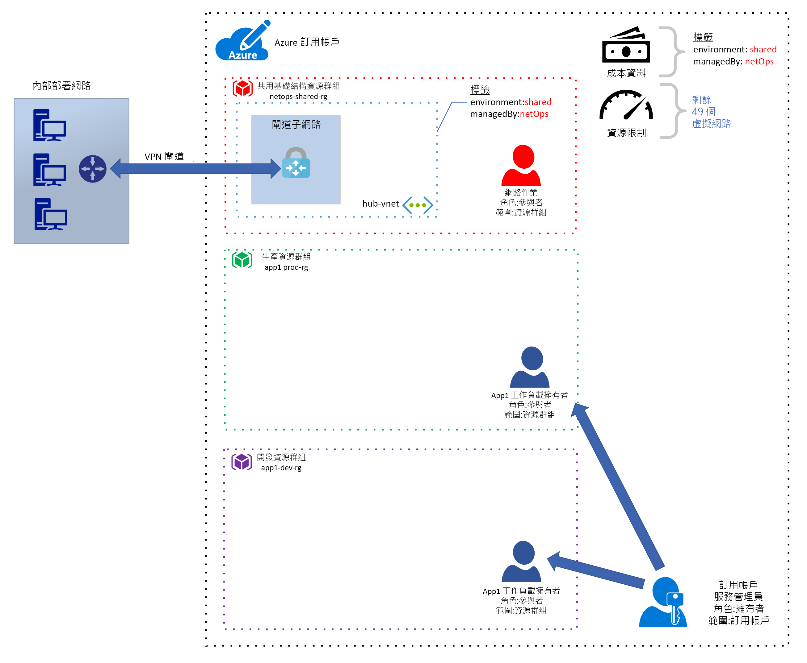
2. 類似於第一個範例，**app1 工作負載擁有者**會將名稱為 **app1-prod-vnet** 的虛擬網路部署至**生產**環境，將另一個名稱為 **app1-dev-vnet** 的虛擬網路部署至**開發**環境。Similar to the first example, **app1 workload owner** deploys a virtual network named **app1-prod-vnet** to the **production** environment, and another named **app1-dev-vnet** to the **development** environment. 同樣地，**app1 工作負載擁有者**會將要求傳送給**網路作業**使用者，以建立對等互連連線。Again, **app1 workload owner** sends a request to the **network operations** user to create a peering connection. 請注意，**app1 工作負載擁有者**會新增與第一個範例相同的標記，限制計數器遞減為在訂用帳戶中剩餘 47 個虛擬網路。Note that **app1 workload owner** adds the same tags as in the first example, and the limit counter has been decremented to 47 virtual networks remaining in the subscription.
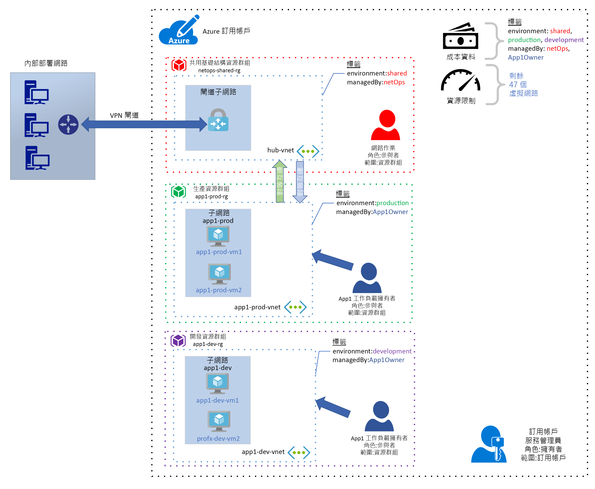
3. **訂用帳戶擁有者**現在會為 **app2 工作負載擁有者**建立兩個資源群組。The **subscription owner** now creates two resource groups for **app2 workload owner**. 遵循與 **app1 工作負載擁有者**相同的慣例，資源群組的名稱是 **app2-prod-rg** 和 **app2-dev-rg**。Following the same conventions as for **app1 workload owner**, the resource groups are named **app2-prod-rg** and **app2-dev-rg**. **訂用帳戶擁有者**會將 **app2 工作負載擁有者**新增至具有**參與者**角色的每個資源群組。The **subscription owner** adds **app2 workload owner** to each of the resource groups with the **contributor** role.
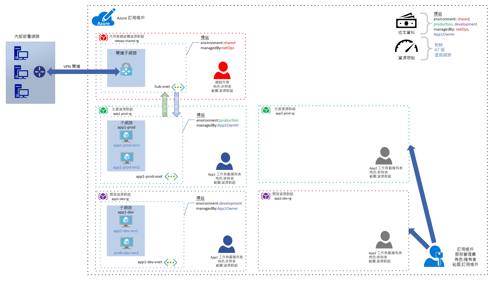
4. *App2 工作負載擁有者*會將虛擬網路和虛擬機器部署到具有相同命名慣例的資源群組。*App2 workload owner* deploys virtual networks and virtual machines to the resource groups with the same naming conventions. 標記隨即新增，限制計數器遞減為在訂用帳戶中剩餘 45 個虛擬網路。Tags are added and the limit counter has been decremented to 45 virtual networks remaining in the *subscription*.
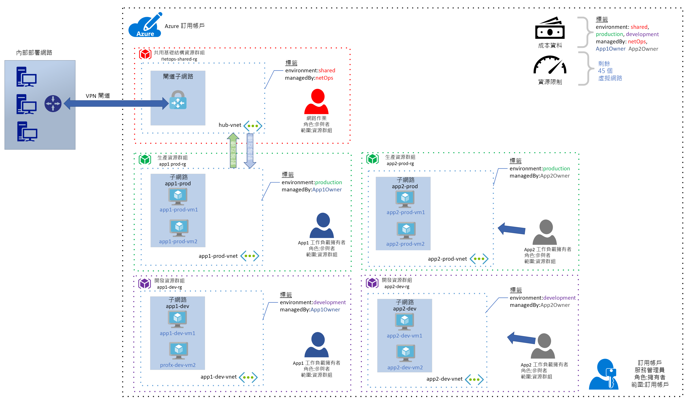
5. *App2 工作負載擁有者*會將要求傳送給*網路作業*使用者，以對等互連 app2-prod-vnet 與 hub-vnet。*App2 workload owner* sends a request to the *network operations* user to peer the *app2-prod-vnet* with the *hub-vnet*. *網路作業*使用者會建立對等互連連線。The *network operations* user creates the peering connection.
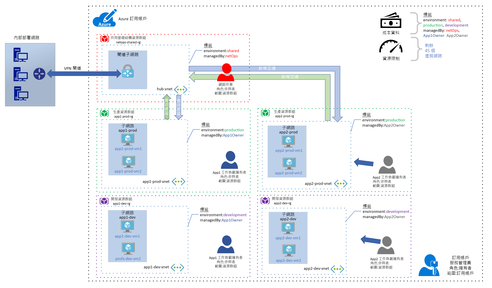

產生的管理模型類似於第一個範例，有幾項主要差異：The resulting management model is similar to the first example, with several key differences:
* 兩個工作負載是依據工作負載和環境來隔離。Each of the two workloads is isolated by workload and by environment.
* 此模型比起第一個範例模型還需要兩個虛擬網路。This model required two more virtual networks than the first example model. 雖然因為只有兩個工作負載，所以這不是重要的差異，但是理論上，此模型的工作負載數目限制為 24 個。While this is not an important distinction with only two workloads, the theoretical limit on the number of workloads for this model is 24. 
* 資源不再針對每個環境，群組在單一資源群組中。Resources are no longer grouped in a single resource group for each environment. 要群組資源必須先了解針對每個環境使用的命名慣例。Grouping resources requires an understanding of the naming conventions used for each environment. 
* 每個對等互連虛擬網路連線是由網路作業使用者檢閱及核准。Each of the peered virtual network connections was reviewed and approved by the *network operations* user.

現在讓我們看看使用多個訂用帳戶的資源管理模型。Now let's look at a resource management model using multiple subscriptions. 在此模型中，我們會將三種環境對齊至個別的訂用帳戶：**共用服務**訂用帳戶、**生產**訂用帳戶，最後是**開發**訂用帳戶。In this model, we'll align each of the three environments to a separate subscription: a **shared services** subscription, **production** subscription, and finally a **development** subscription. 此模型的考量類似於使用單一訂用帳戶的模型，我們在其中必須決定如何將資源群組對齊至工作負載。The considerations for this model are similar to a model using a single subscription in that we have to decide how to align resource groups to workloads. 我們已經判斷為每個工作負載建立資源群組可以滿足我們的工作負載隔離需求，因此我們在此範例中會緊緊遵循該模型。We've already determined that creating a resource group for each workload satisfies our workload isolation requirement, so we'll stick with that model in this example.

1. 在此模型中，有三個訂用帳戶：共用基礎結構、生產和開發。In this model, there are three *subscriptions*: *shared infrastructure*, *production*, and *development*. 三個訂用帳戶都需要訂用帳戶擁有者，在我們的範例中，我們會為所有三個訂用帳戶使用相同的使用者帳戶。Each of these three subscriptions requires a *subscription owner*, and in our simple example we'll use the same user account for all three. 共用基礎結構資源的管理方式類似於上述前兩個範例，第一個工作負載是與生產環境中的 app1-rg，以及開發環境中相同名稱的資源群組相關聯。The *shared infrastructure* resources are managed similarly to the first two examples above, and the first workload is associated with the *app1-rg* in the *production* environment and the same-named resource group in the *development* environment. app1 工作負載擁有者會新增到具有參與者角色的每個資源群組。The *app1 workload owner* is added to each of the resource group with the *contributor* role. 
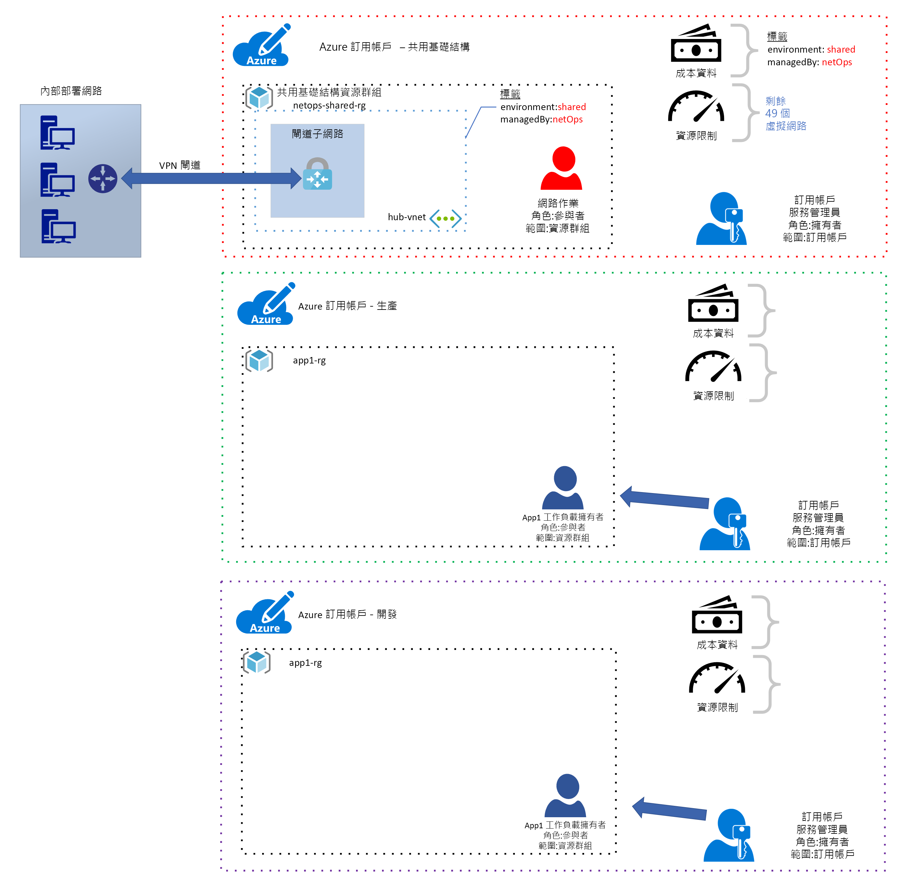
2. 如同先前的範例，app1 工作負載擁有者會建立資源，並且要求與共用基礎結構虛擬網路的對等互連連線。As with the earlier examples, *app1 workload owner* creates the resources and requests the peering connection with the *shared infrastructure* virtual network. App1 工作負載擁有者只會新增 managedBy 標記，因為不再需要 environment 標記。*App1 workload owner* adds only the *managedBy* tag because there is no longer a need for the *environment* tag. 也就是說，每個環境的資源現在會分組在同一個訂用帳戶，environment 標記是多餘的。That is, resources are for each environment are now grouped in the same *subscription* and the *environment* tag is redundant. 限制計數器會遞減為剩餘 49 個虛擬網路。The limit counter is decremented to 49 virtual networks remaining.
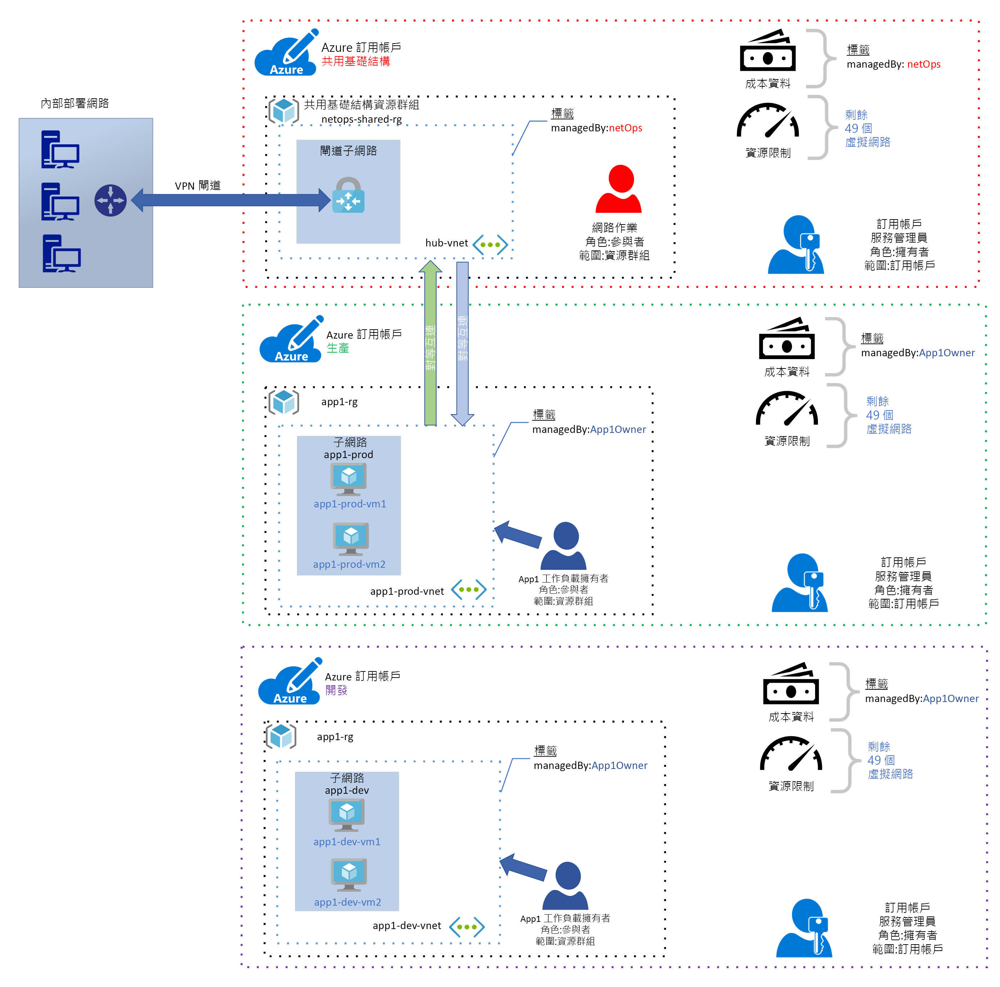
3. 最後，訂用帳戶擁有者針對第二個工作負載重複此程序，在 \*參與者角色中新增具有 app2 工作負載擁有者的資源群組。Finally, the *subscription owner* repeats the process for the second workload, adding the resource groups with the *app2 workload owner* in the \*contributor role. 每個環境訂用帳戶的限制計數器會遞減為剩餘 48 個虛擬網路。The limit counter for each of the environment subscriptions is decremented to 48 virtual networks remaining. 

此管理模型具有上述第二個範例的優點。This management model has the benefits of the second example above. 不過，主要差異是，因為它們是分散在兩個訂用帳戶，所以限制比較不成問題。However, the key difference is that limits are less of an issue due to the fact that they are spread over two *subscriptions*. 缺點是標記追蹤的資料成本，必須跨所有三個訂用帳戶進行彙總。The drawback is that the cost data tracked by tags must be aggregated across all three *subscriptions*. 

因此，您可以根據您的需求優先順序，選取這兩個範例資源管理模型其中之一。Therefore, you can select any of these two examples resource management models depending on the priority of your requirements. 如果您預期貴組織不會達到單一訂用帳戶的服務限制，則您可以使用單一訂用帳戶與多個資源群組。If you anticipate that your organization will not reach the service limits for a single subscription, you can use a single subscription with multiple resource groups. 相反地，如果貴組織預期有許多工作負載，每個環境有多個訂用帳戶可能比較理想。Conversely, if your organization anticipates many workloads, multiple subscriptions for each environment may be better.

<!-- ## Summary

## Next steps -->

<!-- links -->

[rbac-built-in-owner]: /azure/role-based-access-control/built-in-roles#owner
[rbac-built-in-roles]: /azure/role-based-access-control/built-in-roles
