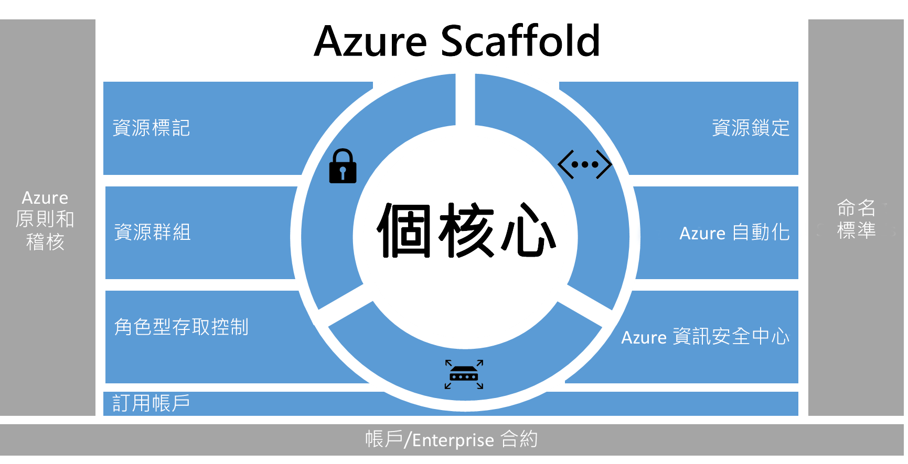
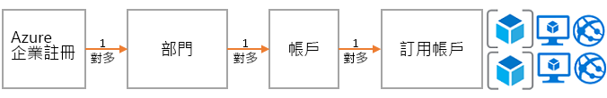
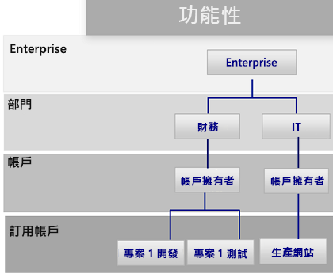
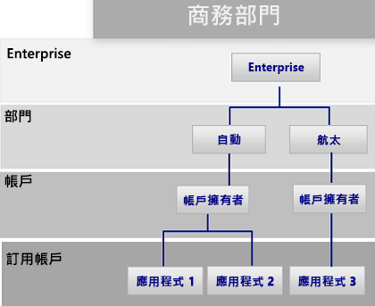
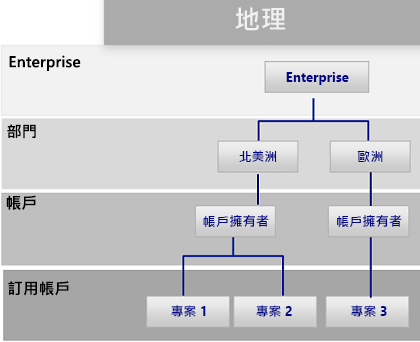
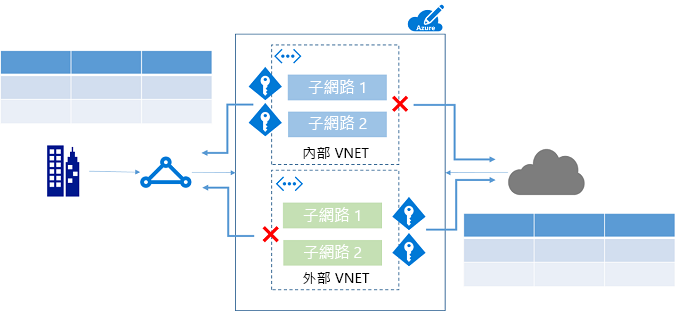
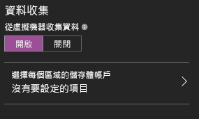

# Azure 企業 Scaffold - 規定的訂用帳戶治理
企業日漸採用公用雲端，以獲取其靈活度和彈性。 它們利用雲端的優勢來產生收益，或讓企業的資源達到最佳化。 Microsoft Azure 提供許多服務，企業可以像堆積木一樣組合這些服務，以處理各式各樣的工作負載和應用程式。 

但是，要知道從何著手往往很困難。 決定使用 Azure 之後，經常會產生一些問題︰

* 「如何符合某些國家/地區中資料主權的法律需求？」
* 「如何確保他人不會不慎變更重要系統？」
* 「如何知道每個資源支援什麼，才能精準地斟酌考量並回收成本？」

不必期望空的訂用帳戶不需任何防護措施。 這個空白空間可能會阻礙您移至 Azure。

本文是技術專業人員處理治理需求並以靈活度需求加以平衡的起點。 文中介紹企業 Scaffold 的概念，以引導組織實作和管理其 Azure 訂用帳戶。 

## 治理需求
移至 Azure 時，您必須處理早期治理主題，以確保在企業內成功使用雲端。 不幸的是，建立全方位治理系統的時間和體系表示某些事業群會直接接洽廠商，而不需企業 IT 部門參與。 如果沒有妥善管理資源，這種方法可能會讓企業遭受攻擊。 公用雲端的特性包含靈活度、彈性和以取用量為基礎的價格，這些特性對於必須快速滿足 (內部和外部) 客戶需求的事業群而言極為重要。 但是，企業 IT 部門需要確保資料和系統受到有效的保護。

在現實生活中，Scaffolding 用來建立結構的基礎。 Scaffold 可引導一般輪廓，並可為即將裝載的永久系統提供更多的錨點。 企業 Scaffold 也是如此︰一組有彈性的控制項和可提供環境結構的 Azure 功能，以及公用雲端上所建置服務的錨點。 它可做為建置者 (IT 和事業群) 建立和附加新服務的基礎。

Scaffold 是以我們經由與各種規模的用戶端合作而蒐集到的實務作法為基礎。 這些用戶端包含在雲端開發解決方案的小型組織，以至 Fortune 500 大企業和在雲端移轉並開發解決方案的獨立軟體廠商。 企業 Scaffold 是「為了特定目的而建置」成彈性支援傳統 IT 工作負載和敏捷式工作負載；例如，建立以 Azure 功能為基礎之軟體即服務 (SaaS) 應用程式的開發人員。

企業 Scaffold 的用意是要成為 Azure 中每個新訂用帳戶的基礎。 它可讓系統管理員確保工作負載符合組織的最低治理需求，而不會阻礙事業群和開發人員快速達成他們自己的目標。

> [!IMPORTANT]
> 治理是 Azure 成功的重要關鍵。 本文是以企業 Scaffold 的技術實作為目標，但只論及更廣泛的處理程序和元件之間的關聯性。 原則治理會從上而下流動，並由需要達成的業務來決定。 當然，Azure 治理模型的建立納入 IT 部門代表，但更重要的是應該具有來自事業群領導者及安全性和風險管理階層的強大代表性。 最後，企業 Scaffold 與降低業務風險有關，以達成組織的任務與目標。
> 
> 

下圖描述 Scaffold 的元件。 其基礎依賴於部門、帳戶和訂用帳戶的可靠計畫。 其要件是由 Resource Manager 原則和強大的命名標準所組成。 Scaffold 的其餘部分是來自 Azure 核心功能，而這些功能可打造出安全且易於管理的環境。

> [!NOTE]
> Azure 自 2008 年引進後就急速成長。 此種成長讓 Microsoft 工程設計團隊不得不重新思考其管理和部署服務的方式。 Azure Resource Manager 模型在 2014 年引進，並取代傳統部署模型。 Resource Manager 可讓組織更輕鬆地部署、組織和控制 Azure 資源。 Resource Manager 在建立資源時納入平行處理，以加快部署複雜、互相依存方案的速度。 它還包含細微的存取控制，以及利用中繼資料標記資源的功能。 Microsoft 建議您透過 Resource Manager 模型建立所有的資源。 企業 Scaffold 明顯是針對 Resource Manager 模型而設計。
> 
> 

## 定義您的階層
Azure Enterprise Enrollment (和企業版入口網站) 是 Scaffold 的基礎。 Enterprise Enrollment 是核心治理結構，可定義公司內 Azure 服務的形式和用途。 在企業合約中，客戶能夠進一步將環境細分成部門、帳戶和最終的訂用帳戶。 Azure 訂用帳戶是內含所有資源的基本單位。 它也可在 Azure 中定義數個限制，例如核心、資源等的數目。

每個企業都不同，上圖中的階層對於在公司內組織 Azure 的方式容許極大的彈性。 實作本文件內含的指引之前，您應該塑造您的階層，並了解對於計費、資源存取和複雜度的影響。

Azure Enrollment 的三個常見模式如下︰

* **功能**模式
  
    
* **業務單位**模式 
  
    
* **地理**模式
  
    

您可在訂用帳戶層級套用 scaffold，將企業的治理需求延伸到訂用帳戶。

## 命名標準
Scaffold 的第一要件是命名標準。 設計良好的命名標準可讓您識別入口網站中、帳單上和指令碼內的資源。 最有可能的是，您已經有內部部署基礎結構的命名標準。 將 Azure 新增至您的環境時，您應該將這些命名標準延伸至 Azure 資源。 命名標準有助於更有效率地在所有層級管理環境。

> [!TIP]
> 針對命名慣例：
> * 檢閱並且盡可能採用[模式與實例指南](../best-practices/naming-conventions.md)。 本指南可協助您決定有意義的命名標準。
> * 將 camelCasing 使用於資源的名稱 (例如 myResourceGroup 和 vnetNetworkName)。 附註︰有些資源 (例如儲存體帳戶) 的唯一選項是使用小寫 (和其他特殊字元)。
> * 請考慮使用 Azure Resource Manager 原則 (在下一節中說明) 來強制執行命名標準。
> 
> 上述的祕訣可協助您實作一致的命名慣例。

## 原則和稽核
Scaffold 的第二要件牽涉到建立 [Azure 原則](/azure/azure-policy/azure-policy-introduction)和[稽核活動記錄](/azure/azure-resource-manager/resource-group-audit)。 Resource Manager 原則讓您能夠管理 Azure 中的風險。 您可以定義一些原則，藉由限制、強制執行或稽核特定動作來確保資料主權。 

* 原則是預設**允許**系統。 您可定義原則並將原則指派給拒絕或稽核資源動作的資源，藉此控制動作。
* 原則定義會以原則定義語言 (if-then 條件) 描述原則。
* 您可使用 JSON (Javascript 物件標記法) 格式的檔案建立原則。 定義原則後，將它指派給特定的範圍︰訂用帳戶、資源群組或資源。

原則有多個動作可允許細微控管您的案例。 動作如下︰

* **拒絕**︰封鎖資源要求
* **稽核**︰允許要求，但會在活動記錄檔中加入一行文字 (這可用來提供警示或觸發 Runbook)
* **附加**︰將指定的資訊新增到資源。 例如，如果資源上沒有 "CostCenter" 標籤，則新增具有預設值的該標籤。

### Resource Manager 原則的常見用途
Azure Resource Manager 原則是 Azure 工具組中功能強大的工具。 這類原則可讓您避免非預期的成本，進而透過標籤來識別資源的成本中心，並確保符合法規需求。 當原則搭配內建稽核功能時，您可以塑造複雜但有彈性的解決方案。 原則可讓公司掌控「傳統 IT」工作負載與「敏捷式」工作負載；例如，開發客戶應用程式。 我們最常見的原則模式如下︰

* **地區相容性/資料主權** - Azure 提供的區域遍及世界各地。 企業通常會想要控制資源的建立位置 (不論是為了確保資料主權，或只是為了確保資源建立於靠近資源取用者的地方)。
* **成本管理** - Azure 訂用帳戶可以包含許多類型的資源。 公司通常想要確保標準訂用帳戶避免使用過大的資源，以節省每個月數百美元或更高金額的成本。
* **透過必要標籤預設治理** - 必要標籤是最常見且高度所需的功能。 使用 Azure Resource Manager 原則，企業就可以確保適當地標記資源。 最常見的標記︰部門、資源擁有者及環境類型 (例如生產、測試、開發)

**範例**

企業營運應用程式的「傳統 IT」訂用帳戶

* 對所有資源強制使用「部門」和「擁有者」標籤
* 限制資源建立於北美地區
* 限制建立 G 系列 VM 和 HDInsight 叢集的能力

可供業務單位建立雲端應用程式的「敏捷式」環境

* 為了符合資料主權需求，只允許在特定區域建立資源。
* 對所有資源強制使用「環境」標籤。 如果建立的資源沒有標籤，則將 [環境︰未知] 標籤附加到資源。
* 當資源建立於北美地區以外時進行稽核，但不阻止。
* 建立高成本的資源時進行稽核。

> [!TIP]
> 各組織最常用的 Resource Manager 原則是控制「何處」可以建立資源以及可以建立「何種」類型的資源。 除了控制「何處」和「何種」以外，許多企業會使用原則來確保資源有適當的中繼資料可收回取用成本。 我們建議針對下列各項在訂用帳戶層級套用原則︰
> 
> * 地區相容性/資料主權
> * 成本管理
> * 必要標籤 (依照業務需求判斷，例如 BillTo、應用程式擁有者)
> 
> 您可以在較低的範圍層級套用其他原則。
> 
> 

### 稽核 - 發生什麼情形？
若要檢視環境的運作情況，您需要稽核使用者活動。 Azure 中的大多數資源類型都會建立診斷記錄，您可以透過記錄工具或在 Azure Log Analytics 中進行分析。 您可以蒐集多個訂用帳戶的活動記錄檔，以提供部門或企業觀點。 稽核記錄是很重要的診斷工具，同時也是在 Azure 環境中觸發事件的重要機制。

Resource Manager 部署的活動記錄檔可讓您判斷已發生的**作業**以及其執行者。 使用 Log Analytics 等工具可以收集和彙總活動記錄檔。

## 資源標籤
隨著組織中的使用者將資源新增至訂用帳戶，讓資源與適當的部門、客戶和環境建立關聯變得越來越重要。 您可以透過[標籤](/azure/azure-resource-manager/resource-group-using-tags)將中繼資料附加到資源。 您可以使用標籤來提供資源或擁有者的相關資訊。 標籤不僅可讓您以各種方式彙總及群組資源，並可將該資料用於退款目的。 您可以最多使用 15 個機碼值組來標記資源。 

資源標籤富有彈性且應該附加到大多數資源。 常見資源標籤的範例如下︰

* BillTo
* 部門 (或業務單位)
* 環境 (生產、預備、開發)
* 層次 (Web 層、應用程式層)
* 應用程式擁有者
* ProjectName

如需更多標籤範例，請參閱 [Azure 資源的建議命名慣例](../best-practices/naming-conventions.md)。

> [!TIP]
> 請考慮針對下列各項制定可強制標記的原則︰
> 
> * 資源群組
> * 儲存體
> * 虛擬機器
> * 應用程式服務環境/Web 伺服器
> 
> 此標記策略可在所有訂用帳戶上識別業務、財務、安全性、風險管理和環境整體管理方面所需的中繼資料。 

## 資源群組
Resource Manager 可讓您將資源放入有意義的群組，以便管理、計費或達到自然親和性。 如先前所述，Azure 有兩個部署模型。 在舊版的傳統模型中，管理的基本單位是訂用帳戶。 訂用帳戶內的資源難以細分，以致建立大量的訂用帳戶。 使用 Resource Manager 模型，我們看到資源群組的引入。 資源群組是資源的容器，其中的資源具有共同的生命週期或共用「所有 SQL 伺服器」或「應用程式 A」等屬性。

資源群組不能彼此包含，且資源只能屬於一個資源群組。 您可以將某些動作套用於資源群組中的所有資源。 例如，刪除資源群組即可移除資源群組內的所有資源。 一般而言，您可將整個應用程式或相關系統放在相同的資源群組中。 例如，名為 Contoso Web 應用程式的三層應用程式會包含相同資源群組中的 Web 伺服器、應用程式伺服器和 SQL 伺服器。

> [!TIP]
> 就「傳統 IT」工作負載與「敏捷式 IT」工作負載而言，您組織資源群組的方式可能會有所不同：
> 
> * 「傳統 IT」工作負載通常會依照相同生命週期內的項目分組，例如應用程式。 依照應用程式分組，即可進行個別應用程式管理。
> * 「敏捷式 IT」工作負載傾向著重於外部客戶面向的雲端應用程式。 資源群組應反映出部署 (例如 Web 層、應用程式) 和管理的層次。
> 
> 了解您的工作負載可協助您開發資源群組策略。

## 角色型存取控制
您可能會自問「誰應擁有資源的存取權？」 以及「如何控制此存取權？」 允許或不允許存取 Azure 入口網站，以及控制入口網站中資源的存取很重要。 

Azure 最初發行時，訂用帳戶的存取控制是基本的︰系統管理員或共同管理員。 存取傳統模型中的訂用帳戶，意味著存取入口網站中的所有資源。 缺乏細微控制導致訂用帳戶激增，進而為 Azure Enrollment 提供合理的存取控制層級。

不再需要此種訂用帳戶激增情況。 使用角色型存取控制，您可以將使用者指派給標準角色 (例如常見的「讀取者」和「寫入者」角色類型)。 您也可以定義自訂角色。

> [!TIP]
> 實作角色型存取控制：
> * 使用 AD Connect 工具，將公司的身份識別存放區 (通常是 Active Directory) 連接到 Azure Active Directory。
> * 使用受控身分識別，控制訂用帳戶的系統管理員/共同管理員。 **不要**將系統管理員/共同管理員指派給新的訂用帳戶擁有者。 相反地，使用 RBAC 角色將**擁有者**權限提供給群組或個人。
> * 將 Azure 使用者新增至 Active Directory 中的群組 (例如，應用程式 X 擁有者)。 使用已同步處理的群組，提供群組成員管理資源群組 (包含應用程式) 的適當權限。
> * 依照授與執行預期工作所需**最低權限**的原則。 例如︰
>   * 部署群組︰唯一能夠部署資源的群組。
>   * 虛擬機器管理︰能夠重新啟動 VM (以便執行作業) 的群組
> 
> 這些祕訣可協助您跨訂用帳戶管理使用者存取。

## Azure 資源鎖定
隨著您的組織將核心服務新增至訂用帳戶，確保這些服務的可用性以避免業務中斷變得越來越重要。 [資源鎖定](/azure/azure-resource-manager/resource-group-lock-resources)可讓您限制對珍貴資源執行的作業，而修改或刪除這類資源會嚴重影響您的應用程式或雲端基礎結構。 您可以將鎖定套用至訂用帳戶、資源群組或資源。 一般而言，您會將鎖定套用至基礎資源，例如虛擬網路、閘道和儲存體帳戶。 

資源鎖定目前支援兩個值︰CanNotDelete 和 ReadOnly。 CanNotDelete 表示使用者 (具有適當權限) 仍可讀取或修改資源，但無法加以刪除。 ReadOnly 表示經過授權的使用者無法刪除或修改資源。

若要建立或刪除管理鎖定，您必須擁有 `Microsoft.Authorization/*` 或 `Microsoft.Authorization/locks/*` 動作的存取權。
在內建角色中，只有「擁有者」和「使用者存取管理員」被授與這些動作的存取權。

> [!TIP]
> 應該以鎖定保護核心網路選項。 對 Azure 訂用帳戶而言，意外刪除閘道、站對站 VPN 是個大災難。 Azure 不允許您刪除使用中的虛擬網路，但套用更多的限制是很有用的預防措施。 
> 
> * 虛擬網路︰CanNotDelete
> * 網路安全性群組︰CanNotDelete
> * 原則︰CanNotDelete
> 
> 原則對於適當控制項的維護也十分重要。 我們建議您將 **CanNotDelete** 鎖定套用到正在使用的原則。

## 核心網路資源
資源的存取可以是內部的 (在公司網路內) 或外部的 (透過網際網路)。 您組織中的使用者很容易不小心將資源放在錯誤的位置，並可能加以開啟而遭到惡意存取。 針對內部部署裝置，企業必須加上適度的控制，以確保 Azure 使用者能做出適當的決策。 針對訂用帳戶治理，我們會找出可提供基本存取控制的核心資源。 核心資源是由下列各項所組成︰

* **虛擬網路**是子網路的容器物件。 雖然不是絕對必要，但通常使用於將應用程式連接到內部公司資源時。
* **網路安全性群組**類似於防火牆，可提供資源如何透過網路「交談」的規則。 這類群組可細微控制子網路 (或虛擬機器) 如何/是否可以連接到網際網路或相同虛擬網路中的其他子網路。

> [!TIP]
> 針對網路：
> * 建立外部工作負載與內部工作負載專用的虛擬網路。 此方法可減少不慎將預計用於內部工作負載的虛擬機器放入對外空間的機會。
> * 設定網路安全性群組以限制存取。 至少，封鎖從內部虛擬網路時存取網際網路，以及封鎖從外部虛擬網路存取公司網路。
> 
> 這些祕訣可協助您實作安全的網路資源。

### 自動化
個別管理資源相當耗時，而且某些作業可能容易發生錯誤。 Azure 提供了各種自動化功能，包括 Azure 自動化、Logic Apps 和 Azure Functions。 [Azure 自動化](/azure/automation/automation-intro)可讓系統管理員建立和定義 Runbook，以便處理管理資源時的一般工作。 您可以使用 PowerShell 程式碼編輯器或圖形化編輯器來建立 Runbook。 您可以產生複雜的多階段工作流程。 Azure 自動化通常用來處理一般工作，例如關閉未使用的資源，或建立資源來回應特定觸發程序，而不需要人為介入。

> [!TIP]
> 針對自動化：
> * 建立 Azure 自動化帳戶，並檢閱 [Runbook 資源庫](/azure/automation/automation-runbook-gallery)中可用的 Runbook (圖形化和命令列)。
> * 匯入並自訂重要 Runbook，以便自己使用。
> 
> 常見的案例是依照排程啟動/關閉虛擬機器的功能。 資源庫中有範例 Runbook 可用，這些 Runbook 可處理這種情況並教導您如何加以展開。
> 
> 

## Azure 資訊安全中心
過度考量安全性或許是雲端採用的其中一個最大阻礙。 IT 風險管理員和資訊安全部門必須確保 Azure 中的資源是安全的。 

[Azure 資訊安全中心](/azure/security-center/security-center-intro)可供集中檢視訂用帳戶中資源的安全性狀態，並提供有助於預防資源遭到入侵的相關建議。 它可以啟用更細微的原則 (例如，將原則套用至特定的資源群組，讓企業能針對他們所面臨的風險來調整其立場態度)。 最後，Azure 資訊安全中心是一個開放平台，可讓 Microsoft 合作夥伴和獨立軟體廠商建立可外掛到 Azure 資訊安全中心的軟體，以增強其功能。 

> [!TIP]
> 根據預設，Azure 資訊安全中心會在每個訂用帳戶中啟用。 不過，您必須啟用從虛擬機器收集資料的功能，以允許 Azure 資訊安全中心安裝其代理程式並開始蒐集資料。
> 
> 
> 
> 

## 後續步驟
* 既然您已了解訂用帳戶治理，現在就可以參閱這些實務建議。 請參閱[實作 Azure 訂用帳戶治理的範例](subscription-governance-examples.md)。
