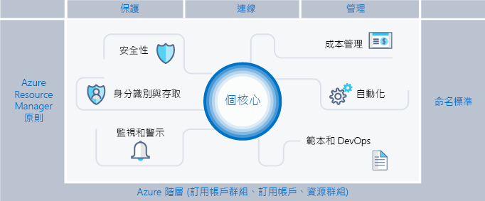
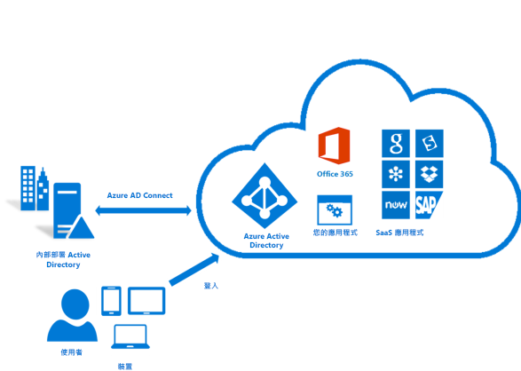
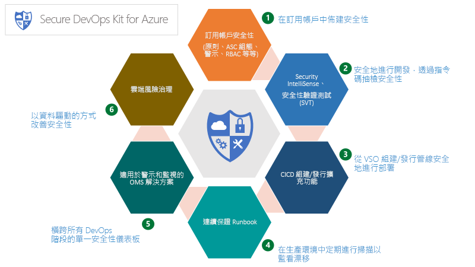
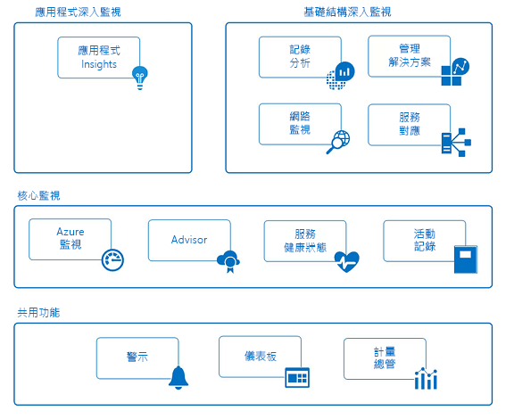

# Azure 企業 Scaffold：規定的訂用帳戶治理

企業日漸採用公用雲端，以獲取其靈活度和彈性。 它們利用雲端的優勢來產生收益，並讓企業的資源運用達到最佳化。 Microsoft Azure 提供許多服務和功能，企業可以像堆積木一樣組合這些服務，以處理各式各樣的工作負載和應用程式。

決定使用 Microsoft Azure 只是獲得雲端優勢的第一步。 第二步是了解企業可如何有效地使用 Azure，並找出需要先準備的基本功能，以處理類似下列的問題：

* 「我擔心資料主權的問題；該如何確保我的資料和系統符合法規需求？」
* 「如何知道每個資源支援什麼，才能精準地斟酌考量並回收成本？」
* 「我想要確保在公用雲端中部署或執行的一切事項都以安全第一的思維作為前提，我該如何推動這件事？」

不必期望空的訂用帳戶不需任何防護措施。 這個空白空間可能會阻礙您移至 Azure。

本文是技術專業人員處理治理需求並以靈活度需求加以平衡的起點。 文中介紹企業 Scaffold 的概念，引導組織以安全的方式來實作和管理其 Azure 環境。 其中提供的架構可用來開發有效且高效率的控制項。

## 治理需求

移至 Azure 時，您必須處理早期治理主題，以確保在企業內成功使用雲端。 不幸的是，建立全方位治理系統的時間和體系表示某些事業群會直接接洽提供者，而不需企業 IT 部門參與。 如果沒有妥善管理資源，這種方法可能會讓企業遭受攻擊。 公用雲端的特性包含靈活度、彈性和以取用量為基礎的價格，這些特性對於必須快速滿足 (內部和外部) 客戶需求的事業群而言極為重要。 但是，企業 IT 部門需要確保資料和系統受到有效的保護。

建立建築物時，我們使用 Scaffold (鷹架) 來建立結構的基礎。 Scaffold 可引導出大致輪廓，並可為即將裝載的永久系統提供更多錨點。 企業 Scaffold 也是如此︰一組有彈性的控制項和可提供環境結構的 Azure 功能，以及公用雲端上所建置服務的錨點。 這為有交期壓力的建置者 (IT 和事業群) 提供建立和附加新服務的基礎。

Scaffold 是以我們經由與各種規模的用戶端合作而蒐集到的實務作法為基礎。 這些用戶端包含在雲端開發解決方案的小型組織，以至大型跨國企業和遷移工作負載及開雲端原生發解決方案的獨立軟體廠商。 企業 Scaffold 是「為了特定目的而建置」成彈性支援傳統 IT 工作負載和敏捷式工作負載；例如，開發人員會建立以 Azure 平台功能為基礎的軟體即服務 (SaaS) 應用程式。

企業 Scaffold 的用意是要成為 Azure 中每個新訂用帳戶的基礎。 它可讓系統管理員確保工作負載符合組織的最低治理需求，而不會阻礙事業群和開發人員快速達成他們自己的目標。 根據我們的經驗，這不會造成阻礙，反而是大幅加快公用雲端的成長。

> [!NOTE]
> Microsoft 已發行稱為[Azure 藍圖](/azure/governance/blueprints/overview)的新功能預覽，此功能可讓您封裝、管理及部署訂用帳戶和管理群組上常用的映像、範本、原則和指令碼。 這項功能像是座橋梁，以 Scaffold 的目的作為參考模型，然後將該模型部署到您的組織。
>
下圖顯示 Scaffold 的元件。 其基礎依賴於管理階層和訂用帳戶的可靠計畫。 其要件是由 Resource Manager 原則和強大的命名標準所組成。 Scaffold 的其餘部分是 Azure 核心功能，而這些功能可打造出安全且易於管理的環境，並與之連線。

## 定義您的階層

Scaffold 的基礎是階層和直達訂用帳戶和資源群組的 Azure Enterprise 註冊關聯性。 Enterprise 註冊會以合約的角度來定義公司內部的 Azure 服務形式和用途。 在企業合約中，您可以進一步將環境細分成部門、帳戶和最終的訂用帳戶和資源群組，以符合您組織的結構。

Azure 訂用帳戶是內含所有資源的基本單位。 它也可在 Azure 中定義數個限制，例如核心、虛擬網路和其他資源的數目。 Azure 資源群組可用來進一步改善訂用帳戶模型，並以更自然的方式建立資源群組。

每個企業都不同，上圖中的階層對於在公司內組織 Azure 的方式容許極大的彈性。 當您要開始在公用雲端中作業時，模型化階層以反映公司的計費、資源管理和資源存取需求是最優先也是最重要&mdash;&mdash;的決策。

### 部門和帳戶

Azure Enrollment 的三個常見模式如下︰

* **功能**模式

    
* **業務單位**模式

    
* **地理**模式

    

雖然這些模式中的每一個都有其作用，但愈來愈多人採用**業務單位**模式，因為在模型化組織成本模型及反映控制範圍上，此模式具有高度彈性。 Microsoft 核心工程及作業群組已建立**業務單位**模式的子集，可有效地根據**聯邦**、**州**及**地方**來建立模型。 (如需詳細資訊，請參閱[組織企業內的訂用帳戶和資源群組](https://azure.microsoft.com/blog/organizing-subscriptions-and-resource-groups-within-the-enterprise/)。)

### Azure 管理群組

Microsoft 最近發行模型化階層的新方法：[Azure 管理群組](/azure/azure-resource-manager/management-groups-overview)。 管理群組會比部門及帳戶更有彈性，並可以建立多達六個層級的巢狀結構。 管理群組可讓您建立與計費階層分開的階層，只為了讓您更有效率地管理資源。 管理群組可以反映您的計費階層，而且企業通常會以此方式作為起點。 不過，管理群組的強大功能是：當相關訂用帳戶 (無論位在計費階層中何處&mdash;&mdash;) 群組在一起，而且需要獲派常見角色、原則及計畫時，即可使用這些管理群組為組織建立模型。 幾個範例：

* **生產/非生產**。 有些企業會建立管理群組來識別其生產和非生產訂用帳戶。 管理群組可讓這些客戶更輕鬆地管理角色和原則，例如：非生產訂用帳戶可能會允許開發人員具有「參與者」存取權，但在生產訂用帳戶中，他們只具有「讀者」存取權。
* **內部的服務/外部服務**。 類似於生產/非生產，企業對內部服務和提供給客戶的外部服務通常會有不同的需求、原則和角色。

周詳的管理群組加上 Azure 原則與計畫，是有效控管 Azure 的骨幹。

### 訂用帳戶

在決定您的部門及帳戶 (或管理群組) 時，您會優先探討如何分配 Azure 環境以符合您的組織。 然而，訂用帳戶才是真正執行作業的地方，而您在此所做的決策會影響安全性、延展性和計費。  許多組織會查看下列模式來作為他們的指引：

* **應用程式/服務**：訂用帳戶代表應用程式或服務 (應用程式的組合)
* **生命週期**：訂用帳戶代表服務生命週期，例如生產或開發。
* **部門**：訂用帳戶代表組織中的部門。

前兩個模式最常使用，而且這兩者都十分建議使用。 生命週期方法適用於大部分的組織。 在此情況下，一般建議是使用兩個基底訂用帳戶。 「生產」和「非生產」，然後使用資源群組來進一步劃分環境。

### 資源群組

Azure Resource Manager 可讓您將資源放入有意義的群組，以便管理、計費或達到自然親和性。 資源群組是資源的容器，其中的資源具有共同的生命週期或共用「所有 SQL 伺服器」或「應用程式 A」等屬性。

資源群組不能建立巢狀結構，且資源只能屬於一個資源群組。 某些動作可套用於資源群組中的所有資源。 例如，刪除資源群組即可移除資源群組內的所有資源。 如同訂用帳戶，建立資源群組時有很多常見模式可選，而且在「傳統 IT」工作負載和「敏捷式 IT」工作負載上會有所不同：

* 「傳統 IT」工作負載通常會依照相同生命週期內的項目分組，例如應用程式。 依照應用程式分組，即可進行個別應用程式管理。
* 「敏捷式 IT」工作負載傾向著重於外部客戶面向的雲端應用程式。 資源群組通常會反映出部署 (例如 Web 層或應用程式層) 和管理的層次。

> [!NOTE]
> 了解您的工作負載可協助您開發資源群組策略。 這些模式可以混合搭配及配對。 例如，共用服務資源群組與「敏捷」資源群組位於相同的訂用帳戶中。

## 命名標準

Scaffold 的第一要件是一致的命名標準。 設計良好的命名標準可讓您識別入口網站中、帳單上和指令碼內的資源。 您可能已經有內部部署基礎結構的現有命名標準。 將 Azure 新增至您的環境時，您應該將這些命名標準延伸至 Azure 資源。

> [!TIP]
> 針對命名慣例：
> * 檢閱並且盡可能採用[模式與實例指南](/azure/architecture/best-practices/naming-conventions)。 本指南可協助您決定有意義的命名標準，並提供廣泛的範例。
> * 使用 Resource Manager 原則有助於強制執行命名標準
>
> 請記住，之後若要變更名稱會相當困難，因此現在多花幾分鐘，可省去您之後的麻煩。

您的命名標準應著重於較常使用和搜尋的資源。  例如，為求簡單明瞭，所有資源群組應該遵循強式標準。

### 資源標記

資源標記會密切地配合命名標準。 當有資源新增至訂用帳戶時，資源標記的重要性就會提高，因為它要以邏輯方式將這些資源分類為計費、管理和操作用途。 如需詳細資訊，請參閱 [使用標記組織您的 Azure 資源](/azure/azure-resource-manager/resource-group-using-tags)。

> [!IMPORTANT]
> 標記可包含個人資訊，因此可能會落在 GDPR 的規範下。 請仔細規劃您的標記管理。 如果您想要尋找有關 GDPR 的一般資訊，請參閱[服務信任入口網站](https://servicetrust.microsoft.com/ViewPage/GDPRGetStarted)的 GDPR 區段。

除了計費和管理外，標記還會用在許多方面。 它們通常用來作為自動化的一部分 (請參閱後面章節)。 如果沒有事先考量，這可能會導致衝突。 建議的作法是找出企業層級上的所有常見標記 (例如 ApplicationOwner、CostCenter)，並在使用自動化部署資源時，統一套用這些標記。

## Azure 原則與計劃

Scaffold 的第二要件牽涉到使用 [Azure 原則與計畫](/azure/azure-policy/azure-policy-introduction)，這會藉由對訂用帳戶中的資源和服務強制建立規則 (包含效果)，以管理風險。 Azure 計畫是用來達成單一目標的原則集合。 接著，Azure 原則與計劃會指派給資源範圍，以開始強制執行特定原則。

與先前所述的管理群組搭配使用時，Azure 原則與計劃的功能會更強大。 管理群組讓計劃或原則可指派到一整組訂用帳戶。

### Resource Manager 原則的常見用途

Azure 原則與計畫是 Azure 工具組中功能強大的工具。 原則可讓公司掌控「傳統 IT」工作負載，達到企業營運應用程式所需的穩定性，同時也允許「敏捷式」工作負載；例如，在不會讓企業遭受額外風險的情況下開發客戶應用程式。 我們最常見的原則模式如下︰

* **地區合規性/資料主權**。 Azure 有遍布世界各地且持續增加的區域清單。 企業通常需要確保特定範圍中的資源仍在某個地理區域中，以滿足法規需求。
* **避免公開伺服器**。 Azure 原則可禁止部署某些資源類型。 常見的用法是建立原則來拒絕特定範圍內的公用 IP 建立，以避免不小心將伺服器暴露到網際網路。
* **成本管理和中繼資料**。 資源標記通常用於將重要的計費資料新增至資源和資源群組，例如 CostCenter、Owner 等等。 對於計費和資源管理的精確度而言，這些標記非常重要。 原則可以將有資源標記的應用程式強制送往所有已部署的資源，讓資源更容易管理。

### 計畫的常見用法

計畫的引入可讓企業將邏輯原則群組在一起，並將其視為一體來加以追蹤。 計劃可進一步支援企業處理「敏捷式」和「傳統」工作負載的需求。 我們看過許多有創意的計畫用法，但較常看到的是：

* **啟用 Azure 資訊安全中心的監視功能**。 這是 Azure 原則中的預設計畫，也是說明計畫是什麼的絕佳範例。 計畫可讓原則識別未加密的 SQL 資料庫、SQL 資料庫 (VM) 弱點和較常見的安全性相關需求。
* **法規專屬計畫**。 企業通常會將常用於法規需求 (例如 HIPAA) 的原則群組在一起，以便更有效率地追蹤控制項和這些控制項的合規性。
* **資源類型和 SKU**。 建立會限制可部署資源和可部署 SKU 類型的計畫有助於控制成本，並可確保組織只部署您團隊有技能和程序可支援的資源。

> [!TIP]
> 我們建議您一律使用計畫定義，而不是原則定義。 將計畫指派給某個範圍 (例如訂用帳戶或管理群組) 之後，您可以輕鬆地將另一個原則新增至計畫，而不必變更任何指派。 這可讓您更容易了解套用內容及追蹤合規性。

### 原則和計畫指派

建立原則並將這些原則分組為邏輯計畫之後，您必須將原則指派給某個範圍，例如管理群組、訂用帳戶或甚至是資源群組。 指派也可讓您排除原則指派中的子範圍。 比方說，如果您拒絕在某個訂用帳戶內建立公用 IP，您可以建立有排除項目的指派，讓資源群組連線到您受保護的 DMZ。

在此 [GitHub](https://github.com/Azure/azure-policy) 存放庫上，您可以找到多個示範原則和計畫如何套用至在 Azure 中各種資源的範例。

## 身分識別和存取管理

開始使用公用雲端時，您會問自己的首要問題之一 (也是最重要的) 就是「誰應該有資源的存取權？」 以及「如何控制此存取權？」 允許或不允許存取 Azure 入口網站，以及控制入口網站中資源的存取，是您雲端中資產是否能長期成功和保持安全的關鍵。

若要完成保護資源存取權的工作，您會先設定識別提供者，然後設定角色和存取權。 連線至您內部部署 Active Directory 的 Azure Active Directory (Azure AD) 是 Azure 身分識別的基礎。 但是，Azure AD 並「不是」 Active Directory，請務必了解什麼是 Azure AD 租用戶，以及它與您的 Azure 註冊有什麼關係。  檢閱可用[資訊](../getting-started/azure-resource-access.md)以取得有關 Azure AD 和 AD 的穩固基礎。 若要連線及同步您的 Active Directory 與 Azure AD，請在內部部署環境安裝並設定 [AD Connect 工具](/azure/active-directory/connect/active-directory-aadconnect)。

Azure 最初發行時，訂用帳戶的存取控制是基本的︰系統管理員或共同管理員。 存取傳統模型中的訂用帳戶，意味著存取入口網站中的所有資源。 缺乏細微控制導致訂用帳戶激增，進而為 Azure Enrollment 提供合理的存取控制層級。 不再需要此種訂用帳戶激增情況。 透過角色型存取控制 (RBAC)，您可以將使用者指派給標準角色，也就是提供常見存取權的角色 (例如「擁有者」、「參與者」或「讀者」)，或甚至是建立您自己的角色

實作以角色為基礎的存取權時，強烈建議您遵循以下事項：

* 控制訂用帳戶的系統管理員/共同管理員，因為這些角色具有廣泛的權限。 如果「訂用帳戶擁有者」需要管理 Azure 傳統部署，只需將它們新增為共同管理員即可。

* 使用管理群組來跨多個訂用帳戶指派[角色](/azure/azure-resource-manager/management-groups-overview#management-group-access)，並降低在訂用帳戶層級上管理這些角色的負擔。
* 將 Azure 使用者新增至 Active Directory 中的群組 (例如，應用程式 X 擁有者)。 使用已同步處理的群組，提供群組成員管理資源群組 (包含應用程式) 的適當權限。
* 依照授與執行預期工作所需**最低權限**的原則。

> [!IMPORTANT]
>請考慮使用 [Azure AD Privileged Identity Management](/azure/active-directory/privileged-identity-management/pim-configure)、Azure [Multi-factor Authentication](/azure/active-directory/authentication/howto-mfa-getstarted)和[條件式存取](/azure/active-directory/active-directory-conditional-access-azure-portal)功能，為您 Azure 訂用帳戶上的系統管理動作提供更佳的安全性和更高的可見性。 這些功能來自有效的 Azure AD Premium 授權 (視功能而訂)，可進一步保護及管理您的身分識別。 Azure AD PIM 可啟用 "Just-in-Time" 管理存取及核准工作流程，以及完整的系統管理員啟用和活動稽核。 Azure MFA 是另一個重要功能，可針對 Azure 入口網站的登入啟用雙步驟驗證。 如果結合條件式存取控制，您可以有效地管理損害風險。

規劃及準備您的身分識別和存取控制，並遵循 Azure 身分識別管理最佳做法 ([連結](/azure/security/azure-security-identity-management-best-practices))，是您可使用的其中一個最佳風險降低策略，並應將其視為每個部署的必要項目。

## 安全性

過度考量安全性一直是雲端採用的其中一個最大阻礙。 IT 風險管理員和資訊安全部門必須確保 Azure 中的資源會預先受到保護。 Azure 提供許多可用來保護資源的功能，並且可偵測/預防以這些資源為目標的威脅。

### Azure 資訊安全中心

[Azure 資訊安全中心](/azure/security-center/security-center-intro)可讓您統一檢視環境中所有資源的安全性狀態，並提供進階的威脅防護。 Azure 資訊安全中心是一個開放平台，可讓 Microsoft 合作夥伴建立可插入其中的軟體並增強其功能。 Azure 資訊安全中心的基準功能 (免費層) 會提供可加強您安全性狀態的評量與建議。 其付費層可啟用額外且實用的功能，例如 Just In Time 管理存取和自適性應用程式控制項 (建立允許清單)。

> [!TIP]
>Azure 資訊安全中心是非常強大的工具，其不斷增強並納入新功能，讓您可使用這些功能來偵測威脅並保護企業。 強烈建議您一律啟用 ASC。

### Azure 資源鎖定

隨著您的組織將核心服務新增至訂用帳戶，避免業務中斷變得越來越重要。 常見的其中一種中斷狀況是，針對 Azure 訂用帳戶執行的指令碼及工具誤刪資源，而造成意外結果。 [資源鎖定](/azure/azure-resource-manager/resource-group-lock-resources)可讓您限制對珍貴資源執行的作業，而修改或刪除這類資源會造成嚴重影響。 鎖定會套用至訂用帳戶、資源群組或甚至是個別的資源。 常見的使用案例是將鎖定套用至基礎資源，例如虛擬網路、閘道、網路安全性群組和金鑰儲存體帳戶。

### 安全的 DevOps 工具組

"Secure DevOps Kit for Azure" (AzSK) 是指令碼、工具、擴充功能、自動化等項目的集合，原本由 Microsoft 自己的 IT 團隊所建立，並透過 Github 以開放原始碼的方式發行 ([連結](https://github.com/azsk/DevOpsKit-docs))。 AzSK 可滿足端對端 Azure 訂用帳戶和資源的安全性需求，讓小組可使用廣泛的自動化功能，以及順利地將安全性整合到原生的 Dev Ops 工作流程，然後透過以下 6 個重點來實現安全的 Dev Ops：

* 保護訂用帳戶
* 啟用安全開發
* 將安全性整合至 CICD
* 持續保證
* 警示和監視
* 雲端風險管理

AzSK 是一組豐富的工具、指令碼和資訊集合，也是完整 Azure 治理計劃的重要部分，請務必將此集合併入您的 Scaffold，以支援您組織的風險管理目標

### Azure 更新管理

保護您環境安全的主要工作之一是確保伺服器已套用最新的更新。 雖然有許多工具可達成此目的，但 Azure 提供的 [Azure 更新管理](/azure/automation/automation-update-management)解決方案會對重大 OS 修補程式的識別和推出有所因應。 並且會運用 Azure 自動化 (稍後會在本指南的[自動化](#automate)區段中加以說明)。

## 監視和警示

若要主動管理您的應用程式，務必針對您所有 Azure 訂用帳戶上使用的服務來收集和分析遙測資料，以便查看這些服務的活動、效能計量、健康情況及可用性，這也是每個 Azure 訂用帳戶的基本需求。 每個 Azure 服務會以活動記錄、計量和診斷記錄的形式發出遙測。

* **活動記錄**描述訂用帳戶中資源所執行的所有作業
* **計量**是從資源內發出的數值資訊，用來描述資源的效能與健康情況
* **診斷記錄**是由 Azure 服務發出，並提供關於該服務作業的豐富、經常性資料。

這項資訊可以在多個層級上檢視和處理，並且會持續改進。 Azure 會透過下圖中列出的服務，提供**共用**、**核心**和**深入**的 Azure 資源監視功能。

### 共用功能

* **警示**：您可以從 Azure 資源收集每個記錄、事件和計量，但無法收到重要條件和動作的通知，這些資料只能用於記錄和調查。 Azure 警示會針對您在所有應用程式和基礎結構上定義的條件，主動發出通知。 您可以針對記錄、事件和計量建立警示規則，以使用動作群組來通知多組收件者。 動作群組也可讓您使用外部動作 (例如 Webhook) 來執行 Azure 自動化 Runbook 和 Azure Functions，以自動化補救作業。

* **儀表板**：儀表板可讓您彙總監視內容的檢視，並結合資源和訂用帳戶上的資料，讓您可檢視整個企業中 Azure 資源的遙測資料。 您可以建立並設定您自己的檢視，然後與他人共用。 例如，您可以建立包含各種 DBA 圖格的儀表板，以提供所有 Azure 資料庫服務的資訊，包括 Azure SQL DB、適用於 PostgreSQL 的 Azure DB 及適用於 MySQL 的 Azure DB。

* **計量瀏覽器**：計量是由 Azure 資源產生的數值 (例如 %CPU、磁碟 I/O)，用來提供資源作業和效能的深入解析。 藉由使用計量瀏覽器，您可以定義並傳送您感興趣的計量給 Log Analytics，以進行彙總和分析。

### 核心監視

* **Azure 監視器**：Azure 監視器是核心平台服務，提供監視 Azure 資源的單一來源。 Azure 監視器的 Azure 入口網站介面會為 Azure 中所有監視功能提供中央起點，包括 Application Insights、Log Analytics、網路監視、管理解決方案和服務對應的深層監視功能。 您可以使用 Azure 監視器對整個雲端資產上的 Azure 資源計量和記錄，執行視覺化、查詢、路由、封存作業及採取行動。 除了入口網站，您也可以透過監視器 PowerShell Cmdlet、跨平台 CLI 或 Azure 監視器 REST API 來擷取資料。

* **Azure Advisor**：Azure Advisor 會持續監視您訂用帳戶和環境上的遙測資料，並提供如何最佳化 Azure 資源的最佳做法建議，以協助您節省成本及改善應用程式中資源的效能、安全性和可用性。

* **服務健康狀態**：Azure 服務健康狀態會找出所有影響您應用程式的 Azure 服務問題，以及協助您規劃維護期間的排程。

* **活動記錄**：活動記錄會描述訂用帳戶中資源上的所有作業。 其提供稽核記錄，用來判斷任何資源建立、更新及刪除作業的「內容」、「執行者」和「時間」。 活動記錄事件會儲存在平台中並供查詢 90 天。 您可以將活動記錄內嵌到 Log Analytics 中以達到較長保留期限，以及對多個資源進行更深入的查詢和分析。

### 深層應用程式監視

* **Application Insights**：Application Insights 可讓您收集應用程式專有的遙測資料，以及監視雲端或內部部署中的應用程式效能、可用性和使用方式。 並可透過適用於多種語言的支援 SDK 來檢測您的應用程式，這些語言包括 .NET、JavaScript、JAVA、Node.js、Ruby 和 Python。 Application Insights 事件會內嵌至支援基礎結構和安全性監視的相同 Log Analytics 資料存放區，讓您可以透過豐富的查詢語言，讓一段時間中的事件相互關聯並加以彙總。

### 深層基礎結構監視

* **Log Analytics**：Log Analytics 在 Azure 監視中扮演主要角色，其可從各種來源收集遙測和其他資料，並提供查詢語言和分析引擎，讓您得以深入了解應用程式和資源的運作。 您可以透過高效能的記錄搜尋和檢視直接與 Log Analytics 資料互動，也可以在其他 Azure 服務中使用分析工具 (例如 Application Insights 或 Azure 資訊安全中心)，將其資料儲存在 Log Analytics 中。

* **網路監視**：Azure 的網路監視服務可讓您取得有關網路流量、效能、安全性、連線和瓶頸的深入解析。 規劃良好的網路設計應包括設定 Azure 網路監視服務，例如網路監看員和 ExpressRoute 監視器。

* **管理解決方案**：管理解決方案是封裝好的集合，其中包含應用程式或服務的邏輯、深入解析及預先定義的 Log Analytics 查詢。 這些解決方案以 Log Analytics 作為基礎來儲存和分析事件資料。 管理解決方案範例包含監視容器和 Azure SQL Database 分析。

* **服務對應**：服務對應提供您基礎結構元件的圖形化檢視，您可看到這些元件在其他電腦上的處理程序和相互依存性及外部處理程序。 它會整合 Log Analytics 中的事件、效能資料和管理解決方案。

> [!TIP]
> 建立個別警示之前，請先建立並維護一組可在 Azure 警示之間共用的動作群組。 這可讓您集中維護以下項目的生命週期：收件者清單、通知傳遞方法 (電子郵件、SMS 電話號碼) 和外部動作的 Webhook (Azure 自動化 Runbook、Azure Functions / Logic Apps、ITSM)。

## 成本管理

從內部部署雲端移到公用雲端時，您會面臨的其中一個重大變更就是從資本支出 (購買硬體) 切換到營運支出 (支付所使用的服務)。 從 CAPEX 切換到 OPEX 也需要更小心地管理您的成本。 雲端的好處是，您只要在所用服務不需要時將其關閉 (或調整大小)，就能正面地從根本上影響您的服務成本。 建議您謹慎管理雲端中的成本，這也是成熟客戶每天都要做的事。

Microsoft 提供數個可用來檢視、追蹤及管理成本的工具。 我們也提供一組完整的 API，可讓您自訂成本管理，並將其整合至您自己的工具和儀表板中。 這些工具大略分為：Azure 入口網站功能和外部功能

### Azure 入口網站功能

這些工具可提供您即時的成本資訊，以及採取動作的能力

* **訂用帳戶資源成本**：在入口網站中，[Azure 成本分析](/azure/cost-management/overview)檢視可讓您快速查看各資源或資源群組的每日支出成本和資訊。
* **Azure 成本管理**：購買 Microsoft 的 Cloudyn 後即可使用此產品，這可讓您管理和分析 Azure 支出，以及您在其他公用雲端提供者上的支出。 包含免費層和付費層，您可在[概觀](/azure/cost-management/overview)中了解豐富的強大功能。
* **Azure 預算和動作群組** 直到最近，了解某些項目的成本並針對這些成本執行動作，更像是個操作演練。 透過 Azure 預算和其 API 的引入，此工具現在能夠在成本達到閾值時建立動作 (如[此處](https://channel9.msdn.com/Shows/Azure-Friday/Managing-costs-with-the-Azure-Budgets-API-and-Action-Groups)範例所示)。 比方說，當 [測試] 資源群組達到 100% 的預算時，關閉該資源群組，或是，[另一個範例]。
* **Azure Advisor** 知道某些項目的成本只成功一半，另一半是要了解如何處理該資訊。 [Azure Advisor](/azure/advisor/advisor-overview) 會提供節省成本、改善可靠性或甚至是提高安全性所應採取的動作建議。

### 外部成本管理工具

* **Power Bi Azure 使用量見解**。 您想要為組織建立自己的視覺效果嗎？ 若是如此，則適用於 Power Bi 的 Azure 使用量見解內容套件是您應選擇的工具。 使用此內容套件和 Power Bi，您可以建立自訂視覺效果來代表您的組織、執行深入的成本分析，並新增其他資料來源來進行擴充。

* **使用量 API**。 [使用量 API](/rest/api/consumption/)可讓您以程式設計方式存取成本和使用量資料，以及存取關於預算、保留執行個體和市集費用的資訊。 僅 Enterprise 註冊和某些 Web Direct 訂用帳戶可存取這些 API，不過它們可讓您將成本資料整合到您自己的工具和資料倉儲中。 您也可以使用 Azure CLI 存取這些 API，如[此處](/cli/azure/consumption?view=azure-cli-latest)所示。

當我們查看長時間使用雲端，且使用狀態是「成熟」的客戶時，我們會看到一些高度建議的做法

* **主動監視成本**。 身為成熟 Azure 使用者的組織會時常監視成本，並在有需要時採取動作。 某些組織甚至讓專員執行使用量的分析和建議變更，當這些人第一次找到執行多個月但未使用的 HDInsight 叢集時，組織就可以回本了。
* **使用保留執行個體**。 管理雲端成本的另一個重要原則是使用適用於作業的工具。 如果您有必須全天候執行的 IaaS VM，那麼使用保留執行個體將會為您省下下大量金錢。 在自動關閉 VM 與使用 RI 之間尋找適當的平衡需要經驗和分析。
* **有效地使用自動化**：許多工作負載不需要每天執行。 每天關閉 VM 4 小時，就可以節省 15% 的成本。 自動化的回本速度相當快。
* **使用資源標記提升可見性**：如同本文中其他地方所述，使用資源標記會提供更好的成本分析。

成本管理是專業領域，目的是要有效且高效率地執行公用雲端。 達到成功的企業應能夠控制其成本，並使成本符合其實際需求，而不是過度購買，然後希望會有相應的需求。

## 自動化

造成組織 (使用雲端提供者) 成熟度差異的功能有很多，其中一個是已併入的自動化程度。  自動化是永無止盡的程序，而且隨著您的組織移到雲端，任何區域的建置都需要您投入資源和時間。  自動化會用於許多用途，包括統一推出資源 (這會直接繫結至另一個核心 Scaffold 概念、範本與 DevOps) 到問題修復。  自動化是 Azure Scaffold 的「連結組織」，用來將每個區域連結在一起。

有數種工具可協助您建置這項功能，範圍涵蓋第一方工具 (例如 Azure 自動化、事件方格和 AzureCLI) 到廣泛的第三方工具 (例如 Terraform、Jenkins、Chef 和 Puppet) 等等。 讓您營運小組進行自動化的核心功能為 Azure 自動化、事件方格和 Azure Cloud Shell：

* **Azure 自動化**：這是雲端架構的功能，可讓您撰寫 Runbook (使用 PowerShell 或 Python)，並可讓您自動化程序、設定資源及套用修補程式。  [Azure 自動化](/azure/automation/automation-intro)具有一組廣泛的跨平台功能，並且可整合至您的部署，但因為範圍太廣泛，無法在此深入說明。
* **Event Grid**：此[服務](/azure/event-grid)是一個完全受控的事件路由系統，可讓您對 Azure 環境內的事件做出回應。 如同自動化是成熟雲端組織的連結組織，事件方格是良好自動化的連結組織。 藉由使用事件方格，您可以建立簡單的無伺服器動作，在每次建立新資源時，傳送電子郵件給系統管理員，並在資料庫中記錄該資源。 同樣的事件方格可以在刪除資源和從資料庫中移除項目時，發出通知。
* **Azure Cloud Shell**：這是以瀏覽器為基礎的互動式[殼層](/azure/cloud-shell/overview)，可用來管理 Azure 中的資源。 其提供可視需要啟動 PowerShell 或 Bash 的完整環境 (還可以為您進行維護)，讓您擁有統一的環境可執行指令碼。 Azure Cloud Shell 可讓您存取其他用來自動化您環境的重要工具 (已安裝)，包括 [Azure CLI](/cli/azure/get-started-with-azure-cli?view=azure-cli-latest)、[Terraform](/azure/virtual-machines/linux/terraform-install-configure)，以及不斷增加的其他[工具](https://azure.microsoft.com/updates/cloud-shell-new-cli-tools-and-font-size-selection/)清單，以便您管理容器、資料庫 (sqlcmd) 等更多項目。

自動化是項全職工作，它會快速變成您雲端小組內最重要的營運工作之一。 採用「自動化優先」方法的組織在使用 Azure 上有更高的成就：

* 管理成本：主動尋找機會，並建立自動化來調整資源大小、相應增加/減少及關閉未使用的資源。
* 作業彈性：透過自動化的使用 (搭配範本和 DevOps)，您就可運用重複性來提高可用性和安全性，並可讓您的小組專注於解決商務問題。

## 範本和 DevOps

如同自動化區段中所強調的，您的目標應該是讓組織透過由原始程式碼控制的範本和指令碼來佈建資源，並將環境的互動式設定降到最低。 使用此「基礎結構即程式碼」方法及用於持續部署的嚴謹 DevOps 程序，即可確保環境中的一致性並減少漂移。 幾乎每個 Azure 資源都可透過 [Azure Resource Manager JSON 範本](/azure/azure-resource-manager/resource-group-template-deploy) 搭配 PowerShell 或 Azure 跨平台 CLI 及 Hashicorp 的 Terraform (具有頂級支援且與 Azure Cloud Shell 整合) 等工具來部署。

[本文](https://blogs.msdn.microsoft.com/mvpawardprogram/2018/05/01/azure-resource-manager/)或其他類似的文章中，皆有使用 [Azure DevOps](/azure/devops/user-guide/?view=vsts) 工具鏈將 DevOps 方法套用至 Azure Resource Manager 範本的最佳做法和啟示討論。 請花時間和心力來開發一組專門符合您組織需求的核心範本，並使用 DevOps 工具鏈 (例如 Azure DevOps、Jenkins、Bamboo、Teamcity、Concourse) 開發持續傳遞管線，特別是針對您的生產環境和 QA 環境。 GitHub 上有大型的 [Azure 快速入門範本](https://github.com/Azure/azure-quickstart-templates)程式庫，您可以使用這些作為範本的起點，然後使用 Azure DevOps 快速建立雲端式傳遞管線。

若要作為生產訂用帳戶或資源群組的最佳做法，您的目標應該是使用 RBAC 安全性來預設不允許互動式使用者，並根據服務主體利用自動化持續傳遞管線來佈建所有資源，以及傳遞所有應用程式的程式碼。 您應該不要讓系統管理員或開發人員觸及 Azure 入口網站，並以互動方式設定資源。 此層級的 DevOps 採用一致的投入量和利用所有 Azure Scaffold 的概念，還提供了一致且更安全的環境，以符合您組織的擴增需求。

> [!TIP]
> 當設計和開發複雜的 Azure Resource Manager 範本時，您可使用[連結範本](/azure/azure-resource-manager/resource-group-linked-templates)來組織及重構整合型 JSON 檔案中的複雜資源關聯性。 這可讓您個別管理資源，並使您的範本更容易理解、可測試且可重複使用。

Azure 是超大規模的雲端提供者，當您將組織從內部部署伺服器移至雲端時，利用雲端提供者和 SaaS 應用程式所用的相同概念，將可讓您的組織以極有效率的方式來回應商務需求。

## 核心網路

Azure Scaffold 參考模型的最後一個元件是，您的組織要如何以安全的方式存取 Azure。 資源的存取可以是內部的 (在公司網路內) 或外部的 (透過網際網路)。 您組織中的使用者很容易不小心將資源放在錯誤的位置，並可能加以開啟而遭到惡意存取。 針對內部部署裝置，企業必須加上適度的控制，以確保 Azure 使用者能做出適當的決策。 針對訂用帳戶治理，我們會找出可提供基本存取控制的核心資源。 核心資源是由下列各項所組成︰

* **虛擬網路**是子網路的容器物件。 雖然不是絕對必要，但通常使用於將應用程式連接到內部公司資源時。
* **使用者定義路由**可讓您操控子網路內的路由表，以透過網路虛擬設備傳送流量，或將流量傳送到對等互連虛擬網路上的遠端閘道。
* **虛擬網路對等互連**可讓您完美連線兩個或多個 Azure 虛擬網路，並建立更複雜的軸輻式 (hub-and-spoke) 設計或共用服務網路。
* **服務端點**。 在過去，PaaS 服務會仰賴不同方法來保護您虛擬網路中這些資源的存取。 服務端點可讓您「只」從連線端點安全地存取已啟用的 PaaS 服務，進而提高整體安全性。
* **安全性群組**是一組廣泛的規則，可讓您允許或拒絕 Azure 資源的輸入和輸出流量。 [安全性群組](/azure/virtual-network/security-overview)包含安全性規則，可以夾帶**服務標記** (用來定義一般的 Azure 服務，例如 AzureKeyVault、Azure SQL Database 等) 及**應用程式群組** (用來定義應用程式結構，例如 Web 伺服器、應用程式伺服器等)。

> [!TIP]
> 網路安全性群組中的服務標記和應用程式群組不只可加強您規則的可讀性 (對了解影響來說很重要)，還可用來在較大型子網路中啟用有效的微型分割，進而減少擴充需求並增加彈性。

### 虛擬資料中心

Azure 會提供內部功能和來自廣泛合作夥伴網路的第三方功能，讓您擁有有效的安全性保障。 更重要的是，Microsoft 以 [Azure 虛擬資料中心](/azure/architecture/vdc/networking-virtual-datacenter)的形式提供最佳做法和指引。 當您從單一工作負載移至利用混合式功能的多個工作負載時，VDC 指南會提供「配方」給您，以啟用將隨著您 Azure 中工作負載成長的彈性網路。

## 後續步驟

治理是 Azure 成功的重要關鍵。 本文是以企業 Scaffold 的技術實作為目標，但只論及更廣泛的處理程序和元件之間的關聯性。 原則治理會從上而下流動，並由需要達成的業務來決定。 當然，Azure 治理模型的建立納入 IT 部門代表，但更重要的是應該具有來自事業群領導者及安全性和風險管理階層的強大代表性。 最後，企業 Scaffold 的目的就是要降低業務風險，以達成組織的任務與目標

既然您已了解訂用帳戶治理，現在就可以參閱這些實務建議。 請參閱[實作 Azure 訂用帳戶治理的範例](azure-scaffold-examples.md)。
