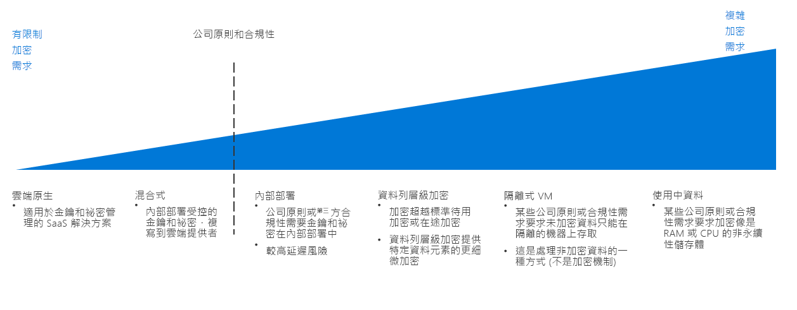

# 加密決策指南Encryption decision guide

將資料加密可防止資料遭到未經授權存取。Encrypting data protects it against unauthorized access. 正確實作的加密原則能夠為雲端式工作負載提供額外的安全性，並抵禦來自組織和網路內外的攻擊者與其他未經授權的使用者。Properly implemented encryption policy provides additional layers of security for your cloud-based workloads and guards against attackers and other unauthorized users from both inside and outside your organization and networks.

雖然通常都會需要將資源加密，但加密也確實需要付出一些代價，例如可能會增加延遲和整體資源使用量。While encrypting resources is generally desirable, encryption does have costs that can increase latency and overall resource usage. 對於需要大量資源的工作負載，在加密與效能之間取得適當的平衡點是必要的。For demanding workloads, striking the correct balance between encryption and performance is essential.

跳至：[金鑰管理](#key-management) | [資料加密](#data-encryption) | [進一步瞭解](#learn-more)Jump to: [Key management](#key-management) | [Data encryption](#data-encryption) | [Learn more](#learn-more)

判斷雲端加密策略時的轉折點重點在於公司政策和合規性要求。The inflection point when determining a cloud encryption strategy focuses on corporate policy and compliance mandates.

有多種方式可以在不同成本和複雜度的情況下於雲端環境實作加密。There are multiple ways to implement encryption in a cloud environment, with varying cost and complexity. 公司政策和第三方合規性是規劃加密策略時最重要的考量事項。Corporate policy and third-party compliance are the biggest drivers when planning an encryption strategy. 大部分的雲端解決方案都能提供標準加密機制，以加密待用或傳輸中的資料。Most cloud-based solutions provide standard mechanisms for encrypting data, whether at rest or in transit. 但是對於要求更嚴格控制的政策與合規性需求 (例如標準化的祕密和金鑰管理、使用中的加密，或資料特定加密)，您可能需要實作複雜的解決方案。However, for policies and compliance requirements that demand tighter controls, such as standardized secrets and key management, encryption in-use, or data specific encryption, you will likely need to implement a complex solution.

## 金鑰管理Key management

最新的金鑰管理系統應支援使用硬體安全模組 (HSM) 儲存金鑰，以加強保護金鑰。Modern key management systems should offer support for storing keys using hardware security modules (HSMs) for increased protection. 因此組織必須擁有金鑰管理系統，以具備建立及儲存加密金鑰、重要密碼、連線字串，以及其他 IT 機密資訊的能力。Thus, a key management system is critical to your organization's ability to create and store cryptographic keys, important passwords, connection strings, and other IT confidential information.

規劃雲端移轉作業時，以下表格說明儲存及管理加密金鑰、憑證和秘密的方式，這對於建立安全和可管理雲端部署而言至關重要：When planning a cloud migration, the following table describes how you can store and manage encryption keys, certificates, and secrets, which are critical for creating secure and manageable cloud deployments:

| 問題Question | 雲端原生Cloud Native | 混合式Hybrid | 內部部署On-premises |
|---------------------------------------------------------------------------------------------------------------------------------------|--------------|--------|-------------|
| 您的組織是否缺乏集中管理金鑰和祕密的能力？Does your organization lack centralized key and secret management?                                                                    | yesYes          | 否No     | 否No          |
| 您是否需要制訂規則，以限制建立可同時在內部部署硬體裝置和雲端使用的金鑰和秘密？Will you need to limit the creation of keys and secrets to devices to your on-premises hardware, while using these keys in the cloud? | 否No           | yesYes    | 否No          |
| 您的組織是否已制訂規則或原則以防止在異地儲存金鑰和祕密？Does your organization have rules or policies in place that would prevent keys and secrets from being stored offsite?                | 否No           | 否No     | yesYes         |

### 雲端原生Cloud native

具備雲端原生金鑰管理能力之後，就能在雲端保存庫中產生、管理及儲存所有金鑰和祕密。With cloud native key management, all keys and secrets are generated, managed, and stored in a cloud-based vault. 此方法可簡化許多和金鑰管理有關的 IT 工作。This approach simplifies many IT tasks related to key management.

雲端原生金鑰管理假設事項：使用雲端原生金鑰管理系統時會假設以下事項：Cloud native key management assumptions: Using a cloud native key management system assumes the following:

- 您信任並使用雲端金鑰管理解決方案建立、管理及裝載您組織的密與金鑰。You trust the cloud key management solution with creating, managing, and hosting your organization's secrets and keys.
- 您允許需要存取加密服務或秘密的所有內部部署應用程式和服務存取雲端金鑰管理系統。You enable all on-premises applications and services that rely on accessing encryption services or secrets to access the cloud key management system.

### 混合式 (攜帶您自己的金鑰)Hybrid (bring your own key)

採用「攜帶您自己的金鑰」方法時，您可以在內部部署環境內的專用 HSM 硬體上產生金鑰，然後將金鑰傳輸到安全的雲端金鑰管理系統以和雲端資源搭配使用。With a bring-your-own-key approach, you generate keys on dedicated HSM hardware within your on-premises environment, then transfer the keys to a secure cloud key management system for use with cloud resources.

混合式金鑰管理假設事項：使用混合式金鑰管理系統時會假設以下事項：Hybrid key management assumptions: Using a hybrid key management system assumes the following:

- 您信任並採用雲端平台的基礎安全性和存取控制基礎結構裝載及使用您的金鑰和祕密。You trust the underlying security and access control infrastructure of the cloud platform for hosting and using your keys and secrets.
- 您因為法規或管理原則的限制，必須在內部部署系統中建立及管理組織的秘密和金鑰。You are required by regulatory or organizational policy to keep the creation and management of your organization's secrets and keys on-premises.

### 內部部署 (保存您自己的金鑰)On-premises (hold your own key)

在某些情況下，您可能會因為法規、原則技術原因的限制，而無法將金鑰儲存在公用雲端服務所提供的金鑰管理系統中。In certain scenarios, there may be regulatory, policy, or technical reasons why you can't store keys on a key management system provided by a public cloud service. 在這些情況下，您必須使用內部部署硬體維護金鑰，並佈建機制以允許雲端資源針對加密用途存取這些金鑰。In these cases, you must maintain keys using on-premises hardware, and provision a mechanism to allow cloud-based resource to access these keys for encryption purposes. 請注意，保留您自己金鑰的方法可能並未與所有雲端服務相容。Note that a hold your own key approach may not be compatible with all cloud services.

內部部署金鑰管理假設事項：使用內部部署金鑰管理系統時會假設以下事項：On-premises key management assumptions: Using an on-premises key management system assumes the following:

- 您因為法規或管理原則的限制，必須在內部部署系統中建立、管理及裝載組織的秘密和金鑰。You are required by regulatory or organizational policy to keep the creation, management, and hosting of your organization's secrets and keys on-premises.
- 需要存取加密服務或秘密的任何雲端應用程式或服務都能存取內部部署金鑰管理系統。Any cloud-based applications or services that rely on accessing encryption services or secrets can access the on-premises key management system.

## 資料加密Data encryption

規劃加密原則時，有幾個不同的資料狀態需考量不同的加密需求：There are several different states of data with different encryption needs to consider when planning your encryption policy:

| 資料狀態Data state | 資料Data |
|-----|-----|
| 資料傳輸中Data in transit | 內部網路流量、網際網路連線、資料中心或虛擬網路之間的連線Internal network traffic, internet connections, connections between datacenters or virtual networks |
| 待用資料Data at rest    | 資料庫、檔案、虛擬磁碟機、PaaS 儲存體Databases, files, virtual drives, PaaS storage |
| 資料使用中Data in use     | 資料已載入至 RAM 或 CPU 快取中Data loaded in RAM or in CPU caches |

### 資料傳輸中Data in transit

資料傳輸中代表資料正在內部資源之間、在資料中心或外部網路之間，或在網際網路上移動。Data in transit is data moving between resources on the internal, between datacenters or external networks, or over the internet.

傳輸中資料的加密工作通常是透過要求針對流量使用 SSL/TLS 通訊協定來完成。Encrypting data in transit is usually done by requiring SSL/TLS protocols for traffic. 雲端裝載資源之間傳輸到外部網路或公用網際網路的流量應一律加密。Traffic transiting between your cloud-hosted resources to external network or the public internet should always be encrypted. PaaS 資源通常也會預設對流量強制進行 SSL/TLS 加密。PaaS resources generally also enforce SSL/TLS encryption to traffic by default. 我們建議雲端採用小組和工作負載擁有者，將虛擬網路內部所裝載 IaaS 資源之間的流量強制加密。Whether you enforce encryption for traffic between IaaS resources hosted inside your virtual networks is a decision for your Cloud Adoption Team and workload owner and is generally recommended.

**加密傳輸中資料時的假設事項**。**Encrypting data in transit assumptions**. 實作傳輸中資料的適當加密原則時會假設以下事項：Implementing proper encryption policy for data in transit assumes the following:

- 您雲端環境中所有可公開存取的端點都將使用 SSL/TLS 通訊協定與公用網際網路通訊。All publicly accessible endpoints in your cloud environment will communicate with the public internet using SSL/TLS protocols.
- 透過公用網際網路連線雲端網路與內部部署或其他外部網路時，會使用加密的 VPN 通訊協定。When connecting cloud networks with on-premises or other external network over the public internet, use encrypted VPN protocols.
- 使用專用 WAN 連線 (例如 ExpressRoute) 連線雲端網路與內部部署或其他外部網路時，您會將 VPN 或內部部署的其他加密設備，與雲端網路中部署的相對應虛擬 VPN 或加密設備搭配使用。When connecting cloud networks with on-premises or other external network using a dedicated WAN connection such as ExpressRoute, you will use a VPN or other encryption appliance on-premises paired with a corresponding virtual VPN or encryption appliance deployed to your cloud network.
- 如果您有機密資料不應包含在 IT 人員可檢視的流量記錄或其他診斷報告中，您會將虛擬網路中資源之間的所有流量加密。If you have sensitive data that shouldn't be included in traffic logs or other diagnostics reports visible to IT staff, you will encrypt all traffic between resources in your virtual network.

### 待用資料Data at rest

待用資料代表目前未移動或處理的任額資料，包括檔案、資料庫、虛擬機器磁碟機、PaaS 儲存體帳戶，或類似的資產。Data at rest represents any data not being actively moved or processed, including files, databases, virtual machine drives, PaaS storage accounts, or similar assets. 加密儲存的資料可保護虛擬裝置或檔案，避免遭到外部網路入侵、惡意的內部使用者，或意外發布之類的未經授權存取。Encrypting stored data protects virtual devices or files against unauthorized access either from external network penetration, rogue internal users, or accidental releases.

PaaS 儲存體與資料庫資源通常會預設強制加密。PaaS storage and database resources generally enforce encryption by default. IaaS 虛擬資源可以運用儲存在您金鑰管理系統中的密碼編譯金鑰，透過虛擬磁碟加密方式加以保護。IaaS virtual resources can be secured through virtual disk encryption using cryptographic keys stored in your key management system.

將待用資料加密也涉及更高階的資料庫加密技術，例如資料行層級和資料列層級加密，這可以讓您更準確地控制那些資料需受到保護。Encryption for data at rest also encompasses more advanced database encryption techniques, such as column-level and row level encryption, which provides much more control over exactly what data is being secured.

您的整體原則和合規性需求、所儲存資料的機密度，以及工作負載的效能需求，應該會決定哪些資產需要加密。Your overall policy and compliance requirements, the sensitivity of the data being stored, and the performance requirements of your workloads should determine which assets require encryption.

**加密待用資料時的假設事項**。**Encrypting Data at Rest Assumptions**. 加密待用資料時會假設以下事項：Encrypting data at rest assumes the following:

- 您儲存的資料並不是提供給公眾使用的資料。You are storing data that is not meant for public consumption.
- 您的工作負載可以接受因磁碟加密而增加的延遲成本。Your workloads can accept the added latency cost of disk encryption.

### 資料使用中Data in use

加密使用中的資料涉及保護非永久性儲存體 (例如 RAM 或 CPU 快取) 中的資料。Encryption for data in use involves securing data in nonpersistent storage, such as RAM or CPU caches. 使用像是完整記憶體加密和記憶體保護區技術 (例如 Intel 的安全防護擴充功能 (SGX)) 這樣的技術。Use of technologies such as full memory encryption, enclave technologies, such as Intel's Secure Guard Extensions (SGX). 這也包括密碼編譯技術，例如可用來建立安全、受信任執行環境的同態加密技術。This also includes cryptographic techniques, such as homomorphic encryption that can be used to create secure, trusted execution environments.

**加密使用中資料時的假設事項**。**Encrypting data in use assumptions**. 加密使用中資料時會假設以下事項：Encrypting data in use assumes the following:

- 您隨時都需要個別維護資料擁有權與基礎雲端平台，即使在 RAM 與 CPU 層級也一樣。You are required to maintain data ownership separate from the underlying cloud platform at all times, even at the RAM and CPU level.

## 深入了解Learn more

如需 Azure 平台中加密和金鑰管理的相關詳細資訊，請參閱下列各項。See the following for more information about encryption and key management in the Azure platform.

- [Azure 加密概觀](/azure/security/security-azure-encryption-overview)。[Azure encryption overview](/azure/security/security-azure-encryption-overview). Azure 如何使用加密來保護待用和傳輸中資料的詳細描述。A detailed description of how Azure uses encryption to secure both data at rest and data in transit.
- [Azure Key Vault](/azure/key-vault/key-vault-overview)。[Azure Key Vault](/azure/key-vault/key-vault-overview). 金鑰保存庫是 Azure 內儲存及管理密碼編譯金鑰、祕密和憑證的主要金鑰管理系統。Key Vault is the primary key management system for storing and managing cryptographic keys, secrets, and certificates within Azure.
- [Azure 中的機密運算](/solutions/confidential-compute)。[Confidential computing in Azure](/solutions/confidential-compute). Azure 的機密運算方案提供了工具和技術，用來建立受信任的執行環境或其他加密機制，以保護使用中的資料。Azure's confidential computing initiative provides tools and technology to create trusted execution environments or other encryption mechanisms to secure data in use.

## 後續步驟Next steps

了解軟體定義網路如何提供用於雲端部署的虛擬化網路功能。Learn how Software Defined Networks provide virtualized networking capabilities for cloud deployments.

> [!div class="nextstepaction"]
> [哪一個軟體定義網路模式最適合我的部署？Which Software Defined Network pattern is best for my deployment?](../software-defined-network/overview.md)
