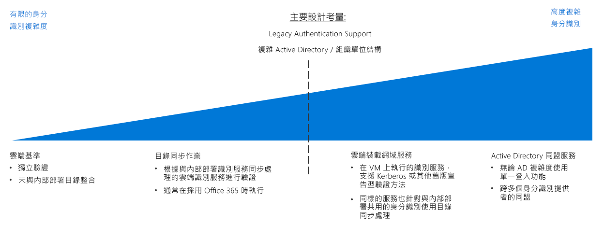

# 身分識別決策指南

在任何環境中，不論是內部部署、混合式，或僅限雲端，IT 都必須控制哪些系統管理員、使用者和群組擁有資源存取權。 身分識別和存取管理 (IAM) 服務可讓您管理雲端中的存取控制。

跳至：[判斷身分識別整合需求](#determine-identity-integration-requirements) | [雲端原生](#cloud-baseline) | [目錄同步作業](#directory-synchronization) | [雲端託管網域服務](#cloud-hosted-domain-services) | [Active Directory 同盟服務](#active-directory-federation-services) | [不斷演進的身分識別整合](#evolving-identity-integration) | [深入了解](#learn-more)

在雲端環境中，有幾種方式可以管理身分識別，其成本和複雜度各有不同。 建構雲端式身分識別服務時，內部部署身分識別現有的基礎結構所需要的整合層級即是關鍵因素之一。

雲端式軟體即服務 (SaaS) 身分識別解決方案提供雲端資源基本層級的存取控制和身分識別管理。 但是，若您組織的 Active Directory (AD) 基礎結構具有複雜樹系結構或自訂組織單位 (OU)，您的雲端式工作負載可能需要將目錄複寫至雲端，以維持一組內部部署和雲端環境之間一致的身分識別、群組和角色。 如果全域解決方案需要目錄複寫，則複雜度可能會大幅增加。 此外，若要支援那些相依於舊版驗證機制的應用程式，則可能需要在雲端中部署網域服務。

## 判斷身分識別整合需求

| 問題 | 雲端基準 | 目錄同步作業 | 雲端託管網域服務 | AD 同盟服務 |
|------|------|------|------|------|
| 您目前是否沒有內部部署目錄服務？ | yes | 否 | 否 | 否 |
| 您的工作負載需要對內部部署身分識別服務進行驗證嗎？ | 否 | yes | 否 | 否 |
| 您的工作負載相依於 Kerberos 或 NTLM 等舊版驗證機制嗎？ | 否 | 否 | yes | 否 |
| 無法整合雲端和內部部署身分識別服務嗎？ | 否 | 否 | yes | 否 |
| 您是否需要跨多個身分識別提供者的單一登入？ | 否 | 否 | 否 | yes |

在規劃移轉至 Azure 時，您將需要判斷如何以最佳方式整合現有的身分識別管理及雲端身分識別服務。 下列為常見整合案例。

### 雲端基準

公用雲端平台提供原生的 IAM 系統，為使用者和群組授與管理功能的存取權。 如果您的組織缺乏重要內部部署身分識別解決方案，而您規劃要移轉工作負載，使其與雲端式驗證機制相容，則您應使用雲端原生的身分識別服務建立身分識別基礎結構。

**雲端基準假設**。 使用純雲端原生身分識別基礎結構的假設如下：

- 您的雲端式資源將不會相依於內部部署目錄服務或 Active Directory 伺服器，或可修改工作負載以移除這些相依性。
- 所移轉應用程式或服務工作負載可支援相容於雲端身分識別提供者的驗證機制，或可輕易修改以提供支援。 雲端原生身分識別提供者仰賴網路就緒的驗證機制，例如 SAML、OAuth 和 OpenID Connect。 相依於舊版驗證方法 (使用 Kerberos 或 NTLM 等協定) 的現有工作負載可能必須先重構才能移轉至雲端。

> [!TIP]
> 大部分的雲端原生身分識別服務無法完整取代傳統內部部署目錄。 如果沒有使用額外工具或服務，電腦管理或群組原則等目錄功能可能無法使用。

將身分識別服務完全移轉至雲端式提供者後，您便無需維護自己的身分識別基礎結構，可大幅簡化 IT 管理。

### 目錄同步作業

對於具有現有身分識別基礎結構的組織，目錄同步作業通常是保留現有使用者和存取管理的最佳解決方案，同時可提供所需的 IAM 功能來管理雲端資源。 此程序會持續複寫雲端和內部部署環境之間的目錄資訊，允許使用者使用單一登入 (SSO)，並在整個組織內使用一致的身分識別、角色和權限系統。

注意：採用 Office 365 的組織可能已經在內部部署 Active Directory 基礎結構和 Azure Active Directory 之間實作[目錄同步作業](/office365/enterprise/set-up-directory-synchronization)。

**目錄同步作業假設**。 使用同步處理身分識別解決方案的假設如下：

- 您需要在雲端和內部部署 IT 基礎結構中維持一組通用的使用者帳戶和群組。
- 您的內部部署身分識別服務支援雲端身分識別提供者複寫。
- 您需要為同時存取雲端和內部部署身分識別提供者的使用者提供 SSO 機制。

> [!TIP]
> 任何相依於舊版驗證機制 (不受 Azure AD 等雲端式身分識別服務支援) 的雲端式工作負載仍將需要連線至提供這些服務的內部部署網域服務或雲端環境中的虛擬伺服器。 使用內部部署身分識別服務也會導入雲端和內部部署網路之間的連線相依性。

### 雲端託管網域服務

如果您有工作負載相依於使用 Kerberos 或 NTLM 等舊版通訊協定的宣告式驗證，而這些工作負載無法重構以接受 SAML、OAuth 或 OpenID Connect 等新式驗證通訊協定，您可能需要將部分網域服務移轉至雲端作為雲端部署的一部分。

此類型部署涉及在雲端式虛擬網路中部署執行 Active Directory 的虛擬機器，以提供網域服務給雲端中的資源。 任何移轉至雲端網路的現有應用程式和服務應在稍加修改後可使用這些雲端託管目錄伺服器。

您現有的目錄和網域服務很可能會在內部部署環境中繼續使用。 在此案例中，建議您也使用目錄同步作業，在雲端和內部部署環境中提供一組通用的使用者和角色。

**雲端託管網域服務假設**。 執行目錄移轉的假設如下：

- 您的工作負載相依於使用 Kerberos 或 NTLM 等通訊協定的宣告式驗證。
- 您的工作負載虛擬機器必須已加入網域，供 Active Directory 群組原則作為管理或應用用途。

> [!TIP]
> 在移轉現有工作負載時，雖然搭配雲端託管網域服務的目錄移轉提供絶佳彈性，但在雲端虛擬網路中裝載虛擬機器以提供這些服務必然會提升 IT 管理工作的複雜度。 隨著您的雲端移轉體驗日趨成熟，請檢查裝載這些伺服器的長期維護需求。 考量重構現有工作負載來與 Azure Active Directory 等雲端身分識別提供者相容是否可降低這些雲端託管伺服器的需求。

### Active Directory Federation Services

身分識別同盟會在多個身分識別管理系統中建立信任關係，以允許通用的驗證和授權功能。 之後，您就能在自己的組織內，或者由您的客戶與商務夥伴所管理的身分識別系統中，跨網域地支援單一登入功能。

Azure AD 支援使用 [Active Directory 同盟服務](/azure/active-directory/hybrid/how-to-connect-fed-whatis) (AD FS) 的內部部署 Active Directory 網域同盟。 參閱[將 AD FS 擴充至 Azure](../../../reference-architectures/identity/adfs.md) 此參考架構，查看其可以如何在 Azure 中實作。

## 不斷演進的身分識別整合

身分識別整合是一種反覆程序。 開始使用雲端原生解決方案時，您可以使用一小組的使用者和對應角色作為初始部署。 隨著移轉成熟，請考慮採用同盟模型，或將您的內部部署身分識別服務目錄完整移轉至雲端。 再次瀏覽移轉程序中每個反覆項目的身分識別策略。

## 深入了解

如需 Azure 平台中身分識別服務的詳細資訊，請參閱下列各項。

- [Azure AD](https://azure.microsoft.com/services/active-directory)。 Azure AD 提供雲端式身分識別服務。 讓您管理對於 Azure 資源的存取並控制身分識別管理、裝置註冊、使用者佈建、應用程式存取控制和資料保護。
- [Azure AD Connect](/azure/active-directory/hybrid/whatis-hybrid-identity)。 Azure AD Connect 工具可讓您將 Azure AD 執行個體與現有身分識別管理解決方案連線，以允許雲端中現有目錄的同步作業。
- [角色型存取控制](/azure/role-based-access-control/overview) (RBAC)。 Azure AD 提供 RBAC，可有效率且安全地管理在管理平面中的資源存取權。 工作和責任會組織成角色，然後使用者會被指派到這些角色。 RBAC 可讓您控制誰對於資源擁有存取權，以及使用者可以在該資源上執行哪些動作。
- [Azure AD Privileged Identity Management](/azure/active-directory/privileged-identity-management/pim-configure) (PIM)。 PIM 會降低資源存取權限的曝光時間，並透過報告和警示提升他們使用的可見度。 也會限制使用者在 Just-In-Time (JIT) 狀態下行使其權限，或指派持續時間較短的權限，並在時間到達之後自動撤銷該權限。
- [整合內部部署 Active Directory 網域與 Azure Active Directory](../../../reference-architectures/identity/azure-ad.md)。 此參考架構提供內部部署 Active Directory 網域和 Azure AD 之間的目錄同步作業範例。
- [將 Active Directory Domain Services (AD DS) 擴充至 Azure。](../../../reference-architectures/identity/adds-extend-domain.md) 此參考架構提供部署 AD DS 伺服器以擴充網域服務至雲端式資源的範例。
- [將 Active Directory 同盟服務 (AD FS) 擴充至 Azure](../../../reference-architectures/identity/adfs.md)。 此參考架構設定 Active Directory 同盟服務 (AD FS) 以執行同盟驗證和 Azure AD 目錄授權。

## 後續步驟

了解如何實作雲端中的原則強制執行。

> [!div class="nextstepaction"]
> [原則強制執行](../policy-enforcement/overview.md)
