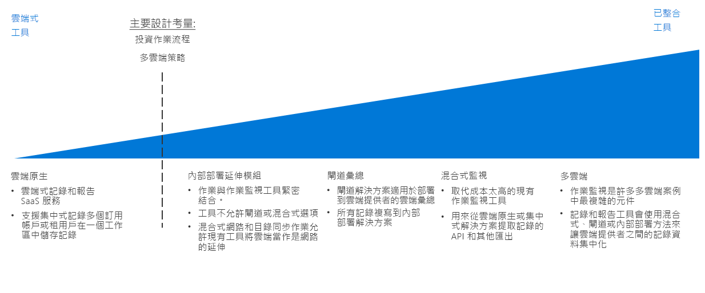

# 記錄與報告決策指南Logging and reporting decision guide

所有組織都需要通知機制，以在效能、運作時間與安全性產生疑慮時通知 IT 小組，避免疑慮變成嚴重的問題。All organizations need mechanisms for notifying IT teams of performance, uptime, and security issues before they become serious problems. 成功的監視策略可讓您了解工作負載和網路基礎結構個別構成元件的執行狀況。A successful monitoring strategy allows you to understand how the individual components that make up your workloads and networking infrastructure are performing. 在公用雲端移轉的情況下，將記錄和報告與任何現有的監視系統整合，同時向正確的 IT 人員呈現適當的重要事件和度量至關重要，因為這可以確保您的組織符合運作時間、安全性和原則合規性目標。Within the context of a public cloud migration, integrating logging and reporting with any of your existing monitoring systems, while surfacing important events and metrics to the appropriate IT staff, is critical in ensuring your organization is meeting uptime, security, and policy compliance goals.

跳至：[規劃監視基礎結構](#planning-your-monitoring-infrastructure) | [雲端原生](#cloud-native) | [內部部署擴充](#on-premises-extension) | [閘道彙總](#gateway-aggregation)  | [混合式監視 (內部部署)](#hybrid-monitoring-on-premises) | [混合式監視 (雲端式)](#hybrid-monitoring-cloud-based) | [多重雲端](#multi-cloud) | [進一步瞭解](#learn-more)Jump to: [Planning your monitoring infrastructure](#planning-your-monitoring-infrastructure) | [Cloud native](#cloud-native) | [On-premises extension](#on-premises-extension) | [Gateway aggregation](#gateway-aggregation) | [Hybrid monitoring (on-premises)](#hybrid-monitoring-on-premises) | [Hybrid monitoring (cloud-based)](#hybrid-monitoring-cloud-based) | [Multi-cloud](#multi-cloud) | [Learn more](#learn-more)

判斷雲端身分識別策略時，關鍵點主要是依據您的組織在作業流程上所做的現有投資，以及對多重雲端策略在某種程度上的支援需求。The inflection point when determining a cloud identity strategy is based primarily on existing investments your organization has made in operational processes, and to some degree any requirements you have to support a multi-cloud strategy.

有多種方式可用於記錄和報告雲端活動。There are multiple ways to log and report on activities in the cloud. 雲端原生和集中式記錄是運用訂用帳戶設計和訂用帳戶數目的兩個常見軟體即服務 (SaaS) 選項。Cloud native and centralized logging are two common software as a service (SaaS) options that are driven by the subscription design and the number of subscriptions.

## 規劃監視基礎結構Planning your monitoring infrastructure

規劃部署時，需考量記錄資料儲存位置，以及如何將雲端式報告和監視服務與現有的處理程序和工具整合。When planning your deployment, you need to consider where logging data is stored and how you will integrate cloud-based reporting and monitoring services with your existing processes and tools.

| 問題Question | 雲端原生Cloud native | 內部部署擴充功能On-premises extension | 混合式監視Hybrid monitoring | 閘道彙總Gateway aggregation |
|-----|-----|-----|-----|-----|
| 您已經擁有內部部署監視基礎結構嗎？Do you have an existing on-premises monitoring infrastructure? | 否No | yesYes | 是Yes |  否No |
| 您有避免將記錄資料儲存在外部儲存位置的需求嗎？Do you have requirements preventing storage of log data on external storage locations? | 否No | yesYes | 否No | 否No |
| 您需要整合雲端監視與內部部署系統嗎？Do you need to integrate cloud monitoring with on-premises systems? | 否No | 否No | yesYes | 否No |
您需要先處理或篩選遙測資料再將它們提交至監視系統嗎？Do you need to process or filter telemetry data before submitting it to your monitoring systems? | 否No | 否No | 否No | yesYes |

### 雲端原生Cloud native

如果您的組織目前尚未建置記錄和報告系統，或您規劃的雲端部署不需要與現有內部部署或其他外部監視系統整合，雲端原生 SaaS 解決方案就是您最簡單的選擇。If your organization currently lacks established logging and reporting systems, or if your planned cloud deployment does not need to be integrated with existing on-premises or other external monitoring systems, a cloud native SaaS solution is the simplest choice.

在此案例中，記錄資料的記錄和儲存作業都是在與您工作負載相同的雲端環境中執行，處理資訊並向 IT 人員呈現資訊的記錄和報告工具則是由雲端平台提供。In this scenario, log data is recorded and stored in the same cloud environment as your workload, while the logging and reporting tools that process and surface information to IT staff are offered as part of the cloud platform.

雲端原生記錄解決方案可以依據較小型或實驗性部署的訂用帳戶或工作負載進行實作，並以集中方式安排組織，以監控整個雲環境的記錄資料。Cloud native logging solutions can be implemented ad hoc per subscription or workload for smaller or experimental deployments and are organized in a centralized manner to monitor log data across your entire cloud estate.

**雲端原生假設事項**。**Cloud native assumptions**. 使用雲端原生記錄和報告系統時會假設以下事項：Using a cloud native logging and reporting system assumes the following:

- 您不需要將記錄資料從雲端工作負載整合到現有的內部部署系統中。You do not need to integrate the log data from you cloud workloads into existing on-premises systems.
- 您將不會使用雲端式報告系統監視內部部署系統。You will not be using your cloud-based reporting systems to monitor on-premises systems.

### 內部部署擴充功能On-premises extension

在需要將雲端遙測資料與內部部署系統整合的情況下，無論是內部部署系統不支援混合式記錄和報告，或支援在進行最少開發作業情況下移轉應用程式和服務的，都必須在 VM 中部署會將記錄資料直接傳送至您的內部部署系統，而不是將資料儲存在雲端環境中的代理程式。In scenarios where you need to integrate cloud telemetry with on-premises systems that do not support hybrid logging and reporting, or support the migration of applications and services with a minimum amount of redevelopment, you will need to deploy monitoring agents to VMs that will send log data directly to your on-premises systems, rather than storing it in the cloud environment.

為了支援這種方法，您的雲端資源必須能夠透過結合[混合式網路功能](../software-defined-network/hybrid.md)和[雲端裝載網域服務](../identity/overview.md#cloud-hosted-domain-services)，直接與您的內部部署系統通訊。In order to support this approach, your cloud resources will need to be able to communicate directly with your on-premises systems through a combination of [hybrid networking](../software-defined-network/hybrid.md) and [cloud hosted domain services](../identity/overview.md#cloud-hosted-domain-services). 然後雲端虛擬網路才能以內部部署環境網路擴充功能的形式運作。With this in place, the cloud virtual network functions as a network extension of the on-premises environment. 如此一來，雲端裝載工作負載才能直接與您的內部部署記錄和報告系統通訊。Therefore, cloud hosted workloads can communicate directly with your on-premises logging and reporting system.

這個方法會運用您在監控工具上的現有投資，對任何雲端部署的應用程序或服務進行有限的修改。This approach capitalizes on your existing investment in monitoring tooling with limited modification to any cloud-deployed applications or services. 這通常進行移植移轉時支援監視的最快方法。This is often the fastest approach to support monitoring during a lift-and-shift migration. 但是這不會擷取雲端 PaaS 和 SaaS 資源製造的記錄資料，而且將會省略雲端平台產生的任何 VM 相關記錄，例如 VM 狀態。However, it won’t capture log data produced by cloud-based PaaS and SaaS resources, and it will omit any VM-related logs generated by the cloud platform itself such as VM status. 因此應將此模式視為實作更完善混合式監視解決方案之前的暫時性解決方案。As a result, this pattern should be a temporary solution until a more comprehensive hybrid monitoring solution is implemented.

僅限內部部署的假設事項：On-premises only assumptions:

- 您只需要在內部部署環境中維護記錄資料 (基於支援技術需求或法規或原則需求)。You need to maintain log data only in your on-premises environment only, either in support of technical requirements or due to regulatory or policy requirements.
- 您的內務部署系統不支援混合式記錄和報告或閘道彙總解決方案。Your on-premises systems do not support hybrid logging and reporting or gateway aggregation solutions.
- 您的雲端式應用程式可以直接向內部記錄系統提交遙測資料，或向內部部署系統提交遙測資料的監視代理程式可以部署至工作負載 VM。Your cloud-based applications can submit telemetry directly to your on-premises logging systems or monitoring agents that submit to on-premises can be deployed to workload VMs.
- 您的工作負載無須依賴需要雲端式記錄和報告的 PaaS 或 SaaS 服務。Your workloads are not dependent on PaaS or SaaS services that require cloud-based logging and reporting.

### 閘道彙總Gateway aggregation

對於雲端遙測資料量很大，或現有內部部署監視系統需要先修改記錄資料才能加以處理的案例，可能就需要記錄資料[閘道彙總](../../../patterns/gateway-aggregation.md)服務。For scenarios where the amount of cloud-based telemetry data is very large or existing on-premises monitoring systems need log data modified before it can be processed, a log data [gateway aggregation](../../../patterns/gateway-aggregation.md) service may be required.

閘道服務會部署至您的雲端提供者。A gateway service is deployed to your cloud provider. 然後將相關應用程式和服務設定為提交遙測資料給閘道，而不是提交給預設的記錄系統。Then, relevant applications and services are configured to submit telemetry data to the gateway instead of a default logging system. 接著閘道可以處理資料 (彙總、結合或設定資料格式)，然後再將資料提交給您的監視服務以進行擷取及分析。The gateway can then process the data: aggregating, combining, or otherwise formatting it before then submitting it to your monitoring service for ingestion and analysis.

此外，閘道也可以用來彙總及預先處理要提交給雲端或混合式系統的遙測資料。Also, a gateway can be used to aggregate and preprocess telemetry data bound for cloud-native or hybrid systems.

閘道彙總假設事項：Gateway aggregation assumptions:

- 您預期您的雲端式應用程式或服務將會產生大量遙測資料。You expect very high levels of telemetry data from your cloud-based applications or services.
- 您需要先設定遙測資料格式或將資料最佳化，才能將它們提交給監視系統。You need to format or otherwise optimize telemetry data before submitting it to your monitoring systems.
- 您的監視系統具備可用來擷取閘道處理後的記錄資料的 API 或其他機制。Your monitoring systems have APIs or other mechanisms available to ingest log data after processing by the gateway.

### 混合式監視 (內部部署)Hybrid monitoring (on-premises)

混合式監視解決方案可結合來自內部部署和雲端資源的記錄資料，以提供 IT 資產運作狀態的整合式檢視。A hybrid monitoring solution combines log data from both your on-premises and cloud resources to provide an integrated view into your IT estate's operational status.

如果您已經投資並擁有取代難度高或取代代價高昂的內部部署監視系統，就可能需要將來自雲端工作負載的遙測資料整合到現有的內部部署監視解決方案。If you have an existing investment in on-premises monitoring systems that would be difficult or costly to replace, you may need to integrate the telemetry from your cloud workloads into preexisting on-premises monitoring solutions. 在混合式內部部署監視系統中，內部部署遙測資料會繼續使用現有的內部部署監視系統。In a hybrid on-premises monitoring system, on-premises telemetry data continues to use the existing on-premises monitoring system. 雲端遙測資料則會直接傳送至雲端監視系統，或者與您的工作負載一起儲存在雲端，然後定期經過編譯並擷取到內部部署系統中。Cloud-based telemetry data is either sent to the cloud monitoring system directly, or the data is stored on the cloud alongside your workloads and then compiled and ingested into the on-premises system at regular intervals.

**內部部署混合式監視假設事項**。**On-premises hybrid monitoring assumptions**. 使用內部部署記錄和報告系統以進行混合式監視時會假設以下事項：Using an on-premises logging and reporting system for hybrid monitoring assumes the following:

- 您需要使用現有的內部部署報告系統監視雲端工作負載。You need to use existing on-premises reporting systems to monitor cloud workloads.
- 您需要維護記錄資料內部部署的擁有權。You need to maintain ownership of log data on-premises.
- 您的內部部署管理系統具備可用來從雲端系統擷取記錄資料的 API 或其他機制。Your on-premises management systems have APIs or other mechanisms available to ingest log data from cloud-based systems.

> [!TIP]
> 由於雲端移轉具有反覆性，因此可能會從不同的雲端原生和內部部署監視轉換成部分混合式方法。As part of the iterative nature of cloud migration, transitioning from distinct cloud-native and on-premises monitoring to a partial hybrid approach is likely. 請務必保留變更到您的監視結構與整體 IT 和作業程序。請務必根據整體 IT 和作業流程對監視基礎結構持續進行更改。Make sure to keep changes to your monitoring architecture in line with your overall IT and operational processes.

### 混合式監視 (雲端式)Hybrid monitoring (cloud-based)

如果您沒有需維護內部部署監視系統的迫切需求，或想要以 SaaS 解決方案取代內部部署監視系統，您也可以選擇整合內部部署記錄資料與集中式雲端監視系統。If you do not have a compelling need to maintain an on-premises monitoring system, or you want to replace on-premises monitoring systems with a SaaS solution, you can also choose to integrate on-premises log data with a centralized cloud-based monitoring system.

鏡像內部部署集中式方式 (在此案例中，雲端工作負載會使用其預設的雲端記錄機制)，與內部部署應用程式和服務會將遙測資料目錄傳送至雲端式記錄系統，或定期彙總該資料以擷取至雲端系統中。Mirroring the on-premises centered approach, in this scenario cloud workloads would use their default cloud logging mechanism, and on-premises applications and services would either send telemetry directory to the cloud-based logging system, or aggregate that data for ingestion into the cloud system at regular intervals. 雲端式監視系統就能作為您整個 IT 資產的主要監視與報告系統。The cloud-based monitoring system would then serve as your primary monitoring and reporting system for your entire IT estate.

雲端混合式監視假設事項：使用雲端式記錄和報告系統以進行混合式監視時會假設以下事項：Cloud-based hybrid monitoring assumptions: Using cloud-based logging and reporting systems for hybrid monitoring assumes the following:

- 您不依賴現有的內部部署監視系統。You are not dependent upon existing on-premises monitoring systems.
- 您的工作負載沒有需將記錄資料儲存在內部部署系統的法規或原則需求。Your workloads do not have regulatory or policy requirements to store log data on-premises.
- 您的雲端式管理系統具備可用來從內部部署應用程式和服務擷取記錄資料的 API 或其他機制。Your cloud-based monitoring systems have APIs or other mechanisms available to ingest log data from on-premises applications and services.

### 多重雲端Multi-cloud

跨多個雲端平台整合記錄和報告功能可能會是非常複雜的工作。Integrating logging and reporting capabilities across a multiple-cloud platform can be complicated. 平台之間提供的服務通常無法直接比較，而且這些服務提供的記錄與遙測功能也不盡相同。Services offered between platforms are often not directly comparable, and logging and telemetry capabilities provided by these services differ as well.
多重雲端記錄支援通常需要先使用閘道服務將記錄資料處理成通用格式，然後再將資料提交給混合式記錄解決方案。Multi-cloud logging support often requires the use of gateway services to process log data into a common format before submitting data to a hybrid logging solution.

## 深入了解Learn more

[Azure 監視器](/azure/azure-monitor/overview)是 Azure 預設的報告和監視服務。[Azure Monitor](/azure/azure-monitor/overview) is the default reporting and monitoring service for Azure. 它提供：It provides:

- 一個統一平台，用來收集應用程式遙測資料、主機遙測資料 (例如 VM)、容器計量、Azure 平台計量，以及事件記錄檔。A unified platform for collecting app telemetry, host telemetry (such as VMs), container metrics, Azure platform metrics, and event logs.
- 視覺效果、查詢、警示和分析工具。Visualization, queries, alerts, and analytical tools. 它可提供虛擬機器、客體作業系統、虛擬網路，以及工作負載應用程式事件的深入解析。It can provide insights into virtual machines, guest operating systems, virtual networks, and workload application events.
- [REST API](/azure/monitoring-and-diagnostics/monitoring-rest-api-walkthrough)，用來與外部服務整合，以及將監視與警示服務自動化[REST APIs](/azure/monitoring-and-diagnostics/monitoring-rest-api-walkthrough) for integration with external services and automation of monitoring and alerting services
- 與許多熱門的第三方廠商[整合](/azure/monitoring-and-diagnostics/monitoring-partners)。[Integration](/azure/monitoring-and-diagnostics/monitoring-partners) with many popular third-party vendors.
