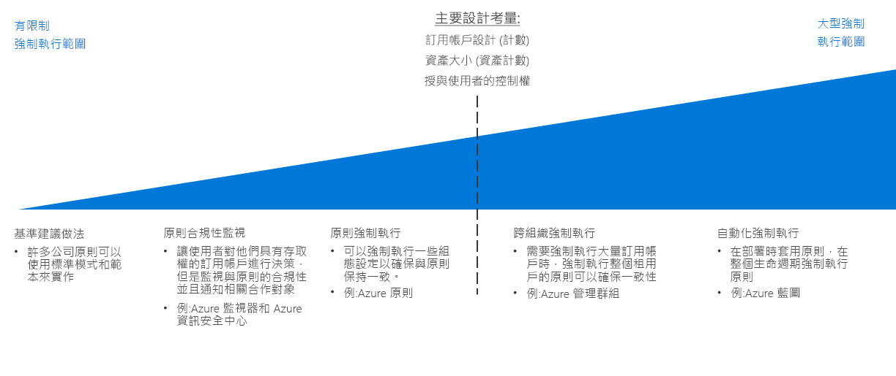

# 原則強制執行決策指南

定義組織原則沒有效率，除非有方法可以在貴組織強制執行。 規劃任何雲端移轉的關鍵層面，是判斷如何最佳地合併雲端平台提供的工具與您的現有 IT 流程，讓您的整個雲端資產原則合規性發揮到極致。

跳至：[基準建議做法](#baseline-recommended-practices) | [原則合規性監視](#policy-compliance-monitoring) | [原則強制執行](#policy-enforcement) | [跨組織原則](#cross-organization-policy) | [自動化強制執行](#automated-enforcement)

隨著您的雲端資產成長，您會面臨到跨更大的資源、訂用帳戶和租用戶陣列維護及強制執行原則的對應需求。 您的資產越大，用來確保一致遵循和快速違規偵測的強制執行機制就越複雜。 資源或訂用帳戶層級的平台提供原則強制執行機制對於較小的雲端配置就已足夠，而較大的部署可能需要利用更複雜的機制，牽涉到部署標準、資源群組和組織，並且讓原則強制執行與您的記錄和報告系統整合。

選擇原則強制執行策略複雜度時的轉捩點，主要著重在您的[訂用帳戶設計](../subscriptions/overview.md)所需的訂用帳戶或租用戶數量。 授與您雲端資產內各個使用者角色的控制數量，可能也會影響這些決策。

## 基準建議做法

針對單一訂用帳戶和簡單雲端部署，可以使用大部分雲端平台的原生功能來強制執行許多公司的原則。 即使這個做法的部署複雜度相對較低，但是一致使用 CAF [決策指南](../overview.md)中所討論的模式，可協助建立基準層級的原則合規性。

例如︰

- [部署範本](../resource-consistency/overview.md)可以佈建具有標準化結構和設定的資源。
- [標記和命名標準](../resource-tagging/overview.md)有助於組織作業，並支援會計和業務需求。
- 流量管理和網路限制可以透過[軟體定義網路](../software-defined-network/overview.md)實作。
- [角色型存取控制](../identity/overview.md)可以保護和隔離您的雲端資源。

透過檢查這些指南通篇討論的標準模式應用程式如何能夠協助符合您的組織需求，開始您的雲端原則強制執行規劃。

## 原則合規性監視

另一個關鍵因素 (即使是相對較小的雲端部署) 是能夠驗證雲端型應用程式和服務遵守組織原則，如果資源變得不相容，立即通知負責的合作對象。 有效地[記錄和報告](../log-and-report/overview.md)您雲端工作負載的合規性狀態，是公司原則強制執行策略中的關鍵部分。

隨著您的雲端資產成長，額外工具 (例如 [Azure 資訊安全中心](/azure/security-center/)) 可以提供整合的安全性和威脅偵測，協助套用集中式原則管理和警示您的內部部署和雲端資產。

## 強制執行原則

您也可以在訂用帳戶層級套用組態設定和資源建立規則，協助確保原則對齊。

[Azure 原則](/azure/governance/policy/overview)是 Azure 服務，用於建立、指派和管理原則。 這些原則會對您的資源強制執行不同的規則和效果，讓這些資源能符合公司標準和服務等級協定的規範。 Azure 原則會評估您的資源是否符合指派的原則。 例如，您可能要限制環境中虛擬機器的 SKU 大小。 實作對應原則之後，會評估新資源和現有資源的合規性。 使用正確的原則，現有的資源就可以合規。

## 跨組織原則

隨著您的雲端資產成長跨越需要強制執行的許多訂用帳戶，您必須將焦點放在整個租用戶的強制執行策略，以確保原則一致性。

您的[訂用帳戶設計](../subscriptions/overview.md)必須考量原則，因為它與您的組織結構相關。 除了協助支援您的訂用帳戶設計內的複雜組織[Azure 管理群組](../subscriptions/overview.md#management-groups)可用來跨多個訂用帳戶指派 Azure 原則規則。

## 自動化強制執行

雖然標準化部署範本在較小規模中有效率，而 [Azure 藍圖](/azure/governance/blueprints/overview)可進行 Azure 解決方案的大規模標準化佈建和部署協調流程。 跨多個訂用帳戶的工作負載可以針對任何已建立的資源，以一致的原則設定進行部署。

針對整合雲端與內部部署資源的 IT 環境，您需要使用記錄和報告系統來提供混合式監視功能。 您的第三方或自訂作業監視系統可能會提供額外的原則強制執行功能。 針對複雜的雲端資產，請考量如何最佳地整合這些系統與雲端資產。

## 後續步驟

深入了解如何使用資源一致性來組織及標準化雲端部署，支援訂用帳戶設計和治理目標。

> [!div class="nextstepaction"]
> [資源一致性](../resource-consistency/overview.md)
