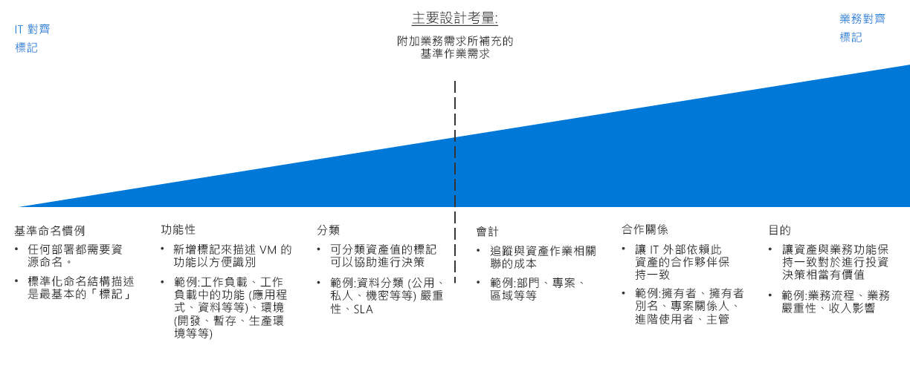

# 資源組織與標記決策指南

組織雲端式資源是 IT 最重要的其中一項工作，除非您的部署非常簡單。 組織您的資源有三種主要的用途：

- **資源管理**。 您的 IT 小組必須快速找出與特定工作負載、環境、擁有權群組，或其他重要資訊關聯的資源。 對於指派組織角色和存取權限以管理資源而言，組織支援至關重要。
- **作業**。 除了讓 IT 更容易管理資源之外，適當的組織配置也可讓您運用自動化功能自動建立資源、監視作業，以及建立 DevOps 程序。
- **會計**。 IT 人員必須了解哪些工作負載與團隊正在使用哪些資源，才能讓各業務群組留意到雲端資源使用狀況。 若要支援像計費和回報會計這樣的方法，需組織雲端資源以反映擁有權和使用量。

## 標記決策指南

跳至：[基準命名慣例](#baseline-naming-conventions) | [資源標記模式](#resource-tagging-patterns) | [命名和標記原則](#naming-and-tagging-policy) | [深入了解](#learn-more)

您可以採用簡單或複雜的標記方法，重點在於強調從支持管理雲端工作負載的 IT 團隊，到整合與整個業務各層面相關的資訊。

符合 IT 需求的標記焦點將能降低監控資產的複雜度，並且可讓他們更容易依據功能和分類做出管理決策。

也包含非 IT 原則的標記配置可能需要投入更多時間來建立標記標準，反映商業利益並持續維護這些標準。 但是此程序的結果讓標記系統提供了更好的能力，以考慮 IT 資產成本和價值。 建立資產的值和其營運成本之間的關聯，是改變組織內 IT 對成本中心認知的前幾個步驟其中之一。

## 基準命名慣例

標準化命名慣例是組織雲端裝載資源的起點。 正確結構化的命名系統可讓您基於管理和會計計量目的快速識別資源。 如果您在組織的其他部分中已經有 IT 命名慣例，請考慮您的雲端資源命名慣例是否應與他們相符，或是否應該建立個別的雲端式標準。

也請注意，不同的 Azure 資源類型具有不同[命名需求](../../../best-practices/naming-conventions.md#naming-rules-and-restrictions)。 您的命名慣例必須與這些命名需求相容。

## 資源標記模式

對於更複雜 (相較於一致命名慣例只能提供的) 組織而言，雲端平台可支援標記資源的能力。

*標記*是附加至資源的中繼資料元素。 標記由成對的「索引鍵/值」字串組成。 這些成對字串中包含的值由您決定，但應用一組一致的全域標記 (作為綜合命名和標記原則) 的一部分，是整體治理原則不可或缺的一部分。

以下是一些一般標記模式的範例：

<!-- markdownlint-disable MD033 -->

| 標記類型 | 範例 | 說明 |
|-----|-----|-----|
| 函數            | app = catalogsearch1  tier = web  webserver = apache env = prod  env = staging  env = dev                 | 根據在工作負載內的用途、部署位置的環境，或其他功能與運作詳細資料，將資源分類。                                 |
| 分類        | confidentiality=private sla = 24hours                                 | 可依據資源使用方式和對它套用的原則將資源分類                               |
| 會計            | department = finance  project = catalogsearch  region = northamerica | 可允許針對帳單用途將資源與組織內的特定群組建立關聯 |
| 合作關係           | owner = jsmith  contactalias = catsearchowners stakeholders = user1;user2;user3                        | 可提供涉及哪些 (IT 之外的) 人員與資源相關或受它影響的相關資訊                      |
| 目的               | businessprocess=support businessimpact=moderate revenueimpact=high   | 可將資源與業務功能相結合，為所做的投資選擇提供更妥善的支援  |

<!-- markdownlint-enable MD033 -->

## 命名和標記原則

命名和標記原則將會隨時間持續進化。 但是在開始進行雲端移轉時，判斷核心組織性優先順序非常重要。 規劃程序時，請謹慎考量下列問題：

- 您的命名與標記原則與組織內現有標記和組織性原則之間能達到多高的整合度？
- 您是否要實作計費或回報會計系統？ 您的部門、業務群組和團隊在此組織性結構中具備哪些代表意義？
- 哪些標記資訊是所有資源都需要的？ 哪些標記資訊會保留給獨立團隊自行決定是否要實作？
- 標記是否需要代表像是資源法規合規性要求這樣的詳細資料？ 或是是否需要代表像是運作時間要求、修補排程或安全性要求這樣的運作詳細資料？

## 深入了解

如需有關 Azure 中命名和標記的詳細資訊，請參閱：

- [Azure 資源的命名慣例](../../../best-practices/naming-conventions.md)。 請參閱 Azure 雲端基礎網站提供的本指南，了解 Azure 資源的命名慣例建議。
- [使用標記來組織 Azure 資源](/azure/azure-resource-manager/resource-group-using-tags?toc=/azure/billing/TOC.json)。 您可以在 Azure 中將標記套用在資源群組和個別資源層級，讓自己能夠根據套用的標記彈性調整會計報表的資料詳細程度。

## 後續步驟

了解如何在雲端環境中使用加密功能保護資料。

> [!div class="nextstepaction"]
> [加密](../encryption/overview.md)
