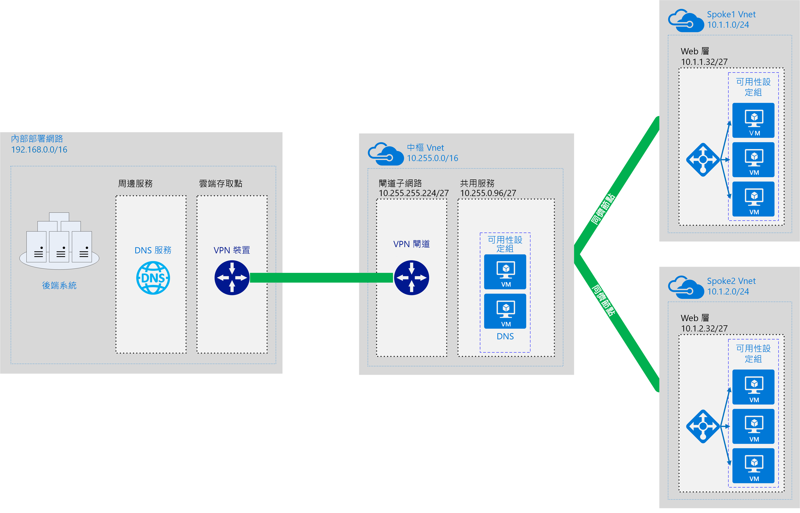

# 軟體定義網路：中樞與輪輻Software Defined Networks: Hub and Spoke

中樞與輪輻網路模型會將以 Azure 為基礎的雲端網路基礎結構組織為多個已連線的虛擬網路。The hub and spoke networking model organizes your Azure-based cloud network infrastructure into multiple connected virtual networks. 此模型可讓您更有效率地管理一般通訊或安全性需求，以及處理潛在的訂用帳戶限制。This model allows you to more efficiently manage common communication or security requirements and deal with potential subscription limitations.

在中樞與輪輻模型中，「中樞」是一個虛擬網路，可做為中心位置來管理外部連線能力，以及裝載多個工作負載所使用的服務。In the hub and spoke model, the *hub* is a virtual network that acts as a central location for managing external connectivity and hosting services used by multiple workloads. 「輪輻」是可裝載工作負載並透過[虛擬網路對等互連](/virtual-network/virtual-network-peering-overview)來連線到中央中樞的虛擬網路。The *spokes* are virtual networks that host workloads and connect to the central hub through [virtual network peering](/virtual-network/virtual-network-peering-overview).

傳入或傳出工作負載輪輻網路的所有流量，都會透過中樞網路進行路由傳送，可透過集中管理的 IT 規則或流程，對其進行路由傳送、檢查，或以其他方式來管理。All traffic passing in or out of the workload spoke networks is routed through the hub network where it can be routed, inspected, or otherwise managed by centrally managed IT rules or processes.

此模型旨在處理下列問題：This model aims to address the following issues:

- 節省成本和管理效率。Cost savings and management efficiency. 將可由多個工作負載共用的服務 (例如網路虛擬設備 (NVA) 和 DNS 伺服器) 集中在單一位置，讓 IT 能夠跨多個工作負載，將多餘的資源和管理投入量降至最低。Centralizing services that can be shared by multiple workloads, such as network virtual appliances (NVAs) and DNS servers, in a single location allows IT to minimize redundant resources and management effort across multiple workloads.
- 克服訂用帳戶限制。Overcoming subscriptions limits. 大型雲端式工作負載需要使用的資源，可能比單一 Azure 訂用帳戶內所允許的資源還要多 (請參閱[訂用帳戶限制](/azure/azure-subscription-service-limits))。Large cloud-based workloads may require the use of more resources than are allowed within a single Azure subscription (see [subscription limits](/azure/azure-subscription-service-limits)). 將工作負載虛擬網路從不同的訂用帳戶對等互連到中央中樞，即可克服這些限制。Peering workload virtual networks from different subscriptions to a central hub can overcome these limits.
- 分開考量。Separation of concerns. 能夠在中央 IT 小組和工作負載小組之間部署個別工作負載。The ability to deploy individual workloads between central IT teams and workloads teams.

下圖顯示一個範例中樞與輪輻架構，其中包括集中管理的混合式連線。The following diagram shows an example hub and spoke architecture including centrally managed hybrid connectivity.

中樞與輪輻架構通常會與混合式網路架構搭配使用，為您在多個工作負載之間共用的內部部署環境提供集中管理的連線。The hub and spoke architecture is often used alongside the hybrid networking architecture, providing a centrally managed connection to your on-premises environment shared between multiple workloads. 在此案例中，往返工作負載與內部部署之間的所有流量，都會通過可管理並保護它的中樞。In this scenario, all traffic traveling between the workloads and on-premises passes through the hub where it can be managed and secured.

## 中樞與輪輻的假設Hub and spoke assumptions

實作中樞與輪輻虛擬網路架構的假設如下：Implementing a hub and spoke virtual networking architecture assumes the following:

- 您的雲端部署將涵蓋裝載於個別工作環境 (例如開發、測試和生產) 中的工作負載，這些工作環境全都依賴一組常見的服務 (例如 DNS 或目錄服務)。Your cloud deployments will involve workloads hosted in separate working environments, such as development, test, and production, that all rely on a set of common services such as DNS or directory services.
- 您的工作負載不需要彼此通訊，但會有常見的外部通訊和共用服務需求。Your workloads do not need to communicate with each other but have common external communications and shared services requirements.
- 您的工作負載所需的資源，比單一 Azure 訂用帳戶內可用的資源還要多。Your workloads require more resources than are available within a single Azure subscription.
- 您需要為工作負載小組提供其本身資源的委派管理權限，同時保有對外部連線的集中安全性管理。You need to provide workload teams with delegated management rights over their own resources while maintaining central security control over external connectivity.

## 全域中樞與輪輻Global hub and spoke

中樞與輪輻架構通常會使用部署至同一個 Azure 區域的虛擬網路來實作，以便將網路之間的延遲降至最低。Hub and spoke architectures are commonly implemented with virtual networks deployed to the same Azure Region to minimize latency between networks. 不過，觸角擴及全球的大型組織可能需要跨多個區域部署工作負載，以滿足可用性、災害復原或法規需求。However, large organizations with global reach may need to deploy workloads across multiple regions for availability, disaster recovery, or regulatory requirements. 透過使用 Azure [全域虛擬網路對等互連](/azure/virtual-network/virtual-network-peering-overview)，中樞與輪輻模型可以跨區域擴充集中式管理和共用服務，以支援分散在世界各地的工作負載。Through the use of Azure [global virtual network peering](/azure/virtual-network/virtual-network-peering-overview), the hub and spoke model can extend centralized management and shared services across regions to support workloads distributed across the world.

## 深入了解Learn more

如需如何在 Azure 上實作中樞與輪輻網路的範例，請參閱 Azure 參考架構網站上的下列範例：For examples of how to implement hub and spoke networks on Azure, see the following examples on the Azure Reference Architectures site:

- [在 Azure 中實作中樞輪輻網路拓撲Implement a hub-spoke network topology in Azure](../../../reference-architectures/hybrid-networking/hub-spoke.md)
- [在 Azure 中實作中樞輪輻網路拓撲與共用服務Implement a hub-spoke network topology with shared services in Azure](../../../reference-architectures/hybrid-networking/shared-services.md)
