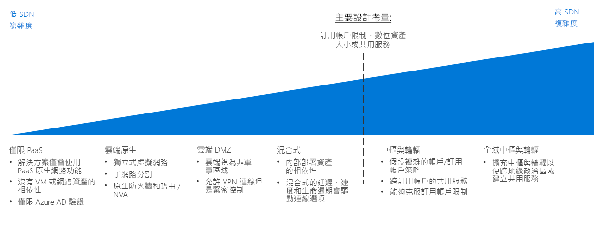

# CAF：軟體定義網路決策指南CAF: Software Defined Network decision guide

軟體定義網路 (SDN) 是一種網路架構，其設計目的是允許已虛擬化的網路功能可透過軟體進行集中管理、設定及修改。Software Defined Networking (SDN) is a network architecture designed to allow virtualized networking functionality that can be centrally managed, configured, and modified through software. SDN 會透過實體網路基礎結構提供一個抽象層，並將相當於實體路由器、防火牆，以及您會在內部部署網路中找到的其他網路硬體虛擬化。SDN provides an abstraction layer over the physical networking infrastructure, and enables the virtualized equivalent to physical routers, firewalls, and other networking hardware you would find in an on-premises network.

SDN 讓 IT 人員能夠設定和部署網路結構與功能，使用已虛擬化的資源來支援工作負載需求。SDN allows IT staff to configure and deploy network structures and capabilities that support workload needs using virtualized resources. 以軟體為基礎的部署管理彈性可讓您快速修改網路資源，並且能夠同時支援敏捷式和傳統部署模型。The flexibility of software-based deployment management enables rapid modification of networking resources and allows the ability to support both agile and traditional deployment models. 使用 SDN 技術建立的已虛擬化網路，對於在公用雲端平台上建立安全網路而言非常重要。Virtualized networks created with SDN technology are critical to creating secure networks on a public cloud platform.

## 網路決策指南Networking decision guide

跳至：[僅限 PaaS](paas-only.md) | [雲端原生](cloud-native.md) | | [雲端 DMZ](cloud-dmz.md) [混合式](hybrid.md) | [中樞/輪輻模型](hub-spoke.md) | [深入了解](#learn-more)Jump to: [PaaS Only](paas-only.md) | [Cloud native](cloud-native.md) | | [Cloud DMZ](cloud-dmz.md) [Hybrid](hybrid.md) | [Hub/Spoke model](hub-spoke.md) | [Learn more](#learn-more)

SDN 提供數個選項，搭配各種不同程度的價格和複雜度。SDN provides several options with varying degrees of pricing and complexity. 上述探索指南提供可將這些選項快速個人化，以便最符合特定商務和技術策略的參考。The above discovery guide provides a reference to quickly personalize these options to best align with specific business and technology strategies.

本指南中的轉折點取決於您的雲端策略小組在進行關於網路架構的決策之前所做的數個關鍵決策。The inflection point in this guide depends on several key decisions that your Cloud Strategy team have made before making decisions about networking architecture. 其中最重要的決策涉及您的[數位資產定義](../../digital-estate/overview.md)和[訂用帳戶設計](../subscriptions/overview.md) (這可能也需要您針對雲端帳戶處理和全球市場策略所做的相關決策提供輸入)。Most important among these are decisions involving your [Digital Estate definition](../../digital-estate/overview.md) and [Subscription Design](../subscriptions/overview.md) (which may also require inputs from decisions made related to your cloud accounting and global markets strategies).

少於 1,000 個 VM 的小型單一區域部署不太可能會顯著地受到此轉折點所影響。Small, single region deployments of less than 1,000 VMs are less likely to be significantly affected by this inflection point. 相反地，如果大量採用超過 1,000 個 VM、多個營業單位或多個地理策略市場，則可能會大幅受到您的 SDN 決策和此關鍵轉折點所影響。Conversely, large adoption efforts with more than 1,000 VMs, multiple business units, or multiple geo-politic markets, could be substantially affected by your SDN decision and this key inflection point.

## 選擇正確的虛擬網路架構Choosing the right virtual networking architectures

本節將細述決策指南，以協助您選擇正確的虛擬網路架構。This section expands on the decision guide to help you choose the right virtual networking architectures.

有許多方式可實作 SDN 技術來建立雲端式虛擬網路。There are many ways to implement SDN technologies to create cloud-based virtual networks. 您如何建立要在移轉中使用的虛擬網路結構，以及那些網路如何與您現有 IT 基礎結構互動的方式，將取決於工作負載需求和您治理需求的組合。How you structure the virtual networks used in your migration and how those networks interact with your existing IT infrastructure will depend on a combination of the workload requirements and your governance requirements.

規劃要在規劃雲端移轉時考量哪個虛擬網路架構或架構組合時，請考慮下列問題，以協助判斷何者適合您的組織：When planning which virtual networking architecture or combination of architectures to consider when planning your cloud migration, consider the following questions to help determine what's right for your organization:

| 問題Question | 僅限 PaaSPaaS Only | 雲端原生Cloud Native | 雲端 DMZCloud DMZ | 混合式Hybrid | 中樞與輪輻Hub and Spoke |
|-----|-----|-----|-----|-----|-----|
| 您的工作負載將只會使用 PaaS 服務，而且除了服務本身所提供的網路功能，不需要任何網路功能嗎？Will your workload only use PaaS services and not require networking capabilities beyond those provided by the services themselves? | yesYes | 否No | 否No | 否No | 否No |
| 您的工作負載需要與內部部署應用程式整合嗎？Does your workload require integration with on-premises applications? | 否No | 否No | yesYes | 是Yes | yesYes |
| 您是否已在內部部署與雲端網路之間，建立了成熟的安全性原則和安全的連線？Have you established mature security policies and secure connectivity between your on-premises and cloud networks? | 否No | 否No | 否No | yesYes | yesYes |
| 您的工作負載是否需要不會透過雲端識別服務支援的驗證服務，或者您是否需要直接存取內部部署網域控制站？Does your workload require authentication services not supported through cloud identity services, or do you need direct access to on-premises domain controllers? | 否No | 否No | 否No | yesYes | yesYes |
| 您是否將需要部署和管理大量 VM 和工作負載？Will you need to deploy and manage a large number of VMs and workloads? | 否No | 否No | 否No | 否No | yesYes |
| 將對資源的控制委派給個別工作負載小組時，您是否將需要提供集中式管理與內部部署連線能力？Will you need to provide centralized management and on-premises connectivity while delegating control over resources to individual workload teams? | 否No | 否No | 否No | 否No | yesYes |

## 虛擬網路架構Virtual networking architectures

深入了解主要的軟體定義網路架構：Learn more about the primary software defined networking architectures:

- [**僅限 PaaS**](paas-only.md)：平台即服務 (PaaS) 產品支援一組有限的內建網路功能，而且可能不需要明確定義的軟體定義網路來支援工作負載需求。[**PaaS Only**](paas-only.md): Platform as a service (PaaS) products support a limited set of built-in networking features and may not require an explicitly defined software defined network to support workload requirements.
- [**雲端原生**](cloud-native.md)：將資源部署到雲端平台時，雲端原生虛擬網路是預設的軟體定義網路架構。[**Cloud Native**](cloud-native.md): A cloud native virtual network is the default software defined networking architecture when deploying resources to a cloud platform.
- [**雲端 DMZ**](cloud-dmz.md)：在您的內部部署與雲端網路之間提供有限的連線能力，其會透過在雲端環境上實作非軍事區域而受到保護。[**Cloud DMZ**](cloud-dmz.md): Provides limited connectivity between your on-premises and cloud network which is secured through the implementation of a demilitarized zone on the cloud environment.
- [**混合式**](hybrid.md)：混合式雲端網路架構可讓虛擬網路存取您的內部部署資源，反之亦然。[**Hybrid**](hybrid.md): The hybrid cloud network architecture allows virtual networks to access your on-premises resources and vice versa.
- [**中樞與輪輻**](hub-spoke.md)：中樞與輪輻架構可讓您集中管理外部連線能力與共用服務、隔離個別工作負載，以及克服潛在的訂用帳戶限制。[**Hub and Spoke**](hub-spoke.md): The hub and spoke architecture allows you to centrally manage external connectivity and shared services, isolate individual workloads, and overcome potential subscription limits.

## 深入了解Learn more

如需 Azure 平台中軟體定義網路的詳細資訊，請參閱下列各項。See the following for more information about software defined networking in the Azure platform.

- [Azure 虛擬網路](/azure/virtual-network/virtual-networks-overview)。[Azure Virtual Network](/azure/virtual-network/virtual-networks-overview). 在 Azure 上，核心 SDN 功能會由 Azure 虛擬網路所提供，以做為實體內部部署網路的雲端類比。On Azure, the core SDN capability is provided by Azure Virtual Network, which acts as a cloud analog to physical on-premises networks. 虛擬網路也可做為平台上資源之間的預設隔離界限。Virtual networks also act as a default isolation boundary between resources on the platform.
- [Azure 網路安全性最佳做法](/azure/security/azure-security-network-security-best-practices)。[Azure Network Security Best Practices](/azure/security/azure-security-network-security-best-practices). 由 Azure 安全性小組所提供，對於如何設定您的虛擬網路以將安全性弱點最小化的建議。Recommendations from the Azure Security team on how to configure your virtual networks to minimize security vulnerabilities.

## 後續步驟Next steps

了解作業小組如何使用記錄、監視和報告，來管理雲端工作負載的健康情況和原則合規性。Learn how logs, monitoring, and reporting are used by operations teams to manage the health and policy compliance of cloud workloads.

> [!div class="nextstepaction"]
> [記錄和報告Logs and Reporting](../log-and-report/overview.md)
