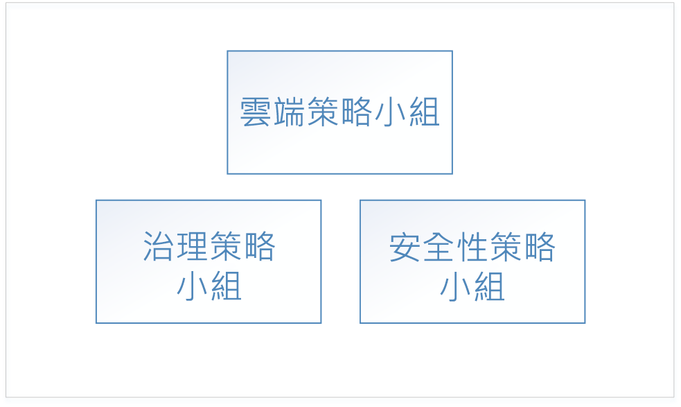
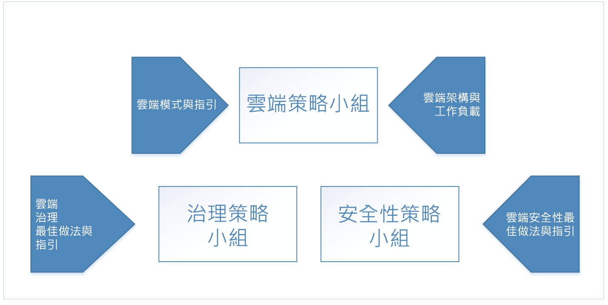
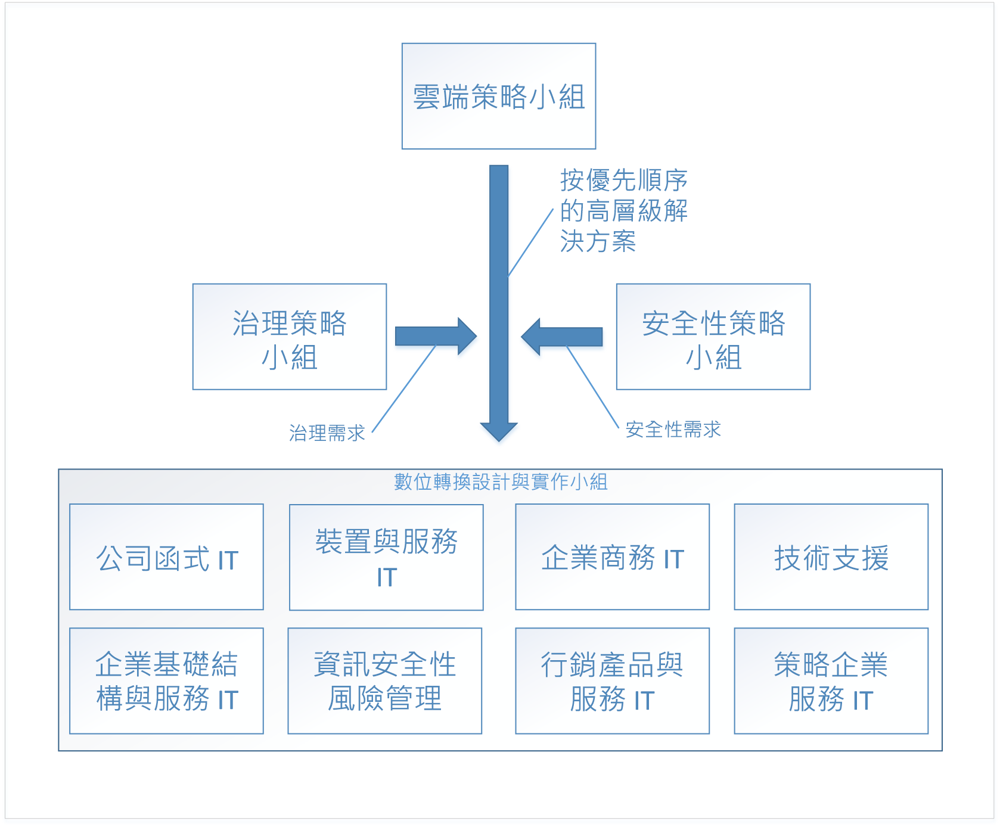

# 企業雲端採用：開始使用Enterprise Cloud Adoption: Getting started 

**數位轉型**為雲端運算表示從運作內部部署跳脫到雲端中運作。The **digital transformation** to cloud computing represents a shift from operating on-premises to operating in the cloud. 這項轉變包含進行商務往來的新方法 - 例如，從軟體和資料中心硬體的資本支出數位轉型到雲端資源使用量的運作支出。This shift includes new ways of doing business - for example, the digital transformation shifts from capital expenditures for software and datacenter hardware to operating expenditures for usage of cloud resources. 

## 數位轉型：程序Digital transformation: process

若要成功採用雲端，企業必須備妥其組織、人員和程序以進行此數位轉型。To be successful in adopting the cloud, an enterprise must prepare its organization, people, and processes to be ready for this digital transformation. 每個企業的組織結構都不同，因此沒有組織整備的一體適用方法。Every enterprise's organizational structure is different, so there is no one-size-fits-all approach to organizational readiness. 本文件概述企業準備就緒可能需要的高階步驟。This document outlines the high-level steps your enterprise can take to get ready. 貴組織必須花時間開發詳細的計劃，來完成每個列出的步驟。Your organization will have to spend time developing a detailed plan to accomplish each of the listed steps.

數位轉型的高階程序是：The high-level process for the digital transformation is:

1. 建立雲端策略小組。Create a cloud strategy team. 這個小組負責帶領數位轉型。This team is responsible for leading the digital transformation. 務必也在這個階段形成治理小組和安全性小組以進行數位轉型。It's also important at this stage to form a governance team and a security team for the digital transformation.
2. 雲端策略小組的成員會了解新功能和雲端技術之間的差異。Members of the cloud strategy team learn what's new and different about cloud technologies.  
3. 雲端策略小組會建置數位轉型的商務案例來讓企業就緒 - 列舉目前商務策略中所有的間距，並判斷排除這些間隙的高階解決方案。The cloud strategy team prepares the enterprise by building the business case for digital transformation - enumerates all the current gaps in business strategy and determines the high-level solutions to eliminate them.
4. 對應高階解決方案與商務群組。Align high-level solutions with business groups. 識別每個商務群組中的專案關係人，以擁有每個解決方案的設計和實作。Identify stakeholders in each business group to own the design and implementation for each solution.
5. 轉換現有的角色、技能與程序以包含雲端角色、技術和程序。Translate existing roles, skills and process to include cloud roles, skills, and process.  
<!--6. Develop processes for operating in the cloud to make solutions more robust in terms of availability, resiliency, and security. 
7. Optimize solutions for performance, scalability, and cost efficiency.-->

## 步驟 1：建立雲端策略小組Step 1: create a cloud strategy team

您企業數位轉型的第一個步驟是納入跨組織的商務領導人，以建立雲端策略小組 (CST)。The first step in your enterprise's digital transformation is engaging business leaders from across the organization to create a cloud strategy team (CST). 此小組是由財務、IT 基礎結構和應用程式群組的商務領導人所組成。This team consists of business leaders from finance, IT infrastructure, and application groups. 這些小組可協助雲端分析和測試階段。These teams can help with the cloud analysis and experimentation phase.

例如，雲端策略小組可由 CTO 推動，並由企業架構小組的成員、IT 財務、來自各種 IT 應用程式群組 (人力資源、財務等等) 的資深技術人員，以及基礎結構、安全性和網路小組的領導人組成。For instance, a Cloud Strategy Team could be driven by the CTO and consist of members of the enterprise architecture team, IT finance, senior technologists from various IT applications groups (HR, finance, and so on), and leaders from the infrastructure, security, and networking teams.  

也務必形成兩個其他高階小組：治理小組和安全性小組。It's also important to form two other high-level teams: a governance team, and a security team. 這些小組負責設計、實作和持續稽核企業的治理與安全性原則。These teams are responsible for designing, implementing, and the ongoing audit of the enterprise's governance and security policies. 治理小組需要曾用過資產保護、成本管理、群組原則及相關主題的成員。The governance team requires members that have worked with asset protection, cost management, group policy and related topics. 安全性小組需要十分熟悉最新業界安全性標準以及企業安全性需求的成員。The security team requires members that are well versed in current industry security standards as well as the enterprise's security requirements.

治理小組負責在雲端中設計和實作企業的治理模型，以及部署和維護屬於數位轉型的共用基礎結構資產。The governance team is responsible for designing and implementing the enterprise's governance model in the cloud, as well as deploying and maintaining the shared infrastructure assets that are part of the digital transformation. 這些資產包括將內部部署網路連線到雲端中虛擬網路所需的硬體、軟體和雲端資源。These assets include hardware, software, and cloud resources necessary to connect the on-premises network to virtual networking in the cloud.

安全性小組會負責在雲端中設計和實作企業的安全性原則，與治理小組密切合作。The security team is responsible for designing and implementing the enterprise's security policy in the cloud, working closely with the governance team. 安全性小組擁有內部部署網路安全性界限的延伸，以包括雲端中的虛擬網路。The security team owns the extension of the security boundary of the on-premises network to include virtual networking in the cloud. 這可能會採用下列形式：擁有及維護雲端虛擬網路上的輸入和輸出防火牆，以及確保工具和原則防止未經授權的資源部署。This may take the form of owning and maintaining the inbound and outbound firewalls on the cloud virtual network as well as ensuring that tools and policy prevent the deployment of unauthorized resources.

## 步驟 2：了解雲端中的新功能Step 2: learn what's new in the cloud
 
您企業數位轉型的下一個步驟，是要讓雲端策略小組的成員了解雲端技術將如何變更企業執行業務的方式。The next step in your enterprise's digital transformation is for the members of the cloud strategy team to learn about how cloud technology will change the way the enterprise does business. 這是您的業務、人員和技術變更的準備及規劃。This is preparation and planning for the changes to your business, people, and technology. 雲端策略小組的成員務必了解新功能，以及雲端與內部部署之間的差異。It's important for the members of the cloud strategy team to understand what's new and different in the cloud as compared to on-premises.

了解雲端的起點是學習高階 [Azure 運作方式](what-is-azure.md)。The starting point for understanding the cloud is learning [how Azure works](what-is-azure.md) at a high level. 接下來，深入了解[在 Azure 中治理](what-is-governance.md)的基本概念以準備[了解資源存取管理](azure-resource-access.md)。Next, learn about the basics of [governance in Azure](what-is-governance.md) in preparation for [understanding resource access management](azure-resource-access.md).

如需進階學習，治理小組應檢閱目錄的治理小節中的概念和設計指南。For advanced learning, the governance team should review the concepts and design guides in the governance section of the table of contents. 基礎結構和工作負載各節適合用於了解一般架構和雲端中的工作負載。The infrastructure and workloads sections are useful for learning about typical architectures and workloads in the cloud.

## 步驟 3：識別商務策略中的間距Step 3: identify gaps in business strategy

下一個步驟是讓雲端策略團隊列舉需要數位轉型解決方案的商務問題。The next step is for the cloud strategy team to enumerate the business problems that require a digital transformation solution. 例如，企業可能會有硬體生命週期結束而需要更換的現有內部部署資料中心。For example, an enterprise may have an existing on-premises data center with end-of-life hardware that requires replacement. 在另一個範例中，企業可能會遇到新功能和服務上市時間的困難，並可能會落後競爭。In another example, an enterprise may be experiencing difficulty with time-to-market for new features and services and may be falling behind to competition. 這些間距代表貴企業數位轉型的「目標」。These gaps represent the *goals* of your enterprise's digital transformation.

商務策略中的間距可以分為下列類別：Gaps in business strategy can be classified into the following categories:

|類別Category|說明Description|
|-----|-----|
|成本管理Cost management|代表企業支付技術方式的間距。Represents a gap in the way the Enterprise pays for technology.|
|控管Governance|代表企業用來保護其資產，避免不當使用而造成成本過度使用、安全性問題或相容性問題的間距。Represents a gap in the processes used by the Enterprise to protect its assets from improper usage that might result in cost overruns, security issues, or compliance issues. | 
|法規遵循Compliance|代表企業符合其本身內部處理程序和原則，以及外部法律、規定和標準方式的間距。Represents a gap in the way the enterprise adheres to its own internal processes and policies as well as external laws, regulations, and standards. |
|安全性Security|代表企業保護其技術和資料資產免於外部威脅方式的間距。Represents a gap in the way the enterprise protects its technology and data assets from external threats. |
|資料治理Data governance|代表企業管理其資料，特別是客戶資料方式的間距。Represents a gap in the way an enterprise manages its data, especially customer data. 例如，歐盟新的一般資料保護規定 (GDPR) 對於保護客戶資料有嚴格的要求，可能需要新的硬體和軟體。For example, new General Data Protection Regulation (GDPR) in the European Union has strict requirements for the protection of customer data that may require new hardware and software.|    

一旦貴企業已將所有商務策略間距分類為這些類別後，下一個步驟是決定每個問題的高階解決方案。Once your enterprise has classified all business strategy gaps into these categories, the next step is to determine a high-level solution for each problem.

下表說明數個範例：The following table illustrates several examples:

|商務策略的間距Business strategy gap|類別 &nbsp; &nbsp; &nbsp; &nbsp; &nbsp;Category &nbsp; &nbsp; &nbsp; &nbsp; &nbsp;|解決方案 &nbsp;&nbsp;&nbsp;&nbsp;&nbsp;&nbsp;&nbsp;&nbsp;&nbsp;&nbsp;&nbsp;&nbsp;&nbsp;&nbsp;Solution &nbsp;&nbsp;&nbsp;&nbsp;&nbsp;&nbsp;&nbsp;&nbsp;&nbsp;&nbsp;&nbsp;&nbsp;&nbsp;&nbsp;|
|-----|-----|-----|
| 目前在內部部署裝載的服務在需求尖峰期間會遇到可用性、復原性及延展性的問題，也就是大約 10%的使用量。Services currently hosted on-premises experience issues with availability, resiliency, and scalability during time of peak demand, which is approximately ten percent of usage. 內部部署資料中心內的伺服器生命週期結束。Servers in on-premises datacenter are end-of-life. 企業 IT 建議為資料中心購買可因應尖峰需求規格的新內部部署硬體。Enterprise IT recommends purchasing new on-premises hardware for datacenter with specifications to handle peak demand.| 成本管理Cost management | 將受影響的現有內部部署工作負載移轉到雲端中可調整的資源，僅需支付使用量。Migrate affected existing on-premises workloads to scalable resources in the cloud, paying for usage only. |
| 外部資料管理的法律和規定要求企業遵循一組需要加密待用資料的標準控制項，且需要新的硬體和軟體。External data management laws and regulations require the enterprise to adhere to set of standard controls that require encryption of data at rest, requiring new hardware and software. | 資料治理Data governance | 將資料移至待用資料的 Azure 儲存體服務加密。Move data to Azure storage service encryption for data at rest. |
| 裝載於內部部署資料中心的服務在公眾對應的服務上遇到分散式阻斷服務 (DDoS) 攻擊。Services hosted in on-premises datacenter been experiencing distributed denial of service (DDoS) attacks on public-facing services. 攻擊難以降低，且需要新的硬體、軟體和安全性人員有效地處理。The attacks are difficult to mitigate and require new hardware, software, and security personnel to deal with effectively. | 安全性Security | 將服務遷移至 Azure，並利用 Azure DDoS 保護。Migrate services to Azure, and take advantage of Azure DDoS protection.|

當您已列舉所有商務策略中的間距，且已判斷高階解決方案時，請設定清單的優先順序。When all of the gaps in business strategy have been enumerated and high-level solutions have been determined, prioritize the list. 透過將商務策略的間距與每個類別中企業的短期與長期目標對齊，來設定清單的優先順序。The list can be prioritized by aligning the business strategy gaps with the enterprise's short and long-term goals in each category. 例如，如果企業的短期目標是要減少下兩個會計季度中的 IT 支出，則「成本管理」類別中的商務間距就可透過與每個關聯的預估成本節省來設定優先順序。For example, if the enterprise has a short-term goal to reduce IT spend in the next two fiscal quarters, the business gaps in the *cost management* category may be prioritized by the projected cost saving associated with each.

此程序的輸出是配合商務分類的高階解決方案堆疊排名清單。The output of this process is a stack-ranked list of high-level solutions aligned with business categories. 

## 步驟 4：對應高階解決方案與商務群組來設計解決方案Step 4: align high-level solutions with business groups to design solutions 

現在已列舉數位轉型的目標、設定優先順序，且提議高階解決方案；下一個步驟是讓雲端策略小組對齊每個高階解決方案，與每個企業群組中的設計和實作小組。Now that the goals of the digital transformation have been enumerated, prioritized, and high-level solutions proposed, the next step is for the cloud strategy team to align each of the high-level solutions with design and implementation teams in each of the business groups. 

小組採用優先設定的清單，並逐步完成每個高階解決方案來設計每個解決方案。The teams take the prioritized lists and work through each high-level solution to design each solution. 設計程序會牽涉到新基礎結構和新工作負載的規格。The design process will involve the specification of new infrastructure and new workloads. 它們所遵循的人員及程序的角色也可能會變更。There may also be changes to the roles of the people and the processes they follow. 每個設計小組也務必在這個階段包含治理和安全性小組以檢閱每一項設計。It's also extremely important at this stage for each of the design teams to include both the governance and security teams for review of each design. 每一項設計都必須落在治理與安全性小組所定義的原則和程序中，且這些小組必須包含在每一項設計的最終登出。Each design must fall within with the policies and procedures defined by the governance and security teams, and these teams must be included in the final sign off of each design.

每個解決方案的設計都是非一般的工作，必須與其他小組的其他解決方案設計一起考量。The design of each solution is a non-trivial task and as designs are created, must be considered in context with other solution designs from other teams. 例如，如果數個設計會導致現有內部部署應用程式和服務移轉至雲端，將這些群組在一起並設計整體的移轉策略可能更有效率。For example, if several of the designs result in a migration of existing on-premises applications and services to the cloud, it may be more efficient to group these together and design an overall migration strategy. 另舉一例，可能無法遷移某些現有的內部部署應用程式和服務，解決方案可能是要將其取代為新的開發或第三方服務。In another example, it may not be possible to migrate some existing on-premises applications and services and the solution may be to replace them with either new development or third-party services. 在此情況下，將這些群組在一起，並判斷它們判斷之間的重疊，以判斷第三方服務是否可用於多個解決方案，可能更有效率。In this case, it may be more efficient to group these together and determine the overlap between them to determine if a third-party service can be used for more than one solution.

一旦解決方案的設計完成之後，小組會繼續進行每一項設計的實作階段。Once the design of the solution is complete, the team moves on to the implementation phase for each design. 每個解決方案設計的實作階段可以使用標準專案管理程序來執行。The implementation phase for each solution design can be run using standard project management processes.

## 步驟 5：轉譯雲端的現有角色、技術和程序Step 5: translate existing roles, skills, and process for the cloud

在 IT 產業歷程記錄期間的每個發展階段，最重要的產業變更通常會依人員角色中的變更標示。At each evolutionary phase during the history of the IT industry, the most notable industry changes are often marked by changes in staff roles. 從大型主機轉換到用戶端/伺服器模型期間，電腦操作員角色會大量消失，並由系統管理員所取代。During the transition from mainframes to the client/server model, the role of the computer operator largely disappeared, replaced by the system administrator. 當虛擬化的時代來臨時，個人使用實體伺服器的需求將會消失，並取代為虛擬化專業人員的需求。When the age of virtualization arrived, the requirement for individuals working with physical servers diminished, replaced with a need for virtualization specialists. 同樣地，隨著機構轉移至雲端運算，角色很可能會再次變更。Similarly, as institutions shift to cloud computing, roles will likely change again. 例如，資料中心專家可能取代雲端財務分析師。For example, datacenter specialists might be replaced with cloud financial analysts. 即使是在 IT 職稱維持不變的情況下，每日的工作角色已大幅發展。Even in cases where IT job titles have not changed, the daily work roles have evolved significantly. 

IT 部門人員可能會對其角色和職位覺得有點焦慮，因為他們了解到支援雲端解決方案需要一組不同的技巧。IT staff members may feel anxious about their roles and positions as they realize that a different set of skills is needed for the support of cloud solutions. 但是，探索並了解新雲端技術的敏捷員工不必感到這種恐懼。But agile employees who explore and learn new cloud technologies don’t need to have that fear. 它們可以主導採用雲端服務，並協助組織了解並運用相關聯的變更。They can lead the adoption of cloud services and help the organization understand and embrace the associated changes. 

### 擷取的考量Capturing concerns

在數位轉型期間，每個小組應該在任何員工考量出現時加以擷取。During the digital transformation, each team should capture any staff concerns as they arise. 在擷取考量時，識別下列項目：When capturing concerns, identify the following: 
* 考量的類型。The type of concern. 例如，背景工作角色可能可以因應數位轉型伴隨而來的工作職責變更。For example, workers may be resistant to the changes in job duties that accompany the digital transformation.
* 考量的影響 (如果未解決)。The impact of the concern if it is not addressed. 例如，因應數位轉型可能會導致背景工作角色執行所需變更速度緩慢。For example, resistance to the digital transformation may be result in workers being slow to execute the changes necessary. 
* 解決考量所需具備的領域。The area equipped to address the concern. 例如，如果 IT 部門中的背景工作角色都不願意獲取新的技能，最好具備 IT 專案關係人的領域來解決這個問題。For example, if workers in the IT department are reluctant to acquire new skills, the IT stakeholder's area is best equipped to address this concern. 識別領域對於某些問題可能很清晰，而在這些情況下，您可能必須呈報領導主管。Identifying the area may be clear for some concerns, and in these cases you may need to escalate to executive leadership. 

### 找出間距Identify gaps

透過貴企業數位轉型問題的另一個層面是找出**間距**。Another aspect of working through the issues with your enterprise's digital transformation is identifying **gaps**. 間距是您數位轉型所需但目前不存在貴企業中的角色、技能或程序。A gap is a role, skill, or process required for your digital transformation that does not currently exist in your enterprise. 

開始列舉伴隨數位轉型的新責任，特別強調新責任和即將淘汰的目前責任。Begin by enumerating the new responsibilities that accompany the digital transformation, with an emphasis on new responsibilities and current responsibilities to be retired. 識別與每個責任對齊的區域。Identify the area that is aligned with each responsibility. 針對新責任，決定與區域對齊的緊密程度。For new responsibilities, determine how closely aligned it is with the area. 部分責任可能會跨越數個區域，而這代表更好的對齊機會，應該要擷取成考量。Some responsibilities may span several areas, and this represents an opportunity for better alignment that should be captured as a concern. 在沒有任何識別為需負責區域的情況下，擷取這個作為間距。In the case where no area is identified as being responsible, capture this as a gap.

接下來，找出支援責任所需的技能。Next, identify the skills necessary to support the responsibility. 判斷貴企業是否具有包含這些技能的現有資源。Determine if your enterprise has existing resources with these skills. 如果沒有任何現有的資源，判斷哪些訓練課程或人才收購是必要的。If there are no existing resources, determine what training programs or talent acquisition is necessary. 決定必須支援責任以保持數位轉型順利進行的時間範圍。Determine the time frame by which the responsibility must be supported to keep your digital transformation on track.

最後，找出將執行這些技能的角色。Finally, identify the roles that will execute these skills. 您的某些現有工作力會假設部分角色，在其他情況下可能需要全新的角色。Some of your existing workforce will assume parts of the role, and in other cases an entirely new role may be necessary. 

### 跨小組的夥伴Partner across teams

填滿貴組織數位轉型間距所需的技能，通常不會侷限於單一角色或甚至是單一部門。The skills necessary to fill the gaps in your organization's digital transformation will typically not be confined to a single role, or even a single department. 技能都會有關聯性和相依性，可橫跨單一角色或多個角色，而這些角色可能存在於多個部門。Skills will have relationships and dependencies that can span a single role or multiple roles, and those roles may exist in several departments. 例如，工作負載擁有者可能需要 IT 角色中的人員佈建核心資源，例如訂用帳戶和資源群組。For example, a workload owner may require someone in an IT role to provision core resources such as subscriptions and resource groups.

這些相依性表示貴組織實作來管理角色之間工作流程的新處理序。These dependencies represent new processes that your organization implements to manage the workflow between roles. 在上述範例中，有許多不同類型的程序可支援工作負載擁有者和 IT 角色之間的關聯性。In the above example, there are several different types of process that can support the relationship between the workload owner and the IT role. 例如，您可以建立工作流程工具來管理程序，或可以使用簡單的電子郵件範本。For example, a workflow tool can be created to manage the process, or, a simple email template can be used.

追蹤這些相依性，並記下可支援它們的程序，以及程序目前是否存在。Track these dependencies and make note of the processes that will support them, and whether or not the process currently exists. 對於需要工具的程序，請確定部署任何工具的時間軸對齊整體數位轉型的排程。For process that require tooling, ensure that the timeline for deploying any tools aligns with the overall digital transformation schedule.

## 後續步驟Next steps

數位轉型是反覆的程序，且小組涉及每個反覆項目都將會變得更有效率。The digital transformation is an iterative process, and with each iteration the teams involved will become more efficient. 

> [!div class="nextstepaction"]
> [了解 Azure 如何運作Understand how Azure works](what-is-azure.md)