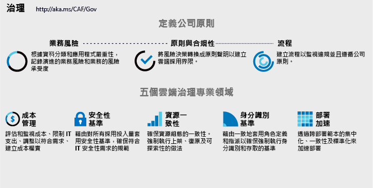

# 實作雲端治理策略

<!-- markdownlint-disable MD033 -->

<ul class="panelContent cardsI">
<li style="display: flex; flex-direction: column;">
    

        

            

                

對業務程序或技術平台進行的任何變更都會對業務引進風險。 雲端治理小組 (其成員又稱雲端監管人) 負責降低這些風險，且對採用或創新工作造成最少的中斷。  不過，雲端治理需要的不僅是技術實作。 公司記述或公司原則中的細微變更可能對採用工作有重大影響。 在實作之前，請務必在定義公司原則的同時了解 IT 以外的部門。  
                

            

        

    

</li>
<li style="display: flex; flex-direction: column;">
    <a href="../_images/operational-transformation-govern-highres.png" style="display: flex; flex-direction: column; flex: 1 0 auto;">
        

            

                

                    

 
<i>圖 1.公司原則和雲端治理的五個專業領域的視覺效果</i>
                    

                

            

        

    </a>
</li>
</ul>

<!-- markdownlint-enable MD033 -->

## 定義公司原則

定義公司原則著重於識別和降低業務風險，而無論雲端平台。 狀況良好的雲端管理策略，是從健全的公司原則開始。 下列三個步驟的程序會引導這類原則的反覆式開發法。

<!-- markdownlint-disable MD033 -->

<ul  class="panelContent cardsF">
<li style="display: flex; flex-direction: column;">
    <a href="./policy-compliance/understanding-business-risk.md" style="display: flex; flex-direction: column; flex: 1 0 auto;">
        

            

                

                    

                        

                            
                        

                    

                    

                        <h3>業務風險</h3>
                        
調查目前的雲端採用計劃和資料分類以識別業務風險。 與企業合作來平衡風險承受度和風險降低成本。

                    

                

            

        

    </a>
</li>
<li style="display: flex; flex-direction: column;">
    <a href="./policy-compliance/define-policy.md" style="display: flex; flex-direction: column; flex: 1 0 auto;">
        

            

                

                    

                        

                            
                        

                    

                    

                        <h3>原則與合規性</h3>
                        
評估風險承受度，以通知治理雲端採用及降低風險且影響程度最小的原則。 在某些產業中，第三方合規性會影響初始原則的建立。

                    

                

            

        

    </a>
</li>
<li style="display: flex; flex-direction: column;">
    <a href="./policy-compliance/processes.md" style="display: flex; flex-direction: column; flex: 1 0 auto;">
        

            

                

                    

                        

                            
                        

                    

                    

                        <h3>處理序</h3>
                        
採用與創新活動的步調自然會建立原則違規。 執行相關程序會輔助監視及強制執行遵守原則。

                    

                

            

        

    </a>
</li>
</ul>

<!-- markdownlint-enable MD033 -->

## 後續步驟

健全的雲端管理策略從了解商業風險開始。

> [!div class="nextstepaction"]
> [了解業務風險](./policy-compliance/understanding-business-risk.md)
