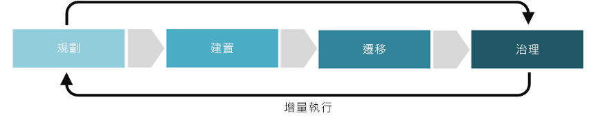

# 成本管理專業領域改進

成本管理專業領域會嘗試解決與在裝載雲端式工作負載時所產生費用相關的核心業務風險。 在這五個雲端管治理專業領域中，成本管理會涉及控制雲端資源的成本和使用量，而且目標為建立和維護已規劃的成本週期。

本文將概述貴公司可執行來開發成本管理專業領域並使其臻至成熟的潛在工作。 這些工作可以細分為實作雲端解決方案的規劃、建置、採用及操作階段，接著反覆執行以允許開發[雲端治理的累加方法](../journeys/overview.md#an-incremental-approach-to-cloud-governance)。

*圖 1.雲端治理累加方法的採用階段。*

沒有任何單一文件可以滿足所有企業需求。 因此，本文將針對治理成熟流程的每個階段，概述建議的最小和潛在範例活動。 這些活動的初始目的是協助您建置[原則 MVP](../journeys/overview.md#an-incremental-approach-to-cloud-governance)，並建立累加式原則演進的架構。 您的雲端治理小組將需決定要對這些活動進行多少投資，以改進您的成本管理治理功能。

> [!CAUTION]
> 本文中概述的最小或潛在活動都不會與特定的公司原則或協力廠商合規性需求保持一致。 本指引旨在協助促成交談，從而使這兩個需求與雲端治理模型保持一致。

## 規劃和整備

這個階段的治理成熟度可消彌業務成果與可操作之策略間的鴻溝。 在此流程中，領導小組會定義特定的計量、將這些計量對應至數位資產，並開始規劃整體移轉工作。

**最小的建議活動：**

* 評估您的[成本管理工具鏈](toolchain.md)選項。
* 開發架構方針文件的草稿，並散發給重要的專案關係人。
* 教育並涵蓋受到開發架構方針影響的人員和小組。

**潛在的活動：**

* 確定支援您雲端策略商業論證的預算決策。
* 驗證您用來報告成功配置資金的學習計量。
* 了解影響雲端成本處理方式的預期雲端帳戶處理模型。
* 熟悉數位資產方案，並驗證準確的成本期望。
* 評估購買選項，以判斷是否更適合「預付方案」，或是購買 Enterprise 合約進行預先承諾。
* 使業務目標和規劃的預算保持一致，並視需要調整預算方案。
* 開發目標和預算報告機制，以便在每個成本週期結束時通知技術和業務的專案關係人。

## 建置和部署前

成功移轉環境需要一些技術性和非技術性的必要條件。 此流程著重於可繼續進行移轉的決策、整備和核心基礎結構。

**最小的建議活動：**

* 在部署前階段中推出，以實作您的[成本管理工具鏈](toolchain.md)。
* 更新架構方針文件，並散發給重要的專案關係人。
* 開發教育性資料和文件、認知溝通、獎勵和其他計畫，以協助試用產品的使用者採用。
* 決定您的購買需求是否要與預算和目標保持一致。

**潛在的活動：**

* 使您的預算方案與[訂用帳戶策略](../../decision-guides/subscriptions/overview.md)保持一致，此策略會定義您的核心擁有權模型。
* 隨著時間運用[資源一致性策略](../../decision-guides/resource-consistency/overview.md)以強制執行架構和成本方針。
* 判斷是否有任何會影響您採用和移轉方案的成本異常狀況。

## 採用和移轉

移轉是一個累加式流程，著重於在現有的數位資產中，移動、測試和採用應用程式或工作負載。

**最小的建議活動：**

* 將您的[成本管理工具鏈](toolchain.md)從部署前環境移轉至生產環境。
* 更新架構方針文件，並散發給重要的專案關係人。
* 開發教育性資料和文件、認知溝通、獎勵和其他計畫，以協助試用產品的使用者採用。

**潛在的活動：**

* 實作您的雲端帳戶處理模型。
* 確定預算會在每次發行期間反映實際支出，並視需要調整。
* 監視預算方案中的變更，並且在需要額外的登出時與專案關係人進行驗證。
* 更新架構方針文件的變更，以反映實際成本。

## 操作和實作後

轉換完成之後，治理和操作必須依存於應用程式或工作負載的自然生命週期。 這個階段的治理成熟度著重於通常會在實作解決方案且轉換週期開始穩定後隨之而來的活動。

**最小的建議活動：**

* 根據貴組織成本管理需求的變更，自訂您的[成本管理工具鏈](toolchain.md)。
* 考慮將任何通知和報告自動化，以反映實際支出。
* 精簡架構方針，以引導未來的採用程序。
* 定期教育受影響的小組，以確保會持續遵循架構方針。

**潛在的活動：**

* 執行每季雲端業務檢閱，以傳達要傳遞給企業的價值與相關聯的成本。
* 每季調整方案，以反映實際支出的變更。
* 判斷財務會與商業單位訂用帳戶的損益保持一致。
* 每月分析專案關係人價值和成本報告方法。
* 修復未充分使用的資產，並判斷其是否值得繼續。
* 偵測方案與實際支出之間的不一致與異常狀況。
* 協助雲端採用小組和雲端策略小組了解並解決這些異常狀況。

## 後續步驟

既然您已了解雲端身分識別治理的概念，請檢查[成本管理工具鏈](toolchain.md)，來識別您在 Azure 平台上開發成本管理治理專業領域時所需的 Azure 工具和功能。

> [!div class="nextstepaction"]
> [適用於 Azure 成本管理工具鏈](toolchain.md)