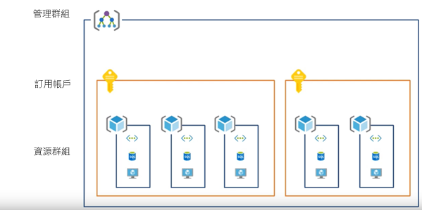
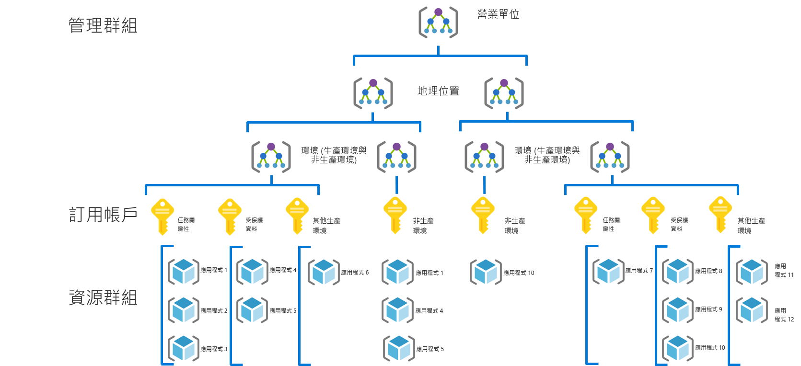
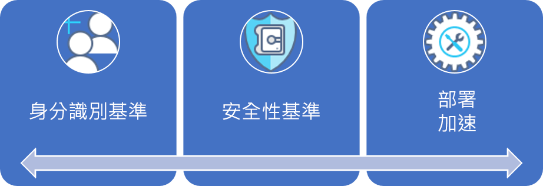
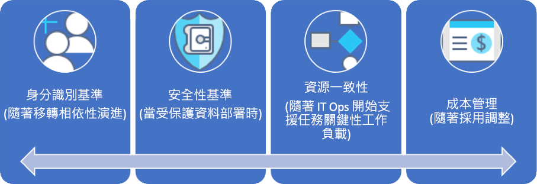

# CAF：大型企業治理旅程圖

## 最佳做法概觀

這個治理旅程圖會遵循虛構公司在治理成熟度各個階段的體驗， 並以實際的客戶旅程圖為基礎。 建議的最佳做法則會以該虛構公司的條件約束和需求為主。

此概觀會根據最佳做法來定義治理的最簡可行產品 (MVP) 以作為快速起點。 它還提供一些治理演進的連結，這些演進會隨著新業務或技術風險的出現，進一步新增最佳做法。

> [!WARNING]
> 這個 MVP 是基於一組假設的基準起點。 即便是這組基本的最佳做法，也會以獨特的業務風險和風險承受度所衍生的公司原則為基礎。 若要查看您是否適用這些假設，請閱讀本文後面[較長的敘述](./narrative.md)。

### 治理最佳做法

這個最佳做法會作為組織可用來在多個 Azure 訂用帳戶中快速且一致地新增治理防護的基礎。

### 資源組織

下圖顯示組織資源的治理 MVP 階層。

每個應用程式都應該在管理群組、訂用帳戶，以及資源群組階層的適當區域中部署。 在部署規劃期間，雲端治理小組將在階層中建立必要的節點，以使雲端採用小組更具產能。

1. 適用於每個營業單位的管理群組，以及詳細反映地理位置和環境類型 (生產、非生產) 的階層。
2. 適用於每個獨特的營業單位、地理位置、環境和「應用程式分類」組合的訂用帳戶。
3. 適用於每個應用程式的單獨資源群組。
4. 應該在此群組階層的每個層級套用一致的命名法。

這些模式會提供成長的空間，而不會不必要地使階層複雜化。

[!INCLUDE [governance-of-resources](../../../../../includes/cloud-adoption/governance/governance-of-resources.md)]

## 治理演進

一旦部署此 MVP 之後，其他治理層就可以快速地合併到環境中。 以下是一些推演 MVP 以符合特定業務需求的方式：

- [受保護資料的安全性基準](./security-baseline-evolution.md)
- [任務關鍵性應用程式的資源設定](./resource-consistency-evolution.md)
- [成本管理控制](./cost-management-evolution.md)
- [多重雲端演進的控制](./multi-cloud-evolution.md)

<!-- markdownlint-disable MD026 -->

## 這個最佳做法有哪些用途？

在 MVP 中，從[部署加速](../../deployment-acceleration/overview.md)專業領域建立做法和工具是為了快速套用公司原則。 特別是，MVP 會使用 Azure 藍圖、Azure 原則及 Azure 管理群組來套用數個基本的公司原則，如這家虛構公司的敘述中所定義。 這些公司原則會使用 Azure Resource Manager 範本與 Azure 原則來套用，以建立很小的身分識別和安全性基準。

## 推演最佳做法

經過一段時間之後，這個治理 MVP 將用於推演治理做法。 隨著採用率提高，業務風險也會增加。 CAF 治理模型中的各種專業領域將持續推演以降低這些風險。 本系列的後續文章將討論影響這家虛構公司的公司原則演進。 這些演進會跨三個專業領域進行：

- 身分識別基準 (移轉相依性在敘述中持續推演時)
- 成本管理 (採用擴大規模時)
- 安全性基準 (部署受保護的資料時)。
- 資源一致性 (IT 操作開始支援任務關鍵性工作負載時)。

## 後續步驟

既然您已經熟悉治理 MVP，並且了解後續的治理演進，請閱讀對於其他內容的支持性敘述。

> [!div class="nextstepaction"]
> [閱讀支持性敘述](./narrative.md)
