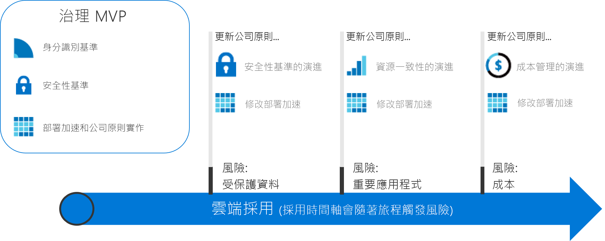

# 可操作的控管作業過程

本節中的治理旅程會說明 CAF 治理模型的漸進式方法。 您可以建立一個敏捷式治理平台，此平台將會演進以滿足任何雲端治理案例的需求。

## 檢閱並採用雲端治理最佳作法

若要開始採用路徑，請選擇下列旅程其中之一。 每個旅程都根據一組的虛構客戶體驗，概述了一系列最佳做法。 針對不熟悉 CAF 治理模型漸進式方法的讀者，建議您先檢閱以下的高層級治理理論介紹，然後再採用最佳作法。

<!-- markdownlint-disable MD033 -->

<ul class="panelContent cardsZ">
<li style="display: flex; flex-direction: column;">
    <a href="./small-to-medium-enterprise/overview.md" style="display: flex; flex-direction: column; flex: 1 0 auto;">
        

            

                

                    

                        <h3>中小型企業</h3>
                        
適用於擁有少於五個資料中心並透過中央 IT 或回報模型管理成本之企業的治理旅程。

                    

                

            

        

    </a>
</li>
<li style="display: flex; flex-direction: column;">
    <a href="./large-enterprise/overview.md" style="display: flex; flex-direction: column; flex: 1 0 auto;">
        

            

                

                    

                        <h3>大型企業</h3>
                        
適用於擁有超過五個資料中心並透過多個營業單位管理成本之企業的治理旅程。

                    

                

            

        

    </a>
</li>
</ul>

<!-- markdownlint-enable MD033 -->

## 雲端治理的漸進式方法

採用雲端是一個旅程，不是目的地。 過程中，會有清楚的里程碑和實質的商業利益。 不過，當公司開始這個旅程時，最終的雲端採用狀態通常是未知的。 雲端治理會建立護欄，在整個旅程中讓公司保持安全。

這些治理旅程會根據真實客戶的旅程，描述虛構公司的經驗。 每個旅程都會透過雲端採用的治理方面來追蹤客戶。

### 建立最終狀態

沒有目標目的地的旅程只是閒晃。 採取第一個步驟之前，請務必建立最終狀態的粗略願景。 下列資訊圖提供最終狀態的參考架構。 那不是您的起點，但顯示了可能的目的地。

CAF 治理模型會識別旅程期間的主要重點區域。 每個區域都關係到公司在採用更多雲端服務時必須面對的不同風險類型。 在此架構中，治理旅程會識別雲端治理小組的必要動作。 過程中，會進一步說明 CAF 治理模型的每個準則。 廣義來說，其中包含：

**公司原則**。 公司原則會推動雲端治理。 治理旅程著重在公司原則的特定層面：

- 商務風險：識別並了解公司風險。
- 原則與合規性：將風險轉變成支援任何合規性需求的原則聲明。
- 流程：確保遵守所述的原則。

**雲端治理的五個專業領域**。 這些專業領域支援公司原則。 每個專業領域都會保護公司避免潛在陷阱：

- 成本管理
- 安全性基準
- 資源一致性
- 身分識別基準
- 部署加速

基本上，公司原則的作用是用來偵測潛在問題的早期警告系統。 專業領域可協助公司降低風險並建立護欄。

### 成長至最終狀態

因為治理需求隨著雲端採用旅程而演變，因此需要不同的治理方式。 公司無法等待小組在每一條高速公路上建立護欄和藍圖之後*再踏出第一步*。 公司會期待更快且更順利獲得業務成果。 IT 治理也必須在快速行動，並跟上業務需求，以便隨時掌握雲端採用旅程並避免「影子 IT」。

**漸進式治理**方法可提供這些特性。 漸進式治理仰賴較少的公司原則、流程和工具，以建立採用和治理的基礎。 該基礎稱為**最簡可行產品 (MVP)**。 MVP 可讓治理小組在整個採用生命週期中，快速地將治理納入實作。 在雲端採用流程期間，任何時間都可已建立 MVP。 不過，儘早採用 MVP 是最好的作法。

迅速回應不斷變化之風險的能力，可讓雲端治理小組以新方式參與。 雲端治理小組可以加入雲端策略小組當偵查員、比雲端採用小組領先一步、繪製路線，並快速建立護欄以降低與採用方案有關的風險。 這些即時的治理層級稱為**治理演變**。 透過這個方法，治理策略的演變會比雲端採用小組領先一步。

下圖顯示簡單的治理 MVP 和三個治理演變。 在演變過程中，定義了其他的公司原則以降低新的風險。 然後，部署加速專業領域會將這些變更套用到每個部署。

> [!NOTE]
> 治理，並不是取代安全性、網路、身分識別、財物、DevOps 或營運之類的重要功能。 過程中，每個功能都要仰賴成員並與成員互動。 這些成員應包含在雲端治理管理小組中，以加速決策和動作。

## 選擇治理旅程

此旅程示範如何實作治理 MVP。 從該處開始，每個旅程都顯示了雲端治理小組如何領先身為加速採用工作合作夥伴的雲端採用小組運作。 從基礎到後續演變，CAF 治理模型都會引導治理的應用程式。

若要開始治理旅程，請選擇下列兩個選項其中之一。 這些選項是依據綜合的客戶體驗。 標題是依據企業規模大小，以便於巡覽。 不過，讀者的決定可能更加複雜。 下表概述了這兩個選項之間的差異。

> [!NOTE]
> 每個旅程都不太可能完全符合您的狀況。 請選擇最接近的旅程，並用它當作起點。 在整個旅程中，會提供額外資訊，協助您自訂決策，以符合特定準則。

### 商務特性

|                                            | 中小型企業                                                                              | 大型企業                                                                                               |
|--------------------------------------------|---------------------------------------------------------------------------------------------------------|----------------------------------------------------------------------------------------------------------------|
| 地理位置 (國家或地緣政治區域) | 客戶或員工主要位於一個地理位置                                                      | 客戶或員工位於多個地理位置                                                              |
| 受影響的營業單位                    | 單一營業單位                                                                                    | 多個營業單位                                                                                        |
| IT 預算                                  | 單一 IT 預算                                                                                        | 預算配置給多個營業單位                                                                         |
| IT 投資                             | 資本支出 (CapEx) 導向的投資是每年計劃一次，而且通常僅涵蓋基本維護。 | CapEx 導向的投資是每年計劃一次，而且通常包含維護和 3 至 5 年的更新週期。 |

### 採用雲端治理之前的目前狀態

|                                             | 中小型企業                                                                               | 大型企業                                                                                                          |
|---------------------------------------------|----------------------------------------------------------------------------------------------------------|---------------------------------------------------------------------------------------------------------------------------|
| 資料中心或協力廠商主機服務提供者 | 少於五個資料中心                                                                                  | 超過五個資料中心                                                                                                   |
| 網路功能                                  | 無 WAN，或是 1 &ndash; 2 個 WAN 提供者                                                                             | 複雜網路或全域 WAN                                                                                             |
| 身分識別                                    | 單一樹系、單一網域。 不需要宣告型驗證或協力廠商 MFA 裝置。 | 複雜、多個樹系、多個網域。 應用程式需要宣告型驗證或協力廠商 MFA 裝置。 |

### 發展雲端治理之後期望的未來狀態

|                                              | 中小型企業                                                                        | 大型企業                                                                                        |
|----------------------------------------------|---------------------------------------------------------------------------------------------------|---------------------------------------------------------------------------------------------------------|
| 成本管理 – 雲端帳戶處理           | 回報模型。 透過 IT 集中計費。                                                | 退款模型。 可透過 IT 採購來散發計費。                                  |
| 安全性基準 – 受保護的資料           | 公司財務資料和 IP。 有限的客戶資料。 沒有協力廠商合規性需求。     | 客戶之財務和 PII 資料的多個集合。 可能必須考慮協力廠商合規性。 |
| 資源一致性 – 任務關鍵性應用程式 | 中斷是很痛苦的，但不是造成財務上的損失。 現有的 IT 作業相對上不成熟。 | 中斷已定義並監控財務影響。 IT 作業已建立而且成熟。         |

這兩個旅程代表了投資雲端治理之客戶體驗的兩個極端。 大部分公司表現出上述兩個案例的組合。 檢閱旅程之後，請使用 CAF 治理模型展開治理對話，並修改基準旅程以便更加貼近您的需求。

## 後續步驟

選擇其中一個旅程：

> [!div class="nextstepaction"]
> [中小型企業治理旅程](./small-to-medium-enterprise/overview.md)
>
> [大型企業治理旅程](./large-enterprise/overview.md)
