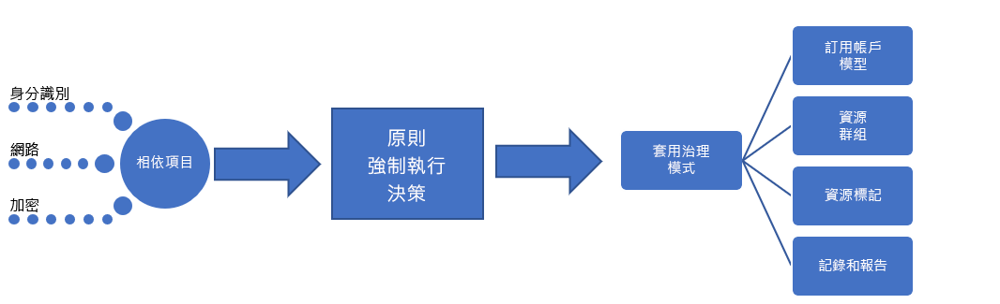

# 中小型企業：最佳做法說明Small-to-medium enterprise: Best practice explained

治理旅程會從一組最初的[公司原則](./initial-corporate-policy.md)開始。The governance journey starts with a set of initial [corporate policies](./initial-corporate-policy.md). 這些原則會用來建立治理 MVP，以反映出[最佳做法](./overview.md)。These policies are used to establish a governance MVP that reflects [best practices](./overview.md).

在本文中，我們會討論建立治理 MVP 所需的策略概要。In this article, we discuss the high-level strategies that are required to create a governance MVP. 治理 MVP 的核心在於[部署加速](../../deployment-acceleration/overview.md)的專業領域。The core of the governance MVP is the [Deployment Acceleration](../../deployment-acceleration/overview.md) discipline. 在此階段套用的工具和模式有助於累進式發展，而這是在未來擴展治理成效所需的。The tools and patterns applied at this stage will enable the incremental evolutions needed to expand governance in the future.

## 治理 MVP (雲端採用基礎)Governance MVP (Cloud Adoption Foundation)

快速採用治理和公司原則是可行的，因為有一些簡單的原則和雲端控管工具。Rapid adoption of governance and corporate policy is achievable, thanks to a few simple principles and cloud-based governance tooling. 在任何治理程序中都有要達成的三個雲端治理專業領域，而這些是第一個。These are the first of the three Cloud Governance Disciplines to approach in any governance process. 每一個項目都將以本文為基礎來展開。Each will be expanded upon in this article.

為建立起點，本文將針對建立治理 MVP (所有採用的基礎) 所需的身分識別基準、安全性基準和部署加速，討論其背後的策略概要。To establish the starting point, this article will discuss the high-level strategies behind Identity Baseline, Security Baseline, and Deployment Acceleration that are required to create a governance MVP, which will serve as the foundation for all adoption.

## 實作程序Implementation process

治理 MVP 的實作相依於身分識別、安全性和網路。The implementation of the governance MVP has dependencies on Identity, Security, and Networking. 解決相依性後，雲端治理小組就會決定治理的幾個層面。Once the dependencies are resolved, the Cloud Governance team will decide a few aspects of governance. 雲端治理小組和支援小組所做的決策會透過單一強制資產套件來實作。The decisions from the Cloud Governance team and from supporting teams will be implemented through a single package of enforcement assets.

這項實作也可以使用簡單的檢查清單來說明：This implementation can also be described using a simple checklist:

1. 尋求有關以下核心相依性的決策：身分識別、網路和加密。Solicit decisions regarding core dependencies: Identity, Network, and Encryption.
2. 判斷在強制執行公司原則時要使用的模式。Determine the pattern to be used during corporate policy enforcement.
3. 針對資源一致性、資源標記及登入與報告專業領域，判斷適當的治理模式。Determine the appropriate governance patterns for the Resource Consistency, Resource Tagging, and Loging and Reporting disciplines.
4. 實作符合所選原則強制模式的治理工具，以套用相依性決策和治理決策。Implement the governance tools aligned to the chosen policy enforcement pattern to apply the dependent decisions and governance decisions.

[!INCLUDE [implementation-process](../../../../../includes/cloud-adoption/governance/implementation-process.md)]

## 治理定義模式的應用程式Application of governance-defined patterns

雲端治理小組會負責執行下列決策和實作。The Cloud Governance team is responsible for the following decisions and implementations. 許多服務會要求來自其他小組的輸入，但雲端治理小組可負責決策和實作。Many require inputs from other teams, but the Cloud Governance team is likely to own both the decision and the implementation. 下列各節將概述為此使用案例所做的決策，以及每個決策的詳細資料。The following sections outline the decisions made for this use case and details of each decision.

### 訂閱模型Subscription model

Azure 訂用帳戶的模式已選擇為**應用程式類別**。The **Application Category** pattern has been chosen for Azure subscriptions.

- 應用程式原型是以類似需求將應用程式分組的方式。An application archetype is a way to group applications with similar needs. 常見範例包括：具有受保護資料的應用程式、受到控管的應用程式 (例如 HIPAA 或 FedRAMP)、低風險應用程式、具有內部部署相依性的應用程式、SAP 或 Azure 中的其他大型主機，或是擴充內部部署 SAP 或大型主機的應用程式。Common examples include: Applications with protected data, governed applications (such as HIPAA or FedRAMP), low- risk applications, applications with on-premises dependencies, SAP or other mainframes in Azure, or applications that extend on-premises SAP or mainframes. 每個組織在資料分類和支援業務的應用程式類型上都有獨特的原型需求。These archetypes are unique per organization, based on data classifications and the types of applications that power the business. 數位資產的相依性對應可協助定義組織中的應用程式原型。Dependency mapping of the digital estate can aid in defining the application archetypes in an organization.
- 在目前的焦點下，不太可能需要部門。Departments are not likely to be required given the current focus. 部署應該會侷限在單一計費單位內。Deployments are expected to be constrained within a single billing unit. 在採用階段，甚至可能不會有集中管理計費的企業合約。At the stage of adoption, there may not even be an enterprise agreement to centralize billing. 這個層級的採用可能會由單一的預付型方案 Azure 訂用帳戶來管理。It's likely that this level of adoption is being managed by a single pay-as-you-go Azure subscription.
- 不論是使用 EA 入口網站或有企業合約存在，都仍舊應該定義和同意訂用帳戶模型，以盡量減少系統管理負荷，而不只是計費方面的負擔。Regardless of the use of the EA Portal or the existence of an enterprise agreement, a subscription model should still be defined and agreed upon to minimize administrative overheard beyond just billing.
- 在**應用程式類別**模式中，會為每個應用程式原型建立訂用帳戶。In the **Application Category** pattern, subscriptions are created for each application archetype. 每個訂用帳戶各自屬於每一環境 (開發、測試和生產) 的帳戶。Each subscription belongs to an account per environment (Development, Test, and Production).
- 根據上述兩點，應同意將常見的命名慣例列為訂用帳戶設計的一部分。A common naming convention should be agreed on as part of the subscription design, based on the previous two points.

### 資源一致性Resource Consistency

已選擇**部署一致性**模式作為資源一致性。The **Deployment Consistency** pattern has been chosen as a Resource Consistency.

- 會針對每個應用程式建立資源群組。Resource groups are created for each application. 會針對每個應用程式原型建立管理群組。Management groups are created for each application archetype. Azure 原則應該套用至相關管理群組中的所有訂用帳戶。Azure Policy should be applied to all subscriptions from the associated management group.
- 作為部署程序的一部分，資源群組的 Azure 資源一致性範本應該儲存在原始檔控制中。As part of the deployment process, Azure Resource Consistency templates for the resource group should be stored in source control.
- 每個資源群組會與特定工作負載或應用程式相關聯。Each resource group is associated with a specific workload or application.
- Azure 管理群組可在公司原則成熟時更新治理設計。Azure management groups enable updating governance designs as corporate policy matures.
- Azure 原則的廣泛實作可能會超出小組的時間承諾，並可能無法在此時提供大量的價值。Extensive implementation of Azure Policy could exceed the team’s time commitments and may not provide a great deal of value at this time. 不過，應建立簡單的預設原則並套用至每個管理群組，以強制執行少量目前的雲端治理原則陳述。However, a simple default policy should be created and applied to each management group to enforce the small number of current cloud governance policy statements. 此原則會定義特定治理需求的實作。This policy will define the implementation of specific governance requirements. 然後，這些實作可以套用到所有已部署的資產上。Those implementations can then be applied across all deployed assets.

### 資源標記Resource tagging

已選擇**分類**標記模式作為資源標記的模型。The **Classification** pattern to tagging has been chosen as a model for resource tagging.

- 已部署的資產應該標記下列值：資料分類、關鍵性、SLA 和環境。Deployed assets should be tagged with the following values: Data Classification, Criticality, SLA, and Environment.
- 這四個值會促成治理、作業和安全性決策。These four values will drive governance, operations, and security decisions.
- 如果要為較大型公司內的業務單位或小組實作這個治理旅程，則標記中也應該包含計費單位的中繼資料。If this governance journey is being implemented for a business unit or team within a larger corporation, tagging should also include metadata for the billing unit.

### 記錄與報告Logging and reporting

在此時，我們建議開發小組使用**雲端原生**作為記錄與報告的模式，但並非必要。At this point, a **Cloud Native** pattern to logging and reporting is suggested but not required of any development team.

- 在為了進行記錄或報告而收集的資料上，尚未設定任何治理需求。No governance requirements have been set regarding the data to be collected for logging or reporting purposes.
- 發行任何受保護的資料或任務關鍵性工作負載之前，需執行額外的分析。Additional analysis will be needed before releasing any protected data or mission-critical workloads.

## 治理程序的發展Evolution of governance processes

隨著治理的發展，某些原則陳述無法或不應該由自動化工具來控制。As governance evolves, some policy statements can’t or shouldn’t be controlled by automated tooling. 其他原則會導致 IT 安全性小組和內部部署身分識別管理小組必須不時工作。Other policies will result in effort by the IT Security team and the on-premises Identity Management team over time. 為了協助減輕所出現的新風險，雲端治理小組會監看下列程序。To help mitigate new risks as they arise, the Cloud Governance team will oversee the following processes.

**加速採用**：雲端治理小組已檢閱多個小組的部署指令碼。**Adoption acceleration**: The Cloud Governance team has been reviewing deployment scripts across multiple teams. 他們維護了一組能作為部署範本的指令碼。They maintain a set of scripts that serve as deployment templates. 這些範本可供雲端採用小組和 DevOps 小組使用，進而更快速地定義部署。Those templates are used by the cloud adoption and DevOps teams to define deployments more quickly. 這些指令碼各自包含強制執行一些治理原則的必要需求，而且不需要雲端採用工程師執行額外的工作。Each of those scripts contains the necessary requirements to enforce a number of governance policies, with no additional effort from cloud adoption engineers. 作為這些指令碼的規劃者，雲端治理小組能更快速地實作原則變更。As the curators of these scripts, the Cloud Governance team can more quickly implement policy changes. 由於指令碼是由雲端治理小組所規劃的，因此該小組被視為加速採用的源頭。As a result of script curation, the Cloud Governance team is seen as a source of adoption acceleration. 這可以在沒有嚴格的強制遵循要求下，讓部署具有一致性。This creates consistency among deployments, without strictly forcing adherence.

**工程師訓練**：雲端治理小組提供兩個月的訓練課程，並且已為工程師建立兩段影片。**Engineer training**: The Cloud Governance team offers bi-monthly training sessions and has created two videos for engineers. 這些資料可協助工程師快速了解治理文化，以及如何在部署期間完成各項工作。These materials help engineers quickly learn the governance culture and how things are done during deployments. 該小組正在新增訓練資產，以示範生產與非生產部署之間的差異，從而讓工程師能夠了解新原則會如何影響採用。The team is adding training assets that show the difference between production and non-production deployments, so that engineers will understand how the new policies will affect adoption. 這可以在沒有嚴格的強制遵循要求下，讓部署具有一致性。This creates consistency among deployments, without strictly forcing adherence.

**部署規劃**：在部署任何包含受保護資料的資產之前，雲端治理小組會檢閱部署指令碼，以驗證治理的一致性。**Deployment planning**: Before deploying any asset containing protected data, the Cloud Governance team will review deployment scripts to validate governance alignment. 若現有小組使用先前已核准的部署，則會使用程式設計工具對其進行稽核。Existing teams with previously approved deployments will be audited using programmatic tooling.

**每月稽核和報告**：雲端治理小組會每月對所有雲端部署執行稽核，以驗證原則是否仍保持一致。**Monthly audit and reporting**: Each month, the Cloud Governance team runs an audit of all cloud deployments to validate continued alignment to policy. 如果發現偏差，他們就會記下這些偏差，然後將其分享給雲端採用小組。When deviations are discovered, they are documented and shared with the cloud adoption teams. 如果強制作業沒有造成營運中斷或資料流失的風險，就會自動強制執行原則。When enforcement doesn't risk a business interruption or data leak, the policies are automatically enforced. 稽核結束後，雲端治理小組會編寫一份報告，以供雲端策略小組和每個雲端採用小組溝通原則的整體遵循程度。At the end of the audit, the Cloud Governance team compiles a report for the Cloud Strategy team and each cloud adoption team to communicate overall adherence to policy. 報表也會儲存以便用於稽核和法律用途。The report is also stored for auditing and legal purposes.

**每季原則檢閱**：每一季，雲端治理小組和雲端策略小組都會檢閱稽核結果，並提出公司原則的變更建議。**Quarterly policy review**: Each quarter, the Cloud Governance team and the Cloud Strategy team will review audit results and suggest changes to corporate policy. 這些建議之中，有許多是持續不斷改進的結果以及使用模式的觀察。Many of those suggestions are the result of continuous improvements and the observation of usage patterns. 通過核准的原則變更會在後續的稽核循環期間整合至治理工具。Approved policy changes are integrated into governance tooling during subsequent audit cycles.

## 替代模式Alternative patterns

如果在這個治理旅程中選取的模式，有任何一個不符合讀者的需求，每個模式的可用替代方案如下：If any of the patterns selected in this governance journey don't align with the reader's requirements, alternatives to each pattern are available:

- [加密模式Encryption patterns](../../../decision-guides/encryption/overview.md)
- [身分識別模式Identity patterns](../../../decision-guides/identity/overview.md)
- [記錄與報告模式Logging and Reporting patterns](../../../decision-guides/log-and-report/overview.md)
- [原則強制執行模式Policy Enforcement patterns](../../../decision-guides/policy-enforcement/overview.md)
- [資源一致性模式Resource Consistency patterns](../../../decision-guides/resource-consistency/overview.md)
- [資源標記模式Resource Tagging patterns](../../../decision-guides/resource-tagging/overview.md)
- [軟體定義網路模式Software Defined Network patterns](../../../decision-guides/software-defined-network/overview.md)
- [訂用帳戶設計模式Subscription Design patterns](../../../decision-guides/subscriptions/overview.md)

## 後續步驟Next steps

在實作本指南後，每個雲端採用小組即可使用可靠的治理基礎繼續進行下去。Once this guide is implemented, each cloud adoption team can go forth with a sound governance foundation. 雲端治理小組會齊頭並進，持續更新公司原則和治理專業領域。The Cloud Governance team will work in parallel to continuously update the corporate policies and governance disciplines.

這兩個小組會使用承受度指標，來識別要繼續支援雲端採用所需要的下一個發展目標。The two teams will use the tolerance indicators to identify the next evolution needed to continue supporting cloud adoption. 對於這趟旅程中的虛構公司來說，下一個步驟是不斷演進安全性基準，以支援將受保護的資料移至雲端。For the fictional company in this journey, the next step is evolving the Security Baseline to support moving protected data to the cloud.

> [!div class="nextstepaction"]
> [安全性基準演進Security Baseline evolution](./security-baseline-evolution.md)