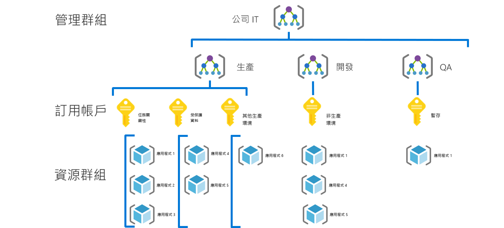
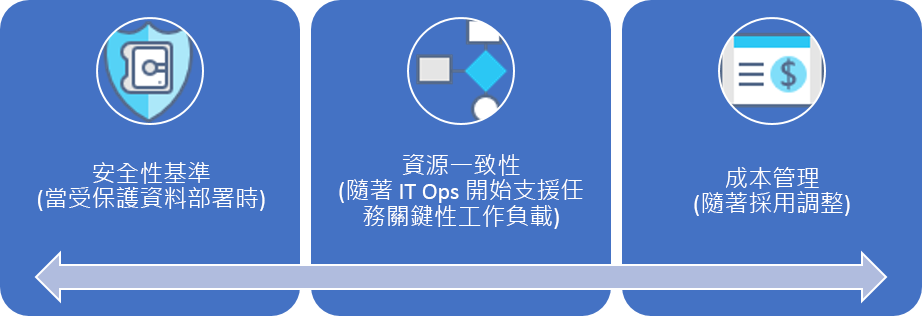

# 中小型企業治理旅程Small-to-medium enterprise governance journey

## 最佳做法概觀Best practice overview

這個治理旅程會遵循虛構公司在治理成熟度各個階段的經驗。This governance journey follows the experiences of a fictional company through various stages of governance maturity. 以實際的客戶旅程為基礎。It is based on real customer journeys. 建議的最佳做法則以虛構公司的條件約束和需求為主。The suggested best practices are based on the constraints and needs of the fictional company.

此概觀根據最佳做法定義治理的最小可行性產品 (MVP)，作為快速起點。As a quick starting point, this overview defines a minimum viable product (MVP) for governance based on best practices. 它還提供了一些治理演變的連結，這些演變會隨著新業務或技術風險的出現而進一步增加最佳做法。It also provides links to some governance evolutions that add further best practices as new business or technical risks emerge.

> [!WARNING]
> 這個 MVP 是基於一組假設的基準起點。This MVP is a baseline starting point, based on a set of assumptions. 即便是這一系列最佳做法，也是以獨特的業務風險和風險承受度推動的公司原則。Even this minimal set of best practices is based on corporate policies driven by unique business risks and risk tolerances. 若要查看這些假設是否適用於您，請閱讀本文後面[較長的敘述](./narrative.md)。To see if these assumptions apply to you, read the [longer narrative](./narrative.md) that follows this article.

## 治理最佳做法Governance best practice

這個最佳做法可作為組織用於快速一致地在多個 Azure 訂用帳戶中增加治理護欄的基礎。This best practice serves as a foundation that an organization can use to quickly and consistently add governance guardrails across multiple Azure subscriptions.

### 資源組織Resource organization

下圖顯示組織資源的治理 MVP 階層。The following diagram shows the governance MVP hierarchy for organizing resources.

每個應用程式都應該在管理群組、訂用帳戶，以及資源群組階層的適當區域中部署。Every application should be deployed in the proper area of the management group, subscription, and resource group hierarchy. 在部署規劃期間，雲端治理小組將會在階層中建立必要的節點，讓雲端採用小組更強大。During deployment planning, the Cloud Governance team will create the necessary nodes in the hierarchy to empower the cloud adoption teams.  

1. 每種類型環境 (例如生產、開發和測試) 的管理群組。A management group for each type of environment (such as Production, Development, and Test).
2. 每個「應用程式分類」的訂用帳戶。A subscription for each "application categorization".
3. 每個應用程式單獨的資源群組。A separate resource group for each application.
4. 應該在此群組階層的每個層級應用一致的命名法。Consistent nomenclature should be applied at each level of this grouping hierarchy.

以下是使用中的這種模式的一個範例：Here is an example of this pattern in use:

這些模式會提供成長的空間，而不會不必要地使階層複雜化。These patterns provide room for growth without complicating the hierarchy unnecessarily.

[!INCLUDE [governance-of-resources](../../../../../includes/cloud-adoption/governance/governance-of-resources.md)]

## 治理演變Governance evolutions

一旦部署此 MVP 之後，其他治理層就可以快速地合併到環境中。Once this MVP has been deployed, additional layers of governance can be quickly incorporated into the environment. 以下是一些 MVP 的演變方式，可符合特定的業務需求：Here are some ways to evolve the MVP to meet specific business needs:

- [受保護資料的安全性基準Security Baseline for protected data](./security-baseline-evolution.md)
- [任務關鍵性應用程式的資源設定Resource configurations for mission-critical applications](./resource-consistency-evolution.md)
- [成本管理控制Controls for Cost Management](./cost-management-evolution.md)
- [多重雲端演進的控制Controls for multi-cloud evolution](./multi-cloud-evolution.md)

<!-- markdownlint-disable MD026 -->

## 這個最佳做法有哪些用途？What does this best practice do?

在 MVP 中，從[部署加速](../../deployment-acceleration/overview.md)專業領域建立做法和工具是為了快速套用公司原則。In the MVP, practices and tools from the [Deployment Acceleration](../../deployment-acceleration/overview.md) discipline are established to quickly apply corporate policy. 特別是，MVP 會使用 Azure 藍圖、Azure 原則以及 Azure 管理群組套用幾個基本的公司原則，如這個虛構公司的敘述中所定義。In particular, the MVP uses Azure Blueprints, Azure Policy, and Azure management groups to apply a few basic corporate policies, as defined in the narrative for this fictional company. 這些公司原則是使用 Resource Manager 範本與 Azure 原則套用的，可建立非常小的身分識別和安全性基準。Those corporate policies are applied using Resource Manager templates and Azure policies to establish a very small baseline for identity and security.

## 發展最佳做法Evolving the best practice

經過一段時間之後，這個治理 MVP 將用於發展治理的做法。Over time, this governance MVP will be used to evolve the governance practices. 隨著採用率提高，業務風險也會增加。As adoption advances, business risk grows. CAF 治理模型中的各種專業領域將不斷發展以減輕這些風險。Various disciplines within the CAF governance model will evolve to mitigate those risks. 本系列的後續文章將討論影響虛構公司的公司原則演變。Later articles in this series discuss the evolution of corporate policy affecting the fictional company. 這些演變會跨三個專業領域進行：These evolutions happen across three disciplines:

- 成本管理 (隨著採用的規模)。Cost Management, as adoption scales.
- 安全性基準 (隨著受保護資料的部署)。Security Baseline, as protected data is deployed.
- 資源一致性 (隨著 IT 營運開始支援任務關鍵性工作負載)。Resource Consistency, as IT Operations begins supporting mission-critical workloads.

## 後續步驟Next steps

既然您已經熟悉治理 MVP，而且了解後續的治理演變，請閱讀其他背景的支持性敘述。Now that you’re familiar with the governance MVP and have an idea of the governance evolutions to follow, read the supporting narrative for additional context.

> [!div class="nextstepaction"]
> [閱讀支持性敘述Read the supporting narrative](./narrative.md)
