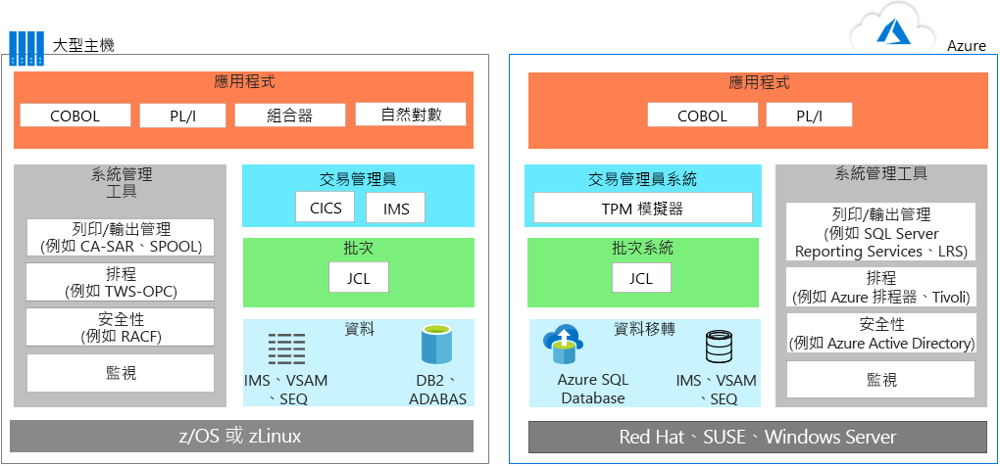
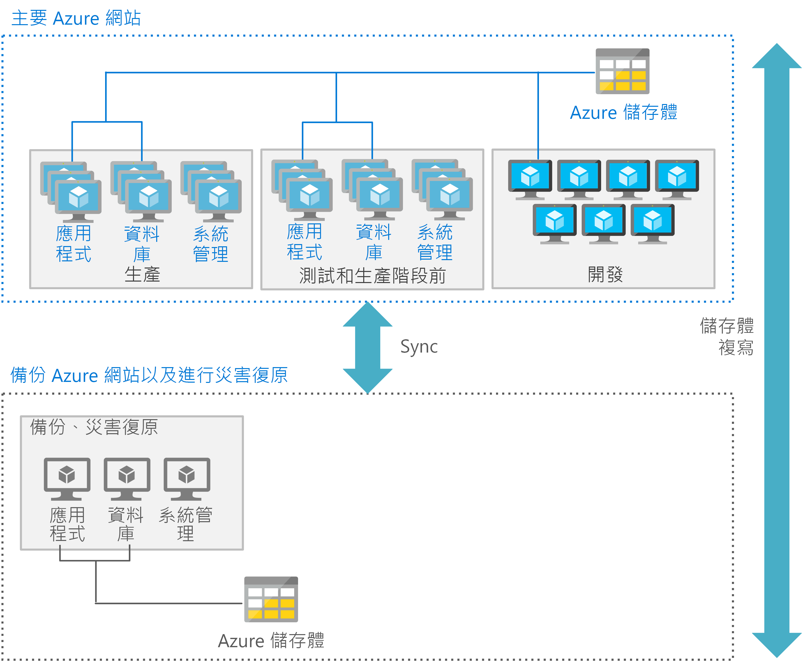

# 大型主機應用程式移轉Mainframe application migration

將應用程式從大型主機環境移轉至 Azure 時，大部分的小組都會採行務實做法：適時適地盡可能重複使用，然後再進行分階段部署，以重寫或取代應用程式。When migrating applications from mainframe environments to Azure, most teams follow a pragmatic approach: reuse wherever and whenever possible, and then start a phased deployment where applications are rewritten or replaced.

應用程式移轉通常涉及下列一或多項策略：Application migration typically involves one or more of the following strategies:

- 重新裝載：您可以從大型主機移動現有的程式碼、程式和應用程式，再重新編譯程式碼，使其可在雲端執行個體中裝載的大型主機模擬器中執行。Rehost: You can move existing code, programs, and applications from the mainframe, and then recompile the code to run in a mainframe emulator hosted in a cloud instance. 此外，此方法通常會先將應用程式移至雲端式模擬器，然後再將資料庫移轉至雲端式資料庫。This approach typically starts with moving applications to a cloud-based emulator, and then migrating the database to a cloud-based database. 在轉換資料和檔案時需要一些工程和重構。Some engineering and refactoring are required along with data and file conversions.

    或者，您可以使用傳統的主機服務提供者來重新裝載。Alternatively, you can rehost using a traditional hosting provider. 使用雲端的主要好處之一，是可以將基礎結構管理工作外包。One of the principal benefits of the cloud is outsourcing infrastructure management. 您可以找到為您裝載大型主機工作負載的資料中心提供者。You can find a datacenter provider that will host your mainframe workloads for you. 此模式可換得時間、避免廠商鎖定，以及節省臨時成本。This model may buy time, reduce vendor lock in, and produce interim cost savings.

- 淘汰：所有不再需要的應用程式，均應在移轉前淘汰。Retire: All applications that are no longer needed should be retired before migration.

- 重建：有些組織會選擇使用新式技術完全重寫程式。Rebuild: Some organizations choose to completely rewrite programs using modern techniques. 此方法會產生額外成本並增加複雜度，因此普遍性不及隨即轉移方法。Given the added cost and complexity of this approach, it’s not as common as a lift-and-shift approach. 進行此類型的移轉後，一般通常會使用程式碼轉換引擎開始取代模組和程式碼。Often after this type of migration, it makes sense to begin replacing modules and code using code transformation engines.

- 將：此方法會將大型主機功能取代為雲端中的對等功能。Replace: This approach replaces mainframe functionality with equivalent features in the cloud. 軟體即服務 (SaaS) 是選項之一，它採用專為企業需求而建立的解決方案，例如財務、人力資源、製造或企業資源規劃等領域。Software as a service (SaaS) is one option, which is using a solution created specifically for an enterprise concern, such as finance, human resources, manufacturing, or enterprise resource planning. 此外，目前也已有許多產業特定應用程式，可用來解決先前由自訂大型主機解決方案負責解決的問題。In addition, many industry-specific apps are now available to solve problems that custom mainframe solutions used to previously solve.

建議您先規劃最初要移轉的工作負載，然後再確認移動相關聯的應用程式、舊版程式碼基底和資料庫的的需求。You should consider starting by planning those workloads that you want to initially migrate, and then determine those requirements for moving associated applications, legacy codebases, and databases.

## Azure 中的大型主機模擬Mainframe emulation in Azure

Azure 雲端服務可以模擬傳統的大型主機環境，讓您重複使用現有的大型主機程式碼和應用程式。Azure cloud services can emulate traditional mainframe environments, enabling you to reuse existing mainframe code and applications. 可模擬的常見伺服器元件包括線上交易處理 (OLTP)、批次和資料擷取系統。Common server components that you can emulate include online transaction processing (OLTP), batch, and data ingestion systems.

### OLTP 系統OLTP systems

許多大型主機都有 OLTP 系統，為廣大的使用者處理數千、甚或數以百萬計的更新。Many mainframes have OLTP systems that process thousands or millions of updates for huge numbers of users. 這些應用程式常會使用交易處理和畫面表單處理軟體，例如客戶資訊控制系統 (CICS)、資訊管理 systes (IMS)，和終端機介面處理器 (TIP)。These applications often use transaction processing and screen-form handling software, such as customer information control system (CICS), information management systes (IMS), and terminal interface processor (TIP).

將 OLTP 應用程式移至 Azure 時，您可以使用 Azure 上的虛擬機器 (VM)，將大型主機交易處理 (TP) 監視器的模擬器以基礎結構即服務 (IaaS) 的形式執行。When moving OLTP applications to Azure, emulators for mainframe transaction processing (TP) monitors are available to run as infrastructure as a service (IaaS) using virtual machines (VMs) on Azure. 畫面處理和表單功能也可以由 Web 伺服器實作。The screen handling and form functionality can also be implemented by web servers. 此方法可以與 ActiveX 資料物件 (ADO)、開放式資料庫連接 (ODBC) 和 Java 資料庫連線 (JDBC) 之類的資料庫 API 結合，以進行資料存取和交易。This approach can be combined with database APIs, such as ActiveX data object (ADO), open database connectivity (ODBC), and Java database connectivity (JDBC) for data access and transactions.

### 有時間限制的批次更新Time-constrained batch updates

許多大型主機系統都會執行數百萬筆帳戶記錄每個月或年度的更新，例如銀行、保險和政府機關使用的帳戶記錄。Many mainframe systems perform monthly or annual updates of millions of account records, such as those used in banking, insurance, and government. 大型主機藉由提供高輸送量的資料處理系統來處理這些類型的工作負載。Mainframes handle these types of workloads by offering high-throughput data handling systems. 大型主機批次作業通常是循序的，且倚賴大型主機骨幹所提供每秒輸入/輸出作業 (IOPS) 來提升效能。Mainframes batch jobs are typically serial in nature and depend on the input/output operations per second (IOPS) provided by the mainframe backbone for performance.

雲端式批次環境會使用平行計算和高速網路來提升效能。Cloud-based batch environments use parallel compute and high-speed networks for performance. 如果您需要將批次效能最佳化，可以妥善利用 Azure 提供的多種計算、儲存體和網路功能選項。If you need to optimize batch performance, Azure provides various compute, storage, and networking options.

### 資料擷取系統Data ingestion systems

大型主機會從零售業、金融服務業、製造業和處理其他解決方案擷取大型批次的資料進行處理。Mainframes ingest large batches of data from retail, financial services, manufacturing, and other solutions for processing. 透過 Azure，您可以使用簡單的命令列公用程式 (例如 [AzCopy](/azure/storage/common/storage-use-azcopy)) 將資料複製到儲存體位置，或從中複製資料。With Azure, you can use simple command-line utilities such as [AzCopy](/azure/storage/common/storage-use-azcopy) for copying data to and from storage location. 您也可以使用 [Azure Data Factory](/azure/data-factory/introduction) 服務從不同的資料存放區擷取資料，以建立和排程資料驅動的工作流程。You can also use the [Azure Data Factory](/azure/data-factory/introduction) service, enabling you to ingest data from disparate data stores to create and schedule data-driven workflows.

除了模擬環境外，Azure 還提供平台即服務 (PaaS) 和分析服務，用以增強現有的大型主機環境。In addition to emulation environments, Azure provides platform as a service (PaaS) and analytics services that can enhance existing mainframe environments.

## 將 OLTP 工作負載移轉至 AzureMigrate OLTP workloads to Azure

隨即轉移方法是可將現有的應用程式快速移轉至 Azure 的無程式碼選項。The lift-and-shift approach is the no code option for quickly migrating existing applications to Azure. 每個應用程式都會依現狀移轉，因而提供使用雲端時無需承擔程式碼變更風險或費用的好處。Each application is migrated as is, which provides the benefits of the cloud without the risks or costs of making code changes. 在 Azure 上使用大型主機交易處理 (TP) 監視器的模擬器時，可支援此方法。Using an emulator for mainframe transaction processing (TP) monitors on Azure supports this approach.

您可以從不同的廠商取得 TP 監視器，並在虛擬機器上執行，這是 Azure 上的基礎結構即服務 (IaaS) 選項。TP monitors are available from various vendors and run on virtual machines, an infrastructure as a service (IaaS) option on Azure. 下列執行前後圖表顯示 IBM DB2 (關聯式資料庫管理系統 (DBMS)) 所支援的線上應用程式在 IBM z/OS 大型主機上移轉的情形。The following before and after diagrams show a migration of an online application backed by IBM DB2, a relational database management system (DBMS), on an IBM z/OS mainframe. DB2 for z/OS 會使用虛擬儲存體存取方法 (VSAM) 檔案來儲存資料，並使用索引循序存取方法 (ISAM) 來處理一般檔案。DB2 for z/OS uses virtual storage access method (VSAM) files to store the data and Indexed Sequential Access Method (ISAM) for flat files. 此架構也會使用 CICS 進行交易監視。This architecture also uses CICS for transaction monitoring.

在 Azure 上，模擬環境可用來執行 TP 管理員和使用 JCL 的批次作業。On Azure, emulation environments are used to run the TP manager and the batch jobs that use JCL. 在資料層中，DB2 會取代為 [Azure SQL Database](/azure/sql-database/sql-database-technical-overview)，但也可以使用 Microsoft SQL Server、DB2 LUW 或 Oracle Database。In the data tier, DB2 is replaced by [Azure SQL Database](/azure/sql-database/sql-database-technical-overview), although Microsoft SQL Server, DB2 LUW, or Oracle Database can also be used. 模擬器支援 IMS、VSAM 和 SEQ。An emulator supports IMS, VSAM, and SEQ. 大型主機的系統管理工具會取代為在 VM 中執行的 Azure 服務和其他廠商提供的軟體。The mainframe’s system management tools are replaced by Azure services, and software from other vendors, that run in VMs.

畫面處理和表單輸入功能通常會使用 Web 伺服器來實作，而這些伺服器可以與資料庫 API (例如 ADO、ODBC 和 JDBC) 結合，以進行資料存取和交易。The screen handling and form entry functionality is commonly implemented using web servers, which can be combined with database APIs, such as ADO, ODBC, and JDBC for data access and transactions. 所應使用的確切 Azure IaaS 元件組合，取決於您慣用的作業系統。The exact line-up of Azure IaaS components to use depends on the operating system you prefer. 例如︰For example:

- Windows 型 VM：Internet Information Server (IIS) 以及用於畫面處理和商務邏輯的 ASP.NET。Windows–based VMs: Internet Information Server (IIS) along with ASP.NET for the screen handling and business logic. 針對資料存取和交易，請使用 ADO.NET。Use ADO.NET for data access and transactions.

- Linux 型 VM：可用的 Java 型應用程式伺服器，例如用於畫面處理和 Java 商務功能的 Apache Tomcat。Linux–based VMs: The Java-based application servers that are available, such as Apache Tomcat for screen handling and Java-based business functionality. 針對資料存取和交易，請使用 JDBC。Use JDBC for data access and transactions.

## 將批次工作負載移轉至 AzureMigrate batch workloads to Azure

Azure 中的批次作業不同於大型主機上的一般批次環境。Batch operations in Azure differ from the typical batch environment on mainframes. 大型主機批次作業通常是循序的，且倚賴大型主機骨幹所提供 IOPS 來提升效能。Mainframe batch jobs are typically serial in nature and depend on the IOPS provided by the mainframe backbone for performance. 雲端式批次環境會使用平行計算和高速網路來提升效能。Cloud-based batch environments use parallel computing and high-speed networks for performance.

若要使用 Azure 將批次效能最佳化，請考慮使用[計算](/azure/virtual-machines/windows/overview)、[儲存體](/azure/storage/blobs/storage-blobs-introduction)、[網路](https://azure.microsoft.com/blog/maximize-your-vm-s-performance-with-accelerated-networking-now-generally-available-for-both-windows-and-linux/)和[監視](/azure/azure-monitor/overview)選項，如下所示。To optimize batch performance using Azure, consider the [compute](/azure/virtual-machines/windows/overview), [storage](/azure/storage/blobs/storage-blobs-introduction), [networking](https://azure.microsoft.com/blog/maximize-your-vm-s-performance-with-accelerated-networking-now-generally-available-for-both-windows-and-linux/), and [monitoring](/azure/azure-monitor/overview) options as follows.

### 計算Compute

使用︰Use:

- 具有最高時脈速度的 VM。VMs with the highest clock speed. 大型電腦應用程式通常使用單一執行緒，且大型主機 CPU 具有相當高的時脈速度。Mainframe applications are often single-threaded and mainframe CPUs have a very high clock speed.

- 具有高記憶體容量的 VM 可支援資料和應用程式工作區域的快取。VMs with large memory capacity to allow caching of data and application work areas.

- 如果應用程式支援多個執行緒，則具有高密度 vCPU 的 VM 將可充分發揮多執行緒處理的效益。VMs with higher density vCPUs to take advantage of multi-threaded processing if the application supports multiple threads.

- 平行處理，因為 Azure 可輕易相應放大以進行平行處理，為批次執行提供更多計算能力。Parallel processing, as Azure easily scales out for parallel processing, delivering more compute power for a batch run.

### 儲存體Storage

使用︰Use:

- [Azure 進階 SSD](/azure/virtual-machines/windows/premium-storage) 或 [Azure Ultra SSD](/azure/virtual-machines/windows/disks-ultra-ssd)，以獲得最大的可用 IOPS。[Azure Premium SSD](/azure/virtual-machines/windows/premium-storage) or [Azure Ultra SSD](/azure/virtual-machines/windows/disks-ultra-ssd) for maximum available IOPS.

- 將多個磁碟等量分割，使每個儲存體大小有更多 IOPS。Striping with multiple disks for more IOPS per storage size.

- 分割儲存體，以將 IO 分散到多個 Azure 儲存體裝置。Partitioning for storage to spread IO over multiple Azure storage devices.

### 網路功能Networking

- 使用 [Azure 加速網路](/azure/virtual-network/create-vm-accelerated-networking-powershell)，以盡可能降低延遲。Use [Azure Accelerated Networking](/azure/virtual-network/create-vm-accelerated-networking-powershell) to minimize latency.

### 監視Monitoring

- 使用 [Azure 監視器](/azure/azure-monitor/overview)、[Azure Application Insights](/azure/application-insights/app-insights-overview) 甚至 Azure 記錄等監視工具，讓系統管理員能夠監視批次執行的過度效能，並協助消除瓶頸。Use monitoring tools, [Azure Monitor](/azure/azure-monitor/overview), [Azure Application Insights](/azure/application-insights/app-insights-overview), and even the Azure logs enable administrators to monitor any over performance of batch runs and help eliminate bottlenecks.

## 移轉開發環境Migrate development environments

雲端的分散式架構依賴一組不同的開發工具，以提供新式作法和程式設計語言的優勢。The cloud’s distributed architectures rely on a different set of development tools that provide the advantage of modern practices and programming languages. 為了簡化這項轉換，您可以將開發環境與其他專為模擬 IBM z/OS 環境而設計的工具搭配使用。To ease this transition, you can use a development environment with other tools that are designed to emulate IBM z/OS environments. 下列清單顯示 Microsoft 和其他廠商提供的選項：The following list shows options from Microsoft and other vendors:

| 元件Component        | Azure 選項Azure Options                                                                                                                                  |
|------------------|---------------------------------------------------------------------------------------------------------------------------------------------------|
| z/OSz/OS             | Windows、Linux 或 UNIXWindows, Linux, or UNIX                                                                                                                      |
| CICSCICS             | Micro Focus、Oracle、GT Software (Fujitsu)、TmaxSoft、Raincode 和 NTT Data 所提供的 Azure 服務，或使用 Kubernetes 重寫Azure services offered by Micro Focus, Oracle, GT Software (Fujitsu), TmaxSoft, Raincode, and NTT Data, or rewrite using Kubernetes |
| IMSIMS              | Micro Focus 和 Oracle 所提供的 Azure 服務Azure services offered by Micro Focus and Oracle                                                                                  |
| 組合器Assembler        | Raincode 和 TmaxSoft 所提供的 Azure 服務；或 COBOL、C 或 Java，或對應至作業系統功能Azure services from Raincode and TmaxSoft; or COBOL, C, or Java, or map to operating system functions               |
| JCLJCL              | JCL、PowerShell 或其他指令碼工具JCL, PowerShell, or other scripting tools                                                                                                   |
| COBOLCOBOL            | COBOL、C 或 JavaCOBOL, C, or Java                                                                                                                            |
| NaturalNatural          | Natural、COBOL、C 或 JavaNatural, COBOL, C, or Java                                                                                                                  |
| FORTRAN 和 PL/IFORTRAN and PL/I | FORTRAN、PL/I、COBOL、C 或 JavaFORTRAN, PL/I, COBOL, C, or Java                                                                                                           |
| REXX 和 PL/IREXX and PL/I    | REXX、PowerShell 或其他指令碼工具REXX, PowerShell, or other scripting tools                                                                                                  |

## 移轉資料庫和資料Migrate databases and data

應用程式移轉通常牽涉到重新裝載資料層。Application migration usually involves rehosting the data tier. 透過 [Azure 資料庫移轉服務](/azure/dms/dms-overview)，您可以將 SQL Server、開放原始碼及其他關聯式資料庫移轉至 Azure 上完全受控的解決方案，例如 [Azure SQL Database 受控執行個體](/azure/sql-database/sql-database-managed-instance)、[適用於 PostgreSQL 的 Azure 資料庫服務](/azure/postgresql/overview)和[適用於 MySQL 的 Azure 資料庫](/azure/mysql/overview)。You can migrate SQL Server, open-source, and other relational databases to fully-managed solutions on Azure, such as [Azure SQL Database Managed Instance](/azure/sql-database/sql-database-managed-instance), [Azure Database Service for PostgreSQL](/azure/postgresql/overview), and [Azure Database for MySQL](/azure/mysql/overview) with [Azure Database Migration Service](/azure/dms/dms-overview).

例如，如果大型主機資料層使用下列項目，則可以進行移轉：For example, you can migrate if the mainframe data tier uses:

- IBM DB2 或 IMS 資料庫，請在 Azure 上使用 Azure SQL Database、SQL Server、DB2 LUW 或 Oracle Database。IBM DB2 or an IMS database, use Azure SQL database, SQL Server, DB2 LUW, or Oracle Database on Azure.

- VSAM 和其他一般檔案，請對 Azure SQL、SQL Server、DB2 LUW 或 Oracle 使用索引循序存取方法 (ISAM) 一般檔案。VSAM and other flat files, use Indexed Sequential Access Method (ISAM) flat files for Azure SQL, SQL Server, DB2 LUW, or Oracle.

- Generation Date Group (GDG)，請移轉至 Azure 上使用具有 GDG 類似功能的命名慣例和副檔名的檔案。Generation Date Groups (GDGs), migrate to files on Azure that use a naming convention and filename extensions that provide similar functionality to GDGs.

IBM 資料層包含數個您也必須移轉的重要元件。The IBM data tier includes several key components that you must also migrate. 例如，在移轉資料庫時，您也應移轉集區中包含的資料集合，因為其中包含 dbextents，這是 z/OS VSAM 資料集。For example, when you migrate a database, you also migrate a collection of data contained in pools, each containing dbextents, which are z/OS VSAM data sets. 移轉必須包含目錄以識別資料在儲存體集區中的位置。Your migration must include the directory that identifies data locations in the storage pools. 此外，您的移轉計劃必須考量資料庫記錄，其中包含在資料庫上執行作業的記錄。Also, your migration plan must consider the database log, which contains a record of operations performed on the database. 一個資料庫可以有一個、兩個 (雙重或替代) 或四個 (雙重和替代) 記錄。A database can have one, two (dual or alternate), or four (dual and alternate) logs.

資料庫移轉也包含下列元件：Database migration also includes these components:

- 資料庫管理員：提供對資料庫中所含資料的存取權。Database manager: Provides access to data in the database. 在 z/OS 環境中，資料庫管理員會在其本身的分割區中執行。The database manager runs in its own partition in a z/OS environment.

- 應用程式要求者：接受來自應用程式的要求，然後將其傳至應用程式伺服器。Application requester: Accepts requests from applications before passing them to an application server.

- 線上資源配接器：包含用於 CICS 交易中的應用程式要求者元件。Online resource adapter: Includes application requester components for use in CICS transactions.

- 批次資源配接器：實作 z/OS 批次應用程式的應用程式要求者元件。Batch resource adapter: Implements application requester components for z/OS batch applications.

- 互動式 SQL (ISQL)：以 CICS 應用程式和介面的形式執行，讓使用者能夠輸入 SQL 陳述式或運算子命令。Interactive SQL (ISQL): Runs as a CICS application and interface enabling users to enter SQL statements or operator commands.

- CICS 應用程式：使用 CICS 中的可用資源和資料來源，在 CICS 的控制下執行。CICS application: Runs under the control of CICS, using available resources and data sources in CICS.

- Batch 應用程式：執行處理邏輯而無須與使用者進行互動式通訊，例如，產生大量資料更新，或從資料庫產生報表。Batch application: Runs process logic without interactive communication with users to, for example, produce bulk data updates or generate reports from a database.

## 最佳化 Azure 的規模和輸送量Optimize scale and throughput for Azure

一般而言，大型主機會相應增加，而雲端則會相應放大。若要對執行於 Azure 上的大型主機式應用程式進行規模和輸送量的最佳化，請務必了解大型主機如何區隔和隔離應用程式。Generally speaking, mainframes scale up, while the cloud scales out. To optimize scale and throughput of mainframe-style applications running on Azure, it is important that you understand at how mainframes can separate and isolate applications. z/OS 大型主機會使用名為「邏輯分割區」(LPARS) 的功能，來隔離及管理單一執行個體上特定應用程式的資源。A z/OS mainframe uses a feature called Logical Partitions (LPARS) to isolate and manage the resources for a specific application on a single instance.

例如，大型主機可能會對具有相關 COBOL 程式的 CICS 區域使用一個邏輯分割區 (LPAR)，並且對 DB2 使用另一個 LPAR。For example, a mainframe might use one logical partition (LPAR) for a CICS region with associated COBOL programs, and a separate LPAR for DB2. 其他 LPAR 通常用於開發、測試和預備環境。Additional LPARs are often used for the development, testing, and staging environments.

在 Azure 上，常會使用個別的 VM 來達到此目的。On Azure, it’s more common to use separate VMs to serve this purpose. Azure 架構通常會為應用程式層部署 VM、為資料層部署不同一組 VM，且再部署另一組用於開發，依此類推。Azure architectures typically deploy VMs for the application tier, a separate set of VMs for the data tier, another set for development, and so on. 每個處理層都可使用最適合該環境的 VM 類型和功能進行最佳化。Each tier of processing can be optimized using the most suitable type of VMs and  features for that environment.

此外，每一層也都可提供適當的災害復原服務。In addition, each tier can also provide appropriate disaster recovery services. 例如，生產環境和資料庫 VM 可能需要熱復原或暖復原，而開發和測試 VM 則支援冷復原。For example, production and database VMs might require a hot or warm recovery, while the development and testing VMs support a cold recovery.

下圖顯示使用主要和次要站台的可能 Azure 部署。The following figure shows a possible Azure deployment using a primary and a secondary site. 在主要站台中，會為生產、生產階段前和測試 VM 部署高可用性。In the primary site, the production, preproduction, and testing VMs are deployed with high availability. 次要站台供備份和災害復原之用。The secondary site is for backup and disaster recovery.

## 執行從大型主機至 Azure 的分段移轉Perform a staged mainframe to Azure

要將解決方案從大型主機移至 Azure 可能需執行*分段*移轉，藉以讓某些應用程式先移轉，而讓其他應用程式暫時或永久保留在大型主機上。Moving solutions from a mainframe to Azure may involve a *staged* migration, whereby some applications are moved first, and others remain on the mainframe temporarily or permanently. 使用此方法時，系統通常必須允許應用程式和資料庫在大型主機與 Azure 之間交互操作。This approach typically requires systems that allow applications and databases to interoperate between the mainframe and Azure.

常見的案例是，將應用程式移至 Azure，但將應用程式所使用的資料保留在大型主機上。A common scenario is to move an application to Azure while keeping the data used by the application on the mainframe. 您可以使用特定軟體讓 Azure 上的應用程式可從大型主機存取資料。Specific software is used to enable the applications on Azure to access data from the mainframe. 幸運的是，有許多解決方案都提供 Azure 與現有大型主機環境的整合功能、混合式案例的支援，以及長時間的漸進移轉。Fortunately, a wide range of solutions provide integration between Azure and existing mainframe environments, support for hybrid scenarios, and migration over time. Microsoft 合作夥伴、獨立軟體廠商和系統整合商皆可協助您展開此程序。Microsoft partners, independent software vendors, and system integrators can help you on your journey.

其中一個選項是 [Microsoft Host Integration Server](/host-integration-server) (HIS)，此解決方案可提供必要的分散式關聯資料庫架構 (DRDA)，讓 Azure 中的應用程式能夠存取保留在大型主機上的 DB2 資料。One option is [Microsoft Host Integration Server](/host-integration-server) (HIS), a solution that provides the distributed relational database architecture (DRDA) required for applications in Azure to access data in DB2 that remains on the mainframe. 將大型主機整合至 Azure 的其他選項包括 IBM、Attunity、Codit、其他廠商所提供的解決方案，和開放原始碼選項。Other options for mainframe-to-Azure integration include solutions from IBM, Attunity, Codit, other vendors, and open source options.

## 合作夥伴解決方案Partner solutions

如果您考慮進行大型主機移轉，合作夥伴生態系統將可協助您。If you are considering a mainframe migration, the partner ecosystem is available to assist you.

Azure 提供經過實證、高度可用且可調整的基礎結構，適用於目前在大型主機上執行的系統。Azure provides a proven, highly available, and scalable infrastructure for systems that currently run on mainframes. 某些工作負載比較容易移轉。Some workloads can be migrated with relative ease. 其他依賴舊式系統軟體 (例如 CICS 與 IMS) 的工作負載，可以使用合作夥伴解決方案重新裝載，再分階段移轉至 Azure。Other workloads that depend on legacy system software, such as CICS and IMS, can be rehosted using partner solutions and migrated to Azure over time. 無論您如何選擇，Microsoft 與合作夥伴都很樂意協助您達成 Azure 的最佳化，同時保有大型主機系統軟體功能。Regardless of the choice you make, Microsoft and our partners are available to assist you in optimizing for Azure while maintaining mainframe system software functionality.

如需選擇合作夥伴解決方案的詳細指引，請參閱 [Platform Modernization Alliance](https://www.platformmodernization.org/pages/mainframe.aspx)。For detailed guidance about choosing a partner solution, refer to the [Platform Modernization Alliance](https://www.platformmodernization.org/pages/mainframe.aspx).

## 深入了解Learn more

如需詳細資訊，請參閱下列資源：For more information, see the following resources:

- [開始使用 AzureGet started with Azure](/azure)

- [Platform Modernization Alliance：大型主機移轉Platform Modernization Alliance: Mainframe migration](https://www.platformmodernization.org/pages/mainframe.aspx)

- [在 Azure 上部署 IBM DB2 pureScaleDeploy IBM DB2 pureScale on Azure](https://azure.microsoft.com/resources/deploy-ibm-db2-purescale-on-azure)

- [Host Integration Server (HIS) 文件Host Integration Server (HIS) documentation](/host-integration-server)
