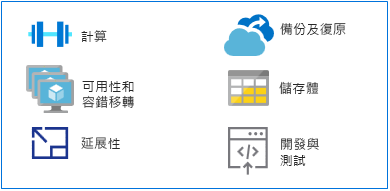

# 從大型主機切換至 AzureMake the switch from mainframes to Azure

作為執行傳統大型主機應用程式的替代平台，Azure 在高可用性環境中提供超大規模的計算能力和儲存體。As an alternative platform for running traditional mainframe applications, Azure offers hyperscale compute and storage in a high availability environment. 您可以取得現代化雲端式平台的價值和靈活性，而不需要與大型主機環境相關的成本。You get the value and agility of a modern, cloud-based platform without the costs associated with a mainframe environment.

本節提供從大型主機平台切換至 Azure 的技術指導。This section provides technical guidance for making the switch from a mainframe platform to Azure.

## MIPS 與 vCPUMIPS vs. vCPUs

沒有任何通用對應公式可判斷執行大型主機工作負載所需的虛擬中央處理器 (vCPU) 數量。There is no universal mapping formula that exists for determining the amount of virtual central processing units (vCPUs) needed to run mainframe workloads. 不過，每秒百萬指令數 (MIPS) 計量通常會對應至 Azure 上的 vCPU。However, the metric of a million instructions per second (MIPS) is often mapped to vCPUs on Azure. MIPS 透過針對指定電腦提供常數值的每秒循環次數，來測量大型主機的整體計算能力。MIPS measures the overall compute power of a mainframe by providing a constant value of the number of cycles per second for a given machine.

小型組織可能需要低於 500 MIPS，而大型組織通常需要超過 5,000 MIPS。A small organization might require less than 500 MIPS, while a large organization typically uses more than 5,000 MIPS. 假設每單一 MIPS 需要 $1000 美元的情況下，大型組織每年需花費大約 5 百萬美元來部署 5,000 MIPS 的基礎結構。At $1,000 per single MIPS, a large organization spends approximately $5 million annually to deploy a 5,000-MIPS infrastructure. 針對此規模的一般 Azure 部署，每年的成本評估大約是 MIPS 基礎結構的十分支一。The annual cost estimate for a typical Azure deployment of this scale is approximately one-tenth the cost of a MIPS infrastructure. 如需詳細資訊，請參閱 [Azure 移轉的大型主機釋疑](https://azure.microsoft.com/resources/demystifying-mainframe-to-azure-migration) \(英文\) 白皮書中的表格 4。For details, see Table 4 in the [Demystifying Mainframe-to-Azure Migration](https://azure.microsoft.com/resources/demystifying-mainframe-to-azure-migration) white paper.

MIPS 與 Azure 的 vCPU 對應的精確計算，取決於 vCPU 的類型和實際執行的工作負載。An accurate calculation of MIPS to vCPUs with Azure depends on the type of vCPU and the exact workload you are running. 不過，基準測試研究可提供良好的基準，供您預估將需要的 vCPU 數目和類型。However, benchmark studies provide a good basis for estimating the number and type of vCPUs you will need. 最近的 [HPE zREF 基準測試](https://h20195.www2.hpe.com/v2/getpdf.aspx/4aa4-2452enw.pdf) \(英文\) 可提供下列評估：A recent [HPE zREF benchmark](https://h20195.www2.hpe.com/v2/getpdf.aspx/4aa4-2452enw.pdf) provides the following estimates:

- 針對線上 (CICS) 作業，每個在 HP Proliant 伺服器上執行的 Intel 型核心為 288 MIPS。288 MIPS per Intel-based core running on HP Proliant servers for online (CICS) jobs.

- 針對 COBOL 批次作業，每個 Intel 核心為 170 MIPS。170 MIPS per Intel core for COBOL batch jobs.

本指南評估每個 vCPU 針對線上處理作業為 200 MIPS，針對批次處理作業為 100 MIPS。This guide estimates 200 MIPS per vCPU for online processing and 100 MIPS per vCPU for batch processing.

> [!NOTE]
> 這些評估可能會因 Azure 中提供新的虛擬機器 (VM) 系列而有所變更。These estimates are subject to change as new virtual machine (VM) series become available in Azure.

## 高可用性和容錯移轉High availability and failover

當使用大型主機耦合與 Parallel Sysplex 時，大型主機系統通常會提供五個 9 的可用性 (99.999%)。Mainframe systems often offer five 9s availability (99.999 percent) when mainframe coupling and Parallel Sysplex are used. 但是系統操作員仍需要為了維護和初始程式載入來排程停機時間。Yet system operators still need to schedule downtime for maintenance and initial program loads (IPLs). 實際的可用性接近兩個或三個 9，與高階的 Intel 型伺服器相當。The actual availability approaches two or three 9s, on par with high end, Intel-based servers.

相較之下，Azure 提供以服務等級協定 (SLA) 為基礎的承諾，預設便提供多個 9 的可用性，且透過服務的本機或異地複寫最佳化。By comparison, Azure offers commitment-based service level agreements (SLAs), where multiple 9s availability is the default, optimized with local or geo-based replication of services.

Azure 藉由從多個儲存體裝置 (可能是本機或在其他地理區域中) 複寫資料，提供額外的可用性。Azure provides additional availability by replicating data from multiple storage devices, either locally or in other geographic regions. 萬一發生 Azure 失敗，計算資源可以存取本機或區域層級的複寫資料。In the event of an Azure-based failure, compute resources can access the replicated data on either the local or regional level.

當您使用 Azure 平台作為服務 (PaaS) 資源時 (例如 [Azure SQL Database](/azure/sql-database/sql-database-technical-overview) 和 [Azure Cosmos Database](/azure/cosmos-db/introduction))，Azure 可以自動處理容錯移轉。When you use Azure platform as a service (PaaS) resources, such as [Azure SQL Database](/azure/sql-database/sql-database-technical-overview) and [Azure Cosmos Database](/azure/cosmos-db/introduction), Azure can automatically handle failovers. 當您使用 Azure 基礎結構作為服務 (IaaS) 時，容錯移轉會仰賴特定的系統功能，例如 SQL Server AlwaysOn 功能、容錯移轉叢集執行個體和可用性群組。When you use Azure infrastructure as a service (IaaS), failover relies on specific system functionality, such as SQL Server AlwaysOn features, failover clustering instances, and availability groups.

## 延展性Scalability

大型主機通常是相應增加，而雲端環境是相應放大。大型主機可使用耦合工具 (CF) 相應放大，但硬體和儲存體的高成本會使大型主機的相應放大成本非常昂貴。Mainframes typically scale up, while cloud environments scale out. Mainframes can scale out with the use of a coupling facility (CF), but the high costs of hardware and storage makes mainframes very expensive to scale out.

此外，CF 提供緊密耦合的計算能力，而 Azure 的相應放大功能耦合較為鬆散。In addition, a CF offers tightly coupled compute, whereas the scale-out features of Azure are loosely coupled. 雲端可以透過以使用量為基礎的計費模型，根據需求調整計算能力、儲存體和服務，來相應增加或減少以符合使用者的規格。The cloud can scale up or down to match exact user specifications, with compute power, storage, and services scaling on demand under a usage-based billing model.

## 備份與復原Backup and recovery

大型主機客戶通常會保留災害復原網站，或使用獨立的大型主機提供者作為災害應變措施。Mainframe customers typically maintain disaster recovery sites or make use or an independent mainframe provider for disaster contingencies. 與災害復原網站的同步處理，通常是透過離線資料複本來完成。Synchronization with a disaster recovery site is usually done through offline copies of data. 這兩個選項都會產生高度成本。Both options incur high costs.

透過大型主機耦合工具也可提供自動化異地備援，雖然費用很高，且通常會保留用於任務關鍵性系統。Automated geo-redundancy is also available through the mainframe coupling facility, albeit at great expense, and is usually reserved for mission-critical systems. 相反地，Azure 擁有容易實作且符合成本效益的選項，在本機或區域層級 (或透過異地備援) 提供[備份](/azure/backup/backup-introduction-to-azure-backup)、[復原](/azure/site-recovery/site-recovery-overview)和[備援](/azure/storage/common/storage-redundancy)。In contrast, Azure has easy-to-implement and cost-effective options for [backup](/azure/backup/backup-introduction-to-azure-backup), [recovery](/azure/site-recovery/site-recovery-overview), and [redundancy](/azure/storage/common/storage-redundancy) at local or regional levels, or via geo-redundancy.

## 儲存體Storage

了解大型主機的運作如何牽涉解碼各種重疊的詞彙。Part of understanding how mainframes work involves decoding various overlapping terms. 例如，中央儲存體、實際記憶體，實際儲存體和主要儲存體，通常都是指直接連接到大型主機處理器的儲存體。For example, central storage, real memory, real storage, and main storage all generally refer to storage attached directly to the mainframe processor.

大型主機硬體包含處理器和許多其他裝置，例如直接存取存放裝置 (DASD)、磁帶機，以及各種類型的使用者主控台。Mainframe hardware includes processors and many other devices, such as direct access storage devices (DASDs), magnetic tape drives, and several types of user consoles. 磁帶和 DASD 用於系統功能和使用者程式。Tapes and DASDs are used for system functions and by user programs.

大型主機的實體儲存體類型包括：Types of physical storage for mainframes include:

- 中央儲存體：直接位於大型主機的處理器上，也稱為處理器或實際儲存體。Central storage: Located directly on the mainframe processor, this is also known as processor or real storage.

- 輔助儲存體：與大型主機位在不同地方，此類型包含 DASD 上的儲存體，也稱為分頁儲存體。Auxiliary storage: Located separately from the mainframe, this type includes storage on DASDs and is also known as paging storage.

雲端提供一組有彈性、可擴充的選項，且您只要為所需的那些選項付費。The cloud offers a range of flexible, scalable options, and you will pay only for those options that you need. [Azure 儲存體](/azure/storage/common/storage-introduction)提供可大幅調整的資料物件存放區、雲端檔案系統服務、可靠的訊息存放區，以及 NoSQL 存放區。[Azure Storage](/azure/storage/common/storage-introduction) offers a massively scalable object store for data objects, a file system service for the cloud, a reliable messaging store, and a NoSQL store. 針對 VM，受控和非受控磁碟可提供安全的永續性磁碟儲存體。For VMs, managed and unmanaged disks provide persistent, secure disk storage.

## 大型主機的開發與測試Mainframe development and testing

在大型主機移轉專案中的主要磁碟機，是應用程式開發的變化面。A major driver in mainframe migration projects is the changing face of application development. 組織希望開發環境針對業務需求能更靈活且反應更迅速。Organizations want their development environment to be more agile and responsive to business needs.

大型主機通常會有個別的邏輯分割區 (LPAR) 用於開發和測試，例如 QA 和暫存 LPAR。Mainframes typically have separate logical partitions (LPARs) for development and testing, such as QA and staging LPARs. 大型主機開發解決方案包括編譯器 (COBOL、PL/I、Assembler) 和編輯器。Mainframe development solutions include compilers (COBOL, PL/I, Assembler) and editors. 最常見的情況是在 IBM 大型主機上執行的 z/OS 作業系統的 Interactive System Productivity Facility (ISPF)。The most common is the Interactive System Productivity Facility (ISPF) for the z/OS operating system that runs on IBM mainframes. 其他包含 ROSCOE Programming Facility (RPF) 和電腦相關工具，例如 CA Librarian 和 CA-Panvalet。Others include ROSCOE Programming Facility (RPF) and Computer Associates tools, such as CA Librarian and CA-Panvalet.

模擬環境和編譯器可在 x86 平台上使用，因此開發和測試通常是從大型主機移轉至 Azure 的第一個工作負載。Emulation environments and compilers are available on x86 platforms, so development and testing can typically be among the first workloads to migrate from a mainframe to Azure. [Azure 中的 DevOps 工具](https://azure.microsoft.com/solutions/devops/)的可用性和廣泛使用，正在加速開發和測試環境的移轉。The availability and widespread use of [DevOps tools in Azure](https://azure.microsoft.com/solutions/devops/) is accelerating the migration of development and testing environments.

當解決方案已開發完成並在 Azure 上經過測試，且已準備好部署至大型主機，您將需要複製程式碼到大型主機並在該處進行編譯。When solutions are developed and tested on Azure and are ready for deployment to the mainframe, you will need to copy the code to the mainframe and compile it there.

## 後續步驟Next steps

> [!div class="nextstepaction"]
> [大型主機應用程式移轉Mainframe application migration](application-strategies.md)
