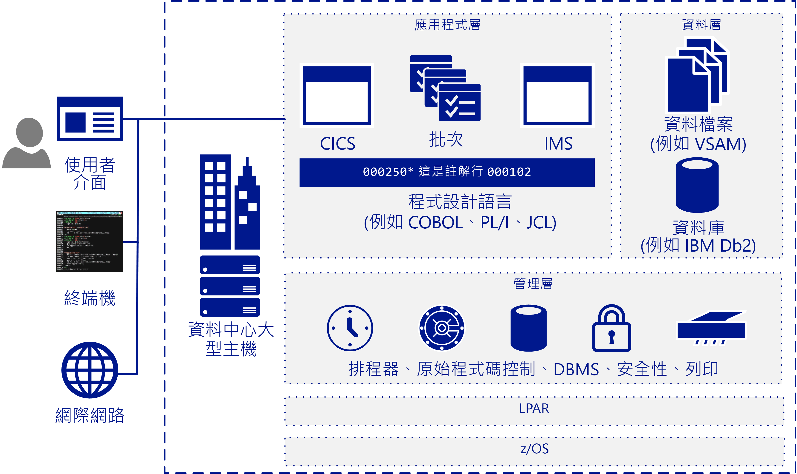

# 大型主機移轉概觀

許多公司和組織，受益於將部分或所有其大型主機工作負載、應用程式和資料庫移動至雲端。 Azure 以雲端規模提供類似大型主機的功能，而沒有許多與大型主機相關聯的缺點。

大型主機一詞通常是指大型電腦系統，但大多數目前部署的大型主機都是 IBM System Z 伺服器或執行 MVS、DOS、VSE、OS/390 或 z/OS 的 IBM Plug-Compatible 系統。 大型主機系統繼續在許多產業中用來執行重要資訊系統，它們在高度特定案例 (如大型、大量、交易密集的 IT 環境) 中佔一席之地。

遷移至雲端可讓公司將其基礎結構現代化。 您可以使用雲端服務製作大型應用程式，而且它們能以工作負載的形式提供價值，當您的組織需要時隨時可取得。 許多工作負載只要稍微變更程式碼 (如更新資料庫的名稱) 就可以傳輸至 Azure。 您可以使用分段式方法來遷移更複雜的工作負載。

大部分的財星 500 大公司都已經將 Azure 用於重要工作負載。 Azure 大幅提升盈餘的優點刺激了許多移轉專案。 公司通常會先將開發和測試工作負載移動至 Azure，然後是 DevOps、電子郵件和災害復原即服務。

## 目標對象

如果您考慮要為您的 IT 環境進行移轉或新增雲端服務等選項，則本指南非常適合您。

本指導方針可協助 IT 組織開始移轉對話。 相較於大型主機您可能比較熟悉 Azure 和雲端式基礎結構，因此本指南從大型主機運作方式的概觀開始，然後是用於判斷遷移項目和遷移方法的策略。

## 大型主機架構

在 1950 年代晚期，大型主機是設計成相應增加伺服器，以執行大量線上交易和批次處理。 因此，大型主機有適用於線上交易的表單軟體 (又稱為綠色畫面)，以及處理批次執行的高效能 I/O 系統。

大型主機具有高可靠性和高可用性的優良聲譽，且因能夠執行大型線上交易與批次工作而聞名。 交易是單一要求起始之處理的結果，此要求通常是來自在終端機的使用者。 交易也可能來自多個其他來源，包括網頁、遠端工作站，以及其他資訊系統的應用程式。 交易也可以在預先定義的時間自動觸發，如下圖所示。

典型 IBM 大型主機架構包含這些共同元件：

- **前端系統：** 使用者可以從終端機、網頁或遠端工作站起始交易。 大型主機應用程式通常會有自訂的使用者介面，在移轉至 Azure 之後仍可保留這些介面。 終端機模擬器仍用於存取大型主機應用程式，而且也稱為綠畫面終端機。

- **應用程式層：** 大型主機通常包含客戶資訊管理系統 (CICS)，這是適用於 IBM z/OS 大型主機的先進交易管理套件，通常會搭配 IBM Information Management System (IMS) 訊息型交易管理員使用。 批次系統為大量帳戶記錄處理高輸送量資料更新。

- **程式碼：** 大型主機使用的程式設計語言包括 COBOL、Fortran、PL/I 和 Natural。 工作控制語言 (JCL) 是用來搭配 z/OS 的。

- **資料庫層：** 常見適用於 z/OS 的關聯式資料庫管理系統 (DBMS) 是 IBM DD2。 它會管理稱為 *dbspaces* 的資料結構，它包含一或多個資料表，並且會指派給稱為 *dbextents* 的實體資料集儲存體集區。 兩個重要資料庫元件為識別儲存體集區中資料位置的目錄，以及包含資料庫上執行之作業記錄的記錄檔。 支援各種不同的一般檔案資料格式。 適用於 z/OS 的 DB2 通常會使用虛擬儲存體存取方法 (VSAM) 資料集來儲存資料。

- **管理層：** IBM 大型主機包括排程軟體 (如 TWS OPC)、列印和輸出管理工具 (如 CA-SAR 和 SPOOL)，以及程式碼的原始檔控制系統。 z/OS 的安全存取控制是由資源存取控制設施 (RACF) 處理。 資料庫管理員提供資料庫中資料的存取權，並且在 z/OS 環境中其自己的分割區執行。

- **LPAR：** 邏輯分割區 (或 LPAR) 會用於分割電腦資源。 實體大型主機會分割成多個 LPAR。

- **z/OS：** 最常用於 IBM 大型主機的 64 位元作業系統。

IBM 系統使用 CICS 等交易監視器來追蹤及管理商務交易的所有層面。 CICS 管理資源共用、資料完整性和執行的優先順序。 CICS 會授權使用者、配置資源，並依應用程式將資料庫要求傳遞至資料庫管理員 (如 IBM DB2)。

針對更精確的微調，CICS 通常會與 IMS/TM (先前稱為 IMS/資料通訊或 IMS/DC) 搭配使用。 IMS 的用意是藉由維護單一資料複本來減少資料備援。 它藉由維護整個程序的狀態，並將商務功能資料記錄在存放區中，以作為交易監視器來補充 CICS。

## 大型主機作業

下列是典型的大型主機作業：

- **線上：** 工作負載包括交易處理、資料庫管理和連線。 它們通常使用 IBM DB2、CICS 和 z/OS 連接器來實作。

- **批次：** 執行工作不需要使用者互動，且通常定期排程 (如在工作日的早上)。 批次工作可以使用 JCL 模擬器 (如 Micro Focus Enterprise Server 或 BMC Control-M 軟體)，在以 Windows 或 Linux 為基礎的系統上執行。

- **工作控制語言 (JCL)：** 指定處理批次作業所需的資源。 JCL 透過一組作業控制陳述式將此資訊傳達至 z/OS。 基本 JCL 包含六種陳述式：JOB、ASSGN、DLBL、EXTENT、LIBDEF、EXEC。 作業可包含數個 EXEC 陳述式 (步驟)，且每個步驟可以有數個 LIBDEF、ASSGN、DLBL 和 EXTENT 陳述式。

- **初始程式負載 (IPL)：** 是指從磁碟載入作業系統複本到處理器的實際儲存體並執行它。 IPL 是用來從停機時間復原的。 IPL 就像在 Windows 或 Linux VM 上啟動作業系統。

## 後續步驟

> [!div class="nextstepaction"]
> [迷思與事實](myths-and-facts.md)
