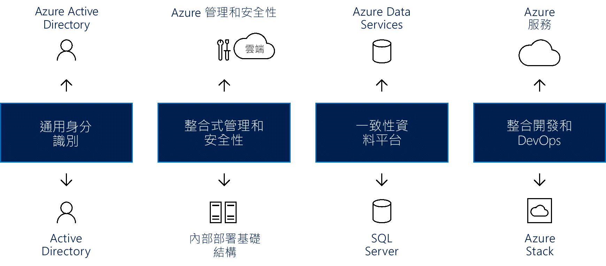

# 建立混合式雲端一致性

本文將引導您完成建立混合式雲端一致性的概略方法。

混合式部署模型在移轉期間可以降低風險，並提供順暢的基礎結構轉換。 在處理商務程序時，雲端平台可提供最高等級的彈性。 許多組織對於移至雲端抱持著遲疑，而寧願保留最機密資料的完整控制權。 遺憾的是，內部部署伺服器不允許與雲端相同的創新速率。 混合式雲端解決方案可讓您兼得魚與熊掌：雲端創新的速度和安心的內部部署管理。

## 整合混合式雲端一致性

使用混合式雲端解決方案可讓組織調整運算資源。 它也消除為了處理短期需求高峰而支出大規模資本的需求。 當業務變更而需要針對更敏感的資料或應用程式釋出本機資源時，取消佈建雲端資源更輕鬆、更快速且成本較低。 您只需要為組織暫時使用的那些資源付費，而不需要購買及維護額外資源。 這樣可減少可能長時間維持在閒置狀態的設備數量。 混合式雲端運算是「萬中選一」的平台，提供雲端運算的所有優勢：彈性、延展性及成本效益，並且把資料外洩的風險降到最低。

*圖 1.建立跨身分識別、管理、安全性、資料、開發和 DevOps 的混合式雲端一致性*

真正的混合式雲端解決方案必須提供四個元件，其中每個都可帶來顯著的優勢，包括：

- 適用於內部部署和雲端應用程式的通用身分識別：藉由提供使用者對其所有應用程式的單一登入 (SSO)，提升他們的生產力。 它也可確保應用程式和使用者跨網路/雲端界限的一致性。
- 跨混合式雲端的整合式管理和安全性：提供您一致的方式來監視、管理和保護環境，增加可見度和控制能力。
- 資料中心和雲端一致的資料平台：這會建立資料可攜性，結合內部部署與雲端資料服務的順暢存取，提供所有資料來源的深入見解。
- 跨雲端與內部部署資料中心的統一部署和 DevOps：這可讓您視需要在兩個環境之間移動應用程式，提升開發人員的生產力，因為這兩個位置現在會有相同的開發環境。
  
從 Azure 的觀點來看，這些元件的範例包括：

- Azure Active Directory (Azure AD)，能夠搭配內部部署 Azure AD 運作，提供所有使用者通用的身分識別。 跨內部部署和透過雲端的 SSO 可讓使用者輕鬆安全地存取需要的應用程式與資產。 系統管理員可以管理安全性和治理控制權，如此一來既有調整權限的彈性，讓使用者可存取所需項目，又不會影響使用者體驗。
- Azure 為雲端和內部部署基礎結構提供整合式管理和安全性服務，包括一組可用來監視、設定和保護混合式雲端的整合式工具。 這套全面性的管理方法，專門用來解決組織在考慮混合式雲端解決方案時所面臨的實際挑戰。
- Azure 混合式雲端提供通用工具，確保對所有資料的存取都是安全、順暢且有效率的。 Azure 資料服務結合 Microsoft SQL Server，以建立一致的資料平台。 一致的混合式雲端模型可讓使用者處理作業和分析資料，針對資料倉儲、資料分析和資料視覺化，在內部部署和雲端中提供相同服務。
- Microsoft Azure 雲端服務結合 Microsoft Azure Stack 內部部署，提供統一的開發和 DevOps。 跨雲端和內部部署的一致性表示您的 DevOps 小組可以建置在任一環境中執行的應用程式，且可輕鬆地部署到正確位置。 您也可以跨混合式方案重複使用範本，進一步簡化 DevOps 程序。

## 混合式雲端環境中的 Azure Stack

Microsoft Azure Stack 是混合式雲端解決方案，可讓組織在其資料中心執行一致的 Azure 服務，並提供與 Azure 公用雲端服務一致的簡化開發、管理和安全性體驗。 Azure Stack 是 Azure 的延伸，讓您能夠從內部部署環境執行 Azure 服務，然後在需要的時候移至 Azure 雲端。

Azure Stack 可讓您使用相同的工具部署和操作 IaaS 與 PaaS，並提供與 Azure 公用雲端相同的體驗。 不論是透過 Web UI 入口網站或 PowerShell，Azure Stack 的管理對於使用 Azure 的 IT 系統管理員和終端使用者都有一致的外觀與操作。

Azure 和 Azure Stack 針對面向客戶與內部的企業營運應用程式，開拓全新的混合式使用案例，包括：

- **邊緣和離線解決方案**。 客戶可以在 Azure Stack 本機處理資料，然後在 Azure 中彙總以進一步分析，並在兩者之間使用通用應用程式邏輯，來解決延遲和連線需求。 許多客戶對於此跨不同內容的邊緣案例很有興趣，包括工廠樓層管理、遊輪和礦井。
- **符合各種法規的雲端應用程式**。 客戶可在 Azure 中開發及部署應用程式，並有充分的彈性可在 Azure Stack 上的內部部署進行部署以符合法規或原則需求，完全不需要變更程式碼。 說明應用程式範例包括全域稽核、財務報告、外匯交易、線上遊戲和費用報告。 根據企業和技術需求，客戶有時候想要部署相同應用程式的不同執行個體到 Azure 或 Azure Stack。 Azure 可滿足大部分的需求，而 Azure Stack 可視需要補充部署方法。
- **內部部署雲端應用程式模型**。 客戶可以使用 Azure Web 服務、容器、無伺服器和微服務架構來更新及延伸現有應用程式，或建置新的應用程式。 您可以跨雲端中的 Azure 和內部部署的 Azure Stack，使用一致的 DevOps 程序。 大眾對於應用程式現代化 (包括核心任務關鍵性應用程式) 的興趣日漸增長。

Azure Stack 透過兩種部署選項來提供現代化：

- **Azure Stack 整合系統**。 Azure Stack 整合系統是透過 Microsoft 與硬體合作夥伴的合作來提供的，提供既具有雲端步調的創新又兼顧管理簡易性的解決方案。 由於是以硬體與軟體的整合系統形式來提供 Azure Stack，因此除了仍然會採用來自雲端的創新之外，您還有適度的彈性和控制。 Azure Stack 整合系統的大小範圍為 4 到 12 個節點，並且由硬體合作夥伴與 Microsoft 共同支援。 您可以使用 Azure Stack 整合系統，來為生產環境工作負載啟用新案例。
- **Azure Stack 開發套件**。 「Microsoft Azure Stack 開發套件」是單一節點的 Azure Stack 部署，您可以用來評估和瞭解 Azure Stack。 您也可以使用套件作為開發人員環境，可以在其中使用與 Azure 一致的 API 和工具進行開發。 「Azure Stack 開發套件」不應該用來作為生產環境。

## Azure Stack 單一雲端生態系統

您可以利用完整的 Azure 生態系統來加速 Azure Stack 計畫：

- Azure 可確保大部分經過 Azure 認證的應用程式和服務將可在 Azure Stack 上運作。 數個 ISV (包括 Bitnami、Docker、Kmep Technologies、Pivotal Cloud Foundry、Red Hat Enterprise Linux 和 SUSE Linux) 都將它們的解決方案延伸到 Azure Stack。
- 您可以選擇讓 Azure Stack 提供這些解決方案，並以完全受控服務的方式運作。 數個合作夥伴(包括 Tieto、Yourhosting、Revera、Pulsant 和 NTT) 在近期將會有跨 Azure 與 Azure Stack 的受控服務供應項目。 這些合作夥伴已透過雲端解決方案提供者 (雲端提供者) 方案獲得 Azure 提供的受控服務，而現在可擴充它們的供應項目以納入混合式解決方案。
- 作為完整且完全受控的混合式雲端解決方案範例，Avanade 提供全方位的供應項目，其包括雲端轉換服務、軟體、基礎結構、設定和組態，以及持續的受控服務，讓現在的客戶可以像透過 Azure 作業一樣使用 Azure Stack。
- 系統整合者 (SI) 可為客戶建置全面性的 Azure 解決方案，協助加速應用程式現代化計畫。 他們能夠提供深度的 Azure 技能集、領域和產業知識，以及程序專業技術 (例如 DevOps)。 每個 Azure Stack 雲端對於 SI 而言都是設計解決方案的機會，能夠引導並影響系統部署、自訂內含的功能，並傳遞操作活動。 這包括的 SI 例如 Avanade、DXC、Dell EMC Services、InFront Consulting Group、HPE Pointnext 和 Pricewaterhouse Coopers (PwC)。
