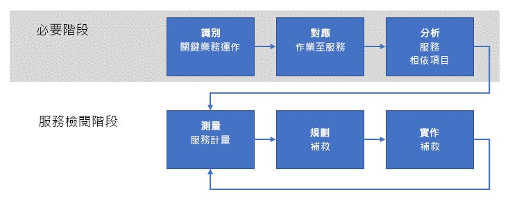

# 建立操作適用性檢閱Establishing an operational fitness review

當您的企業開始在 Azure 中處理工作負載時，下一步是建立**操作適用性檢閱**程序以列舉、實作及反覆檢閱這些工作負載的**非功能性**需求。As your enterprise begins to operate workloads in Azure, the next step is to establish an **operational fitness review** process to enumerate, implement, and iteratively review the **non-functional** requirements for these workloads. 「非功能性」需求與服務的預期操作行為相關。_Non-functional_ requirements are related to the expected operational behavior of the service. 非功能性需求有五個基本類別，稱為[軟體品質要素](../../guide/pillars.md)：延展性、可用性、復原能力 (包括商業持續性和災害復原)、管理與安全性。There are five essential categories of non-functional requirements referred to as the [pillars of software quality](../../guide/pillars.md): scalability, availability, resiliency (including business continuity and disaster recovery), management, and security. 操作適用性檢閱程序的目的是確保您的任務關鍵工作負載在考慮品質要素的情況下符合您公司的預期。The purpose of an operational fitness review process is ensuring that your mission critical workloads meet the expectations of your business with respect to the quality pillars.

因此，您的企業應該進行操作適用性檢閱程序以完整了解因為在生產環境中執行工作負載所產生的問題、判斷如何補救問題，然後解決問題。For this reason,  your enterprise should undertake an operational fitness review process to fully understand the issues that result from running the workload in a production environment, determine how to remediate the issues, then resolve them. 此文章概述您的企業可以用來達成此目標的高階操作適用性檢閱程序。This article outlines a high-level operational fitness review process that your enterprise can use to achieve this goal.

## 在 Microsoft 的操作適用性Operational fitness at Microsoft

從一開始，Azure 平台的發展就具有持續發展與整合專案特色，而且由 Microsoft 內的許多團隊採用。From the outset, the development of the Azure platform has been a continuous development and integration project undertaken by many teams across Microsoft. 若沒有健全的程序來定期列舉並實作基本非功能性需求，將難以確保 Azure 規模與複雜的專案的品質與一致性。It would be very difficult to ensure quality and consistency for a project of Azure's size and complexity without a robust process for enumerating and implementing the fundamental non-functional requirements on a regular basis.

這些由 Microsoft 遵循的程序構成此文件中所概述的基礎。These processes followed by Microsoft form the basis for those outlined in this document.

## 了解問題Understanding the problem

如同您在[開始使用](../../cloud-adoption/getting-started/overview.md)所學到的，企業數位轉型的第一步是找出可透過採用 Azure 來解決的公司問題。As you learned in [Getting started](../../cloud-adoption/getting-started/overview.md), the first step in an enterprise's digital transformation is identifying the business problems to be solved by adopting Azure. 下一步是粗略判斷問題的解決方案，例如將工作負載移轉到雲端，或採用現有的內部部署服務來獲得雲端功能。The next step is to determine a high-level solution to the problem, such as migrating a workload to the cloud, or adapting an existing on-premises service to include cloud functionality. 最後，必須設計並實作解決方案。Finally, the solution is designed and implemented.

在此程序期間，焦點通常是服務的「功能」。During this process, the focus is often on the _features_ of the service. 也就是說，要讓服務可執行，必須滿足一些「功能」需求。That is, there are a set of desired _functional_ requirements for the service to perform. 例如，產品交貨服務需要可用來判斷產品來源與目的地位置、在交貨期間追蹤產品、客戶通知等功能。For example, a product delivery service requires features for determining the source and destination locations of the product, tracking the product during delivery, customer notifications, and others.

相反地，「非功能性」需求與一些屬性相關，例如服務的[可用性](../../checklist/availability.md)、[復原能力](../../resiliency/index.md)與[延展性](../../checklist/scalability.md)。In contrast, the _non-functional_ requirements relate to properties such as the service's [availability](../../checklist/availability.md), [resiliency](../../resiliency/index.md), and [scalability](../../checklist/scalability.md). 這些屬性與功能性需求不同，因為它們不會直接影響服務中任何特定功能的最終功能。These properties differ from the functional requirements because they do not directly affect the final function of any particular feature in the service. 不過，這些非功能性需求與服務的「效能」與「持續性」相關。However, these non-functional requirements are related to the _performance_ and _continuity_ of the service.

某些非功能性需求能以服務等級協定 (SLA) 的方式來指定。Some non-functional requirements can be specified in terms of a service level agreement (SLA). 例如，與服務持續性相關時，服務的可用性需求能以如**可用時間 99.99%** 的百分比來表示。For example, with regard to service continuity, an availability requirement for the service can be expressed as a percentage such as **available 99.99% of the time**. 其他非功能性需求可能較難定義，而且可能會在產品需求發展時變更。Other non-functional requirements may be more difficult to define and may change as production needs evolve. 例如，客戶面向的服務在人氣暴增之後可能必須開始面對意料之外的輸送量。For example, a consumer-facing service might start facing unanticipated throughput requirements after a surge of popularity.

![注意] [為 Azure 設計具復原能力的應用程式](../../resiliency/index.md#define-your-availability-requirements)中深入探討如何定義復原能力的需求 
(包括 RPO、RTO、SLA 與相關概念的解釋)。![NOTE] Defining the requirements for resiliency, including explanations of RPO, RTO, SLA, and related concepts, are explored in more depth in [Designing resilient applications for Azure](../../resiliency/index.md#define-your-availability-requirements).

## 操作適用性檢閱程序Operational fitness review process

維持企業服務效能與持續性的關鍵是實作「操作適用性檢閱」程序。The key to maintaining the performance and continuity of an enterprise's services is to implement an _operational fitness review_ process.

從高階觀點來看，該程序有兩個階段。At a high level, the process has two phases. 在先決條件階段，會建立需求並對應到支援的服務。In the prerequisites phase, the requirements are established and mapped to supporting services. 這比較少發生；可能每年發生一次或當導入新作業時發生。This occurs less frequently; perhaps annually or when new operations are introduced. 先決條件階段的輸出會在流程階段中使用。The output of the prerequisites phase is used in the flow phase. 流程階段較常發生；建議的頻率是每個月一次。The flow phase occurs more frequently; we recommend monthly.

### 先決條件階段Prerequisites phase

此階段中的步驟旨在擷取針對重要服務進行定期檢閱的必要需求。The steps in this phase are intended to capture the necessary requirements for conducting a regular review of the important services.

- **找出關鍵商業作業**。**Identify critical business operations**. 找出企業的**任務關鍵**商業作業。Identify the enterprise's **mission critical** business operations. 商業作業與任何支援的服務功能不同。Business operations are independent from any supporting service functionality. 換句話說，商業作業代表公司必須執行並由 IT 服務集提供支援的實際活動。In other words, business operations represent the actual activities that the business needs to perform and are supported by a set of IT services. 「任務關鍵」 (或稱為「商業關鍵」)一詞反映出實作作業時會對公司造成的重大影響。The term _mission critical_, or alternatively _business critical_, reflects a severe impact to the business if the operation is impeded. 例如，線上零售商可能會有「讓客戶將項目加到購物車」或「處理信用卡付款」的商業作業。For example, an online retailer may have a business operation such as "enable a customer to add an item to a shopping cart" or "process a credit card payment". 若任一作業失敗，客戶將無法完成交易，而且公司將無法實現銷售。If either of these operations were to fail, a customer would be unable to complete the transaction and the enterprise would fail to realize sales.

- **將作業對應到服務**。**Map operations to services**. 將這些商業作業對應到支援它們的服務。Map these business operations to the services that support them. 在上面的購物車範例中，可能涉及多個服務：庫存管理服務、購物車服務等。In the above shopping cart example, several services may be involved: an inventory stock management service, a shopping cart service, and others. 在上面的信用卡付款範例中，內部部署付款服務可能會與第三方付款處理服務互動。In the credit card payment example above, an on-premises payment service may interact with a third-party payment processing service.

- **分析服務相依性**。**Analyze service dependencies**. 大部分的商業作業都需要多個支援服務或在多個支援服務之間進行協調。Most business operations require orchestration between multiple supporting services. 請務必了解服務與透過這些服務完成之任務關鍵交易流程之間的相依性。It is important to understand the dependences between the services and the flow of mission critical transactions through these services. 您也應該考慮內部部署服務與 Azure 服務之間的相依性。You should also consider the dependencies between on-premises services and Azure services. 在購物車範例中，庫存管理服務可能是裝載在內部部署環境中，並內嵌來自實體倉儲之員工的資料輸入，但它可能會將資料儲存在 [Azure 儲存體](/azure/storage/common/storage-introduction)之類的 Azure 服務中或 [Azure Cosmos DB](/azure/cosmos-db/introduction) 之類的資料庫中。In the shopping cart example, the inventory stock management service may be hosted on-premises and ingest data input by employees from a physical warehouse, but it may store data in an Azure service such as [Azure storage](/azure/storage/common/storage-introduction) or a database such as [Azure Cosmos DB](/azure/cosmos-db/introduction).

這些活動的輸出是一組服務作業的**計分卡計量**。An output from these activities is a set of **scorecard metrics** for service operations. 計量是以非功能性條件的方式分類，例如可用性、延展性與災害復原。The metrics are categorized in terms of non-functional criteria such as availability, scalability, and disaster recovery. 計分卡計量表示服務預期符合作業需求的條件。Scorecard metrics express the criteria that the service is expected to meet operationally. 這些計量能以適用於服務作業的任何層級細微性表示。These metrics can be expressed at any level of granularity that is appropriate for the service operation.

計分卡應該以在公司擁有者與工程人員之間促使有意義之決策的簡單方式表示。The scorecard should be expressed in simple terms to facilitate meaningful discussion between the business owners and engineering. 例如，延展性計分卡計量可能以下列方式表示：「綠色」代表以預期條件執行、「黃色」代表無法符合預期條件但主動實作規劃的補救措施，而「紅色」代表無法符合預期條件且未採取任何計畫或動作。For example, a scalability scorecard metric could be expressed as _green_ for performing at the desired criteria, _yellow_ for failing to meet the desired criteria but actively implementing a planned remediation, and _red_ for failing to meet the desired criteria with no plan or action.

務必強調這些計量應該直接反映商業需求。It is important to emphasize that these metrics should directly reflect business needs.

### 服務檢閱階段Service review phase

服務檢閱階段是操作適用性檢閱程序的核心。The service review phase is core of the operational fitness review process.

- **監視服務計量**。**Measure service metrics**. 使用計分卡計量時，應該監視服務以確保它們符合商業預期。Using the scorecard metrics, the services should be monitored to ensure that they meet the business expectations. 這表示服務監視是不可或缺的。This means that service monitoring is essential. 若無法監視一組服務是否符合非功能性需求，則對應的計分卡計量應該考慮以紅色呈現。If you are not able to monitor a set of services with respect to the non-functional requirements, then the corresponding scorecard metrics should be considered red. 在此案例中，補救措施的第一個步驟是實作適當的服務監視機制。In this case, the first step for remediation is to implement the appropriate service monitoring.
例如，若公司預期服務以 99.99% 的可用性運作，但沒有可用的生產遙測可測量可用性，您應該假設您不符合該需求。For example, if the business expects a service to operate with 99.99% availability, but there is no production telemetry in place to measure the availability, you should assume that you're not meeting the requirement.

- **規劃補救措施**。**Plan remediation**. 針對計量低於可接受閾值的每個服務作業，判斷補救服務成本以讓作業達到接受的計量。For each service operation with metrics that fall below an acceptable threshold, determine the cost of remediating the service to bring operation to an acceptable metric. 若補救服務成本大於服務預期產生的收益，請接著考慮無形成本，例如客戶體驗。If the cost of remediating the service is greater than the expected revenue generation of the service, move on to consider the non-tangible costs such as customer experience. 例如，若客戶難以使用服務成功下訂，他們可能會選擇競爭者服務。For example, if customers have difficulty placing a successful order using the service, they may choose a competitor instead.

- **實作補救措施**。**Implement remediation**. 在公司擁有者與工程人員涵蓋計畫之後，應該實作計畫。After the business owners and engineering converge on a plan, it should be implemented. 應該在檢閱計分卡計量時回報實作狀態。The status of the implementation should be reported whenever scorecard metrics are reviewed.

這是反覆性程序，而且理想的情況是您的公司有專屬團隊來處理此事宜。This process is iterative, and ideally your enterprise should have a team dedicated to owning it. 此團隊應該符合定期檢閱現有補救措施專案、進行基本新工作負載檢閱，以及追蹤企業整體計分卡的要求。This team should meet regularly to review existing remediation projects, kick off the fundamentals review of new workloads, and track the enterprise's overall scorecard. 團隊應該要獲得授權，以確保為落後排程或無法符合計量的補救團隊負責。The team should have the authority to ensure accountability for remediation teams that are behind schedule or fail to meet metrics.

## 操作適用性檢閱團隊的結構Structure of the operational fitness review team

操作適用性檢樂團隊由下列角色組成：The operational fitness review team is composed of the following roles:

1. **公司擁有者**。**Business owner**. 此角色提供商業知識以找出每個「任務關鍵」商業作業並排定其優先順序。This role provides knowledge of the business to identify and prioritize each "mission critical" business operation. 此角色也會比較商業影響的風險降低成本並導出有關補救措施的最終決策。This role also compares the mitigation cost to the business impact and drives the final decision on remediation.

2. **公司業主**。**Business advocate**. 此角色負責將商業作業區分為不同的部分，並將那些部分對應到內部部署與雲端服務與基礎結構。This role is responsible for breaking down business operations into discreet parts and mapping those parts to on-premises and cloud services and infrastructure. 此角色需要與每個商業作業關聯的深入技術知識。The role requires deep knowledge of the technology associated with each business operation.

3. **工程擁有者**。**Engineering owner**. 此角色負責實作與商業作業關聯的服務。This role is responsible for implementating the services associated with the business operation. 這些個人可能會參與任何解決方案的設計、實作與與部署以解決作業適用性檢閱團隊未涵蓋的非功能性需求問題。These individuals may participate in the design, implementation, and deployment of any solutions for solving non-functional requirement issues uncovered by the operational fitness review team.

4. **服務擁有者**。**Service owner**. 此角色負責營運商業應用程式與服務。This role is responsible for operating the business's applications and services. 這些個人會收集這些應用程式與服務的記錄與使用狀況資料。These individuals collect logging and usage data for these applications and services. 此資料會用找出問題並在部署後進行驗證。This data is used both to identify issues and verify fixes once deployed.

## 操作適用性檢閱會議Operational fitness review meeting

我們建議您的操作適用性檢閱團隊定期舉行會議。We recommend that your operational fitness review team meet on a regular basis. 例如，雲端團隊每個月舉行會議以並定期向資深領導人員回報狀態與計量。For example, the could team meet on a monthly cadence and report status and metrics to senior leadership on a quarterly basis.

程序與會議的詳細資料應該根據您的特定需求進行調整。The details of the process and meeting should be adapted to fit your specific needs. 建議您以下列工作做為起點：We recommend the following tasks as a starting point:

1. 公司擁有者與公司業主透過從工程團隊與服務擁有者所取得的資訊，來列舉並決定每個商業作業的非功能性需求。The business owner and business advocate enumerate and determine the non-functional requirements for each business operation, with input from the engineering and service owners. 針對先前已識別的商業作業，優先順序是檢閱並驗證。For business operations that have been previously identified, the priority is reviewed and verified. 針對新的商業作業，會指定現有清單中的優先順序。For new business operations, a priority in the existing list is assigned.

2. 工程團隊與服務擁有者會將商業作業的**目前狀態**對應到對應的內部部署與雲端服務。The engineering and service owners map the **current state** of business operations to the corresponding on-premises and cloud services. 該對應是由每個服務中的元件清單所組成，並定位為相依樹狀結構。The mapping is composed of a list of the components in each service, oriented as a dependency tree. 一旦產生清單與相依樹狀結構，便會決定該樹狀結構中的**關鍵路徑**。Once the list and dependency tree are generated, the **critical paths** through the tree are determined.

3. 工程團隊與服務擁有者會檢閱操作記錄的目前狀態，並監視上一個步驟中所列的服務。The engineering and service owners review the current state of operational logging and monitoring for the services listed in the previous step. 強固的記錄與監視非常重要，因為這樣才能找出造成無法符合非功能性需求的服務元件。Robust logging and monitoring are critical, in order to identify service components that contribute to failuring to meet non-functional requirements. 若沒有足夠的記錄與監視機制，必須建立計畫並實作以建構足夠的項目。If sufficient logging and monitoring are not in place, a plan must be created and implemented to put them in place.

4. 會為新商業作業建立計分卡計量。Scorecard metrics are created for new business operation. 計分卡是由在步驟 2 中識別之每個服務的構成元件所組成，這符合非功能性需求與代表元件如何符合需求的計量。The scorecard is composed of the list of constituent components for each service identified in step 2, aligned with the non-functional requirements and a metric representing how well the component meets the requirement.

5. 針對那些無法符合非功能性需求的構成元件，以設計高階解決方案並指派工程擁有者。For those constituent components that fail to meet non-functional requirements, a high-level solution is designed and an engineering owner is assigned. 目前，公司擁有者與公司業主應該根據商業作業的預期收益來建立補救工作的預算。At this point, the business owner and business advocate should establish a budget for the remediation work, based on the expected revenue of the business operation.

6. 最後，檢閱進行中的補救工作。Finally, a review is conducted of the ongoing remediation work. 每個工作的進行中計分卡計量都會根據預期計量來檢閱。Each of the scorecard metrics for work in progress is reviewed against the expected metrics. 針對符合計量的構成元件，服務擁有者會呈現記錄與監視資料以確認計量符合。For constituent components that are meeting metrics, the service owner presents logging and monitoring data to confirm that the metric is met. 針對那些不符合計量的構成元件，每個工程擁有者都應該解釋造成無法達到計量的問題，以及任何補救用新設計。For those constituent components that are not meeting metrics, each engineering owner explains the issues that are preventing metrics from being reached and any new designs for remediation.

## 建議的資源Recommended resources

- [軟體品質的要素](../../guide/pillars.md)。[Pillars of software quality](../../guide/pillars.md).
Azure 應用程式架構指南的這一節說明軟體品質的五大要素：延展性、可用性、復原、管理和安全性。This section of the Azure Application Architecture guide describes the five pillars of software quality: Scalability, availability, resiliency, management, and security.
- [Azure 應用程式的 10 個設計原則](../../guide/design-principles/index.md)。[Ten design principles for Azure applications](../../guide/design-principles/index.md).
Azure 應用程式架構指南的這一節討論一組可讓您的應用程式更穩定、更具復原能力且更容易管理的設計原則。This section of the Azure Application Architecture guide discusses a set of design principles to make your application more scalable, resilient, and manageable.
- [為 Azure 設計具復原能力的應用程式](../../resiliency/index.md)。[Designing resilient applications for Azure](../../resiliency/index.md).
此指南從說明復原這個字詞的定義與相關概念開始。This guide starts with a definition of the term resiliency and related concepts. 然後它會描述在應用程式存留期間使用結構化的方法達成復原的流程，從設計和實作到部署和作業。Then it describes a process for achieving resiliency, using a structured approach over the lifetime of an application, from design and implementation to deployment and operations.
- [雲端設計模式](../../patterns/index.md)。[Cloud Design Patterns](../../patterns/index.md).
當工程團隊根據軟體品質的要素建置應用程式時，這些設計原則非常實用。These design patterns are useful for engineering teams when building applications on the pillars of software quality.