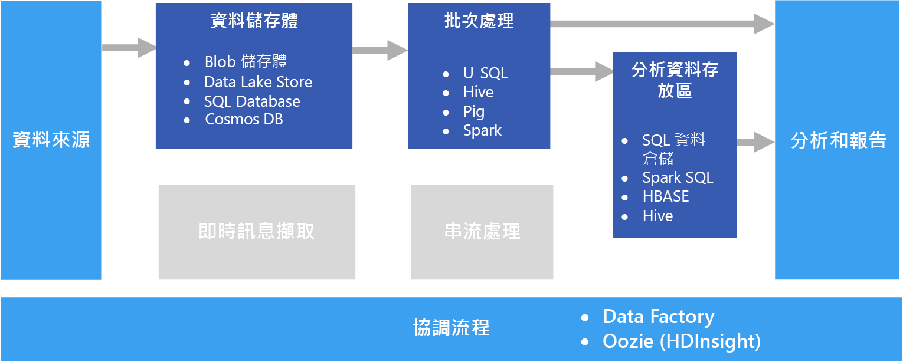

# 批次處理

待用資料的批次處理是常見的巨量資料案例。 在此案例中，來源資料會經由來源應用程式本身或協調工作流程載入資料儲存體中。 接著，資料會在平行化作業中就地處理，而此作業也可由協調工作流程起始。 此處理在轉換的結果載入至分析資料存放區之前可能會包含多個反覆執行的步驟，而結果在載入後將可由分析和報告元件進行查詢。

例如，Web 伺服器的記錄可能會複製到資料夾，然後在經過一個晚上的處理後產生 Web 活動的每日報表。

## 使用此解決方案的時機

在許多情況下都會使用批次處理，從簡單的資料轉換，到更完整的 ETL (擷取-轉換-載入) 管線，都會用到。 在巨量資料內容中，批次處理可能會運用在非常大型的資料集上，而其計算會非常耗時。 (如需範例，請參閱 [Lambda 架構](../big-data/index.md#lambda-architecture)。)批次處理通常會帶來進一步的互動式瀏覽、提供可用來建立模型的資料供機器學習使用，或將資料寫入至最適合用於分析和視覺效果的資料存放區。

批次處理的範例之一，是將半結構化的一般 CSV 或 JSON 大型檔案集轉換為可供進一步查詢的結構描述化和結構化格式。 一般而言，資料會從用於擷取的原始格式 (例如 CSV) 轉換為可提升查詢效能的二進位格式，因為它們會以單欄格式儲存資料，且通常會提供資料的關於索引和統計資料。

## 挑戰

- **資料格式和編碼**。 有些最難以偵錯的問題，常發生在檔案使用未預期的格式或編碼時。 例如，來源檔案可能混用 UTF-16 和 UTF-8 編碼，或包含未預期的分隔符號 (空格與定位點)，或是包含未預期的字元。 另一個常見範例，是文字欄位中包含會解譯為分隔符號的定位點、空格或逗點。 資料載入和剖析邏輯必須有足夠的彈性來偵測及處理這些問題。

- **協調時間配量。** 來源資料常會放在可反映處理時間範圍，並依年、月、日、小時等單位組織的資料夾階層中。 在某些情況下，資料可能會延遲送達。 例如，假設 Web 伺服器失敗，而且 3 月 7 日的記錄直到 3 月 9 日才送達資料夾以進行處理。 這些記錄會因為太晚送達而遭到忽略嗎？ 下游處理邏輯可處理順序錯亂的記錄嗎？

## 架構

批次處理架構具有下列邏輯元件，如下圖所示。

- **資料儲存體**。 通常是可作為儲存庫的分散式檔案存放區，用以保存大量具有不同格式的大型檔案。 一般而言，這種存放區通常稱為 Data Lake。 

- **批次處理。** 巨量資料具有大量的特性，這常意味著解決方案通常必須使用需要長時間執行的批次作業來處理資料檔案，以便篩選、彙總和準備資料以供分析。 這些作業通常涉及讀取原始程式檔、加以處理，然後將輸出寫入至新的檔案。 

- **分析資料存放區。** 許多巨量資料解決方案皆設計為準備資料以供分析，然後以可使用分析工具來查詢的結構化格式提供處理過的資料。 

- **分析和報告。** 大部分巨量資料解決方案的目標，是要透過分析和報告提供對資料的深入見解。 

- **協調流程**。 使用批次處理時，通常需要某些協調流程，以將資料移轉或複製到您的資料儲存體、批次處理、分析資料存放區和報告層中。

## 技術選擇

下列技術是 Azure 中的批次處理解決方案適用的建議選項。

### 資料儲存體

- **Azure 儲存體 Blob 容器**。 許多現有的 Azure 商業程序已開始使用 Azure Blob 儲存體，因此這已成為巨量資料存放區的理想選擇。
- **Azure Data Lake Store**。 Azure Data Lake Store 提供幾乎不受限制、任何大小的檔案皆適用的儲存體，並提供多方面的安全性選項，因此對於需要以集中式存放區處理異質資料格式的超大型巨量資料解決方案而言，可說是絕佳選擇。

如需詳細資訊，請參閱[資料儲存體](../technology-choices/data-storage.md)。

### 批次處理

- **U-SQL**。 U-SQL 是 Azure Data Lake Analytics 所使用的查詢處理語言。 它結合了 SQL 的宣告式特性與 C# 的程序擴充功能，並利用平行處理能力來支援大規模資料的有效處理。
- **Hive**。 Hive 是一種類似於 SQL 的語言，在大部分的 Hadoop 發行版中均受支援，包括 HDInsight。 它可用來處理來自任何 HDFS 相容存放區的資料，包括 Azure Blob 儲存體和 Azure Data Lake Store。
- **Pig**。 Pig 是許多 Hadoop 發行版 (包括 HDInsight) 中使用的宣告式巨量資料處理語言。 它特別適合用來處理非結構化或半結構化資料。
- **Spark**。 Spark 引擎支援以多種語言撰寫的批次處理程式，包括 Java、Scala 和 Python。 Spark 可使用分散式架構以平行方式處理多個背景工作節點間的資料。

如需詳細資訊，請參閱[批次處理](../technology-choices/batch-processing.md)。

### 分析資料存放區

- **SQL 資料倉儲**。 Azure SQL 資料倉儲是以 SQL Server 資料庫技術為基礎的受控服務，並經過最佳化而可支援大規模的資料倉儲工作負載。
- **Spark SQL**。 Spark SQL 是以 Spark 作為建置基礎的 API，可支援您建立能夠使用 SQL 語法來查詢的資料框架和資料表。
- **HBase**。 對 HBase 是一種低延遲的 NoSQL 存放區，可提供高效能、有彈性的選項，用以查詢結構化和半結構化資料。
- **Hive**。 除了適用於批次處理，Hive 也提供在概念上類似於一般關聯式資料庫管理系統的資料庫結構。 Hive 查詢經由 Tez 引擎和 Stinger Initiative 之類的創新而產生了效能上的提升，這意味著 Hive 資料表在某些情況下可有效作為分析查詢的來源。

如需詳細資訊，請參閱[分析資料存放區](../technology-choices/analytical-data-stores.md)。

### 分析和報告

- **Azure Analysis Services**。 許多巨量資料解決方案皆模擬傳統企業商業智慧架構，而納入了可供報表、儀表板和互動式「切割與細分」分析作為基礎的集中式線上分析處理 (OLAP) 資料模型 (通常稱為 Cube)。 Azure Analysis Services 可支援您建立表格式模型，以符合此需求。
- **Power BI**。 Power BI 可讓資料分析師根據 OLAP 模型中的資料模型建立互動式資料視覺效果，或直接從分析資料存放區建立。
- **Microsoft Excel**。 Microsoft Excel 是全世界最廣受使用的軟體應用程式之一，可提供豐富的資料分析和視覺效果功能。 資料分析師可使用 Excel 從分析資料存放區建置文件資料模型，或將 OLAP 資料模型中的資料擷取到互動式樞紐分析表和圖表中。

如需詳細資訊，請參閱[分析和報告](../technology-choices/analysis-visualizations-reporting.md)。

### 協調流程

- **Azure Data Factory**。 Azure Data Factory 管線可用來定義一系列排程於週期性時間範圍的活動。 這些活動可起始資料複製作業以及隨需 HDInsight 叢集中的 Hive、Pig、MapReduce 或 Spark 作業；Azure Date Lake Analytics 中的 U-SQL 作業，和 Azure SQL 資料倉儲或 Azure SQL Database 中的預存程序。
- **Oozie** 和 **Sqoop**。 Oozie 是 Apache Hadoop 生態系統的作業自動化引擎，可用來起始資料複製作業以及處理資料的 Hive、Pig 和 MapReduce 作業，和在 HDFS 與 SQL 資料庫之間複製資料的 Sqoop 作業。

如需詳細資訊，請參閱[管線協調流程](../technology-choices/pipeline-orchestration-data-movement.md)
