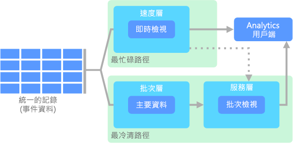
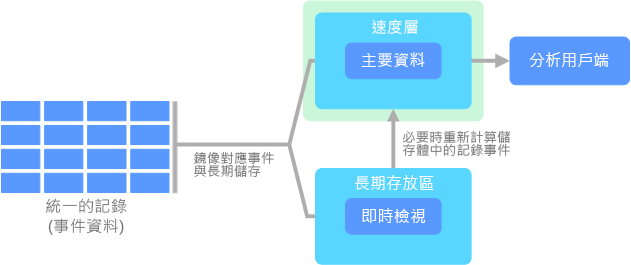

# 巨量資料架構Big data architectures

巨量資料架構的設計，可處理對於傳統資料庫系統而言太大或太複雜之資料的擷取、處理和分析。A big data architecture is designed to handle the ingestion, processing, and analysis of data that is too large or complex for traditional database systems. 組織跨入巨量資料領域的門檻會隨使用者及其工具的能力而有所不同。The threshold at which organizations enter into the big data realm differs, depending on the capabilities of the users and their tools. 對於某些組織來說，這個門檻可能代表數百 GB 的資料，對於其他組織來說，則可能代表數百 TB 的資料。For some, it can mean hundreds of gigabytes of data, while for others it means hundreds of terabytes. 隨著用來處理巨量資料集的工具不斷發展，巨量資料的意義也跟著進化。As tools for working with big data sets advance, so does the meaning of big data. 這個字詞與可透過進階分析從資料集內擷取出的價值越來越有關係，而非僅與資料大小有關，不過，在這些案例中，其規模往往會相當龐大。More and more, this term relates to the value you can extract from your data sets through advanced analytics, rather than strictly the size of the data, although in these cases they tend to be quite large.

積年累月下來，資料態勢已發生變化。Over the years, the data landscape has changed. 您可以對資料進行的作業或應當進行的作業已改變。What you can do, or are expected to do, with data has changed. 儲存成本已大幅下降，於此同時，資料的收集方式也不斷增加。The cost of storage has fallen dramatically, while the means by which data is collected keeps growing. 某些資料會不斷送達，因此需要持續地收集和觀察。Some data arrives at a rapid pace, constantly demanding to be collected and observed. 其他資料則較不常送達，但會有非常大的區塊，其形式通常為數十年的歷史資料。Other data arrives more slowly, but in very large chunks, often in the form of decades of historical data. 您可能會遇到進階的分析問題，或需要機器學習的問題。You might be facing an advanced analytics problem, or one that requires machine learning. 這些問題便是巨量資料架構要試圖解決的挑戰。These are challenges that big data architectures seek to solve.

巨量資料的解決方案通常會涉及一或多個下列類型的工作負載：Big data solutions typically involve one or more of the following types of workload:

- 待用之巨量資料來源的批次處理。Batch processing of big data sources at rest.
- 移動中之巨量資料的即時處理。Real-time processing of big data in motion.
- 巨量資料的互動式探索。Interactive exploration of big data.
- 預測性分析和機器學習。Predictive analytics and machine learning.

當您有以下需求時，請考慮使用巨量資料架構：Consider big data architectures when you need to:

- 要儲存和處理的資料數量對於傳統資料庫來說太大時。Store and process data in volumes too large for a traditional database.
- 要轉換非結構化資料以進行分析和報告。Transform unstructured data for analysis and reporting.
- 要以即時或低延遲的方式擷取、處理和分析未繫結的資料串流。Capture, process, and analyze unbounded streams of data in real time, or with low latency.

## 巨量資料架構的元件Components of a big data architecture

下圖顯示可融入巨量資料架構的邏輯元件。The following diagram shows the logical components that fit into a big data architecture. 個別解決方案可能不會包含此圖中的每個項目。Individual solutions may not contain every item in this diagram.

巨量資料的架構大多包括下列的部分或所有元件：Most big data architectures include some or all of the following components:

- **資料來源**。**Data sources**. 所有巨量資料解決方案都是從一或多個資料來源來開始建置的。All big data solutions start with one or more data sources. 範例包括：Examples include:

  - 應用程式資料存放區，例如關聯式資料庫。Application data stores, such as relational databases.
  - 應用程式所產生的靜態檔案，例如 Web 伺服器記錄檔。Static files produced by applications, such as web server log files.
  - 即時資料來源，例如 IoT 裝置。Real-time data sources, such as IoT devices.

- **資料儲存體**。**Data storage**. 要進行批次處理作業的資料通常儲存在分散式檔案存放區，以便能夠保存大量具有不同格式的大型檔案。Data for batch processing operations is typically stored in a distributed file store that can hold high volumes of large files in various formats. 這種存放區通常稱為「資料湖」。This kind of store is often called a *data lake*. 可供實作此儲存體的選項包含 Azure Data Lake Store 或 Azure 儲存體中的 Blob 容器。Options for implementing this storage include Azure Data Lake Store or blob containers in Azure Storage.

- **批次處理**。**Batch processing**. 由於資料集是如此龐大，巨量資料解決方案通常必須使用需要長時間執行的批次作業來處理資料檔案，以便篩選、彙總和準備資料以供分析。Because the data sets are so large, often a big data solution must process data files using long-running batch jobs to filter, aggregate, and otherwise prepare the data for analysis. 這些作業通常涉及讀取原始程式檔、加以處理，然後將輸出寫入至新的檔案。Usually these jobs involve reading source files, processing them, and writing the output to new files. 選項包括在 Azure Data Lake Analytics 中執行 U-SQL 作業、在 HDInsight Hadoop 叢集中使用 Hive、Pig 或自訂的 Map/Reduce 作業，或是在 HDInsight Spark 叢集中使用 Java、Scala 或 Python 程式。Options include running U-SQL jobs in Azure Data Lake Analytics, using Hive, Pig, or custom Map/Reduce jobs in an HDInsight Hadoop cluster, or using Java, Scala, or Python programs in an HDInsight Spark cluster.

- **即時訊息擷取**。**Real-time message ingestion**. 如果解決方案中包含即時來源，則架構中必須有方法可擷取和儲存即時訊息以進行串流處理。If the solution includes real-time sources, the architecture must include a way to capture and store real-time messages for stream processing. 這可能是簡單的資料存放區，內送訊息會放入資料夾處理。This might be a simple data store, where incoming messages are dropped into a folder for processing. 不過，許多解決方案需要有訊息擷取存放區，以做為訊息的緩衝區，以及支援相應放大處理、可靠的傳遞和其他訊息佇列語意。However, many solutions need a message ingestion store to act as a buffer for messages, and to support scale-out processing, reliable delivery, and other message queuing semantics. 串流架構的這個部分通常稱為串流緩衝處理。This portion of a streaming architecture is often referred to as stream buffering. 選項包括 Azure 事件中樞、Azure IoT 中樞和 Kafka。Options include Azure Event Hubs, Azure IoT Hub, and Kafka.

- **串流處理**。**Stream processing**. 在擷取即時訊息後，解決方案必須經由篩選、彙總和準備要分析的資料，以便處理這些資料。After capturing real-time messages, the solution must process them by filtering, aggregating, and otherwise preparing the data for analysis. 已處理的串流資料接著會寫入至輸出接收器。The processed stream data is then written to an output sink. Azure 串流分析會根據永久執行的 SQL 查詢 (會針對未繫結資料流進行操作) 提供受控串流處理服務。Azure Stream Analytics provides a managed stream processing service based on perpetually running SQL queries that operate on unbounded streams. 您也可以使用開放原始碼的 Apache 串流技術，例如 HDInsight 叢集中的 Storm 和 Spark 串流。You can also use open source Apache streaming technologies like Storm and Spark Streaming in an HDInsight cluster.

- **分析資料存放區**。**Analytical data store**. 許多巨量資料解決方案會準備資料以供分析，然後以可使用分析工具來查詢的結構化格式提供處理過的資料。Many big data solutions prepare data for analysis and then serve the processed data in a structured format that can be queried using analytical tools. 用來提供這些查詢的分析資料存放區可以是 Kimball 樣式的關聯式資料倉儲，如同我們在大部分的傳統商業智慧 (BI) 解決方案所看見的。The analytical data store used to serve these queries can be a Kimball-style relational data warehouse, as seen in most traditional business intelligence (BI) solutions. 或者，我們也可以透過低延遲的 NoSQL 技術 (例如 HBase) 或是互動式 Hive 資料庫 (可針對分散式資料存放區中的資料檔案提供中繼資料擷取) 來呈現資料。Alternatively, the data could be presented through a low-latency NoSQL technology such as HBase, or an interactive Hive database that provides a metadata abstraction over data files in the distributed data store. Azure SQL 資料倉儲可提供受控服務供大規模的雲端式資料倉儲使用。Azure SQL Data Warehouse provides a managed service for large-scale, cloud-based data warehousing. HDInsight 則支援互動式 Hive、HBase 和 Spark SQL，它們也可用來提供要分析的資料。HDInsight supports Interactive Hive, HBase, and Spark SQL, which can also be used to serve data for analysis.

- **分析和報告**。**Analysis and reporting**. 大部分巨量資料解決方案的目標，是要透過分析和報告提供資料的深入見解。The goal of most big data solutions is to provide insights into the data through analysis and reporting. 為了讓使用者能夠分析資料，架構中可能要包括資料模型化層，例如 Azure Analysis Services 中的多維度 OLAP Cube 或表格式資料模型。To empower users to analyze the data, the architecture may include a data modeling layer, such as a multidimensional OLAP cube or tabular data model in Azure Analysis Services. 架構也可能會支援自助商業智慧，其使用的是 Microsoft Power BI 或 Microsoft Excel 中的模型化和視覺效果技術。It might also support self-service BI, using the modeling and visualization technologies in Microsoft Power BI or Microsoft Excel. 分析和報告也可供資料科學家或資料分析師透過互動方式瀏覽資料。Analysis and reporting can also take the form of interactive data exploration by data scientists or data analysts. 針對這些案例，許多 Azure 服務支援了分析筆記本 (例如 Jupyter)，讓這些使用者能夠利用其現有的技巧來使用 Python 或 R。若要瀏覽大規模的資料，您可以使用 Microsoft R Server (不論是獨立使用或搭配 Spark 來使用)。For these scenarios, many Azure services support analytical notebooks, such as Jupyter, enabling these users to leverage their existing skills with Python or R. For large-scale data exploration, you can use Microsoft R Server, either standalone or with Spark.

- **協調流程**。**Orchestration**. 大部分的巨量資料解決方案都包含重複的資料處理作業並封裝在工作流程中，這些作業會轉換來源資料、在多個來源和接收器之間移動資料、將處理過的資料載入分析資料存放區，或將結果直接推送到報告或儀表板。Most big data solutions consist of repeated data processing operations, encapsulated in workflows, that transform source data, move data between multiple sources and sinks, load the processed data into an analytical data store, or push the results straight to a report or dashboard. 若要讓這些工作流程自動執行，您可以使用協調流程技術，例如 Azure Data Factory 或 Apache Oozie 和 Sqoop。To automate these workflows, you can use an orchestration technology such Azure Data Factory or Apache Oozie and Sqoop.

## Lambda 架構Lambda architecture

在處理非常大型的資料集時，用戶端所需查詢的執行時間可能會很久。When working with very large data sets, it can take a long time to run the sort of queries that clients need. 這些查詢無法即時執行，而且往往需要可跨整個資料集平行運作的演算法，例如 [MapReduce](https://en.wikipedia.org/wiki/MapReduce)。These queries can't be performed in real time, and often require algorithms such as [MapReduce](https://en.wikipedia.org/wiki/MapReduce) that operate in parallel across the entire data set. 其結果隨後會與未經處理資料分開儲存，並用於查詢。The results are then stored separately from the raw data and used for querying.

這種方法的其中一個缺點是會導致延遲 &mdash; 如果處理時間需要數小時，查詢所傳回的可能是數小時之前的結果。One drawback to this approach is that it introduces latency &mdash; if processing takes a few hours, a query may return results that are several hours old. 理想情況下，您會想要即時取得一些結果 (可能會損失一些精確度)，並將這些結果與批次分析的結果合併。Ideally, you would like to get some results in real time (perhaps with some loss of accuracy), and combine these results with the results from the batch analytics.

**Lambda 架構**是由 Nathan Marz 率先提出，此架構會藉由建立兩個資料流程路徑來解決此問題。The **lambda architecture**, first proposed by Nathan Marz, addresses this problem by creating two paths for data flow. 進入系統的所有資料會經過這兩個路徑：All data coming into the system goes through these two paths:

- **批次層** (冷路徑) 會以原始格式儲存所有內送資料，並對資料執行批次處理。A **batch layer** (cold path) stores all of the incoming data in its raw form and performs batch processing on the data. 此處理的結果會儲存為**批次檢視**。The result of this processing is stored as a **batch view**.

- **速度層** (熱路徑) 會即時分析資料。A **speed layer** (hot path) analyzes data in real time. 這一層的設計目的是要犧牲精確度來實現低延遲。This layer is designed for low latency, at the expense of accuracy.

批次層會饋送至**服務層**，由服務層為批次檢視編制索引以便能有效率地查詢。The batch layer feeds into a **serving layer** that indexes the batch view for efficient querying. 速度層會根據最新的資料，使用累加式更新來更新服務層。The speed layer updates the serving layer with incremental updates based on the most recent data.

流入熱路徑的資料會受到速度層所施加之延遲需求的約束，因此會盡快處理。Data that flows into the hot path is constrained by latency requirements imposed by the speed layer, so that it can be processed as quickly as possible. 這通常需要犧牲一定程度的精確度以換取盡快備妥資料。Often, this requires a tradeoff of some level of accuracy in favor of data that is ready as quickly as possible. 例如，請設想有大量溫度感應器正在傳送遙測資料的 IoT 案例。For example, consider an IoT scenario where a large number of temperature sensors are sending telemetry data. 速度層可用來處理內送資料的滑動時間範圍。The speed layer may be used to process a sliding time window of the incoming data.

另一方面，流入冷路徑的資料則無須遵守同樣的低延遲需求。Data flowing into the cold path, on the other hand, is not subject to the same low latency requirements. 此一行為可在跨大型資料集進行計算時獲得高精確度，但極為耗時。This allows for high accuracy computation across large data sets, which can be very time intensive.

熱路徑和冷路徑最終會在分析用戶端應用程式會合。Eventually, the hot and cold paths converge at the analytics client application. 如果用戶端需要即時顯示及時但可能較不精確的資料，便會從熱路徑取得其結果。If the client needs to display timely, yet potentially less accurate data in real time, it will acquire its result from the hot path. 否則，便會從冷路徑選取結果以顯示較不即時但更精確的資料。Otherwise, it will select results from the cold path to display less timely but more accurate data. 換句話說，熱路徑所擁有之資料的時間範圍較小，此時間過後，系統就會使用更精確的冷路徑資料來更新結果。In other words, the hot path has data for a relatively small window of time, after which the results can be updated with more accurate data from the cold path.

儲存在批次層的未經處理資料永遠不會更動。The raw data stored at the batch layer is immutable. 內送資料一律會附加至現有資料，永遠不會覆寫先前的資料。Incoming data is always appended to the existing data, and the previous data is never overwritten. 特定資料值若有任何變更，都會儲存為新的時間戳記事件記錄。Any changes to the value of a particular datum are stored as a new timestamped event record. 這可讓您在所收集資料之整段歷史中的任何時間點進行重新計算。This allows for recomputation at any point in time across the history of the data collected. 從原始的未經處理資料重新計算批次檢視的功能很重要，因為它可讓您隨系統的演進建立新的檢視。The ability to recompute the batch view from the original raw data is important, because it allows for new views to be created as the system evolves.

## Kappa 架構Kappa architecture

Lambda 架構的缺點是其複雜度。A drawback to the lambda architecture is its complexity. 處理邏輯會出現在兩個使用不同架構的不同位置，也就是冷路徑和熱路徑。Processing logic appears in two different places &mdash; the cold and hot paths &mdash; using different frameworks. 這會導致計算邏輯重複且這兩個路徑之架構的管理複雜度翻倍。This leads to duplicate computation logic and the complexity of managing the architecture for both paths.

**Kappa 架構**是 Jay Kreps 所提出，目的是要替代 Lambda 架構。The **kappa architecture** was proposed by Jay Kreps as an alternative to the lambda architecture. 它與 lambda 架構具有相同的基本目標，但有一個重要的區別：所有資料都使用資料流處理系統通過單一路徑。It has the same basic goals as the lambda architecture, but with an important distinction: All data flows through a single path, using a stream processing system.

這與 Lambda 架構的批次層有一些相似之處，事件資料永遠不會更動，並且會收集全部內容而不只是部分。There are some similarities to the lambda architecture's batch layer, in that the event data is immutable and all of it is collected, instead of a subset. 系統會以事件串流的形式將資料擷取至分散式且容錯的統一記錄。The data is ingested as a stream of events into a distributed and fault tolerant unified log. 這些事件經過排序，且只有附加的新事件能變更事件的目前狀態。These events are ordered, and the current state of an event is changed only by a new event being appended. 類似於 Lambda 架構的速度層，所有事件處理都是在輸入資料流上執行的，並且會以即時檢視的形式保存下來。Similar to a lambda architecture's speed layer, all event processing is performed on the input stream and persisted as a real-time view.

如果您需要重新計算整個資料集 (相當於批次層在 Lambda 中的作用)，您只需重新執行串流，一般是使用平行處理原則來即時完成計算。If you need to recompute the entire data set (equivalent to what the batch layer does in lambda), you simply replay the stream, typically using parallelism to complete the computation in a timely fashion.

## 物聯網 (IoT)Internet of Things (IoT)

從實務的觀點來看，物聯網 (IoT) 代表與網際網路連線的任何裝置。From a practical viewpoint, Internet of Things (IoT) represents any device that is connected to the Internet. 這包括您的電腦、行動電話、智慧型手錶、智慧型溫控器、智慧型冰箱、連網汽車、心臟監測植入物，以及其他任何與網際網路連線並且會傳送或接收資料的任何物體。This includes your PC, mobile phone, smart watch, smart thermostat, smart refrigerator, connected automobile, heart monitoring implants, and anything else that connects to the Internet and sends or receives data. 不僅連線裝置的數目與日俱增，從這些裝置所收集的資料量也是如此。The number of connected devices grows every day, as does the amount of data collected from them. 此資料往往是在高限制 (有時會高延遲) 的環境中收集。Often this data is being collected in highly constrained, sometimes high-latency environments. 在其他情況中，資料則是由數千或數百萬台裝置透過低延遲的環境傳送，所以必須能夠快速擷取資料並據以處理。In other cases, data is sent from low-latency environments by thousands or millions of devices, requiring the ability to rapidly ingest the data and process accordingly. 因此，您必須有適當的規劃，才能應付這些限制和獨特的需求。Therefore, proper planning is required to handle these constraints and unique requirements.

事件驅動架構是 IoT 解決方案的核心。Event-driven architectures are central to IoT solutions. 下圖顯示 IoT 可能的邏輯架構。The following diagram shows a possible logical architecture for IoT. 此圖強調架構的事件串流元件。The diagram emphasizes the event-streaming components of the architecture.

**雲端閘道**會使用可靠、低延遲的傳訊系統在雲端邊界擷取裝置事件。The **cloud gateway** ingests device events at the cloud boundary, using a reliable, low latency messaging system.

裝置可能會將事件直接傳送到雲端閘道，或透過**現場閘道**來傳送。Devices might send events directly to the cloud gateway, or through a **field gateway**. 現場閘道是專用的裝置或軟體，通常會與裝置共置，以便接收事件並將它們轉送到雲端閘道。A field gateway is a specialized device or software, usually collocated with the devices, that receives events and forwards them to the cloud gateway. 現場閘道可能也會前置處理未經處理的裝置事件，以執行篩選、彙總或通訊協定轉換等功能。The field gateway might also preprocess the raw device events, performing functions such as filtering, aggregation, or protocol transformation.

在擷取之後，事件會通過一個或多個**串流處理器**，這些處理器可以路由傳送資料 (例如，傳送到儲存體) 或執行分析和其他處理。After ingestion, events go through one or more **stream processors** that can route the data (for example, to storage) or perform analytics and other processing.

以下是一些常見的處理類型。The following are some common types of processing. (此清單一定不怎麼詳盡)。(This list is certainly not exhaustive.)

- 將事件資料寫入冷儲存體，以便封存或批次分析。Writing event data to cold storage, for archiving or batch analytics.

- 最忙碌路徑分析，(近乎) 即時地分析事件串流，以偵測異常行為、辨識滾動時間範圍的模式，或在串流中發生特定情況時觸發警示。Hot path analytics, analyzing the event stream in (near) real time, to detect anomalies, recognize patterns over rolling time windows, or trigger alerts when a specific condition occurs in the stream.

- 處理裝置中特殊的非遙測訊息類型，例如通知和警示。Handling special types of nontelemetry messages from devices, such as notifications and alarms.

- 機器學習。Machine learning.

深灰色的方塊顯示的是 IoT 系統中，與事件串流沒有直接關係，但為求完整所以在此納入的元件。The boxes that are shaded gray show components of an IoT system that are not directly related to event streaming, but are included here for completeness.

- **裝置登錄**是已佈建之裝置的資料庫，包括裝置識別碼，且通常會包括裝置中繼資料，例如位置。The **device registry** is a database of the provisioned devices, including the device IDs and usually device metadata, such as location.

- **佈建 API** 是常見用於佈建和註冊新裝置的外部介面。The **provisioning API** is a common external interface for provisioning and registering new devices.

- 某些 IoT 解決方案允許將**命令和控制訊息**傳送至裝置。Some IoT solutions allow **command and control messages** to be sent to devices.

相關 Azure 服務：Relevant Azure services:

- [Azure IoT 中心Azure IoT Hub](https://azure.microsoft.com/services/iot-hub/)
- [Azure 事件中樞Azure Event Hubs](https://azure.microsoft.com/services/event-hubs/)
- [Azure 串流分析Azure Stream Analytics](https://azure.microsoft.com/services/stream-analytics/)  

閱讀 [Azure IoT 參考架構](https://azure.microsoft.com/updates/microsoft-azure-iot-reference-architecture-available/)以深入了解 Azure 上的 IoT。Learn more about IoT on Azure by reading the [Azure IoT reference architecture](https://azure.microsoft.com/updates/microsoft-azure-iot-reference-architecture-available/).
