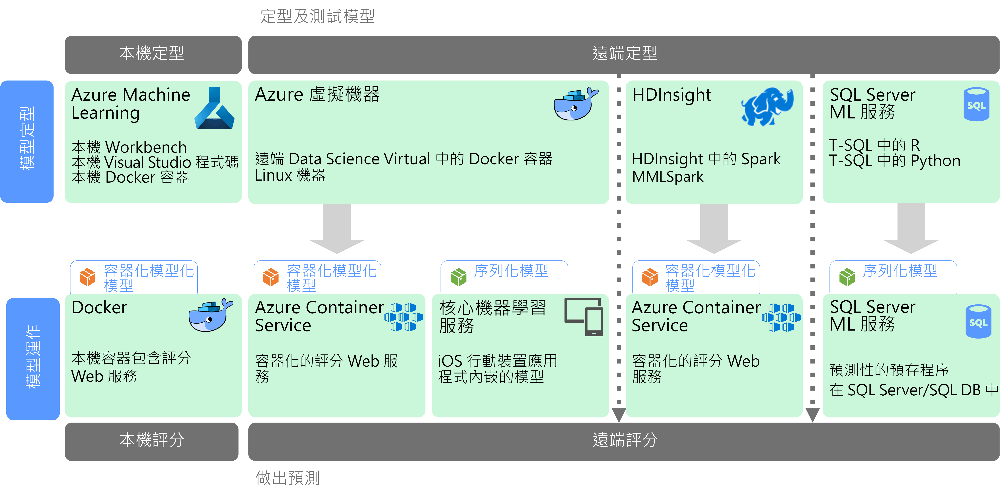

# 大規模機器學習

機器學習 (ML) 是可根據數學演算法用來訓練預測模型的技術。 機器學習服務會分析資料欄位之間的關聯性，以預測未知的值。

建立及部署機器學習模型是反覆執行的程序：

- 資料科學家探索來源資料，以判斷*特性*與預測*標籤*之間的關聯性。
- 資料科學家根據適當的演算法訓練和驗證模型，以找出進行預測的最佳模型。
- 最佳模型部署到生產環境中，作為 Web 服務或其他封裝函式。
- 隨著新資料的收集，模型會定期重新訓練以提升效率。

大規模的機器學習可解決兩個不同的延展性問題。 其一是必須根據大型資料集來訓練模型，且模型必須要有叢集的相應放大功能，才能定型。 第二個重點是，必須以可調整以符合使用端應用程式需求的方式，將經過學習的模型操作化。 將預測功能部署為後續可相應放大的 Web 服務，通常就可達成此目的。

大規模的機器學習具有可產生強大預測功能的優點，因為較理想的模型通常產生自較多的資料。 模型定型之後，可以部署為無狀態、高效能，並且可相應放大的 Web 服務。

## 模型的準備和訓練

在模型的準備和訓練階段，資料科學家會使用 Python 和 R 之類的語言以互動方式探索資料，藉以：

- 從大量資料存放區中擷取範例。
- 尋找並處理極端值、重複項目和遺漏值，以清理資料。
- 透過統計分析和視覺效果判斷資料中的相互關聯和關聯性。
- 產生可讓統計關聯性的預測更為精準的新計算功能。
- 根據預測演算法訓練 ML 模型。
- 使用在訓練期間保留的資料，驗證經過訓練的模型。

為了支援此互動式分析和模型化階段，資料平台必須讓資料科學家能夠使用不同的工具來探索資料。 此外，要訓練複雜的機器學習模型，可能需要密集頻繁地處理大量資料，因此必須要有足夠的資源將模型訓練相應放大。

## 模型的部署和使用

模型備妥而可供部署時，可以封裝為 Web 服務並部署到雲端中，或部署到企業 ML 執行環境中。 此部署程序稱為操作化。

## 挑戰

大規模的機器學習會產生若干挑戰：

- 您通常需要以大量資料來訓練模型，特別是深度學習模型。
- 備妥這些巨量資料集，是您展開模型訓練的先決條件之一。
- 模型訓練階段必須存取巨量資料存放區。 使用資料準備工作所使用的相同巨量資料叢集 (例如 Spark) 來執行模型訓練，是常見的做法。
- 對於深度學習之類的案例，您不僅需要可讓您將 CPU 相應放大的叢集，您的叢集也必須包含已啟用 GPU 的節點。

## Azure 中的大規模機器學習

在決定要將哪些 ML 服務用於訓練和操作化之前，請考量您是需要從頭訓練模型，還是有預先建置的模型可以滿足您的需求。 在許多情況下，只要呼叫 Web 服務，或使用 ML 程式庫載入現有的模型，即可使用預先建置的模型。 選項包括︰

- 使用 Microsoft 認知服務所提供的 Web 服務。
- 使用認知工具組所提供的預先定型類神經網路模型。
- 內嵌 iOS 應用程式的核心 ML 所提供的序列化模型。

如果預先建置的模型不適用於您的資料或案例，您可以使用 Azure 中的選項，包括 Azure Machine Learning、使用 Spark MLlib 和 MMLSpark 的 HDInsight、Azure Databricks、Cognitive Toolkit，以及 SQL 機器學習服務。 如果您決定使用自訂模型，您必須設計包含模型訓練和操作化的管線。

如需 Azure 中的 ML 適用的技術選項清單，請參閱下列主題：

- [選擇認知服務技術](../technology-choices/cognitive-services.md)
- [選擇機器學習技術](../technology-choices/data-science-and-machine-learning.md)
- [選擇自然語言處理技術](../technology-choices/natural-language-processing.md)

## 後續步驟

下列參考架構顯示 Azure 中的機器學習案例：

- [Azure 上適用於深度學習模型的批次評分](../../reference-architectures/ai/batch-scoring-deep-learning.md)
- [Azure 上的 Python Scikit-Learn 和深度學習模型的即時評分](../../reference-architectures/ai/realtime-scoring-python.md)