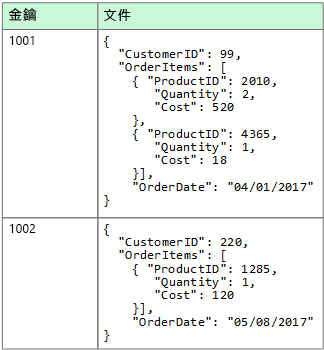
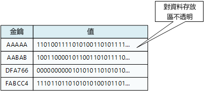
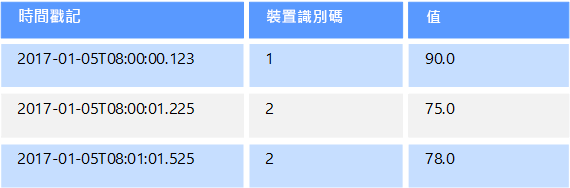
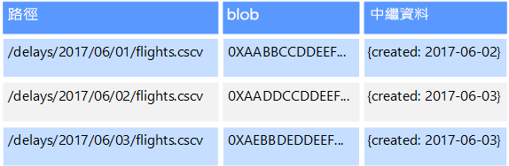
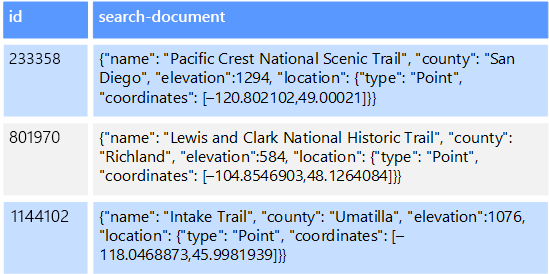

# 非關聯式資料和 NoSQL

「非關聯式資料庫」是一種資料庫，這種資料庫不會使用可在大部分傳統資料庫系統中看到的表格式資料列和資料行結構描述。 相反地，非關聯式資料庫會使用針對所要儲存之資料類型的特定需求所最佳化的儲存體模型。 比方說，資料可能會儲存為簡單的索引鍵/值組、JSON 文件，或包含邊緣和頂點的圖表。 

這些資料存放區的共通點是它們都未使用[關聯式模式](../relational-data/index.md)。 此外，他們傾向於對其支援的資料類型及資料的查詢方式提供更具體的方法。 比方說，時間序列資料存放區是針對以時間為基礎的資料序列查詢予以最佳化，而圖表資料存放區則是針對瀏覽實體之間的加權關聯性進行最佳化。 這兩種格式都無法完全適用於管理交易資料的工作。 

NoSQL 一詞所指的資料存放區不會使用 SQL 進行查詢，而是會改用其他程式設計語言和建構來查詢資料。 在實務上，「NoSQL」表示「非關聯式資料庫」，即使這些資料庫之中有許多都支援 SQL 相容查詢亦然。 不過，在執行相同的 SQL 查詢時，基礎查詢執行策略與傳統的 RDBMS 通常會使用極為不同的方式。

下列各節會說明非關聯式或 NoSQL 資料庫的主要類別。

## 文件資料存放區
文件資料存放區會在稱為「文件」的實體中管理一組具名字串欄位和物件資料值。 這些資料存放區一般會以 JSON 文件的形式儲存資料。 每個欄位值可以是純量項目 (例如數字)，也可以是複合元素 (例如清單或父子集合)。 文件之欄位中的資料可以各種不同的方式編碼，包括 XML、YAML、JSON、BSON，或甚至以純文字形式儲存。 文件中的欄位會公開至儲存體管理系統，讓應用程式可以藉由使用這些欄位中的值來查詢和篩選資料。  

一般而言，文件包含實體的整個資料。 哪些項目構成實體是應用程式特有的。 例如，實體可能包含客戶、訂單或兩者組合的詳細資料。 單一文件可能包含會分散於關聯式資料庫管理系統 (RDBMS) 中數個關聯式資料表的資訊。 文件存放區不需要所有文件都具有相同的結構。 此自由格式的方法提供極大的彈性。 比方說，應用程式可以在文件中儲存不同的資料，以回應商務需求的變更。  

  

應用程式可以使用文件索引鍵來擷取文件。 這是文件的唯一識別碼，通常是雜湊，以協助平均散發資料。 某些文件資料庫會自動建立文件索引鍵。 其他資料庫則可讓您指定要作為索引鍵的文件屬性。 應用程式也可以根據一或多個欄位的值來查詢文件。 某些文件資料庫支援編製索引，以便根據一或多個索引的欄位來快速查閱文件。  

許多文件資料庫支援就地更新，讓應用程式不需要重寫整份文件，就可以修改文件中特定欄位的值。 單一文件中多個欄位的讀取和寫入作業通常是不可部分完成。

相關 Azure 服務：  

- [Azure Cosmos DB](https://azure.microsoft.com/services/cosmos-db/)

## 單欄式資料存放區
單欄式或資料行系列資料存放區會將資料組織成資料行和資料列。 在其最簡單的形式中，資料行系列資料存放區的外觀會非常類似於關聯式資料庫，至少在概念上是如此。 資料行系列資料庫的實際能力在於其建構疏鬆資料的反正規化方法，此方法源自於用來儲存資料的資料行導向方法。  

您可以將資料行系列資料存放區視為保存具有資料列和資料行的表格式資料，但是資料行分成稱為「資料行系列」的群組。 每個資料行系列會保存一組資料行，邏輯上相互關聯，通常當作一個單位來擷取或管理。 個別存取的其他資料可以儲存在個別的資料行系列中。 在資料行系列內，新資料行可以動態新增，而資料列可以是疏鬆的 (亦即，一個資料列不一定要具有每個資料行的值)。 

下圖顯示具有兩個資料行系列 `Identity` 和 `Contact Info` 的範例。 單一實體的資料在每個資料行系列中會有相同的資料列索引鍵。 此結構 (其中資料行系列中任何指定物件的資料列會動態變化) 是資料行系列方法的重要優點，讓這種形式的資料存放區高度適用於儲存具有各種結構描述的資料。

不同於索引鍵/值存放區或文件資料庫，大部分資料行系列資料庫會以索引鍵順序來實際儲存資料，而不是藉由計算雜湊。 這些資料庫會將資料列索引鍵視為主要索引，而且資料列索引鍵可讓您透過特定的索引鍵或索引鍵範圍來啟用以索引鍵為基礎的存取。 部分實作可讓您在資料行系列的特定資料行上建立次要索引。 次要索引可讓您依據資料行值擷取資料，而不是依據資料列索引鍵。

在磁碟上，資料行系列中的所有資料行會一起儲存在相同的檔案中，每個檔案各有一定數目的資料列。 使用大型資料集時，這個方法可在一次只一起查詢幾個資料行時，藉由減少必須從磁碟讀取的資料量來產生效能優勢。 

資料列的讀取和寫入作業通常是單一資料行系列不可部分完成的，雖然某些實作在跨越多個資料行系列的整個資料列提供不可部分完成的作業。

相關 Azure 服務：  

- [HDInsight 中的 HBase](/azure/hdinsight/hdinsight-hbase-overview)

## 索引鍵/值資料存放區
索引鍵/值存放區基本上是大型雜湊資料表。 讓每個資料值與唯一的索引鍵產生關聯，索引鍵/值存放區會使用此索引鍵來儲存資料，方法是使用適當的雜湊函式。 會選取雜湊函式以提供跨資料儲存體雜湊索引鍵的平均分配。

大部分索引鍵/值存放區僅支援簡單的查詢、插入和刪除作業。 若要修改值 (部分或完全)，應用程式必須覆寫整個值的現有資料。 在大部分實作中，讀取或寫入單一值是不可部分完成的作業。 如果值很大，寫入可能需要一些時間。

應用程式可以將任意資料儲存為一組值，雖然某些索引鍵/值存放區會對值的大小上限施加限制。 儲存的值對於儲存體系統軟體是不透明的。 任何結構描述資訊都必須由應用程式提供並解譯。 基本上，值為 blob 且索引鍵/值存放區只依據索引鍵擷取或儲存值。

索引鍵/值存放區非常適合使用索引鍵值或索引鍵範圍來執行簡單查閱的應用程式，但是較不適合需要跨不同索引鍵/值資料表來查詢資料的系統，例如聯結跨多個資料表的資料。 

對於必須依據非索引鍵值來進行查詢或篩選，而不是只根據索引鍵來執行查閱的情況，就不適合使用索引鍵/值存放區。 例如，您可以使用關聯式資料庫，以 WHERE 子句篩選非索引鍵資料行來尋找記錄，但索引鍵/值存放區通常不會有這種用來查閱值的功能，即便有，也需要緩慢地掃描所有值。

單一索引鍵/值存放區可以極度擴充，因為資料存放區可以輕易地在不同機器上的多個節點之間分散資料。

相關 Azure 服務：  
- [Azure Cosmos DB 資料表 API](/azure/cosmos-db/table-introduction)  
- [Azure Redis 快取](https://azure.microsoft.com/services/cache/)  
- [Azure 資料表儲存體](https://azure.microsoft.com/services/storage/tables/)

## 圖表資料存放區
圖表資料存放區會管理兩種資訊，分別是節點和邊緣。 節點代表實體，邊緣則會指定這些實體之間的關聯性。 節點和邊緣都有屬性，提供該節點或邊緣的相關資訊，類似於資料表中的資料行。 邊緣也可以有方向，指出關聯性的本質。  

圖表資料存放區的目的是允許應用程式有效率地執行查詢，周遊節點和邊緣的網路，並分析實體之間的關聯性。 下圖顯示以圖表為結構之組織的人員資料。 實體是員工和部門，邊緣表示報告關聯性以及員工工作所在的部門。 在此圖表中，邊緣上的箭號會顯示關聯性的方向。

此結構會讓執行例如「尋找直接或間接向 Sarah 報告的所有員工」或「誰在與 John 一樣的部門工作？」的查詢更加直覺。 針對具有大量實體和關聯性的大型圖表，您可以非常快速地執行非常複雜的分析。 許多圖表資料庫提供查詢語言，可讓您有效率地周遊關聯性的網路。  

相關 Azure 服務：  
- [Azure Cosmos DB 圖形 API](/azure/cosmos-db/graph-introduction)  

## 時間序列資料存放區
時間序列資料是一組依時間加以組織的值，而時間序列資料存放區非常適合用於這種類型的資料。 時間序列資料存放區必須支援非常大量的寫入，因為它們通常會即時從大量來源收集大量資料。 時間序列資料存放區非常適合用於儲存遙測資料。 案例包括 IoT 感應器或應用程式/系統計數器。 更新很少，刪除通常會以大量作業來完成。

雖然寫入時間序列資料庫的記錄通常很小，但是經常會有大量記錄，資料大小總計會快速成長。 時間序列資料存放區也會處理順序錯亂和未準時抵達的資料、資料點的自動索引，以及以時間範圍描述之查詢的最佳化。 這最後一項功能可讓查詢跨數百萬個資料點與多個資料流快速地執行，以便支援時間序列視覺效果，這是常見的時間序列資料使用方式。 

如需詳細資訊，請參閱[時間序列解決方案](../scenarios/time-series.md)

相關 Azure 服務：  
- [Azure 時間序列深入解析](https://azure.microsoft.com/services/time-series-insights/)  
- [OpenTSDB 與 HDInsight 上的 HBase](/azure/hdinsight/hdinsight-hbase-overview)

## 物件資料存放區
物件資料存放區已針對儲存和擷取大型二進位物件或 Blob (如映像、文字檔、影片和音訊串流、大型應用程式資料物件和文件，以及虛擬機器磁碟映像) 最佳化。 物件是由預存資料、某些中繼資料和用來存取物件的唯一識別碼所組成。 物件存放區是設計來支援非常大型的個別檔案，以及提供大量的總儲存空間來管理所有檔案。  

某些物件資料存放區會跨多個伺服器節點複寫指定的 Blob，以便實現快速平行讀取。 這又可實現大型檔案所含資料的相應放大查詢，因為一般會在不同伺服器上執行的多個處理序，各可同時查詢大型資料檔案。

物件資料存放區的其中一個特殊案例是網路檔案共用。 使用檔案共用可使用標準網路通訊協定 (例如伺服器訊息區 (SMB)) 透過網路存取檔案。 指定適當安全性和並行存取控制機制，以這種方式共用資料可以讓分散式服務提供可高度調整的資料存取權，來執行基本的低階作業，例如簡單的讀取和寫入要求。

相關 Azure 服務：   

- [Azure Blob 儲存體](https://azure.microsoft.com/services/storage/blobs/)  
- [Azure Data Lake Store](https://azure.microsoft.com/services/data-lake-store/)  
- [Azure 檔案儲存體](https://azure.microsoft.com/services/storage/files/)  

## 外部索引資料存放區

外部索引資料存放區提供了可搜尋其他資料存放區和服務中保存之資訊的能力。 外部索引會作為任何資料存放區的次要索引，並可用於對大量資料編制索引，以及提供這些索引的近乎即時存取。 

例如，您可能會在檔案系統中儲存文字檔。 依檔案路徑來尋找檔案的速度會很快，但根據檔案內容所進行的搜尋就必須掃描所有檔案，因此會很慢。 外部索引可讓您建立第二個搜尋索引，然後快速尋找符合您準則的檔案路徑。 外部索引的另一個應用範例是在僅依索引鍵編制索引的索引鍵/值存放區。 您可以根據資料中的值來建置次要索引，並快速查閱可唯一識別每個相符項目的索引鍵。 

執行索引程序即可建立索引。 這可以藉由使用提取模型來執行、由資料存放區觸發，或使用由應用程式程式碼所起始的推送模型來執行。 索引可以是多維度，且可支援跨大量文字資料的任意文字搜尋。 

外部索引資料存放區通常用來支援全文檢索和 Web 型搜尋。 在這些案例中，您可以進行精確或模糊搜尋。 模糊搜尋會尋找符合一組條件的文件，並且計算符合程度。 某些外部索引也支援可根據同義字、內容類型擴充 (例如，比對「dogs」和「pets」) 和詞幹分析 (例如，搜尋「run」也會比對「ran」和「running」) 傳回相符項目的語言分析。 

相關 Azure 服務：  

- [Azure 搜尋服務](https://azure.microsoft.com/services/search/)

## 一般需求
非關聯式資料存放區所使用的儲存體架構通常會與關聯式資料庫所使用的架構不同。 具體而言，它們往往沒有固定的結構描述。 此外，它們往往不支援交易，要不然就是會限制交易的範圍，且基於延展性考量，通常不會包含次要索引。

下表會比較每個非關聯式資料存放區的需求：

| 需求 | 文件資料 | 資料行系列資料 | 索引鍵/值資料 | 圖表資料 | 
| --- | --- | --- | --- | --- | 
| 正規化 | 反正規化 | 反正規化 | 反正規化 | 正規化 | 
| 結構描述 | 讀取時結構描述 | 資料行系列在寫入時定義，資料行讀取時結構描述 | 讀取時結構描述 | 讀取時結構描述 | 
| 一致性 (跨並行交易) | 可微調的一致性，文件層級保證 | 資料行系列層級保證 | 索引鍵層級保證 | 圖表層級保證 
| 不可部分完成的作業 (交易範圍) | 集合 | 資料表 | 資料表 | 圖形 | 
| 鎖定策略 | 開放式 (無鎖定) | 封閉式 (資料列鎖定) | 開放式 (ETag) | 
| 存取模式 | 隨機存取 | 高/寬資料的彙總 | 隨機存取 | 隨機存取 |
| 編製索引 | 主要和次要索引 | 主要和次要索引 | 僅主要索引 | 主要和次要索引 | 
| 資料圖形 | 文件 | 表格式，使用包含資料行的資料行系列 | 索引鍵和值 | 包含邊緣和頂點的圖表 | 
| 疏鬆 | 是 | 是 | 是 | 否 | 
| 寬 (眾多資料行/屬性) | 是 | 是 | 否 | 否 |  
| 資料大小 | 小 (KB) 至中 (低 MB) | 中 (MB) 至大 (低 GB) | 小 (KB) | 小 (KB) | 
| 整體的最大級別 | 極大 (PB) | 極大 (PB) | 極大 (PB) | 大 (TB) | 

| 需求 | 時間序列資料 | 物件資料 | 外部索引資料 |
| --- | --- | --- | --- |
| 正規化 | 正規化 | 反正規化 | 反正規化 |
| 結構描述 | 讀取時結構描述 | 讀取時結構描述 | 寫入時結構描述 | 
| 一致性 (跨並行交易) | N/A | N/A | N/A | 
| 不可部分完成的作業 (交易範圍) | N/A | Object | N/A |
| 鎖定策略 | N/A | 封閉式 (Blob 鎖定) | N/A |
| 存取模式 | 隨機存取和彙總 | 循序存取 | 隨機存取 | 
| 編製索引 | 主要和次要索引 | 僅主要索引 | N/A |
| 資料圖形 | 表格式 | Blob 和中繼資料 | 文件 |
| 疏鬆 | 否 | N/A | 否 | 
| 寬 (眾多資料行/屬性) |  否 | yes | 是 |  
| 資料大小 | 小 (KB) | 大 (GB) 至極大 (TB) | 小 (KB) |
| 整體的最大級別 | 大 (低 TB)  | 極大 (PB) | 大 (低 TB) | 

