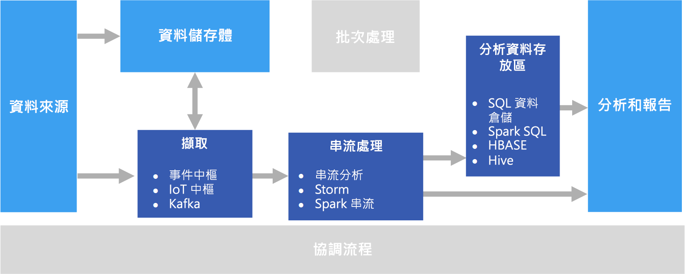

# 即時處理

即時處理會對資料流進行即時擷取，並在處理資料流時具有最低延遲，進而產生即時 (或接近即時) 報表或自動化回應。 比方說，即時流量監視解決方案可能會使用感應器資料來偵測高流量。 這項資料可用於動態更新地圖以顯示擁塞情況，或自動起始高乘載車道或其他流量管理系統。

即時處理是定義成未繫結輸入資料流的處理程序，且處理時需要極短的延遲 (以毫秒或秒為測量單位)。 此內送的資料通常以非結構化或半結構化格式送達 (例如 JSON)，而且具有與[批次處理](./batch-processing.md)相同的處理需求，但具有較短的往返時間來支援即時取用。

通常會將處理過的資料寫入到分析資料存放區，其最適合用在分析和視覺效果中。 也可以將已處理的資料直接內嵌至分析和報表以用於分析、商業智慧和即時儀表板視覺效果。

## 挑戰

即時內嵌、處理並儲存訊息 (尤其是大量)，是即時處理解決方案中的一個大挑戰。 必須以不會封鎖擷取管線的方式處理。 資料存放區必須支援大量寫入。 另一項挑戰是要能快速地依據資料產生動作，例如即時產生警示，或在即時 (或接近即時) 儀表板中呈現資料。

## 架構

即時處理架構具有下列邏輯元件。

- **即時訊息擷取。** 架構必須包含擷取及儲存即時訊息的方式，供串流處理取用者使用。 在簡單的情況下，此服務可能會實作為簡單的資料存放區，其中的新訊息會存放在資料夾中。 但是，解決方案通常需要一個作為訊息緩衝區的訊息代理程式，例如 Azure 事件中樞。 訊息代理程式應支援向外延展處理和可靠的傳遞。

- **串流處理** 在擷取即時訊息後，解決方案必須經由篩選、彙總和準備要分析的資料，以便處理這些資料。

- **分析資料存放區。** 許多巨量資料解決方案皆設計為準備資料以供分析，然後以可使用分析工具來查詢的結構化格式提供處理過的資料。 

- **分析和報告。** 大部分巨量資料解決方案的目標，是要透過分析和報告提供對資料的深入見解。 

## 技術選擇

下列建議選擇的技術適用於 Azure 中的即時處理解決方案。

### 即時訊息擷取

- **Azure 事件中樞**. Azure 事件中樞是訊息佇列解決方案，每秒可內嵌數百萬則事件訊息。 擷取的事件資料可由多個取用者平行處理。
- **Azure IoT 中樞**。 Azure IoT 中樞提供網際網路連線裝置與可擴充訊息佇列 (可處理數百萬個同時連線的裝置) 之間的雙向通訊。
- **Apache Kafka**。 Kafka 是開放原始碼訊息佇列和串流處理應用程式，可擴充以處理來自多個訊息產生者的數百萬則訊息 (每秒)，並將它們路由至多位取用者。 Kafka 可在 Azure 中作為 HDInsight 叢集類型使用。

若需詳細資訊，請參閱[即時訊息擷取](../technology-choices/real-time-ingestion.md)。

### 資料儲存體

- **Azure 儲存體 Blob 容器**或 **Azure Data Lake Store**。 系統通常在訊息代理程式中擷取傳入即時資料 (如上所述)，但在某些情況下，監視資料夾的新檔案，並在檔案建立或更新時處理它們可能較有意義。 此外，許多即時處理解決方案結合串流資料與靜態參考資料 (可儲存在檔案存放區中)。 最後，檔案儲存體可用來作為所擷取之即時資料的輸出目的地，以便進行封存或在 [lambda 架構](../big-data/index.md#lambda-architecture)中進一步批次處理。

如需詳細資訊，請參閱[資料儲存體](../technology-choices/data-storage.md)。

### 串流處理

- **Azure 串流分析**。 Azure 串流分析可針對未繫結的資料流執行永久查詢。 這些查詢會使用來自儲存體或訊息代理程式的資料流、根據時間範圍篩選和彙總資料，並將結果寫入接收器，例如儲存體、資料庫，或直接寫入 Power BI 中的報表。 串流分析會使用 SQL 型查詢語言，可支援時態和地理空間建構，且可使用 JavaScript 加以延伸。
- **Storm**。 Apache Storm 是一種使用於串流處理的開放原始碼架構，其使用 Spout 和 Bolt 的拓撲，從即時的串流資料來源中取用、處理及輸出結果。 您可以在 Azure HDInsight 叢集中佈建 Storm，並在 Java 或 C# 中實作拓撲。
- **Spark 串流**。 Apache Spark 是處理一般資料的開放原始碼分散式平台。 Spark 提供 Spark 串流 API，您可以在其中以任何支援的 Spark 語言 (包括 Java、Scala 和 Python) 撰寫程式碼。 Spark 2.0 導入了 Spark 結構化串流 API，可提供更簡單且更一致的程式設計模型。 Spark 2.0 可從 Azure HDInsight 叢集取得。

如需詳細資訊，請參閱[串流處理](../technology-choices/stream-processing.md)。

### 分析資料存放區

- **SQL 資料倉儲**、**HBase**、**Spark** 或 **Hive**。 處理的即時資料可以儲存在關聯式資料庫 (如 Azure SQL 資料倉儲)、NoSQL 存放區 (如 HBase)，或儲存為分散式儲存體上的檔案，Spark 或 Hive 資料表可透過分散式儲存體進行定義和查詢。

如需詳細資訊，請參閱[分析資料存放區](../technology-choices/analytical-data-stores.md)。

### 分析和報告

- **Azure Analysis Services**、**Power BI** 和 **Microsoft Excel**。 經過處理且儲存在分析資料存放區中的即時資料，可用來建立歷程記錄報告和分析 (如同批次處理資料的使用方式)。 此外，Power BI 可從延遲夠低的分析資料來源，或在某些情況下，直接從串流處理輸出中，發行即時 (或接近即時) 報表和視覺效果。

如需詳細資訊，請參閱[分析和報告](../technology-choices/analysis-visualizations-reporting.md)。

在單純的即時解決方案中，大部分處理協調流程是由訊息擷取和串流處理元件所管理。 不過，在結合批次處理和即時處理的 lambda 架構中，您可能需要使用協調流程架構 (例如 Azure Data Factory 或 Apache Oozie 和 Sqoop) 來管理所擷取之即時資料的批次工作流程。

## 後續步驟

下列參考架構顯示端對端串流處理管線：

- [Azure 串流分析的串流處理](../../reference-architectures/data/stream-processing-stream-analytics.md)