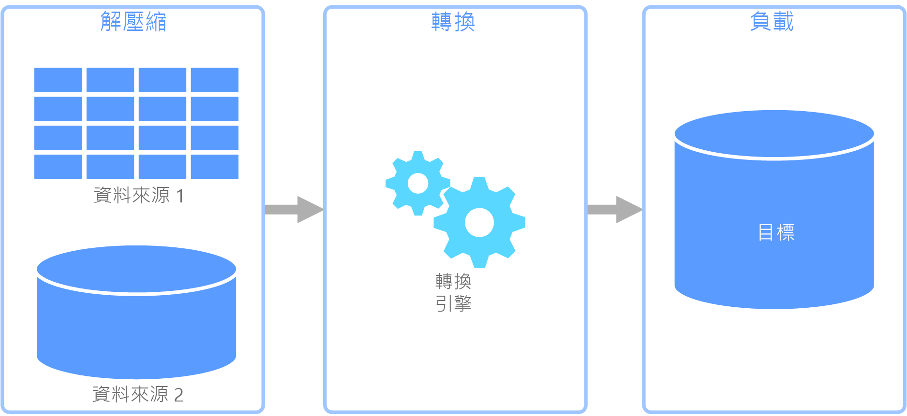
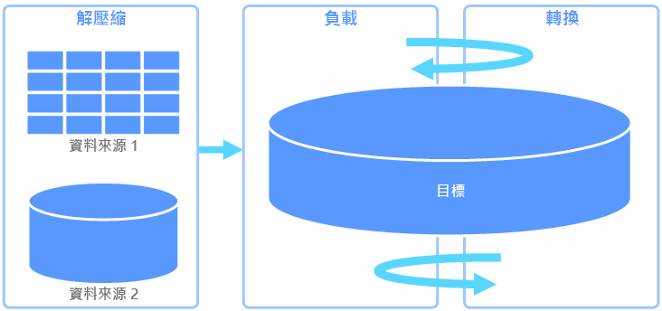
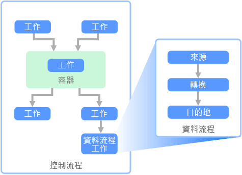

# 擷取、轉換和載入 (ETL)Extract, transform, and load (ETL)

組織常面臨的問題之一，是如何收集來自多個資料來源、採用多種格式的資料，並將其移至一或多個資料存放區。A common problem that organizations face is how to gathering data from multiple sources, in multiple formats, and move it to one or more data stores. 目的地可能不是與來源相同類型的資料存放區，且格式也經常不同，或需要先經過圖形化或清理才能載入其最終目的地中。The destination may not be the same type of data store as the source, and often the format is different, or the data needs to be shaped or cleaned before loading it into its final destination.

過去幾年已開發出多種有助於克服這些難題的工具、服務和程序。Various tools, services, and processes have been developed over the years to help address these challenges. 無論使用何種程序，都需要協調工作，並在資料管線中執行某種程度的資料轉換。No matter the process used, there is a common need to coordinate the work and apply some level of data transformation within the data pipeline. 下列幾節將特別說明用來執行這些工作的常見方法。The following sections highlight the common methods used to perform these tasks.

## 擷取、轉換和載入 (ETL) 流程Extract, transform, and load (ETL) process

擷取、轉換和載入 (ETL) 是一種資料管線，用以收集不同來源的資料、根據商務規則轉換資料，然後將其載入至目的地資料存放區。Extract, transform, and load (ETL) is a data pipeline used to collect data from various sources, transform the data according to business rules, and load it into a destination data store. ETL 的轉換工作會以特殊引擎執行，且通常牽涉到使用暫存資料表在資料轉換時暫時保存資料，而最終載入至其目的地。The transformation work in ETL takes place in a specialized engine, and often involves using staging tables to temporarily hold data as it is being transformed and ultimately loaded to its destination.

資料轉換在執行時通常牽涉到各種作業，例如篩選、排序、彙總、聯結資料、清除資料、刪除重複資料，以及驗證資料。The data transformation that takes place usually involves various operations, such as filtering, sorting, aggregating, joining data, cleaning data, deduplicating, and validating data.

這三個 ETL 階段通常會以平行方式執行，以節省時間。Often, the three ETL phases are run in parallel to save time. 例如，在擷取資料時，轉換程序即會處理使用已接收的資料，並且準備進行載入，而載入程序也無須等到整個擷取程序完成後才開始處理已備妥的資料。For example, while data is being extracted, a transformation process could be working on data already received and prepare it for loading, and a loading process can begin working on the prepared data, rather than waiting for the entire extraction process to complete.

相關 Azure 服務：Relevant Azure service:

- [Azure Data Factory v2Azure Data Factory v2](https://azure.microsoft.com/services/data-factory/)

其他工具：Other tools:

- [SQL Server Integration Services (SSIS)SQL Server Integration Services (SSIS)](/sql/integration-services/sql-server-integration-services)

## 擷取、載入和轉換 (ELT)Extract, load, and transform (ELT)

擷取、載入和轉換 (ELT) 與 ETL 的不同之處，僅在於轉換的執行位置。Extract, load, and transform (ELT) differs from ETL solely in where the transformation takes place. 在 ELT 管線中，轉換會在目標資料存放區中執行。In the ELT pipeline, the transformation occurs in the target data store. 此時並不會使用個別的轉換引擎，而是使用目標資料存放區的處理功能來轉換資料。Instead of using a separate transformation engine, the processing capabilities of the target data store are used to transform data. 如此即不需要在管線中使用轉換引擎，因而能簡化架構。This simplifies the architecture by removing the transformation engine from the pipeline. 這個方法的另一個好處是，調整目標資料存放區時，也會調整 ELT 管線效能。Another benefit to this approach is that scaling the target data store also scales the ELT pipeline performance. 不過，只有在目標系統的功能足以有效率地轉換資料時，ELT 才能妥善運作。However, ELT only works well when the target system is powerful enough to transform the data efficiently.

ELT 通常會用於巨量資料領域中。Typical use cases for ELT fall within the big data realm. 例如，一開始您可能會將所有來源資料擷取到可擴充儲存體中的一般檔案，例如 Hadoop 分散式檔案系統 (HDFS) 或 Azure Data Lake Store。For example, you might start by extracting all of the source data to flat files in scalable storage such as Hadoop distributed file system (HDFS) or Azure Data Lake Store. 接著，您可以使用 Spark、Hive 或 PolyBase 等技術來查詢來源資料。Technologies such as Spark, Hive, or PolyBase can then be used to query the source data. 使用 ELT 的重點在於，用來執行轉換的資料存放區與最終使用資料的是同一個資料存放區。The key point with ELT is that the data store used to perform the transformation is the same data store where the data is ultimately consumed. 此資料存放區會直接讀取可擴充儲存體，而不是將資料載入到本身專屬的儲存體。This data store reads directly from the scalable storage, instead of loading the data into its own proprietary storage. 這種方法可略過存在於 ETL 中的資料複製步驟，此作業在處理大型資料集時可能十分耗時。This approach skips the data copy step present in ETL, which can be a time consuming operation for large data sets.

在實務上，目標資料存放區會是使用 Hadoop 叢集 (使用 Hive 或 Spark) 或 SQL 資料倉儲的[資料倉儲](./data-warehousing.md)。In practice, the target data store is a [data warehouse](./data-warehousing.md) using either a Hadoop cluster (using Hive or Spark) or a SQL Data Warehouse. 一般而言，結構描述在查詢時期會覆疊在一般檔案資料上，並儲存為資料表，讓資料能夠像資料存放區中的任何其他資料表一樣受到查詢。In general, a schema is overlaid on the flat file data at query time and stored as a table, enabling the data to be queried like any other table in the data store. 這些資料表稱為外部資料表，因為資料並不在資料存放區本身所管理的儲存體中，而是在某個外部可擴充儲存體上。These are referred to as external tables because the data does not reside in storage managed by the data store itself, but on some external scalable storage.

資料存放區只會管理資料的結構描述，並在讀取時套用結構描述。The data store only manages the schema of the data and applies the schema on read. 例如，使用 Hive 的 Hadoop 叢集會描述資料來源可作為 HDFS 中一組檔案之路徑的 Hive 資料表。For example, a Hadoop cluster using Hive would describe a Hive table where the data source is effectively a path to a set of files in HDFS. 在 SQL 資料倉儲中，PolyBase 可達到相同的結果 &mdash; 針對在資料庫本身以外儲存的資料，建立一個資料表。In SQL Data Warehouse, PolyBase can achieve the same result &mdash; creating a table against data stored externally to the database itself. 在來源資料載入後，可以使用資料存放區的功能來處理外部資料表中的資料。Once the source data is loaded, the data present in the external tables can be processed using the capabilities of the data store. 在巨量資料案例中，這意味著資料存放區必須具有大量平行處理 (MPP) 的能力，而將資料分成較小的區塊，並將區塊的處理以平行方式分散到多部電腦。In big data scenarios, this means the data store must be capable of massively parallel processing (MPP), which breaks the data into smaller chunks and distributes processing of the chunks across multiple machines in parallel.

ELT 管線的最後階段，通常是將來源資料轉換為能夠使需要支援的查詢類型更有效率的最終格式。The final phase of the ELT pipeline is typically to transform the source data into a final format that is more efficient for the types of queries that need to be supported. 例如，此時可能會分割資料。For example, the data may be partitioned. 此外，ELT 可能會使用 Parquet 之類的最佳化儲存格式，以單欄方式儲存資料列導向的資料，並提供最佳化索引。Also, ELT might use optimized storage formats like Parquet, which stores row-oriented data in a columnar fashion and providess optimized indexing.

相關 Azure 服務：Relevant Azure service:

- [Azure SQL 資料倉儲Azure SQL Data Warehouse](/azure/sql-data-warehouse/sql-data-warehouse-overview-what-is)
- [具有 Hive 的 HDInsightHDInsight with Hive](/azure/hdinsight/hadoop/hdinsight-use-hive)
- [Azure Data Factory v2Azure Data Factory v2](https://azure.microsoft.com/services/data-factory/)
- [HDInsight 上的 OozieOozie on HDInsight](/azure/hdinsight/hdinsight-use-oozie-linux-mac)

其他工具：Other tools:

- [SQL Server Integration Services (SSIS)SQL Server Integration Services (SSIS)](/sql/integration-services/sql-server-integration-services)

## 資料流程和控制流程Data flow and control flow

在資料管線的內容中，控制流程可確保一組工作能夠以正確的順序進行處理。In the context of data pipelines, the control flow ensures orderly processing of a set of tasks. 為了對這些工作強制執行正確的處理順序，會使用優先順序條件約束。To enforce the correct processing order of these tasks, precedence constraints are used. 您可以將這些條件約束視為工作流程圖中的連接線，如下圖所示。You can think of these constraints as connectors in a workflow diagram, as shown in the image below. 每個工作都會有結果，例如成功、失敗或完成。Each task has an outcome, such as success, failure, or completion. 任何後續的工作都必須等到上一個工作完成並產生前述其中一個結果後，才會開始處理。Any subsequent task does not initiate processing until its predecessor has completed with one of these outcomes.

控制流程會以工作的形式執行資料流程。Control flows execute data flows as a task. 在資料流程工作中，會從來源擷取資料、加以轉換，或載入資料存放區中。In a data flow task, data is extracted from a source, transformed, or loaded into a data store. 一個資料流程工作的輸出可以是下一個資料流程工作的輸入，且資料流程可以平行執行。The output of one data flow task can be the input to the next data flow task, and data flowss can run in parallel. 不同於控制流程，您無法在資料流程中的工作之間新增條件約束。Unlike control flows, you cannot add constraints between tasks in a data flow. 不過，您可以新增資料檢視器，以觀察每項工作正在處理的資料。You can, however, add a data viewer to observe the data as it is processed by each task.

在上圖中，控制流程內有數項工作，其中之一是資料流程工作。In the diagram above, there are several tasks within the control flow, one of which is a data flow task. 其中一項工作內嵌於容器中。One of the tasks is nested within a container. 容器可以用來提供工作的結構，進而提供工作單位。Containers can be used to provide structure to tasks, providing a unit of work. 舉例來說，集合中的重複元素即是如此，例如資料夾中的檔案或資料庫陳述式。One such example is for repeating elements within a collection, such as files in a folder or database statements.

相關 Azure 服務：Relevant Azure service:

- [Azure Data Factory v2Azure Data Factory v2](https://azure.microsoft.com/services/data-factory/)

其他工具：Other tools:

- [SQL Server Integration Services (SSIS)SQL Server Integration Services (SSIS)](/sql/integration-services/sql-server-integration-services)

## 技術選擇Technology choices

- [線上交易處理 (OLTP) 資料存放區Online Transaction Processing (OLTP) data stores](./online-transaction-processing.md#oltp-in-azure)
- [線上分析處理 (OLTP) 資料存放區Online Analytical Processing (OLAP) data stores](./online-analytical-processing.md#olap-in-azure)
- [資料倉儲Data warehouses](./data-warehousing.md)
- [管線協調流程Pipeline orchestration](../technology-choices/pipeline-orchestration-data-movement.md)

## 後續步驟Next steps

下列參考架構顯示 Azure 上的端對端 ELT 管線：The following reference architectures show end-to-end ELT pipelines on Azure:

- [Azure 中具 SQL 資料倉儲的 Enterprise BIEnterprise BI in Azure with SQL Data Warehouse](../../reference-architectures/data/enterprise-bi-sqldw.md)
- [具 SQL 資料倉儲和 Azure Data Factory 的自動化 Enterprise BIAutomated enterprise BI with SQL Data Warehouse and Azure Data Factory](../../reference-architectures/data/enterprise-bi-adf.md)