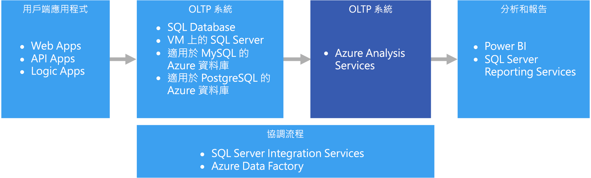
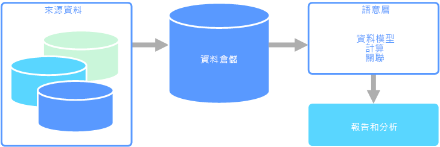

# 線上分析處理 (OLAP)

線上分析處理 (OLAP) 是一種可組織大型企業資料庫和支援複雜分析的技術。 它可用來執行複雜的分析查詢，且不會對交易系統造成負面影響。

企業用來儲存其所有交易和記錄的資料庫，稱為[線上交易處理 (OLTP)](online-transaction-processing.md) 資料庫。 這些資料庫通常具有逐一輸入的記錄。 它們常包含大量對組織有價值的資訊。 不過，用於 OLTP 的資料庫並不是針對分析而設計的。 因此，要從這些資料庫擷取答案，必須耗費許多時間與精力。 OLAP 系統的目的是要協助您以高效能的方式從資料中擷取這項商業智慧資訊。 這是因為，OLAP 資料庫針對大量讀取、低量寫入工作負載而進行了最佳化。

 

## 語意模型

語意資料模型是一種會說明它所包含的資料元素代表何意的概念模型。 組織通常會有自己的詞彙，有時也會有同義字，甚或相同的詞彙會有不同的意義。 例如，庫存資料庫可能會以資產識別碼和序號追蹤某項設備，但銷售資料庫卻可能將序號視為資產識別碼。 若未以模型說明關聯性，即無法輕易釐清這些值的關聯。 

語意模型提供了資料庫結構描述的抽象層，讓使用者無須了解基礎資料結構。 這可讓使用者更容易查詢資料，而無須對基礎結構描述執行彙總與聯結。 此外，資料行通常也會重新命名為使用者易記的名稱，而使得資料的內容和意義更容易理解。

語意模型絕大多數用於大量讀取案例，例如分析和商業智慧 (OLAP)，而不是大量寫入的交易資料處理 (OLTP)。 這主要是由於一般語意層的本質所致：

- 會設定彙總行為，讓報告工具能夠正確顯示這些行為。
- 會定義商務邏輯和計算方式。
- 會包含時間導向的計算。
- 資料常整合自多個來源。 

傳統上，資料倉儲之所以加上語意層，都是基於這些原因。

語意模型主要分成兩種類型：

* **表格式**。 使用關聯式模型建構 (模型、資料表、資料行)。 在內部，中繼資料會繼承自 OLAP 模型建構 (Cube、維度、量值)。 程式碼和指令碼會使用 OLAP 中繼資料。
* **多維度**。 使用傳統 OLAP 模型建構 (Cube、維度、量值)。

相關 Azure 服務：
- [Azure Analysis Services](https://azure.microsoft.com/services/analysis-services/)

## 使用案例範例

某個組織有儲存在大型資料庫中的資料。 該組織想要將此資料提供給商業使用者與客戶建立其自己的報表，並進行某些分析。 其中一個選項，是直接將資料庫的直接存取權提供給這些使用者。 不過，這麼做有幾個缺點，包括必須管理安全性和控制存取。 此外，使用者可能難以了解資料庫的設計，包括資料表和資料行的名稱。 使用者必須知道應查詢哪些資料表、如何聯結這些資料表，以及還必須套用哪些商務邏輯才能取得正確的結果。 使用者甚至還必須了解類似於 SQL 的查詢語言，才能展開作業。 這通常會導致報告相同計量的多個使用者得到不同的結果。

另一個選項，是將使用者所需的所有資訊封裝在語意模型中。 使用者可使用自己選擇的報告工具，更輕鬆地查詢語意模型。 語意模型所提供的資料提取自資料倉儲，以確保所有使用者會都看到相同版本的事實。 語意模型也提供易記的資料表和資料行名稱、資料表之間的關聯性、描述、計算和資料列層級安全性。

## 語意模型的一般特性

語意模型和分析處理常會有下列特性：

| 需求 | 說明 |
| --- | --- |
| 結構描述 | 寫入結構描述，強制執行|
| 使用交易 | 否 |
| 鎖定策略 | None |
| 可更新 | 否 (通常需要重新計算 Cube) |
| 可附加 | 否 (通常需要重新計算 Cube) |
| 工作負載 | 大量讀取，唯讀 |
| 編製索引 | 多維度索引 |
| 資料大小 | 中小型 |
| 模型 | 多維度 |
| 資料圖形：| Cube 或星狀/雪花式結構描述 |
| 查詢彈性 | 高彈性 |
| 規模： | 大型 (10s-100s GB) |

## 此解決方案的使用時機

在下列情況下請考慮使用 OLAP：

- 您需要快速執行複雜的分析與特定查詢，且不會對 OLTP 系統造成負面影響。 
- 您想要為商業使用者提供簡單的方式，從您的資料產生報表
- 您想要提供多種彙總方式，讓使用者能夠取得快速且一致的結果。 

為大量資料套用彙總計算時，OLAP 特別具有效益。 OLAP 系統針對大量讀取案例進行了最佳化，例如分析和商業智慧。 OLAP 可讓使用者將多維度資料切分成能夠二維檢視的配量 (例如樞紐分析表)，或是依特定值篩選資料。 此程序有時也稱為「切割與細分」資料，無論資料是否跨數個資料來源進行分割，都可以執行。 這有助於使用者找出趨勢和模式以及瀏覽資料，而無須得知傳統資料分析的詳細資料。

語意模型可協助商業使用者抽離關聯的複雜性，而更輕鬆快速地分析資料。

## 挑戰

在獲得 OLAP 系統提供的所有優點之前，有若干難題有待克服：

- 雖然 OLTP 系統中的資料會透過從各種來源流入的交易持續更新，但 OLAP 資料存放區通常會根據商業需求，以頻率遠低於此的間隔重新整理。 這表示 OLAP 系統較適用於策略性商業決策，而不是對變更的立即回應。 此外，也必須規劃某種程度的資料清理和協調流程，讓 OLAP 資料存放區保持在最新狀態。
- 不同於出現在 OLTP 系統中的傳統正規化關聯式資料表，OLAP 資料模型通常是多維度的。 這樣就不容易甚至無法直接對應至實體關聯性或物件導向模型，因為每個屬性會對應至一個資料行。 相對地，OLAP 系統通常會以星形或雪花式結構描述來取代傳統的正規化。

## Azure 中的 OLAP

在 Azure 中，保存在 OLTP 系統 (例如 Azure SQL Database) 中的資料會複製到 OLAP 系統中，例如 [Azure Analysis Services](/azure/analysis-services/analysis-services-overview)。 資料探索和視覺效果工具 (像是 [Power BI](https://powerbi.microsoft.com)、Excel 和第三方工具) 會連線至 Analysis Services 伺服器，並且可讓使用者以高度互動和豐富的視覺化方式深入了解模型資料。 從 OLTP 到 OLAP 的資料流程通常會使用 SQL Server Integration Services 進行協調，而這些服務可使用 [Azure Data Factory](/azure/data-factory/concepts-integration-runtime) 來執行。

在 Azure 中，下列所有資料存放區均符合 OLAP 的核心需求：

- [包含資料行存放區索引的 SQL Server](/sql/relational-databases/indexes/get-started-with-columnstore-for-real-time-operational-analytics)
- [Azure Analysis Services](/azure/analysis-services/analysis-services-overview)
- [SQL Server Analysis Services (SSAS)](/sql/analysis-services/analysis-services)

SQL Server Analysis Services (SSAS) 可提供適用於商業智慧應用程式的 OLAP 和資料採礦功能。 您可以將 SSAS 安裝在本機伺服器上，也可以將其裝載在 Azure 的虛擬機器中。 Azure Analysis Services 是完全受控的服務，可提供與 SSAS 相同的主要功能。 Azure Analysis Services 支援連線到貴組織之雲端和內部部署環境的[各種資料來源](/azure/analysis-services/analysis-services-datasource)。

叢集化的資料行存放區索引可在 SQL Server 2014 和更新版本以及 Azure SQL Database 中取得，而且適用於 OLAP 工作負載。 不過，從 SQL Server 2016 (包括 Azure SQL Database) 開始，您已可透過使用可更新的非叢集化資料行存放區索引來利用混合式交易式/分析處理 (HTAP)。 HTAP 可讓您在相同平台上執行 OLTP 與 OLAP 處理，讓您不必儲存多個資料複本，也不需要有不同的 OLTP 與 OLAP 系統。 如需詳細資訊，請參閱[開始使用資料行存放區來進行即時作業分析](/sql/relational-databases/indexes/get-started-with-columnstore-for-real-time-operational-analytics)。

## 重要選取準則

若要縮小選項範圍，請開始回答這些問題：

- 您是否想擁有受控服務，而不是自行管理伺服器？

- 您是否需要使用 Azure Active Directory (Azure AD) 的安全驗證？

- 您是否要進行即時分析？ 如果是，請將您的選擇範圍縮小至支援即時分析的選項。 

    此內容中的「即時分析」適用於會同時執行操作和分析工作負載的單一資料來源 (例如企業資源規劃 (ERP) 應用程式)。 如果您需要整合多個來源的資料，或是需要使用預先彙總的資料 (如 Cube) 來獲得極致的分析效能，您可能還是需要個別的資料倉儲。

- 您是否需要使用預先彙總的資料，例如，為了提供語意模型從而讓商務使用者更容易進行分析？ 如果是，請選擇支援多維度 Cube 或表格式語意模型的選項。 

    提供彙總可協助使用者以一致的方式計算資料彙總。 預先彙總的資料在處理跨多個資料列的數個資料行時，也可以提供大幅提升的效能。 資料可在多維度 Cube 或表格式語意模型中預先彙總。

- 除了您的 OLTP 資料存放區，您是否需要整合多個來源的資料？ 如果是，請考慮可輕鬆整合多個資料來源的選項。

## 功能對照表

下表摘要列出各項功能的主要差異。

### 一般功能

| | Azure Analysis Services | SQL Server Analysis Services | 包含資料行存放區索引的 SQL Server | 包含資料行存放區索引的 Azure SQL Database |
| --- | --- | --- | --- | --- |
| 屬於受控服務 | yes | 否 | 否 | yes |
| 支援多維度 Cube | 否 | yes | 否 | 否 |
| 支援表格式語意模型 | yes | yes | 否 | 否 |
| 可輕鬆整合多個資料來源 | yes | yes | 否 1 | 否 1 |
| 支援即時分析 | 否 | 否 | yes | yes |
| 需要從來源複製資料的程序 | yes | yes | 否 | 否 |
| Azure AD 整合 | yes | 否 | 否 2 | yes |

[1] SQL Server 和 Azure SQL Database 雖無法作為查詢來源並整合多個外部資料來源，但您仍可使用 [SSIS](/sql/integration-services/sql-server-integration-services) 或 [Azure Data Factory](/azure/data-factory/) 建置管線來為您執行此工作。 裝載於 Azure 虛擬機器的 SQL Server 有其他選項，例如連結的伺服器和 [PolyBase](/sql/relational-databases/polybase/polybase-guide)。 如需詳細資訊，請參閱[管線協調流程、控制流程和資料移動](../technology-choices/pipeline-orchestration-data-movement.md)。

[2] 不支援使用 Azure AD 帳戶來連線至 Azure 虛擬機器上所執行的 SQL Server。 請改用 Active Directory 網域帳戶。

### 延展性功能

|                                                  | Azure Analysis Services | SQL Server Analysis Services | 包含資料行存放區索引的 SQL Server | 包含資料行存放區索引的 Azure SQL Database |
|--------------------------------------------------|-------------------------|------------------------------|-------------------------------------|---------------------------------------------|
| 高可用性的備援區域伺服器 |           yes           |              否              |                 yes                 |                     yes                     |
|             支援查詢相應放大             |           yes           |              否              |                 yes                 |                     否                      |
|          動態延展性 (相應增加)          |           yes           |              否              |                 yes                 |                     否                      |

