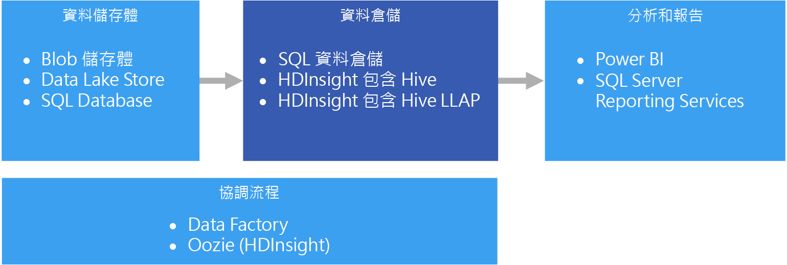

# 資料倉儲和資料超市Data warehousing and data marts

資料倉儲是從一或多個不同的來源 (跨多個或所有主體區域) 整合資料的中央、組織、關聯式存放庫。A data warehouse is a central, organizational, relational repository of integrated data from one or more disparate sources, across many or all subject areas. 資料倉儲會儲存目前的資料和歷史資料，可多方面運用於資料的報告和分析。Data warehouses store current and historical data and are used for reporting and analysis of the data in different ways.

資料移至資料倉儲時，系統會定期從包含重要商業資訊的各種來源擷取資料。To move data into a data warehouse, it is extracted on a periodic basis from various sources that contain important business information. 資料移動時，可進行格式化、清理、驗證、摘要和重新組織。As the data is moved, it can be formatted, cleaned, validated, summarized, and reorganized. 或者，也可以用最低的詳細程度儲存資料，並在倉儲中提供彙總檢視以供報告之用。Alternately, the data can be stored in the lowest level of detail, with aggregated views provided in the warehouse for reporting. 無論採用何種方式，資料倉儲都會成為用於報告、分析和使用商業智慧 (BI) 工具形成重要商務決策的資料所使用的永久儲存空間。In either case, the data warehouse becomes a permanent storage space for data used for reporting, analysis, and forming important business decisions using business intelligence (BI) tools.

## 資料超市和作業資料存放區Data marts and operational data stores

管理大規模的資料是複雜的工作，而以單一資料倉儲呈現整個企業的所有資料，也愈來愈少見了。Managing data at scale is complex, and it is becoming less common to have a single data warehouse that represents all data across the entire enterprise. 反之，組織會建立較小而更為聚焦的資料倉儲 (稱為*資料超市*)，以公開分析所需的資料。Instead, organizations create smaller, more focused data warehouses, called *data marts*, that expose the desired data for analytics purposes. 協調程序會將作業資料存放區中維護的資料填入資料超市。An orchestration process populates the data marts from data maintained in an operational data store. 作業資料存放區會作為來源交易系統與資料超市之間的媒介。The operational data store acts as an intermediary between the source transactional system and the data mart. 作業資料存放區所管理的資料來源是交易系統中的資料經清理後的版本，且通常是資料倉儲或資料超市所維護之歷史資料的子集。Data managed by the operational data store is a cleaned version of the data present in the source transactional system, and is typically a subset of the historical data that is maintained by the data warehouse or data mart. 

## 使用此解決方案的時機When to use this solution

當您需要將作業系統中的大量資料轉換為容易了解、最新且正確的格式時，請選擇資料倉儲。Choose a data warehouse when you need to turn massive amounts of data from operational systems into a format that is easy to understand, current, and accurate. 資料倉儲不需要依循您在作業/OLTP 資料庫中可能使用的相同簡易資料結構。Data warehouses do not need to follow the same terse data structure you may be using in your operational/OLTP databases. 您可以使用對商業使用者和分析師具有意義的資料行名稱、重新建構結構描述以簡化資料關聯性，並將多個資料表合併為一個。You can use column names that make sense to business users and analysts, restructure the schema to simplify data relationships, and consolidate several tables into one. 這些步驟有助於引導需要建立隨選報表或需要在 BI 系統中建立報表及分析資料的使用者，在沒有資料庫管理員 (DBA) 或資料開發人員的協助下完成操作。These steps help guide users who need to create ad hoc reports, or create reports and analyze the data in BI systems, without the help of a database administrator (DBA) or data developer.

如果您基於效能考量而需要在來源交易系統以外保留歷史資料，請考慮使用資料倉儲。Consider using a data warehouse when you need to keep historical data separate from the source transaction systems for performance reasons. 資料倉儲提供使用通用格式、通用索引鍵、通用資料模型和通用存取方法的集中式位置，可讓您輕鬆地多個位置存取歷史資料。Data warehouses make it easy to access historical data from multiple locations, by providing a centralized location using common formats, common keys, common data models, and common access methods.

資料倉儲針對讀取存取進行了最佳化，因此報表產生的速度會優於直接對來源交易系統執行報表。Data warehouses are optimized for read access, resulting in faster report generation compared to running reports against the source transaction system. 此外，資料倉儲還具有下列優點：In addition, data warehouses provide the following benefits:

* 來自多個來源的所有歷史資料，都可視為單一真實來源進行儲存以及從資料倉儲存取。All historical data from multiple sources can be stored and accessed from a data warehouse as the single source of truth.
* 您可以在資料匯入至資料倉儲加以清理、提供更精確的資料，以及提供一致的程式碼和描述，而改善資料品質。You can improve data quality by cleaning up data as it is imported into the data warehouse, providing more accurate data as well as providing consistent codes and descriptions.
* 報告工具不會與交易來源系統競爭查詢處理週期。Reporting tools do not compete with the transactional source systems for query processing cycles. 資料倉儲可讓交易系統主要著重於寫入的處理，而大部分的讀取要求則由資料倉儲負責因應。A data warehouse allows the transactional system to focus predominantly on handling writes, while the data warehouse satisfies the majority of read requests.
* 資料倉儲有助於整合來自不同軟體的資料。A data warehouse can help consolidate data from different software.
* 資料採礦工具可協助您使用自動方法在您的倉儲所儲存的資料中找出隱藏的模式。Data mining tools can help you find hidden patterns using automatic methodologies against data stored in your warehouse.
* 透過資料倉儲，將更容易為授權使用者提供安全的存取，同時限制其他人的存取。Data warehouses make it easier to provide secure access to authorized users, while restricting access to others. 由於不需要為商業使用者授與資料來源的存取權，對於一或多個生產交易系統的潛在攻擊媒介因而消除。There is no need to grant business users access to the source data, thereby removing a potential attack vector against one or more production transaction systems.
* 資料倉儲可讓您輕鬆地以資料建立商業智慧解決方案，例如 [OLAP Cube](online-analytical-processing.md)。Data warehouses make it easier to create business intelligence solutions on top of the data, such as [OLAP cubes](online-analytical-processing.md).

## 挑戰Challenges

要適當設定資料倉儲以符合個人商業需求，可能必須先克服下列難題：Properly configuring a data warehouse to fit the needs of your business can bring some of the following challenges:

* 確認正確建立商業概念模型所需的時間。Committing the time required to properly model your business concepts. 這是重要的步驟，因為資料倉儲是由資訊驅動的，專案的其餘部分皆由概念對應所推動。This is an important step, as data warehouses are information driven, where concept mapping drives the rest of the project. 這牽涉到商業相關詞彙和通用格式的標準化 (例如貨幣或日期)，和以對商業使用者具有意義，但仍可確保資料彙總與關聯性之正確性的方式重新建構結構描述。This involves standardizing business-related terms and common formats (such as currency and dates), and restructuring the schema in a way that makes sense to business users but still ensures accuracy of data aggregates and relationships.
* 規劃和設定您的資料協調流程。Planning and setting up your data orchestration. 應考量的事項包括如何將資料從來源交易系統複製到資料倉儲，以及何時將歷史資料移出作業資料存放區，並移至倉儲中。Consideration include how to copy data from the source transactional system to the data warehouse, and when to move historical data out of your operational data stores and into the warehouse.
* 在資料匯入至倉儲時加以清理，以維護或改善資料品質。Maintaining or improving data quality by cleaning the data as it is imported into the warehouse.

## Azure 中的資料倉儲Data warehousing in Azure

在 Azure 中，您的資料可能會有一或多個來源，無論是來自客戶交易，還是來自不同部門所使用的各種商業應用程式。In Azure, you may have one or more sources of data, whether from customer transactions, or from various business applications used by various departments. 過去，此資料會儲存在一或多個 [OLTP](online-transaction-processing.md) 資料庫中。This data is traditionally stored in one or more [OLTP](online-transaction-processing.md) databases. 資料可持續保存在其他儲存媒體中，例如網路共用、Azure 儲存體 Blob 或 Data Lake。The data could be persisted in other storage mediums such as network shares, Azure Storage Blobs, or a data lake. 資料也可由資料倉儲本身儲存，或儲存在關聯式資料庫中，例如 Azure SQL Database。The data could also be stored by the data warehouse itself or in a relational database such as Azure SQL Database. 分析資料存放區層的目的是為了因應分析和報告工具對資料倉儲或資料超市所發出的查詢。The purpose of the analytical data store layer is to satisfy queries issued by analytics and reporting tools against the data warehouse or data mart. 在 Azure 中，這項分析存放區功能可透過 Azure SQL 資料倉儲或使用 Hive 或互動式查詢的 Azure HDInsight 來提供。In Azure, this analytical store capability can be met with Azure SQL Data Warehouse, or with Azure HDInsight using Hive or Interactive Query. 此外，您將需要某種程度的協調流程，以定期將資料從資料儲存體移動或複製到資料倉儲，而此功能則可藉由 Azure Data Factory 或 Azure HDInsight 上的 Oozie 來提供。In addition, you will need some level of orchestration to periodically move or copy data from data storage to the data warehouse, which can be done using Azure Data Factory or Oozie on Azure HDInsight.

相關服務：Related services:

* [Azure SQL DatabaseAzure SQL Database](/azure/sql-database/)
* [虛擬機器中的 SQL ServerSQL Server in a VM](/sql/sql-server/sql-server-technical-documentation)
* [Azure 資料倉儲Azure Data Warehouse](/azure/sql-data-warehouse/sql-data-warehouse-overview-what-is)
* [HDInsight 上的 Apache HiveApache Hive on HDInsight](/azure/hdinsight/hadoop/hdinsight-use-hive)
* [HDInsight 上的互動式查詢 (Hive LLAP)Interactive Query (Hive LLAP) on HDInsight](/azure/hdinsight/interactive-query/apache-interactive-query-get-started)

## 技術選擇Technology choices

- [資料倉儲Data warehouses](../technology-choices/data-warehouses.md)
- [管線協調流程Pipeline orchestration](../technology-choices/pipeline-orchestration-data-movement.md)

