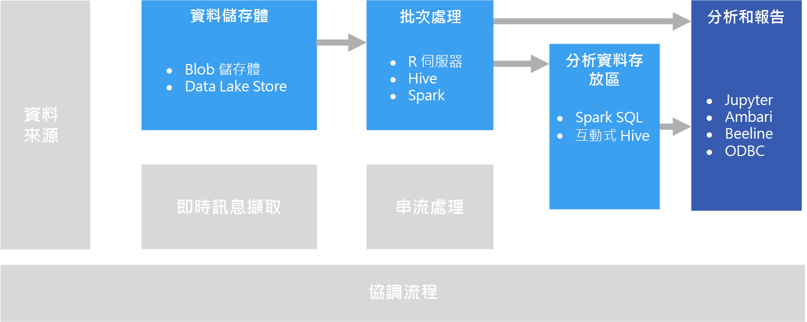

# 互動式資料探索Interactive data exploration

在許多企業商業智慧 (BI) 解決方案中，都會由 BI 專業人員建立報表和語意模型，並集中加以管理。In many corporate business intelligence (BI) solutions, reports and semantic models are created by BI specialists and managed centrally. 不過，有越來越多的組織開始想為使用者提供資料導向決策能力。Increasingly, however, organizations want to enable users to make data-driven decisions. 此外，也有越來越多的組織開始雇用*資料科學家*或*資料分析師*，其工作是以互動方式探索資料，並套用統計模型和分析技術，以在資料中找出趨勢與模式。Additionally, a growing number of organizations are hiring *data scientists* or *data analysts*, whose job is to explore data interactively and apply statistical models and analytical techniques to find trends and patterns in the data. 要執行互動式資料探索，必須要有相關工具和平台，提供以低延遲性處理特定查詢和資料視覺效果的能力。Interactive data exploration requires tools and platforms that provide low-latency processing for ad-hoc queries and data visualizations.

## 自助式 BISelf-service BI

自助式 BI 是新型商業決策方法被賦予的名稱；此方法的使用者能夠尋找、探索及共用對整個企業的資料產生的判讀。Self-service BI is a name given to a modern approach to business decision making in which users are empowered to find, explore, and share insights from data across the enterprise. 為此，資料解決方案必須支援幾項需求：To accomplish this, the data solution must support several requirements:

- 可透過資料目錄探索商業資料來源。Discovery of business data sources through a data catalog.
- 可掌控資料管理，以確保資料實體定義和值的一致性。Master data management to ensure consistency of data entity definitions and values.
- 有互動式資料模型和視覺效果工具供商業使用者使用。Interactive data modeling and visualization tools for business users.

在自助式 BI 解決方案中，商業使用者通常會尋找並取用與其特定業務領域相關的資料來源，並使用直覺式工具和生產力應用程式定義可與同事共用的個人資料模型和報表。In a self-service BI solution, business users typically find and consume data sources that are relevant to their particular area of the business, and use intuitive tools and productivity applications to define personal data models and reports that they can share with their colleagues.

相關 Azure 服務：Relevant Azure services:

- [Azure 資料目錄Azure Data Catalog](/azure/data-catalog/data-catalog-what-is-data-catalog)
- [Microsoft Power BIMicrosoft Power BI](https://powerbi.microsoft.com/)

## 資料科學測試Data science experimentation

當組織需要執行進階分析和建立預測模型時，通常會由專業的資料科學家負責進行最初的準備工作。When an organization requires advanced analytics and predictive modeling, the initial preparation work is usually undertaken by specialist data scientists. 資料科學家會探索資料並套用統計分析技術，以找出資料*特性*與所需的預測*標籤*之間的關聯性。A data scientist explores the data and applies statistical analytical techniques to find relationships between data *features* and the desired predicted *labels*. 資料探索通常會使用原本即支援統計模型和視覺效果的 Python 或 R 之類的程式設計語言來完成。Data exploration is typically done using programming languages such as Python or R that natively support statistical modeling and visualization. 用來探索資料的指令碼通常會裝載在特製化環境中，例如 Jupyter Notebook。The scripts used to explore the data are typically hosted in specialized environments such as Jupyter Notebooks. 這些工具可讓資料科學家以程式設計方式探索資料，同時記錄及共用他們所發現的判讀結果。These tools enable data scientists to explore the data programmatically while documenting and sharing the insights they find.

相關 Azure 服務：Relevant Azure services:

- [Azure NotebooksAzure Notebooks](https://notebooks.azure.com/)
- [Azure Machine Learning StudioAzure Machine Learning Studio](/azure/machine-learning/studio/what-is-ml-studio)
- [Azure Machine Learning 測試服務Azure Machine Learning Experimentation Services](/azure/machine-learning/preview/experimentation-service-configuration)
- [資料科學虛擬機器The Data Science Virtual Machine](/azure/machine-learning/data-science-virtual-machine/overview)

## 挑戰Challenges

- **資料隱私權合規性**。**Data privacy compliance**. 您將個人資料提供給使用者用於自助式分析和報告時，必須十分謹慎。You need to be careful about making personal data available to users for self-service analysis and reporting. 基於組織原則和法令規定，可能會有合規性方面的事項需要注意。There are likely to be compliance considerations, due to organizational policies and also regulatory issues.

- **資料量**。**Data volume**. 雖然為使用者提供完整資料來源的存取權可能有其效益，但這可能會導致執行時間冗長的 Excel 或 Power BI 作業，或是使用大量叢集資源的 Spark SQL 查詢。While it may be useful to give users access to the full data source, it can result in very long-running Excel or Power BI operations, or Spark SQL queries that use a lot of cluster resources.

- **使用者知識**。**User knowledge**. 使用者可建立自己的查詢與彙總，以傳達商業決策。Users create their own queries and aggregations in order to inform business decisions. 您確定使用者擁有取得正確結果所需的分析資料和查詢技能嗎？Are you confident that users have the necessary analytical and querying skills to get accurate results?

- **共用結果**。**Sharing results**. 如果使用者可以建立和共用報表或視覺化資料，即可能有安全上的顧慮。There may be security considerations if users can create and share reports or data visualizations.

## 架構Architecture

雖然此案例的目標是要支援互動式資料分析，但資料科學所牽涉到的資料清理、取樣和結構化工作，常會包含長時間執行的程序。Although the goal of this scenario is to support interactive data analysis, the data cleansing, sampling, and structuring tasks involved in data science often include long-running processes. 此時，[批次處理](../big-data/batch-processing.md)就是適當的架構。That makes a [batch processing](../big-data/batch-processing.md) architecture appropriate.

## 技術選擇Technology choices

下列技術是 Azure 中的互動式資料探索適用的建議選項。The following technologies are recommended choices for interactive data exploration in Azure.

### 資料儲存體Data storage

- **Azure 儲存體 Blob 容器**或 **Azure Data Lake Store**。**Azure Storage Blob Containers** or **Azure Data Lake Store**. 資料科學家通常會使用原始來源資料，以確定他們能夠存取資料中所有可能的特性、極端值和誤差。Data scientists generally work with raw source data, to ensure they have access to all possible features, outliers, and errors in the data. 在巨量資料案例中，此資料的形式通常會是資料存放區中的檔案。In a big data scenario, this data usually takes the form of files in a data store.

如需詳細資訊，請參閱[資料儲存體](../technology-choices/data-storage.md)。For more information, see [Data storage](../technology-choices/data-storage.md).

### 批次處理Batch processing

- **R 伺服器**或 **Spark**。**R Server** or **Spark**. 大部分的資料科學家都會使用可有效支援數學與統計套件的程式設計語言，例如 R 或 Python。Most data scientists use programming languages with strong support for mathematical and statistical packages, such as R or Python. 在使用大量資料時，您可以使用允許此類語言使用分散式處理的平台，藉以降低延遲性。When working with large volumes of data, you can reduce latency by using platforms that enable these languages to use distributed processing. R 伺服器可單獨使用，或與 Spark 搭配使用以相應放大 R 處理函式，而 Spark 原本即支援 Python 語言的類似相應放大功能。R Server can be used on its own or in conjunction with Spark to scale out R processing functions, and Spark natively supports Python for similar scale-out capabilities in that language.
- **Hive**。**Hive**. 在使用類似 SQL 的語意來轉換資料時，Hive 是不錯的選擇。Hive is a good choice for transforming data using SQL-like semantics. 使用者可以使用在語意上類似於 SQL 的 HiveQL 陳述式，來建立及載入資料表。Users can create and load tables using HiveQL statements, which are semantically similar to SQL.

如需詳細資訊，請參閱[批次處理](../technology-choices/batch-processing.md)。For more information, see [Batch processing](../technology-choices/batch-processing.md).

### 分析資料存放區Analytical Data Store

- **Spark SQL**。**Spark SQL**. Spark SQL 是以 Spark 作為建置基礎的 API，可支援您建立能夠使用 SQL 語法來查詢的資料框架和資料表。Spark SQL is an API built on Spark that supports the creation of dataframes and tables that can be queried using SQL syntax. 無論要分析的資料檔案是原始來源檔案還是已用批次程序清理並備妥的新檔案，使用者皆可定義其 Spark SQL 資料表，以進一步查詢分析。Regardless of whether the data files to be analyzed are raw source files or new files that have been cleaned and prepared by a batch process, users can define Spark SQL tables on them for further querying an analysis.

- **Hive**。**Hive**. 除了使用 Hive 對原始資料進行批次處理以外，您也可以根據資料存放所在的資料夾，建立包含 Hive 資料表和檢視的 Hive 資料庫，以啟用分析和報告的互動式查詢。In addition to batch processing raw data by using Hive, you can create a Hive database that contains Hive tables and views based on the folders where the data is stored, enabling interactive queries for analysis and reporting. HDInsight 包含使用記憶體內部快取以縮短 Hive 查詢回應時間的 Interactive Hive 叢集類型。HDInsight includes an Interactive Hive cluster type that uses in-memory caching to reduce Hive query response times. 熟悉類 SQL 語法的使用者，可以使用 Interactive Hive 來探索資料。Users who are comfortable with SQL-like syntax can use Interactive Hive to explore data.

如需詳細資訊，請參閱[分析資料存放區](../technology-choices/analytical-data-stores.md)。For more information, see [Analytical data stores](../technology-choices/analytical-data-stores.md).

### 分析和報告Analytics and reporting

- **Jupyter**。**Jupyter**. Jupyter Notebook 提供的瀏覽器架構介面，可使用 R、Python 或 Scala 等語言執行程式碼。Jupyter Notebooks provides a browser-based interface for running code in languages such as R, Python, or Scala. 使用 R 伺服器或 Spark 對資料進行批次處理時，或使用 Spark SQL 定義要查詢之資料表的結構描述時，Jupyter 可能是查詢資料的理想選擇。When using R Server or Spark to batch process data, or when using Spark SQL to define a schema of tables for querying, Jupyter can be a good choice for querying the data. 使用 Spark 時，您可以使用標準 Spark 資料框架 API 或是 Spark SQL API 和內嵌的 SQL 陳述式，來查詢資料及產生視覺效果。When using Spark, you can use the standard Spark dataframe API or the Spark SQL API as well as embedded SQL statements to query the data and produce visualizations.

- **深入探詢**。**Drill**. 如果您想要執行隨選資料瀏覽，[Apache Drill](https://drill.apache.org/) 是無結構描述的 SQL 查詢引擎。If you want to perform ad hoc data exploration, [Apache Drill](https://drill.apache.org/) is a schema-free SQL query engine. 它不需要結構描述，因此您可以從各種資料來源查詢資料，且引擎會自動了解資料的結構。Because it doesn't require a schema, you can query data from a variety of data sources, and the engine will automatically understand the structure of the data.  您也可以藉由使用 [Azure Blob 儲存體外掛程式](https://drill.apache.org/docs/azure-blob-storage-plugin/)，一起使用 Drill 和 Azure Blob 儲存體。You can use Drill with Azure Blob Storage, by using the [Azure Blob Storage Plugin](https://drill.apache.org/docs/azure-blob-storage-plugin/). 這可讓您對 Blob 儲存體中的資料執行查詢，而不需要移動資料。This lets you run queries against data in Blob Storage without having to move the data.

- **Interactive Hive 用戶端**。**Interactive Hive Clients**. 如果您使用 Interactive Hive 叢集來查詢資料，您將可使用 Ambari 叢集儀表板中的 Hive 檢視、Beeline 命令列工具，或任何以 ODBC 為基礎的工具 (使用 Hive ODBC 驅動程式)，例如 Microsoft Excel 或 Power BI。If you use an Interactive Hive cluster to query the data, you can use the Hive view in the Ambari cluster dashboard, the Beeline command line tool, or any ODBC-based tool (using the Hive ODBC driver), such as Microsoft Excel or Power BI.

如需詳細資訊，請參閱[資料分析和報告技術](../technology-choices/analysis-visualizations-reporting.md)。For more information, see [Data analytics and reporting technology](../technology-choices/analysis-visualizations-reporting.md).
