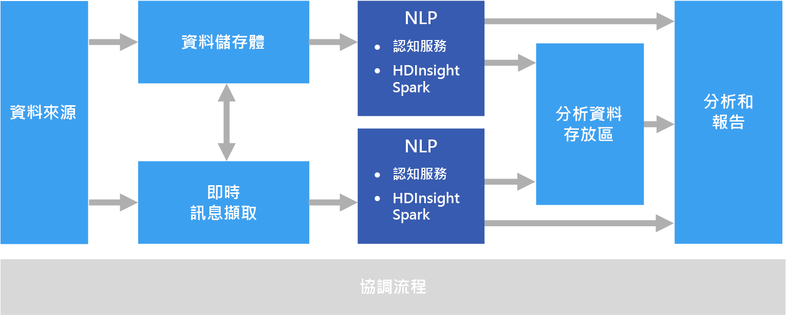

# 自然語言處理Natural language processing

自然語言處理 (NLP) 可用於多種工作，例如情感分析、主題偵測、語言偵測、關鍵片語擷取和文件分類。Natural language processing (NLP) is used for tasks such as sentiment analysis, topic detection, language detection, key phrase extraction, and document categorization.

## 此解決方案的使用時機When to use this solution

NLP 可用來進行文件分類，例如，將文件標示為機密或垃圾郵件。NLP can be use to classify documents, such as labeling documents as sensitive or spam. NLP 的輸出可用於後續的查詢處理或搜尋。The output of NLP can be used for subsequent processing or search. NLP 的另一項用途，是藉由識別文件中的實體來彙總文字。Another use for NLP is to summarize text by identifying the entities present in the document. 這些實體也可用來為文件標記關鍵字，而讓您能夠根據內容進行搜尋和擷取。These entities can also be used to tag documents with keywords, which enables search and retrieval based on content. 實體可合併為主題，並以摘要說明每個文件中的重要主題。Entities might be combined into topics, with summaries that describe the important topics present in each document. 偵測到的主題都可用來分類文件以供導覽，或根據選定的主題列舉相關文件。The detected topics may be used to categorize the documents for navigation, or to enumerate related documents given a selected topic. NLP 的另一項用途是為文字進行情感評分，以評估文件的調性是正面還是負面的。Another use for NLP is to score text for sentiment, to assess the positive or negative tone of a document. 這些方法都用到許多來自於自然語言處理的技術，例如：These approaches use many techniques from natural language processing, such as:

- **權杖化工具**。**Tokenizer**. 將文字分割成單字或片語。Splitting the text into words or phrases.
- **詞幹分析和詞形歸併還原**。**Stemming and lemmatization**. 正規化文字，使不同的形態會對應至具有相同意義的常態單字。Normalizing words so that different forms map to the canonical word with the same meaning. 例如，"running" 和 "ran" 會對應至 "run"。For example, "running" and "ran" map to "run."
- **實體擷取**。**Entity extraction**. 識別文字中的主題。Identifying subjects in the text.
- **詞性偵測**。**Part of speech detection**. 將文字識別為動詞、名詞、分詞、動詞片語等等。Identifying text as a verb, noun, participle, verb phrase, and so on.
- **文句界限偵測**。**Sentence boundary detection**. 偵測文字段落內的完整句子。Detecting complete sentences within paragraphs of text.

使用 NLP 從自由格式文字中擷取資訊和深入資訊時，通常會先從物件儲存體 (例如 Azure 儲存體或 Azure Data Lake Store) 中儲存的原始文件開始著手。When using NLP to extract information and insight from free-form text, the starting point is typically the raw documents stored in object storage such as Azure Storage or Azure Data Lake Store.

## 挑戰Challenges

- 處理自由格式文字文件的集合，通常需要耗費大量的計算資源和時間。Processing a collection of free-form text documents is typically computationally resource intensive, as well as being time intensive.
- 若沒有標準化的文件格式，使用自由格式文字處理來擷取文件中的特定事實時，可能非常難以達到一貫精確的結果。Without a standardized document format, it can be very difficult to achieve consistently accurate results using free-form text processing to extract specific facts from a document. 以發票的文字表示法為例 &mdash; 要建置可對任意數目的供應商提供的發票正確擷取發票號碼和發票日期的程序，可能非常不容易。For example, think of a text representation of an invoice&mdash;it can be difficult to build a process that correctly extracts the invoice number and invoice date for invoices across any number of vendors.

## 架構Architecture

在 NLP 解決方案中，會對包含文字段落的文件執行自由格式文字處理。In an NLP solution, free-form text processing is performed against documents containing paragraphs of text. 整體架構可以是[批次處理](../big-data/batch-processing.md)或[即時串流處理](../big-data/real-time-processing.md)架構。The overall architecture can be a [batch processing](../big-data/batch-processing.md) or [real-time stream processing](../big-data/real-time-processing.md) architecture.

實際的處理會隨著所需的結果而不同，但就管線而言，NLP 可能會以批次或即時的方式套用。The actual processing varies based on the desired outcome, but in terms of the pipeline, NLP may be applied in a batch or real-time fashion. 例如，針對文字區塊可以使用情感分析，以產生情感分數。For example, sentiment analysis can be used against blocks of text to produce a sentiment score. 此作業可藉由對儲存體中的資料執行批次程序來完成，或即時使用透過傳訊服務傳遞的較小資料區塊來完成。This can could be done by running a batch process against data in storage, or in real time using smaller chunks of data flowing through a messaging service.

## 技術選擇Technology choices

- [自然語言處理Natural language processing](../technology-choices/natural-language-processing.md)
