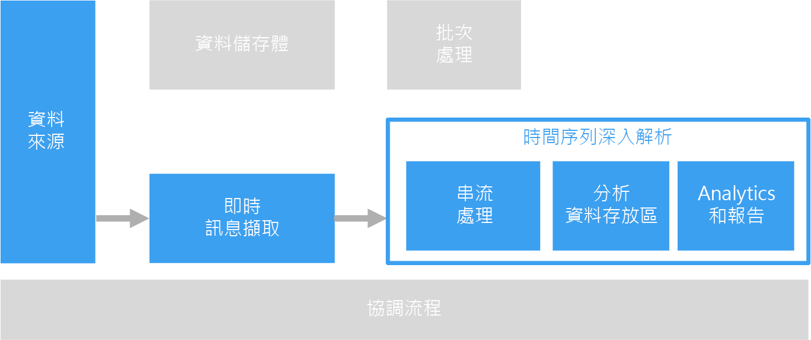

# 時間序列解決方案Time series solutions

時間序列是一組依時間編排的值。Time series data is a set of values organized by time. 時間序列資料的範例，包括感應器資料、股票價格、點選流資料和應用程式遙測等。Examples of time series data include sensor data, stock prices, click stream data, and application telemetry. 時間序列資料的分析可用來建立歷史趨勢、即時警示或預測模型。Time series data can be analyzed for historical trends, real-time alerts, or predictive modeling.

時間序列資料代表資產或處理程序如何隨著時間改變。Time series data represents how an asset or process changes over time. 資料具有時間戳記，但更重要的是，時間是檢視或分析資料時最具意義的軸。The data has a timestamp, but more importantly, time is the most meaningful axis for viewing or analyzing the data. 時間序列資料通常會依照時間順序送達，而且通常會被視為對資料庫的插入，而不是更新資料庫。Time series data typically arrives in order of time and is usually treated as an insert rather than an update to your database. 因此，系統會隨著時間測量變更，讓您回顧和預測未來的變更。Because of this, change is measured over time, enabling you to look backward and to predict future change. 由此觀之，時間序列資料最適合以散佈圖或折線圖呈現。As such, time series data is best visualized with scatter or line charts.

以下是時間序列資料的一些範例：Some examples of time series data are:

- 擷取一段時間的股票價格以偵測趨勢。Stock prices captured over time to detect trends.
- 伺服器效能，例如 CPU 使用量、I/O 負載、記憶體使用量，以及網路頻寬耗用量。Server performance, such as CPU usage, I/O load, memory usage, and network bandwidth consumption.
- 從感應器對工業設備進行的遙測，可用來偵測設備暫停故障並觸發警示通知。Telemetry from sensors on industrial equipment, which can be used to detect pending equipment failure and trigger alert notifications.
- 一段時間範圍內的即時汽車遙測資料，包括速度、煞車和加速，用以產生駕駛者的彙總風險分數。Real-time car telemetry data including speed, braking, and acceleration over a time window to produce an aggregate risk score for the driver.

藉由上述各種案例，您不難發現何以時間是最具意義的軸。In each of these cases, you can see how time is most meaningful as an axis. 依事件的送達順序加以顯示，是時間序列資料的重要特性，因為原本就有時間順序存在。Displaying the events in the order in which they arrived is a key characteristic of time series data, as there is a natural temporal ordering. 這不同於為標準 OLTP 資料管線擷取的資料；在此類管線中，資料可依任何順序輸入、並且可隨時更新。This differs from data captured for standard OLTP data pipelines where data can be entered in any order, and updated at any time.

## 使用此解決方案的時機When to use this solution

當您需要擷取資料，且其策略性價值環繞在一段時間的變化，而您主要只會插入新資料，鮮少進行更新時，請選擇時間序列解決方案。Choose a time series solution when you need to ingest data whose strategic value is centered around changes over a period of time, and you are primarily inserting new data and rarely updating, if at all. 您可以使用這項資訊來偵測異常狀況、呈現趨勢，以及比較目前的資料與歷史資料，和執行其他作業。You can use this information to detect anomalies, visualize trends, and compare current data to historical data, among other things. 這種類型的架構也非常適合用來建立預測模型及預測結果，因為您具有特定期間變化的歷史記錄，可套用至任何數量的預測模型。This type of architecture is also best suited for predictive modeling and forecasting results, because you have the historical record of changes over time, which can be applied to any number of forecasting models.

使用時間序列具有下列優點︰Using time series offers the following benefits:

- 清楚呈現資產或程序如何隨著時間而改變。Clearly represents how an asset or process changes over time.
- 可協助您快速偵測出多項相關來源的變更，讓異常狀況和浮現的趨勢能夠清楚顯現。Helps you quickly detect changes to a number of related sources, making anomalies and emerging trends clearly stand out.
- 最適合用來建立預測模型和預測。Best suited for predictive modeling and forecasting.

### 物聯網 (IoT)Internet of Things (IoT)

IoT 裝置所收集的資料在本質上即適用於時間序列儲存和分析。Data collected by IoT devices is a natural fit for time series storage and analysis. 內送資料絕大多數都是進行插入，而鮮少更新。The incoming data is inserted and rarely, if ever, updated. 資料會加上時間戳記，並依據收到的順序插入，且這項資料通常會依時間先後順序顯示，讓使用者能探索趨勢、找出異常狀況，並將該資訊用於預測分析。The data is time stamped and inserted in the order it was received, and this data is typically displayed in chronological order, enabling users to discover trends, spot anomalies, and use the information for predictive analysis.

如需詳細資訊，請參閱[物聯網](../big-data/index.md#internet-of-things-iot)。For more information, see [Internet of Things](../big-data/index.md#internet-of-things-iot).

### 即時分析Real-time analytics

時間序列資料通常具有時效性 &mdash; 也就是說，必須迅速因應，以即時找出趨勢或產生警示。Time series data is often time sensitive &mdash; that is, it must be acted on quickly, to spot trends in real time or generate alerts. 在這些情況下，任何資料判讀上的延遲都可能導致運作中止和業務衝擊。In these scenarios, any delay in insights can cause downtime and business impact. 此外，來自各種不同來源 (例如感應器) 的資料也常需要產生關聯。In addition, there is often a need to correlate data from a variety of different sources, such as sensors.

在理想情況下，您必須具有串流處理層可即時處理內送資料，且全數以高精確度和細微性進行處理。Ideally, you would have a stream processing layer that can handle the incoming data in real time and process all of it with high precision and high granularity. 但並非每次都能達到此理想情況，這取決於您的串流處理架構以及串流緩衝處理與串流處理層級的元件。This isn't always possible, depending on your streaming architecture and the components of your stream buffering and stream processing layers. 您可能需要減少時間序列資料，而稍微犧牲其精確度。You may need to sacrifice some precision of the time series data by reducing it. 這可藉由滑動時間範圍來達成 (例如，幾秒鐘)，讓處理層能適時執行計算。This is done by processing sliding time windows (several seconds, for example), allowing the processing layer to perform calculations in a timely manner. 在顯示較長的時段時，您也可能需要縮小資料取樣及彙總資料，例如，適當縮放以顯示數個月內擷取的資料。You may also need to downsample and aggregate your data when displaying longer periods of time, such as zooming to display data captured over several months.

## 挑戰Challenges

- 時間序列資料通常數量龐大，尤其是 IoT 的資料。Time series data is often very high volume, especially in IoT scenarios. 儲存、編製索引、查詢、分析並以視覺化方式呈現時間序列資料可能具有挑戰性。Storing, indexing, querying, analyzing, and visualizing time series data can be challenging.

- 要找出高速儲存體和強大運算能力的適當組合以處理即時分析，同時盡可能縮短上市時程並降低整體成本投資，可能並不容易。It can be challenging to find the right combination of high-speed storage and powerful compute operations for handling real-time analytics, while minimizing time to market and overall cost investment.

## 架構Architecture

在許多涉及時間序列資料的案例中 (例如 IoT)，資料都是以即時方式擷取的。In many scenarios that involve time series data, such as IoT, the data is captured in real time. 因此，[即時處理](../big-data/real-time-processing.md)是其適用的架構。As such, a [real-time processing](../big-data/real-time-processing.md) architecture is appropriate.

來自一或多個資料來源的資料會由 [IoT 中樞](/azure/iot-hub/)、[事件中樞](/azure/event-hubs/)或 [HDInsight 上的 Kafka](/azure/hdinsight/kafka/apache-kafka-introduction) 擷取到串流緩衝處理層中。Data from one or more data sources is ingested into the stream buffering layer by [IoT Hub](/azure/iot-hub/), [Event Hubs](/azure/event-hubs/), or [Kafka on HDInsight](/azure/hdinsight/kafka/apache-kafka-introduction). 接下來，資料會在串流處理層進行處理，然後選擇性地遞交到機器學習服務進行預測分析。Next, the data is processed in the stream processing layer that can optionally hand off the processed data to a machine learning service for predictive analytics. 已處理的資料會儲存在分析資料存放區中，例如 [HBase](/azure/hdinsight/hbase/apache-hbase-overview)、[Azure Cosmos DB](/azure/cosmos-db/)、Azure Data Lake 或 Blob 儲存體。The processed data is stored in an analytical data store, such as [HBase](/azure/hdinsight/hbase/apache-hbase-overview), [Azure Cosmos DB](/azure/cosmos-db/), Azure Data Lake, or Blob Storage. 您可以使用分析和報告應用程式或服務來顯示時間序列資料以供分析，例如 Power BI 或 OpenTSDB (如果儲存在 HBase 中)。An analytics and reporting application or service, like Power BI or OpenTSDB (if stored in HBase) can be used to display the time series data for analysis.

另一個選項是使用 [Azure 時間序列深入解析](/azure/time-series-insights/)。Another option is to use [Azure Time Series Insights](/azure/time-series-insights/). 「時間序列深入解析」是適用於時間序列資料的完整受控服務。Time Series Insights is a fully managed service for time series data. 在此架構中，「時間序列深入解析」會執行串流處理、資料存放區，以及分析和報告的角色。In this architecture, Time Series Insights performs the roles of stream processing, data store, and analytics and reporting. 它會接受來自 IoT 中樞或事件中樞的串流資料，並以幾近即時的方式儲存、處理、分析及顯示資料。It accepts streaming data from either IoT Hub or Event Hubs and stores, processes, analyzes, and displays the data in near real time. 它不會預先彙總資料，而是會儲存原始事件。It does not pre-aggregate the data, but stores the raw events.

「時間序列深入解析」是具調適性的結構描述，這表示您無須進行任何資料準備，即可開始判讀資訊。Time Series Insights is schema adaptive, which means that you do not have to do any data preparation to start deriving insights. 這可讓您順暢地探索、比較及相互關聯各種資料來源。This enables you to explore, compare, and correlate a variety of data sources seamlessly. 它也提供類似於 SQL 的篩選和彙總功能，能夠建構、呈現、比較和重疊不同的時間序列模式與熱度圖，並且能夠儲存及共用查詢。It also provides SQL-like filters and aggregates, ability to construct, visualize, compare, and overlay various time series patterns, heat maps, and the ability to save and share queries.

## 技術選擇Technology choices

- [資料儲存體Data Storage](../technology-choices/data-storage.md)
- [分析、視覺效果和報告Analysis, visualizations, and reporting](../technology-choices/analysis-visualizations-reporting.md)
- [分析資料存放區Analytical Data Stores](../technology-choices/analytical-data-stores.md)
- [串流處理Stream processing](../technology-choices/stream-processing.md)