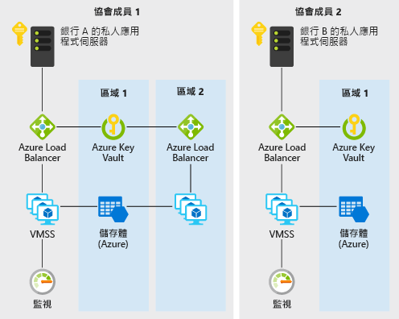

# Azure 上銀行間的分散式信任

如果銀行或任何其他機構想要建立適用於資訊共用的受信任環境，而不需藉助於集中式資料庫，很適合使用此範例案例。 基於此範例的目的，我們會在維護銀行間信用分數資訊的內容中描述此範例，但是架構可套用至以下案例：組織聯盟想要與彼此共用經過驗證的資訊，而不必藉助於使用單一方所執行的中央系統。

傳統上，金融體系內的銀行會依賴集中式來源 (例如徵信機構) 提供有關個人的信用分數和歷程資訊。 集中式方法會導致營運風險集中，有時還會出現不必要的第三方。

銀行聯盟可以利用 DLT (分散式帳本技術) 建立非集中式系統，該系統更有效率、較不容易受到攻擊，並作為可實作創新結構的新平台，以解決傳統的隱私權、速度和成本挑戰。

此範例顯示如何快速佈建 Azure 服務 (例如虛擬機器擴展集、虛擬網路、Key Vault、儲存體、Load Balancer 和監視器)，以供部署有效率的私用以太坊 PoA 區塊鏈，讓成員銀行在其中建立自己的節點。

## 相關使用案例

其他相關的使用案例包括：

- 在多語系公司的不同業務單位之間移動已配置的預算
- 跨境支付
- 貿易融資案例
- 涉及不同公司的忠誠度系統
- 供應鏈生態系統

## 架構

此案例涵蓋在包含兩個或更多成員的聯盟中，建立可擴充、安全且受監視的私人、企業區塊鏈網路所需的後端元件。 其中保留了如何佈建這些元件的詳細資訊 (亦即，在不同訂用帳戶和資源群組內)，以及連線需求 (亦即 VPN 或 ExpressRoute)，以便您根據貴組織的原則需求仔細考慮。 以下是資料的流動方式：

1. 銀行 A 透過 JSON-RPC 將交易傳送到區塊鏈網路，以建立/更新個人的信用記錄。
2. 資料會從銀行 A 的私用應用程式伺服器流動至 Azure 負載平衡器，接著流動至虛擬機器擴展集上的驗證節點 VM。
3. 以太坊 PoA 網路會在預先設定的時間建立一個區塊 (在此案例中為 2 秒)。
4. 此交易會放入所建立的區塊中，並且在區塊鏈網路中驗證。
5. 銀行 B 同樣可透過 JSON-RPC 與自己的節點通訊，以讀取銀行 A 所建立的信用記錄。

### 元件

- 虛擬機器擴展集內的虛擬機器會提供隨選計算設施，來裝載區塊鏈的驗證程式程序
- Key Vault 可作為每個驗證程式私密金鑰的安全儲存設備
- Load Balancer 會分散 RPC、對等互連和 Governance DApp 要求
- 裝載持續性網路資訊和協調租用的儲存體
- Operations Management Suite (一組 Azure 服務) 提供可用節點、每分鐘交易數和聯盟成員的見解

### 替代項目

此範例選擇使用以太坊 PoA 方法，因為如果組織聯盟想要建立可以信任、非集中式且易於理解的方式輕鬆互相交換及分享資訊的環境，這是很好的進入點。 此外，可用的 Azure 解決方案範本會提供快速且方便的方式，不只可供聯盟領導者開始以太坊 PoA 區塊鏈，也可供聯盟中的成員組織在自己的資源群組和訂用帳戶內啟動自己的 Azure 資源，以加入現有的網路。

在其他擴充或不同的情況下，可能會引發交易隱私權等疑慮。 比方說，在證券轉讓案例中，聯盟中的成員可能不希望其他成員看到其交易。 以太坊 PoA 有其他替代項目會以其各自的方式處理這些疑慮：

- Corda
- Quorum
- Hyperledger

## 考量

### 可用性

[Azure 監視器][ monitor]用來持續監視區塊鏈網路的問題，以確保可用性。 此案例中使用的區塊鏈解決方案範本部署成功時，系統就會傳送以 Azure 監視器為基礎的自訂監視儀表板連結給您。 此儀表板顯示的節點會報告過去 30 分鐘內的活動訊號，以及其他有用的統計資料。

### 延展性

區塊鏈的常見疑慮是區塊鏈在預先設定的時間量內可以包含的交易數目。 此案例使用權威證明，其可比工作量證明更妥善地管理這類延展性。 在權威證明&ndash;型網路中，共識參與者為已知且受到管理，使其更適合於彼此相識之組織聯盟的私密區塊鏈。 透過自訂儀表板，可以輕鬆地監視平均封鎖時間、每分鐘交易數和計算資源取用量等參數。 然後可根據規模需求來調整資源。

如需設計可調整解決方案的一般指引，請參閱 Azure Architecture Center 中的[延展性檢查清單][scalability]。

### 安全性

[Azure Key vault][vault] 用於輕鬆儲存及管理驗證程式的私密金鑰。 此範例中的預設部署會建立可透過網際網路存取的區塊鏈網路。 在想擁有私人網路的生產案例中，成員可以透過 VNet 對 VNet VPN 閘道連線彼此連線。 設定 VPN 的步驟包含底下相關資源一節中。

如需設計安全解決方案的一般指引，請參閱 [Azure 安全性文件][security]。

### 災害復原

以太坊 PoA 區塊鏈本身可提供某種程度的復原能力，因為驗證程式節點可以部署在不同的區域中。 Azure 具有全球超過 54 個區域的部署選項。 例如此案例中的區塊鏈可提供唯一和全新的合作可能性，以增加復原能力。 網路的復原能力不只是針對單一集中式對象，而是針對聯盟的所有成員提供。 以權威證明&ndash;為基礎的區塊鏈可讓網路復原變得更有規劃和審慎。

如需設計彈性的解決方案的一般指引，請參閱[設計可靠的 Azure 應用程式](../../reliability/index.md)。

## 價格

為了探索執行此案例的成本，所有服務會在成本計算機中預先設定。 若要查看定價如何針對特定使用案例而變更，請變更適當的變數，以符合您預期的效能和可用性需求。

我們根據執行應用程式的擴展集 VM 執行個體數目 (這些執行個體可位於不同的區域)，提供了 3 個範例成本設定檔。

- [小型][small-pricing]：此定價範例與已關閉監視功能的每個月 2 部 VM 相互關聯
- [中型][medium-pricing]：此定價範例與已開啟監視功能的每個月 7 部 VM 相互關聯
- [大型][large-pricing]：此定價範例與已開啟監視功能的每個月 15 部 VM 相互關聯

上述定價適用於要開始或加入區塊鏈網路的一個聯盟成員。 通常在涉及多家公司或組織的聯盟中，每個成員都會取得自己的 Azure 訂用帳戶。

## 後續步驟

若要查看此案例的範例，請在 Azure 上部署[以太坊 PoA 區塊鏈示範應用程式][deploy]。 然後檢閱[案例原始程式碼的讀我檔案][source]。

## 相關資源

如需有關如何使用適用於 Azure 的以太坊權威證明解決方案範本的詳細資訊，請檢閱這份[使用量指南][guide]。

<!-- links -->
[small-pricing]: https://azure.com/e/4e429d721eb54adc9a1558fae3e67990
[medium-pricing]: https://azure.com/e/bb42cd77437744be8ed7064403bfe2ef
[large-pricing]: https://azure.com/e/e205b443de3e4adfadf4e09ffee30c56
[guide]: /azure/blockchain-workbench/ethereum-poa-deployment
[deploy]: https://portal.azure.com/?pub_source=email&pub_status=success#create/microsoft-azure-blockchain.azure-blockchain-ethereumethereum-poa-consortium
[source]: https://github.com/vitoc/creditscoreblockchain
[monitor]: /azure/monitoring-and-diagnostics/monitoring-overview-azure-monitor
[scalability]: /azure/architecture/checklist/scalability
[security]: /azure/security/
[vault]: https://azure.microsoft.com/services/key-vault/
