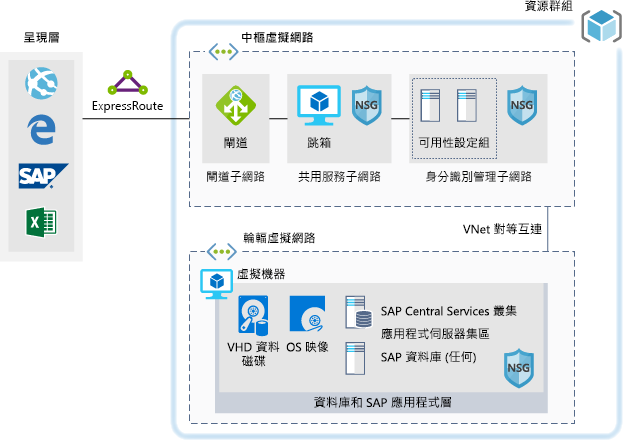

# 適用於開發/測試工作負載的 SAPSAP for dev/test workloads

此範例提供如何在 Azure 上執行 Windows 或 Linux 環境中的 SAP NetWeaver 開發/測試實作指引。This example provides guidance for how to run a dev/test implementation of SAP NetWeaver in a Windows or Linux environment on Azure. 所使用的資料庫是 AnyDB，這是任何支援 DBMS 的 SAP 字詞 (並非 SAP HANA)。The database used is AnyDB, the SAP term for any supported DBMS (that isn't SAP HANA). 因為此架構是設計用於非生產環境，它僅使用單一虛擬機器 (VM) 部署，且可以變更其大小，以容納貴組織的需求。Because this architecture is designed for non-production environments, it's deployed with just a single virtual machine (VM) and it's size can be changed to accommodate your organization's needs.

如需生產環境使用案例，請檢閱以下提供的 SAP 參考架構：For production use cases review the SAP reference architectures available below:

* [適用於 AnyDB 的 SAP NetWeaver][sap-netweaver][SAP netweaver for AnyDB][sap-netweaver]
* [SAP S/4Hana][sap-hana][SAP S/4Hana][sap-hana]
* [Azure 上的 SAP 大型執行個體][sap-large][SAP on Azure large instances][sap-large]

## 相關使用案例Related use cases

請針對下列使用案例考慮此案例：Consider this scenario for the following use cases:

* 非關鍵性的 SAP 非產能工作負載 (沙箱、開發、測試、品質保證)Non-critical SAP non-productive workloads (sandbox, development, test, quality assurance)
* 非關鍵性的 SAP Business One 工作負載Non-critical SAP business one workloads

## 架構Architecture

此案例中會討論佈建單一 SAP 系統資料庫和單一虛擬機器上的 SAP 應用程式伺服器，整個案例的資料流程如下所示：This scenario covers the provision of a single SAP system database and SAP application Server on a single virtual machine, the data flows through the scenario as follows:

1. 展示層中的客戶會使用他們的 SAP GUI，或是其他內部部署的使用者介面 (Internet Explorer、Excel 或其他 Web 應用程式)，來存取以 Azure 為基礎的 SAP 系統。Customers from the Presentation Tier use their SAP GUI, or other user interfaces (Internet Explorer, Excel, or other web application) on premise to access the Azure-based SAP system.
2. 會透過使用已建立的 Express Route 來提供連線能力。Connectivity is provided through the use of an established Express Route. Azure 中的 Express Route 連線會在 Express Route 閘道終止。The Express Route connection is terminated in Azure at the Express Route Gateway. 網路流量會透過 Express Route 閘道路由至閘道子網路，以及從閘道子網路路由至應用程式層輪輻子網路 (請參閱 [hub-spoke][hub-spoke] 模式)，然後透過網路安全性群組路由至 SAP 應用程式虛擬機器。Network traffic routes through the Express Route gateway to the Gateway Subnet and from the gateway subnet to the Application Tier Spoke subnet (see the [hub-spoke][hub-spoke] pattern) and via a Network Security Gateway to the SAP application virtual machine.
3. 身分識別管理伺服器會提供驗證服務。The identity management servers provide authentication services.
4. 「跳躍箱」會提供本機管理功能。The jump box provides local management capabilities.

### 元件Components

* [資源群組](/azure/azure-resource-manager/resource-group-overview#resource-groups)是 Azure 資源的邏輯容器。[Resource Groups](/azure/azure-resource-manager/resource-group-overview#resource-groups) is a logical container for Azure resources.
* [虛擬網路](/azure/virtual-network/virtual-networks-overview)是 Azure 內的網路通訊基礎[Virtual Networks](/azure/virtual-network/virtual-networks-overview) is the basis of network communications within Azure
* [虛擬機器](/azure/virtual-machines/windows/overview) Azure 虛擬機器使用 Windows 或 Linux Server 提供隨選、高度可調整、安全且虛擬化的基礎結構[Virtual Machine](/azure/virtual-machines/windows/overview) Azure Virtual Machines provides on-demand, high-scale, secure, virtualized infrastructure using Windows or Linux Server
* [Express Route](/azure/expressroute/expressroute-introduction) 可讓您透過連線提供者所提供的私人連線，將內部部署網路延伸至 Microsoft 雲端。[Express Route](/azure/expressroute/expressroute-introduction) lets you extend your on-premises networks into the Microsoft cloud over a private connection facilitated by a connectivity provider.
* [網路安全性群組](/azure/virtual-network/security-overview)可讓您將網路流量限制為虛擬網路中的資源。[Network Security Group](/azure/virtual-network/security-overview) lets you limit network traffic to resources in a virtual network. 網路安全性群組包含一些安全性規則，可根據來源或目的地 IP 位址、連接埠和通訊協定允許或拒絕輸入或輸出網路流量。A network security group contains a list of security rules that allow or deny inbound or outbound network traffic based on source or destination IP address, port, and protocol. 

## 考量Considerations

### 可用性Availability

 Microsoft 會提供單一 VM 執行個體的服務等級協定 (SLA)。Microsoft offers a service level agreement (SLA) for single VM instances. 如需關於適用於虛擬機器的 Microsoft Azure 服務等級協定相關資訊，請參閱[虛擬機器 SLA](https://azure.microsoft.com/support/legal/sla/virtual-machines)For more information on Microsoft Azure Service Level Agreement for Virtual Machines [SLA For Virtual Machines](https://azure.microsoft.com/support/legal/sla/virtual-machines)

### 延展性Scalability

如需設計可調整解決方案的一般指引，請參閱 Azure Architecture Center 中的[延展性檢查清單][scalability]。For general guidance on designing scalable solutions, see the [scalability checklist][scalability] in the Azure Architecture Center.

### 安全性Security

如需設計安全解決方案的一般指引，請參閱 [Azure 安全性文件][security]。For general guidance on designing secure solutions, see the [Azure Security Documentation][security].

### 災害復原Resiliency

如需設計彈性解決方案的一般指引，請參閱[為 Azure 設計有彈性的應用程式][resiliency]。For general guidance on designing resilient solutions, see [Designing resilient applications for Azure][resiliency].

## 價格Pricing

探索執行此案例的成本，所有服務會在成本計算機中預先設定。Explore the cost of running this scenario, all of the services are pre-configured in the cost calculator.  若要查看價格如何針對您的特定使用案例而變更，請變更適當的變數，以符合您預期的流量。To see how the pricing would change for your particular use case change the appropriate variables to match your expected traffic.

我們根據您預期取得的流量，提供了四個範例成本設定檔：We have provided four sample cost profiles based on amount of traffic you expect to get:

|大小Size|SAPSAPs|VM 類型VM Type|儲存體Storage|Azure 價格計算機Azure Pricing Calculator|
|----|----|-------|-------|---------------|
|小型Small|80008000|D8s_v3D8s_v3|2xP20、1xP102xP20, 1xP10|[小型Small](https://azure.com/e/9d26b9612da9466bb7a800eab56e71d1)|
|中Medium|1600016000|D16s_v3D16s_v3|3xP20、1xP103xP20, 1xP10|[中型Medium](https://azure.com/e/465bd07047d148baab032b2f461550cd)|
大型Large|3200032000|E32s_v3E32s_v3|3xP20、1xP103xP20, 1xP10|[大型Large](https://azure.com/e/ada2e849d68b41c3839cc976000c6931)|
超大型Extra Large|6400064000|M64sM64s|4xP20、1xP104xP20, 1xP10|[超大型Extra Large](https://azure.com/e/975fb58a965c4fbbb54c5c9179c61cef)|

請注意：定價是一個指南，只會表示 VM 和儲存體成本 (不包括網路、備份儲存體和資料輸入/輸出費用)。Note: pricing is a guide and only indicates the VMs and storage costs (excludes, networking, backup storage, and data ingress/egress charges).

* [小型](https://azure.com/e/9d26b9612da9466bb7a800eab56e71d1)：小型系統包含具有 8 個 vCPU 的 VM 類型 D8s_v3，32 GB RAM 和 200 GB 暫存儲存體，另外還有兩個 512 GB 和一個 128 GB 的進階儲存體磁碟。[Small](https://azure.com/e/9d26b9612da9466bb7a800eab56e71d1): A small system consists of VM type D8s_v3 with 8x vCPUs, 32 GB RAM and 200 GB temp storage, additionally two 512 GB and one 128 GB premium storage disks.
* [中型](https://azure.com/e/465bd07047d148baab032b2f461550cd)：中型系統包含具有 16 個 vCPU 的 VM 類型 D16s_v3，64 GB RAM 和 400 GB 暫存儲存體，另外還有三個 512 GB 和一個 128 GB 的進階儲存體磁碟。[Medium](https://azure.com/e/465bd07047d148baab032b2f461550cd): A medium system consists of VM type D16s_v3 with 16x vCPUs, 64 GB RAM and 400 GB temp storage, additionally three 512 GB and one 128 GB premium storage disks.
* [大型](https://azure.com/e/ada2e849d68b41c3839cc976000c6931)：大型系統包含具有 32 個 vCPU 的 VM 類型 E32s_v3，256 GB RAM 和 512 GB 暫存儲存體，另外還有三個 512 GB 和一個 128 GB 的進階儲存體磁碟。[Large](https://azure.com/e/ada2e849d68b41c3839cc976000c6931): A large system consists of VM type E32s_v3 with 32x vCPUs, 256 GB RAM and 512 GB temp storage, additionally three 512GB and one 128GB premium storage disks.
* [超大型](https://azure.com/e/975fb58a965c4fbbb54c5c9179c61cef)：超大型系統包含具有 64 個 vCPU 的 VM 類型 M64s，1024 GB RAM 和 2000 GB 暫存儲存體，另外還有四個 512 GB 和一個 128 GB 的進階儲存體磁碟。[Extra Large](https://azure.com/e/975fb58a965c4fbbb54c5c9179c61cef): An extra large system consists of a VM type M64s with 64x vCPUs, 1024 GB RAM and 2000 GB temp storage, additionally four 512 GB and one 128 GB premium storage disks.

## 部署Deployment

若要部署類似於上述案例的基礎結構，請使用 [部署] 按鈕To deploy the underlying infrastructure similar to the scenario above, use the deploy button

\* SAP 不會自動安裝，請在建置基礎結構之後，手動安裝它。\* SAP won't be automatically installed, manually install it after the infrastructure has been built.

<!-- links -->
[reference architecture]:  /azure/architecture/reference-architectures/sap
[resiliency]: /azure/architecture/resiliency/
[security]: /azure/security/
[scalability]: /azure/architecture/checklist/scalability
[sap-netweaver]: /azure/architecture/reference-architectures/sap/sap-netweaver
[sap-hana]: /azure/architecture/reference-architectures/sap/sap-s4hana
[sap-large]: /azure/architecture/reference-architectures/sap/hana-large-instances
[hub-spoke]: /azure/architecture/reference-architectures/hybrid-networking/hub-spoke