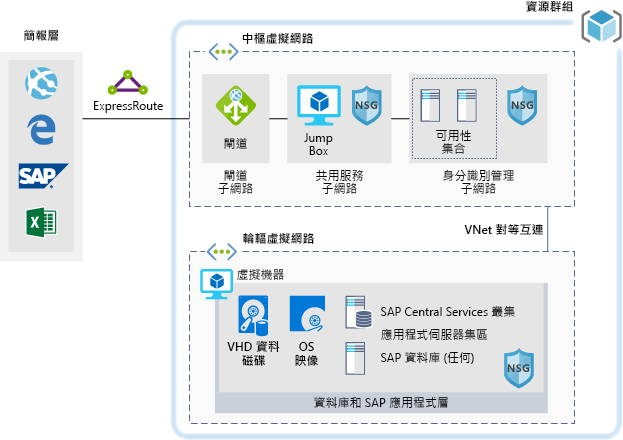

# Azure 上 SAP 工作負載的開發/測試環境

此範例示範如何在 Windows 或 Linux 環境的 Azure 上建立 SAP NetWeaver 的開發/測試環境。 所使用的資料庫是 AnyDB，這是任何支援 DBMS 的 SAP 字詞 (並非 SAP HANA)。 因為此架構是設計用於非生產環境，它僅使用單一虛擬機器 (VM) 部署，且可以變更其大小，以容納貴組織的需求。

如需生產環境使用案例，請檢閱以下提供的 SAP 參考架構：

* [適用於 AnyDB 的 SAP NetWeaver][sap-netweaver]
* [SAP S/4HANA][sap-hana]
* [Azure 上的 SAP 大型執行個體][sap-large]

## 相關使用案例

請針對下列使用案例考慮此案例：

* 非關鍵性的 SAP 非產能工作負載 (沙箱、開發、測試、品質保證)
* 非關鍵性的 SAP 商務工作負載

## 架構

此案例示範如何在單一虛擬機器上佈建單一 SAP 系統資料庫和 SAP 應用程式伺服器。 整個案例的資料流程如下所示：

1. 客戶可使用 SAP 使用者介面或其他用戶端工具 (Excel、網頁瀏覽器或其他 Web 應用程式) 來存取 Azure 型 SAP 系統。
2. 透過使用已建立的 ExpressRoute 來提供連線能力。 Azure 中的 ExpressRoute 連線會在 ExpressRoute 閘道終止。 網路流量會透過 ExpressRoute 閘道路由至閘道子網路，以及從閘道子網路路由至應用程式層輪輻子網路 (請參閱[中樞輪輻][hub-spoke]模式)，然後透過網路安全性群組路由至 SAP 應用程式虛擬機器。
3. 身分識別管理伺服器會提供驗證服務。
4. 「跳躍箱」會提供本機管理功能。

### 元件

* [虛擬網路](/azure/virtual-network/virtual-networks-overview)是 Azure 內的網路通訊基礎。
* [虛擬機器](/azure/virtual-machines/windows/overview) Azure 虛擬機器使用 Windows 或 Linux Server 提供隨選、高度可調整、安全且虛擬化的基礎結構。
* [ExpressRoute](/azure/expressroute/expressroute-introduction) 可讓您透過連線提供者所提供的私人連線，將內部部署網路延伸至 Microsoft 雲端。
* [網路安全性群組](/azure/virtual-network/security-overview)可讓您將網路流量限制為虛擬網路中的資源。 網路安全性群組包含一些安全性規則，可根據來源或目的地 IP 位址、連接埠和通訊協定允許或拒絕輸入或輸出網路流量。 
* [資源群組](/azure/azure-resource-manager/resource-group-overview#resource-groups)可作為 Azure 資源的邏輯容器。

## 考量

### 可用性

 Microsoft 會提供單一 VM 執行個體的服務等級協定 (SLA)。 如需關於適用於虛擬機器的 Microsoft Azure 服務等級協定相關資訊，請參閱[虛擬機器 SLA](https://azure.microsoft.com/support/legal/sla/virtual-machines)

### 延展性

如需設計可調整解決方案的一般指引，請參閱 Azure Architecture Center 中的[延展性檢查清單][scalability]。

### 安全性

如需設計安全解決方案的一般指引，請參閱 [Azure 安全性文件][security]。

### 災害復原

如需設計彈性解決方案的一般指引，請參閱[為 Azure 設計有彈性的應用程式][resiliency]。

## 價格

為了協助您探索執行此案例的成本，所有服務都會在以下成本計算機範例中預先設定。 若要查看價格如何針對您的特定使用案例而變更，請變更適當的變數，以符合您預期的流量。

我們根據您預期接收的流量，提供了四個範例成本設定檔：

|大小|SAP|VM 類型|儲存體|Azure 定價計算機|
|----|----|-------|-------|---------------|
|小型|8000|D8s_v3|2xP20、1xP10|[小型](https://azure.com/e/9d26b9612da9466bb7a800eab56e71d1)|
|中|16000|D16s_v3|3xP20、1xP10|[中型](https://azure.com/e/465bd07047d148baab032b2f461550cd)|
大型|32000|E32s_v3|3xP20、1xP10|[大型](https://azure.com/e/ada2e849d68b41c3839cc976000c6931)|
超大型|64000|M64s|4xP20、1xP10|[超大型](https://azure.com/e/975fb58a965c4fbbb54c5c9179c61cef)|

> [!NOTE]
> 此定價是一份指南，只會指出 VM 和儲存體成本。 它會排除網路、備份儲存體和資料輸入/輸出費用。

* [小型](https://azure.com/e/9d26b9612da9466bb7a800eab56e71d1)：小型系統包含具有 8 個 vCPU 的 VM 類型 D8s_v3，32 GB RAM 和 200 GB 暫存儲存體，另外還有兩個 512 GB 和一個 128 GB 的進階儲存體磁碟。
* [中型](https://azure.com/e/465bd07047d148baab032b2f461550cd)：中型系統包含具有 16 個 vCPU 的 VM 類型 D16s_v3，64 GB RAM 和 400 GB 暫存儲存體，另外還有三個 512 GB 和一個 128 GB 的進階儲存體磁碟。
* [大型](https://azure.com/e/ada2e849d68b41c3839cc976000c6931)：大型系統包含具有 32 個 vCPU 的 VM 類型 E32s_v3，256 GB RAM 和 512 GB 暫存儲存體，另外還有三個 512 GB 和一個 128 GB 的進階儲存體磁碟。
* [超大型](https://azure.com/e/975fb58a965c4fbbb54c5c9179c61cef)：超大型系統包含具有 64 個 vCPU 的 VM 類型 M64s，1024 GB RAM 和 2000 GB 暫存儲存體，另外還有四個 512 GB 和一個 128 GB 的進階儲存體磁碟。

## 部署

按一下這裡可部署此案例的基礎結構。

> [!NOTE]
> 在此部署期間不會安裝 SAP 和 Oracle。 您必須分別部署這些元件。

<!-- links -->
[resiliency]: /azure/architecture/resiliency/
[security]: /azure/security/
[scalability]: /azure/architecture/checklist/scalability
[sap-netweaver]: /azure/architecture/reference-architectures/sap/sap-netweaver
[sap-hana]: /azure/architecture/reference-architectures/sap/sap-s4hana
[sap-large]: /azure/architecture/reference-architectures/sap/hana-large-instances
[hub-spoke]: /azure/architecture/reference-architectures/hybrid-networking/hub-spoke
