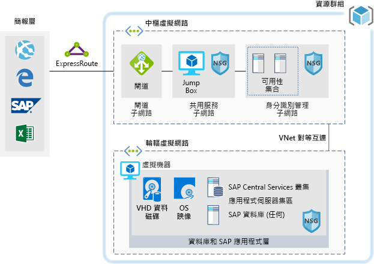
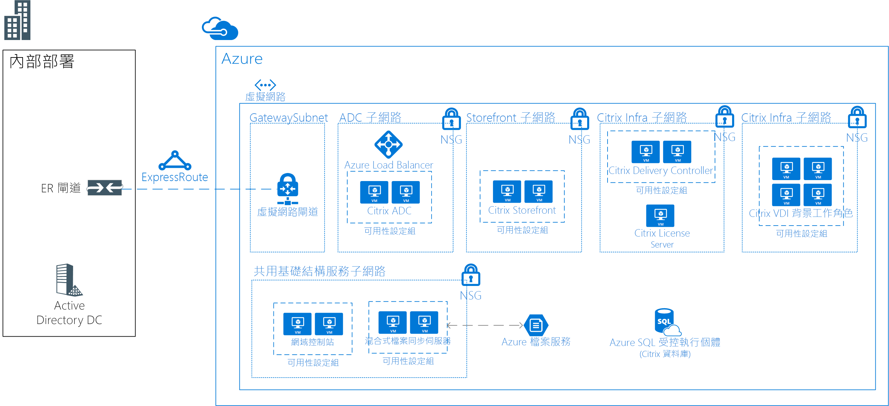

## AI 案例

<ul  class="panelContent cardsC">
<li style="display: flex; flex-direction: column;">
    <a href="./ai/commerce-chatbot.md" style="display: flex; flex-direction: column; flex: 1 0 auto;">
        

            

                

                    

                        

                            
                        

                    

                    

                        <h3>Azure 上適用於預約旅館的交談聊天機器人</h3>
                        
使用 Azure Bot 服務建置適用於商務應用程式的對話聊天機器人。

                    

                

            

        

    </a>
</li>
<li style="display: flex; flex-direction: column;">
    <a href="./ai/intelligent-apps-image-processing.md" style="display: flex; flex-direction: column; flex: 1 0 auto;">
        

            

                

                    

                        

                            
                        

                    

                    

                        <h3>Azure 上的保險理賠映像分類</h3>
                        
將影像處理建置到您的 Azure 應用程式。

                    

                

            

        

    </a>
</li>
</ul>

## 應用程式案例

<ul  class="panelContent cardsC">
<li style="display: flex; flex-direction: column;">
    <a href="./apps/apim-api-scenario.md" style="display: flex; flex-direction: column; flex: 1 0 auto;">
        

            

                

                    

                        

                            
                        

                    

                    

                        <h3>將舊版 Web 應用程式移轉至 Azure 上的 API 型架構</h3>
                        
使用 Azure API 管理讓舊版 Web 應用程式變成現代化。

                    

                

            

        

    </a>
</li>
<li style="display: flex; flex-direction: column;">
    <a href="./apps/app-monitoring.md" style="display: flex; flex-direction: column; flex: 1 0 auto;">
        

            

                

                    

                        

                            
                        

                    

                    

                        <h3>Azure 上的 Web 應用程式監視</h3>
                        
監視 Azure App Service 中裝載的 Web 應用程式。

                    

                

            

        

    </a>
</li>
<li style="display: flex; flex-direction: column;">
    <a href="./apps/decentralized-trust.md" style="display: flex; flex-direction: column; flex: 1 0 auto;">
        

            

                

                    

                        

                            
                        

                    

                    

                        <h3>Azure 上銀行間的分散式信任</h3>
                        
建立適用於通訊和資訊共用的受信任環境，不需要重新排序至集中式資料庫。

                    

                

            

        

    </a>
</li>
<li style="display: flex; flex-direction: column;">
    <a href="./apps/devops-dotnet-webapp.md" style="display: flex; flex-direction: column; flex: 1 0 auto;">
        

            

                

                    

                        

                            
                        

                    

                    

                        <h3>利用 Azure DevOps 的 CI/CD 管線</h3>
                        
使用 Azure DevOps 建置 .NET 應用程式並且發行至 Azure Web Apps。

                    

                

            

        

    </a>
</li>
<li style="display: flex; flex-direction: column;">
    <a href="./apps/devops-with-aks.md" style="display: flex; flex-direction: column; flex: 1 0 auto;">
        

            

                

                    

                        

                            
                        

                    

                    

                        <h3>容器型工作負載的 CI/CD 管線</h3>
                        
使用 Jenkins、Azure Container Registry、Azure Kubernetes Service、Cosmos DB 及 Grafana 的 Node.js Web 應用程式，建置 DevOps 管線。

                    

                

            

        

    </a>
</li>
<li style="display: flex; flex-direction: column;">
    <a href="./apps/ecommerce-scenario.md" style="display: flex; flex-direction: column; flex: 1 0 auto;">
        

            

                

                    

                        

                            
                        

                    

                    

                        <h3>Azure 上的電子商務前端</h3>
                        
在 Azure 上裝載電子商務網站。

                    

                

            

        

    </a>
</li>
<li style="display: flex; flex-direction: column;">
    <a href="./apps/ecommerce-search.md" style="display: flex; flex-direction: column; flex: 1 0 auto;">
        

            

                

                    

                        

                            
                        

                    

                    

                        <h3>電子商務的智慧產品搜尋引擎</h3>
                        
提供電子商務應用程式中的世界級搜尋體驗。

                    

                

            

        

    </a>
</li>
<li style="display: flex; flex-direction: column;">
    <a href="./apps/hpc-saas.md" style="display: flex; flex-direction: column; flex: 1 0 auto;">
        

            

                

                    

                        

                            
                        

                    

                    

                        <h3>Azure 上的電腦輔助工程服務</h3>
                        
為 Azure 上的電腦輔助工程 (CAE) 提供軟體即服務 (SaaS) 平台。

                    

                

            

        

    </a>
</li>
<li style="display: flex; flex-direction: column;">
    <a href="./apps/sap-dev-test.md" style="display: flex; flex-direction: column; flex: 1 0 auto;">
        

            

                

                    

                        

                            
                        

                    

                    

                        <h3>Azure 上 SAP 工作負載的開發/測試環境</h3>
                        
為 SAP 工作負載建置開發/測試環境。

                    

                

            

        

    </a>
</li>
<li style="display: flex; flex-direction: column;">
    <a href="./apps/sap-production.md" style="display: flex; flex-direction: column; flex: 1 0 auto;">
        

            

                

                    

                        

                            
                        

                    

                    

                        <h3>在 Azure 上使用 Oracle Database 來執行 SAP 生產環境工作負載</h3>
                        
在 Azure 中使用 Oracle Database 來執行 SAP 生產環境部署。

                    

                

            

        

    </a>
</li>
</ul>

## 資料案例

<ul  class="panelContent cardsC">
<li style="display: flex; flex-direction: column;">
    <a href="./data/big-data-with-iot.md" style="display: flex; flex-direction: column; flex: 1 0 auto;">
        

            

                

                    

                        

                            
                        

                    

                    

                        <h3>營建產業的 IoT 和資料分析</h3>
                        
使用 IoT 裝置和資料分析，提供營建專案的全方位管理和作業。

                    

                

            

        

    </a>
</li>
<li style="display: flex; flex-direction: column;">
    <a href="./data/data-warehouse.md" style="display: flex; flex-direction: column; flex: 1 0 auto;">
        

            

                

                    

                        

                            
                        

                    

                    

                        <h3>適用於銷售和行銷的資料倉儲和分析</h3>
                        
合併多個來源的資料，並最佳化資料分析。

                    

                

            

        

    </a>
</li>
<li style="display: flex; flex-direction: column;">
    <a href="./data/ecommerce-order-processing.md" style="display: flex; flex-direction: column; flex: 1 0 auto;">
        

            

                

                    

                        

                            
                        

                    

                    

                        <h3>Azure 上可調整的訂單處理</h3>
                        
使用 Azure Cosmos DB 建置高度可調整訂單處理管線。

                    

                

            

        

    </a>
</li>
<li style="display: flex; flex-direction: column;">
    <a href="./data/fraud-detection.md" style="display: flex; flex-direction: column; flex: 1 0 auto;">
        

            

                

                    

                        

                            
                        

                    

                    

                        <h3>Azure 上的即時詐騙偵測</h3>
                        
使用 Azure 事件中樞和串流分析，即時偵測詐騙活動。

                    

                

            

        

    </a>
</li>
<li style="display: flex; flex-direction: column;">
    <a href="./data/realtime-analytics-vehicle-iot.md" style="display: flex; flex-direction: column; flex: 1 0 auto;">
        

            

                

                    

                        

                            
                        

                    

                    

                        <h3>擷取和處理即時汽車 IoT 資料</h3>
                        
使用 IoT 擷取和處理即時車輛資料。

                    

                

            

        

    </a>
</li>
</ul>

## 基礎結構案例

<ul  class="panelContent cardsC">
<li style="display: flex; flex-direction: column;">
    <a href="./infrastructure/hpc-cfd.md" style="display: flex; flex-direction: column; flex: 1 0 auto;">
        

            

                

                    

                        

                            
                        

                    

                    

                        <h3>在 Azure 上執行計算流體力學 (CFD) 模擬</h3>
                        
在 Azure 上執行計算流體力學 (CFD) 模擬。

                    

                

            

        

    </a>
</li>
<li style="display: flex; flex-direction: column;">
    <a href="./infrastructure/linux-vdi-citrix.md" style="display: flex; flex-direction: column; flex: 1 0 auto;">
        

            

                

                    

                        

                            
                        

                    

                    

                        <h3>使用 Citrix 的 Linux 虛擬桌面</h3>
                        
在 Azure 上使用 Citrix 建置適用於 Linux 桌面的 VDI 環境。

                    

                

            

        

    </a>
</li>
<li style="display: flex; flex-direction: column;">
    <a href="./infrastructure/regulated-multitier-app.md" style="display: flex; flex-direction: column; flex: 1 0 auto;">
        

            

                

                    

                        

                            
                        

                    

                    

                        <h3>受規範產業的安全 Windows Web 應用程式</h3>
                        
透過 Azure 上使用擴展集、應用程式閘道和負載平衡器的 Windows Server，建置安全、多層式 Web 應用程式。

                    

                

            

        

    </a>
</li>
<li style="display: flex; flex-direction: column;">
    <a href="./infrastructure/service-fabric-microservices.md" style="display: flex; flex-direction: column; flex: 1 0 auto;">
        

            

                

                    

                        

                            
                        

                    

                    

                        <h3>使用 Service Fabric 來分解整合型應用程式</h3>
                        
將大型整合型應用程式分解成微服務。

                    

                

            

        

    </a>
</li>
<li style="display: flex; flex-direction: column;">
    <a href="./infrastructure/video-rendering.md" style="display: flex; flex-direction: column; flex: 1 0 auto;">
        

            

                

                    

                        

                            
                        

                    

                    

                        <h3>Azure 上的 3D 影片轉譯</h3>
                        
使用 Azure Batch 服務在 Azure 中執行原生 HPC 工作負載。

                    

                

            

        

    </a>
</li>
<li style="display: flex; flex-direction: column;">
    <a href="./infrastructure/wordpress.md" style="display: flex; flex-direction: column; flex: 1 0 auto;">
        

            

                

                    

                        

                            
                        

                    

                    

                        <h3>Azure 上高度可調整且安全的 WordPress 網站</h3>
                        
針對媒體事件建置高度可調整且安全的 WordPress 網站。

                    

                

            

        

    </a>
</li>
</ul>

