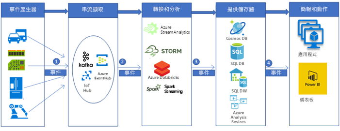

# 擷取和處理即時汽車 IoT 資料Ingestion and processing of real-time automotive IoT data

此範例案例會建置即時資料擷取和處理管線，將來自 IoT 裝置 (在一般感應器中) 的訊息擷取到 Azure 的巨量資料分析平台中，然後加以處理。This example scenario builds a real time data ingestion and processing pipeline to ingest and process messages from IoT devices (in general sensors) into a big data analytic platform in Azure. 車輛車載資通訊 (Telematics) 擷取和處理平台是建立已連線汽車解決方案的關鍵。Vehicle telematics ingestion and processing platforms are the key to create connected car solutions. 此特定案例是由汽車車載資通訊擷取和處理系統所驅使。This specific scenario is motivated by the car telematics ingestion and processing systems. 不過，對於許多使用感應器來管理和監視複雜系統的產業，例如智慧型建築、通訊、製造、零售和醫療保健產業，其設計模式關係重大。However, the design patterns are relevant for many industries using sensors to manage and monitor complex systems in industries such as smart buildings, communications, manufacturing, retail, and healthcare.

此範例示範車載 IoT 裝置訊息的即時資料擷取和處理管線。This example demonstrates a real time data ingestion and processing pipeline for messages from IoT devices installed in vehicles. IoT 裝置和感應器會產生數以百萬計的訊息 (或事件)。Thousands and millions of messages (or events) are generated by the IoT devices and sensors. 藉由擷取和分析這些訊息，我們即可獲得寶貴的見解並採取適當的動作。By capturing and analyzing these messages, we can decipher valuable insights and take appropriate actions. 比方說，利用配備車載資通訊裝置的汽車，如果我們可以即時擷取裝置 (IoT) 訊息，我們就能夠監視車輛的即時位置、規劃最佳路線、對駕駛提供協助，以及支援車載資通訊相關產業，例如自動保險。For example, with cars equipped telematics devices, if we can capture the device (IoT) messages in real time, we would be able to monitor the live location of vehicles, plan optimized routes, provide assistance to drivers, and support telematics-related industries such as auto insurance.

針對此範例示範，想像有一家汽車製造公司想要建立一套即時系統，擷取及處理來自車載資通訊裝置的訊息。For this example demonstration, imagine a car manufacturing company that wants to create a real time system to ingest and process messages from telematics devices. 公司的目標包括：The company's goals include:

- 即時擷取和儲存來自車輛、感應器和裝置的資料。Ingest and store data in real time from vehicles sensors and devices.
- 分析訊息以了解車輛位置，以及其他透過不同類型的感應器 (例如引擎相關感應器和環境相關感應器) 所發出的資訊。Analyze the messages to understand vehicle location, and other information emitted through different types of sensors (such as engine-related sensors and environment-related sensors).
- 在分析之後儲存資料，以供進行其他下游處理，進而提供可採取行動的見解 (例如，在意外事故案例中，保險機構可能會想要知道意外事故過程中發生什麼事情等)。Store the data after analysis for other downstream processing to provide actionable insights (For example, in accident scenarios, insurance agencies may be interested to know what happened during an accident etc.)

## 相關使用案例Relevant use cases

其他相關的使用案例包括：Other relevant use cases include:

- 車輛維護提醒和警示。Vehicle maintenance reminders and alerting.
- 車輛乘客的行動定位服務 (也就是 SOS)。Location-based services for the vehicle passengers (that is, SOS).
- 自動駕駛的車輛。Autonomous (self-driving) vehicles.

## 架構Architecture

在典型的巨量資料處理管線實作中，資料會由左到右流動。In a typical big data processing pipeline implementation, the data flows from left to right. 在此即時巨量資料處理管線中，資料會如下所示流經解決方案：In this real time big data processing pipeline, the data flows through the solution as follows:

1. 從 IoT 資料來源產生的事件會透過 Azure HDInsight Kafka，以一連串訊息的方式傳送至資料流擷取層。Events generated from the IoT data sources are sent to the stream ingestion layer through Azure HDInsight Kafka as a stream of messages. HDInsight Kafka 會將資料流儲存在主題中 (您可設定時間長度)。HDInsight Kafka stores streams of data in topics for a configurable of time.
2. Kafka 取用者 (Azure Databricks) 會從 Kafka 主題中即時挑選訊息，以根據商務邏輯處理資料，然後傳送到服務層進行儲存。Kafka consumer, Azure Databricks, picks up the message in real time from the Kafka topic, to process the data based on the business logic and can then send to Serving layer for storage.
3. 然後，下游儲存服務 (例如 Azure Cosmos DB、Azure SQL 資料倉儲或 Azure SQL DB) 會成為簡報和動作層級的資料來源。Downstream storage services, like Azure Cosmos DB, Azure SQL Data warehouse, or Azure SQL DB, will then be a data source for presentation and action layer.
4. 商務分析師可使用 Microsoft Power BI 來分析倉儲中的資料。Business analysts can use Microsoft Power BI to analyze warehoused data. 您也可以根據服務層建置其他應用程式。Other applications can be built upon the serving layer as well. 例如，我們可以根據服務層資料公開 API，以供第三方使用。For example, we can expose APIs based on the service layer data for third party uses.

### 元件Components

使用下列 Azure 元件，擷取、處理 IoT 裝置所產生的事件 (資料或訊息)，然後儲存起來，以供進一步分析、進行簡報及採取動作：IoT device-generated events (data or messages) are ingested, processed, and then stored for further analysis, presentation, and action, using the following Azure components:

- [Apache Kafka on HDInsight](/azure/hdinsight/kafka/apache-kafka-introduction) 位於擷取層中。[Apache Kafka on HDInsight](/azure/hdinsight/kafka/apache-kafka-introduction) is in the ingestion layer. 使用 Kafka 產生者 API 將資料寫入至 Kafka 主題。The data is written into the Kafka topic using a Kafka producer API.
- [Azure Databricks](/services/databricks) 位於轉換和分析層。[Azure Databricks](/services/databricks) is located in the transformation and analytics layer. Databricks Notebook 會實作 Kafka 取用者 API，以從 Kafka 主題讀取資料。Databricks notebooks implement a Kafka consumer API to read the data from the Kafka topic.
- [Azure Cosmos DB](/services/cosmos-db)、[Azure SQL Database](/azure/sql-database/sql-database-technical-overview) 和 Azure SQL 資料倉儲位於儲存體服務層中，Azure Databricks 可以透過資料連接器在其中寫入資料。[Azure Cosmos DB](/services/cosmos-db), [Azure SQL Database](/azure/sql-database/sql-database-technical-overview), and Azure SQL Data Warehouse are in the Serving storage layer, where Azure Databricks can write the data via data connectors.
- [Azure SQL 資料倉儲](/azure/sql-data-warehouse/sql-data-warehouse-overview-what-is)是一套分散式系統，用於儲存和分析大型資料集。[Azure SQL Data Warehouse](/azure/sql-data-warehouse/sql-data-warehouse-overview-what-is) is a distributed system for storing and analyzing large datasets. 它會使用大量平行處理 (MPP)，因而適合用來執行高效能分析。Its use of massive parallel processing (MPP) makes it suitable for running high-performance analytics.
- [Power BI](https://docs.microsoft.com/power-bi) 是一套商務分析工具，用來分析資料及分享見解。[Power BI](https://docs.microsoft.com/power-bi) is a suite of business analytics tools to analyze data and share insights. Power BI 可以查詢 Analysis Services 中儲存的語意模型，也可以直接查詢 SQL 資料倉儲。Power BI can query a semantic model stored in Analysis Services, or it can query SQL Data Warehouse directly.
- [Azure Active Directory (Azure AD)](/azure/active-directory) 會在連線至 [Azure Databricks](https://azure.microsoft.com/services/databricks) 時，驗證使用者。[Azure Active Directory (Azure AD)](/azure/active-directory) authenticates users, when connecting to [Azure Databricks](https://azure.microsoft.com/services/databricks). 如果我們要根據以 Azure SQL 資料倉儲資料為基礎的模型，在 [Analysis Services](/azure/analysis-services) 中建立 Cube，我們可以透過 Power BI 使用 AAD 來連線到 Analysis Services 伺服器。If we would build a cube in [Analysis Services](/azure/analysis-services) based on the model based on Azure SQL Data Warehouse data, we could use AAD to connect to the Analysis Services server through Power BI. Data Factory 也可以透過服務主體或受控服務識別 (MSI)，使用 Azure AD 來驗證 SQL 資料倉儲。Data Factory can also use Azure AD to authenticate to SQL Data Warehouse via a service principal or Managed Service Identity (MSI).
- [Azure App Service](/azure/app-service/app-service-web-overview)，尤其是 [API 應用程式](/services/app-service/api)可根據服務層中儲存的資料向第三方公開資料。[Azure App Services](/azure/app-service/app-service-web-overview), in particular [API App](/services/app-service/api) can be used to expose data to third parties, based on the data stored in the Serving Layer.

## 替代項目Alternatives

使用其他 Azure 元件，可以實作更廣義的巨量資料管線。A more generalized big data pipeline could be implemented using other Azure components.

- 在資料流擷取層中，我們可以使用 [IoT 中樞](https://azure.microsoft.com/services/iot-hub)或[事件中樞](https://azure.microsoft.com/services/event-hubs)，而非使用 [HDInsight Kafka](/azure/hdinsight/kafka/apache-kafka-introduction) 來擷取資料。In the stream ingestion layer, we could use [IoT Hub](https://azure.microsoft.com/services/iot-hub) or [Event Hub](https://azure.microsoft.com/services/event-hubs), instead of [HDInsight Kafka](/azure/hdinsight/kafka/apache-kafka-introduction) to ingest data.
- 在轉換和分析層中，我們可以使用 [HDInsight Storm](/azure/hdinsight/storm/apache-storm-overview)、[HDInsight Spark](/azure/hdinsight/spark/apache-spark-overview) 或 [Azure Stream Analytics](https://azure.microsoft.com/services/stream-analytics)。In the transformation and analytics layer, we could use [HDInsight Storm](/azure/hdinsight/storm/apache-storm-overview), [HDInsight Spark](/azure/hdinsight/spark/apache-spark-overview), or [Azure Stream Analytics](https://azure.microsoft.com/services/stream-analytics).
- [Analysis Services](/azure/analysis-services) 可提供您資料的語意模型。[Analysis Services](/azure/analysis-services) provides a semantic model for your data. 也可以在分析資料時提升系統效能。It can also increase system performance when analyzing your data. 您可以根據 Azure DW 資料建置模型。You can build the model based on Azure DW data.

## 考量Considerations

根據處理事件、服務 SLA、成本管理和元件管理方便性所需的規模，選擇此架構中的技術。The technologies in this architecture were chosen based on the scale needed to process events, the SLA of the services, the cost management and ease of management of the components.

- 隨附 99.9% SLA 的受控 [HDInsight Kafka](/azure/hdinsight/kafka/apache-kafka-introduction) 會與 Azure 受控磁碟整合Managed [HDInsight Kafka](/azure/hdinsight/kafka/apache-kafka-introduction) comes with a 99.9% SLA is integrated with Azure Managed Disks
- [Azure Databricks](/azure/azure-databricks/what-is-azure-databricks) 已針對在雲端中的效能和成本效益，從零開始最佳化。[Azure Databricks](/azure/azure-databricks/what-is-azure-databricks) is optimized from the ground up for performance and cost-efficiency in the cloud. Databricks Runtime 將數個重要功能新增至 Apache Spark 工作負載，以提升效能並降低成本 (效能是在 Azure 上執行時的 10-100 倍)，這些功能包括：The Databricks Runtime adds several key capabilities to Apache Spark workloads that can increase performance and reduce costs by as much as 10-100x when running on Azure, including:
- Azure Databricks 會與 Azure 資料庫和存放區深入整合：[Azure SQL 資料倉儲](/azure/sql-data-warehouse)、[Azure Cosmos DB](https://azure.microsoft.com/services/cosmos-db)、[Azure Data Lake Storage](https://azure.microsoft.com/services/storage/data-lake-storage) 和 [Azure Blob 儲存體](https://azure.microsoft.com/services/storage/blobs)Azure Databricks integrates deeply with Azure databases and stores: [Azure SQL Data Warehouse](/azure/sql-data-warehouse), [Azure Cosmos DB](https://azure.microsoft.com/services/cosmos-db), [Azure Data Lake Storage](https://azure.microsoft.com/services/storage/data-lake-storage), and [Azure Blob Storage](https://azure.microsoft.com/services/storage/blobs)
  - 自動調整和自動終止 Spark 叢集，以自動將成本降至最低。Autoscaling and autotermination for Spark clusters to automatically minimize costs.
  - 效能最佳化包括快取、編製索引，以及進階查詢最佳化，這可改善效能，達到雲端或內部部署環境中傳統 Apache Spark 部署的 10-100 倍。Performance optimizations including caching, indexing, and advanced query optimization, which can improve performance by as much as 10-100x over traditional Apache Spark deployments in cloud or on-premises environments.
  - 與 Azure Active Directory 整合可讓您使用 Azure Databricks 執行完整的 Azure 型解決方案。Integration with Azure Active Directory enables you to run complete Azure-based solutions using Azure Databricks.
  - Azure Databricks 中的角色型存取可讓您針對 Notebook、叢集、作業和資料提供更細緻的使用者權限。Role-based access in Azure Databricks enables fine-grained user permissions for notebooks, clusters, jobs, and data.
  - 隨附企業級 SLA。Comes with Enterprise-grade SLAs.
- Azure Cosmos DB 是 Microsoft 全球發行的多模型資料庫。Azure Cosmos DB is Microsoft’s globally distributed, multi-model database. 全新打造的 Azure Cosmos DB 具備全域散發功能，且可依其核心進行水平調整。Azure Cosmos DB was built from the ground up with global distribution and horizontal scale at its core. 不論您的使用者身在何處，都可以透明調整及複寫您的資料，以周全地全域散發到任何數目的 Azure 區域。It offers turnkey global distribution across any number of Azure regions by transparently scaling and replicating your data wherever your users are. 您可以在世界各地彈性地調整輸送量和儲存體規模，並且只支付所需輸送量和儲存體的費用。You can elastically scale throughput and storage worldwide, and pay only for the throughput and storage you need.
- SQL 資料倉儲的大量平行處理架構可提供延展性和高效能。The massively parallel processing architecture of SQL Data Warehouse provides scalability and high performance.
- Azure SQL 資料倉儲具有保證的 SLA 以及達到高可用性的建議做法。Azure SQL Data Warehouse has guaranteed SLAs and recommended practices for achieving high availability.
- 當分析活動變少時，公司可以隨需調整 Azure SQL 資料倉儲、減少或甚至暫停計算，以降低成本。When analysis activity is low, the company can scale Azure SQL Data Warehouse on demand, reducing or even pausing compute to lower costs.
- Azure SQL 資料倉儲安全性模型可透過 Azure AD 或 SQL Server 驗證和加密，提供連線安全性、驗證和授權。The Azure SQL Data Warehouse security model provides connection security, authentication, and authorization via Azure AD or SQL Server authentication, and encryption.

## 價格Pricing

透過 Azure 定價計算機，檢閱 [Azure Databricks 定價](https://azure.microsoft.com/pricing/details/databricks)、[Azure HDInsight 定價](https://azure.microsoft.com/pricing/details/hdinsight)、[資料倉儲案例的定價範例](https://azure.com/e/b798fb70c53e4dd19fdeacea4db78276)。Review [Azure Databricks pricing](https://azure.microsoft.com/pricing/details/databricks), [Azure HDInsight pricing](https://azure.microsoft.com/pricing/details/hdinsight), [pricing sample for a data warehousing scenario](https://azure.com/e/b798fb70c53e4dd19fdeacea4db78276) via the Azure pricing calculator. 調整一些值，以查看需求對於成本有何影響。Adjust the values to see how your requirements affect your costs.

- [Azure HDInsight](/azure/hdinsight) 是管理完善的雲端服務，不僅可以簡化處理大量資料的程序，而且速度快，成本低。[Azure HDInsight](/azure/hdinsight) is a fully-managed cloud service that makes it easy, fast, and cost-effective to process massive amounts of data
- [Azure Databricks](https://azure.microsoft.com/services/databricks) 在多個 [VM 執行個體](https://azure.microsoft.com/pricing/details/databricks/#instances)上提供專為資料分析工作流程打造的兩種不同之工作負載：「資料工程」工作負載可讓資料工程師能夠輕鬆建置及執行作業，而「資料分析」工作負載則能讓資料科學家以互動方式探索、具體呈現、操控及共用資料與深入解析。[Azure Databricks](https://azure.microsoft.com/services/databricks) offers two distinct workloads on several [VM Instances](https://azure.microsoft.com/pricing/details/databricks/#instances) tailored for your data analytics workflow—the Data Engineering workload makes it easy for data engineers to build and execute jobs, and the Data Analytics workload makes it easy for data scientists to explore, visualize, manipulate, and share data and insights interactively.
- [Azure Cosmos DB](https://azure.microsoft.com/services/cosmos-db) 保證世界各地第 99 個百分位數的個位數毫秒延遲時間，提供[多個定義完善的一致性模型](/azure/cosmos-db/consistency-levels)以微調效能，並保證透過多路連接功能提供高可用性 - 全都享有領先業界之全方位[服務等級協定](https://azure.microsoft.com/support/legal/sla/cosmos-db) (SLA) 的安心保障。[Azure Cosmos DB](https://azure.microsoft.com/services/cosmos-db) guarantees single-digit-millisecond latencies at the 99th percentile anywhere in the world, offers [multiple well-defined consistency models](/azure/cosmos-db/consistency-levels) to fine-tune performance, and guarantees high availability with multi-homing capabilities—all backed by industry leading comprehensive [service level agreements](https://azure.microsoft.com/support/legal/sla/cosmos-db) (SLAs).
- [Azure SQL 資料倉儲](https://azure.microsoft.com/pricing/details/sql-data-warehouse/gen2)可讓您獨立調整計算和儲存體層級。[Azure SQL Data Warehouse](https://azure.microsoft.com/pricing/details/sql-data-warehouse/gen2) allows you to scale your compute and storage levels independently. 計算資源需每小時付費，而您可以依照需求調整或暫停這些資源。Compute resources are charged per hour, and you can scale or pause these resources on demand. 儲存體資源會依照 TB 計費，因此成本會隨著您內嵌更多資料而增加。Storage resources are billed per terabyte, so your costs will increase as you ingest more data.
- [Analysis Services](https://azure.microsoft.com/pricing/details/analysis-services) 會以開發人員、基本及標準層提供。[Analysis Services](https://azure.microsoft.com/pricing/details/analysis-services) is available in developer, basic, and standard tiers. 執行個體的定價是以查詢處理單位 (QPU) 和可用的記憶體為基礎。Instances are priced based on query processing units (QPUs) and available memory. 為了保持較低的成本，請將您執行的查詢數目、其所處理的資料數量，以及其執行頻率降至最低。To keep your costs lower, minimize the number of queries you run, how much data they process, and how often they run.
- [Power BI](https://powerbi.microsoft.com/pricing) 有不同的產品選項可滿足不同的需求。[Power BI](https://powerbi.microsoft.com/pricing) has different product options for different requirements. [Power BI Embedded](https://azure.microsoft.com/pricing/details/power-bi-embedded) 針對您的應用程式內嵌的 Power BI 功能提供一個 Azure 型選項。[Power BI Embedded](https://azure.microsoft.com/pricing/details/power-bi-embedded) provides an Azure-based option for embedding Power BI functionality inside your applications. Power BI Embedded 執行個體包含在上面的定價範例中。A Power BI Embedded instance is included in the pricing sample above.

## 後續步驟Next Steps

- 檢閱[即時分析](https://azure.microsoft.com/solutions/architecture/real-time-analytics)參考架構，其中包括巨量資料管線流程。Review the [Real-time analytics](https://azure.microsoft.com/solutions/architecture/real-time-analytics) reference architecture that includes big data pipeline flow.
- 檢閱[進階巨量資料分析](https://azure.microsoft.com/solutions/architecture/advanced-analytics-on-big-data)參考架構，以窺視不同的 Azure 元件如何協助建置巨量資料管線。Review the [Advanced analytics on big data](https://azure.microsoft.com/solutions/architecture/advanced-analytics-on-big-data) reference architecture to get a peek on how different azure components can help build a big data pipeline.
- 閱讀 Azure [即時處理](/azure/architecture/data-guide/big-data/real-time-processing)文件，以快速檢視不同的 Azure 元件如何協助即時處理資料流。Read the [Real time processing](/azure/architecture/data-guide/big-data/real-time-processing) Azure documentation to get a quick view of how different Azure components help in processing streams of data in real time.
- 在 [Azure 資料架構指南](/azure/architecture/data-guide)中尋找有關資料管線、資料倉儲、線上分析處理 (OLAP) 和巨量資料的完整架構指引。Find comprehensive architectural guidance on data pipelines, data warehousing, online analytical processing (OLAP), and big data in the [Azure Data Architecture Guide](/azure/architecture/data-guide).
