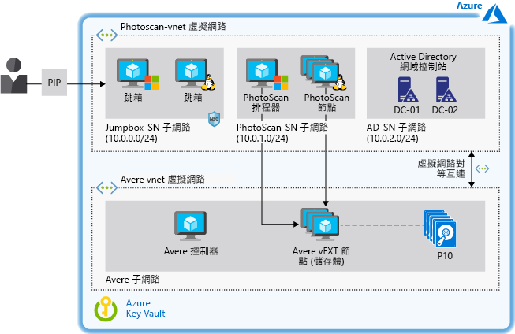

# 在 Azure 上加速數位映像式模型化

此範例案例針對任何想要在 Azure 基礎結構即服務 (IaaS) 上執行映像式模型化的組織，提供架構和設計指引。 此案例的設計訴求是在使用高效能儲存體 (加快處理時間) 的 Azure 虛擬機器 (VM) 上執行攝影測量軟體。 此環境可以視需要相應放大和縮小，且支援數 TB 的儲存體，而不會犧牲效能。

## 相關使用案例

相關使用案例包括：

- 大樓、工程結構和鑑識意外現場的模型化和測量。
- 製作電腦遊戲與電影的視覺效果。
- 使用數位映像，如同在都市規劃和其他應用程式中，間接產生各種規模的物件測量。

## 架構

這個範例說明如何使用由 Avere vFXT 儲存體支援的 Agisoft PhotoScan 攝影測量軟體。 PhotoScan 在地理資訊系統 (GIS) 應用程式、文化遺產文獻、遊戲開發，以及視覺效果製作方面大受歡迎。 它很適合用於近景攝影測量和航空攝影測量。

本文的概念適用於任何以排程器為基礎的高效能運算 (HPC) 工作量，以及當作基礎結構管理的背景工作角色節點。  對此工作負載，Avere vFXT 因為其在基準測試期間的優異效能而受到青睞。  不過，此案例將儲存體與處理分開，以便使用其他儲存體解決方案 (請參閱本文件稍後的[替代項目](#alternatives))。

此架構也包含 Active Directory 網域控制站，以控制 Azure 資源的存取權並透過網域名稱系統 (DNS) 提供內部名稱解析。 Jumpbox 可供系統管理員存取執行此解決方案的 Windows 和 Linux VM。

1. 使用者可將數個映像提交至 PhotoScan。
2. PhotoScan Scheduler 會在作為前端節點並指示使用者映像處理的 Windows VM 上執行。
3. PhotoScan 會搜尋相片的共通點，並使用在具有圖形處理器 (GPU) 的 VM 上執行的 PhotoScan 處理節點建構幾何 (mesh)。
4. Avere vFXT 會在以網路檔案系統版本 3 (NFSv3) 為基礎且至少由四部 VM 所組成的 Azure 上，提供高效能儲存體解決方案。
5. PhotoScan 可轉譯模型。

### 元件

- [Agisoft PhotoScan](http://www.agisoft.com/)：PhotoScan Scheduler 在 Windows 2016 Server VM 上執行，而處理節點會使用五部執行 CentOS Linux 7.5 且具有 GPU 的 VM。
- [Avere vFXT](/azure/avere-vfxt/avere-vfxt-overview) 是檔案快取解決方案，其使用物件儲存體和傳統網路連接儲存裝置 (NAS) 將大型資料集的儲存體最佳化。 其中包括：
  - Avere Controller。 此 VM 會執行指令碼，以安裝 Avere vFXT 叢集並執行 Ubuntu 18.04 LTS。 此 VM 稍後可用於新增或移除叢集節點，以及終結叢集。
  - vFXT 叢集。 至少使用三部 VM，以 Avere OS 5.0.2.1 為基礎的每個 Avere vFXT 節點各使用一部 VM。 這些 VM 會形成 vFXT 叢集，而該叢集會連結到 Azure Blob 儲存體。
- [Microsoft Active Directory 網域控制站](/windows/desktop/ad/active-directory-domain-services)可讓主機存取網域資源並提供 DNS 名稱解析。 Avere vFXT 會新增許多 A 記錄，例如 vFXT 叢集中的每筆 A 記錄都會指向每個 Avere vFXT 節點的 IP 位址。 在此設定中，所有 VM 都會使用循環配置資源模式來存取 vFXT 匯出。
- [其他 VM](/azure/virtual-machines/) 作為系統管理員用來存取排程器和處理節點的 Jumpbox。 Windows Jumpbox 是必要的，可允許系統管理員透過遠端桌面通訊協定存取前端節點。 第二個 Jumpbox 是選擇性的，其執行 Linux 以便管理背景工作節點。
- [網路安全性群組](/azure/virtual-network/manage-network-security-group) (NSG) 會限制公用 IP 位址 (PIP) 的存取，以及允許連接埠 3389 和 22 存取連結到 Jumpbox 子網路的 VM。
- [虛擬網路對等互連](/azure/virtual-network/virtual-network-peering-overview)會將 PhotoScan 虛擬網路連線至 Avere 虛擬網路。
- [Azure Blob 儲存體](/azure/storage/blobs/storage-blobs-introduction)搭配 Avere vFXT 運作，以作為核心檔案管理工具來儲存正在處理的已認可資料。 Avere vFXT 可識別 Azure Blob 中儲存的有效資料，並將該資料放入固態硬碟 (SSD)，而當 PhotoScan 作業正在執行時，這些固態硬碟用於在其計算節點中快取。 如果進行了變更，資料會以非同步方式認可回到核心檔案管理工具。
- [Azure Key Vault](/azure/key-vault/key-vault-overview) 用來儲存系統管理員密碼和 PhotoScan 啟用碼。

### 替代項目

- 若要利用 Azure 服務來管理 HPC 叢集，請使用 Azure CycleCloud 或 Azure Batch 之類的工具，而不是透過範本或指令碼管理資源。
- 部署 BeeGFS 平行虛擬檔案系統，作為 Azure 上 (而非 Avere vFXT) 的後端儲存體。 使用 [BeeGFS 範本](https://github.com/paulomarquesc/beegfs-template)在 Azure 上部署此端對端解決方案。
- 部署您所選的儲存體解決方案，例如 GlusterFS、Lustre 或 Windows Storage Spaces Direct。 若要這麼做，請編輯 [PhotoScan 範本](https://github.com/paulomarquesc/photoscan-template)以使用您想要的儲存體解決方案。
- 部署 Windows 作業系統 (而非預設選項 Linux) 的背景工作節點。 在選擇 Windows 節點時，部署範本不會執行儲存體整合選項。 您必須手動整合此環境與現有的儲存體解決方案，或自訂 PhotoScan 範本以提供這類自動化功能 (如[存放庫](https://github.com/paulomarquesc/photoscan-template/blob/master/docs/AverePostDeploymentSteps.md)中所述)。

## 考量

此案例經過特別設計，以提供 HPC 工作負載適用的高效能儲存體 (無論是部署在 Windows 或 Linux 上)。 一般而言，HPC 工作負載的儲存體組態，應符合內部部署適用的最佳做法。

部署考量取決於所使用的應用程式和服務，但適用少數注意事項：

- 建置高效能應用程式時，請使用 Azure 進階儲存體及[最佳化應用程式層](/azure/virtual-machines/windows/premium-storage-performance)。 使用 Azure Blob 儲存體[經常性存取層存取](/azure/storage/blobs/storage-blob-storage-tiers)將儲存體最佳化，以便頻繁存取。
- 使用符合您的可用性和效能需求的儲存體[複寫選項](/azure/storage/common/storage-redundancy)。 在此範例中，Avere vFXT 已根據預設針對高可用性而設定，且具有本地備援儲存體 (LRS)。 為了平衡負載，此設定中的所有 VM 都會使用循環配置資源模式來存取 vFXT 匯出。
- 如果後端儲存體將由 Windows 用戶端和 Linux 用戶端取用，請使用 Samba 伺服器支援 Windows 節點。 此範例案例 (以 BeeGFS 為基礎) 的[版本](https://github.com/paulomarquesc/beegfs-template)使用 Samba 來支援在 Windows 上執行的 HPC 工作負載 (PhotoScan) 排程器節點。 部署負載平衡器，其作用如同 DNS 循環配置資源的智慧代替物。
- 使用最適合您的 [Windows](/azure/virtual-machines/windows/sizes-hpc) 或 [Linux](/azure/virtual-machines/linux/sizes?toc=%2fazure%2fvirtual-machines%2flinux%2ftoc.json) 工作負載的 VM 類型，執行 HPC 應用程式。
- 若要隔離 HPC 工作負載與儲存體資源，請將其各自部署在自己的虛擬網路中，然後使用虛擬網路[對等互連](/azure/virtual-network/virtual-network-peering-overview)來連接兩者。 對等互連會在不同虛擬網路中的資源之間建立低延遲、高頻寬的連線，且僅透過私人 IP 位址在 Microsoft 骨幹基礎結構中傳送流量。

### 安全性

此範例著重於部署 HPC 工作負載適用的高效能儲存體解決方案，並不是安全性解決方案。 務必與您的安全性小組商討任何變更。

為了提高安全性，此範例基礎結構可讓所有 Windows VM 加入網域，並使用 Active Directory 進行集中驗證。 它也針對所有 VM 提供自訂 DNS 服務。 為了協助保護環境，此範本依賴[網路安全性群組 (NSG)](/azure/virtual-network/security-overview)。 NSG 提供基本的流量篩選條件和安全性規則。

請考慮下列選項，進一步改善此案例的安全性：

- 使用網路虛擬設備，例如 Fortinet、Checkpoint 和 Juniper。
- 將[角色型存取控制](/azure/role-based-access-control/overview)套用到資源群組。
- 如果透過網際網路存取 Jumpbox，請啟用 VM [JIT](/azure/security-center/security-center-just-in-time) 存取。
- 使用 [Azure Key Vault](/azure/key-vault/quick-create-portal) 來儲存系統管理員帳戶所使用的密碼。

## 價格

執行此案例的成本因諸多因素而大不相同。  VM 的數目和大小，需要多少儲存體，以及完成作業所需的時間量將會決定您的成本。

[Azure 定價計算機](https://azure.com/e/42362ddfd2e245a28a8e78bc609c80f3)中以下的範例成本設定檔是以 Avere vFXT 和 PhotoScan 典型組態為基礎：

- 1 部 A1\_v2 Ubuntu VM，可執行 Avere 控制站。
- 3 部 D16s\_v3 Avere OS VM，構成 vFXT 叢集的每個 Avere vFXT 節點各使用一部 VM。
- 5 部 NC24\_v2 Linux VM，可提供 PhotoScan 處理節點所需的 GPU。
- 1 部 D8s\_v3 CentOS VM，適用於 PhotoScan 排程器節點。
- 1 部 DS2\_v2 CentOS，作為系統管理員 Jumpbox 使用。
- 2 部 DS2\_v2 VM，適用於 Active Directory 網域控制站。
- 進階受控磁碟。
- 具有 LRS 和經常性存取層存取的一般用途 v2 (GPv2) Blob 儲存體 (只有 GPv2 儲存體帳戶可公開存取層屬性)。
- 支援 10 TB 資料轉送的虛擬網路。

如需此架構的詳細資訊，請參閱[電子書](https://azure.microsoft.com/en-us/resources/deploy-agisoft-photoscan-on-azure-with-azere-vfxt-for-azure-or-beegfs/)。 若要查看定價如何針對特定使用案例而變更，請在定價計算機中選擇不同的 VM 大小，以符合您預期的部署。

## 部署

如需部署此架構的逐步指示 (包括使用 Avere FxT 或 BeeGFS 的所有必要條件)，請下載電子書：[在 Azure 上使用 Avere vFXT for Azure 或 BeeGFS 部署 Agisoft PhotoScan](https://azure.microsoft.com/en-us/resources/deploy-agisoft-photoscan-on-azure-with-azere-vfxt-for-azure-or-beegfs/)。

## 相關資源

下列資源會提供此案例中所用元件的詳細資訊，以及在 Azure 上進行批次運算的替代方法。

- [Avere vFXT for Azure](/azure/avere-vfxt/avere-vfxt-overview) 概觀
- [Agisoft PhotoScan](https://www.agisoft.com/) 首頁
- [Azure 儲存體效能與延展性檢查清單](/azure/storage/common/storage-performance-checklist)
- [Microsoft Azure 上的平行虛擬檔案系統：Lustre、GlusterFS 和 BeeGFS 的效能測試](https://azure.microsoft.com/mediahandler/files/resourcefiles/parallel-virtual-file-systems-on-microsoft-azure/Parallel_Virtual_File_Systems_on_Microsoft_Azure.pdf) (PDF)
- [Azure 上的電腦輔助工程 (CAE)](/azure/architecture/example-scenario/apps/hpc-saas) 範例案例
- [Azure 上的高效能運算](https://azure.microsoft.com/en-us/solutions/high-performance-computing/)首頁
- [大量計算：HPC &amp; Microsoft Batch](https://azure.microsoft.com/en-us/solutions/big-compute/) 概觀