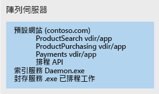
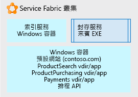

# 使用 Service Fabric 來分解整合型應用程式Using Service Fabric to decompose monolithic applications

在此範例案例中，我們將逐步說明如何使用 [Service Fabric](/azure/service-fabric/service-fabric-overview) 作為平台來分解笨重的整合型應用程式。In this example scenario, we walk through an approach using [Service Fabric](/azure/service-fabric/service-fabric-overview) as a platform for decomposing an unwieldy monolithic application. 在這裡，我們考慮採用反覆性方法將 IIS/ASP.NET 網站分解為由多個可管理的微服務所組成的應用程式。Here we consider an iterative approach to decomposing an IIS/ASP.NET web site into an application composed of multiple, manageable microservices.

從整合型架構移至微服務架構，具有下列優點：Moving from a monolithic architecture to a microservice architecture provides the following benefits:
* 您可以變更一個小型、可理解的程式碼單元，並且只部署該單元。You can change one small, understandable unit of code and deploy only that unit.
* 每個程式碼單元都只需要幾分鐘或更少的時間來部署。Each code unit requires just a few minutes or less to deploy.
* 若該小型單元中發生錯誤，只有該單元會停止運作，而不是整個應用程式都停止運作。If there is an error in that small unit, only that unit stops working, not the whole application.
* 小型的程式碼單元可以輕鬆地以分散式方式散發給多個開發團隊。Small units of code can be distributed easily and discretely among multiple development teams.
* 新的開發人員可以快速且輕鬆地掌握每個單元的分散式功能。New developers can quickly and easily grasp the discrete functionality of each unit.

我們在此範例中使用伺服器陣列上的大型 IIS 應用程式，但反覆分解並裝載的概念可用於任何類型的大型應用程式。A large IIS application on a server farm is used in this example, but the concepts of iterative decomposition and hosting can be used for any type of large application. 雖然此解決方案使用 Windows，但 Service Fabric 也可以在 Linux 上執行。While this solution uses Windows, Service Fabric can also run on Linux. 它可以在內部部署環境、雲端或您選擇之雲端提供者中的 VM 節點上執行。It can be run on-premises, in Azure, or on VM nodes in the cloud provider of your choice.

## 相關使用案例Relevant use cases

此案例與使用大型整合型 Web 應用程式並發生下列問題的組織有關：This scenario is relevant to organizations with large monolithic Web applications that are experiencing:

- 小型程式碼變更發生錯誤，導致整個網站停擺。Errors in small code changes that break the entire website.
- 由於必須更新整個網站，所以發行需要數天才完成。Releases taking multiple days due to the need to release update the entire website.
- 由於程式碼基底很複雜，以致單一個人需要了解的內容遠大於他所能處理的上限，造成開發人員或團隊難以快速上手。Long ramp-up times when onboarding new developers or teams due to the complex code base, requiring a single individual to know more than is feasible.

## 架構Architecture

使用 Service Fabric 作為裝載平台時，我們可以將大型 IIS 網站轉換為微服務集合，如下所示：Using Service Fabric as the hosting platform, we can convert a large IIS web site into a collection of microservices as shown below:

在上圖中，我們將大型 IIS 應用程式的所有元件分解為：In the picture above, we decomposed all the parts of a large IIS application into:

- 一個路由或閘道服務，可接受連入瀏覽器要求、剖析它們以判斷應該將它們交由哪個服務處理，然後將要求轉送到該服務。A routing or gateway service that accepts incoming browser requests, parses them to determine what service should handle them, and forwards the request to that service.
- 四個 ASP.NET Core 應用程式，這些應用程式先前是在單一 IIS 網站下以 ASP.NET 應用程式形式執行的虛擬目錄。Four ASP.NET Core applications that were formally virtual directories under the single IIS site running as ASP.NET applications. 應用程式被分解為其自己的獨立微服務。The applications were separated into their own independent microservices. 效果是您可以獨立變更它們、進行版本設定並升級。The effect is that they can be changed, versioned, and upgraded separately. 在此範例中，我們使用 .Net Core 與 ASP.NET Core 重寫了每個應用程式。In this example, we rewrote each application using .Net Core and ASP.NET Core. 這些是撰寫為 [Reliable Services](/azure/service-fabric/service-fabric-reliable-services-introduction)，因此它們能以原生方式存取完整的 Service Fabric 平台功能與優點 (通訊服務、健康情況報告與通知等)。These were written as [Reliable Services](/azure/service-fabric/service-fabric-reliable-services-introduction) so they can natively access the full Service Fabric platform capabilities and benefits (communication services, health reports, notifications, etc.).
- 有一個名為「索引服務」的 Windows 服務會被放置在 Windows 容器中，因此它再也不會直接變更底層伺服器的登錄，但是會以自封式方式執行並隨著其所有相依性以單一單元方式部署。A Windows service called *Indexing Service*, placed in a Windows container so that it no longer makes direct changes to registry of the underlying server, but can run self-contained and be deployed with all its dependencies as a single unit.
- 一個封存服務，它只是可根據排程執行並為網站執行一些其他工作的可執行檔。An Archive service, which is just an executable that runs according to a schedule and performs some tasks for the sites. 它是以獨立可執行檔方式直接裝載，因為我們經判斷後發現它會在不經修改的情況下執行它必須執行的工作，而且變更它並沒有投資效益存在。It is hosted directly as a stand-alone executable because we determined it does what it needs to do without modification and it is not worth the investment to change.

## 考量Considerations

第一個挑戰是開始找出可從整體型轉換為微服務以供該整體呼叫的小型程式碼部分。The first challenge is to begin to identify smaller bits of code that can be factored out from the monolith into microservices that the monolith can call. 反覆經過一段時間，整體會細分為這些開發人員可以輕鬆地了解、 變更並在低風險情況下快速部署的微服務集合。Iteratively over time, the monolith is broken up into a collection of these microservices that developers can easily understand, change, and quickly deploy at low risk.

Service Fabric 被選擇的原因是它能夠支援在其各種型態中執行所有微服務。Service Fabric was chosen because it is capable of supporting running all the microservices in their various forms. 例如，您可能會有獨立可執行檔、新小型網站、新小型 API 與集中式服務等的混合式環境。Service Fabric 可以將這些所有服務類型合併到單一叢集。For example you may have a mix of stand-alone executables, new small web sites, new small APIs, and containerized services, etc. Service Fabric can combine all these service types onto a single cluster.

為達到此最終結果 (亦即分解的應用程式)，我們使用反覆性方法。To get to this final, decomposed application, we used an iterative approach. 我們從伺服器陣列上的大型 IIS/ASP.NET 網站開始。We started with a large IIS/ASP.NET web site on a server farm. 該伺服器陣列的單一節點如下圖所示。A single node of the server farm is pictured below. 它包含具有數個虛擬目錄、網站呼叫的額外 Windows 服務以及會執行一些定期網站封存維護之可執行檔的原始網站。It contains the original web site with several virtual directories, an additional Windows Service the site calls, and an executable that does some periodic site archive maintenance.

在第一個部署反覆項目上，IIS 網站與其虛擬目錄會放置在 [Windows 容器](/azure/service-fabric/service-fabric-containers-overview)中。On the first development iteration, the IIS site and its virtual directories placed in a [Windows Container](/azure/service-fabric/service-fabric-containers-overview). 這樣做可讓網站維持運作，但不會緊密繫結到底層伺服器節點 OS。Doing this allows the site to remain operational, but not tightly bound to the underlying server node OS. 容器是由底層 Service Fabric 節點執行並協調，但節點不需要擁有網站所依存的任何狀態 (登錄項目與檔案等)。The container is run and orchestrated by the underlying Service Fabric node, but the node does not have to have any state that the site is dependent on (registry entries, files, etc.). 所有那些項目都在容器中。All of those items are in the container. 我們也因為相同的原因將索引服務放置在 Windows 容器中。We have also placed the Indexing service in a Windows Container for the same reasons. 您能以獨立方式部署、進行版本設定及調整容器規模。The containers can be deployed, versioned, and scaled independently. 最後，我們在一個簡單的[獨立可執行檔](/azure/service-fabric/service-fabric-guest-executables-introduction)中裝載封存服務，因為它是沒有任何特殊需求的自封式 .exe。Finally, we hosted the Archive Service a simple [stand-alone executable file](/azure/service-fabric/service-fabric-guest-executables-introduction) since it is a self-contained .exe with no special requirements.

下圖顯示您的大型網站現在如何分解為獨立單元並在時間允許的情況下進一步分解。The picture below shows how our large web site is now partially decomposed into independent units and ready to be decomposed more as time allows.

進一步的開發著重在分解上圖所述的單一大型預設網站容器。Further development focuses on separating the single large Default Web site container pictured above. 每個虛擬目錄 ASP.NET 應用程式都會從容器移除 (一次一個) 並移植到 ASP.NET Core [可靠服務](/azure/service-fabric/service-fabric-reliable-services-introduction)。Each of the virtual directory ASP.NET apps is removed from the container one at a time and ported to ASP.NET Core [reliable services](/azure/service-fabric/service-fabric-reliable-services-introduction).

一旦每個虛擬目錄都分解之後，會以 ASP.NET Core 可靠服務方式撰寫預設網站，此網站可接受連入瀏覽器要求並將其路由傳送到正確的 ASP.NET 應用程式。Once each of the virtual directories has been factored out, the Default Web site is written as an ASP.NET Core reliable service, which accepts incoming browser requests and routes them to the correct ASP.NET application.

### 可用性、延展性與安全性Availability, Scalability, and Security

Service Fabric [能支援各種微服務](/azure/service-fabric/service-fabric-choose-framework)，同時快又簡單地將它們之間的呼叫維持在相同叢集。Service Fabric is [capable of supporting various forms of microservices](/azure/service-fabric/service-fabric-choose-framework) while keeping calls between them on the same cluster fast and simple. Service Fabric 是[具容錯能力](/azure/service-fabric/service-fabric-availability-services)的自我治癒式叢集，可以執行容器、可執行檔，甚至有原生 API 可在其中直接撰寫微服務 (上面所述的 'Reliable Services')。Service Fabric is a [fault tolerant](/azure/service-fabric/service-fabric-availability-services), self-healing cluster that can run containers, executables, and even has a native API for writing microservices directly to it (the 'Reliable Services' referred to above). 平台會實作滾動式升級並為每個微服務進行版本設定。The platform facilitates rolling upgrades and versioning of each microservice. 您可以告訴平台跨 Service Fabric 叢集執行更多或更少的任何給定微服務，以只[相應](/azure/service-fabric/service-fabric-concepts-scalability) 縮小或放大您需要的微服務。You can tell the platform to run more or fewer of any given microservice distributed across the Service Fabric cluster in order to [scale](/azure/service-fabric/service-fabric-concepts-scalability) in or out only the microservices you need.

Service Fabric 是建置在虛擬 (或實體) 節點且具有網路、儲存體與作業系統之基礎結構上的叢集。Service Fabric is a cluster built on an infrastructure of virtual (or physical) nodes, which have networking, storage, and an operating system. 因此，它有一組系統管理、維護與監視工作。As such, it has a set of administrative, maintenance, and monitoring tasks.

您也想要考慮叢集的治理與控制。You'll also want to consider governance and control of the cluster. 就像您不想讓人任意部署資料庫到您的生產資料庫伺服器一樣，您也不想讓人在未經監督的情況下部署應用程式到 Service Fabric 叢集。Just as you would not want people arbitrarily deploying databases to your production database server, neither would you want people deploying applications to the Service Fabric cluster without some oversight.

Service Fabric 能夠裝載許多不同的[應用程式案例](/azure/service-fabric/service-fabric-application-scenarios)，因此請花時間看看哪個適用於您的情況。Service Fabric is capable of hosting many different [application scenarios](/azure/service-fabric/service-fabric-application-scenarios), take some time to see which ones apply to your scenario.

## 價格Pricing

針對裝載在 Azure 中的 Service Fabric 叢集，影響成本最大的因素是您叢集中的節點數目與大小。For a Service Fabric cluster hosted in Azure, the largest part of the cost is the number and size of the nodes in your cluster. Azure 允許快速並簡單地建立由您所指定底層節點大小組成的叢集，但計算費用是以節點大小乘以節點數目為基礎。Azure allows quick and simple creation of a cluster composed of the underlying node size you specify, but the compute charges are based on the node size multiplied by the number of nodes.

其他對成本影響較小的元件是每個節點是虛擬磁碟的儲存體費用與從 Azure 網路連入的 IO 費用 (例如，從 Azure 到使用者瀏覽器的網路流量)。Other less costly components of cost are the storage charges for each node's virtual disks and network IO egress charges from Azure (for example network traffic out of Azure to a user's browser).

為取得成本概念，我們使用一些叢集大小、網路與儲存體的預設值建立了一個範例：看看[定價計算機](https://azure.com/e/52dea096e5844d5495a7b22a9b2ccdde)。To get an idea of cost, we have created an example using some default values for cluster size, networking, and storage: Take a look at the [pricing calculator](https://azure.com/e/52dea096e5844d5495a7b22a9b2ccdde). 您可以根據您的情況更新此預設計算機中的值。Feel free to update the values in this default calculator to those relevant to your situation.

## 後續步驟Next Steps

花一些時間閱讀 Service Fabric [文件](/azure/service-fabric/service-fabric-overview)並檢閱不同的[應用程式案例](/azure/service-fabric/service-fabric-application-scenarios)以便熟悉整個概念。Take some time to familiarize yourself with the platform by going through the [documentation](/azure/service-fabric/service-fabric-overview) and reviewing the many different [application scenarios](/azure/service-fabric/service-fabric-application-scenarios) for Service Fabric. 文件將告訴您叢集由什麼組成、叢集可以在哪些項目上執行、軟體架構與維護作業。The documentation will tell you what a cluster consists of, what it can run on, software architecture, and maintenance for it.

若要查看現有 .NET 應用程式的 Service Fabric 示範，請部署 Service Fabric [快速入門](/azure/service-fabric/service-fabric-quickstart-dotnet)。To see a demonstration of Service Fabric for an existing .NET application, deploy the Service Fabric [quickstart](/azure/service-fabric/service-fabric-quickstart-dotnet).

從您目前應用程式的觀點，開始思考它的不同功能。From the standpoint of your current application, begin to think about its different functions. 選擇其中一個並思考您可以如何只將該功能從整體獨立出來。Choose one of them and think through how you can separate only that function from the whole. 一次只將它視為一個獨立的可了解部分。Take it one discrete, understandable, piece at a time.

## 相關資源Related resources

- [在 Azure 上建置微服務Building Microservices on Azure](/azure/architecture/microservices)
- [Service Fabric 概觀Service Fabric Overview](/azure/service-fabric/service-fabric-overview)
- [Service Fabric 程式設計模型Service Fabric Programming Model](/azure/service-fabric/service-fabric-choose-framework)
- [Service Fabric 可用性Service Fabric Availability](/azure/service-fabric/service-fabric-availability-services)
- [調整 Service Fabric 規模Scaling Service Fabric](/azure/service-fabric/service-fabric-concepts-scalability)
- [在 Service Fabric 中裝載容器Hosting Containers in Service Fabric](/azure/service-fabric/service-fabric-containers-overview)
- [在 Service Fabric 中裝載獨立可執行檔Hosting Stand-Alone Executables in Service Fabric](/azure/service-fabric/service-fabric-guest-executables-introduction)
- [Service Fabric 原生的 Reliable ServicesService Fabric Native Reliable Services](/azure/service-fabric/service-fabric-reliable-services-introduction)
- [Service Fabric 應用程式案例Service Fabric Application Scenarios](/azure/service-fabric/service-fabric-application-scenarios)