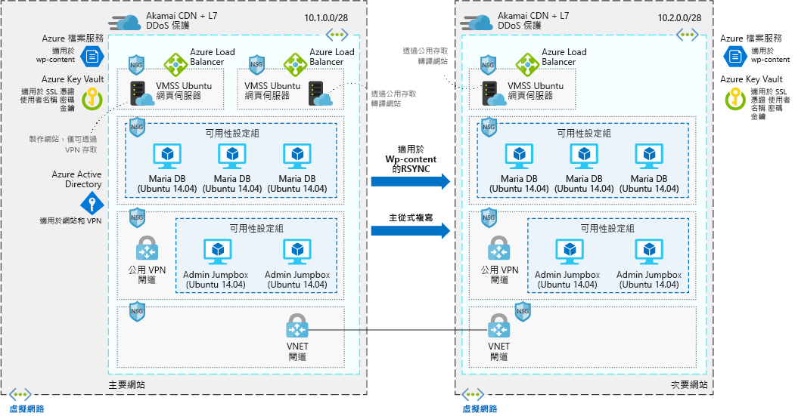

# 高擴充性且安全的 WordPress 網站Highly scalable and secure WordPress website

此範例案例適用於需要高擴充性且安全的 WordPress 安裝的公司。This example scenario is applicable to companies that need a highly scalable and secure installation of WordPress. 此案例是以下列部署為基礎：使用於大型會議，而且擴充成功以符合工作階段送至網站的尖峰流量。This scenario is based on a deployment that was used for a large convention and was successfully able to scale to meet the spike traffic that sessions drove to the site.

## 相關使用案例Relevant use cases

其他相關的使用案例包括：Other relevant use cases include:

- 導致流量激增的媒體事件。Media events that cause traffic surges.
- 使用 WordPress 作為其內容管理系統的部落格。Blogs that use WordPress as their content management system.
- 使用 WordPress 的商務或電子商務網站。Business or e-commerce websites that use WordPress.
- 使用其他內容管理系統建置的網站。Web sites built using other content management systems.

## 架構Architecture

此案例涵蓋使用 Ubuntu 網頁伺服器和 MariaDB 的 WordPress 安裝，這是可擴充且安全的安裝。This scenario covers a scalable and secure installation of WordPress that uses Ubuntu web servers and MariaDB. 此案例中有兩個不同的資料流，第一個是使用者存取網站：There are two distinct data flows in this scenario the first is users access the website:

1. 使用者會透過 CDN 存取前端網站。Users access the front-end website through a CDN.
2. CDN 會使用 Azure 負載平衡器作為原點，並提取任何不是從這裡快取的資料。The CDN uses an Azure load balancer as the origin, and pulls any data that isn't cached from there.
3. Azure 負載平衡器會將要求散發到網頁伺服器的虛擬機器擴展集。The Azure load balancer distributes requests to the virtual machine scale sets of web servers.
4. WordPress 應用程式會從 Maria DB 叢集中提取任何動態資訊，而所有靜態內容裝載在 Azure 檔案服務中。The WordPress application pulls any dynamic information out of the Maria DB clusters, all static content is hosted in Azure Files.
5. SSL 金鑰會儲存在 Azure Key Vault 中。SSL keys are stored Azure Key Vault.

第二個工作流程是作者如何參與新的內容：The second workflow is how authors contribute new content:

1. 作者可安全地連線到公用 VPN 閘道。Authors connect securely to the public VPN gateway.
2. VPN 驗證資訊會儲存在 Azure Active Directory 中。VPN authentication information is stored in Azure Active Directory.
3. 然後建立系統管理 Jumpbox 的連線。A connection is then established to the Admin jump boxes.
4. 從系統管理 Jumpbox，作者就能夠連線到撰寫叢集的 Azure 負載平衡器。From the admin jump box, the author is then able to connect to the Azure load balancer for the authoring cluster.
5. Azure 負載平衡器會將流量散發到網頁伺服器的虛擬機器擴展集，而這些擴展集具有 Maria DB 叢集的寫入存取權。The Azure load balancer distributes traffic to the virtual machine scale sets of web servers that have write access to the Maria DB cluster.
6. 新的靜態內容回上傳至 Azure 檔案，並動態內容會寫入到 Maria DB 叢集中。New static content is uploaded to Azure files and dynamic content is written into the Maria DB cluster.
7. 然後，這些變更會透過 rsync 或主從式複寫來複寫到替代區域。These changes are then replicated to the alternate region via rsync or master/slave replication.

### 元件Components

- [Azure 內容傳遞網路 (CDN)](/azure/cdn/cdn-overview) 是可有效率地將 Web 內容傳遞給使用者的分散式伺服器網路。[Azure Content Delivery Network (CDN)](/azure/cdn/cdn-overview) is a distributed network of servers that efficiently delivers web content to users. CDN 會將快取的內容儲存在使用者附近存在點 (POP) 位置的邊緣伺服器上，以將延遲降至最低。CDNs minimize latency by storing cached content on edge servers in point-of-presence locations near to end users.
- [虛擬網路](/azure/virtual-network/virtual-networks-overview)可讓 VM 等資源安全地互相通訊，以及與網際網路和內部部署網路通訊。[Virtual networks](/azure/virtual-network/virtual-networks-overview) allow resources such as VMs to securely communicate with each other, the Internet, and on-premises networks. 虛擬網路會提供隔離與分割、篩選與路由流量，並允許位置之間的連線。Virtual networks provide isolation and segmentation, filter and route traffic, and allow connection between locations. 這兩個網路是透過 VNet 對等互連進行連線。The two networks are connected via Vnet peering.
- [網路安全性群組 (NSG)](/azure/virtual-network/security-overview) 包含一些安全性規則，可根據來源或目的地 IP 位址、連接埠和通訊協定允許或拒絕輸入或輸出網路流量。[Network security groups](/azure/virtual-network/security-overview) contain a list of security rules that allow or deny inbound or outbound network traffic based on source or destination IP address, port, and protocol. 此案例中的虛擬網路會受到網路安全性群組規則保護，這些規則會限制應用程式元件之間的流量。The virtual networks in this scenario are secured with network security group rules that restrict the flow of traffic between the application components.
- [負載平衡器](/azure/load-balancer/load-balancer-overview)會根據規則和健康情況探查來散發輸入流量。[Load balancers](/azure/load-balancer/load-balancer-overview) distribute inbound traffic according to rules and health probes. 對於所有 TCP 和 UDP 應用程式，負載平衡器可提供低延遲和高輸送量，且最多可相應增加為數百萬個流程。A load balancer provides low latency and high throughput, and scales up to millions of flows for all TCP and UDP applications. 此案例會使用負載平衡器，將流量從內容傳遞網路散發到前端網頁伺服器。A load balancer is used in this scenario to distribute traffic from the content deliver network to the front-end web servers.
- [虛擬機器擴展集][docs-vmss]可讓您建立和管理一組負載平衡的相同 VM。[Virtual machine scale sets][docs-vmss] let you create and manage a group of identical load-balanced VMs. VM 執行個體的數目可以自動增加或減少，以因應需求或已定義的排程。The number of VM instances can automatically increase or decrease in response to demand or a defined schedule. 此案例中使用兩個不同的虛擬機器擴展集 - 一個適用於提供內容的前端網頁伺服器，另一個則適用於用來撰寫新內容的前端網頁伺服器。Two separate virtual machine scale sets are used in this scenario - one for the front-end web-servers serving content, and one for the front-end webservers used to author new content.
- [Azure 檔案服務](/azure/storage/files/storage-files-introduction)會在雲端提供完全受控的檔案共用，以裝載此案例中的所有 WordPress 內容，讓所有 VM 都能存取資料。[Azure Files](/azure/storage/files/storage-files-introduction) provides a fully-managed file share in the cloud that hosts all of the WordPress content in this scenario, so that all of the VMs have access to the data.
- [Azure Key Vault](/azure/key-vault/key-vault-overview) 用來儲存密碼、憑證和金鑰，並嚴密控制其存取權。[Azure Key Vault](/azure/key-vault/key-vault-overview) is used to store and tightly control access to passwords, certificates, and keys.
- [Azure Active Directory (Azure AD)](/azure/active-directory/fundamentals/active-directory-whatis) 是多租用戶雲端式目錄和身分識別管理服務。[Azure Active Directory (Azure AD)](/azure/active-directory/fundamentals/active-directory-whatis) is a multi-tenant, cloud-based directory and identity management service. 在此案例中，Azure AD 會為網站與 VPN 通道提供驗證服務。In this scenario, Azure AD provides authentication services for the website and the VPN tunnels.

### 替代項目Alternatives

- [適用於 Linux 的 SQL Server](/azure/virtual-machines/linux/sql/sql-server-linux-virtual-machines-overview) 可取代 MariaDB 資料存放區。[SQL Server for Linux](/azure/virtual-machines/linux/sql/sql-server-linux-virtual-machines-overview) can replace the MariaDB data store.
- 如果您偏好完全受控的解決方案，[適用於 MySQL 的 Azure 資料庫](/azure/mysql/overview)即可取代 MariaDB 資料存放區。[Azure database for MySQL](/azure/mysql/overview) can replace the MariaDB data store if you prefer a fully managed solution.

## 考量Considerations

### 可用性Availability

此案例中的 VM 執行個體會部署於多個區域，其 WordPress 內容的資料會透過 RSYNC 在兩個區域間複寫，而 MariaDB 叢集則採用主從式複寫。The VM instances in this scenario are deployed across multiple regions, with the data replicated between the two via RSYNC for the WordPress content and master slave replication for the MariaDB clusters.

如需其他可用性主題，請參閱 Azure Architecture Center 中的[可用性檢查清單][availability]。For other availability topics, see the [availability checklist][availability] in the Azure Architecture Center.

### 延展性Scalability

此案例會在每個區域中使用兩個前端網頁伺服器叢集的虛擬機器擴展集。This scenario uses virtual machine scale sets for the two front-end web server clusters in each region. 使用擴展集時，執行前端應用程式層的 VM 執行個體數目可以視回應客戶需求，或根據定義的排程來自動調整。With scale sets, the number of VM instances that run the front-end application tier can automatically scale in response to customer demand, or based on a defined schedule. 如需詳細資訊，請參閱[使用虛擬機器擴展集自動調整概觀][docs-vmss-autoscale]。For more information, see [Overview of autoscale with virtual machine scale sets][docs-vmss-autoscale].

後端是可用性設定組中的 MariaDB 叢集。The back end is a MariaDB cluster in an availability set. 如需詳細資訊，請參閱 [MariaDB 叢集教學課程][mariadb-tutorial]。For more information, see the [MariaDB cluster tutorial][mariadb-tutorial].

如需其他延展性主題，請參閱 Azure Architecture Center 中的[延展性檢查清單][scalability]。For other scalability topics, see the [scalability checklist][scalability] in the Azure Architecture Center.

### 安全性Security

所有流入前端應用程式層的虛擬網路流量都受到網路安全性群組的保護。All the virtual network traffic into the front-end application tier and protected by network security groups. 規則會限制流量，以便只有前端應用程式層 VM 執行個體可以存取後端資料庫層。Rules limit the flow of traffic so that only the front-end application tier VM instances can access the back-end database tier. 不允許資料庫層的輸出網際網路流量。No outbound Internet traffic is allowed from the database tier. 若要降低攻擊使用量，請勿開啟任何直接的遠端管理連接埠。To reduce the attack footprint, no direct remote management ports are open. 如需詳細資訊，請參閱 [Azure 網路安全性群組][docs-nsg]。For more information, see [Azure network security groups][docs-nsg].

如需設計安全案例的一般指引，請參閱 [Azure 安全性文件][security]。For general guidance on designing secure scenarios, see the [Azure Security Documentation][security].

### 災害復原Resiliency

此案例結合使用多個區域、資料複寫和虛擬機器擴展集，所以會使用 Azure 負載平衡器。In combination with the use of multiple regions, data replication and virtual machine scale sets, this scenario uses Azure load balancers. 這些網路元件會將流量散發至已連線的 VM 執行個體，並包含健康情況探查，可確保流量只會散發到狀況良好的 VM。These networking components distribute traffic to the connected VM instances, and include health probes that ensure traffic is only distributed to healthy VMs. 上述所有網路元件都會透過 CDN 成為前端。All of these networking components are fronted via a CDN. 這會讓網路資源和應用程式有彈性地處理問題，否則會中斷流量並影響使用者存取。This makes the networking resources and application resilient to issues that would otherwise disrupt traffic and impact end-user access.

如需設計彈性案例的一般指引，請參閱[為 Azure 設計有彈性的應用程式][resiliency]。For general guidance on designing resilient scenarios, see [Designing resilient applications for Azure][resiliency].

## 價格Pricing

為了探索執行此案例的成本，所有服務會在成本計算機中預先設定。To explore the cost of running this scenario, all of the services are pre-configured in the cost calculator. 若要查看價格如何針對您的特定使用案例而變更，請變更適當的變數，以符合您預期的流量。To see how the pricing would change for your particular use case, change the appropriate variables to match your expected traffic.

我們根據上面所提供的架構圖，提供了預先設定的[成本設定檔][pricing]。We have provided a pre-configured [cost profile][pricing] based on the architecture diagram provided above. 若要針對您的使用情況設定定價計算機，請考量下列幾個主要事項：To configure the pricing calculator for your use case, there are a couple main things to consider:

- 您預期有多少流量 (以 GB/月表示)？How much traffic are you expecting in terms of GB/month? 流量會對您的成本造成最大影響，因為它會影響必須在虛擬機器擴展集中呈現資料的 VM 數目。The amount of traffic will have the biggest impact on your cost, as it will impact the number of VMs that are required to surface the data in the virtual machine scale set. 此外，它會直接與透過 CDN 呈現的資料量相互關聯。Additionally, it will directly correlate with the amount of data that is surfaced via the CDN.
- 您即將在您的網站上撰寫多少新資料？How much new data are you going to be writing to your website? 寫入至您網站的新資料會與跨區域鏡像處理多少資料相互關聯。New data written to your website correlates with how much data is mirrored across the regions.
- 您有多少動態內容？How much of your content is dynamic? 多少靜態內容？How much is static? 動態和靜態內容間的差異會影響必須從資料庫層擷取多少資料，以及要在 CDN 中快取多少資料。The variance around dynamic and static content influences how much data has to be retrieved from the database tier versus how much will be cached in the CDN.

<!-- links -->
[architecture]: ./media/architecture-secure-scalable-wordpress.png
[mariadb-tutorial]: /azure/virtual-machines/linux/classic/mariadb-mysql-cluster
[docs-vmss]: /azure/virtual-machine-scale-sets/overview
[docs-vmss-autoscale]: /azure/virtual-machine-scale-sets/virtual-machine-scale-sets-autoscale-overview
[docs-nsg]: /azure/virtual-network/security-overview
[security]: /azure/security/
[availability]: ../../checklist/availability.md
[resiliency]: /azure/architecture/resiliency/
[scalability]: /azure/architecture/checklist/scalability
[pricing]: https://azure.com/e/a8c4809dab444c1ca4870c489fbb196b
