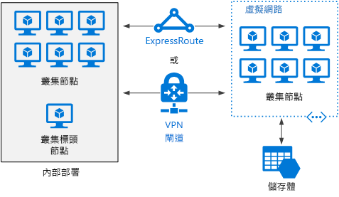

# 大量計算架構樣式

「大量計算」一詞描述需要大量核心 (通常數以千、百計) 的大型工作負載。 案例包括影像轉譯、流體動態、財務風險模型、石油探勘、藥物設計、工程壓力分析，當然還有其他的。

以下是大量計算應用程式的一些 典型特性：

- 工作可以分割成多個離散的工作，這些工作可以同時分散到許多核心上執行。
- 每個工作有限。 它會取得一些輸入、執行一些處理、並產生輸出。 整個應用程式會執行一段有限的時間 (幾分鐘至幾天)。 常見的模式是佈建一批數量龐大的核心，然後在應用程式完成後停轉至零。 
- 應用程式不需要全年無休。 不過，系統必須處理節點失敗或應用程式當機。
- 某些應用程式的工作是獨立的，而且可平行執行。 其他應用程式的工作會緊密結合，這表示它們必須互動或交換中繼結果。 在此情況下，請考慮使用高速網路技術，例如 InfiniBand 和遠端直接記憶體存取 (RDMA)。 
- 根據您的工作負載，您應使用可應付大量計算的 VM 大小 (H16r、H16mr 和 A9)。

## 使用此架構的時機

- 計算密集的作業，例如模擬、數字密集運算。
- 會密集運算、必須分散在多部電腦 (10-1000 部) 之 CPU 的模擬。
- 會耗用一部電腦太多記憶體、必須分散在多部電腦的模擬。
- 若在單一電腦上完成會花太多時間的長時間執行計算。
- 必須執行 100 或 1000 次以上的小型計算，例如 Monte Carlo 模擬。

## 優點

- 運用 [embarrassingly parallel][embarrassingly-parallel] 處理而有高效能。
- 可以利用數百或數千部電腦核心，更快解決大型問題。
- 存取專門的高效能硬體，搭配專用的高速 InfiniBand 網路。
- 您可以視需要佈建 VM 來執行工作，然後終止它們。 

## 挑戰

- 管理 VM 基礎結構。
- 管理數字密集運算的磁碟區。 
- 適時佈建數千個核心。
- 針對緊密結合的工作，加入更多核心可以有些微回報。 您可能需要不斷實驗找出最佳的核心數目。

## 使用 Azure Batch 的大量計算

[Azure Batch][batch] 是受管理服務，可用於執行大規模的高效能運算 (HPC) 應用程式。

使用 Azure Batch，要設定 VM 集區，並上傳應用程式和資料檔案。 然後 Batch 服務會佈建 VM、將工作指派給 VM、執行工作，並監視進度。 Batch 可以自動相應放大 VM 來反應工作負載。 Batch 也提供作業排程。

 

## 虛擬機器上執行的大量計算

您可以使用 [Microsoft HPC Pack][hpc-pack] 管理 VM 的叢集，排程和監控 HPC 作業。 使用此方法時，您必須佈建和管理 VM 及網路基礎結構。 如果您有現有的 HPC 工作負載，而且想要將部分或全部工作負載移到 Azure，請考慮這種方法。 您可以將整個 HPC 叢集移到 Azure，或將 HPC 叢集放在內部部署，但是使用 Azure 處理暴增產能。 如需詳細資訊，請參閱[大規模運算工作負載的 Batch 和 HPC 解決方案][batch-hpc-solutions]。

### 部署至 Azure 的 HPC Pack

在此案例中，HPC 叢集整個建立在 Azure 中。

 
 
前端節點提供叢集的管理和作業排程服務。 如為緊密結合的工作，使用 RDMA 網路在 VM 之間提供高頻寬、低延遲的通訊。 如需詳細資訊，請參閱[在 Azure 中部署 HPC Pack 2016 叢集][deploy-hpc-azure]。

### 將 HPC 叢集暴增的工作負載移至 Azure

此案例中，組織是在內部部署執行 HPC Pack，並使用 Azure VM 處理暴增產能。 叢集前端節為內部部署。 ExpressRoute 或 VPN 閘道會將您的內部部署網路連線至 Azure VNet。

 

[batch]: /azure/batch/
[batch-hpc-solutions]: /azure/batch/batch-hpc-solutions
[deploy-hpc-azure]: /azure/virtual-machines/windows/hpcpack-2016-cluster
[embarrassingly-parallel]: https://en.wikipedia.org/wiki/Embarrassingly_parallel
[hpc-pack]: https://technet.microsoft.com/library/cc514029

 
