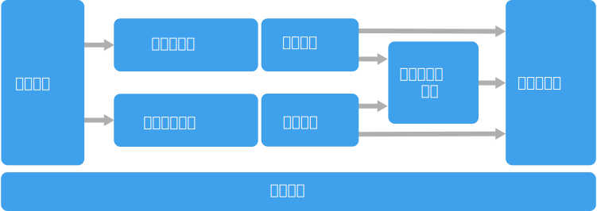

# 巨量資料架構樣式

巨量資料架構的設計，可處理對於傳統資料庫系統而言太大或太複雜之資料的擷取、處理和分析。

 巨量資料的解決方案通常會涉及一或多個下列類型的工作負載：

- 待用之巨量資料來源的批次處理。
- 移動中之巨量資料的即時處理。
- 巨量資料的互動式探索。
- 預測性分析和機器學習。

巨量資料的架構大多包括下列的部分或所有元件：

- **資料來源**：所有的巨量資料解決方案都是從一個或多個資料來源來做為開端。 範例包括：

    - 應用程式資料存放區，例如關聯式資料庫。
    - 應用程式所產生的靜態檔案，例如 Web 伺服器記錄檔。
    - 即時資料來源，例如 IoT 裝置。

- **資料存放區**：要進行批次處理作業的資料通常儲存在分散式檔案存放區，以便能夠保存大量具有不同格式的大型檔案。 這種存放區通常稱為「資料湖」。 可供實作此儲存體的選項包含 Azure Data Lake Store 或 Azure 儲存體中的 Blob 容器。 

- **批次處理**：由於資料集是如此龐大，巨量資料解決方案通常必須使用需要長時間執行的批次作業來處理資料檔案，以便篩選、彙總和準備資料以供分析。 這些作業通常涉及讀取原始程式檔、加以處理，然後將輸出寫入至新的檔案。 選項包括在 Azure Data Lake Analytics 中執行 U-SQL 作業、在 HDInsight Hadoop 叢集中使用 Hive、Pig 或自訂的 Map/Reduce 作業，或是在 HDInsight Spark 叢集中使用 Java、Scala 或 Python 程式。

- **即時訊息擷取**：如果解決方案中包含即時來源，則架構中必須有方法可擷取和儲存即時訊息以進行串流處理。 這可能是簡單的資料存放區，內送訊息會放入資料夾處理。 不過，許多解決方案需要有訊息擷取存放區，以做為訊息的緩衝區，以及支援相應放大處理、可靠的傳遞和其他訊息佇列語意。 選項包括 Azure 事件中樞、Azure IoT 中樞和 Kafka。

- **串流處理**：在擷取即時訊息後，解決方案必須經由篩選、彙總和準備要分析的資料，以便處理這些資料。 已處理的串流資料接著會寫入至輸出接收器。 Azure 串流分析會根據永久執行的 SQL 查詢 (會針對未繫結資料流進行操作) 提供受控串流處理服務。 您也可以使用開放原始碼的 Apache 串流技術，例如 HDInsight 叢集中的 Storm 和 Spark 串流。

- **分析資料存放區**：許多巨量資料解決方案會準備資料以供分析，然後以可使用分析工具來查詢的結構化格式提供處理過的資料。 用來提供這些查詢的分析資料存放區可以是 Kimball 樣式的關聯式資料倉儲，如同我們在大部分的傳統商業智慧 (BI) 解決方案所看見的。 或者，我們也可以透過低延遲的 NoSQL 技術 (例如 HBase) 或是互動式 Hive 資料庫 (可針對分散式資料存放區中的資料檔案提供中繼資料擷取) 來呈現資料。 Azure SQL 資料倉儲可提供受控服務供大規模的雲端式資料倉儲使用。 HDInsight 則支援互動式 Hive、HBase 和 Spark SQL，它們也可用來提供要分析的資料。

- **分析和報告**：大部分巨量資料解決方案的目標，是要透過分析和報告提供資料的深入見解。 為了讓使用者能夠分析資料，架構中可能要包括資料模型化層，例如 Azure Analysis Services 中的多維度 OLAP Cube 或表格式資料模型。 架構也可能會支援自助商業智慧，其使用的是 Microsoft Power BI 或 Microsoft Excel 中的模型化和視覺效果技術。 分析和報告也可供資料科學家或資料分析師透過互動方式瀏覽資料。 針對這些案例，許多 Azure 服務支援了分析筆記本 (例如 Jupyter)，讓這些使用者能夠利用其現有的技巧來使用 Python 或 R。若要瀏覽大規模的資料，您可以使用 Microsoft R Server (不論是獨立使用或搭配 Spark 來使用)。

- **協調流程**：大部分的巨量資料解決方案都包含重複的資料處理作業並封裝在工作流程中，這些作業會轉換來源資料、在多個來源和接收器之間移動資料、將處理過的資料載入分析資料存放區，或將結果直接推送到報告或儀表板。 若要讓這些工作流程自動執行，您可以使用協調流程技術，例如 Azure Data Factory 或 Apache Oozie 和 Sqoop。

Azure 會納入許多可用於巨量資料架構的服務。 這些服務大致分為兩類：

- 受控服務，包括 Azure Data Lake Store、Azure Data Lake Analytics、Azure 資料倉儲、Azure 串流分析、Azure 事件中樞、Azure IoT 中樞和 Azure Data Factory。
- 以 Apache Hadoop 平台為基礎的開放原始碼技術，包括 HDFS、HBase、Hive、Pig、Spark、Storm、Oozie、Sqoop 和 Kafka。 在 Azure 中，您可在 Azure HDInsight 服務中使用這些技術。

這些選項不會互斥，而且有許多解決方案會將開放原始碼技術與 Azure 服務互相結合。

## 使用此架構的時機

當您有下列需求時，請考慮使用此架構樣式：

- 要儲存和處理的資料數量對於傳統資料庫來說太大時。
- 要轉換非結構化資料以進行分析和報告。
- 要以即時或低延遲的方式擷取、處理和分析未繫結的資料串流。
- 要使用 Azure Machine Learning 或 Microsoft 認知服務。

## 優點

- **技術選擇**。 您可以在 HDInsight 叢集混合使用 Azure 受控服務和 Apache 技術，以利用現有的技術或技術投資。
- **透過平行處理原則獲得效能**。 巨量資料解決方案會利用平行處理原則，來實現規模可應付大量資料的高效能解決方案。
- **彈性調整**。 巨量資料架構中的所有元件都支援相應放大佈建，因此您可以將您的解決方案調整為支援小型或大型工作負載，只針對您所使用的資源支付費用。
- **與現有解決方案互通**。 巨量資料架構的元件也可用於 IoT 處理和企業 BI 解決方案，讓您建立可跨資料工作負載來進行作業的整合式解決方案。

## 挑戰

- **複雜度**。 巨量資料解決方案相當複雜，內含許多元件以便處理從多個資料來源擷取資料的作業。 建置、測試和疑難排解巨量資料處理程序並不容易。 此外，可能還要跨多個系統進行大量設定，因為您必須使用這些系統才能獲得最佳效能。
- **技能集**。 許多巨量資料技術都是極為專門的，會使用較為一般的應用程式架構所不常使用的框架和語言。 另一方面，巨量資料技術會發展新的 API 並以更知名的語言為基礎來建置。 例如，Azure Data Lake Analytics 中的 U-SQL 語言是以 Transact-SQL 和 C# 兩相結合為基礎。 同樣地，SQL 型 API 適用於 Hive、HBase 和 Spark。
- **技術成熟度**。 巨量資料中所使用的諸多技術會不斷進化。 雖然核心的 Hadoop 技術 (例如 Hive 和 Pig) 已穩定下來，但 Spark 之類的新興技術會在它的每個新版本中引進大量變更和增強功能。 相較於其他 Azure 服務，Azure Data Lake Analytics 和 Azure Data Factory 等受控服務發展時間相對較短，因此很可能會隨著時間而不斷進化。
- **安全性**。 巨量資料解決方案通常依賴將所有靜態資料儲存在集中的資料湖中。 要保護這項資料的存取權並不容易，尤其是在必須由多個應用程式和平台擷取並取用這項資料時。

## 最佳作法

- **利用平行處理原則**。 大多數的巨量資料處理技術會將工作負載分散到多個處理單元。 靜態資料檔案必須以可分割的格式建立並儲存，才能予以分散。 HDFS 之類的分散式檔案系統可以將讀取和寫入的效能最佳化，並由多個叢集節點以平行方式進行實際的處理，以便減少整體作業時間。

- **分割資料**。 批次處理通常會以週期性排程進行，例如每週或每月。 請根據符合處理排程的時態性期間分割資料檔案和資料結構，例如資料表。 這麼做可簡化資料擷取和作業排程，並可讓您更輕鬆地針對失敗進行疑難排解。 此外，對 Hive、U-SQL 或 SQL 查詢中使用的資料表進行分割還能大幅改進查詢效能。

- **套用「讀取時的結構描述」語意**。 使用資料湖可讓您結合多種格式之檔案所使用的儲存體，不論這些格式是結構化、半結構化還是非結構化。 請使用「讀取時的結構描述」語意，這種語意會在處理資料時 (而非在儲存資料時) 將結構描述投影至資料。 這會讓解決方案獲得彈性，並防止資料擷取期間因為資料驗證和類型檢查所造成的瓶頸。

- **就地處理資料**。 傳統的 BI 解決方案通常會使用擷取、轉換和載入 (ETL) 程序將資料移到資料倉儲。 擁有較大量資料和格式種類更多的巨量資料解決方案，則一般會使用 ETL 的變化形式，例如轉換、擷取和載入 (TEL)。 在使用這個方法時，資料會在分散式的資料存放區中處理，轉換為必要結構，然後再將轉換後的資料移到分析資料存放區中。

- **在使用量和時間成本之間取得平衡**。 對於批次處理作業，請務必考慮兩個因素：計算節點的單位成本，以及使用這些節點來完成作業的每分鐘成本。 例如，批次作業可能需要使用四個叢集節點花費八個小時的時間來完成。 但結果可能是，該項作業只在前兩個小時用到這四個節點，之後就只需要兩個節點。 在此情況下，於兩個節點上執行整個作業會增加總作業時間，但不會讓時間加倍，因此總成本會比較少。 在某些商務案例中，使用者可能寧願花費較長的處理時間，也不願使用未充分利用的叢集資源而付出較高的成本。

- **叢集資源**。 在部署 HDInsight 叢集時，您一般可以藉由為每種類型的工作負載佈建個別的叢集資源，而實現更好的效能。 例如，雖然 Spark 叢集會納入 Hive，但如果您需要使用 Hive 和 Spark 來執行廣泛的處理，請考慮部署個別的專用 Spark 和 Hadoop 叢集。 同樣地，如果您要使用 HBase 和 Storm 來處理低延遲的串流處理，並使用 Hive 來進行批次處理，請考慮為 Storm、HBase 和 Hadoop 部署個別的叢集。

- **協調資料擷取**。 在某些情況下，現有的商務應用程式可能會直接在 Azure 儲存體 Blob 容器中撰寫要進行批次處理的資料檔案，讓這些檔案在其中供 HDInsight 或 Azure Data Lake Analytics 取用。 不過，您通常需要協調從內部部署或外部資料來源將資料擷取到資料湖的作業。 請使用協調工作流程或管線 (例如 Azure Data Factory 或 Oozie 所支援的項目)，以可預測且可集中管理的方式達到這個目的。

- **及早刪除敏感性資料**。 資料擷取工作流程應該在程序中及早刪除敏感性資料，以免將資料儲存到資料湖。

## IoT 架構

物聯網 (IoT) 是巨量資料解決方案的特定子集。 下圖顯示 IoT 可能的邏輯架構。 此圖強調架構的事件串流元件。

**雲端閘道**會使用可靠、低延遲的傳訊系統在雲端邊界擷取裝置事件。

裝置可能會將事件直接傳送到雲端閘道，或透過**現場閘道**來傳送。 現場閘道是專用的裝置或軟體，通常會與裝置共置，以便接收事件並將它們轉送到雲端閘道。 現場閘道可能也會前置處理未經處理的裝置事件，以執行篩選、彙總或通訊協定轉換等功能。

在擷取之後，事件會通過一個或多個**串流處理器**，這些處理器可以路由傳送資料 (例如，傳送到儲存體) 或執行分析和其他處理。

以下是一些常見的處理類型。 (此清單一定不怎麼詳盡)。

- 將事件資料寫入冷儲存體，以便封存或批次分析。

- 最忙碌路徑分析，(近乎) 即時地分析事件串流，以偵測異常行為、辨識滾動時間範圍的模式，或在串流中發生特定情況時觸發警示。 

- 處理裝置中特殊的非遙測訊息類型，例如通知和警示。 

- 機器學習。

深灰色的方塊顯示的是 IoT 系統中，與事件串流沒有直接關係，但為求完整所以在此納入的元件。

- **裝置登錄**是已佈建之裝置的資料庫，包括裝置識別碼，且通常會包括裝置中繼資料，例如位置。

- **佈建 API** 是常見用於佈建和註冊新裝置的外部介面。

- 某些 IoT 解決方案允許將**命令和控制訊息**傳送至裝置。

> 本節提供了極為高階的 IoT 檢視，其中有許多要考慮的微妙之處和挑戰。 如需更詳細的參考架構和討論，請參閱 [Microsoft Azure IoT 參考架構][ iot-ref-arch] (PDF 下載)。

 <!-- links -->

[iot-ref-arch]: https://azure.microsoft.com/updates/microsoft-azure-iot-reference-architecture-available/
